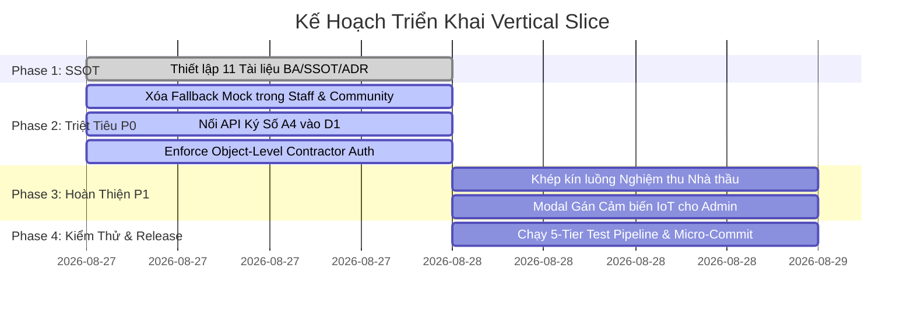

# DUSTGUARD VN — IMPLEMENTATION GAP REPORT & REMEDIATION PLAN

> **Báo Cáo Điểm Nghẽn Kỹ Thuật & Kế Hoạch Triển Khai Thực Tế (P0 ➔ P3)**  
> **Áp dụng**: Kim chỉ nam sửa lỗi theo từng Vertical Slice độc lập, cam kết Zero-Mock.

---

## 1. PHÂN LOẠI ƯU TIÊN & DANH MỤC LỖ HỔNG

### 🔴 P0 — LỖ HỔNG NGUY HIỂM & DỮ LIỆU FAKE/LOCAL STATE

#### GAP-P0-01: Fallback Fake Cases ID trong Staff & Community Modules
- **Hiện trạng**: Khi mạng chậm hoặc API rỗng, `StaffCases.jsx`, `StaffDashboard.jsx`, `CommunityCases.jsx` tự động fallback sang `mockCases = [{ id: 'CASE-2026-001', title: 'Bụi công trình Vành Đai 3' }]`.
- **Hành vi chuẩn (Expected)**: Hiển thị Spinner Loading ➔ Gọi API `/api/cases` D1 thật ➔ Nếu không có bản ghi nào thì hiển thị **Empty State** ("Chưa có hồ sơ vụ việc nào trong danh sách"), nếu lỗi thì hiển thị **Error Banner + Nút Thử Lại**.
- **Frontend File**: `app/src/modules/staff/StaffCases.jsx`, `app/src/modules/staff/StaffDashboard.jsx`, `app/src/modules/community/CommunityCases.jsx`
- **Backend File**: `app/server/routes/api/cases.js`, `app/server/worker.js`
- **DB Impact**: Truy vấn bảng `cases` với `deleted_at IS NULL`.
- **Giải pháp**: Xóa bỏ hoàn toàn biến mảng fake `mockCases` và logic `setCases(mockCases)`.

#### GAP-P0-02: Ký Số Văn Bản A4 Chỉ Thay Đổi State Cục Bộ (Client-Side Only)
- **Hiện trạng**: Trong `A4InteractiveEditor.jsx`, các nút "Phê duyệt" và "Ký số ban hành" chỉ gọi `setStatus('APPROVED')` hoặc `setStatus('SIGNED')` trong React state, F5 là mất.
- **Hành vi chuẩn (Expected)**: Gọi API `PATCH /api/documents/:id/sign`, sinh mã băm SHA-256 HMAC, cập nhật vào bảng `legal_documents` trong D1 và ghi `audit_logs`.
- **Frontend File**: `app/src/legal-document-engine/A4InteractiveEditor.jsx`
- **Backend File**: `app/server/routes/api/documents.js`, `app/server/worker.js`
- **DB Impact**: Bảng `legal_documents`, `audit_logs`.
- **Giải pháp**: Tích hợp hook mutation gọi API thật và hiển thị thông báo phản hồi từ D1.

#### GAP-P0-03: Thiếu Kiểm Tra Object-Level Quyền Nhà Thầu Trên Một Số API Submissions
- **Hiện trạng**: Một số API sửa chữa `remediation_actions` trên Express route chưa kiểm tra chặt chẽ `contractor_id` của user gửi lên so với `contractor_id` phụ trách công trình.
- **Hành vi chuẩn (Expected)**: Chặn truy cập và trả về `403 FORBIDDEN (RFC-7807)` nếu nhà thầu A cố tình gửi minh chứng cho công trình của nhà thầu B.
- **Frontend File**: `app/src/modules/contractor/ContractorActionDetail.jsx`
- **Backend File**: `app/server/routes/api/contractor.js`, `app/server/worker.js`
- **DB Impact**: Truy vấn bảo mật trên bảng `remediation_actions`.
- **Giải pháp**: Áp dụng middleware `requirePermission('remediation.submit_evidence')` và xác thực quyền sở hữu công trình.

---

### 🟡 P1 — LUỒNG NGHIỆP VỤ CỐT LÕI CHƯA ĐỒNG BỘ KHÉP KÍN

#### GAP-P1-01: Đồng Bộ Nghiệm Thu Minh Chứng Nhà Thầu Trên UI Staff
- **Hiện trạng**: Backend đã có `PATCH /api/contractor/actions/:id/review` nhưng trên UI `RemediationWorkspace.jsx` nút "Nghiệm thu Đạt" / "Yêu cầu làm lại" chưa truyền đúng payload `decision` và `rejection_reason`.
- **Hành vi chuẩn**: Thanh tra viên bấm duyệt ➔ Gọi API ➔ D1 cập nhật trạng thái `APPROVED` ➔ Case chuyển sang `RESOLVED` ➔ Nhà thầu thấy trạng thái đã hoàn tất trên cổng Contractor Portal.
- **Frontend File**: `app/src/modules/staff/RemediationWorkspace.jsx`
- **Backend File**: `app/server/routes/api/contractor.js`
- **Giải pháp**: Hoàn thiện Dialog nghiệm thu và kết nối hàm `handleReviewAction`.

#### GAP-P1-02: Hoàn Thiện Modal Gán Trạm Cảm Biến IoT Vào Công Trình
- **Hiện trạng**: API `POST /api/sensors/bind` đã có trong worker, nhưng trang `DataManagement.jsx` của Admin chưa có giao diện chọn thiết bị gán vào dự án.
- **Hành vi chuẩn**: Admin chọn 1 trạm IoT tự do ➔ Chọn công trình ➔ Bấm "Liên kết trạm đo" ➔ Gọi API cập nhật `devices.site_id` trong D1.
- **Frontend File**: `app/src/modules/admin/DataManagement.jsx`
- **Backend File**: `app/server/routes/api/sensors.js`
- **Giải pháp**: Thêm nút Action "Gán trạm đo" trong bảng danh sách Sites.

---

### 🟢 P2 — NÂNG CAO TRẢI NGHIỆM & ĐỒNG BỘ BẢN ĐỒ KHÔNG GIAN

#### GAP-P2-01: Tối Ưu Hóa Cache Bản Đồ Nhiệt Ô Nhiễm Không Gian WGS84
- **Hiện trạng**: Bản đồ `MapView.jsx` tải lại toàn bộ telemetry mỗi lần chuyển tab.
- **Hành vi chuẩn**: Sử dụng stale-while-revalidate và cache không gian bounding-box để giảm tải truy vấn D1.
- **Frontend File**: `app/src/components/MapView.jsx`, `app/src/lib/api/request.js`
- **Giải pháp**: Tối ưu hóa hook `useApiData` với thời gian cache 30s.

---

### ⚪ P3 — XUẤT BÁO CÁO ESG & BẢNG XẾP HẠNG THI ĐUA

#### GAP-P3-01: Xuất Báo Cáo Tổng Hợp DEMS/CSR Ra Định Dạng DOCX/PDF
- **Hiện trạng**: Đã có module tính điểm DEMS/GRI-304 trong `csr-engine.js`, cần hoàn thiện nút xuất văn bản chính thức cho Doanh nghiệp.
- **Frontend File**: `app/src/modules/executive/ExecutiveReports.jsx`
- **Backend File**: `app/server/routes/api/csr.js`
- **Giải pháp**: Kết nối exporter DOCX chuẩn mẫu báo cáo môi trường Việt Nam.

---

## 2. KẾ HOẠCH TRIỂN KHAI VERTICAL SLICE

