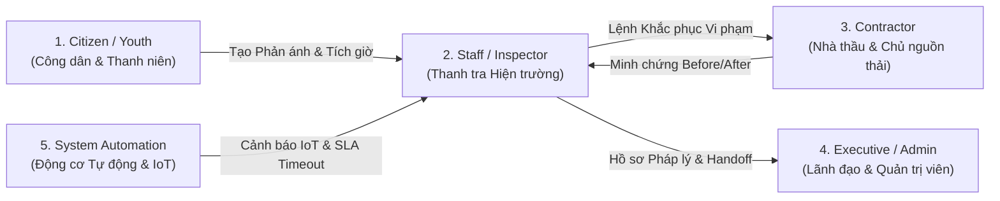

# DUSTGUARD VN — BA PRODUCT SPECIFICATION (SSOT)

> **Tài liệu Phân tích Nghiệp vụ & Đặc tả Yêu cầu Sản phẩm Chính thức**  
> **Nền tảng**: CivicTech Giám sát Môi trường & Bụi mịn Đô thị  
> **Cơ chế**: Dữ liệu thật D1 SQLite SSOT, Bằng chứng số R2 (SHA-256 HMAC), Quy chuẩn QCVN 05:2023/BTNMT

---

## 1. TỔNG QUAN SẢN PHẨM & TẦM NHÌN (PRODUCT GOAL)

**DustGuard VN** là nền tảng Công nghệ Công dân (CivicTech) kết hợp Thanh tra Môi trường số, Trao quyền cho Cộng đồng Thanh niên (CLB, Học sinh - Sinh viên, Tình nguyện viên) và Người dân để:
1. **Quan sát & Phản ánh (Observe)**: Thu thập dữ liệu thực tế về nguồn phát thải bụi mịn (công trình xây dựng, điểm đốt rác, bãi tập kết vật liệu) kèm tọa độ GPS và ảnh chụp xác thực.
2. **Thiết lập Minh chứng Pháp lý (Structured Evidence)**: Băm mã SHA-256 đối chứng Before/After, gắn thẻ quy chuẩn QCVN 05:2023/BTNMT không thể chối cãi.
3. **Theo dõi Liên tục (Follow-up over Time)**: Tự động hóa tiến độ xử lý, áp dụng SLA khắt khe (48h thanh tra, 72h khắc phục).
4. **Bàn giao Chuyển tuyến Minh bạch (Transparent Handoff)**: Đồng bộ hóa xử lý giữa Người dân ➔ Thanh tra Môi trường ➔ Nhà thầu thi công ➔ Lãnh đạo Đô thị ➔ Sở TNMT.

---

## 2. CÁC TÁC NHÂN HỆ THỐNG (PRODUCT ACTORS & PERSONAS)

### 2.1. Citizen & Youth (Công dân & Thanh niên tình nguyện)
- **Mục tiêu**: Nắm bắt chất lượng không khí quanh mình; báo cáo các điểm nóng ô nhiễm bụi; tham gia các chiến dịch vì môi trường; nhận Tín chỉ Thanh niên (20h = 4.0 tín chỉ) có chứng chỉ số.
- **Hành vi cốt lõi**:
  - Xem bản đồ nhiệt nồng độ bụi PM2.5/PM10 theo thời gian thực.
  - Gửi phản ánh (Observation) kèm ảnh chụp và tọa độ GPS.
  - Theo dõi chuỗi tiến độ phản ánh (Follow-up Timeline).
  - Tải Chứng Chỉ Xanh điện tử (Green Credit Certificate) mã hóa SHA-256 HMAC.

### 2.2. Staff / Inspector (Cán bộ Thanh tra Môi trường)
- **Mục tiêu**: Tiếp nhận hồ sơ vi phạm theo độ ưu tiên; kiểm tra thực địa theo checklist; lập biên bản vi phạm; ban hành yêu cầu khắc phục; nghiệm thu minh chứng Before/After.
- **Hành vi cốt lõi**:
  - Quản lý hàng đợi ưu tiên (Priority Queue) ứng dụng thuật toán Explainable Priority Score.
  - Kiểm tra thực địa (Field Inspection) theo quy chuẩn QCVN 05:2023/BTNMT.
  - Ban hành lệnh khắc phục (Remediation Order) và áp SLA 48h/72h cho nhà thầu.
  - Nghiệm thu hoặc từ chối giải trình minh chứng của nhà thầu.
  - Khởi tạo văn bản chuyển tuyến (Handoff Dossier) lên cơ quan quản lý cấp cao.

### 2.3. Contractor (Nhà thầu Xây dựng / Chủ nguồn phát thải)
- **Mục tiêu**: Nhận thông báo cảnh báo ô nhiễm; thực thi các biện pháp giảm thiểu bụi; nộp minh chứng khắc phục đúng hạn để tránh bị đình chỉ thi công hoặc phạt tiền ký quỹ ESG/DEMS.
- **Hành vi cốt lõi**:
  - Tiếp nhận lệnh khắc phục vi phạm môi trường.
  - Lập kế hoạch và cập nhật tiến độ xử lý (phun sương, phủ bạt, rửa xe).
  - Tải lên ảnh chụp đối chứng Before/After có băm SHA-256 và tọa độ Geofence 50m.
  - Theo dõi trạng thái giải ngân / phạt quỹ ký quỹ môi trường (CSR Escrow).

### 2.4. Executive & Administrator (Lãnh đạo Đô thị & Quản trị Hệ thống)
- **Mục tiêu**: Giám sát bản đồ rủi ro môi trường toàn thành phố; theo dõi hiệu suất thực thi của các đội thanh tra; quản trị phân quyền người dùng và danh mục hạ tầng quan trắc.
- **Hành vi cốt lõi**:
  - Xem Trung tâm Chỉ huy Điều hành (Command Center) với bản đồ nhiệt rủi ro không gian WGS84.
  - Phê duyệt các hồ sơ chuyển tuyến Handoff đặc biệt nghiêm trọng.
  - Quản lý Master Data (Công trình, Trạm IoT, Danh mục vi phạm, Người dùng).
  - Giám sát Quỹ Ký quỹ ESG/DEMS và Nhật ký Kiểm toán Bất biến (Audit Trail).

### 2.5. System Automation & IoT Engine (Hệ thống Tự động ngầm)
- **Mục tiêu**: Thu nhận dữ liệu quan trắc trạm IoT; tính điểm rủi ro tự động; phát hiện bất thường (Flatline/Spike); kích hoạt cảnh báo vượt ngưỡng và quét hạn SLA.
- **Hành vi cốt lõi**:
  - Tiếp nhận Telemetry cảm biến qua API bảo mật khóa thiết bị (Device Token).
  - Tự động chuyển đổi cảnh báo ô nhiễm sang Hồ sơ Vụ việc (Sensor Alert ➔ Case).
  - Tự động kích hoạt thông báo cảnh báo hạn SLA thanh tra / khắc phục.

---

## 3. MA TRẬN PHÂN HỆ CHỨC NĂNG TOÀN DIỆN (FEATURE MAP)

### 3.1. Phân Hệ Công Khai (Public Portal)
1. **Trang chủ Thông điệp & Tác động (Landing & Impact)**: Giới thiệu giải pháp CivicTech, chỉ số giám sát không khí tổng hợp toàn quốc, thống kê số giờ tình nguyện thanh niên.
2. **Bản đồ Chất lượng Không khí Công cộng (Public Air Quality Map)**: Bản đồ Leaflet/WGS84 hiển thị chỉ số AQI, PM2.5, PM10 theo mã màu quy chuẩn quốc gia, tích hợp Geolocation tìm trạm đo gần nhất.
3. **Cổng Tra Cứu Chứng Chỉ Xanh (Public Youth Certificate Verification)**: Nhập mã chứng chỉ hoặc quét QR để kiểm tra tính hợp lệ và chữ ký số SHA-256 HMAC của sinh viên/tình nguyện viên.

### 3.2. Phân Hệ Công Dân & Cộng Đồng (Citizen / Community Portal)
1. **Đăng Ký & Gửi Phản Ánh Ô Nhiễm (Create Observation)**:
   - Thu thập tọa độ GPS tự động (sai số cho phép <= 50m).
   - Phân loại nguồn thải: Bụi xây dựng, Đốt rác ngoài trời, Xe chở vật liệu rơi vãi, Bãi tập kết không che chắn.
   - Chụp/Upload ảnh chụp hiện trường, tự động nén và tạo mã băm SHA-256.
2. **Theo Dõi Tiến Độ Phản Ánh (Observation Tracker)**:
   - Xem dòng thời gian xử lý: Tiếp nhận ➔ Xác minh ➔ Chuyển giao thanh tra ➔ Đã khắc phục.
   - Thêm ảnh đóng góp diễn biến (Follow-up Evidence).
3. **Trung Tâm Tín Chỉ Thanh Niên (Youth Credit Hub)**:
   - Điểm danh tham gia chiến dịch làm sạch không khí, giờ quan trắc hiện trường.
   - Hệ thống tự động quy đổi: 20 giờ hợp lệ = 4.0 Tín chỉ rèn luyện.
   - Xuất file Chứng Chỉ Xanh điện tử chuẩn A4.

### 3.3. Phân Hệ Thanh Tra & Xử Lý Hiện Trường (Staff / Inspector Console)
1. **Hàng Đợi Vụ Việc Ưu Tiên (Priority Queue)**:
   - Sắp xếp thông minh theo điểm Explainable Priority Score (Dựa trên nồng độ bụi, mật độ dân cư quanh bán kính 500m, số lượng phản ánh trùng lặp, lịch sử vi phạm của công trình).
2. **Thanh Tra Thực Địa & Lập Biên Bản (Field Inspection)**:
   - Checklist kiểm tra 10 tiêu chí theo QCVN 05:2023/BTNMT.
   - Chụp ảnh vi phạm gắn thẻ Geofence thực địa.
   - Xác lập vi phạm chính thức (`VIOLATION_CONFIRMED`) hoặc đóng hồ sơ nếu không có cơ sở (`NO_VIOLATION_CLOSED`).
3. **Ban Hành Lệnh Khắc Phục (Remediation Order Management)**:
   - Giao việc trực tiếp cho Nhà thầu phụ trách công trình.
   - Thiết lập thời hạn SLA (24h - 48h - 72h tùy mức độ nghiêm trọng).
4. **Nghiệm Thu Đối Chứng Before/After (Remediation Verification)**:
   - So sánh trực quan hình ảnh vi phạm ban đầu và hình ảnh nhà thầu đã xử lý.
   - Đánh giá đạt yêu cầu (`RESOLVED`) hoặc bác bỏ yêu cầu làm lại (`REJECTED_RETRY`).
5. **Hồ Sơ Chuyển Tuyến (Civic Handoff Dossier)**:
   - Tự động đóng gói toàn bộ chuỗi chứng cứ, dữ liệu cảm biến, biên bản thanh tra thành file văn bản hành chính A4 chuẩn bị chuyển giao Sở TNMT / UBND.

### 3.4. Phân Hệ Nhà Thầu & Đơn Vị Thi Công (Contractor Portal)
1. **Bảng Điều Khiển Nhiệm Vụ Khắc Phục (Remediation Tasks)**:
   - Xem danh sách các cảnh báo vi phạm môi trường tại các dự án do nhà thầu đảm nhiệm.
   - Đếm ngược thời gian SLA xử lý vi phạm.
2. **Báo Cáo Tiến Độ & Nộp Minh Chứng (Evidence Submission)**:
   - Tải lên ảnh Before/After và biên bản tự kiểm tra.
   - Ghi chú các biện pháp dập bụi đã áp dụng (phun nước, quây lưới chắn bụi, rửa xe).
3. **Giám Sát Quỹ Ký Quỹ & Tuân Thủ ESG (CSR Escrow Dashboard)**:
   - Theo dõi trạng thái giải ngân quỹ bảo vệ môi trường định kỳ.
   - Cảnh báo khấu trừ ký quỹ nếu vi phạm quá hạn SLA 3 lần liên tiếp.

### 3.5. Phân Hệ Chỉ Huy & Quản Trị Hệ Thống (Executive Command & Admin)
1. **Trung Tâm Chỉ Huy Không Gian (Spatial Command Center)**:
   - Bản đồ rủi ro môi trường tổng thể WGS84 toàn đô thị.
   - Lớp phủ Geofence 50m quanh các công trình trọng điểm.
2. **Báo Cáo Hiệu Suất SLA & Tuân Thủ (SLA Compliance Analytics)**:
   - Đo lường thời gian trung bình tiếp nhận phản ánh và thời gian khắc phục vi phạm.
   - Phát hiện các điểm nghẽn thanh tra theo địa bàn quận/huyện.
3. **Quản Trị Danh Mục & Dữ Liệu Gốc (Master Data & User Management)**:
   - Quản trị tài khoản, cấp phát role RBAC (`citizen`, `staff`, `contractor`, `executive`, `admin`).
   - Quản lý công trình, nhà thầu, thiết bị trạm đo IoT và quy tắc kiểm định.
4. **Kiểm Toán Bất Biến (Immutable Audit Logs)**:
   - Xem toàn bộ lịch sử thao tác: Ai làm gì, lúc nào, thay đổi dữ liệu nào từ giá trị cũ sang giá trị mới.

---

## 4. QUY TẮC BẤT BIẾN NGHIỆP VỤ (CORE BUSINESS INVARIANTS)

1. **D1 là Nguồn Sự Thật Duy Nhất (D1 is SSOT)**: Toàn bộ dữ liệu nghiệp vụ phải được lưu trữ trong SQLite D1 (`env.DB`). Không dùng `localStorage` hay biến bộ nhớ client để giả lập trạng thái bền vững.
2. **Observation Khác Biệt Hoàn Toàn Với Case**:
   - `Observation`: Là quan trắc/phản ánh ban đầu từ cộng đồng/công dân.
   - `Case`: Là hồ sơ pháp lý chính thức được kích hoạt khi có căn cứ vi phạm luật môi trường.
3. **Hoạt Động Không Phụ Thuộc Cảm Biến (IoT is Optional)**: Hệ thống phải vận hành trơn tru 100% bằng chứng cứ thanh tra và phản ánh cộng đồng ngay cả khi không có cảm biến IoT nào được lắp đặt.
4. **AI Là Trợ Lý, Không Phải Thẩm Phán (AI is Assistant, Not Judge)**: AI chỉ hỗ trợ trích xuất điều luật, gợi ý điểm ưu tiên và phân loại văn bản; quyết định xử phạt vi phạm 100% thuộc về Cán bộ Thanh tra có thẩm quyền.
5. **Chuẩn Mực Thiết Kế CivicTech Tương Phản Cao (No Glassmorphism)**: Giao diện sáng màu, độ tương phản cao (`#FDFBF7` cream, `#231b14` ink, `#0d6f64` teal, `#9f241f` seal red), kích thước vùng chạm bấm tối thiểu 44px, hiển thị hoàn hảo từ màn hình di động 360px đến màn hình máy tính để bàn.
