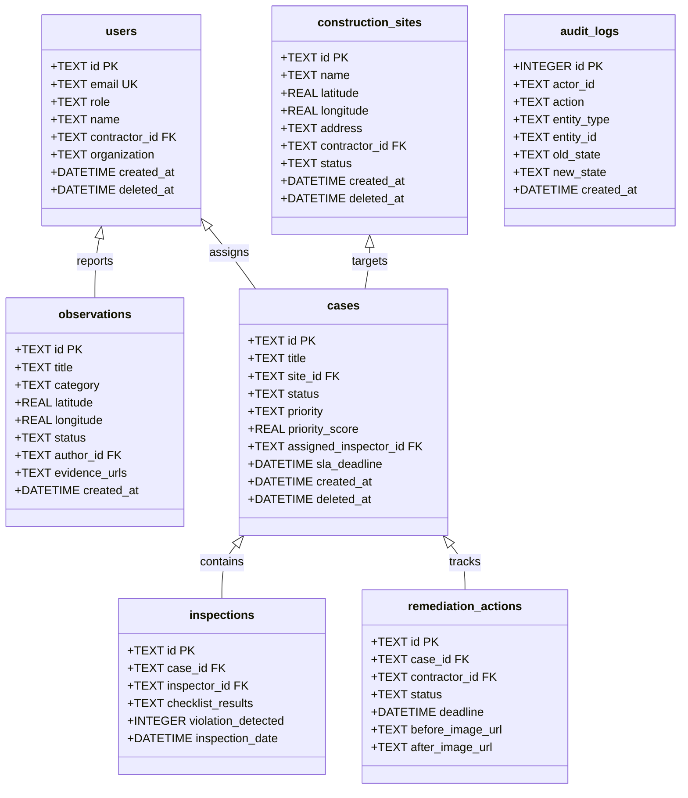

# DUSTGUARD VN — DATABASE ARCHITECTURE & SCHEMA SPECIFICATION (SSOT)

> **Đặc tả Cơ Sở Dữ Liệu Cloudflare D1 SQLite (SSOT)**  
> **Áp dụng**: Đồng bộ 100% qua các file Migrations (`app/migrations/0001` đến `0007`).

---

## 1. NGUYÊN TẮC CỐT LÕI D1 (CORE INVARIANTS)

1. **D1 là Nguồn Sự Thật Duy Nhất**: Mọi thao tác ghi (Create, Update, Delete) bắt buộc phải persist vào Cloudflare D1 SQLite (`env.DB` trên Worker hoặc `dev.db` trên local).
2. **Không Thay Đổi Dữ Liệu Bằng Hard Reset Phá Hủy**: Mọi thay đổi schema đều phải qua Migration file tuần tự (`0008_...sql`).
3. **Soft Delete Mặc Định**: Các thực thể kinh doanh chính (`construction_sites`, `cases`, `complaints`, `users`) sử dụng cờ `deleted_at DATETIME` để lưu vết kiểm toán.
4. **Không Gian Địa Lý WGS84**: Tọa độ được lưu dưới dạng 2 cột số thực chuẩn `latitude REAL` và `longitude REAL` kết hợp chỉ mục Bounding Box index phục vụ truy vấn bán kính lân cận Geofence 50m - 500m.

---

## 2. DANH MỤC 19 BẢNG D1 CHÍNH THỨC (TABLE SCHEMAS)



---

## 3. CHI TIẾT CẤU TRÚC CÁC BẢNG TRỌNG TÂM

### 3.1. Bảng `users` & Phân Quyền
```sql
CREATE TABLE IF NOT EXISTS users (
    id TEXT PRIMARY KEY,
    email TEXT UNIQUE NOT NULL,
    password_hash TEXT,
    name TEXT,
    role TEXT NOT NULL DEFAULT 'citizen' CHECK(role IN ('citizen', 'staff', 'contractor', 'executive', 'admin')),
    contractor_id TEXT,
    organization TEXT,
    phone TEXT,
    avatar_url TEXT,
    status TEXT NOT NULL DEFAULT 'active',
    created_at DATETIME DEFAULT CURRENT_TIMESTAMP,
    updated_at DATETIME DEFAULT CURRENT_TIMESTAMP,
    deleted_at DATETIME
);
CREATE INDEX IF NOT EXISTS idx_users_role ON users(role);
CREATE INDEX IF NOT EXISTS idx_users_contractor ON users(contractor_id);
```

### 3.2. Bảng `construction_sites` (Công Trình & Tọa Độ WGS84)
```sql
CREATE TABLE IF NOT EXISTS construction_sites (
    id TEXT PRIMARY KEY,
    name TEXT NOT NULL,
    code TEXT UNIQUE,
    address TEXT NOT NULL,
    latitude REAL NOT NULL,
    longitude REAL NOT NULL,
    contractor_id TEXT,
    investor_name TEXT,
    permit_number TEXT,
    status TEXT NOT NULL DEFAULT 'active' CHECK(status IN ('active', 'suspended', 'completed', 'inactive')),
    risk_level TEXT DEFAULT 'MEDIUM',
    created_at DATETIME DEFAULT CURRENT_TIMESTAMP,
    updated_at DATETIME DEFAULT CURRENT_TIMESTAMP,
    deleted_at DATETIME
);
CREATE INDEX IF NOT EXISTS idx_sites_spatial ON construction_sites(latitude, longitude);
CREATE INDEX IF NOT EXISTS idx_sites_status ON construction_sites(status);
```

### 3.3. Bảng `cases` (Hồ Sơ Vụ Việc Vi Phạm Môi Trường)
```sql
CREATE TABLE IF NOT EXISTS cases (
    id TEXT PRIMARY KEY,
    title TEXT NOT NULL,
    description TEXT,
    site_id TEXT REFERENCES construction_sites(id),
    observation_id TEXT,
    status TEXT NOT NULL DEFAULT 'NEW',
    priority TEXT NOT NULL DEFAULT 'MEDIUM' CHECK(priority IN ('LOW', 'MEDIUM', 'HIGH', 'CRITICAL')),
    priority_score REAL DEFAULT 50.0,
    assigned_inspector_id TEXT REFERENCES users(id),
    sla_deadline DATETIME,
    remediation_deadline DATETIME,
    closed_at DATETIME,
    closed_reason TEXT,
    is_reopened INTEGER DEFAULT 0,
    created_at DATETIME DEFAULT CURRENT_TIMESTAMP,
    updated_at DATETIME DEFAULT CURRENT_TIMESTAMP,
    deleted_at DATETIME
);
CREATE INDEX IF NOT EXISTS idx_cases_status_priority ON cases(status, priority_score DESC);
CREATE INDEX IF NOT EXISTS idx_cases_assigned ON cases(assigned_inspector_id);
CREATE INDEX IF NOT EXISTS idx_cases_site ON cases(site_id);
```

### 3.4. Bảng `sensor_telemetry` (Dữ Liệu Quan Trắc IoT)
```sql
CREATE TABLE IF NOT EXISTS sensor_telemetry (
    id INTEGER PRIMARY KEY AUTOINCREMENT,
    device_id TEXT NOT NULL,
    site_id TEXT,
    pm25 REAL NOT NULL,
    pm10 REAL NOT NULL,
    aqi INTEGER,
    temperature REAL,
    humidity REAL,
    noise_db REAL,
    raw_payload TEXT,
    is_anomaly INTEGER DEFAULT 0,
    recorded_at DATETIME DEFAULT CURRENT_TIMESTAMP
);
CREATE INDEX IF NOT EXISTS idx_telemetry_device_time ON sensor_telemetry(device_id, recorded_at DESC);
CREATE INDEX IF NOT EXISTS idx_telemetry_site_time ON sensor_telemetry(site_id, recorded_at DESC);
```

### 3.5. Bảng `youth_credits` & `youth_certificates` (Tín Chỉ & Chứng Chỉ Xanh)
```sql
CREATE TABLE IF NOT EXISTS youth_credits (
    id TEXT PRIMARY KEY,
    user_id TEXT NOT NULL REFERENCES users(id),
    campaign_id TEXT,
    hours REAL NOT NULL CHECK(hours > 0),
    credits REAL NOT NULL,
    verification_hash TEXT NOT NULL,
    created_at DATETIME DEFAULT CURRENT_TIMESTAMP
);

CREATE TABLE IF NOT EXISTS youth_certificates (
    id TEXT PRIMARY KEY,
    user_id TEXT NOT NULL REFERENCES users(id),
    certificate_code TEXT UNIQUE NOT NULL,
    student_name TEXT NOT NULL,
    organization TEXT NOT NULL,
    total_hours REAL NOT NULL,
    total_credits REAL NOT NULL,
    signature_hash TEXT NOT NULL,
    issued_at DATETIME DEFAULT CURRENT_TIMESTAMP,
    revoked_at DATETIME
);
CREATE INDEX IF NOT EXISTS idx_youth_cert_code ON youth_certificates(certificate_code);
```

### 3.6. Bảng `audit_logs` (Nhật Ký Kiểm Toán Bất Biến)
```sql
CREATE TABLE IF NOT EXISTS audit_logs (
    id INTEGER PRIMARY KEY AUTOINCREMENT,
    actor_id TEXT,
    actor_role TEXT,
    action TEXT NOT NULL,
    entity_type TEXT NOT NULL,
    entity_id TEXT NOT NULL,
    old_state TEXT,
    new_state TEXT,
    ip_address TEXT,
    user_agent TEXT,
    created_at DATETIME DEFAULT CURRENT_TIMESTAMP
);
CREATE INDEX IF NOT EXISTS idx_audit_entity ON audit_logs(entity_type, entity_id);
CREATE INDEX IF NOT EXISTS idx_audit_actor ON audit_logs(actor_id);
CREATE INDEX IF NOT EXISTS idx_audit_created ON audit_logs(created_at DESC);
```
