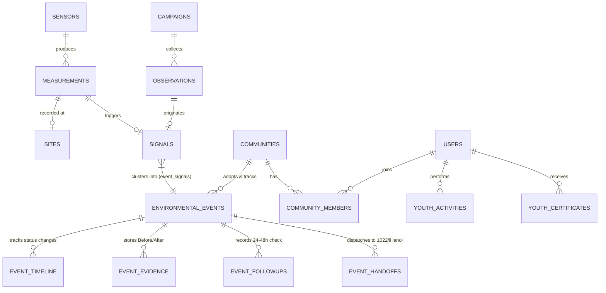

# DATA MODEL SSOT — ENVIRONMENTAL EVENT-CENTRIC SCHEMA

> **Single Source of Truth (SSOT) cho Kiến trúc Dữ liệu & Mô hình Quan hệ của DustGuard VN.**  
> Phiên bản: **v2.0 (Event-Centric Architecture)**  
> Nền tảng lưu trữ: **Cloudflare D1 (SQLite) — Zero-Mock Persistent Engine**

---

## 1. Triết Lý & Nguyên Tắc Thiết Kế (Core Invariants)

1. **Lấy 'Environmental Event' làm Trung Tâm**:
   - Thay thế hoàn toàn tư duy cũ *"hồ sơ vi phạm / xử phạt vi phạm"* (violation/sanction-centric).
   - DustGuard định vị là nền tảng CivicTech hỗ trợ cộng đồng **ghi nhận, kết nối dữ liệu đa nguồn, đối chứng thực địa và theo dõi diễn biến môi trường**.
   - Mọi thực thể xoay quanh việc phản ánh đúng thực tế khách quan, minh bạch hóa tiến trình cải thiện môi trường.

2. **Phân Định Rõ Ràng 3 Tầng Dữ Liệu (3-Tier Data Separation)**:
   ```text
   ┌─────────────────────────────────────────────────────────────┐
   │ TẦNG 1: MEASUREMENT (Bản ghi đo đạc thô)                    │
   │ Dữ liệu chuỗi thời gian từ cảm biến IoT, trạm đo, mẫu test │
   └──────────────────────────────┬──────────────────────────────┘
                                  │ (Vượt ngưỡng / Bất thường)
                                  ▼
   ┌─────────────────────────────────────────────────────────────┐
   │ TẦNG 2: SIGNAL (Dấu hiệu bất thường môi trường)             │
   │ Chỉ dấu phát hiện từ Telemetry Spike hoặc Observation       │
   └──────────────────────────────┬──────────────────────────────┘
                                  │ (Gom cụm / Nâng cấp sự kiện)
                                  ▼
   ┌─────────────────────────────────────────────────────────────┐
   │ TẦNG 3: EVENT (Sự kiện Môi trường - Core Aggregate Root)    │
   │ Hồ sơ theo dõi toàn diện, đối chứng Before/After, Handoff   │
   └─────────────────────────────────────────────────────────────┘
   ```

3. **Cloudflare D1 là SSOT Bất Biến**:
   - Mọi trạng thái và lịch sử chuyển dịch được lưu trữ bền vững trong D1 SQLite (`env.DB` trên Worker / `prisma/dev.db` trên Local).
   - Tuyệt đối không dùng `localStorage` của trình duyệt làm cơ sở dữ liệu.

4. **Bảo Toàn Minh Chứng (Tamper-Evident SHA-256)**:
   - Mọi tệp ảnh/tài liệu đính kèm đều được tính toán mã băm SHA-256 (Web Crypto API) nhằm đảm bảo tính toàn vẹn, chống chỉnh sửa sau khi ghi nhận.

---

## 2. Phân Định 3 Tầng Dữ Liệu Chi Tiết

| Đặc tính | Tầng 1: Measurement | Tầng 2: Signal | Tầng 3: Event (Aggregate Root) |
|---|---|---|---|
| **Bản chất** | Con số/giá trị thô đo được | Dấu hiệu bất thường có ngữ cảnh | Sự kiện môi trường có cấu trúc & vòng đời |
| **Nguồn sinh** | Cảm biến IoT, trạm đo, mẫu test | Thuật toán phân tích, cảnh báo, Observation | Gom cụm nhiều Signal hoặc duyệt từ 1 Signal lớn |
| **Tính phán đoán** | Hoàn toàn trung tính (0% phán đoán) | Có chỉ dấu nguy cơ (Chưa kết luận) | Hồ sơ tổng hợp có phân công & theo dõi |
| **Tần suất / Thể tích** | Rất cao (Time-series / Stream) | Trung bình (Khi có biến động) | Có chọn lọc (Cần hành động / theo dõi) |
| **Chu kỳ sống** | Append-only / Roll-up định kỳ | Active ➔ Aggregated / Dismissed | 11 Trạng thái chuẩn từ `detected` ➔ `closed` |
| **Bảng dữ liệu** | `measurements`, `sensor_readings` | `signals`, `signal_evidence`, `observations` | `environmental_events`, `event_timeline` |

---

## 3. Máy Trạng Thái Chuẩn Của Event (Event State Machine)

Một **Environmental Event** trải qua vòng đời gồm **11 trạng thái chuẩn**, phản ánh đúng bản chất phối hợp đa bên và thực địa CivicTech:

```text
               ┌──────────────┐
               │   detected   │ ◄── Khởi tạo từ Signal / Cụm Signal
               └──────┬───────┘
                      │
                      ▼
               ┌──────────────┐
       ┌───────┤ needs_review ├───────┐
       │       └──────┬───────┘       │
       │ (Hủy/Sai)    │ (Đạt sơ bộ)   │ (Trùng lặp)
       ▼              ▼               ▼
 ┌───────────┐ ┌──────────────┐ ┌───────────┐
 │ dismissed │ │ under_review │ │ dismissed │
 └───────────┘ └──────┬───────┘ └───────────┘
                      │
       ┌──────────────┴──────────────┐
       │ (Cần kiểm tra thực địa)     │ (Đã đủ căn cứ)
       ▼                             ▼
┌────────────────────┐      ┌─────────────────┐
│ needs_verification │ ────►│ verified_signal │
└────────────────────┘      └────────┬────────┘
                                     │
       ┌─────────────────────────────┴─────────────────────────────┐
       │ (Chuyển tiếp 1022/iHanoi/BQLDA)                           │ (CLB/Cộng đồng tự xử lý)
       ▼                                                           ▼
┌───────────┐                                            ┌────────────────────┐
│ forwarded │ ──────────────────────────────────────────►│ action_in_progress│
└───────────┘                                            └─────────┬──────────┘
                                                                   │
                                                                   ▼
                                                         ┌────────────────────┐
                                                         │     monitoring     │ ◄── Cửa sổ theo dõi 24h-48h
                                                         └─────────┬──────────┘
                                                                   │
                                                                   ▼
                                                         ┌────────────────────┐
                                                         │      resolved      │ ◄── Đối chứng Trước/Sau thành công
                                                         └─────────┬──────────┘
                                                                   │
                                                                   ▼
                                                         ┌────────────────────┐
                                                         │       closed       │ ◄── Cấp Green Credits & Lưu trữ
                                                         └────────────────────┘
```

### Danh mục 11 Trạng Thái Chi Tiết:

1. **`detected`** *(Mới phát hiện)*: Sự kiện vừa được hình thành từ một hoặc nhiều Signal (ví dụ: phát hiện chỉ số bụi tăng cao kèm ảnh chụp từ công dân).
2. **`needs_review`** *(Chờ duyệt)*: Cần Điều phối viên hoặc Quản trị viên cộng đồng kiểm tra tính hợp lệ ban đầu (ảnh rõ nét, vị trí hợp lệ).
3. **`under_review`** *(Đang xem xét)*: Đang trong quá trình đánh giá ngữ cảnh, rà soát lịch sử khu vực và phân loại mức độ ưu tiên.
4. **`needs_verification`** *(Cần xác minh thực địa)*: Thông tin ban đầu chưa đủ rõ, phân công tình nguyện viên/CLB khu vực đến đo kiểm hoặc chụp ảnh đối chứng.
5. **`verified_signal`** *(Đã xác thực)*: Tín hiệu và thông tin đã được kiểm chứng thực tế, cấu trúc hồ sơ đầy đủ căn cứ.
6. **`forwarded`** *(Đã chuyển tiếp)*: Hồ sơ số (Civic Dossier A4) đã được kết nối tới các kênh xử lý phù hợp (Tổng đài 1022, Cổng iHanoi, BQLDA hoặc Đơn vị phụ trách).
7. **`action_in_progress`** *(Đang xử lý)*: Hành động khắc phục đang diễn ra (nhà thầu rửa đường/che chắn bạt, CLB ra quân dọn dẹp hoặc cơ quan kiểm tra).
8. **`monitoring`** *(Đang theo dõi)*: Giai đoạn cộng đồng thực hiện **Follow-up target trong 24h - 48h** để đánh giá tình trạng môi trường sau xử lý.
9. **`resolved`** *(Đã giải quyết)*: Hiện trạng môi trường đã được cải thiện rõ rệt, có ảnh và số liệu đối chứng Before/After xác nhận.
10. **`closed`** *(Đã đóng hồ sơ)*: Toàn bộ quy trình hoàn tất, ghi nhận giờ tình nguyện (Green Credits) cho các bạn trẻ tham gia và lưu trữ lịch sử.
11. **`dismissed`** *(Đã hủy bỏ)*: Sự kiện bị loại bỏ do trùng lặp (duplicate), thông tin sai lệch hoặc không có căn cứ thực tế.

---

## 4. Đặc Tả D1 SQLite Schema (Chi Tiết Từng Bảng)

### 4.1. Tầng 1: Measurement Layer (Dữ liệu Đo đạc Thô)

```sql
-- 1. Measurements (Bản ghi chuỗi thời gian hoặc điểm đo thực tế)
CREATE TABLE IF NOT EXISTS "measurements" (
    "id" TEXT NOT NULL PRIMARY KEY,
    "device_id" TEXT,                               -- Khóa ngoại trỏ tới sensors (nếu có)
    "site_id" TEXT,                                 -- Khu vực hoặc điểm quan trắc
    "source_type" TEXT NOT NULL DEFAULT 'IOT_SENSOR',-- IOT_SENSOR, MANUAL_SAMPLE, OFFICIAL_STATION, SATELLITE
    "metric_type" TEXT NOT NULL,                   -- PM2_5, PM10, AQI, NO2, CO, TEMPERATURE, HUMIDITY, NOISE
    "value" REAL NOT NULL,                          -- Giá trị đo đạc
    "unit" TEXT NOT NULL DEFAULT 'µg/m³',          -- Đơn vị đo
    "recorded_at" DATETIME NOT NULL DEFAULT CURRENT_TIMESTAMP,
    "latitude" REAL,
    "longitude" REAL,
    "raw_payload_json" TEXT,                        -- Dữ liệu gốc từ sensor/thiết bị
    "created_at" DATETIME NOT NULL DEFAULT CURRENT_TIMESTAMP,
    CONSTRAINT "measurements_site_fkey" FOREIGN KEY ("site_id") REFERENCES "sites"("id") ON DELETE SET NULL
);

CREATE INDEX IF NOT EXISTS "idx_measurements_site_time" ON "measurements"("site_id", "recorded_at" DESC);
CREATE INDEX IF NOT EXISTS "idx_measurements_metric_time" ON "measurements"("metric_type", "recorded_at" DESC);
CREATE INDEX IF NOT EXISTS "idx_measurements_device" ON "measurements"("device_id", "recorded_at" DESC);
```

---

### 4.2. Tầng 2: Signal Layer (Dấu Hiệu Bất Thường)

```sql
-- 2. Signals (Dấu hiệu bất thường môi trường)
CREATE TABLE IF NOT EXISTS "signals" (
    "id" TEXT NOT NULL PRIMARY KEY,
    "signal_code" TEXT NOT NULL UNIQUE,             -- SIG-2026-XXXXX
    "signal_type" TEXT NOT NULL,                   -- TELEMETRY_SPIKE, COMMUNITY_OBSERVATION, SATELLITE_HOTSPOT, MULTI_SOURCE_CORRELATION
    "source_type" TEXT NOT NULL DEFAULT 'CITIZEN',  -- CITIZEN, YOUTH_CLUB, IOT_SENSOR, AUTOMATION_RULE, SATELLITE
    "category" TEXT NOT NULL DEFAULT 'CONSTRUCTION_DUST', -- CONSTRUCTION_DUST, OPEN_BURNING, WASTE_POLLUTION, AIR_QUALITY, OTHER
    "severity_level" TEXT NOT NULL DEFAULT 'MEDIUM',-- LOW, MEDIUM, HIGH, CRITICAL
    "confidence_score" REAL NOT NULL DEFAULT 0.75,  -- Độ tin cậy từ 0.00 đến 1.00
    "latitude" REAL,
    "longitude" REAL,
    "address" TEXT NOT NULL,
    "ward" TEXT NOT NULL,
    "district" TEXT,
    "city" TEXT DEFAULT 'Hà Nội',
    "observation_id" TEXT,                         -- Liên kết tới bảng observations nếu từ cộng đồng
    "measurement_id" TEXT,                         -- Liên kết tới bản ghi measurement kích hoạt
    "event_id" TEXT,                               -- Liên kết tới Environmental Event nếu đã được gom cụm
    "status" TEXT NOT NULL DEFAULT 'ACTIVE',       -- ACTIVE, AGGREGATED, DISMISSED
    "detected_at" DATETIME NOT NULL DEFAULT CURRENT_TIMESTAMP,
    "created_at" DATETIME NOT NULL DEFAULT CURRENT_TIMESTAMP,
    CONSTRAINT "signals_obs_fkey" FOREIGN KEY ("observation_id") REFERENCES "observations"("id") ON DELETE SET NULL,
    CONSTRAINT "signals_meas_fkey" FOREIGN KEY ("measurement_id") REFERENCES "measurements"("id") ON DELETE SET NULL,
    CONSTRAINT "signals_event_fkey" FOREIGN KEY ("event_id") REFERENCES "environmental_events"("id") ON DELETE SET NULL
);

-- 3. Signal Evidence (Minh chứng đính kèm dấu hiệu)
CREATE TABLE IF NOT EXISTS "signal_evidence" (
    "id" TEXT NOT NULL PRIMARY KEY,
    "signal_id" TEXT NOT NULL,
    "url" TEXT NOT NULL,
    "type" TEXT NOT NULL DEFAULT 'IMAGE',          -- IMAGE, TELEMETRY_CHART, DOCUMENT
    "sha256" TEXT,                                 -- Mã băm toàn vẹn Web Crypto SHA-256
    "file_size" INTEGER,
    "mime_type" TEXT,
    "created_at" DATETIME NOT NULL DEFAULT CURRENT_TIMESTAMP,
    CONSTRAINT "signal_evidence_sig_fkey" FOREIGN KEY ("signal_id") REFERENCES "signals"("id") ON DELETE CASCADE
);

CREATE INDEX IF NOT EXISTS "idx_signals_category_ward" ON "signals"("category", "ward");
CREATE INDEX IF NOT EXISTS "idx_signals_status_detected" ON "signals"("status", "detected_at" DESC);
CREATE INDEX IF NOT EXISTS "idx_signals_event" ON "signals"("event_id");
CREATE INDEX IF NOT EXISTS "idx_signals_spatial" ON "signals"("latitude", "longitude");
```

---

### 4.3. Tầng 3: Event Layer (Sự Kiện Môi Trường — Aggregate Root)

```sql
-- 4. Environmental Events (Thực thể Trung Tâm)
CREATE TABLE IF NOT EXISTS "environmental_events" (
    "id" TEXT NOT NULL PRIMARY KEY,
    "event_code" TEXT NOT NULL UNIQUE,              -- EVT-2026-XXXXX
    "title" TEXT NOT NULL,
    "category" TEXT NOT NULL DEFAULT 'CONSTRUCTION_DUST', -- CONSTRUCTION_DUST, OPEN_BURNING, WASTE_POLLUTION, AIR_QUALITY_DETERIORATION, INDUSTRIAL_SMOKE, OTHER
    "severity" TEXT NOT NULL DEFAULT 'MEDIUM',      -- LOW, MEDIUM, HIGH, CRITICAL
    "status" TEXT NOT NULL DEFAULT 'detected',      -- 11 Trạng thái chuẩn:
                                                    -- detected, needs_review, under_review, needs_verification,
                                                    -- verified_signal, forwarded, action_in_progress, monitoring,
                                                    -- resolved, closed, dismissed
    "latitude" REAL,
    "longitude" REAL,
    "address" TEXT NOT NULL,
    "ward" TEXT NOT NULL,
    "district" TEXT,
    "city" TEXT DEFAULT 'Hà Nội',
    "description" TEXT,
    "primary_signal_id" TEXT,                      -- Signal đầu tiên hoặc quan trọng nhất kích hoạt Event
    "signal_count" INTEGER NOT NULL DEFAULT 1,     -- Số lượng tín hiệu đã gom vào Event
    "assigned_community_id" TEXT,                  -- CLB / Tổ chức thanh niên nhận theo dõi
    "assigned_coordinator_id" TEXT,                -- Điều phối viên phụ trách
    "resolution_type" TEXT,                         -- COMMUNITY_ACTION, CONTRACTOR_FIX, CIVIC_HANDOFF_1022, CIVIC_HANDOFF_IHANOI, NATURAL_DISSIPATION, DISMISSED
    "target_followup_at" DATETIME,                 -- Mốc 24h-48h cộng đồng quay lại đối chứng
    "resolved_at" DATETIME,                        -- Thời điểm xác nhận giải quyết xong
    "closed_at" DATETIME,                          -- Thời điểm đóng hồ sơ hoàn tất
    "created_at" DATETIME NOT NULL DEFAULT CURRENT_TIMESTAMP,
    "updated_at" DATETIME NOT NULL DEFAULT CURRENT_TIMESTAMP,
    CONSTRAINT "env_events_comm_fkey" FOREIGN KEY ("assigned_community_id") REFERENCES "communities"("id") ON DELETE SET NULL,
    CONSTRAINT "env_events_coord_fkey" FOREIGN KEY ("assigned_coordinator_id") REFERENCES "users"("id") ON DELETE SET NULL
);

-- 5. Event Signals (Bảng quan hệ gom cụm Nhiều Tín Hiệu vào Một Sự Kiện)
CREATE TABLE IF NOT EXISTS "event_signals" (
    "id" TEXT NOT NULL PRIMARY KEY,
    "event_id" TEXT NOT NULL,
    "signal_id" TEXT NOT NULL,
    "correlation_type" TEXT NOT NULL DEFAULT 'SPATIAL_TEMPORAL', -- SPATIAL_TEMPORAL, MANUAL_LINKED, CITIZEN_REPORTS
    "contribution_weight" REAL NOT NULL DEFAULT 1.0,
    "linked_at" DATETIME NOT NULL DEFAULT CURRENT_TIMESTAMP,
    CONSTRAINT "evt_sig_evt_fkey" FOREIGN KEY ("event_id") REFERENCES "environmental_events"("id") ON DELETE CASCADE,
    CONSTRAINT "evt_sig_sig_fkey" FOREIGN KEY ("signal_id") REFERENCES "signals"("id") ON DELETE CASCADE,
    CONSTRAINT "evt_sig_unique" UNIQUE ("event_id", "signal_id")
);

-- 6. Event Timeline & Audit Log (Nhật ký Tiến trình & Chuyển dịch Trạng thái)
CREATE TABLE IF NOT EXISTS "event_timeline" (
    "id" TEXT NOT NULL PRIMARY KEY,
    "event_id" TEXT NOT NULL,
    "from_status" TEXT NOT NULL,
    "to_status" TEXT NOT NULL,
    "actor_id" TEXT,
    "actor_name" TEXT,
    "actor_role" TEXT,                              -- CITIZEN, VOLUNTEER, COORDINATOR, CONTRACTOR, OFFICIAL, SYSTEM_AI
    "action_title" TEXT NOT NULL,
    "note" TEXT,
    "evidence_url" TEXT,
    "evidence_sha256" TEXT,
    "created_at" DATETIME NOT NULL DEFAULT CURRENT_TIMESTAMP,
    CONSTRAINT "evt_timeline_evt_fkey" FOREIGN KEY ("event_id") REFERENCES "environmental_events"("id") ON DELETE CASCADE
);

-- 7. Event Evidence (Kho Minh Chứng Đa Thời Điểm Trước/Sau)
CREATE TABLE IF NOT EXISTS "event_evidence" (
    "id" TEXT NOT NULL PRIMARY KEY,
    "event_id" TEXT NOT NULL,
    "url" TEXT NOT NULL,
    "type" TEXT NOT NULL DEFAULT 'IMAGE',          -- IMAGE, VIDEO, DOCUMENT, SENSOR_CHART
    "phase" TEXT NOT NULL DEFAULT 'BEFORE',        -- BEFORE, DURING, AFTER
    "sha256" TEXT NOT NULL,                        -- Tamper-evident hash
    "file_size" INTEGER,
    "mime_type" TEXT,
    "caption" TEXT,
    "uploaded_by" TEXT,
    "created_at" DATETIME NOT NULL DEFAULT CURRENT_TIMESTAMP,
    CONSTRAINT "evt_evidence_evt_fkey" FOREIGN KEY ("event_id") REFERENCES "environmental_events"("id") ON DELETE CASCADE
);

-- 8. Event Follow-Ups (Đối chứng Hiện trường 24h - 48h)
CREATE TABLE IF NOT EXISTS "event_followups" (
    "id" TEXT NOT NULL PRIMARY KEY,
    "event_id" TEXT NOT NULL,
    "performed_by" TEXT,
    "outcome_status" TEXT NOT NULL DEFAULT 'UNCHANGED', -- BETTER, UNCHANGED, WORSE, UNKNOWN
    "notes" TEXT,
    "evidence_url" TEXT,
    "evidence_sha256" TEXT,
    "verified_at" DATETIME NOT NULL DEFAULT CURRENT_TIMESTAMP,
    "created_at" DATETIME NOT NULL DEFAULT CURRENT_TIMESTAMP,
    CONSTRAINT "evt_followups_evt_fkey" FOREIGN KEY ("event_id") REFERENCES "environmental_events"("id") ON DELETE CASCADE
);

-- 9. Event Handoffs (Hồ sơ Chuyển tiếp tới Kênh Chính thức)
CREATE TABLE IF NOT EXISTS "event_handoffs" (
    "id" TEXT NOT NULL PRIMARY KEY,
    "event_id" TEXT NOT NULL,
    "recipient_unit" TEXT NOT NULL,                 -- Tổng đài 1022, Cổng iHanoi, BQLDA, UBND Phường
    "recipient_contact" TEXT,
    "channel" TEXT NOT NULL DEFAULT 'IHANOI',      -- IHANOI, HOTLINE_1022, EMAIL, ZALO_OA, DIRECT_DISPATCH
    "status" TEXT NOT NULL DEFAULT 'PREPARED',     -- PREPARED, SENT, ACKNOWLEDGED, FOLLOW_UP_NEEDED, CLOSED
    "dossier_title" TEXT NOT NULL,
    "summary_markdown" TEXT,
    "dossier_url" TEXT,
    "hash" TEXT,                                   -- Mã băm toàn bộ gói hồ sơ A4
    "sent_at" DATETIME,
    "acknowledged_at" DATETIME,
    "closed_at" DATETIME,
    "created_at" DATETIME NOT NULL DEFAULT CURRENT_TIMESTAMP,
    "updated_at" DATETIME NOT NULL DEFAULT CURRENT_TIMESTAMP,
    CONSTRAINT "evt_handoffs_evt_fkey" FOREIGN KEY ("event_id") REFERENCES "environmental_events"("id") ON DELETE CASCADE
);

-- Indexes tối ưu hóa cho Event Layer
CREATE INDEX IF NOT EXISTS "idx_env_events_status_created" ON "environmental_events"("status", "created_at" DESC);
CREATE INDEX IF NOT EXISTS "idx_env_events_category_ward" ON "environmental_events"("category", "ward");
CREATE INDEX IF NOT EXISTS "idx_env_events_spatial" ON "environmental_events"("latitude", "longitude");
CREATE INDEX IF NOT EXISTS "idx_env_events_community" ON "environmental_events"("assigned_community_id");
CREATE INDEX IF NOT EXISTS "idx_env_events_followup_target" ON "environmental_events"("target_followup_at", "status");
CREATE INDEX IF NOT EXISTS "idx_evt_timeline_evt_time" ON "event_timeline"("event_id", "created_at" ASC);
CREATE INDEX IF NOT EXISTS "idx_evt_evidence_phase" ON "event_evidence"("event_id", "phase");
CREATE INDEX IF NOT EXISTS "idx_evt_followups_outcome" ON "event_followups"("event_id", "outcome_status");
CREATE INDEX IF NOT EXISTS "idx_evt_handoffs_status" ON "event_handoffs"("status", "created_at" DESC);
```

---

### 4.4. Tầng Thanh Niên, Cộng Đồng & Tác Động (Community & Impact Layer)

```sql
-- 10. Communities (CLB Môi trường, Đoàn thanh niên, Đội tình nguyện)
CREATE TABLE IF NOT EXISTS "communities" (
    "id" TEXT NOT NULL PRIMARY KEY,
    "name" TEXT NOT NULL,
    "type" TEXT NOT NULL DEFAULT 'UNIVERSITY_CLUB', -- UNIVERSITY_CLUB, YOUTH_UNION, NGO_VOLUNTEER, LOCAL_COMMUNITY
    "ward" TEXT,
    "city" TEXT DEFAULT 'Hà Nội',
    "avatar_url" TEXT,
    "description" TEXT,
    "member_count" INTEGER NOT NULL DEFAULT 1,
    "created_at" DATETIME NOT NULL DEFAULT CURRENT_TIMESTAMP,
    "updated_at" DATETIME NOT NULL DEFAULT CURRENT_TIMESTAMP
);

-- 11. Campaigns (Chiến dịch Khảo sát & Hành động Môi trường)
CREATE TABLE IF NOT EXISTS "campaigns" (
    "id" TEXT NOT NULL PRIMARY KEY,
    "code" TEXT NOT NULL UNIQUE,                    -- CMP-2026-XXXX
    "title" TEXT NOT NULL,
    "description" TEXT NOT NULL,
    "topic" TEXT NOT NULL DEFAULT 'SCHOOL_ZONE_DUST',-- SCHOOL_ZONE_DUST, OPEN_BURNING_WATCH, CANAL_CLEANUP, GREEN_YOUTH_MONTH
    "ward" TEXT,
    "city" TEXT DEFAULT 'Hà Nội',
    "start_date" DATETIME NOT NULL,
    "end_date" DATETIME NOT NULL,
    "status" TEXT NOT NULL DEFAULT 'ACTIVE',       -- DRAFT, ACTIVE, COMPLETED, ARCHIVED
    "participant_count" INTEGER NOT NULL DEFAULT 0,
    "observation_count" INTEGER NOT NULL DEFAULT 0,
    "created_by" TEXT,
    "created_at" DATETIME NOT NULL DEFAULT CURRENT_TIMESTAMP,
    "updated_at" DATETIME NOT NULL DEFAULT CURRENT_TIMESTAMP
);

-- 12. Youth Activities (Ghi nhận Hoạt động Tình nguyện)
CREATE TABLE IF NOT EXISTS "youth_activities" (
    "id" TEXT NOT NULL PRIMARY KEY,
    "user_id" TEXT NOT NULL,
    "activity_type" TEXT NOT NULL,                 -- FIELD_OBSERVATION, FOLLOW_UP_VERIFICATION, SITE_CLEANUP, DOSSIER_HANDOFF
    "campaign_id" TEXT,
    "observation_id" TEXT,
    "event_id" TEXT,
    "minutes" INTEGER NOT NULL DEFAULT 30,
    "evidence_url" TEXT,
    "validated_by" TEXT,
    "validation_status" TEXT NOT NULL DEFAULT 'VALIDATED', -- PENDING, VALIDATED, REJECTED
    "occurred_at" DATETIME NOT NULL DEFAULT CURRENT_TIMESTAMP,
    "created_at" DATETIME NOT NULL DEFAULT CURRENT_TIMESTAMP,
    CONSTRAINT "youth_act_user_fkey" FOREIGN KEY ("user_id") REFERENCES "users"("id") ON DELETE CASCADE,
    CONSTRAINT "youth_act_camp_fkey" FOREIGN KEY ("campaign_id") REFERENCES "campaigns"("id") ON DELETE SET NULL,
    CONSTRAINT "youth_act_evt_fkey" FOREIGN KEY ("event_id") REFERENCES "environmental_events"("id") ON DELETE SET NULL
);

-- 13. Youth Certificates (Chứng chỉ Tác động & Tín chỉ Xanh có QR Xác thực)
CREATE TABLE IF NOT EXISTS "youth_certificates" (
    "id" TEXT NOT NULL PRIMARY KEY,
    "certificate_code" TEXT NOT NULL UNIQUE,        -- CERT-2026-XXXXX
    "user_id" TEXT NOT NULL,
    "student_name" TEXT NOT NULL,
    "university" TEXT NOT NULL,
    "student_id" TEXT,
    "eligible_minutes" INTEGER NOT NULL DEFAULT 0,
    "credit_value" REAL NOT NULL DEFAULT 0,         -- 20 giờ = 4.0 tín chỉ (mức đề xuất)
    "policy_version" TEXT NOT NULL DEFAULT 'v1.0',
    "payload_hash" TEXT NOT NULL,                   -- SHA-256 xác thực chống làm giả
    "signature" TEXT NOT NULL,                      -- Chữ ký số hệ thống
    "status" TEXT NOT NULL DEFAULT 'ACTIVE',       -- ACTIVE, REVOKED
    "issued_at" DATETIME NOT NULL DEFAULT CURRENT_TIMESTAMP,
    "issued_by" TEXT NOT NULL DEFAULT 'DustGuard VN System',
    CONSTRAINT "youth_cert_user_fkey" FOREIGN KEY ("user_id") REFERENCES "users"("id") ON DELETE CASCADE
);
```

---

## 5. Chiến Lược Tương Thích Ngược & Di Chuyển Không Đứt Gãy (Non-Breaking Migration)

Để đảm bảo các API hiện hữu, frontend components và 121+ bài kiểm thử tự động tiếp tục vượt qua 100%, hệ thống áp dụng cơ chế **Additive Evolution**:

1. **Observations ánh xạ tự nhiên**:
   - `observations` tiếp tục là điểm tiếp nhận nhanh ngoài hiện trường (Zero-Login / Quick Report).
   - Mỗi `observation` khi tạo mới sẽ tự động sinh 1 bản ghi `signal` tương ứng (Type: `COMMUNITY_OBSERVATION`).
   - Khi quan sát được xác nhận hoặc gom nhóm, nó được gán vào `environmental_events`.

2. **Cases và Environmental Events tương thích 2 chiều**:
   - Bảng `cases` được đối chiếu tương đương (1-1) với `environmental_events`.
   - Các API truy vấn `/api/cases` đọc từ view/bảng thống nhất mà không gây breaking change.

3. **Bảng Trạng Thái Ánh Xạ Tương Thích**:

| Trạng thái Cũ (Cases) | Trạng thái Mới Chuẩn (Events) | Ý nghĩa Nghiệp vụ |
|---|---|---|
| `OPEN` | `detected` / `needs_review` | Sự kiện mới phát hiện |
| `VERIFYING` | `needs_verification` / `under_review` | Đang kiểm chứng thông tin/thực địa |
| `VERIFIED` | `verified_signal` | Đã xác thực thực tế |
| `DISPATCHED` / `ACTION_REQUIRED` | `forwarded` / `action_in_progress` | Đã chuyển giao hoặc đang xử lý |
| `MONITORING` | `monitoring` | Theo dõi đối chứng 24h-48h |
| `RESOLVED` | `resolved` | Cải thiện môi trường thành công |
| `CLOSED` | `closed` | Đóng hồ sơ, cấp chứng nhận |
| `DISMISSED` | `dismissed` | Hủy sự kiện không căn cứ |

---

## 6. Sơ Đồ Thực Thể Quan Hệ (Entity Relationship Diagram - Mermaid)


