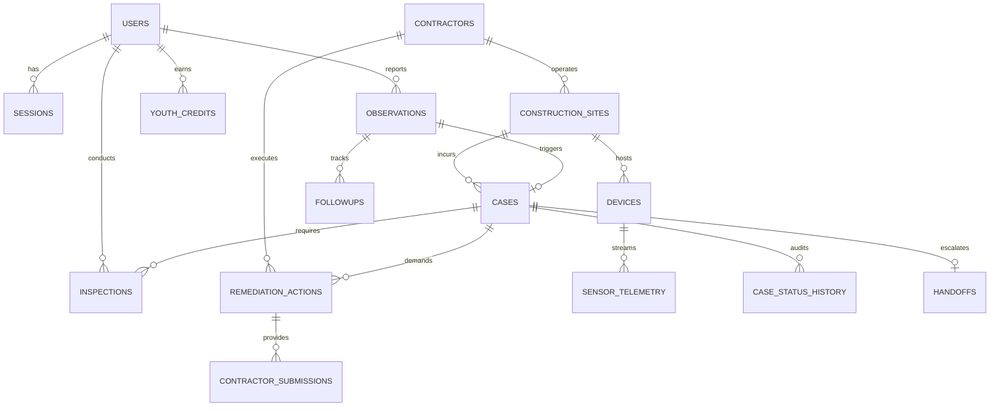

# DUSTGUARD VN — DOMAIN MODEL & ENTITY SPECIFICATION (SSOT)

> **Đặc tả Mô Hình Thực Thể Nghiệp Vụ Toàn Hệ Thống**  
> **Áp dụng**: Thống nhất giữa D1 Database ↔ Backend Domain Rules ↔ Frontend TypeScript/JS Schemas.

---

## 1. TỔNG QUAN CÁC THỰC THỂ CỐT LÕI (CORE ENTITIES)

---

## 2. ĐẶC TẢ CHI TIẾT TỪNG THỰC THỂ (ENTITY SPECIFICATIONS)

### 2.1. `users` (Người Dùng & Tài Khoản)
- **Mục đích**: Lưu thông tin danh tính, vai trò (Role), đơn vị công tác và trạng thái kích hoạt.
- **Chủ sở hữu (Owner)**: Chính người dùng (cá nhân) / Admin (quản lý role).
- **Các trường bắt buộc**:
  - `id` (TEXT, PK): Mã định danh duy nhất (UUID v4 hoặc ID chuẩn Clerk).
  - `email` (TEXT, UNIQUE): Địa chỉ email liên lạc.
  - `role` (TEXT): Vai trò hệ thống (`citizen`, `staff`, `contractor`, `executive`, `admin`).
  - `status` (TEXT): Trạng thái (`active`, `suspended`, `pending_verification`).
  - `created_at` (TEXT/DATETIME), `updated_at` (TEXT/DATETIME).
- **Các trường tùy chọn**:
  - `name` (TEXT), `phone` (TEXT), `avatar_url` (TEXT).
  - `contractor_id` (TEXT, FK): Liên kết nếu user thuộc đơn vị Nhà thầu.
  - `organization` (TEXT): Tên trường học, CLB tình nguyện, hoặc Chi cục Môi trường.
- **Quy tắc Validation**:
  - Email đúng định dạng regex chuẩn. Role chỉ được thuộc danh sách enum cố định.
- **Nguồn sự thật (SSOT)**: Bảng `users` trong D1.

---

### 2.2. `observations` (Phản Ánh / Quan Trắc Cộng Đồng)
- **Mục đích**: Ghi nhận tình trạng ô nhiễm không khí, khói bụi từ người dân hoặc cảm biến.
- **Chủ sở hữu (Owner)**: `author_id` (Công dân tạo phản ánh).
- **Các trường bắt buộc**:
  - `id` (TEXT, PK): Mã định danh phản ánh (VD: `obs_1719283921_abc`).
  - `title` (TEXT): Tóm tắt hiện tượng (VD: "Bụi mù mịt từ công trình đường vành đai").
  - `category` (TEXT): Phân loại (`construction_dust`, `waste_burning`, `industrial_smoke`, `traffic_dust`, `other`).
  - `latitude` (REAL), `longitude` (REAL): Tọa độ WGS84 (VD: `10.7769, 106.7009`).
  - `status` (TEXT): `PENDING` ➔ `VERIFIED` ➔ `CONVERTED_TO_CASE` ➔ `RESOLVED` ➔ `REJECTED`.
  - `created_at` (TEXT).
- **Các trường tùy chọn**:
  - `description` (TEXT), `address` (TEXT), `evidence_urls` (JSON array các URL ảnh R2 kèm SHA-256).
  - `site_id` (TEXT, FK): Công trình xây dựng lân cận (nếu xác định được).
  - `priority_score` (REAL): Điểm rủi ro tự động (0.0 đến 100.0).
- **Derived Fields**:
  - `followup_count`: Tổng số bản ghi follow-up liên kết.

---

### 2.3. `cases` (Hồ Sơ Vụ Việc Xử Lý Vi Phạm)
- **Mục đích**: Hồ sơ pháp lý chính thức để thanh tra, xử lý và cưỡng chế khắc phục ô nhiễm.
- **Chủ sở hữu (Owner)**: `assigned_inspector_id` (Cán bộ thanh tra phụ trách chính) & Admin.
- **Các trường bắt buộc**:
  - `id` (TEXT, PK): Mã hồ sơ chuẩn (VD: `CASE-2026-0089`).
  - `title` (TEXT): Tiêu đề vụ việc.
  - `site_id` (TEXT, FK): Liên kết công trình xây dựng / chủ nguồn thải.
  - `status` (TEXT): Tuân thủ 10 trạng thái của Case State Machine.
  - `priority` (TEXT): Mức độ ưu tiên (`LOW`, `MEDIUM`, `HIGH`, `CRITICAL`).
  - `priority_score` (REAL): Điểm ưu tiên giải trình được (0 - 100).
  - `created_at`, `updated_at`.
- **Các trường tùy chọn**:
  - `observation_id` (TEXT, FK): Phản ánh gốc kích hoạt case.
  - `assigned_inspector_id` (TEXT, FK): Cán bộ thanh tra thụ lý.
  - `sla_deadline` (TEXT): Hạn chót xử lý theo quy định (48h/72h).
  - `remediation_deadline` (TEXT): Hạn chót nhà thầu phải hoàn tất khắc phục.
  - `closed_at` (TEXT), `closed_reason` (TEXT).
- **Derived Fields**:
  - `is_overdue`: `true` nếu `status !== 'CLOSED' && now() > sla_deadline`.

---

### 2.4. `inspections` (Biên Bản Kiểm Tra Thực Địa)
- **Mục đích**: Lưu trữ kết quả kiểm tra tại hiện trường của Cán bộ Thanh tra theo QCVN 05:2023/BTNMT.
- **Chủ sở hữu (Owner)**: Cán bộ thực hiện kiểm tra (`inspector_id`).
- **Các trường bắt buộc**:
  - `id` (TEXT, PK), `case_id` (TEXT, FK), `inspector_id` (TEXT, FK).
  - `inspection_date` (TEXT), `checklist_results` (JSON: điểm danh 10 tiêu chí dập bụi).
  - `finding_summary` (TEXT): Kết luận hiện trường.
  - `violation_detected` (INTEGER/BOOLEAN): 1 nếu có vi phạm, 0 nếu không.
  - `created_at`.
- **Các trường tùy chọn**:
  - `measured_pm25` (REAL), `measured_pm10` (REAL), `evidence_urls` (JSON array).

---

### 2.5. `remediation_actions` & `contractor_submissions` (Yêu Cầu & Minh Chứng Khắc Phục)
- **Mục đích**: Theo dõi mệnh lệnh khắc phục và bằng chứng thực thi Before/After của Nhà thầu.
- **Chủ sở hữu (Owner)**: Nhà thầu (`contractor_id`) thực hiện; Cán bộ Thanh tra nghiệm thu.
- **Các trường bắt buộc**:
  - `id` (TEXT, PK), `case_id` (TEXT, FK), `contractor_id` (TEXT, FK).
  - `required_actions` (TEXT): Nội dung yêu cầu (VD: Lắp đặt giàn phun sương, rửa xe trước khi ra đường).
  - `deadline` (TEXT): Hạn nộp minh chứng.
  - `status` (TEXT): `PENDING` ➔ `IN_PROGRESS` ➔ `SUBMITTED` ➔ `APPROVED` ➔ `REJECTED_RETRY`.
- **Minh chứng Before/After**:
  - `before_image_url` (TEXT) + `before_image_hash` (TEXT SHA-256).
  - `after_image_url` (TEXT) + `after_image_hash` (TEXT SHA-256).
  - `contractor_notes` (TEXT), `submitted_at` (TEXT), `verified_at` (TEXT).

---

### 2.6. `youth_credits` & `youth_certificates` (Tín Chỉ & Chứng Chỉ Thanh Niên)
- **Mục đích**: Quản lý số giờ tình nguyện và cấp Chứng Chỉ Xanh cho thanh niên, học sinh, sinh viên.
- **Chủ sở hữu (Owner)**: `user_id` (Thanh niên sở hữu).
- **Công thức tính tín chỉ**:
  $$\text{Tín chỉ} = \min\left(4.0, \frac{\text{Tổng giờ tình nguyện hợp lệ}}{5}\right)$$
- **Chứng chỉ điện tử**:
  - `certificate_code` (TEXT, UNIQUE): Mã chứng chỉ (VD: `DG-YOUTH-2026-8942`).
  - `signature_hash` (TEXT): Chữ ký xác thực HMAC SHA-256 đảm bảo tính bất biến khi tra cứu công khai.

---

### 2.7. `audit_logs` (Nhật Ký Kiểm Toán Bất Biến)
- **Mục đích**: Lưu vết 100% các hành động thay đổi dữ liệu phục vụ thanh tra và giải trình.
- **Tính chất**: **CHỈ ĐƯỢC GHI (APPEND-ONLY)**, tuyệt đối không được sửa hoặc xóa.
- **Các trường bắt buộc**:
  - `id` (INTEGER/TEXT, PK), `actor_id` (TEXT), `actor_role` (TEXT), `action` (TEXT).
  - `entity_type` (TEXT), `entity_id` (TEXT), `old_state` (JSON), `new_state` (JSON).
  - `ip_address` (TEXT), `user_agent` (TEXT), `created_at` (TEXT).
