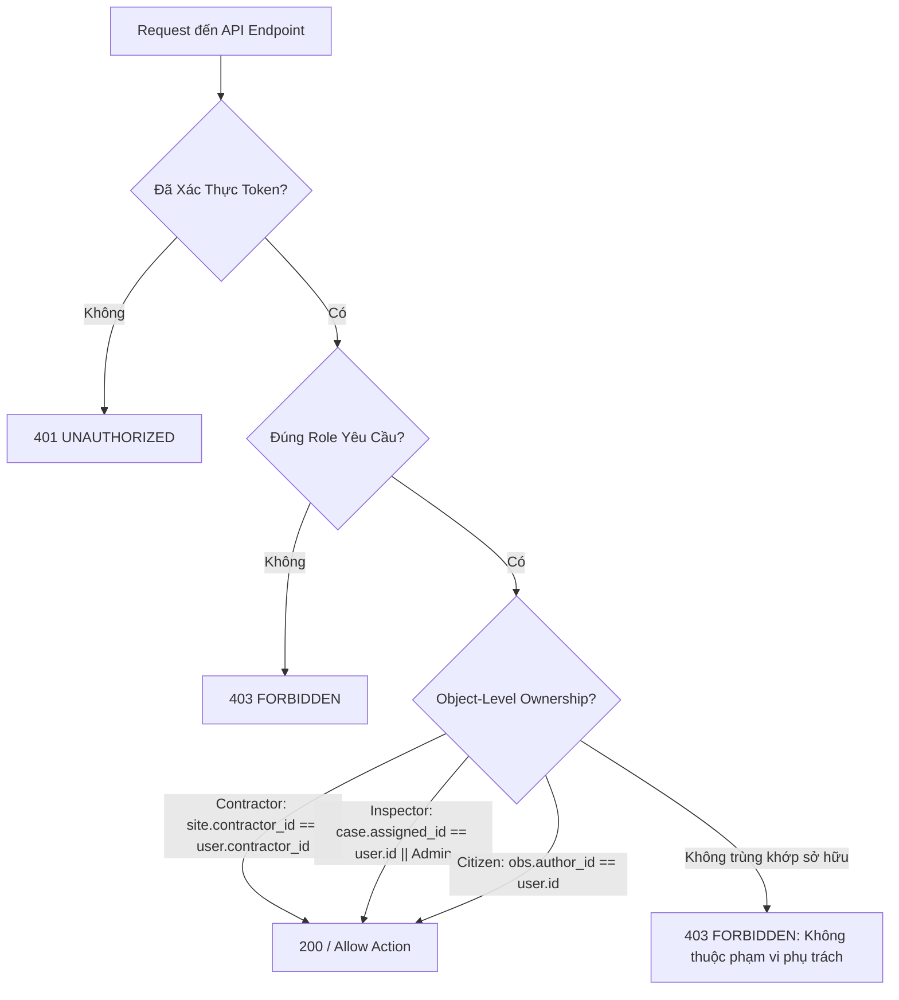

# DUSTGUARD VN — ROLE-BASED ACCESS CONTROL & PERMISSION MATRIX (SSOT)

> **Đặc tả Phân Quyền & Ma Trận Kiểm Soát Truy Cập RBAC (SSOT)**  
> **Áp dụng**: Enforce 100% tại `app/server/auth/index.js` (Hono & Express Middleware).  
> **Nguyên tắc**: Tuyệt đối không dựa vào kiểm tra giao diện client-side; mọi quyền hạn phải được kiểm duyệt tại tầng Server/Edge API.

---

## 1. DANH MỤC MÃ QUYỀN HỆ THỐNG (SYSTEM PERMISSION CODES)

```text
[OBSERVATIONS]
- observation.create        : Tạo phản ánh môi trường
- observation.read_public   : Xem phản ánh công khai
- observation.update_own    : Sửa phản ánh do mình tạo (chỉ khi PENDING)
- observation.verify        : Xác minh & gắn cờ phản ánh
- observation.convert_case  : Chuyển phản ánh thành hồ sơ vụ việc

[CASES & INSPECTIONS]
- case.create               : Tạo hồ sơ vụ việc mới
- case.read_all             : Xem toàn bộ danh sách vụ việc
- case.read_assigned        : Xem vụ việc được phân công / liên quan công trình
- case.assign               : Phân công Thanh tra viên thụ lý
- case.inspect              : Thực hiện kiểm tra thực địa & nộp checklist
- case.issue_remediation    : Ban hành lệnh khắc phục & áp SLA
- case.verify_remediation   : Nghiệm thu ảnh Before/After của nhà thầu
- case.close                : Đóng hồ sơ vụ việc
- case.reopen               : Mở lại hồ sơ vụ việc
- case.escalate_handoff     : Khởi tạo hồ sơ chuyển tuyến Sở TNMT

[CONTRACTOR OPERATIONS]
- remediation.read_assigned : Xem lệnh khắc phục thuộc dự án của mình
- remediation.update_status : Chuyển trạng thái sang IN_PROGRESS
- remediation.submit_evidence: Nộp ảnh và ghi chú xử lý Before/After

[YOUTH & CREDITS]
- youth.checkin             : Điểm danh ca trực quan trắc / chiến dịch
- youth.view_certificate    : Xem & tải Chứng Chỉ Xanh cá nhân
- youth.verify_certificate  : Tra cứu công khai tính hợp lệ của chứng chỉ
- youth.revoke_certificate  : Thu hồi chứng chỉ (Admin)

[MASTER DATA & SYSTEM]
- site.manage               : Tạo, sửa, xóa công trình xây dựng
- sensor.manage             : Gán, cấu hình, hủy liên kết trạm cảm biến IoT
- user.manage               : Quản lý người dùng, thay đổi Role
- audit.view                : Xem nhật ký kiểm toán bất biến
- system.configure          : Cấu hình tham số ngưỡng ô nhiễm & SLA
```

---

## 2. MA TRẬN PHÂN QUYỀN THEO VAI TRÒ (ROLE-PERMISSION MATRIX)

| Mã Quyền (Permission) | Citizen / Youth | Staff / Inspector | Contractor | Executive | Administrator |
|---|---|---|---|---|---|
| `observation.create` | ✅ | ✅ | ✅ | ✅ | ✅ |
| `observation.read_public` | ✅ | ✅ | ✅ | ✅ | ✅ |
| `observation.update_own` | ✅ | ❌ | ❌ | ❌ | ✅ |
| `observation.verify` | ❌ | ✅ | ❌ | ✅ | ✅ |
| `observation.convert_case` | ❌ | ✅ | ❌ | ✅ | ✅ |
| `case.create` | ❌ | ✅ | ❌ | ✅ | ✅ |
| `case.read_all` | ❌ | ✅ | ❌ | ✅ | ✅ |
| `case.read_assigned` | ❌ | ✅ | ✅ | ✅ | ✅ |
| `case.assign` | ❌ | ✅ *(Trưởng đoàn)* | ❌ | ✅ | ✅ |
| `case.inspect` | ❌ | ✅ | ❌ | ❌ | ✅ |
| `case.issue_remediation` | ❌ | ✅ | ❌ | ❌ | ✅ |
| `case.verify_remediation`| ❌ | ✅ | ❌ | ❌ | ✅ |
| `case.close` | ❌ | ✅ *(Trưởng đoàn)* | ❌ | ✅ | ✅ |
| `case.reopen` | ❌ | ✅ *(Trưởng đoàn)* | ❌ | ✅ | ✅ |
| `case.escalate_handoff` | ❌ | ✅ | ❌ | ✅ | ✅ |
| `remediation.read_assigned`| ❌ | ✅ | ✅ | ✅ | ✅ |
| `remediation.update_status`| ❌ | ❌ | ✅ | ❌ | ✅ |
| `remediation.submit_evidence`| ❌ | ❌ | ✅ | ❌ | ✅ |
| `youth.checkin` | ✅ | ❌ | ❌ | ❌ | ✅ |
| `youth.view_certificate` | ✅ | ✅ | ✅ | ✅ | ✅ |
| `youth.verify_certificate` | ✅ *(Public)* | ✅ | ✅ | ✅ | ✅ |
| `youth.revoke_certificate`| ❌ | ❌ | ❌ | ❌ | ✅ |
| `site.manage` | ❌ | ❌ | ❌ | ✅ | ✅ |
| `sensor.manage` | ❌ | ❌ | ❌ | ✅ | ✅ |
| `user.manage` | ❌ | ❌ | ❌ | ❌ | ✅ |
| `audit.view` | ❌ | ❌ | ❌ | ✅ | ✅ |
| `system.configure` | ❌ | ❌ | ❌ | ❌ | ✅ |

---

## 3. CHÍNH SÁCH BẢO MẬT CẤP ĐỘ BẢN GHI (OBJECT-LEVEL SECURITY POLICIES)



1. **Nhà Thầu (Contractor Isolation)**:
   - Một nhà thầu tuyệt đối không được xem dữ liệu, đơn khiếu nại hoặc hồ sơ phạt của nhà thầu khác.
   - SQL Enforcement: `SELECT * FROM remediation_actions WHERE contractor_id = ? AND deleted_at IS NULL`.
2. **Thanh Tra Viên (Inspector Scope)**:
   - Biên bản kiểm tra `inspections` chỉ được tạo và ký duyệt bởi Cán bộ được phân công trực tiếp (`assigned_inspector_id`) hoặc Admin.
3. **Người Dân (Citizen Privacy)**:
   - Thông tin cá nhân (SĐT, Email) của người gửi phản ánh được ẩn danh (Masking) đối với Nhà thầu và bên ngoài công cộng, chỉ hiển thị với Cơ quan Thanh tra.
