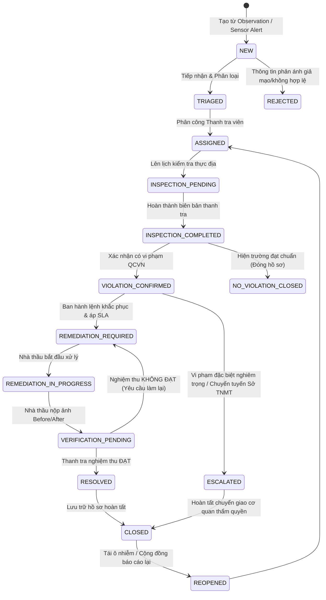
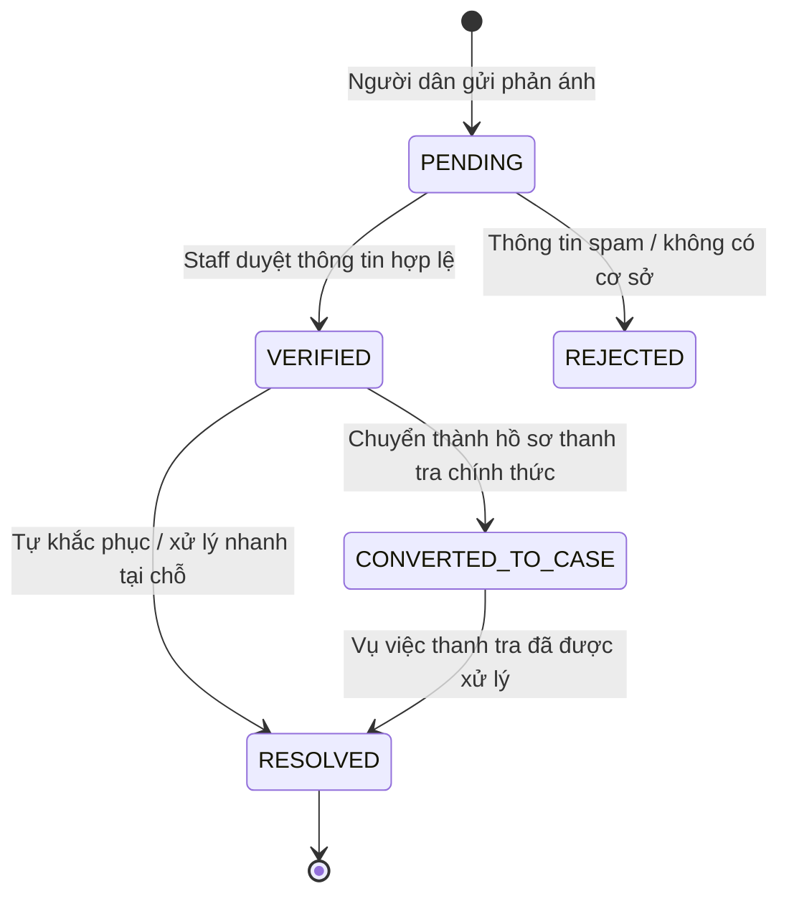
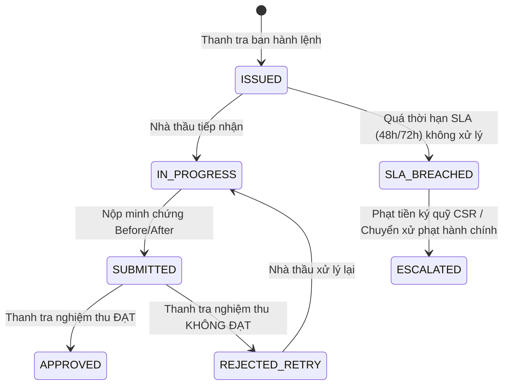
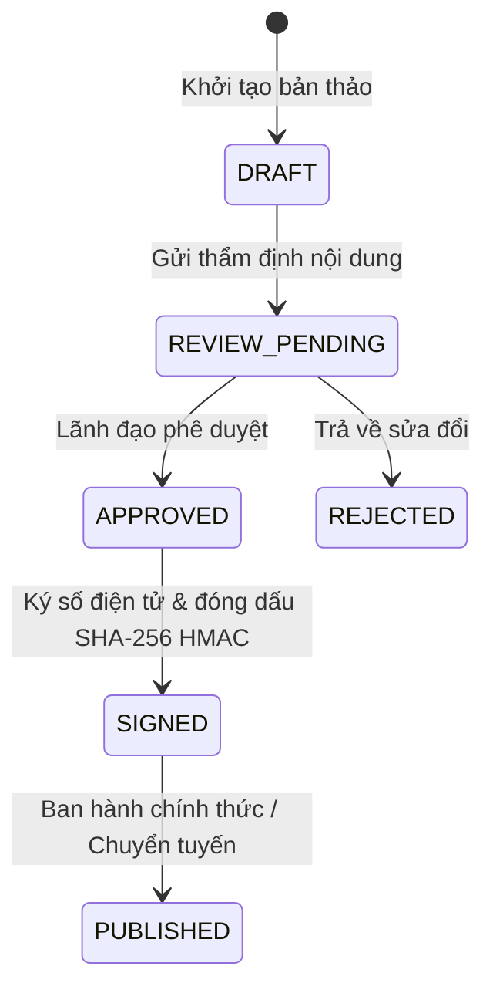

# DUSTGUARD VN — STATE MACHINES & LIFECYCLES (SSOT)

> **Đặc tả Cây Trạng Thái Bất Biến & Quy Tắc Chuyển Trạng Thái**  
> **Áp dụng**: Enforce 100% tại `app/server/domain/cases/case.rules.js` & Cloudflare Worker Hono/D1.  
> **Nguyên tắc**: Tuyệt đối không cho phép client-side tự ý thay đổi status mà không qua xác thực backend.

---

## 1. VÒNG ĐỜI HỒ SƠ VỤ VIỆC (CASE STATE MACHINE — 7-10 BƯỚC CHÍNH THỨC)

### 1.1. Bảng Chuyển Đổi Trạng Thái Hồ Sơ Vụ Việc (Case Transition Rules)

| Trạng Thái Ban Đầu (From) | Hành Động (Action) | Trạng Thái Mới (To) | Tác Nhân (Actor) | Điều Kiện Bắt Buộc (Conditions) | Tác Vụ Phụ (Side Effects) |
|---|---|---|---|---|---|
| `NEW` | `triage` | `TRIAGED` | Staff / Admin | Đã đánh giá tính xác thực của nguồn tin | Cập nhật `priority_score`, ghi `audit_logs` |
| `NEW` | `reject` | `REJECTED` | Staff / Admin | Phải có lý do từ chối rõ ràng (`reject_reason`) | Thông báo người phản ánh, ghi `audit_logs` |
| `TRIAGED` | `assign` | `ASSIGNED` | Admin / Lead Staff | `assigned_inspector_id` phải là Staff hợp lệ | Gửi notification cho Thanh tra viên được giao |
| `ASSIGNED` | `schedule_inspection` | `INSPECTION_PENDING` | Assigned Inspector / Admin | Xác định ngày giờ kiểm tra dự kiến | Tạo bản ghi draft trong bảng `inspections` |
| `INSPECTION_PENDING` | `submit_inspection` | `INSPECTION_COMPLETED` | Assigned Inspector | Phải nộp đầy đủ Checklist 10 tiêu chí + Kết luận | Lưu kết quả thanh tra vào bảng `inspections` |
| `INSPECTION_COMPLETED` | `confirm_violation` | `VIOLATION_CONFIRMED` | Assigned Inspector / Admin | `violation_detected === true` kèm căn cứ luật QCVN | Kích hoạt bộ tính toán rủi ro môi trường |
| `INSPECTION_COMPLETED` | `dismiss_case` | `NO_VIOLATION_CLOSED` | Assigned Inspector / Admin | `violation_detected === false` kèm ảnh chứng minh | Đóng case, cập nhật phản ánh công dân thành công |
| `VIOLATION_CONFIRMED` | `issue_remediation` | `REMEDIATION_REQUIRED` | Assigned Inspector / Admin | Xác định rõ hành động yêu cầu + `sla_deadline` (48h/72h) | Gửi thông báo khẩn & SMS/Email cho Nhà thầu |
| `REMEDIATION_REQUIRED` | `start_action` | `REMEDIATION_IN_PROGRESS`| Contractor | Nhà thầu xác nhận đã nhận lệnh xử lý | Cập nhật thời điểm tiếp nhận |
| `REMEDIATION_IN_PROGRESS`| `submit_evidence` | `VERIFICATION_PENDING` | Contractor | Phải có đủ 2 ảnh Before & After kèm mã SHA-256 | Gửi thông báo cho Thanh tra viên để nghiệm thu |
| `VERIFICATION_PENDING` | `approve_remediation`| `RESOLVED` | Assigned Inspector / Admin | Thanh tra viên đánh giá ảnh đối chứng ĐẠT | Giải phóng trạng thái cảnh báo của công trình |
| `VERIFICATION_PENDING` | `reject_remediation` | `REMEDIATION_REQUIRED` | Assigned Inspector / Admin | Nêu rõ lý do chưa đạt yêu cầu xử lý bụi | Tăng cấp độ phạt ký quỹ, reset hạn 24h bổ sung |
| `RESOLVED` | `archive_close` | `CLOSED` | Admin / Lead Staff | Tất cả biên bản và minh chứng đã lưu trữ đầy đủ | Đóng hồ sơ, cập nhật điểm uy tín công trình |
| `VIOLATION_CONFIRMED` | `escalate_handoff` | `ESCALATED` | Inspector / Admin | Vi phạm tái diễn > 3 lần hoặc vượt ngưỡng nguy hại | Tạo hồ sơ `handoff_tickets`, chuyển tuyến Sở TNMT |
| `CLOSED` | `reopen` | `REOPENED` | Admin / Lead Staff | Nhận được phản ánh mới tại cùng vị trí trong 14 ngày | Tạo chu kỳ thanh tra mới, gán `is_reopened = 1` |

---

## 2. VÒNG ĐỜI PHẢN ÁNH CỘNG ĐỒNG (OBSERVATION LIFECYCLE)

---

## 3. VÒNG ĐỜI YÊU CẦU KHẮC PHỤC CỦA NHÀ THẦU (REMEDIATION ACTION LIFECYCLE)

---

## 4. VÒNG ĐỜI VĂN BẢN HÀNH CHÍNH & PHÁP LÝ A4 (LEGAL DOCUMENT LIFECYCLE)

- **Quy tắc**: Mọi hành động `APPROVED`, `SIGNED`, `PUBLISHED` phải cập nhật trực tiếp vào bảng `legal_documents` trong D1 kèm chữ ký băm bất biến và ghi log `audit_logs`. Tuyệt đối không lưu trạng thái tạm thời trong React state.
