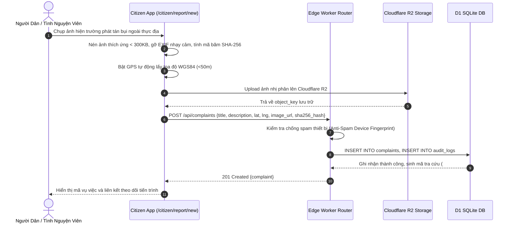
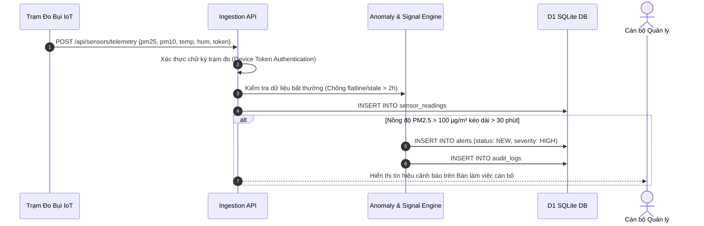
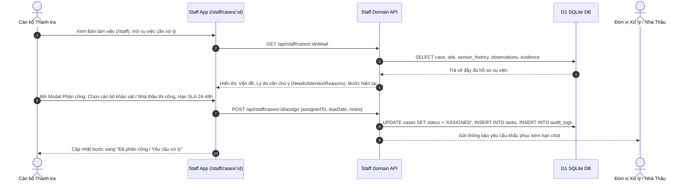
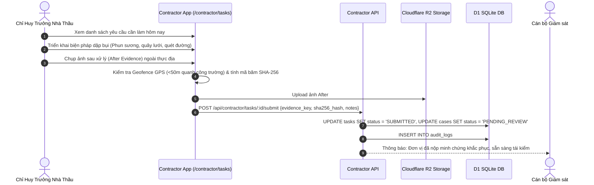
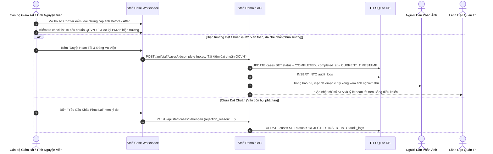
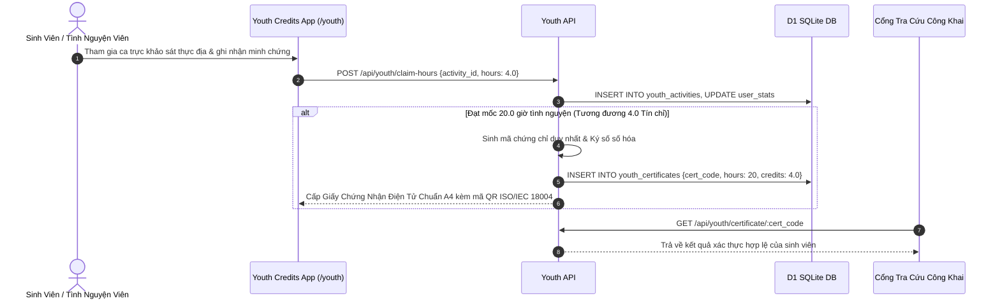

# DUSTGUARD VN — END-TO-END BUSINESS USER FLOWS (SSOT V2)

> **Bản quyền**: DustGuard VN — CivicTech Platform  
> **Trục định vị**: $\mathbf{SIGNAL} \longrightarrow \mathbf{UNDERSTAND} \longrightarrow \mathbf{ROUTE} \longrightarrow \mathbf{ACTION} \longrightarrow \mathbf{FOLLOW\text{-}UP} \longrightarrow \mathbf{VERIFY} \longrightarrow \mathbf{OUTCOME}$  
> **Slogan**: *"Phát hiện vấn đề. Chuyển đúng người. Theo dõi đến kết quả."*

---

## 1. FLOW 1 — CÔNG DÂN TẠO NGUỒN TÍN HIỆU & THEO DÕI (SIGNAL & FOLLOW-UP)

- **Màn hình**: `app/src/apps/citizen/pages/report-new/ReportNewPage.jsx`, `ReportsListPage.jsx`, `ReportDetailPage.jsx`
- **Mục tiêu người dùng**: Gửi phản ánh nhanh trong 30 giây và biết phản ánh của mình đang ở bước nào trong 7 bước.

---

## 2. FLOW 2 — TÍN HIỆU CẢNH BÁO TRẠM QUAN TRẮC (SENSOR SIGNAL INGESTION)

- **Màn hình**: `app/src/apps/staff/pages/monitoring/StaffMonitoringPage.jsx`, `StaffAlertsPage.jsx`
- **Tương tác**: Cán bộ bấm *"Tạo vụ việc"* hoặc *"Gắn vào vụ việc"* trực tiếp từ tín hiệu trạm đo.

---

## 3. FLOW 3 — CÁN BỘ ĐIỀU PHỐI & GIAO VIỆC (UNDERSTAND, ROUTE & DISPATCH)

- **Màn hình**: `app/src/apps/staff/pages/cases/CaseDetailPage.jsx`, `StaffDashboardPage.jsx`
- **Mục tiêu**: Nắm việc cần làm ngay trong ngày, hiểu rõ vì sao vụ việc cần ưu tiên và giao đúng người phụ trách.

---

## 4. FLOW 4 — ĐƠN VỊ XỬ LÝ KHẮC PHỤC & NỘP MINH CHỨNG (ACTION & EVIDENCE)

- **Màn hình**: `app/src/apps/contractor/pages/tasks/ContractorTasksPage.jsx`, `ContractorDashboardPage.jsx`
- **Mục tiêu**: Nắm rõ yêu cầu cần làm, thời hạn và nộp minh chứng Before/After để được nghiệm thu.

---

## 5. FLOW 5 — TÁI KIỂM THỰC ĐỊA & ĐÓNG VỤ VIỆC (VERIFY & OUTCOME)

- **Màn hình**: `app/src/apps/staff/pages/cases/CaseDetailPage.jsx` (Tab Khắc phục / Nghiệm thu), `app/src/apps/admin/pages/dashboard/AdminDashboardPage.jsx`
- **Mục tiêu**: Đảm bảo vụ việc chỉ được đóng khi có kiểm tra lại thực tế đạt chuẩn môi trường.

---

## 6. FLOW 6 — TÍCH LŨY GIỜ TÌNH NGUYỆN & CHỨNG NHẬN SỐ (YOUTH CREDITS & QR)

- **Màn hình**: `app/src/modules/youth/YouthCredits.jsx`
- **Mục tiêu**: Ghi nhận công sức đóng góp của thanh niên và sinh viên minh bạch, có thể kiểm chứng độc lập.
