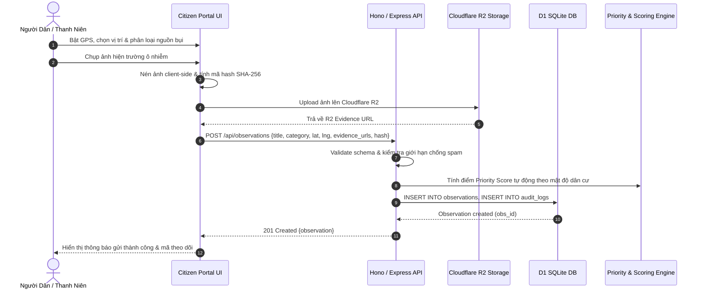
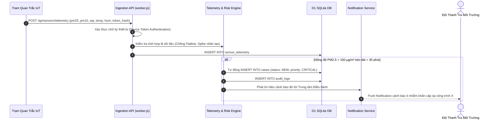
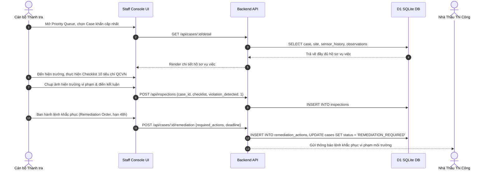
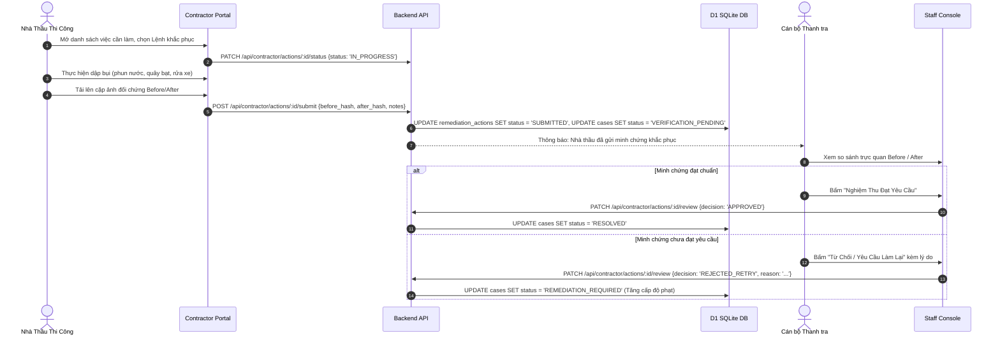
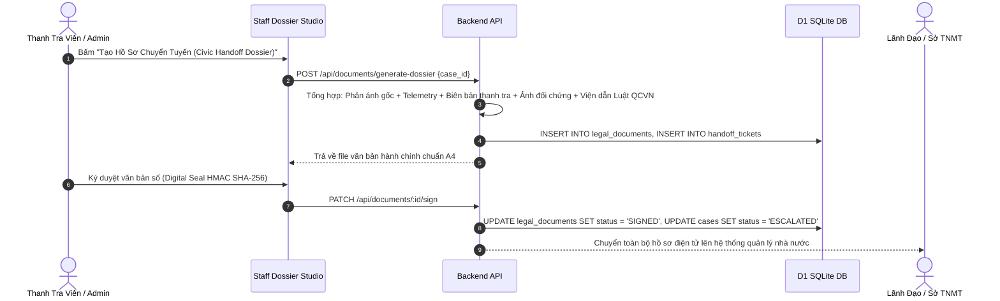
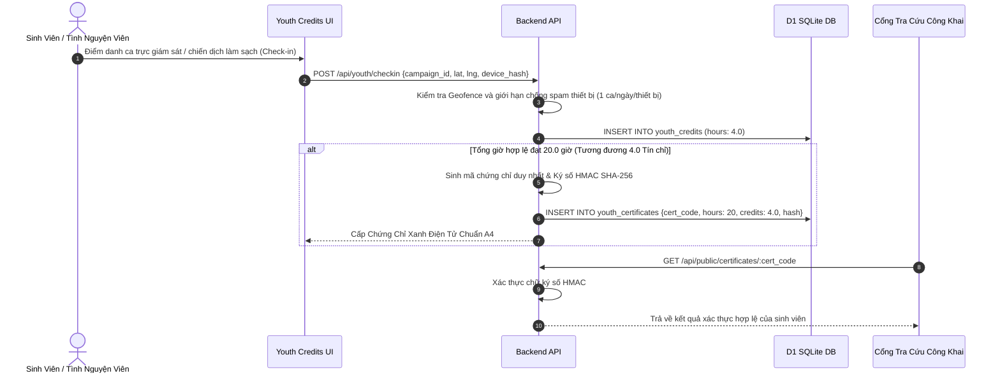

# DUSTGUARD VN — END-TO-END BUSINESS USER FLOWS (SSOT)

> **Đặc tả Chi Tiết Các Luồng Hành Trình Người Dùng End-to-End Toàn Hệ Thống**  
> **Áp dụng**: Đối chiếu trực tiếp giữa Giao diện (UI) ➔ API ➔ Thực thể (Entity) ➔ Xử lý lỗi (Failure Modes).

---

## 1. FLOW 1 — CÔNG DÂN GỬI PHẢN ÁNH Ô NHIỄM (CITIZEN REPORT FLOW)

- **Màn hình**: `src/modules/citizen/CitizenReport.jsx`
- **API Endpoint**: `POST /api/observations`
- **Xử lý lỗi (Failure Cases)**:
  - Mất kết nối mạng: Lưu nháp vào hàng đợi Offline Draft (`offline-drafts.js`), tự động đẩy lên khi có mạng lại.
  - Vị trí GPS sai số quá lớn (> 50m): Yêu cầu người dùng hiệu chỉnh ghim trên bản đồ.
  - Tải ảnh lỗi: Hiển thị nút "Thử tải lại ảnh" (Retry Upload), không cho phép gửi nếu chưa có ảnh hợp lệ.

---

## 2. FLOW 2 — CẢNH BÁO CẢM BIẾN IoT VƯỢT NGƯỠNG (SENSOR TELEMETRY VIOLATION)

- **API Endpoint**: `POST /api/sensors/telemetry`, `POST /api/alerts`
- **Xử lý lỗi (Failure Cases)**:
  - Cảm biến gửi dữ liệu rác/lỗi CRC: Từ chối ghi log, kích hoạt cờ cảnh báo `SENSOR_ANOMALY`.
  - Thiết bị mất kết nối quá 15 phút: Tự động chuyển trạng thái trạm sang `OFFLINE`.

---

## 3. FLOW 3 — QUY TRÌNH THANH TRA THỰC ĐỊA (INSPECTOR FIELD WORKFLOW)

- **Màn hình**: `src/modules/staff/StaffCaseDetail.jsx`, `StaffInspections.jsx`
- **API Endpoint**: `POST /api/inspections`, `POST /api/cases/:id/remediation`, `PATCH /api/cases/:id/transition`
- **Xử lý lỗi (Failure Cases)**:
  - Thanh tra viên không được phân công: API trả về `403 FORBIDDEN (RFC-7807)`.
  - Chưa tick đủ các mục checklist bắt buộc: UI khóa nút gửi và bôi đỏ các tiêu chí còn thiếu.

---

## 4. FLOW 4 — NHÀ THẦU XỬ LÝ KHẮC PHỤC & NGHIỆM THU (CONTRACTOR REMEDIATION & VERIFICATION)

- **Màn hình**: `src/modules/contractor/ContractorActionDetail.jsx`, `src/modules/staff/RemediationWorkspace.jsx`
- **API Endpoint**: `POST /api/contractor/actions/:id/submit`, `PATCH /api/contractor/actions/:id/review`
- **Xử lý lỗi (Failure Cases)**:
  - Tải lên ảnh After chụp quá xa tọa độ công trình (> 100m): Cảnh báo Geofence không hợp lệ.
  - Quá hạn SLA 48h mà chưa submit: Hệ thống tự động phạt tiền ký quỹ bảo vệ môi trường (CSR Escrow).

---

## 5. FLOW 5 — CHUYỂN TUYẾN HÀNH CHÍNH & ĐÓNG HỒ SƠ (CIVIC HANDOFF & CLOSURE)

---

## 6. FLOW 6 — TÍCH LŨY TÍN CHỈ & CẤP CHỨNG CHỈ THANH NIÊN (YOUTH GREEN CREDIT)

