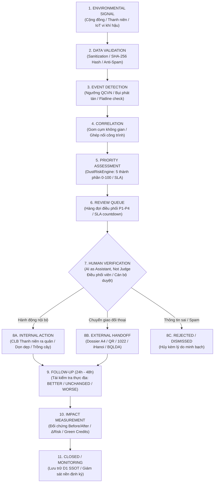
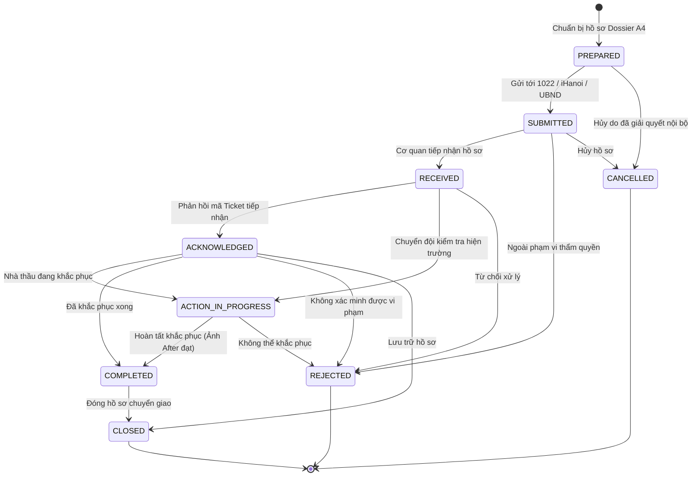

# WORKFLOWS & CIVIC HANDOFF SSOT — DUSTGUARD VN
## Canonical 11-Stage Pipeline, Closed-Loop Impact & Municipal Integration Architecture

> **Chức danh SSOT**: Canonical Workflow & Handoff Architect  
> **Sứ mệnh cốt lõi**: Chuẩn hóa toàn bộ dòng chảy dữ liệu từ tín hiệu môi trường ban đầu đến đối chứng tác động khép kín (Closed-Loop Impact) và bàn giao hồ sơ thực chứng có cấu trúc (Structured Civic Dossier) tới các điểm tích hợp công vụ (Tổng đài 1022, Ứng dụng iHanoi, UBND Phường, Ban Quản lý Dự án).

---

## ⚡ 1. Sơ Đồ Tổng Thể Canonical Workflow (11-Stage Pipeline)



---

## 🏛️ 2. Chi Tiết 11 Giai Đoạn Canonical Workflow (Stage-by-Stage Specification)

### Giai Đoạn 1: ENVIRONMENTAL SIGNAL (Thu Nạp Tín Hiệu Môi Trường)
* **Mục tiêu**: Tiếp nhận tín hiệu thô từ hiện trường nhanh chóng trong vòng 30 giây mà không tạo rào cản đăng nhập phức tạp (Zero-Login Ingestion).
* **Nguồn thu nạp (Multi-Source Ingestion)**:
  1. **Cộng đồng & Thanh niên (Civic & Youth Observations)**: Người dân, học sinh, sinh viên chụp ảnh ghi nhận qua ứng dụng web di động.
  2. **Trạm IoT Vi khí hậu giá rẻ (< $25)**: Thiết bị ESP32 + cảm biến PMS7003/SHT30 gửi dữ liệu định kỳ qua HTTP/MQTT.
  3. **Đội tuần tra môi trường (Youth Patrol / Field Logs)**: Ghi nhận theo tuyến đường khảo sát định kỳ của CLB.
* **Payload đầu vào tiêu chuẩn**:
  ```typescript
  interface EnvironmentalSignalInput {
    categoryId: 'CONSTRUCTION_DUST' | 'ROAD_DUST' | 'WASTE_BURNING' | 'INDUSTRIAL_EMISSION' | 'OTHER';
    description: string;
    latitude: number;          // WGS84 [-90, 90]
    longitude: number;         // WGS84 [-180, 180]
    locationAccuracyM?: number;
    address: string;
    ward: string;
    city: string;
    observedAt: string;        // ISO-8601 UTC
    evidenceFiles?: File[];    // Tệp ảnh hiện trường
    reporterType: 'INDIVIDUAL' | 'CLUB' | 'VOLUNTEER' | 'CAMPAIGN';
    reporterFingerprint?: string; // Mã băm thiết bị ẩn danh chống spam
  }
  ```
* **Bất biến bảo vệ (Invariants)**:
  - Tự động xóa sạch siêu dữ liệu EXIF nhạy cảm (GPS thiết bị gốc, serial camera) phía client trước khi tải lên.
  - Tự động nén ảnh thích ứng < 300KB để hoạt động tin cậy ngoài thực địa trên sóng di động 3G/4G yếu.

---

### Giai Đoạn 2: DATA VALIDATION & CRYPTOGRAPHIC INTEGRITY (Xác Thực & Niêm Phong Số)
* **Mục tiêu**: Chuẩn hóa kiểu dữ liệu, loại trừ dữ liệu rác/spam, và sinh mã băm SHA-256 tamper-evident bảo đảm tính toàn vẹn của bằng chứng.
* **Quy trình xử lý**:
  1. **Sanitization & Coercion**: Chuẩn hóa chuỗi văn bản, cắt tỉa khoảng trắng, kiểm tra giới hạn tọa độ WGS84.
  2. **Cryptographic SHA-256 Hashing**:
     - Phía Client: Sinh mã băm SHA-256 (64 ký tự hex) ngay trên Web Crypto API khi người dùng chọn ảnh:
       $$\text{SHA-256}(\text{ImageBuffer}) \rightarrow \text{Hash}_{\text{hex}}$$
     - Phía Server: Xác thực lại mã băm khi lưu trữ tệp vào Cloudflare R2 bucket.
  3. **Device Anti-Spam & Rate Limiting**:
     - Sinh `deviceHash` ẩn danh dựa trên User-Agent, Screen Resolution, Language.
     - Giới hạn tần suất: Tối đa 5 ghi nhận/10 phút từ cùng 1 thiết bị (`verifyAntiSpamLimit`). Nếu vượt quá, áp dụng cơ chế giảm điểm tin cậy (trần tối đa 35 điểm).

---

### Giai Đoạn 3: EVENT DETECTION (Phát Hiện Sự Kiện Ô Nhiễm)
* **Mục tiêu**: Chuyển đổi dữ liệu tín hiệu điểm thành Sự kiện Ô nhiễm (Pollution Event) có ngữ nghĩa.
* **Quy tắc phân tích**:
  1. **IoT Threshold Evaluation**:
     - Đối chiếu Quy chuẩn QCVN 05:2023/BTNM:
       * PM2.5 > 75 µg/m³ hoặc PM10 > 150 µg/m³: Kích hoạt sự kiện **BÁO ĐỘNG ĐỎ**.
       * PM2.5 > 50 µg/m³ hoặc PM10 > 100 µg/m³: Kích hoạt sự kiện **CẢNH BÁO CAM**.
     - **Flatline & Fault Detection**: Nếu 5 bản tin liên tiếp có giá trị PM bằng hệt nhau hoặc cảm biến mất kết nối > 60 phút, hệ thống đánh dấu `FAULTY/OFFLINE` và tự động loại trừ khỏi trọng số tính điểm (Zero-IoT Resilience).
  2. **Photographic Signal Analysis**:
     - Nhận diện các dấu hiệu phát tán bụi trực quan: Xe tải không phủ bạt, đường bùn đất khô bốc bụi, máy xúc thi công không phun nước dập bụi.

---

### Giai Đoạn 4: SPATIO-TEMPORAL CORRELATION (Tương Quan Không Gian - Thời Gian)
* **Mục tiêu**: Gom cụm các phản ánh đơn lẻ thành cụm điểm nóng và liên kết với nguồn phát sinh ô nhiễm (công trình xây dựng, tuyến đường vận tải).
* **Thuật toán xử lý**:
  1. **Spatial Clustering (Bán kính 100m - 200m)**:
     - Tính khoảng cách Haversine giữa các điểm ghi nhận:
       $$d = 2R \arcsin\left(\sqrt{\sin^2\left(\frac{\Delta \phi}{2}\right) + \cos(\phi_1)\cos(\phi_2)\sin^2\left(\frac{\Delta \lambda}{2}\right)}\right)$$
     - Nếu $d \le 150\text{m}$ và thời gian ghi nhận trong vòng 7 ngày: Tự động nhóm vào cùng một **Cụm Vấn Đề (Problem Cluster)**.
  2. **Sensitive Receptors Exposure Mapping**:
     - Quét khoảng cách tới các đối tượng nhạy cảm tiếp giáp trong bán kính 1000m:
       * Trường học / Cơ sở giáo dục (`EXPOSURE_THRESHOLDS.school`): $\le 100\text{m}$ (Critical), $\le 200\text{m}$ (High), $\le 500\text{m}$ (Medium).
       * Bệnh viện / Cơ sở y tế (`EXPOSURE_THRESHOLDS.hospital`): $\le 100\text{m}$ (Critical), $\le 200\text{m}$ (High).
       * Khu dân cư mật độ cao (`EXPOSURE_THRESHOLDS.res`): $\le 30\text{m}$ (Critical), $\le 100\text{m}$ (High).
  3. **Site Association**:
     - Ánh xạ tự động vào hồ sơ công trình (`siteId` / `contractorId`) nếu điểm ghi nhận nằm trong ranh giới dự án đã đăng ký.

---

### Giai Đoạn 5: PRIORITY ASSESSMENT (Đánh Giá Mức Độ Ưu Tiên — Explainable Risk Engine)
* **Mục tiêu**: Định lượng mức độ ưu tiên xử lý (Community Priority Score: 0 – 100) hoàn toàn minh bạch, giải thích được lý do (Explainable DSS).
* **Công thức 5 thành phần chuẩn hóa (`DustRiskEngine`)**:
  $$\text{PriorityScore} = \frac{\sum (S_i \times w_i)}{\sum w_{\text{available}}}$$

| Thành Phần | Trọng Số Chuẩn | Ý Nghĩa Nghiệp Vụ | Nguồn Dữ Liệu |
|---|---|---|---|
| **Community Signal ($S_{\text{comm}}$)** | **30%** | Mức độ đồng thuận cộng đồng, số người dân/thanh niên độc lập cùng phản ánh | Ghi nhận cộng đồng, Dedup theo thiết bị |
| **Exposure Signal ($S_{\text{expo}}$)** | **25%** | Khoảng cách tiếp giáp đối tượng nhạy cảm (Trường học, Bệnh viện, KDC) | GIS Spatial WGS84, Khoảng cách Haversine |
| **Compliance Deficit ($S_{\text{comp}}$)** | **20%** | Thiếu hụt biện pháp dập bụi/che chắn theo QCVN 18:2021/BXD & Chất lượng ảnh SHA-256 | Checklist 10 tiêu chí, Ảnh có hash + GPS |
| **History & Recurrence ($S_{\text{hist}}$)** | **15%** | Lịch sử tái phạm, số lần nhắc nhở, hồ sơ từng đóng nhưng tái diễn | Lịch sử vụ việc CSDL D1 SSOT |
| **IoT Telemetry ($S_{\text{sensor}}$)** | **10% (Tùy chọn)** | Nồng độ bụi thực đo PM2.5/PM10 nếu cảm biến hoạt động tốt | Cảm biến IoT vi khí hậu |

* **Quy tắc Bất Biến Zero-IoT (Zero-IoT Resilience)**:
  - Khi có 0 cảm biến (hoặc cảm biến lỗi/offline), trọng số $w_{\text{sensor}} = 0$, 4 thành phần còn lại ($90\%$) tự động chuẩn hóa về $1.0$ ($100\%$).
* **Bảng Phân Dải Priority Bands & Cam Kết SLA**:

```text
┌─────────────────────────────────────────────────────────────────────────────────┐
│                           MA TRẬN PHÂN DẢI ƯU TIÊN & SLA                         │
├──────────┬──────────┬─────────────────────────┬──────────┬──────────────────────┤
│ PHÂN CẤP │ ĐIỂM SỐ  │ DANH XƯNG & MÀU SẮC     │ THỜI HẠN │ HÀNH ĐỘNG TIÊU CHUẨN │
├──────────┼──────────┼─────────────────────────┼──────────┼──────────────────────┤
│ CRITICAL │ 80 – 100 │ Báo động đỏ / P1        │ 24 giờ   │ Xác minh khẩn cấp    │
│ HIGH     │ 65 – 79  │ Ưu tiên cao / P2        │ 48 giờ   │ Phối hợp hiện trường │
│ MEDIUM   │ 40 – 64  │ Cần theo dõi / P3       │ 7 ngày   │ Tái kiểm tra định kỳ │
│ LOW      │ 0 – 39   │ Bình thường / P4        │ —        │ Quan trắc giám sát   │
└──────────┴──────────┴─────────────────────────┴──────────┴──────────────────────┘
```

---

### Giai Đoạn 6: REVIEW QUEUE (Hàng Đợi Điều Phối Thông Minh)
* **Mục tiêu**: Tập trung toàn bộ sự vụ cần xử lý vào một bảng điều khiển điều phối thống nhất (Unified Operations Center) theo thứ tự ưu tiên giảm dần.
* **Cơ chế hoạt động**:
  - Tự động sắp xếp: Danh sách vụ việc được xếp hạng theo `priorityScore DESC, slaDeadline ASC`.
  - Cảnh báo trực quan SLA: Hiển thị đồng hồ đếm ngược `Còn X giờ Y phút` hoặc thẻ cảnh báo quá hạn màu đỏ `#9f241f`.
  - Phân luồng tác nghiệp:
    * Tab 1: **Cần xử lý ngay (P1 / Quá hạn / Sát trường học)**.
    * Tab 2: **Hồ sơ đang theo dõi (P2 - P3 / Đang chờ đối chứng 24h-48h)**.
    * Tab 3: **Hồ sơ sẵn sàng bàn giao (Ready for Civic Handoff)**.

---

### Giai Đoạn 7: HUMAN VERIFICATION (Xác Minh & Phê Duyệt Bởi Con Người)
* **Nguyên tắc cốt lõi**: **"AI is Assistant, Not Judge"** — AI và thuật toán chỉ đóng vai trò trợ lý đề xuất; Con người (Điều phối viên CLB Thanh niên, Cán bộ giám sát) trực tiếp chịu trách nhiệm thẩm định và ra quyết định.
* **3 Hướng Quyết Định Của Con Người**:
  1. **Nhánh A — Internal Community Action**: Sự vụ quy mô nhỏ trong khả năng tự xử lý của CLB thanh niên (ví dụ: bãi rác nhỏ tự phát, đường dân sinh bụi cần tưới nước) ➔ Chuyển sang **Giai đoạn 8A**.
  2. **Nhánh B — External Civic Handoff**: Sự vụ thi công công trình quy mô lớn, phát tán bụi dày đặc cạnh trường học, cần sự phối hợp của Ban Quản lý Dự án hoặc chính quyền địa phương ➔ Chuyển sang **Giai đoạn 8B**.
  3. **Nhánh C — Dismiss / Reject**: Thông tin sai lệch, trùng lặp, hoặc không đủ căn cứ thực địa ➔ Đóng hồ sơ kèm lý do minh bạch lưu vết trong D1.

---

### Giai Đoạn 8A: INTERNAL ACTION (Hành Động Khắc Phục Nội Bộ Cộng Đồng)
* **Mục tiêu**: Phát huy sức mạnh của thế hệ trẻ và cộng đồng thông qua các chiến dịch hành động xanh cụ thể.
* **Các loại hình hành động tiêu chuẩn**:
  - `WATER_SPRAYING`: Ra quân tưới nước giảm bụi các tuyến đường dân sinh trong đợt nắng nóng cao điểm.
  - `SITE_CLEANUP`: Thu dọn phế thải xây dựng rơi vãi, quét dọn bùn đất mặt đường.
  - `TREE_PLANTING`: Trồng hàng rào cây xanh chắn bụi quanh khuôn viên trường học.
  - `COMMUNITY_ADVOCACY`: Gặp gỡ trao đổi trực tiếp, gửi thư kiến nghị thân thiện tới chỉ huy trưởng công trình.
* **Ghi nhận Tín Chỉ Tình Nguyện Thanh Niên (Youth Green Credits)**:
  - Tỷ lệ chuẩn hóa: **20 giờ tình nguyện thực tế = 4.0 tín chỉ ngoại khóa** (tỷ lệ $5\text{h} = 1.0\text{ tín chỉ}$).
  - Điểm thưởng minh chứng: $+0.5\text{h}$ cho mỗi ảnh thực địa có mã băm SHA-256 và tọa độ GPS hợp lệ.
  - Cấp Giấy Chứng Nhận Số (Digital Certificate) kèm mã QR chuẩn ISO/IEC 18004 để sinh viên nộp cho Nhà trường.

---

### Giai Đoạn 8B: EXTERNAL HANDOFF (Chuyển Giao Đối Thoại Xây Dựng & Điểm Tích Hợp 1022 / iHanoi)
* **Triết lý cốt lõi**:
  > **"giúp cộng đồng tạo chuỗi bằng chứng trước–sau, vị trí và dòng thời gian rõ ràng; từ đó một vấn đề có thể được theo dõi tốt hơn và, khi cần, được chuyển tới đơn vị có trách nhiệm xử lý."**
* **3 Phương thức chuyển giao chuẩn hóa**:
  1. **Bản In / PDF Dossier A4 Tiêu Chuẩn**: Hồ sơ thực chứng 4 khối phục vụ cuộc họp đối thoại xây dựng giữa Nhân dân, Nhà thầu và UBND Phường.
  2. **1-Touch Quick Dispatch Text**: Đoạn văn bản nén có cấu trúc, chuẩn hóa để copy 1-chạm gửi lên Cổng Dịch vụ công 1022 hoặc Ứng dụng Công dân iHanoi.
  3. **Official JSON Payload / Open API**: Gói tin API `v2.0-canonical` kèm chữ ký băm toàn vẹn cho các cổng chính quyền điện tử liên thông.

---

### Giai Đoạn 9: FOLLOW-UP & RE-VISITATION (Tái Kiểm Tra Thực Địa 24h - 48h)
* **Mục tiêu**: Quay lại hiện trường đối chứng xem đơn vị thi công hoặc cộng đồng đã thực hiện biện pháp khắc phục hay chưa (Community Follow-up Target: 24h - 48h).
* **Ma trận đánh giá 3 trạng thái (`FOLLOWUP_OUTCOME`)**:

```text
┌─────────────────────────────────────────────────────────────────────────────────┐
│                      MA TRẬN QUYẾT ĐỊNH TÁI KIỂM TRA (FOLLOW-UP)                 │
├─────────────┬───────────────────────────────────────────────────────────────────┤
│ TRẠNG THÁI  │ HÀNH ĐỘNG NGHIỆP VỤ TIẾP THEO                                     │
├─────────────┼───────────────────────────────────────────────────────────────────┤
│ BETTER      │ Đã cải thiện (đã che bạt, phun nước, dọn đường).                  │
│ (Đã tốt hơn)│ ➔ Chụp ảnh After (Geofence <= 50m, SHA-256) ➔ Chuyển Giai đoạn 10.│
├─────────────┼───────────────────────────────────────────────────────────────────┤
│ UNCHANGED   │ Tình trạng ô nhiễm vẫn y như cũ, chưa có biện pháp khắc phục.      │
│ (Không đổi) │ ➔ Lần 1: Gia hạn theo dõi 48h (NEEDS_FOLLOWUP).                   │
│             │ ➔ Lần 2+: Nâng mức ưu tiên lên HIGH/CRITICAL, chuyển sang 1022.   │
├─────────────┼───────────────────────────────────────────────────────────────────┤
│ WORSE       │ Ô nhiễm gia tăng nghiêm trọng, bụi mù mịt lan rộng.               │
│ (Xấu hơn)   │ ➔ Lập tức kích hoạt External Handoff khẩn cấp tới 1022 & BQLDA.  │
└─────────────┴───────────────────────────────────────────────────────────────────┘
```

---

### Giai Đoạn 10: CLOSED-LOOP IMPACT MEASUREMENT (Đo Lường Tác Động Khép Kín Before vs After)
* **Mục tiêu**: Định lượng cụ thể giá trị cải thiện môi trường và giá trị xã hội sau khi vấn đề được giải quyết.
* **Cơ chế đo lường đối chứng**:
  - Đối chứng trực quan Cặp ảnh Before (Trước) và After (Sau).
  - Kiểm tra Geofence 50m: Khoảng cách Haversine giữa vị trí Before và vị trí After bắt buộc $\le 50\text{m}$.
  - Đo lường độ giảm nguy cơ:
    $$\Delta \text{Risk} = \text{PriorityScore}_{\text{Before}} - \text{PriorityScore}_{\text{After}}$$
  - Đo lường tác động vi khí hậu (nếu có IoT):
    $$\Delta \text{PM2.5} = \text{PM2.5}_{\text{Before}} - \text{PM2.5}_{\text{After}} \quad (\mu\text{g/m}^3)$$
  - Số liệu tác động xã hội: Số học sinh tại trường học lân cận được bảo vệ khỏi bụi mịn, tổng số giờ tình nguyện được xác thực.

---

### Giai Đoạn 11: CLOSED / MONITORING (Lưu Trữ Hồ Sơ & Duy Trì Giám Sát Nền)
* **Mục tiêu**: Đóng hồ sơ vụ việc hoàn tất, lưu vết kiểm toán bất biến trong D1 SSOT và chuyển sang trạng thái giám sát định kỳ.
* **Tiêu chí đóng hồ sơ**:
  - [x] Có đầy đủ cặp ảnh Before/After kèm mã băm SHA-256 và tọa độ GPS $\le 50\text{m}$.
  - [x] Trạng thái Follow-up đạt `BETTER` với xác nhận của Điều phối viên hoặc Nhà thầu.
  - [x] Đã cấp phát Green Credits cho thanh niên tham gia.
  - [x] Không còn phản ánh tiêu cực phát sinh trong 7 ngày sau khắc phục.

---

## 🔁 3. Quy Trình Đo Lường Khép Kín (Closed-Loop Impact Architecture)

### 3.1. Cấu Trúc Cặp Ảnh Đối Chứng Trước / Sau (Before vs After Evidence Model)

```text
┌──────────────────────────────────────┐      ┌──────────────────────────────────────┐
│        ẢNH TRƯỚC (BEFORE PHOTO)      │      │        ẢNH SAU (AFTER PHOTO)         │
├──────────────────────────────────────┤      ├──────────────────────────────────────┤
│ • Thời điểm: Phát hiện sự việc       │      │ • Thời điểm: Sau khắc phục 24h-48h   │
│ • GPS: 10.8983, 106.7724             │ ───► │ • GPS: 10.8984, 106.7725 (d = 14m)   │
│ • SHA-256: 9f241f... (64 hex)        │      │ • SHA-256: 0d6f64... (64 hex)        │
│ • Hiện trạng: Xe tải không rửa bánh, │      │ • Khắc phục: Đã lắp trạm rửa lốp,    │
│   cát đá vương vãi, bụi mù mịt       │      │   phun sương dập bụi, quét mặt đường │
│ • Priority Score: 84 (CRITICAL)      │      │ • Priority Score: 18 (LOW - AN TOÀN) │
└──────────────────────────────────────┘      └──────────────────────────────────────┘
                   ▲                                              ▲
                   └────────────────── GEOFENCE <= 50M ───────────┘
```

### 3.2. Bộ Chỉ Số Định Lượng Tác Động (Impact KPI Formulae)

1. **Chỉ số Giảm Thiểu Nguy Cơ Môi Trường (Risk Mitigation Delta)**:
   $$\text{Impact}_{\text{Risk}} = \frac{\text{Score}_{\text{Before}} - \text{Score}_{\text{After}}}{\text{Score}_{\text{Before}}} \times 100\% \quad (\text{Mục tiêu } \ge 70\%)$$
2. **Chỉ số Cải Thiện Bụi Vi Khí Hậu (PM Reduction Ratio — Khi có IoT)**:
   $$\Delta \text{PM2.5} = \text{PM2.5}_{\text{Peak}} - \text{PM2.5}_{\text{Post}} \quad (\text{Mục tiêu đưa về } < 35\,\mu\text{g/m}^3)$$
3. **Chỉ số Bảo Vệ Học Đường (Vulnerable Receptors Protection Index)**:
   $$\text{StudentsProtected} = \sum_{\text{schools} \le 200\text{m}} \text{StudentCount}_i$$
4. **Hiệu Suất Đối Chứng Cộng Đồng (Follow-up Resolution SLA Rate)**:
   $$\text{Rate}_{\text{48h}} = \frac{\text{Cases Resolved Within 48h}}{\text{Total Verified Cases}} \times 100\%$$

---

## 🤝 4. Chuẩn Hóa Luồng Chuyển Giao Civic Handoff (1022 / iHanoi / Municipal Integration)

### 4.1. Bản Chất và Ranh Giới Định Vị
* DustGuard VN **tuyệt đối không đóng vai cơ quan hành pháp hay ban hành chế tài**.
* Tổng đài 1022, Cổng iHanoi, Bộ phận Một cửa UBND Phường là **ĐIỂM TÍCH HỢP CHUYỂN GIAO (Integration Points)**.
* DustGuard đóng gói dữ liệu thực chứng có cấu trúc, giúp cán bộ tiếp nhận có ngay hồ sơ đầy đủ, giảm 90% thời gian thẩm tra ban đầu.

---

### 4.2. Cấu Trúc 4 Khối Của Structured Civic Dossier (A4 Standard)

```text
┌─────────────────────────────────────────────────────────────────────────────────┐
│              BỘ HỒ SƠ THỰC CHỨNG CỘNG ĐỒNG (STRUCTURED CIVIC DOSSIER)           │
│           Phục vụ Đối thoại Xây dựng • Định vị Điểm Tích hợp 1022/iHanoi        │
├─────────────────────────────────────────────────────────────────────────────────┤
│ KHỐI 1: BỐI CẢNH HIỆN TRƯỜNG & KHU VỰC NHẠY CẢM LÂN CẬN (CONTEXT & GEOFENCE)    │
│  • Mã hồ sơ duy nhất (SSOT Case Code: #CASE-YYYY-XXXX).                         │
│  • Tọa độ WGS84, địa chỉ thực tế, phường/quận/tỉnh thành.                       │
│  • Điểm ưu tiên rủi ro học đường (CPS 0–100) & khoảng cách điểm trường lân cận. │
│  • Tiêu chuẩn kỹ thuật môi trường tham chiếu (QCVN 05:2023/BTNM, QCVN 18).     │
├─────────────────────────────────────────────────────────────────────────────────┤
│ KHỐI 2: CHUỖI MINH CHỨNG KỸ THUẬT SỐ TRƯỚC–SAU (TAMPER-EVIDENT EVIDENCE)        │
│  • Ảnh chụp hiện trường có tem thời gian ISO-8601 và tọa độ GPS thực địa.       │
│  • Mã băm toàn vẹn SHA-256 (64 ký tự hex) bảo đảm không bị chỉnh sửa giả mạo.   │
│  • Cặp ảnh đối chứng Trước (Before) và Sau khắc phục (After).                   │
├─────────────────────────────────────────────────────────────────────────────────┤
│ KHỐI 3: DÒNG THỜI GIAN THEO DÕI LẶP LẠI (FOLLOW-UP TIMELINE 24H/48H)            │
│  • Nhật ký kiểm tra lại định kỳ của CLB thanh niên và cộng đồng dân cư.         │
│  • Trạng thái chuyển biến thực tế: BETTER (Đã cải thiện) / UNCHANGED / WORSE.   │
│  • Ghi chú khách quan về chuyển biến tại công trình.                            │
├─────────────────────────────────────────────────────────────────────────────────┤
│ KHỐI 4: ĐỀ XUẤT KHẮC PHỤC XÂY DỰNG & ĐIỂM TÍCH HỢP CHUYỂN GIAO                  │
│  • Khuyến nghị kỹ thuật: Lưới chắn bụi, phun sương dập bụi, trạm rửa xe tải.    │
│  • Điểm tích hợp: Cổng 1022, Ứng dụng iHanoi, UBND Phường, Ban Quản lý Dự án.   │
│  • Mã niêm phong số xác thực toàn vẹn dữ liệu số (SHA-256 Stamp).               │
└─────────────────────────────────────────────────────────────────────────────────┘
```

---

### 4.3. Định Dạng Văn Bản Nhanh 1-Touch Copy (1022 / iHanoi Fast Dispatch Format)

Hệ thống cung cấp nút bấm **"Sao chép nội dung gửi 1022 / iHanoi"** tạo ra đoạn văn bản định dạng chuẩn:

```text
[PHẢN ÁNH MÔI TRƯỜNG DUSTGUARD VN]
📍 Địa chỉ: 45 Đường Trần Hưng Đạo, Phường Dĩ An, Bình Dương
🗺️ Tọa độ GPS: 10.8983, 106.7724
🏫 Khu vực nhạy cảm: Trường Tiểu học Dĩ An (Cách 85m, ~1400 học sinh)

📋 TÓM TẮT DIỄN BIẾN & ĐỐI CHỨNG TRƯỚC/SAU:
- Hiện trạng: Bụi phát tán từ công trình san lấp đối diện cổng trường học trong giờ tan trường.
- Dữ liệu thực chứng: 2 ảnh xác thực số (SHA-256) & 2 đợt kiểm tra đối chứng.
- Diễn biến theo dõi thực địa:
  + [18/08/2026] Chưa cải thiện: Bụi dày đặc giờ vào lớp.
  + [21/08/2026] Đã cải thiện: Đã kéo ống phun nước dập bụi và lắp rào tôn che chắn.

🤝 ĐỀ XUẤT KHẮC PHỤC XÂY DỰNG:
Bổ sung lưới chắn bụi tiêu chuẩn, duy trì trạm rửa lốp xe trước khi ra đường, tăng cường tưới nước dập bụi định kỳ.

🔗 HỒ SƠ THỰC CHỨNG A4 & BẰNG CHỨNG XÁC THỰC SỐ (SHA-256):
https://dustguard.vn/community/cases/CASE-2026-0420?dossier=true
(Hệ thống đóng vai trò Điểm Tích hợp kết nối case thực chứng tới Tổng đài 1022 & Cổng iHanoi, không thay thế hệ thống chính thức của CQNN.)
```

---

### 4.4. Máy Trạng Thái Hồ Sơ Chuyển Giao (Handoff State Machine)



---

### 4.5. JSON Schema Gói Tin Tích Hợp Canonical (`v2.0-canonical`)

```json
{
  "$schema": "https://dustguard.vn/schemas/handoff-packet-v2.json",
  "packetVersion": "v2.0-canonical",
  "generatedAt": "2026-08-26T08:55:00.000Z",
  "packetHash": "9f241f48a9b23c5e88d107a63456bcf291823d4e08c1a27e31b671a9382101fb",
  "observation": {
    "id": "obs_school_dian_01",
    "code": "CASE-2026-0420",
    "category": "CONSTRUCTION_DUST",
    "description": "Bụi phát tán từ công trình san lấp đối diện trường tiểu học",
    "address": "45 Đường Trần Hưng Đạo",
    "ward": "Phường Dĩ An",
    "city": "Bình Dương",
    "latitude": 10.8983,
    "longitude": 106.7724,
    "reporterType": "CLUB",
    "createdAt": "2026-08-18T07:30:00.000Z"
  },
  "evidences": [
    {
      "id": "ev_before_01",
      "type": "BEFORE",
      "url": "https://r2.dustguard.vn/uploads/ev_before_01.jpg",
      "sha256": "9f241f48a9b23c5e88d107a63456bcf291823d4e08c1a27e31b671a9382101fb"
    },
    {
      "id": "ev_after_01",
      "type": "AFTER",
      "url": "https://r2.dustguard.vn/uploads/ev_after_01.jpg",
      "sha256": "0d6f6428e1c45d8b7921a89012fce4510bc2819034aa771c99182a34bb612a88"
    }
  ],
  "followUps": [
    {
      "id": "flw_01",
      "outcomeStatus": "UNCHANGED",
      "notes": "Bụi dày đặc giờ vào lớp",
      "performedBy": "CLB Môi Trường Xanh",
      "verifiedAt": "2026-08-18T08:00:00.000Z"
    },
    {
      "id": "flw_02",
      "outcomeStatus": "BETTER",
      "notes": "Đã kéo ống phun nước dập bụi và lắp rào tôn che chắn",
      "performedBy": "CLB Môi Trường Xanh",
      "verifiedAt": "2026-08-21T08:00:00.000Z"
    }
  ],
  "recipient": {
    "unit": "Tổng đài 1022 & Cổng Công dân iHanoi",
    "contact": "tiepnhan@1022.gov.vn",
    "channel": "PORTAL_1022"
  },
  "ticketReference": {
    "ticketNumber": "1022-BD-2026-0420",
    "linkedAt": "2026-08-21T09:00:00.000Z"
  },
  "communityRecommendation": "giúp cộng đồng tạo chuỗi bằng chứng trước–sau, vị trí và dòng thời gian rõ ràng; từ đó một vấn đề có thể được theo dõi tốt hơn và, khi cần, được chuyển tới đơn vị có trách nhiệm xử lý.",
  "integrationPoint": {
    "type": "CIVIC_INTEGRATION",
    "targetSystems": ["Tổng đài 1022", "Ứng dụng iHanoi", "UBND Phường"],
    "role": "ĐIỂM TÍCH HỢP kết nối case thực chứng, không thay thế hệ thống tiếp nhận hành chính chính thức.",
    "dossierFormat": "STRUCTURED_CIVIC_DOSSIER_A4"
  }
}
```

---

## 🧪 5. Ma Trận Kiểm Thử Tự Động (Verification Matrix & DoD)

| Hạng Mục Kiểm Thử | File Test Cụ Thể | Lệnh PowerShell | Tiêu Chí Đạt (DoD) |
|---|---|---|---|
| **1. 11-Stage Workflow & Rules** | `app/tests/backend-hardening-10-domains.test.js` | `node --test app/tests/backend-hardening-10-domains.test.js` | 100% pass (< 0.5s), không vi phạm DAG transition |
| **2. Civic Handoff Integration** | `app/tests/civic-handoff-integration.test.js` | `node --test app/tests/civic-handoff-integration.test.js` | 100% pass (< 0.3s), Deterministic SHA-256 hash |
| **3. Geofence 50m & Before/After** | `app/tests/contractor-backend-service.test.js` | `node --test app/tests/contractor-backend-service.test.js` | Cảnh báo khi $d > 50\text{m}$, nghiệm thu khi $d \le 50\text{m}$ |
| **4. Youth Credits (20h = 4.0)** | `app/tests/youth-credits-p0.test.js` | `node --test app/tests/youth-credits-p0.test.js` | Tỷ lệ $5\text{h} = 1.0$ tín chỉ, QR ISO/IEC 18004 hợp lệ |
| **5. Full Quick Verification Gate** | Toàn bộ suite quick | `npm --prefix app run verify:quick` | 100% 28 test files pass trong < 5s |

---

## 📜 6. Bảng Tra Cứu Trạng Thái Bất Biến (State Invariant Cheatsheet)

```text
[OBSERVATION LIFECYCLE]
DRAFT ──► SUBMITTED ──► RECORDED ──► UNDER_REVIEW ──► VERIFYING ──► NEEDS_FOLLOWUP ──► FOLLOWING_UP ──► READY_FOR_HANDOFF ──► HANDED_OFF / RESOLVED ──► CLOSED

[FOLLOW-UP OUTCOMES]
• BETTER    -> Có ảnh After hợp lệ (Geofence <= 50m) -> RESOLVED
• UNCHANGED -> Lần 1: NEEDS_FOLLOWUP (48h) -> Lần 2+: READY_FOR_HANDOFF
• WORSE     -> READY_FOR_HANDOFF ngay lập tức

[HANDOFF STATUSES]
PREPARED ──► SUBMITTED ──► RECEIVED ──► ACKNOWLEDGED ──► ACTION_IN_PROGRESS ──► COMPLETED ──► CLOSED
(Nhánh phụ: REJECTED, CANCELLED)
```
