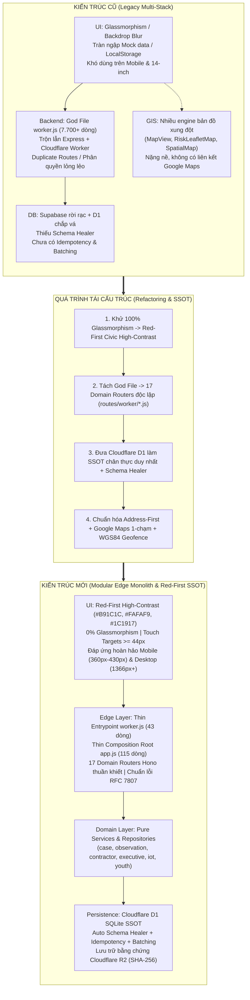
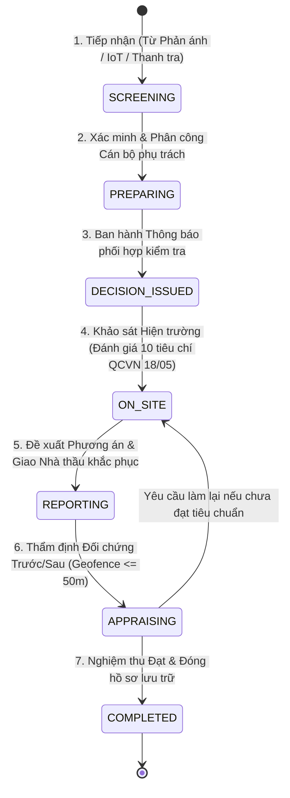
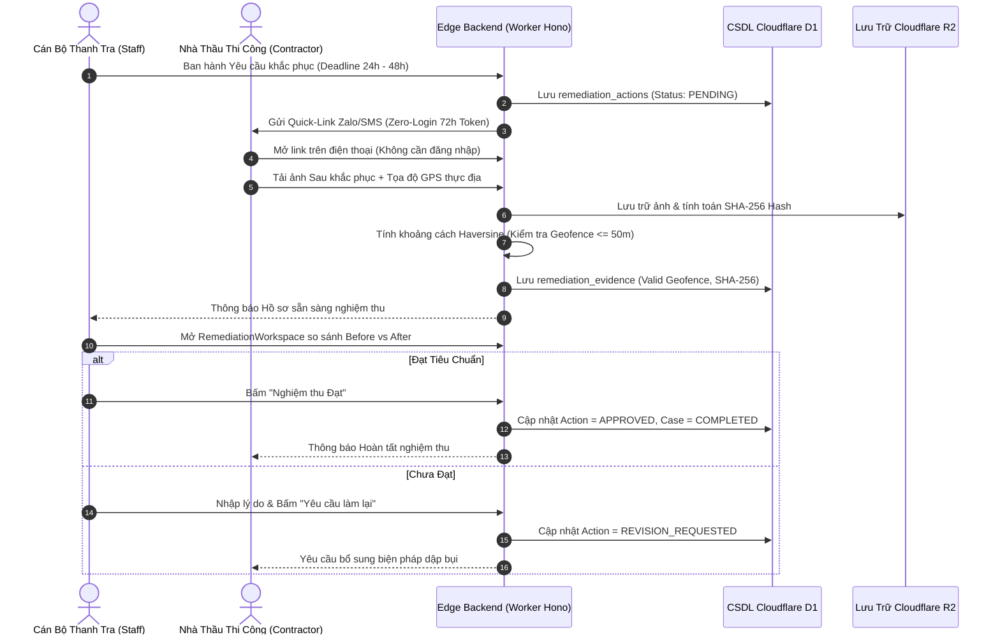

# DUSTGUARD VN — BÁO CÁO CODEBASE EXPLORER & SƠ ĐỒ TIẾN HÓA KIẾN TRÚC HỆ THỐNG

> **Mục tiêu**: Cung cấp bức tranh toàn cảnh trực quan (Visual Graph) về sự chuyển dịch từ kiến trúc cũ sang hệ thống mới, phân rã chi tiết từng phân hệ tính năng, vị trí file code tương ứng và định vị giao diện phù hợp với người dùng thực tế.

---

## 1. Hành Trình Tiến Hóa Kiến Trúc (Old vs New Architecture)



---

## 2. Sơ Đồ Phân Rã Phân Hệ Nghiệp Vụ & Vị Trí Mã Nguồn (Domain Feature Map)

```mermaid
graph TD
    classDef domain fill:#FEF2F2,stroke:#B91C1C,stroke-width:2px,color:#991B1B,font-weight:bold;
    classDef ui fill:#F0FDF4,stroke:#15803D,stroke-width:1.5px,color:#14532D;
    classDef be fill:#EFF6FF,stroke:#1D4ED8,stroke-width:1.5px,color:#1E3A8A;
    classDef db fill:#FFFBEB,stroke:#D97706,stroke-width:1.5px,color:#78350F;

    ROOT["HỆ THỐNG DUSTGUARD VN"] :::domain

    %% 1. CITIZEN & YOUTH
    ROOT --> D1["1. Công Dân & Thanh Niên (Citizen & Youth)"] :::domain
    D1 --> D1_UI["UI Pages & Components:\n- CitizenReport.jsx (Form phản ánh 3 bước, nén ảnh, SHA-256)\n- CitizenPortal.jsx (Trung tâm quản lý phản ánh cá nhân)\n- CitizenNearby.jsx (Điểm nóng quanh đây & Google Maps)\n- CitizenMap.jsx (Bản đồ tra cứu theo Phường/Xã)\n- YouthCredits.jsx (Tín chỉ tình nguyện 20h = 4.0, QR Code)"] :::ui
    D1 --> D1_BE["Backend Routers & Logic:\n- routes/worker/public.routes.js\n- routes/worker/complaints.routes.js\n- routes/worker/community.routes.js\n- services/youth-credit.service.js"] :::be
    D1 --> D1_DB["D1 Tables:\ncomplaints, observations, youth_activities, youth_certificates"] :::db

    %% 2. STAFF CASE HUB & OPERATIONS
    ROOT --> D2["2. Cán Bộ Xử Lý (Staff Case Hub & Operations)"] :::domain
    D2 --> D2_UI["UI Pages & Components:\n- StaffCases.jsx (Quản lý hồ sơ, bộ lọc 5 nhóm, phân công)\n- StaffCaseDetail.jsx (Case Workspace 6 Tab: Thông tin, Ảnh,\n  Theo dõi, Khảo sát 10 tiêu chí, Khắc phục, Hồ sơ)\n- StaffDashboard.jsx (Hàng đợi ưu tiên P1/P2, SLA countdown)\n- StaffMonitoring.jsx (Quan trắc trạm IoT, đồ thị 24h)\n- StaffAlerts.jsx (Cảnh báo vượt ngưỡng, nút tạo Case nguyên tử)"] :::ui
    D2 --> D2_BE["Backend Routers & Logic:\n- routes/worker/cases.routes.js\n- routes/worker/inspections.routes.js\n- routes/worker/sensors.routes.js\n- domain/cases/case.rules.js (State Machine 7 bước)"] :::be
    D2 --> D2_DB["D1 Tables:\ncases, inspections, audit_logs, alerts, sensors, sensor_readings"] :::db

    %% 3. CONTRACTOR REMEDIATION
    ROOT --> D3["3. Nhà Thầu Thi Công (Contractor Remediation)"] :::domain
    D3 --> D3_UI["UI Pages & Components:\n- ContractorDashboard.jsx (Tổng quan nhiệm vụ & hạn xử lý)\n- RemediationWorkspace.jsx (Đối chứng Trước/Sau & Geofence)\n- ContractorEvidenceUpload.jsx (Nộp ảnh thực địa, GPS)\n- ContractorTasks.jsx (Danh sách hạng mục cần khắc phục)"] :::ui
    D3 --> D3_BE["Backend Routers & Logic:\n- routes/worker/contractor.routes.js\n- routes/worker/actions.routes.js\n- services/contractor.service.js (Zero-Login Quick Token 72h)"] :::be
    D3 --> D3_DB["D1 Tables:\nremediation_actions, remediation_evidence, sites"] :::db

    %% 4. EXECUTIVE & LEGALTECH
    ROOT --> D4["4. Lãnh Đạo & Pháp Lý (Executive & LegalTech)"] :::domain
    D4 --> D4_UI["UI Pages & Components:\n- ExecutiveDashboard.jsx (Bản đồ nhiệt điều hành, chỉ đạo trực tiếp)\n- A4InteractiveEditor.jsx (Soạn thảo văn bản chuẩn NĐ 30/2020)\n- ExecutiveApprovals.jsx (Phê duyệt kết luận & Ký số điện tử CA)\n- ExecutiveReports.jsx (Xuất báo cáo ESG / DEMS / CSR)"] :::ui
    D4 --> D4_BE["Backend Routers & Logic:\n- routes/worker/executive.routes.js\n- routes/worker/documents.routes.js\n- routes/worker/csr.routes.js\n- legal-document-engine/renderers/renderLegalDocumentDocx.js"] :::be
    D4 --> D4_DB["D1 Tables:\nlegal_documents, executive_directives, system_audit_logs"] :::db

    %% 5. ADMIN & BACKOFFICE
    ROOT --> D5["5. Quản Trị Hệ Thống (Admin & Backoffice)"] :::domain
    D5 --> D5_UI["UI Pages & Components:\n- UsersManagement.jsx (CRUD Người dùng, Phân vai trò, Khóa/Mở)\n- DataManagement.jsx (Gán trạm đo vào công trình, đồng bộ)\n- StaffSettings.jsx (Cấu hình ngưỡng cảnh báo & danh mục)"] :::ui
    D5 --> D5_BE["Backend Routers & Logic:\n- routes/worker/admin.routes.js\n- routes/worker/auth.routes.js\n- routes/worker/storage.routes.js"] :::be
    D5 --> D5_DB["D1 Tables:\nusers, sessions, accounts, devices, system_configs"] :::db
```

---

## 3. Luồng Tác Nghiệp Cốt Lõi (Core Interaction Workflows)

### 3.1. Chu Trình 7 Bước Xử Lý Vụ Việc Môi Trường (Case Enforcement DAG)



### 3.2. Chu Trình Nộp & Nghiệm Thu Minh Chứng Nhà Thầu (Contractor Remediation Loop)



---

## 4. Hướng Dẫn Tra Cứu File Mã Nguồn & Code Map (Practical Developer Guide)

| Phân hệ / Nghiệp vụ | Giao diện Frontend (React / JSX) | Backend Router (Hono Edge) | CSDL D1 & Service | File Test Nhanh (< 0.5s) |
|---|---|---|---|---|
| **Đăng nhập & Phân quyền (Auth & RBAC)** | `app/src/modules/auth/Login.jsx`<br>`app/src/context/AuthContext.jsx` | `app/server/routes/worker/auth.routes.js` | `app/server/services/auth.service.js`<br>Bảng `users`, `sessions` | `node --test app/tests/auth-user-management-audit.test.js` |
| **Phản ánh Công dân & Điểm nóng** | `app/src/modules/citizen/CitizenReport.jsx`<br>`app/src/modules/citizen/CitizenMap.jsx`<br>`app/src/modules/citizen/CitizenNearby.jsx` | `app/server/routes/worker/complaints.routes.js`<br>`app/server/routes/worker/public.routes.js` | `app/server/services/complaint.service.js`<br>Bảng `complaints`, `observations` | `node --test app/tests/citizen-real-world-audit.test.js` |
| **Quản lý Vụ việc Cán bộ (Case Hub)** | `app/src/modules/staff/StaffCases.jsx`<br>`app/src/modules/staff/StaffCaseDetail.jsx`<br>`app/src/modules/staff/RemediationWorkspace.jsx` | `app/server/routes/worker/cases.routes.js`<br>`app/server/routes/worker/inspections.routes.js` | `app/server/services/case.service.js`<br>Bảng `cases`, `inspections`, `actions` | `node --test app/tests/case-enforcement-dag-7steps.test.js` |
| **Giám sát IoT & Cảnh báo Tự động** | `app/src/modules/staff/StaffMonitoring.jsx`<br>`app/src/modules/staff/StaffAlerts.jsx` | `app/server/routes/worker/sensors.routes.js` | `app/server/services/sensor.service.js`<br>Bảng `sensors`, `sensor_readings`, `alerts` | `node --test app/tests/alert-to-case-atomic.test.js` |
| **Cổng Nhà thầu (Zero-Login)** | `app/src/modules/contractor/ContractorDashboard.jsx`<br>`app/src/modules/contractor/ContractorEvidenceUpload.jsx` | `app/server/routes/worker/contractor.routes.js`<br>`app/server/routes/worker/actions.routes.js` | `app/server/services/contractor.service.js`<br>Bảng `remediation_actions`, `sites` | `node --test app/tests/contractor-ui-workspace.test.js` |
| **Văn bản Pháp lý & Ký số A4** | `app/src/legal-document-engine/A4InteractiveEditor.jsx`<br>`app/src/modules/executive/ExecutiveApprovals.jsx` | `app/server/routes/worker/documents.routes.js`<br>`app/server/routes/worker/executive.routes.js` | `app/server/lib/legal-document-engine/`<br>Bảng `legal_documents` | `node --test app/tests/executive-command-center.test.js` |
| **Tín chỉ Thanh niên & QR** | `app/src/modules/youth/YouthCredits.jsx` | `app/server/routes/worker/community.routes.js` | `app/server/services/youth-credit.service.js`<br>Bảng `youth_activities`, `certificates` | `node --test app/tests/youth-credits.test.js` |
| **Quản trị Người dùng & Cấu hình** | `app/src/modules/admin/UsersManagement.jsx`<br>`app/src/modules/staff/StaffSettings.jsx` | `app/server/routes/worker/admin.routes.js` | `app/server/repositories/user.repository.js`<br>Bảng `users`, `system_audit_logs` | `node --test app/tests/admin-executive-rbac-penetration.test.js` |

---

## 5. Quy Tắc Bất Biến Khi Phát Triển Tính Năng Mới (Engineering Invariants)

1. **Thiết Kế Giao Diện Red-First & Không Glassmorphism**:
   - Màu chủ đạo: Đỏ thương hiệu `#B91C1C` (Hover `#991B1B`, Nền mềm `#FEF2F2`, Viền `#FECACA`).
   - Nền sáng `#FAFAF9`, thẻ trắng `#FFFFFF`, chữ đậm `#1C1917`, chữ phụ `#57534E`.
   - Giữ màu cảnh báo ngữ nghĩa: Thành công xanh `#15803D`, Cảnh báo cam `#C2410C`, Lỗi đỏ `#DC2626`.
   - **Tuyệt đối cấm** `backdrop-blur-*` (Glassmorphism), Touch target tối thiểu $\ge 44\text{px} \times 44\text{px}$.
2. **D1 SQLite Là Chân Lý Duy Nhất (Single Source of Truth - SSOT)**:
   - Mọi dữ liệu nghiệp vụ (`cases`, `complaints`, `sites`, `tasks`, `users`, `sensors`) phải đọc/ghi trực tiếp vào D1 qua API Hono Edge.
   - LocalStorage chỉ dùng lưu cấu hình giao diện (`theme`, `dg-lang`), session token tạm thời (`dustguard_user`) và bản nháp ngoại tuyến khi mất mạng (`dg_active_report_form`).
3. **Quy Trình Kiểm Thử Siêu Tốc 3 Bước**:
   - **Bước 1**: Chạy test đơn lẻ mục tiêu khi vừa sửa code (`node --test app/tests/<file>.test.js` trong < 0.5s).
   - **Bước 2**: Chạy kiểm tra cổng trước khi commit (`npm --prefix app run verify:quick` trong ~2s).
   - **Bước 3**: Cập nhật `TIMELINE.md` và tự động thực hiện Micro-Commit qua CLI PowerShell.
