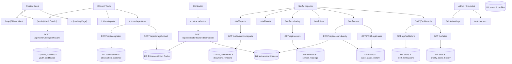

# Product Consistency Graph — DustGuard VN

Biểu đồ quan hệ kiến trúc thực tế giữa Role, Route, Feature, API và D1 Entities:

```mermaid
graph TD
    %% Roles
    Public["Public / Guest"]
    Citizen["Citizen / Youth"]
    Staff["Staff / Inspector"]
    Contractor["Contractor"]
    Admin["Admin / Executive"]

    %% Routes
    R_Landing["/ (Landing Page)"]
    R_Map["/map (Citizen Map)"]
    R_Youth["/youth (Youth Credits)"]
    R_ReportNew["/citizen/report/new"]
    R_ReportsList["/citizen/reports"]
    R_StaffDash["/staff (Dashboard)"]
    R_StaffCases["/staff/cases"]
    R_StaffSites["/staff/sites"]
    R_StaffMonitoring["/staff/monitoring"]
    R_StaffAlerts["/staff/alerts"]
    R_StaffReports["/staff/reports"]
    R_ContractorTasks["/contractor/tasks"]
    R_AdminUsers["/admin/users"]
    R_AdminSettings["/admin/settings"]

    %% Connect Roles to Routes
    Public --> R_Landing
    Public --> R_Map
    Public --> R_Youth
    Citizen --> R_ReportNew
    Citizen --> R_ReportsList
    Citizen --> R_Youth
    Staff --> R_StaffDash
    Staff --> R_StaffCases
    Staff --> R_StaffSites
    Staff --> R_StaffMonitoring
    Staff --> R_StaffAlerts
    Staff --> R_StaffReports
    Contractor --> R_ContractorTasks
    Admin --> R_AdminUsers
    Admin --> R_AdminSettings

    %% APIs
    API_Complaints["POST /api/complaints"]
    API_Cases["GET/POST /api/cases"]
    API_CasesVerify["POST /api/cases/:id/verify"]
    API_Sites["GET /api/sites"]
    API_Sensors["GET /api/sensors"]
    API_Alerts["GET /api/staff/alerts"]
    API_ContractorRemediate["POST /api/contractor/tasks/:id/remediate"]
    API_YouthClaim["POST /api/community/youth/claim"]
    API_ExecReports["GET /api/executive/reports"]
    API_Storage["POST /api/storage/upload"]

    %% Connect Routes to APIs
    R_ReportNew --> API_Storage
    R_ReportNew --> API_Complaints
    R_StaffDash --> API_Sites
    R_StaffDash --> API_Alerts
    R_StaffCases --> API_Cases
    R_StaffCases --> API_CasesVerify
    R_StaffMonitoring --> API_Sensors
    R_StaffReports --> API_ExecReports
    R_ContractorTasks --> API_ContractorRemediate
    R_Youth --> API_YouthClaim

    %% D1 Database Entities
    DB_Obs[("D1: observations & observation_evidence")]
    DB_Cases[("D1: cases & case_status_history")]
    DB_Sites[("D1: sites & priority_score_history")]
    DB_Sensors[("D1: sensors & sensor_readings")]
    DB_Alerts[("D1: alerts & alert_notifications")]
    DB_Actions[("D1: actions & evidences")]
    DB_Youth[("D1: youth_activities & youth_certificates")]
    DB_Docs[("D1: draft_documents & document_revisions")]
    DB_Users[("D1: users & profiles")]
    R2_Store[("R2: Evidence Object Bucket")]

    %% Connect APIs to D1 Entities
    API_Complaints --> DB_Obs
    API_Storage --> R2_Store
    API_Cases --> DB_Cases
    API_CasesVerify --> DB_Cases
    API_CasesVerify --> DB_Actions
    API_Sites --> DB_Sites
    API_Sensors --> DB_Sensors
    API_Alerts --> DB_Alerts
    API_ContractorRemediate --> DB_Actions
    API_ContractorRemediate --> R2_Store
    API_YouthClaim --> DB_Youth
    API_ExecReports --> DB_Docs
```
