# DUSTGUARD VN — YOUTH PORTAL INFORMATION ARCHITECTURE & DETAILED WIREFRAME SPECIFICATION
**Tài liệu Thiết kế Kiến trúc Thông tin & Wireframe Chuẩn Phân hệ Thanh niên (Youth Portal)**
*Phiên bản: 2.0-SSOT | Bản quyền: Ban Điều phối Dự án Giám sát Môi trường Thanh niên DustGuard VN*

---

## 1. Tổng quan & Triết lý Thiết kế (Design Philosophy & Identity)

### 1.1. Bối cảnh & Mục tiêu
Phân hệ Thanh niên (**Youth Action Portal**) của DustGuard VN là nền tảng CivicTech trao quyền cho các thế hệ học sinh, sinh viên, các Câu lạc bộ Tình nguyện (CLB Xung kích, Môi trường, CTXH) và thanh niên địa phương:
1. **Biến quan tâm thành hành động có dữ liệu**: Không chỉ đăng bài phản ánh cảm tính, thanh niên thu thập bằng chứng số có GPS, thẻ thời gian và chuỗi băm SHA-256 bất biến.
2. **Theo dõi chu kỳ thực chất (24h - 48h)**: Quay lại hiện trường chụp ảnh đối chiếu trước/sau, kiểm tra che chắn và tham gia nghiệm thu hiện trường.
3. **Minh bạch và ghi nhận xứng đáng**: Tự động lượng hóa giờ công tình nguyện (20h = 4.0 tín chỉ ngoại khóa / 80 điểm rèn luyện), cấp Giấy Chứng nhận A4 số hóa theo Nghị định 30/2020/NĐ-CP.

### 1.2. 5 Nguyên tắc Bất biến (Core Invariants)
- 🟢 **Giao diện sáng màu, tương phản cao (High-Contrast Civic Light Mode)**: Nền kem `#FDFBF7`, thẻ trắng `#FFFFFF`, chữ mực đậm `#231b14`, điểm nhấn đỏ dấu ấn `#9f241f`, xanh lá hành động `#0d6f64`. Đảm bảo hiển thị hoàn hảo ngoài trời nắng gắt khi tuần tra thực địa.
- 🚫 **Tuyệt đối KHÔNG Glassmorphism**: Không dùng `backdrop-blur`, không nền mờ đục gây giảm độ tương phản và khó đọc trên thiết bị di động tầm trung.
- 📱 **Mobile-Perfect (375px - 390px - 430px)**: 100% diện tích chạm (touch target) $\ge 44\text{px} \times 44\text{px}$, nút bấm trong tầm với ngón tay cái, không vỡ layout ngang (`overflow-x-hidden`).
- ⚡ **Action-Oriented (Định hướng hành động)**: Mọi màn hình, thông báo hay trạng thái trống (empty state) đều có CTA dẫn thẳng vào một nhiệm vụ cụ thể, loại bỏ 100% màn hình "số 0" bế tắc.
- 🔒 **D1 SSOT & Bằng chứng Toàn vẹn**: Mọi tương tác ghi nhận, đối chiếu và hoàn thành nhiệm vụ đều đồng bộ trực tiếp vào cơ sở dữ liệu Cloudflare D1 và lưu trữ minh chứng băm SHA-256 trên Cloudflare R2.

---

## 2. Tái cấu trúc Kiến trúc Thông tin (Information Architecture - IA)

Cấu trúc điều hướng của Youth Portal được tinh gọn thành **5 mục chức năng chuẩn mực**, trực quan và dễ tiếp cận:

```mermaid
graph TD
    A["Cổng Thanh niên DustGuard VN (/community)"] --> B["1. Trang chủ (/community)"]
    A --> C["2. Khám phá & Bản đồ (/community/discover)"]
    A --> D["3. Nhiệm vụ (/community/actions)"]
    A --> E["4. Đóng góp & Tác động (/community/impact)"]
    A --> F["5. Hồ sơ & CLB (/community/profile & /club)"]
    
    A -.-> G["Elevated Center Action: Ghi nhận mới (/community/observe)"]
    
    B --> B1["Greeting & Thời tiết/AQI"]
    B --> B2["Primary Action gần nhất (< 1.2km)"]
    B --> B3["Impact Counter 4 chỉ số"]
    B --> B4["Bản đồ mini điểm nóng 300m"]
    B --> B5["Nhiệm vụ của Tôi widget"]
    B --> B6["CLB Tiên phong widget"]

    C --> C1["Bản đồ nhiệt Điểm nóng & Bán kính 300m"]
    C --> C2["Chiến dịch Môi trường Học đường"]
    C --> C3["Bảng vinh danh CLB Tiên phong"]

    D --> D1["Bộ lọc: Tất cả / Giao cho Tôi / Giao cho CLB"]
    D --> D2["Bộ lọc trạng thái: Cần làm / Đang làm / Đã xong"]
    D --> D3["Checklist đối chiếu 24h-48h (+20 pts)"]
    D --> D4["Xem bằng chứng gốc SHA-256"]

    E --> E1["Tác động 3 cấp độ (Cá nhân - CLB - Xã hội)"]
    E --> E2["Tiến độ Tín chỉ (20h = 4.0 TC / 80 điểm)"]
    E --> E3["Mẫu Giấy Chứng nhận A4 (NĐ 30/2020)"]
    E --> E4["Mã QR xác thực & Chữ ký số D1"]

    F --> F1["Hồ sơ Tình nguyện viên & MSSV"]
    F --> F2["Thông tin CLB / Đội trực thuộc"]
    F --> F3["Huy hiệu & Danh hiệu đạt được"]
    F --> F4["Notification Center & Cài đặt thông báo"]
```



### Bảng đối chiếu URL & Chức năng Cốt lõi:

| STT | Tên phân hệ | Tuyến đường (Route Path) | Vai trò & Trọng tâm trải nghiệm |
| :---: | :--- | :--- | :--- |
| **1** | **Trang chủ** | `/community` | Hub điều hành cá nhân hoá, nhắc việc ưu tiên gần nhất, bộ đếm tác động thời gian thực và widget lối tắt. |
| **2** | **Khám phá & Bản đồ** | `/community/discover` | Bản đồ nhiệt vùng đệm 300m quanh trường học, danh sách chiến dịch chuyên đề, bảng xếp hạng các CLB toàn quốc. |
| **3** | **Nhiệm vụ Thực địa** | `/community/actions` | Hàng đợi công việc kiểm tra hiện trường, checklist tái kiểm tra sau 24h-48h, xác nhận hoàn tất nhận điểm tích lũy. |
| **4** | **Đóng góp & Tác động** | `/community/impact` | Báo cáo minh chứng 3 cấp độ, theo dõi tiến độ giờ tình nguyện quy đổi tín chỉ, in Giấy chứng nhận A4 số hóa. |
| **5** | **Hồ sơ & CLB** | `/community/profile` hoặc `/community/club` | Quản lý định danh sinh viên/tình nguyện viên, liên kết CLB đại học/đoàn phường, trung tâm thông báo có nút hành động. |
| **★** | **Nút Hành động Nổi bật** | `/community/observe` | Nút tròn đỏ nổi giữa Bottom Nav: Wizard 5 bước ghi nhận hiện trường có GPS, EXIF và băm mã SHA-256. |

---

## 3. Thiết kế Wireframe Chi Tiết (Detailed ASCII & Component Wireframes)

---

### 3.1. Wireframe 1: Trang chủ Thanh niên Mới (`/community`)

#### Bố cục trên Màn hình Di động (Mobile Viewport: 375px - 390px):
```text
+-------------------------------------------------------------+
| [DG] DustGuard VN              [🔔 2] [Avatar An]          |
+-------------------------------------------------------------+
| ☀️ Chào An! Hôm nay Dĩ An có 2 điểm cần bạn hỗ trợ          |
| 📍 Phường Dĩ An · AQI 142 (Kém - Cần che chắn công trường)  |
+-------------------------------------------------------------+
| 🚨 HÀNH ĐỘNG GẦN BẠN NHẤT (ƯU TIÊN KHẨN)                   |
| ┌─────────────────────────────────────────────────────────┐ |
| │ ⏱️ Còn 45 phút · Cách bạn 450m                          │ |
| │ Chụp ảnh đối chiếu tan trường (17:30)                   │ |
| │ TH Dĩ An - Bụi xe tải thi công đường Trần Hưng Đạo      │ |
| │ ------------------------------------------------------- │ |
| │ [ 📸 Bắt đầu chụp ảnh đối chiếu (+20 pts) → ]        │ |
| └─────────────────────────────────────────────────────────┘ |
+-------------------------------------------------------------+
| 📊 TÁC ĐỘNG CỦA BẠN & CỘNG ĐỒNG                            |
| ┌───────────────┬───────────────┬─────────────────────────┐ |
| │ 42.5 Giờ     │ 6 Trường học  │ 32 Bằng chứng           │ |
| │ Tình nguyện   │ Bán kính 300m │ Băm SHA-256             │ |
| └───────────────┴───────────────┴─────────────────────────┘ |
+-------------------------------------------------------------+
| 🗺️ BẢN ĐỒ VÙNG ĐỆM 300M QUANH BẠN                          |
| ┌─────────────────────────────────────────────────────────┐ |
| │  [ Map View: Radar 1.5km - 3 Điểm Nóng ]                │ |
| │  🔴 TH Dĩ An (Cần chụp lại) · 🟡 THCS Võ Trường Toản    │ |
| │  ------------------------------------------------------ │ |
| │  [ 🧭 Mở Bản đồ Khám phá Toàn cảnh → ]              │ |
| └─────────────────────────────────────────────────────────┘ |
+-------------------------------------------------------------+
| 📋 NHIỆM VỤ CẦN LÀM (2)                   [Xem tất cả (5)]  |
| ┌─────────────────────────────────────────────────────────┐ |
| │ [ ] 1. Kiểm tra biển báo thi công & hotline chỉ huy     │ |
| │     Hạn: Ngày mai 09:00 · TH Dĩ An · +20 pts            │ |
| │ [ ] 2. Xác minh dập tắt điểm đốt rác đê sông Đuống      │ |
| │     Hạn: Hôm nay 15:00 · CLB Đông Anh · +25 pts         │ |
| └─────────────────────────────────────────────────────────┘ |
+-------------------------------------------------------------+
| 🏆 CLB TRỰC THUỘC: CLB Môi Trường Xanh UIT & ĐH Bách Khoa   |
| ┌─────────────────────────────────────────────────────────┐ |
| │ Xếp hạng: #2 Toàn quốc · 298.0 Giờ · 110 Điểm xử lý     │ |
| │ [ Xem Bảng vinh danh CLB → ]                        │ |
| └─────────────────────────────────────────────────────────┘ |
|                                                             |
+-------------------------------------------------------------+
| [🏠 Trang chủ] [🧭 Khám phá] ( [➕] ) [📋 Nhiệm vụ] [🎖️ Tác động]|
+-------------------------------------------------------------+
```

#### Chi tiết Phân cấp & Tương tác trên Desktop (1200px Grid):
- **Cột Trái (65% chiều rộng)**:
  - Welcome Banner lớn kết hợp chỉ số thời tiết & AQI khu vực học đường.
  - Thẻ Hành động Khẩn cấp gần nhất (Primary Urgent Action Card) viền nổi bật, có cự ly GPS và đếm ngược thời gian.
  - Widget Bản đồ Tương tác trực tiếp (Mini Interactive Map 300m) cho phép bấm vào marker để mở modal nhiệm vụ.
  - Danh sách Nhiệm vụ ưu tiên với checkbox hoàn thành nhanh và tag phân loại.
- **Cột Phải (35% chiều rộng)**:
  - Thẻ Tiến độ Tín chỉ Cá nhân (Progress Bar 20h = 4.0 TC) và nút xuất Giấy chứng nhận A4.
  - Thẻ CLB Tiên phong (Club Squad Widget) hiển thị Top 3 thành viên tích cực nhất tuần và thứ hạng CLB.
  - Feed Hoạt động Thời gian thực (Live Evidence Stream) cập nhật các bức ảnh vừa được đồng đội tải lên mạng lưới.

---

### 3.2. Wireframe 2: Onboarding 3 Bước Hành Động Nhanh (Fast-Track Action Onboarding)

Quy trình onboarding 3 bước giúp người dùng mới tham gia hành động trong **dưới 60 giây**, không yêu cầu đăng ký phức tạp:

```text
===================================================================
BƯỚC 1/3: CHỌN KHU VỰC QUAN TÂM & BẢO VỆ
===================================================================
┌─────────────────────────────────────────────────────────────────┐
│ 📍 Vị trí hiện tại của bạn: Phường Dĩ An, Bình Dương            │
│ [ 🎯 Sử dụng GPS Hiện tại ] hoặc [ Chọn Tỉnh/Thành khác ]       │
│                                                                 │
│ Chọn 1 trường học hoặc khu dân cư bạn muốn bảo vệ:              │
│ (o) 🏫 Trường Tiểu học Dĩ An (Cách 450m - Có 2 điểm nóng)       │
│ ( ) 🏫 Trường THCS Võ Trường Toản (Cách 800m)                   │
│ ( ) 🏫 Trường Mầm non Hoa Sen (Cách 1.1km)                      │
│                                                                 │
│ [ Tiếp tục → (Bước 2) ]                                     │
└─────────────────────────────────────────────────────────────────┘

===================================================================
BƯỚC 2/3: CHỌN TƯ CÁCH & LIÊN KẾT CLB (TÙY CHỌN TÍN CHỈ)
===================================================================
┌─────────────────────────────────────────────────────────────────┐
│ Bạn tham gia với tư cách nào?                                   │
│                                                                 │
│ [ 🧑 Cá nhân Tình nguyện ]  [ 🎓 Sinh viên CLB ]  [ 🚩 Đoàn viên ]│
│                                                                 │
│ * Nếu bạn là Sinh viên (Tự động tích lũy giờ rèn luyện):        │
│ ┌─────────────────────────────────────────────────────────────┐ │
│ │ Họ và tên: [ Nguyễn Văn An                              ]   │ │
│ │ Mã số Sinh viên (MSSV): [ 20221234                      ]   │ │
│ │ Trường: [ ĐH Bách Khoa Hà Nội (HUST)                  v ]   │ │
│ └─────────────────────────────────────────────────────────────┘ │
│                                                                 │
│ [ Tiếp tục → (Bước 3) ]                                     │
└─────────────────────────────────────────────────────────────────┘

===================================================================
BƯỚC 3/3: NHẬN NHIỆM VỤ KHỞI ĐỘNG ĐẦU TIÊN (FIRST ACTION)
===================================================================
┌─────────────────────────────────────────────────────────────────┐
│ 🎉 Chúc mừng bạn đã gia nhập Mạng lưới DustGuard VN!            │
│                                                                 │
│ 📋 Nhiệm vụ đầu tiên dành cho bạn (+20 điểm khởi động):         │
│ ┌─────────────────────────────────────────────────────────────┐ │
│ │ 📸 Ghi nhận hiện trường 1 công trường hoặc điểm khói bụi    │ │
│ │    Địa điểm gợi ý: Cổng Trường Tiểu học Dĩ An (450m)        │ │
│ │    Tiêu chuẩn: Chụp 1 ảnh rõ biển báo hoặc bạt che phủ      │ │
│ └─────────────────────────────────────────────────────────────┘ │
│                                                                 │
│ [ 🚀 BẮT ĐẦU GHI NHẬN NGAY ]      [ Để sau, vào Trang chủ ]     │
└─────────────────────────────────────────────────────────────────┘
```

---

### 3.3. Wireframe 3: Actionable Empty States (Không "Màn hình Số 0" Bế Tắc)

Mọi trạng thái khi dữ liệu trống đều được thiết kế thành một cơ hội hành động cụ thể:

#### Trạng thái 1: Khi chưa có nhiệm vụ nào được giao (Empty Task Queue)
```text
┌─────────────────────────────────────────────────────────────────┐
│                        ✨ TUYỆT VỜI! ✨                         │
│             Bạn đã hoàn thành 100% nhiệm vụ hôm nay             │
│                                                                 │
│  Hiện tại không còn nhiệm vụ tồn đọng trong danh sách của bạn.  │
│  Hãy tiếp tục tạo tác động bằng cách nhận các nhiệm vụ mở:      │
│                                                                 │
│  ┌───────────────────────────────────────────────────────────┐  │
│  │ 📍 GỢI Ý NHIỆM VỤ GẦN BẠN TRONG BÁN KÍNH 1.5KM:            │  │
│  │                                                           │  │
│  │ 1. 🔍 Khảo sát bạt che bụi công trường Chung cư Sunrise    │  │
│  │    Cách 600m · Yêu cầu: 1 ảnh · Thưởng: +20 pts           │  │
│  │    [ ➕ Nhận nhiệm vụ này ]                                │  │
│  │                                                           │  │
│  │ 2. 📸 Chụp ảnh nghiệm thu dọn dẹp điểm rác ngã tư Dĩ An   │  │
│  │    Cách 950m · Yêu cầu: 1 ảnh · Thưởng: +25 pts           │  │
│  │    [ ➕ Nhận nhiệm vụ này ]                                │  │
│  └───────────────────────────────────────────────────────────┘  │
│                                                                 │
│  [ ➕ Tạo một ghi nhận hiện trường mới quanh bạn ]              │
└─────────────────────────────────────────────────────────────────┘
```

#### Trạng thái 2: Khi chưa có ghi nhận nào quanh khu vực mới (Empty Location)
```text
┌─────────────────────────────────────────────────────────────────┐
│                        🛡️ VÙNG CHƯA CÓ LÁ CHẮN                  │
│       Chưa có dữ liệu giám sát trong bán kính 1km này           │
│                                                                 │
│  Khu vực này hiện chưa có tình nguyện viên nào ghi nhận.        │
│  Hãy là người tiên phong thiết lập vùng an toàn cho học sinh!   │
│                                                                 │
│  [ 📸 Chụp ảnh & Tạo Ghi nhận Tiên phong Đầu tiên (+30 pts) ]   │
│  [ 🧭 Xem bản đồ các phường lân cận ]                           │
└─────────────────────────────────────────────────────────────────┘
```

---

### 3.4. Wireframe 4: Notification Center với CTA Trực Tiếp (Action-Oriented Notifications)

Thay vì chỉ thông báo thông tin một chiều, mỗi thông báo đều có nút tương tác trực tiếp:

```text
┌─────────────────────────────────────────────────────────────────┐
│ 🔔 TRUNG TÂM THÔNG BÁO HÀNH ĐỘNG                [Đánh dấu đã đọc]│
├─────────────────────────────────────────────────────────────────┤
│ ⏰ NHẮC HẸN TÁI KIỂM ĐỊNH (24H TRÔI QUA)            10 phút trước│
│ Điểm nóng "Bụi xe ben cổng Trường Dĩ An" đã đến giờ đối chiếu.  │
│ Hãy kiểm tra xem nhà thầu đã phun nước giảm bụi chưa.           │
│ ┌─────────────────────────────────────────────────────────────┐ │
│ │ [ 📸 Chụp ảnh đối chiếu ngay ]     [ ⏳ Hẹn lại sau 2 giờ ]  │ │
│ └─────────────────────────────────────────────────────────────┘ │
├─────────────────────────────────────────────────────────────────┤
│ 👷 NHÀ THẦU ĐÃ GỬI MINH CHỨNG KHẮC PHỤC              1 giờ trước│
│ Chỉ huy công trường Sunrise vừa tải lên ảnh "Đã phủ bạt xe tải".│
│ Mời tình nguyện viên xác nhận kết quả trên thực địa.            │
│ ┌─────────────────────────────────────────────────────────────┐ │
│ │ [ 🔍 Xem ảnh & Xác thực ]          [ ⚠️ Báo cáo chưa đạt ]   │ │
│ └─────────────────────────────────────────────────────────────┘ │
├─────────────────────────────────────────────────────────────────┤
│ 🎖️ CHÚC MỪNG: BẠN ĐẠT MỐC TÍN CHỈ MỚI                Hôm qua    │
│ Bạn đã hoàn thành 15.0/20.0 Giờ tình nguyện (Đạt Mốc 3 - 3.0 TC).│
│ ┌─────────────────────────────────────────────────────────────┐ │
│ │ [ 📜 Xem Giấy chứng nhận A4 ]      [ ➕ Làm thêm 1 task (+5h)]│ │
│ └─────────────────────────────────────────────────────────────┘ │
└─────────────────────────────────────────────────────────────────┘
```

---

## 4. Đặc tả Quy chuẩn Giao diện & Design System Tokens

### 4.1. Bảng Màu Tương Phản Cao (High-Contrast Civic Palette)

| Tên Token | Hex Code | Ứng dụng cụ thể | Tiêu chuẩn WCAG |
| :--- | :--- | :--- | :--- |
| `canvas-bg` | `#FDFBF7` | Nền canvas toàn bộ trang web (Kem nhạt chống chói) | AAA |
| `surface-bg` | `#FFFFFF` | Thẻ Card, Modal, Sheet (Nền trắng đặc 100%, 0% blur) | AAA |
| `text-primary` | `#231b14` | Tiêu đề chính, văn bản cốt lõi (Mực đậm sắc nét) | AAA (Contrast > 14:1) |
| `text-secondary` | `#6b6056` | Mô tả phụ, hướng dẫn, metadata phụ trợ | AA (Contrast > 5.5:1) |
| `brand-seal` | `#9f241f` | Nút CTA chính, Tab đang chọn, Con dấu số A4 | AA (Contrast > 4.8:1) |
| `action-teal` | `#0d6f64` | Điểm số tình nguyện, chỉ số hoàn thành, nhãn xác thực | AAA (Contrast > 7.2:1) |
| `warning-amber`| `#b54708` | Cảnh báo khẩn cấp, nhắc nhở chu kỳ 24h, hạn chót | AA (Contrast > 4.6:1) |
| `border-sharp` | `#231b141f`| Viền thẻ card và phân cách (`rgba(35, 27, 20, 0.12)`) | Sắc nét, không nhòe |

### 4.2. Quy chuẩn Diện tích Chạm & Kích thước Di động (Touch Targets & Mobile Ergonomics)
1. **Chiều cao tối thiểu của nút bấm & Tab**: `min-h-[44px]` (WCAG 2.2 Level AA/AAA).
2. **Nút CTA Nổi bật Trung tâm (Elevated Primary CTA)**: `min-w-[56px] min-h-[56px]` với border trắng 3px tách biệt rõ với thanh navigation.
3. **Typography Mobile**:
   - `text-display`: `28px - 32px` (Font-weight: 800)
   - `text-heading`: `18px - 22px` (Font-weight: 700)
   - `text-body`: `14px - 15px` (Font-weight: 500/600, Line-height: 1.5)
   - `text-caption`: `11px - 12px` (Font-weight: 600, uppercase nhẹ cho metadata)
4. **Phòng chống tràn ngang (Defensive CSS Rules)**:
   - Toàn bộ `flex-child` có `min-w-0`.
   - Tiêu đề vụ việc, trường học và địa chỉ dùng `break-words` thay vì cắt ngắn `truncate` gây mất thông tin.
   - Footer của thẻ Card luôn gán `mt-auto` để các nút bấm trên cùng 1 hàng grid luôn thẳng hàng tăm tắp.

---

## 5. Kế hoạch Triển khai & Ma trận Truy vết (Implementation Roadmap)

| Giai đoạn | Nhiệm vụ kỹ thuật | File Code liên quan | Trạng thái |
| :---: | :--- | :--- | :---: |
| **P1** | Đồng bộ Điều hướng 5 Tabs & Active States | `CommunityNavigation.jsx`, `CommunityLayout.jsx` | ✅ HOÀN TẤT |
| **P2** | Tái cấu trúc Dashboard Trang chủ với 6 Widgets | `CommunityHome.jsx` | ✅ HOÀN TẤT |
| **P3** | Tích hợp Onboarding 3 Bước & Empty States | `CommunityHome.jsx`, `CommunityActions.jsx` | ✅ HOÀN TẤT |
| **P4** | Action-Oriented Notification Center & Toast Feedback | `CommunityActions.jsx`, `CommunityToastContext.jsx` | ✅ HOÀN TẤT |
| **P5** | Kiểm thử Tương thích Mobile Viewport (375px/390px/430px) | `tests/community-home-layout.test.js`, `tests/community-navigation-layout.test.js` | ✅ 34/34 PASS |

---
*Tài liệu được phê duyệt bởi Subagent 7 — Kiến trúc sư Trải nghiệm Giao diện Thanh niên & Wireframe (Youth IA & UI/UX Architect).*
