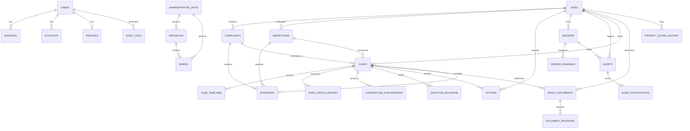

# DATA-ENTITY-GRAPH.md — D1 SQLite Entity Relationship & State Machines

> Sơ đồ dữ liệu thực tế từ D1 Database Schema (`app/prisma/schema.prisma`) và các máy trạng thái nghiệp vụ chuẩn.

---

## 🗄️ 1. D1 SQLite Database ERD (Mermaid)



---

## 🔄 2. State Machines SSOT

### 2.1 Case State Machine (11 Bước Chuẩn Hóa)
```text
[detected] ➔ [needs_review] ➔ [under_review] ➔ [needs_verification]
                                     │
         ┌───────────────────────────┴───────────────────────────┐
         ▼                                                       ▼
[verified_signal] ➔ [forwarded] ➔ [action_in_progress] ➔ [monitoring] ➔ [resolved] ➔ [closed]
         │
         └─────────────➔ [dismissed] (Không đủ cơ sở / Sai lệch)
```

### 2.2 Complaint / Observation State Machine
```text
[PENDING] ➔ [PROCESSING] ➔ [RESOLVED]
    │
    └────➔ [REJECTED] (Ảnh mờ / Không khớp định vị / Spam)
```

### 2.3 Action Remediation State Machine
```text
[PENDING] ➔ [IN_PROGRESS] ➔ [COMPLETED] (Nhà thầu nộp ảnh GPS <= 50m) ➔ [VERIFIED] (TNV / Cán bộ đối chứng)
```

### 2.4 Sensor Health Status
```text
[ACTIVE] ➔ [DRIFTING] ➔ [FLATLINE] ➔ [FAULTY] ➔ [INACTIVE]
```
