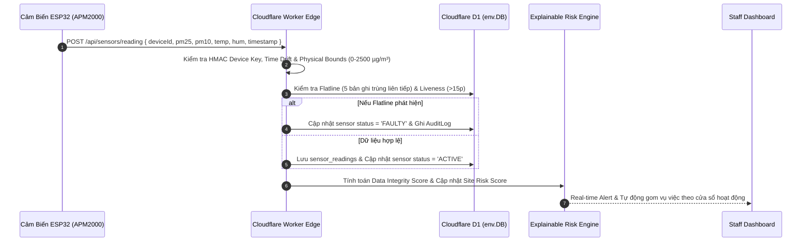
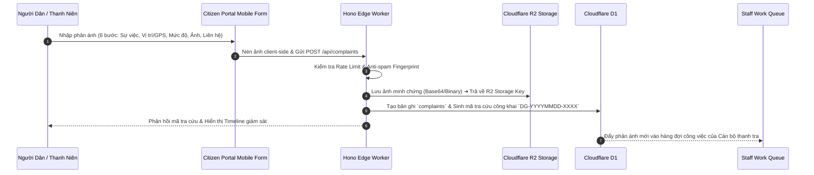
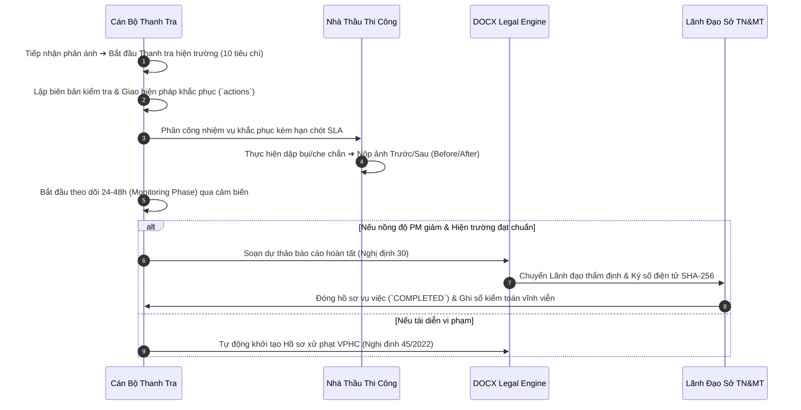

# DUSTGUARD VN — LUỒNG DỮ LIỆU VẬN HÀNH (DATA FLOW DIAGRAMS)

> **Mã tài liệu**: `DG-DATAFLOW-2026-SSOT`

---

## 1. LUỒNG THU NHẬP DỮ LIỆU CẢM BIẾN (SENSOR INGESTION FLOW)

---

## 2. LUỒNG PHẢN ÁNH CỘNG ĐỒNG (COMMUNITY ENGAGEMENT FLOW)

---

## 3. LUỒNG XỬ LÝ & BÀN GIAO THỰC ĐỊA (ENFORCEMENT & REMEDIATION FLOW)

