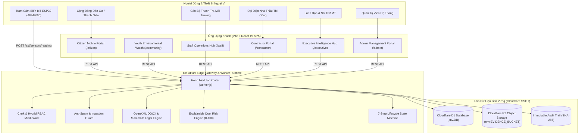

# DUSTGUARD VN — KIẾN TRÚC TOÀN HỆ THỐNG (SYSTEM ARCHITECTURE SSOT)

> **Tài liệu tham chiếu**: `DG-ARCH-2026-SSOT`  
> **Nền tảng**: 100% Cloudflare Native Modular Monolith (Hono + Workers + D1 SQLite + R2 Storage)

---

## 1. SƠ ĐỒ TOÀN CẢNH HỆ THỐNG (END-TO-END SYSTEM GRAPH)

---

## 2. NGUYÊN TẮC THIẾT KẾ KIẾN TRÚC (ARCHITECTURAL INVARIANTS)

1. **D1 SQLite is SSOT**: Không lưu trữ trạng thái nghiệp vụ lâu dài trên bộ nhớ tạm hay localStorage client.
2. **Zero Glassmorphism**: Toàn bộ giao diện tuân thủ bảng màu GovTech độ tương phản cao (`#FDFBF7` cream, `#231b14` ink, `#0d6f64` teal, `#9f241f` seal red).
3. **IoT is Optional**: Hệ thống hoạt động 100% ổn định ngay cả khi không có cảm biến vật lý trực tuyến (dựa trên quan sát cộng đồng).
4. **Explainable AI / Risk**: Mọi điểm rủi ro và khuyến nghị đều phải có căn cứ pháp lý và phân tích yếu tố cụ thể.
5. **Deterministic Auditability**: Mọi hành động nhạy cảm (ban hành quyết định, phê duyệt, nộp bằng chứng) đều được băm SHA-256 và lưu vết kiểm toán bất biến.
