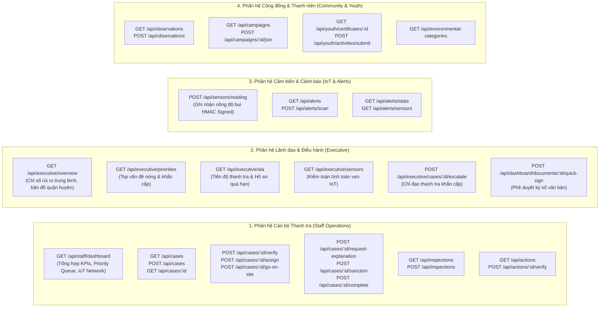

# Sơ Đồ Hệ Thống API & Điểm Cuối (API Map)

Hệ thống API của **DustGuard VN** được tổ chức theo kiến trúc RESTful chuẩn hóa trên Cloudflare Hono Edge, phục vụ 4 nhóm phân hệ:

## Bảng Tra Cứu Endpoint Trọng Tâm:

| HTTP Method | Đường dẫn Endpoint | Mô tả Chức năng | Phân quyền (RBAC) |
|---|---|---|---|
| `GET` | `/api/staff/dashboard` | Tải dữ liệu toàn diện cho Staff Dashboard (KPIs, Queue, Bản đồ, IoT) | Staff, Inspector, Admin |
| `POST` | `/api/sensors/reading` | Tiếp nhận telemetry từ cảm biến ESP32 (HMAC SHA-256) | Sensor Device |
| `GET` | `/api/cases` | Danh sách hồ sơ thanh tra 7 bước | Staff, Executive, Admin |
| `POST` | `/api/cases/:id/go-on-site` | Lập biên bản thanh tra hiện trường | Inspector, Staff |
| `POST` | `/api/dashboard/documents/:id/quick-sign` | Ký số phê duyệt văn bản xử phạt | Executive, Admin |
| `POST` | `/api/observations` | Tiếp nhận ghi nhận hiện trường từ công dân/tình nguyện viên | Public / Volunteer |
| `GET` | `/api/executive/overview` | Tổng quan điều hành môi trường đô thị | Executive, Admin |
