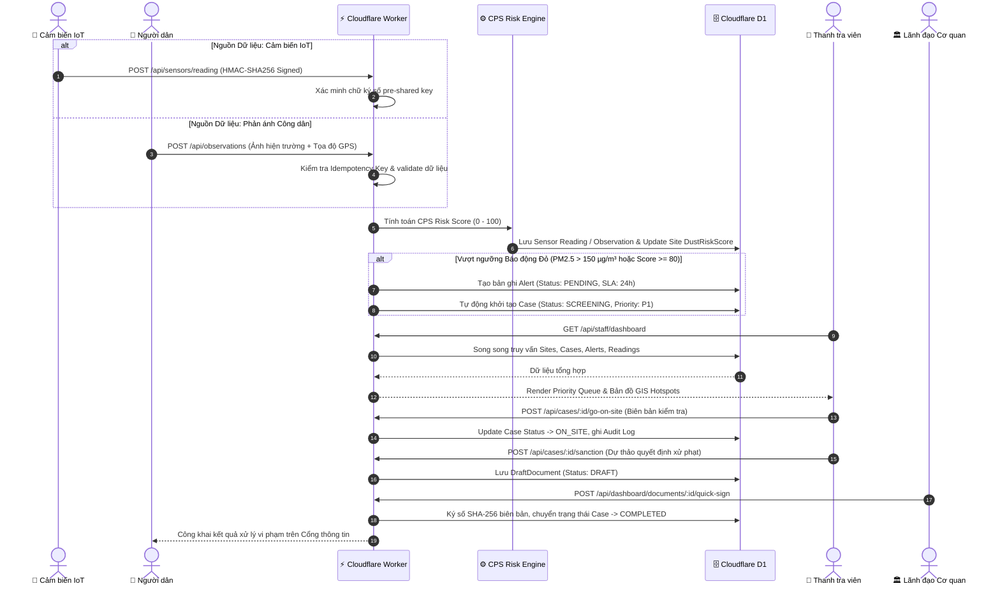

# Luồng Dữ Liệu Xử Lý Cảnh Báo & Hồ Sơ Thanh Tra (Data Flow)

Tài liệu này mô tả luồng dữ liệu từ lúc cảm biến IoT hoặc người dân phát hiện phát tán bụi mịn, đi qua khâu tính điểm rủi ro CPS, phân loại tự động vào Hàng đợi Ưu tiên (Priority Queue) của Staff Dashboard, và hoàn tất theo quy trình 7 bước.

## Các Mốc Trọng Yếu Trong Luồng:
1. **Kiểm tra chữ ký số HMAC**: Nếu chữ ký không khớp, API lập tức phản hồi mã lỗi `403 Forbidden` và đánh dấu cảm biến `TAMPERED`.
2. **Khởi tạo vụ việc tự động**: Khi nồng độ bụi vượt chuẩn nghiêm trọng, vụ việc được gắn nhãn `P1 KHẨN` với thời hạn SLA đếm ngược 24h.
3. **Ký số và Lưu vết**: Mọi thao tác biên bản, xử phạt đều được băm SHA-256 và lưu append-only vào bảng `audit_logs` để đảm bảo tính pháp lý không thể chối bỏ.
