# Sơ Đồ Thực Thể Cơ Sở Dữ Liệu D1 SSOT (Database Map)

Hệ thống cơ sở dữ liệu Cloudflare D1 của **DustGuard VN** được chuẩn hóa theo chuẩn quan hệ SQLite, phục vụ trọn vẹn 3 nhóm chức năng: Giám sát Môi trường (IoT & Sites), Quản lý Thanh tra Xử phạt (Cases & Sanctions), và Cộng đồng Thanh niên (Community & Youth).

```mermaid
erDiagram
    users ||--o{ session : "has"
    users ||--o| profiles : "has"
    users ||--o{ audit_logs : "records"
    users ||--o{ youth_activities : "performs"
    users ||--o{ youth_certificates : "receives"

    sites ||--o{ sensors : "contains"
    sites ||--o{ complaints : "receives"
    sites ||--o{ inspections : "undergoes"
    sites ||--o{ alerts : "triggers"
    sites ||--o{ cases : "tracked_by"
    sites ||--o{ actions : "executes"
    sites ||--o{ draft_documents : "subject_of"
    sites ||--o{ priority_score_history : "logs"

    sensors ||--o{ sensor_readings : "generates"
    sensors ||--o{ alerts : "triggers"

    alerts ||--o{ alert_notifications : "dispatches"

    cases ||--o{ case_timelines : "has"
    cases ||--o{ case_status_history : "tracks"
    cases ||--o{ contractor_explanations : "receives"
    cases ||--o{ sanction_decisions : "issues"
    cases ||--o{ draft_documents : "includes"
    cases ||--o{ evidences : "contains"
    cases ||--o{ actions : "monitors"

    draft_documents ||--o{ document_revisions : "versions"

    communities ||--o{ community_members : "enrolls"
    campaigns ||--o{ campaign_members : "enrolls"
    campaigns ||--o{ observations : "collects"
    
    observations ||--o{ observation_evidence : "has"
    observations ||--o{ follow_ups : "verifies"
    observations ||--o{ handoffs : "hands_over"

    legal_documents ||--o{ legal_obligations : "contains"
    legal_obligations ||--o{ obligation_checklist_mappings : "maps_to"
```

## Bảng Tra Cứu Thực Thể Chính:

| Bảng (Table) | Mục đích Nghiệp vụ | Khóa Ngoại (Foreign Keys) |
|---|---|---|
| `sites` | Quản lý danh mục công trường, điểm rủi ro bụi CPS, tọa độ GPS | `ward`, `province` |
| `sensors` | Quản lý trạm quan trắc IoT, tình trạng liveness/tamper | `siteId` -> `sites(id)` |
| `sensor_readings` | Chuỗi dữ liệu chu kỳ đo PM10/PM2.5, thời gian gửi | `sensorId` -> `sensors(id)` |
| `alerts` | Cảnh báo vượt ngưỡng tự động kèm thời hạn SLA | `siteId`, `sensorId` |
| `cases` | Hồ sơ thanh tra xử lý vi phạm 7 bước | `siteId`, `complaintId`, `inspectionId` |
| `draft_documents` | Dự thảo biên bản VPHC, thông báo khắc phục, quyết định ký số | `siteId`, `caseId`, `inspectionId` |
| `audit_logs` | Nhật ký bất biến ghi nhận mọi thay đổi trạng thái | `userId`, `targetId` |
| `youth_certificates` | Chứng chỉ tình nguyện viên ký số cryptographic hash | `user_id` -> `users(id)` |
