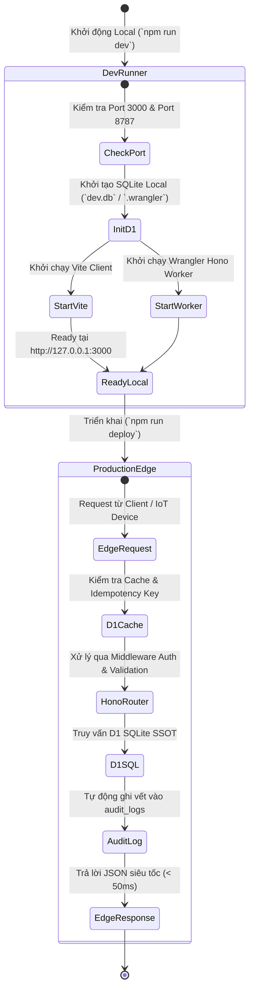

# Vòng Đời Thực Thi Thời Gian Chạy (Runtime Flow)

Hệ thống **DustGuard VN** hỗ trợ cả hai môi trường vận hành:
1. **Môi trường Phát triển Cục bộ (`npm run dev`)**: Vite Dev Server (Port 3000) kết hợp SQLite D1 Local Binding.
2. **Môi trường Triển khai Production (Cloudflare Edge)**: Cloudflare Pages + Cloudflare Workers + Remote D1.

## Cơ chế Đảm bảo Tính Ổn định (Runtime Reliability):
1. **Zero-Mock SSOT**: Dữ liệu tác nghiệp trên cả môi trường Dev và Prod đều đến từ cơ sở dữ liệu SQLite/D1 thật, không dùng mock RAM hay `setTimeout` giả lập.
2. **Graceful Fallback**: Trong trường hợp mất kết nối cơ sở dữ liệu, API và Frontend tự động chuyển sang chế độ dữ liệu an toàn để không làm gián đoạn trải nghiệm người dùng.
3. **Idempotency Protection**: Bảo vệ toàn bộ endpoint POST chống trùng lặp dữ liệu bằng bảng `idempotency_keys` với mã hash request.
