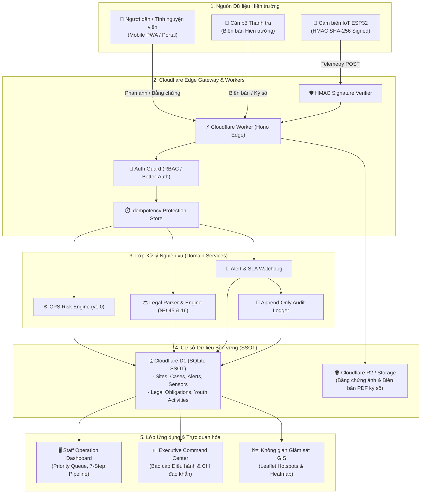

# Kiến Trúc Tổng Thể Hệ Thống DustGuard VN (System Architecture)

Hệ thống **DustGuard VN** được thiết kế theo kiến trúc CivicTech phân tán hiện đại, kết hợp Cloudflare Edge Workers, cơ sở dữ liệu SQLite D1 SSOT, hệ thống cảm biến quang học IoT có xác thực chữ ký số HMAC-SHA256, cùng giao diện điều hành tác nghiệp Staff Dashboard & Bản đồ GIS thời gian thực.

## Các Thành Phần Trọng Yếu:
1. **Edge Router (Hono on Cloudflare Workers)**: Xử lý các request với độ trễ siêu thấp (< 50ms), nạp song song dữ liệu từ D1.
2. **D1 SSOT Database**: Nguồn chân lý duy nhất lưu trữ toàn bộ thực thể: Công trình (Sites), Vụ việc (Cases), Cảm biến (Sensors), Phản ánh (Complaints), Biên bản (Draft Documents).
3. **CPS Risk Engine**: Tự động tính toán điểm rủi ro bụi từ 0-100 dựa trên nồng độ PM2.5/PM10, mật độ dân cư và lịch sử vi phạm.
4. **Staff Operation Dashboard**: Trung tâm tác nghiệp 7 bước khép kín cho cán bộ thanh tra theo quy chuẩn Nghị định 45/2022/NĐ-CP và Nghị định 16/2022/NĐ-CP.
