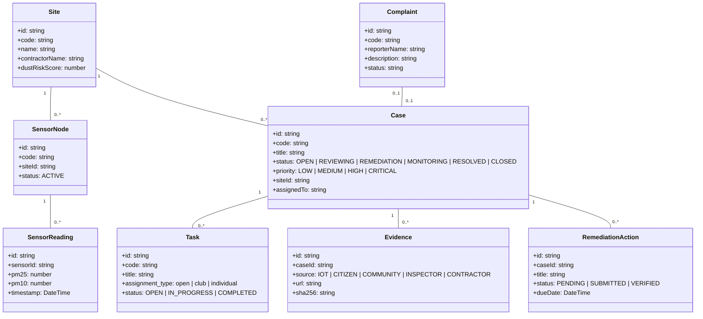

# DustGuard VN — Final Product Architecture & System SSOT

> **Phiên bản**: 2.0.0 (Final Architecture Consolidation)  
> **Cập nhật ngày**: 28/08/2026  
> **Trạng thái**: Single Source of Truth (SSOT) cho toàn bộ hệ thống DustGuard VN.

---

## 1. Tuyên Ngôn Sứ Mệnh & Giá Trị Cốt Lõi

**DustGuard VN** là nền tảng Công nghệ Công dân (CivicTech) kết nối đa bên nhằm giải quyết triệt để vấn đề ô nhiễm bụi công trình xây dựng và bảo vệ môi trường không khí đô thị:
1. **Phát hiện tín hiệu sớm**: Cảm biến IoT kết hợp phản ánh của người dân và khảo sát cộng đồng.
2. **Thiết lập bằng chứng số minh bạch**: Lưu trữ ảnh, tọa độ GPS, mã băm SHA-256 đối chứng Trước/Sau (Before/After).
3. **Quy trình xử lý thực tế, khép kín**: Cán bộ quản lý nhà nước giao việc, thanh tra hiện trường, yêu cầu nhà thầu khắc phục và xác minh nghiệm thu.
4. **Huy động sức mạnh cộng đồng & Thanh niên**: CLB sinh viên, tình nguyện viên tham gia chiến dịch khảo sát, giám sát điểm nóng quanh trường học, tích lũy giờ tình nguyện và tín chỉ thanh niên.

> [!IMPORTANT]
> **Nguyên tắc bất biến**:
> - **AI là trợ lý, không thay thế con người ra phán quyết hay xử phạt.**
> - **IoT Node là THIẾT BỊ / NGUỒN DỮ LIỆU, tuyệt đối KHÔNG phải là user role.**
> - **Cán bộ quản lý (Government Staff) $\neq$ Tình nguyện viên Cộng đồng (Community Volunteer).**
> - **Zero Mock Runtime: Mọi dữ liệu demo đều đọc/ghi qua CSDL D1 SQLite thật.**

---

## 2. Mô Hình Chủ Thể (Actor & Role Model SSOT)

Hệ thống phân định rạch ròi 6 Actor con người và 1 Chủ thể thiết bị:

```mermaid
graph TD
  Public[0. Khách vãng lai / Public] -->|Xem thông tin, giới thiệu| Landing[Landing Page /demo]
  Citizen[1. Người dân / Citizen] -->|Gửi phản ánh, theo dõi| CitizenApp[/citizen]
  Community[2. Cộng đồng & CLB / Community] -->|Khảo sát, nhận việc, nộp minh chứng| CommunityApp[/community]
  Staff[3. Cán bộ xử lý / Government Staff] -->|Tiếp nhận, thanh tra, nghiệm thu| StaffApp[/staff]
  Contractor[4. Nhà thầu / Contractor] -->|Nhận khắc phục, nộp ảnh hoàn thành| ContractorApp[/contractor]
  Admin[5. Ban vận hành / Admin] -->|Quản trị CSDL, Master Data, Users| AdminApp[/admin]
  IoT[6. Trạm giám sát IoT / Device Node] -->|HTTP Telemetry HMAC| TelemetryAPI[/api/telemetry]
```

### 2.1. Chi tiết từng Actor

| STT | Actor | Mã Role SSOT | Tên hiển thị Tiếng Việt | Phạm vi trách nhiệm & Quyền hạn |
| :---: | :--- | :--- | :--- | :--- |
| **0** | **Khách vãng lai** | `public` / `guest` | Khách vãng lai | Xem Landing page, Trung tâm Demo (`/demo`), hướng dẫn lắp đặt trạm đo, bản đồ chất lượng không khí công khai. |
| **1** | **Người dân** | `citizen` | Người dân | Gửi phản ánh kèm vị trí & ảnh chụp, theo dõi tiến độ xử lý phản ánh của mình qua mã tra cứu. |
| **2** | **Cộng đồng / CLB** | `community` (alias: `youth_member`) | Thành viên cộng đồng / Tình nguyện viên | Tham gia chiến dịch, nhận nhiệm vụ thực địa quanh trường học/khu dân cư, gửi ảnh đối chứng, tích lũy điểm/giờ cống hiến. *Không có thẩm quyền xử phạt hay đóng hồ sơ pháp lý.* |
| **3** | **Cán bộ xử lý** | `staff` (alias: `inspector`) | Cán bộ kiểm tra / Cán bộ xử lý | Quản lý vụ việc (Cases), xem dữ liệu telemetry cảm biến, lập biên bản thanh tra, phát hành yêu cầu khắc phục cho nhà thầu, xác minh hiện trường và đóng hồ sơ. |
| **4** | **Nhà thầu xây dựng** | `contractor` | Nhà thầu | Xem danh sách công trình phụ trách, tiếp nhận thông báo vi phạm/yêu cầu khắc phục, tải lên ảnh & bằng chứng khắc phục (rửa xe, phủ bạt, tưới nước). |
| **5** | **Ban Quản trị** | `admin` (alias: `executive`, `demo_admin`) | Quản trị hệ thống | Quản lý tài khoản, phân quyền, cấu hình danh mục Master Data, quản trị CLB Cộng đồng, Chiến dịch, Trạm đo IoT, xem toàn bộ Audit Log. |
| **6** | **Thiết bị IoT** | *(Device Entity)* | Trạm giám sát / Thiết bị đo | Thiết bị nhúng (ESP32/Sensor) gửi telemetry (PM2.5, PM10, Nhiệt độ, Độ ẩm) kèm chữ ký HMAC SHA-256 lên Backend. **Không có quyền đăng nhập như User.** |

---

## 3. Ma Trận Dữ Liệu & Nguồn Gốc Bằng Chứng (Data Provenance)

Mọi bản ghi, bằng chứng hoặc dữ liệu quan trắc trong hệ thống đều phải mang nhãn nguồn gốc minh bạch (`source_type` / `provenance`):

```text
PROVENANCE ENUM:
├── IOT          : Dữ liệu tự động từ trạm cảm biến được ký HMAC
├── CITIZEN      : Dữ liệu phản ánh từ người dân qua Web/Mobile
├── COMMUNITY    : Dữ liệu khảo sát hiện trường từ CLB / Tình nguyện viên
├── INSPECTOR    : Biên bản, ảnh chụp thanh tra của Cán bộ môi trường
├── CONTRACTOR   : Bằng chứng khắc phục từ Đơn vị thi công công trình
└── SYSTEM       : Tự động tổng hợp từ Risk Engine / SLA Watchdog
```

---

## 4. Hồ Sơ Vụ Việc (Case) — Trục Nghiệp Vụ Cốt Lõi

Một **Hồ sơ vụ việc (`Case`)** là điểm hội tụ đa chiều kết nối mọi thành phần trong hệ sinh thái:



### Vòng đời chuẩn của Case (Case Lifecycle DAG):
1. `OPEN` (Tiếp nhận từ IoT cảnh báo / Người dân phản ánh / Khảo sát cộng đồng).
2. `REVIEWING` / `ASSIGNED` (Cán bộ tiếp nhận và phân công xác minh).
3. `IN_PROGRESS` (Cán bộ đi thực địa, ghi nhận hiện trạng).
4. `REMEDIATION` (Phát hành yêu cầu nhà thầu khắc phục).
5. `MONITORING` (Nhà thầu đã nộp bằng chứng, đang theo dõi nồng độ bụi).
6. `RESOLVED` (Cán bộ xác nhận hoàn thành, hiện trường đạt chuẩn).
7. `CLOSED` (Lưu trữ hồ sơ kèm chữ ký số và nhật ký audit).

---

## 5. Kịch Bản Demo Xuyên Suốt (Golden Demo Scenario)

Kịch bản 60 giây mô phỏng trọn vẹn sức mạnh của DustGuard VN:

1. **Khởi phát Tín hiệu IoT**:
   - Trạm đo **`DG-HCM-001`** tại *Công trình Khu đô thị An Phú* gửi telemetry ghi nhận PM2.5 vọt lên `118 µg/m³` (vượt ngưỡng an toàn `75 µg/m³`).
   - Hệ thống tự động kích hoạt **Cảnh báo Bụi cấp 2** và tạo tín hiệu rủi ro.

2. **Cộng hưởng Phản ánh Người dân & Khảo sát Cộng đồng**:
   - Người dân gửi phản ánh xe tải ra vào công trình làm rơi vãi đất cát ra cổng trường Tiểu học.
   - CLB Tình nguyện Thanh niên thực hiện nhiệm vụ khảo sát nhanh, gửi ảnh đối chứng và tọa độ GPS.

3. **Hợp nhất Hồ sơ & Cán bộ Thanh tra**:
   - Hồ sơ vụ việc **`CASE-2026-001`** được tự động liên kết các nguồn dữ liệu trên.
   - **Cán bộ xử lý** tiếp nhận hồ sơ, phát hành Lệnh khắc phục: Yêu cầu lắp đặt cầu rửa xe và phủ bạt 100% trong 24 giờ.

4. **Nhà thầu Khắc phục & Nghiệm thu Thực địa**:
   - **Đại diện Nhà thầu** nhận thông báo, cho thi công hố rửa xe và tải lên ảnh nghiệm thu có mã băm SHA-256.
   - **Cán bộ** kiểm tra lại số liệu trạm `DG-HCM-001` (PM2.5 hạ về `24 µg/m³`), phê duyệt hoàn thành và đóng hồ sơ.

---

## 6. Sơ Đồ Điều Hướng & Danh Mục Tuyến Đường (Route Map)

```text
/                                   -> Landing Page (CTA "Xem demo" -> /demo)
/demo                               -> Demo Hub (Trung tâm trải nghiệm 5 vai trò & Golden Demo)
/demo/iot                           -> Trực quan hóa Trạm đo IoT & Thiết lập ESP32 Telemetry
/demo/accounts                      -> Danh bạ tài khoản Demo có sẵn (Đăng nhập 1-click thật)

/citizen/*                          -> Không gian Người dân (Gửi phản ánh, tra cứu)
/community/*                        -> Không gian Cộng đồng & CLB Thanh niên (Chiến dịch, nhiệm vụ, đóng góp)
/staff/*                            -> Không gian Cán bộ Xử lý (Vụ việc, trạm đo, biên bản, nghiệm thu)
/contractor/*                       -> Không gian Nhà thầu (Công trình, yêu cầu khắc phục, nộp bằng chứng)
/admin/*                            -> Không gian Quản trị viên (Master Data, Users, CLB, Thiết bị IoT)
```

---

## 7. Quy Chuẩn Thuật Ngữ (Terminology SSOT)

| Thuật ngữ Tiếng Anh | Thuật ngữ Tiếng Việt chuẩn | Ghi chú cấm / lưu ý |
| :--- | :--- | :--- |
| **Government Staff / Inspector** | **Cán bộ xử lý** hoặc **Cán bộ kiểm tra** | *Tuyệt đối không dùng chung từ "Staff" mơ hồ.* |
| **Community / Volunteer** | **Cộng đồng** / **Thành viên cộng đồng** / **Tình nguyện viên** | *Không gộp vào cán bộ nhà nước.* |
| **Contractor** | **Nhà thầu xây dựng** / **Đại diện đơn vị thi công** | |
| **Citizen** | **Người dân** | |
| **IoT Node** | **Trạm giám sát** / **Thiết bị đo IoT** | *Tuyệt đối không gọi là "User IoT".* |
| **Case** | **Hồ sơ vụ việc** | |
| **Complaint / Report** | **Phản ánh của người dân** | |
| **Task / Mission** | **Nhiệm vụ thực địa** | |
| **Evidence** | **Bằng chứng số** (kèm SHA-256) | |
| **Campaign** | **Chiến dịch cộng đồng** | |
