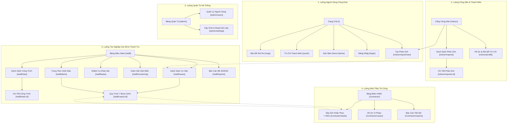

# Screen Flow & Navigation Architecture — DustGuard VN

Sơ đồ luồng chuyển màn hình trực quan theo từng vai trò nghiệp vụ:

```mermaid
flowchart TD
    subgraph PublicFlow["1. Luồng Người Dùng Công Khai"]
        P1["Trang Chủ [/]"] --> P2["Bản Đồ Rủi Ro [/map]"]
        P1 --> P3["Tín Chỉ Thanh Niên [/youth]"]
        P1 --> P4["Kịch Bản Demo [/demo]"]
        P1 --> P5["Đăng Nhập [/login]"]
        P1 --> C2["Tạo Phản Ánh Mới [/citizen/report/new]"]
    end

    subgraph CitizenFlow["2. Luồng Công Dân & Thanh Niên"]
        C1["Cổng Công Dân [/citizen]"] --> C2["Tạo Phản Ánh [/citizen/report/new]"]
        C1 --> C3["Danh Sách Phản Ánh [/citizen/reports]"]
        C3 --> C4["Chi Tiết Phản Ánh [/citizen/reports/:id]"]
        C1 --> C5["Hồ Sơ & Mã QR Tín Chỉ [/citizen/profile]"]
    end

    subgraph StaffFlow["3. Luồng Tác Nghiệp Cán Bộ & Thanh Tra"]
        S1["Bảng Điều Hành [/staff]"] --> S2["Danh Sách Công Trình [/staff/sites]"]
        S2 --> S3["Chi Tiết Công Trình [/staff/sites/:id]"]
        S1 --> S4["Danh Sách Vụ Việc [/staff/cases]"]
        S4 --> S5["Quy Trình 7 Bước DAG [/staff/cases/:id]"]
        S1 --> S6["Nhiệm Vụ Khảo Sát [/staff/tasks]"]
        S1 --> S7["Giám Sát Cảm Biến [/staff/monitoring]"]
        S1 --> S8["Trung Tâm Cảnh Báo [/staff/alerts]"]
        S8 --> S5
        S1 --> S9["Báo Cáo NĐ 30/2020 [/staff/reports]"]
    end

    subgraph ContractorFlow["4. Luồng Nhà Thầu Thi Công"]
        K1["Bảng Điều Khiển [/contractor]"] --> K2["Nộp Ảnh Khắc Phục <=50m [/contractor/tasks]"]
        K1 --> K3["Hồ Sơ Vi Phạm [/contractor/cases]"]
        K1 --> K4["Báo Cáo Tiến Độ [/contractor/reports]"]
    end

    subgraph AdminFlow["5. Luồng Quản Trị Hệ Thống"]
        A1["Bảng Quản Trị [/admin]"] --> A2["Quản Lý Người Dùng [/admin/users]"]
        A1 --> A3["Cấu Hình & Reset Dữ Liệu [/admin/settings]"]
    end

    %% Cross Boundary Transitions
    C2 -.-> S4
    S5 -.-> K2
    K2 -.-> S5
```
