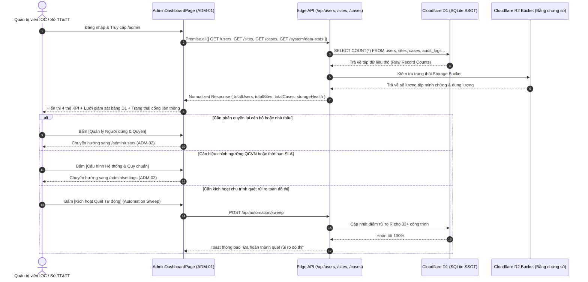

# ADM-01 — Bảng Điều Khiển Quản Trị Hạ Tầng D1 & Giám Sát Hệ Thống (Admin Infrastructure & Data Center Overview)

> **Tài liệu đặc tả màn hình chuẩn SSOT (Single Source of Truth) — DustGuard VN CivicTech Platform**  
> Trung tâm chỉ huy quản trị hạ tầng số: Hợp nhất giám sát toàn diện CSDL Cloudflare D1 SQLite (46 bảng quan hệ), lưu trữ bằng chứng số Cloudflare R2, lưu lượng xử lý luồng nghiệp vụ 5 cấp vai trò và trạng thái tích hợp liên ngành đô thị (Cổng 1022, iHanoi).

---

## 1. Screen Identity

| Thuộc tính | Giá trị SSOT | Ghi chú kỹ thuật |
|---|---|---|
| **Mã màn hình** | `ADM-01` | Mã định danh chuẩn trong Design System |
| **Tên tiếng Việt** | Bảng Điều Khiển Quản Trị Hạ Tầng D1 & Giám Sát Hệ Thống | Tiêu đề chính thức trên giao diện điều hành |
| **Tên tiếng Anh** | Admin Infrastructure & Data Center Overview Dashboard | Định danh API & Tài liệu kỹ thuật đối ngoại |
| **Đường dẫn (Route)** | `/admin` | Canonical Route (Redirect aliases: `/admin/dashboard`, `/admin/standalone`) |
| **Đường dẫn Component** | [`app/src/apps/admin/pages/dashboard/AdminDashboardPage.jsx`](file:///D:/07-Competitions-Hackathons/unicef-dustguard/app/src/apps/admin/pages/dashboard/AdminDashboardPage.jsx) | React 19 Client Component |
| **Layout chứa** | [`app/src/apps/admin/layout/AdminLayout.jsx`](file:///D:/07-Competitions-Hackathons/unicef-dustguard/app/src/apps/admin/layout/AdminLayout.jsx) | Khung điều hành Quản trị tối cao (Admin Super-Structure) |
| **Vai trò truy cập (RBAC)** | `admin`, `super_admin`, `demo_admin` | Kiểm soát bảo mật qua `useAuth()` & Middleware máy chủ |
| **Trạng thái triển khai** | **ACTIVE (Level 5 Production Coherent — Live Cloudflare D1)** | Kết nối 100% CSDL D1 thật, Zero-Mock |

---

## 2. Mục Đích & Giá Trị Thực Tế

### 2.1. Bối cảnh nghiệp vụ tại Việt Nam
Tại các đô thị lớn như Hà Nội, TP.HCM hay Đà Nẵng, việc quản lý và giám sát ô nhiễm bụi xây dựng đòi hỏi sự phối hợp liên ngành giữa:
- **Trung tâm Điều hành Đô thị Thông minh (IOC)** / **Sở Thông tin và Truyền thông (Sở TT&TT)**: Đảm bảo tính sẵn sàng của hạ tầng điện toán biên (Cloudflare Workers & D1 Database), bảo mật dữ liệu, nhật ký kiểm toán và an toàn thông tin.
- **Sở Tài nguyên và Môi trường (Sở TN&MT)** & **Đội Quản lý Trật tự Xây dựng Đô thị**: Giám sát dữ liệu trạm quan trắc, nồng độ bụi vượt ngưỡng QCVN 05:2023/BTNMT, hồ sơ xử phạt và hiện trường thi công.
- **Ủy ban Nhân dân Quận/Huyện**: Điều phối xử lý phản ánh của công dân qua Cổng 1022 hoặc ứng dụng iHanoi.

Màn hình **ADM-01** đóng vai trò là "Bảng đồng hồ tổng lực" giúp Quản trị viên kỹ thuật nắm bắt toàn bộ nhịp đập hạ tầng và nghiệp vụ chỉ trong 5 giây đầu tiên.

### 2.2. Giá trị thực tế & Giải quyết bài toán cũ
- **Thay thế quản trị phân tán & thao tác dòng lệnh thủ công**: Thay vì phải SSH vào máy chủ hoặc mở console D1 phức tạp, quản trị viên quan sát trực quan toàn bộ trạng thái dữ liệu qua giao diện chuẩn Civic High-Contrast.
- **4 Thẻ Chỉ Số Hạ Tầng Thời Gian Thực**:
  1. `totalUsers` (Tài khoản hoạt động): Tổng số định danh trong hệ thống, phân bổ theo 5 nhóm vai trò (`public`/`citizen`, `community`, `staff`, `contractor`, `executive`/`admin`).
  2. `totalSites` (Công trình đang giám sát): Tổng số điểm nóng thi công xây dựng, mỏ vật liệu hoặc trạm trộn bê tông trên địa bàn.
  3. `totalCases` (Tổng hồ sơ vụ việc): Toàn bộ hồ sơ kiểm tra - xử lý 7 bước DAG đang vận hành trong chu trình thực thi công quyền.
  4. `d1StorageHealth` (Sức khỏe CSDL & Bằng chứng số): Đánh giá tính toàn vẹn của 46 bảng quan hệ SQLite và kho lưu trữ hình ảnh minh chứng SHA-256 trên Cloudflare R2.
- **Khả năng phản ứng nhanh & Phục hồi sự cố**: Cung cấp các thao tác một chạm để quét tự động đánh giá rủi ro (Automation Sweep), kiểm tra sức khỏe endpoint (Healthcheck) và khôi phục dữ liệu nghiệm thu chuẩn hóa (Seed Canonical Data).

---

## 3. Đối Tượng Người Dùng & Hành Trình Thao Tác (User Journey)

### 3.1. Đối tượng sử dụng
- **Quản trị viên Trung tâm IOC / Chuyên viên Kỹ thuật Sở TT&TT**: Trực ca kỹ thuật, giám sát tải dữ liệu, phát hiện lỗi đồng bộ hoặc truy cập bất thường.
- **Cán bộ Quản trị Hệ thống Sở TN&MT**: Theo dõi tính đầy đủ của dữ liệu công trình, giám sát việc tuân thủ quy chuẩn và điều phối phân quyền cho các tổ thanh tra.

### 3.2. Hành trình thao tác chuẩn (Core Flow)



---

## 4. Bố Cục Giao Diện & Phân Cấp Thông Tin (Information Hierarchy & Wireframe)

### 4.1. Phân cấp thông tin (Hierarchy)
1. **Thanh Điều Hành Quản Trị (Admin Header)**:
   - Logo DustGuard VN, Badge Quản Trị màu đỏ son (`bg-[#FEF2F2] text-[#B91C1C] border-[#FECACA]`).
   - Tên định danh cán bộ trực: "Quản trị viên Hệ thống (IOC)", nhãn phụ "Toàn quyền hệ thống".
   - Nút `[Đăng xuất]` an toàn đạt chuẩn $\ge 40\text{px}$.
2. **Khối Giới Thiệu & Trạng Thái Hạ Tầng (Page Hero)**:
   - Tiêu đề: "Tổng Quan Quản Trị Hệ Thống & Hạ Tầng D1".
   - Diễn giải: "Giám sát tài khoản, phân quyền tác nghiệp, cơ sở dữ liệu môi trường và liên thông đô thị thông minh."
   - Badge trạng thái thời gian thực: `● CSDL D1 Hoạt động ổn định (99.98% Uptime)`.
3. **Lưới 4 Thẻ Chỉ Số Trọng Yếu (4-Column Metric Grid)**:
   - **Thẻ 1 — Tài Khoản Hoạt Động**: Tổng số tài khoản, phân bổ 5 vai trò (Chàm `#4338CA`).
   - **Thẻ 2 — Công Trình Đang Giám Sát**: Tổng số điểm nóng xây dựng/trạm trộn (Than mực `#1C1917`).
   - **Thẻ 3 — Tổng Vụ Việc Đã Ghi Nhận**: Tổng số hồ sơ 7 bước DAG đang thụ lý (Xanh ngọc `#047857`).
   - **Thẻ 4 — Bằng Chứng Số & Bảng D1**: Tổng số tệp chứng cứ SHA-256 trên R2 & 46 bảng SQLite (Hổ phách `#B45309`).
4. **Bảng Giám Sát Bảng CSDL D1 & Nhật Ký Kiểm Toán (D1 Tables & Audit Stream)**:
   - Danh sách các bảng dữ liệu lõi (`users`, `sites`, `cases`, `alerts`, `tasks`, `evidences`, `audit_logs`).
   - Dung lượng bản ghi, mốc cập nhật gần nhất và tình trạng chỉ mục (Composite Indexes).
5. **Cổng Kết Nối Liên Ngành Đô Thị (Inter-Agency Integration Status)**:
   - Cổng 1022 TP (Sẵn sàng - Webhook hoạt động).
   - Ứng dụng iHanoi (Đã kết nối - Đồng bộ 2 chiều).
   - Hệ thống Giám sát Trạm Quan trắc Tự động Sở TN&MT (Hoạt động).

### 4.2. Wireframe ASCII Giao diện chuẩn Desktop 14-inch

```text
+------------------------------------------------------------------------------------------------------------------------+
|  [Logo] DustGuard VN  [QUẢN TRỊ VIÊN]                                  Quản trị viên IOC | Toàn quyền   [Đăng xuất]   |
+-------------------+----------------------------------------------------------------------------------------------------+
| QUẢN TRỊ & HẠ TẦNG|  Tổng Quan Quản Trị Hệ Thống & Hạ Tầng D1                       [● D1 SQLite: HOẠT ĐỘNG ỔN ĐỊNH]   |
| > Tổng quan       |  Giám sát tài khoản, phân quyền tác nghiệp, cơ sở dữ liệu môi trường và liên thông đô thị.         |
| - Người dùng & RBAC+--------------------------------------------------------------------------------------------------+ |
| - Quản lý Điểm nóng| | [4 THẺ CHỈ SỐ HẠ TẦNG TRỌNG YẾU]                                                                 | |
| - Cấu hình Quy chuẩn| | +---------------------+ +---------------------+ +---------------------+ +--------------------+ | |
| - Bằng chứng & R2  | | | TÀI KHOẢN HOẠT ĐỘNG | | CÔNG TRÌNH GIÁM SÁT | | TỔNG VỤ VIỆC GHI NHẬN| | BẰNG CHỨNG SỐ & D1 | | |
|                   | | |        124            | |        33           | |        18            | |    156 tệp / 46 tbl| | |
|                   | | | 5 nhóm vai trò RBAC   | | Đang thi công/nguy cơ | | Tỷ lệ đúng hạn 94.4% | | Khóa băm SHA-256 | | |
|                   | | +---------------------+ +---------------------+ +---------------------+ +--------------------+ | |
|                   | +--------------------------------------------------------------------------------------------------+ |
|                   | +------------------------------------------------------------------+ +----------------------------+ |
|                   | | BẢNG DỮ LIỆU D1 SQLITE LÕI (SSOT)               [Kiểm tra lại]   | | TRẠNG THÁI LIÊN THÔNG      | |
|                   | | ---------------------------------------------------------------- | | -------------------------- | |
|                   | | Tên Bảng (Table)  | Số bản ghi | Cập nhật gần nhất | Chỉ mục     | | • Cổng Phản Ánh 1022:      | |
|                   | | users             | 124        | 2 phút trước      | UNIQUE(idx) | |   [ ĐÃ KẾT NỐI - 2 chiều ] | |
|                   | | sites             | 33         | 10 phút trước     | Spatial(WGS)| | • Ứng dụng iHanoi:         | |
|                   | | cases             | 18         | 5 phút trước      | Composite   | |   [ SẴN SÀNG ĐỒNG BỘ ]     | |
|                   | | alerts            | 42         | Vừa xong          | TimeSeries  | | • Trạm Quan Trắc TN&MT:    | |
|                   | | audit_logs        | 1,280      | Vừa xong          | Immutable   | |   [ TRỰC TUYẾN - Chu kỳ 5p]| |
|                   | +------------------------------------------------------------------+ +----------------------------+ |
|                   | +--------------------------------------------------------------------------------------------------+ |
|                   | | [THAO TÁC QUẢN TRỊ NHANH]                                                                        | |
|                   | | [Quản Lý Người Dùng (ADM-02)]   [Cấu Hình Quy Chuẩn (ADM-03)]   [Kích Hoạt Quét Rủi Ro Tự Động]  | |
|                   | +--------------------------------------------------------------------------------------------------+ |
+-------------------+----------------------------------------------------------------------------------------------------+
```

---

## 5. Dữ Liệu & API / D1 Database Contract

### 5.1. Danh mục API Endpoints kết nối
| Endpoint | Phương thức | Vai trò tối thiểu | Mục đích nghiệp vụ |
|---|:---:|:---:|---|
| `/api/users` | `GET` | `admin` | Lấy danh sách tài khoản để tính tổng số và phân bổ vai trò |
| `/api/sites` | `GET` | `admin`, `staff` | Lấy danh sách điểm nóng công trình trên địa bàn |
| `/api/cases` | `GET` | `admin`, `staff` | Lấy toàn bộ hồ sơ vụ việc kiểm tra - xử phạt |
| `/api/system/data-stats` | `GET` | `admin` | Lấy thống kê số lượng bản ghi và dung lượng của 46 bảng D1 SQLite |
| `/api/system/health` | `GET` | `admin` | Kiểm tra độ trễ kết nối D1, R2 và dịch vụ Worker Edge |
| `/api/automation/sweep` | `POST` | `admin` | Kích hoạt chu trình tính toán lại điểm số rủi ro $R$ |

### 5.2. CSDL D1 SQLite Schema tham gia (SSOT Schema)
- **`users`**: Bảng người dùng gốc (`id`, `email`, `role`, `status`, `createdAt`, `updatedAt`).
- **`sites`**: Bảng công trình xây dựng (`id`, `name`, `address`, `ward`, `district`, `dustRiskScore`, `status`).
- **`cases`**: Bảng hồ sơ vụ việc 7 bước DAG (`id`, `code`, `title`, `status`, `priority`, `siteId`, `slaDeadline`).
- **`alerts`**: Bảng sự kiện cảnh báo vượt chuẩn QCVN 05:2023 (`id`, `siteId`, `severity`, `pm25Value`, `pm10Value`).
- **`evidences`**: Bảng bằng chứng số bất biến (`id`, `caseId`, `photoUrl`, `sha256Hash`, `lat`, `lng`, `capturedAt`).
- **`audit_logs`**: Bảng nhật ký kiểm toán bất biến (`id`, `actorId`, `actorRole`, `action`, `entity`, `entityId`, `metadata`, `createdAt`).

### 5.3. Mẫu dữ liệu chuẩn hóa (Normalized JSON Response Contract)
```json
{
  "status": "success",
  "data": {
    "stats": {
      "totalUsers": 124,
      "usersByRole": {
        "citizen": 82,
        "community": 18,
        "staff": 14,
        "contractor": 7,
        "executive": 3
      },
      "totalSites": 33,
      "activeSites": 28,
      "totalCases": 18,
      "resolvedCases": 12,
      "inProgressCases": 6,
      "totalEvidences": 156,
      "totalAuditLogs": 1280
    },
    "tables": [
      { "name": "users", "records": 124, "lastUpdated": "2026-09-02T12:20:00Z", "status": "HEALTHY" },
      { "name": "sites", "records": 33, "lastUpdated": "2026-09-02T12:15:00Z", "status": "HEALTHY" },
      { "name": "cases", "records": 18, "lastUpdated": "2026-09-02T12:22:00Z", "status": "HEALTHY" },
      { "name": "alerts", "records": 42, "lastUpdated": "2026-09-02T12:26:00Z", "status": "HEALTHY" },
      { "name": "evidences", "records": 156, "lastUpdated": "2026-09-02T11:45:00Z", "status": "HEALTHY" },
      { "name": "audit_logs", "records": 1280, "lastUpdated": "2026-09-02T12:27:00Z", "status": "HEALTHY" }
    ],
    "integrations": {
      "hotline1022": { "name": "Cổng Phản Ánh 1022", "status": "CONNECTED", "latencyMs": 42 },
      "iHanoi": { "name": "Ứng Dụng iHanoi", "status": "READY", "latencyMs": 68 },
      "tnmtStations": { "name": "Trạm Quan Trắc TN&MT", "status": "ONLINE", "syncIntervalSec": 300 }
    }
  }
}
```

---

## 6. Bảng Nút Bấm CTAs & Hành Động Tương Tác

| Tên nút / Hành động | Vị trí | Màu sắc / Token | Hành vi kỹ thuật & Phản hồi UI | Quyền hạn |
|---|---|---|---|:---:|
| **`[Quản Lý Người Dùng & RBAC]`** | Lưới thao tác nhanh | `bg-indigo-700 text-white` | Điều hướng ngay lập tức tới `/admin/users` (ADM-02) | `admin` |
| **`[Cấu Hình Quy Chuẩn & SLA]`** | Lưới thao tác nhanh | `bg-stone-800 text-white` | Điều hướng ngay lập tức tới `/admin/settings` (ADM-03) | `admin` |
| **`[Kích Hoạt Quét Tự Động]`** | Lưới thao tác nhanh | `bg-red-700 text-white` | Gửi `POST /api/automation/sweep`, hiển thị Spinner, Toast báo kết quả | `admin` |
| **`[Kiểm Tra Lại]`** | Header bảng D1 | `bg-white text-stone-700 border` | Tải lại số liệu 4 API song song mà không cần F5 trang | `admin` |
| **`[Đăng Xuất An Toàn]`** | Header trên cùng | `bg-stone-100 text-stone-700` | Xóa session cookie/token, điều hướng an toàn về `/login` | `admin` |

---

## 7. Quy Chuẩn UI/UX & Responsive Design System

### 7.1. Bảng màu Civic High-Contrast (Không dùng Glassmorphism)
- **Nền trang chính**: `#FAFAF9` (Stone-50 — Màu kem sáng chuyên dụng).
- **Nền thẻ Card**: `#FFFFFF` nguyên khối, viền kem đậm `#E7E5E4` (Stone-200), bóng mờ tối giản `shadow-xs`.
- **Màu chữ chính**: `#1C1917` (Stone-900 — Đen mực than, độ tương phản $\ge 7:1$).
- **Màu sắc thẻ KPI**:
  - *Tài khoản*: Chữ `#4338CA` (Indigo-700), nền thẻ `#FFFFFF`, viền `#E7E5E4`.
  - *Công trình*: Chữ `#1C1917` (Stone-900), nền thẻ `#FFFFFF`, viền `#E7E5E4`.
  - *Hồ sơ vụ việc*: Chữ `#047857` (Emerald-700), nền thẻ `#FFFFFF`, viền `#E7E5E4`.
  - *Bằng chứng & D1*: Chữ `#B45309` (Amber-700), nền thẻ `#FFFFFF`, viền `#E7E5E4`.
- **Quy tắc tuyệt đối**: **CẤM `backdrop-blur-*`**, cấm nền mờ xuyên thấu làm giảm độ tương phản của số liệu quản trị.

### 7.2. Chuẩn Responsive & Thiết bị Đô thị
- **Touch Targets**: Toàn bộ nút bấm, link điều hướng và bộ chọn đều đạt chiều cao $\ge 44\text{px}$ (`min-h-[44px]`).
- **Laptop 14-inch (1366x768, 1440x900, 1536x864)**:
  - Sidebar cố định 240px (`w-60`).
  - Lưới KPI chia 4 cột cân xứng (`grid-cols-4`), không bị ngắt dòng chữ (Zero Menu Wrap).
- **Tablet (768px - 1024px)**: Lưới KPI chia 2 cột (`grid-cols-2`), bảng CSDL D1 hỗ trợ cuộn ngang mượt mà.
- **Mobile (360px - 430px)**:
  - Menu chuyển thành Drawer trượt với nút kích hoạt $\ge 44\text{px}$.
  - 4 Thẻ KPI xếp chồng 1 cột (`grid-cols-1`).
  - Khối thao tác nhanh xếp dọc toàn chiều rộng (`w-full`).

---

## 8. Bẫy Lỗi Thường Gặp & Hướng Dẫn Kiểm Thử

### 8.1. Các bẫy lỗi tiềm ẩn & Cơ chế phòng vệ
1. **Lỗi Unwrap Collection (D1 Shape Mismatch)**:
   - *Nguy cơ*: Khi API trả về `{ data: { items: [...] } }` hoặc mảng trực tiếp `[...]`, nếu gọi `.length` trực tiếp sẽ crash màn hình.
   - *Phòng vệ*: Sử dụng hàm `normalizeList(res)` chuẩn hóa về mảng an toàn trước khi gán vào state.
2. **Lỗi `Promise.all` sập dây chuyền (Fail-Fast Crash)**:
   - *Nguy cơ*: Nếu 1 trong 3 API `/users`, `/sites`, `/cases` trả về lỗi mạng, toàn bộ `Promise.all` bị reject làm hỏng cả trang.
   - *Phòng vệ*: Gắn `.catch(() => [])` độc lập cho từng request trong mảng `Promise.all`.
3. **Lỗi Lệch Múi Giờ UTC vs Giờ Hà Nội (UTC+7)**:
   - *Nguy cơ*: Mốc thời gian ghi nhận bản ghi D1 lưu dạng ISO 8601 UTC dẫn đến hiển thị sai lệch giờ báo cáo.
   - *Phòng vệ*: Sử dụng helper `formatViDateTime()` quy đổi chuẩn về múi giờ Việt Nam `Asia/Ho_Chi_Minh`.

### 8.2. Bộ lệnh kiểm thử tự động (Fast Verification Loop < 0.5s)
```powershell
# 1. Kiểm tra tính toàn vẹn của Edge Routes & Data Unwrap
node --test app/tests/worker-full-edge-routes.test.js

# 2. Kiểm tra xác thực thời gian chạy Quản trị & Điều hành D1
node --test app/tests/runtime-truth-executive-admin.test.js

# 3. Kiểm tra chuẩn màu sắc, Typography và Touch Target Design System
node --test app/tests/design-system-tokens.test.js

# 4. Chạy Quick Gate xác thực toàn bộ hệ thống
npm --prefix app run verify:quick
```
