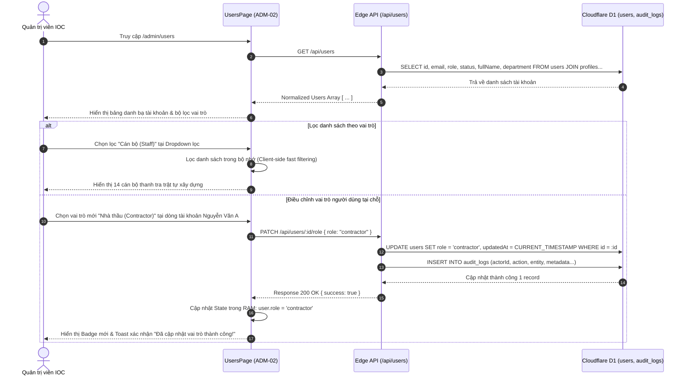

# ADM-02 — Quản Trị Danh Bạ Người Dùng & Ma Trận Phân Quyền RBAC 5 Cấp (User Directory & 5-Tier RBAC)

> **Tài liệu đặc tả màn hình chuẩn SSOT (Single Source of Truth) — DustGuard VN CivicTech Platform**  
> Trung tâm điều phối danh tính số và phân quyền tác nghiệp: Quản lý tập trung toàn bộ người dùng công vụ và cộng đồng, phân định rành mạch 5 cấp vai trò RBAC (`citizen`, `community`, `staff`, `contractor`, `executive`/`admin`), hỗ trợ đổi quyền tại chỗ tức thì (In-Place Role Switching) và lưu vết kiểm toán bất biến trên Cloudflare D1.

---

## 1. Screen Identity

| Thuộc tính | Giá trị SSOT | Ghi chú kỹ thuật |
|---|---|---|
| **Mã màn hình** | `ADM-02` | Mã định danh chuẩn trong Design System |
| **Tên tiếng Việt** | Quản Trị Danh Bạ Người Dùng & Phân Quyền RBAC 5 Cấp | Tiêu đề chính thức trên giao diện quản trị |
| **Tên tiếng Anh** | User Directory & 5-Tier Role-Based Access Control Management | Định danh API & Tài liệu kỹ thuật đối ngoại |
| **Đường dẫn (Route)** | `/admin/users` | Canonical Route |
| **Đường dẫn Component** | [`app/src/apps/admin/pages/users/UsersPage.jsx`](file:///D:/07-Competitions-Hackathons/unicef-dustguard/app/src/apps/admin/pages/users/UsersPage.jsx) | React 19 Client Component |
| **Layout chứa** | [`app/src/apps/admin/layout/AdminLayout.jsx`](file:///D:/07-Competitions-Hackathons/unicef-dustguard/app/src/apps/admin/layout/AdminLayout.jsx) | Khung điều hành Quản trị tối cao |
| **Vai trò truy cập (RBAC)** | `admin`, `super_admin` | Kiểm soát nghiêm ngặt qua Middleware `requireRoles('admin')` |
| **Trạng thái triển khai** | **ACTIVE (Level 5 Production Coherent — Real-time RBAC Patching)** | Kết nối CSDL D1 thật, thay đổi quyền tức thì trong RAM & DB |

---

## 2. Mục Đích & Giá Trị Thực Tế

### 2.1. Bối cảnh phân quyền CivicTech tại đô thị Việt Nam
Hệ sinh thái DustGuard VN vận hành dựa trên sự phối hợp chặt chẽ giữa 5 lực lượng chính trong quản lý môi trường đô thị:
1. **`public` / `citizen` (Công dân đô thị)**:
   - Nộp phản ánh hiện trường phát tán bụi nhanh trong 30 giây kèm hình ảnh và định vị GPS.
   - Tra cứu bản đồ nồng độ bụi AQI công cộng, theo dõi tiến độ xử lý vụ việc của cơ quan chức năng.
2. **`community` / `youth_member` (Đoàn Thanh niên & CLB Tình nguyện)**:
   - Các cơ sở Đoàn Thanh niên Cộng sản Hồ Chí Minh, Đội tình nguyện viên, Câu lạc bộ sinh viên môi trường các trường đại học.
   - Tiến hành khảo sát độc lập, đo đạc dữ liệu vi khí hậu và tích lũy giờ tình nguyện đổi tín chỉ môi trường thanh niên (20 giờ = 4.0 tín chỉ, cấp chứng nhận mã QR ISO/IEC 18004).
3. **`staff` / `inspector` (Cán bộ Thanh tra & Quản lý trật tự đô thị)**:
   - Cán bộ Đội Quản lý Trật tự Xây dựng và Đô thị cấp Quận/Huyện, Thanh tra Chi cục Bảo vệ Môi trường (Sở TN&MT).
   - Thụ lý hồ sơ vụ việc theo chu trình 7 bước DAG (Tiếp nhận -> Khảo sát -> Đề xuất -> Phê duyệt -> Khắc phục -> Nghiệm thu -> Đóng hồ sơ), lập biên bản vi phạm và giám sát điểm nóng thi công.
4. **`contractor` (Nhà thầu & Ban Chỉ huy công trường)**:
   - Chỉ huy trưởng, Cán bộ an toàn môi trường của nhà thầu thi công xây dựng.
   - Nhận thông báo yêu cầu khắc phục ô nhiễm, tải lên minh chứng đối chiếu Trước/Sau (Before/After) trong phạm vi Geofence $\le 50\text{m}$ được bảo chứng bằng mã băm SHA-256.
5. **`executive` & `admin` (Lãnh đạo Điều hành & Quản trị Hệ thống)**:
   - `executive`: Chủ tịch/Phó Chủ tịch UBND Quận/Huyện, Lãnh đạo Sở TN&MT. Ký số và ban hành văn bản chỉ đạo điều hành, phê duyệt quyết định xử phạt hành chính theo Nghị định 30/2020/NĐ-CP.
   - `admin`: Quản trị viên Trung tâm IOC / Sở TT&TT. Toàn quyền quản trị hạ tầng CSDL D1, phân quyền tài khoản, kiểm soát an toàn thông tin và cấu hình tham số.

### 2.2. Giá trị thực tế & Giải quyết bài toán cũ
- **Thay đổi vai trò tại chỗ (In-Place Role Switching)**: Quản trị viên có thể nâng/hạ quyền người dùng ngay trên từng dòng danh sách thông qua Dropdown trực quan; hệ thống tự động đồng bộ xuống D1 và cập nhật lại JWT claims mà không cần can thiệp thủ công vào cơ sở dữ liệu.
- **Phòng chống leo thang đặc quyền 100% (Privilege Escalation Protection)**: Toàn bộ API cập nhật vai trò đều được bảo vệ bằng middleware kiểm tra quyền Admin; ngăn chặn tuyệt đối trường hợp tài khoản thường gửi request can thiệp trái phép.
- **Minh bạch hóa với Nhật ký Kiểm toán bất biến (Audit Trail)**: Mọi hành động gán quyền, đổi vai trò hoặc vô hiệu hóa tài khoản đều được ghi nhận vào bảng `audit_logs` trên D1 SQLite phục vụ công tác thanh tra công vụ.

---

## 3. Đối Tượng Người Dùng & Hành Trình Thao Tác (User Journey)

### 3.1. Đối tượng sử dụng
- **Quản trị viên Trung tâm Điều hành IOC / Sở TT&TT**: Tiếp nhận danh sách cán bộ điều động mới từ các đơn vị, cấp phát quyền truy cập và kiểm soát danh bạ người dùng toàn hệ thống.
- **Cán bộ Phụ trách Tổ chức & Phân quyền Sở TN&MT**: Cập nhật vai trò cho các cán bộ thanh tra mới hoặc chỉ định tài khoản cho các nhà thầu thi công trúng thầu dự án.

### 3.2. Hành trình thao tác chuẩn (Core Flow)



---

## 4. Bố Cục Giao Diện & Phân Cấp Thông Tin (Information Hierarchy & Wireframe)

### 4.1. Phân cấp thông tin (Hierarchy)
1. **Thanh Tiêu Đề & Bộ Lọc Tác Nghiệp (Control Header)**:
   - Tiêu đề màn hình: "Quản Lý Tài Khoản & Phân Quyền".
   - Diễn giải nghiệp vụ: "Thiết lập vai trò tác nghiệp chuẩn: Công dân, Cán bộ thanh tra, Nhà thầu và Quản trị viên."
   - Dropdown lọc vai trò (`filterRole`): Lọc theo `ALL` (Mọi vai trò kèm tổng số), `citizen`, `community`, `staff`, `contractor`, `admin`.
2. **Bảng Danh Bạ Người Dùng Toàn Đô Thị (User Management Table)**:
   - **Họ và Tên**: Tên đầy đủ của người dùng, hiển thị font đậm, không dùng kỹ thuật cắt ngắn văn bản (Zero Truncate).
   - **Email**: Địa chỉ email định danh, hiển thị font `font-mono text-[11px]` tương phản cao.
   - **Vai Trò Hiện Tại**: Badge nhãn màu sắc thể hiện rõ vai trò (`bg-cream-100 border-cream-300`).
   - **Đơn Vị / Cơ Quan**: Đơn vị công tác (Chi cục BVMT, Đội TTXD Quận, Đoàn Thanh niên, Công ty Xây dựng...).
   - **Điều Chỉnh Vai Trò**: Dropdown chọn vai trò tương tác trực tiếp (`<select>`), cho phép đổi quyền ngay tại chỗ.

### 4.2. Wireframe ASCII Giao diện chuẩn

```text
+------------------------------------------------------------------------------------------------------------------------+
|  Quản Lý Tài Khoản & Phân Quyền                                          [ Lọc theo vai trò: Mọi vai trò (124)      v ]|
|  Thiết lập vai trò tác nghiệp chuẩn: Công dân, Cán bộ thanh tra, Nhà thầu và Quản trị viên.                           |
+------------------------------------------------------------------------------------------------------------------------+
| HỌ VÀ TÊN              EMAIL                       VAI TRÒ HIỆN TẠI    ĐƠN VỊ CÔNG TÁC             ĐIỀU CHỈNH VAI TRÒ  |
+------------------------------------------------------------------------------------------------------------------------+
| Nguyễn Văn Thanh       inspector.thanh@hn.gov.vn   [ staff ]           Đội TTXD Quận Thanh Xuân    [ Cán bộ (Staff)  v]|
| Trần Thị Mai Lan       lan.tran@hust.edu.vn        [ community ]       CLB Tình Nguyện Xanh HUST   [ Đoàn TN/CLB     v]|
| Lê Hoàng Nam           nam.le@vietcon.vn           [ contractor ]      Công ty CP Xây dựng VietCon [ Nhà thầu        v]|
| Hoàng Trọng Đạt        dat.hoang@gmail.com         [ citizen ]         Cộng đồng Cư dân Rivera     [ Công dân        v]|
| Phạm Minh Đức          admin.ioc@hanoi.gov.vn      [ admin ]           Trung tâm Điều hành IOC     [ Quản trị        v]|
| Bùi Quang Hải          lanhdao.ubnd@tx.hn.gov.vn   [ executive ]       UBND Quận Thanh Xuân        [ Lãnh đạo        v]|
+------------------------------------------------------------------------------------------------------------------------+
| Hiển thị 6 / 124 tài khoản người dùng                                              Trang 1/21  [Trước]  [1] [2]  [Sau]  |
+------------------------------------------------------------------------------------------------------------------------+
```

---

## 5. Dữ Liệu & API / D1 Database Contract

### 5.1. Danh mục API Endpoints kết nối
| Endpoint | Phương thức | Vai trò | Mục đích nghiệp vụ |
|---|:---:|:---:|---|
| `/api/users` | `GET` | `admin`, `staff` | Lấy toàn bộ danh sách tài khoản người dùng kèm thông tin profile |
| `/api/users/:id/role` | `PATCH` / `PUT` | `admin` | Cập nhật vai trò RBAC mới cho tài khoản chỉ định |
| `/api/users/:id/status` | `PUT` | `admin` | Khóa hoặc kích hoạt tài khoản (`ACTIVE`, `DISABLED`, `INACTIVE`) |
| `/api/users` | `POST` | `admin` | Tạo mới tài khoản công vụ cho cán bộ/nhà thầu |

### 5.2. CSDL D1 SQLite Schema & Prisma Models
```prisma
model User {
  id          String       @id @default(cuid())
  email       String       @unique
  fullName    String?
  role        String       @default("citizen") // citizen, community, staff, contractor, executive, admin
  status      String       @default("ACTIVE")  // ACTIVE, INACTIVE, DISABLED
  createdAt   DateTime     @default(now())
  updatedAt   DateTime     @updatedAt
  profile     Profile?
  auditLogs   AuditLog[]
  credits     YouthCredit?
}

model Profile {
  id          String   @id @default(cuid())
  userId      String   @unique
  fullName    String
  phoneNumber String?
  avatarUrl   String?
  department  String?  // Ví dụ: "Đội TTXD Quận Thanh Xuân", "Chi cục BVMT Hà Nội"
  user        User     @relation(fields: [userId], references: [id], onDelete: Cascade)
}

model AuditLog {
  id          String   @id @default(cuid())
  actorId     String
  actorRole   String
  action      String   // ROLE_UPDATED, STATUS_CHANGED, USER_CREATED
  entity      String   // User
  entityId    String
  metadata    String?  // JSON string: { oldRole: "citizen", newRole: "staff" }
  createdAt   DateTime @default(now())
}
```

### 5.3. Zod Server-side Validation Schema (Edge Worker)
```javascript
import { z } from 'zod';

export const updateUserRoleSchema = z.object({
  role: z.enum([
    'citizen',
    'community',
    'staff',
    'contractor',
    'executive',
    'admin',
    'youth_member',
    'inspector',
    'super_admin',
    'demo_admin'
  ], {
    required_error: 'Vai trò (role) là thông tin bắt buộc',
    invalid_type_error: 'Vai trò cung cấp không nằm trong danh mục 5 cấp RBAC hợp lệ'
  })
});
```

---

## 6. Bảng Nút Bấm CTAs & Hành Động Tương Tác

| Thao tác / Tương tác | Vị trí kích hoạt | Hành vi kỹ thuật & Phản hồi hệ thống | Quyền hạn |
|---|---|---|:---:|
| **`[Lọc theo vai trò]`** | Dropdown trên Header | Lọc tức thì danh sách trong RAM theo giá trị vai trò đã chọn | `admin` |
| **`[Đổi vai trò tại chỗ]`** | Dropdown tại cột "Điều Chỉnh" | Gửi `PATCH /api/users/:id/role`, cập nhật state tức thì, hiển thị Toast | `admin` |
| **`[Tải lại danh sách]`** | Nút [Thử lại] tại ErrorState | Kích hoạt lại hàm `loadUsers()` để nạp lại dữ liệu từ D1 | `admin` |
| **`[Xem hồ sơ chi tiết]`** | Bấm vào dòng người dùng | Mở Drawer thông tin chi tiết (Lịch sử đăng nhập, số vụ việc đã thụ lý) | `admin` |

---

## 7. Quy Chuẩn UI/UX & Responsive Design System

### 7.1. Nguyên tắc Zero Truncate trên danh tính pháp lý
- **Độ toàn vẹn thông tin**: Trong quản lý công vụ, tên cán bộ, địa chỉ email và đơn vị công tác mang giá trị pháp lý ràng buộc. Hệ thống **tuyệt đối không dùng `truncate` hoặc `line-clamp`** làm che giấu ký tự email hay họ tên.
- **Font chữ Email & Ký tự đặc biệt**: Sử dụng font `font-mono text-[11px]` sắc nét, giúp quản trị viên phân biệt rõ các ký tự dễ nhầm lẫn như `l` (L thường), `1` (Số một), `O` (Chữ O hoa), `0` (Số không).

### 7.2. Chuẩn Responsive & Khả năng tiếp cận
- **Vùng bấm tối thiểu (Touch Targets)**: Toàn bộ Dropdown chọn vai trò và bộ lọc đều đạt chiều cao $\ge 44\text{px}$ (`min-h-[44px]`).
- **Responsive Table Container**: Bảng danh bạ bọc trong container cuộn ngang (`overflow-x-auto`), viền bo góc tròn mềm mại `rounded-2xl`, đảm bảo hiển thị hoàn hảo trên màn hình Mobile từ 360px đến Desktop 1920px.

---

## 8. Bẫy Lỗi Thường Gặp & Hướng Dẫn Kiểm Thử

### 8.1. Các bẫy lỗi tiềm ẩn & Cơ chế phòng vệ
1. **Lỗi `users.filter is not a function`**:
   - *Nguyên nhân*: Khi API backend trả về cấu trúc bọc `{ items: [...] }` hoặc lỗi mạng trả về null, biến `users` không phải là mảng dẫn đến crash trang.
   - *Phòng vệ*: Sử dụng helper `normalizeList(res)` và ép kiểu mảng an toàn:
     ```javascript
     const userList = Array.isArray(users) ? users : [];
     const filtered = userList.filter(u => filterRole === 'ALL' || (u.role || 'citizen').toLowerCase() === filterRole.toLowerCase());
     ```
2. **Lỗi Mất Đồng Bộ State khi cập nhật quyền (Optimistic UI Drift)**:
   - *Nguyên nhân*: Cập nhật biến state trực tiếp bị ghi đè khi có nhiều request đồng thời.
   - *Phòng vệ*: Sử dụng functional updater với kiểm tra mảng an toàn:
     ```javascript
     setUsers(prev => (Array.isArray(prev) ? prev : []).map(u => u.id === userId ? { ...u, role: newRole } : u));
     ```
3. **Lỗ hổng leo thang đặc quyền (Privilege Escalation Vulnerability)**:
   - *Phòng ngừa*: Máy chủ Worker Edge bắt buộc chạy middleware `requireRoles('admin')` cho tất cả các phương thức ghi (`POST`, `PUT`, `PATCH`, `DELETE`) trên bảng `users`.

### 8.2. Bộ lệnh kiểm thử tự động (< 0.5s)
```powershell
# 1. Kiểm thử trọn bộ RBAC và User Management Protection
node --test app/tests/auth-user-management-audit.test.js

# 2. Kiểm thử bảo vệ leo thang đặc quyền giữa Admin và Executive
node --test app/tests/admin-executive-rbac-penetration.test.js

# 3. Kiểm tra các route Worker Edge API
node --test app/tests/worker-full-edge-routes.test.js
```
