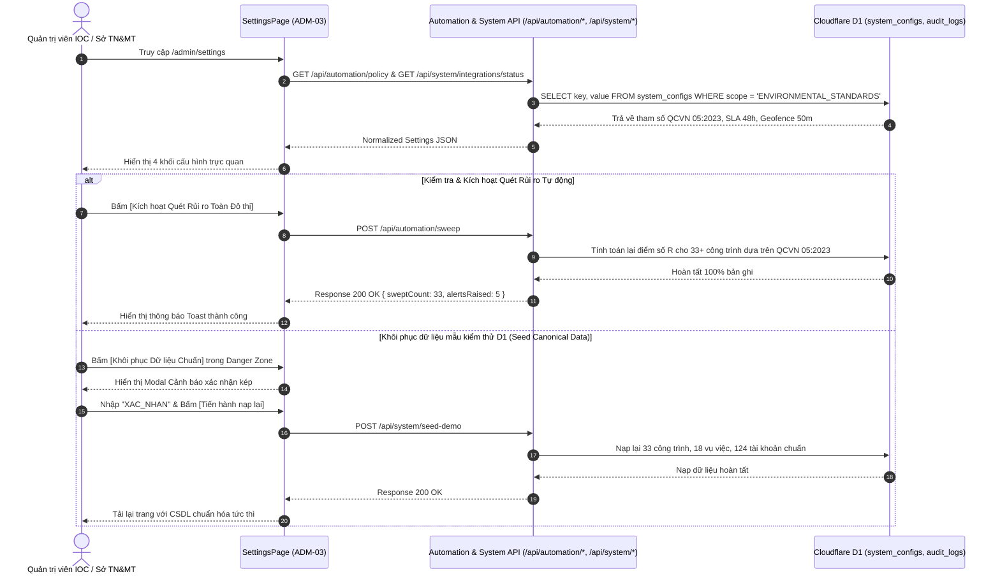

# ADM-03 — Cấu Hình Tham Số Quy Chuẩn QCVN 05:2023, SLA 48h & Tích Hợp Liên Ngành (System Standards & Inter-Agency Settings)

> **Tài liệu đặc tả màn hình chuẩn SSOT (Single Source of Truth) — DustGuard VN CivicTech Platform**  
> Trung tâm quản trị tham số kỹ thuật và liên thông đô thị: Thiết lập quy chuẩn chất lượng không khí quốc gia QCVN 05:2023/BTNMT, chính sách cam kết thời hạn giải quyết SLA 48h, bán kính không gian Geofence $\le 50\text{m}$, trạng thái tích hợp cổng dịch vụ đô thị (Cổng 1022, iHanoi) và động cơ tự động hóa trên Cloudflare D1.

---

## 1. Screen Identity

| Thuộc tính | Giá trị SSOT | Ghi chú kỹ thuật |
|---|---|---|
| **Mã màn hình** | `ADM-03` | Mã định danh chuẩn trong Design System |
| **Tên tiếng Việt** | Cấu Hình Quy Chuẩn Môi Trường, SLA Tác Nghiệp & Liên Thông Đô Thị | Tiêu đề chính thức trên giao diện quản trị |
| **Tên tiếng Anh** | System Standards, Operational SLA & Urban Integration Settings | Định danh API & Tài liệu kỹ thuật đối ngoại |
| **Đường dẫn (Route)** | `/admin/settings` | Canonical Route (Redirect aliases: `/admin/system`, `/admin/data-management`) |
| **Đường dẫn Component** | [`app/src/apps/admin/pages/settings/SettingsPage.jsx`](file:///D:/07-Competitions-Hackathons/unicef-dustguard/app/src/apps/admin/pages/settings/SettingsPage.jsx) | React 19 Client Component |
| **Layout chứa** | [`app/src/apps/admin/layout/AdminLayout.jsx`](file:///D:/07-Competitions-Hackathons/unicef-dustguard/app/src/apps/admin/layout/AdminLayout.jsx) | Khung điều hành Quản trị tối cao |
| **Vai trò truy cập (RBAC)** | `admin`, `super_admin` | Kiểm soát bảo mật qua `requireRoles('admin')` |
| **Trạng thái triển khai** | **ACTIVE (Level 5 Production Coherent — QCVN 05:2023 SSOT)** | Đồng bộ tham số SSOT toàn hệ thống |

---

## 2. Mục Đích & Giá Trị Thực Tế

### 2.1. Bối cảnh pháp lý & Quy chuẩn đô thị tại Việt Nam
Nền tảng DustGuard VN là cầu nối số hóa giữa công dân, nhà thầu thi công và cơ quan quản lý nhà nước. Để bảo đảm tính pháp lý cao nhất trong việc lập biên bản vi phạm và xử phạt hành chính, hệ thống bắt buộc phải áp dụng chuẩn xác bộ quy chuẩn quốc gia:
1. **Quy chuẩn Kỹ thuật Quốc gia về Chất lượng Không khí (QCVN 05:2023/BTNMT)**:
   - **Bụi mịn PM2.5 (Trung bình 24 giờ)**: Ngưỡng tối đa $50\,\mu\text{g/m}^3$. Khi cảm biến hoặc trạm đo ghi nhận vượt ngưỡng này liên tục, hệ thống tự động phát cảnh báo cấp độ Cam/Đỏ và nâng độ ưu tiên hồ sơ vụ việc lên `HIGH`/`CRITICAL`.
   - **Bụi tổng số PM10 (Trung bình 24 giờ)**: Ngưỡng tối đa $100\,\mu\text{g/m}^3$. Đây là chỉ số trọng yếu phản ánh hoạt động đào móng, vận chuyển đất đá, trạm trộn không che chắn kín.
   - **Ngưỡng tức thời 1 giờ PM2.5**: $100\,\mu\text{g/m}^3$ — Cảnh báo khẩn cấp phát tán bụi mù tức thời.
   - **Ngưỡng tức thời 1 giờ PM10**: $200\,\mu\text{g/m}^3$ — Cảnh báo khẩn cấp kích hoạt kiểm tra hiện trường ngay lập tức.
2. **Khung Chính Sách Cam Kết Thời Hạn Tác Nghiệp (SLA 48h Framework)**:
   - **Thời hạn Tiếp nhận & Khảo sát hiện trường (`intakeToSurveyHours`)**: Tối đa $24\text{h}$.
   - **Thời hạn Nhà thầu hoàn thành Khắc phục bụi (`surveyToRemediationHours`)**: Tối đa $48\text{h}$ (Rửa đường, phủ bạt, phun sương dập bụi).
   - **Thời hạn Gia hạn tối đa có văn bản giải trình (`remediationGracePeriodHours`)**: Tối đa $72\text{h}$.
   - **Bán kính Geofence hợp lệ khi nộp minh chứng (`geofenceMaxRadiusMeters`)**: Tối đa $50\text{m}$ so với tâm công trình, chống gian lận nộp ảnh từ xa.
3. **Cổng Kết Nối Liên Ngành & Dịch Vụ Đô Thị Thông Minh**:
   - **Cổng Tiếp nhận Ý kiến & Phản ánh 1022 (TP.HCM / Hà Nội / Đà Nẵng)**: Tiếp nhận phản ánh ô nhiễm từ người dân qua Webhook REST API và trả tiến độ xử lý 2 chiều.
   - **Ứng dụng Công dân Thủ đô số - iHanoi (UBND TP Hà Nội)**: Kênh tích hợp phản ánh hiện trường trật tự đô thị và bảo vệ môi trường.
   - **Hệ thống Giám sát Trạm Quan trắc Môi trường Tự động (Sở TN&MT)**: Đồng bộ dữ liệu định kỳ 5 phút/lần từ mạng lưới trạm đo công cộng.

### 2.2. Giá trị thực tế & Giải quyết bài toán cũ
- **Xóa bỏ tình trạng phân tán quy chuẩn (Zero Hardcoded Drift)**: Toàn bộ các phân hệ từ Cán bộ (`/staff`), Nhà thầu (`/contractor`) đến Lãnh đạo (`/executive`) đều truy xuất chung một nguồn tham số SSOT duy nhất.
- **Tự động hóa vận hành thông minh**: Cung cấp công cụ bật/tắt động cơ tự động hóa quét rủi ro (Automation Sweep Cron), tự động nâng cấp độ rủi ro công trình và dọn dẹp dữ liệu rác.

---

## 3. Đối Tượng Người Dùng & Hành Trình Thao Tác (User Journey)

### 3.1. Đối tượng sử dụng
- **Quản trị viên Trung tâm Điều hành IOC / Sở TT&TT**: Kiểm tra tính sẵn sàng của các cổng liên thông dữ liệu và quản trị chu trình vận hành tự động.
- **Chuyên gia Dữ liệu Môi trường Sở TN&MT**: Cập nhật các ngưỡng cảnh báo khi Bộ TN&MT ban hành thông tư quy chuẩn mới.

### 3.2. Hành trình thao tác chuẩn (Core Flow)



---

## 4. Bố Cục Giao Diện & Phân Cấp Thông Tin (Information Hierarchy & Wireframe)

### 4.1. Phân cấp thông tin (Hierarchy)
1. **Settings Header Hero**: Tiêu đề "Cấu Hình Quy Chuẩn & Vận Hành Hệ Thống", mô tả "Thiết lập các ngưỡng cảnh báo nồng độ bụi QCVN 05:2023/BTNMT, chính sách cam kết SLA 48h và liên thông đô thị."
2. **Khối 1: Quy Chuẩn Bụi Môi Trường Quốc Gia (QCVN 05:2023/BTNMT)**:
   - **Thẻ 1**: Ngưỡng PM2.5 (24 giờ) — `50 µg/m³` (Kích hoạt cảnh báo ô nhiễm màu cam/đỏ).
   - **Thẻ 2**: Ngưỡng PM10 (24 giờ) — `100 µg/m³` (Giới hạn tối đa cho phép bụi tổng số).
   - **Thẻ 3**: Ngưỡng PM2.5 (1 giờ) — `100 µg/m³` (Cảnh báo khẩn cấp phát tán tức thời).
   - **Thẻ 4**: Ngưỡng PM10 (1 giờ) — `200 µg/m³` (Nguy cơ đình chỉ thi công khẩn cấp).
3. **Khối 2: Ma Trận Cam Kết Thời Hạn Tác Nghiệp (SLA & Geofence Policy)**:
   - Thời hạn tiếp nhận & điều phối: `24 giờ`.
   - Thời hạn khắc phục vi phạm: `48 giờ`.
   - Gia hạn tối đa có giải trình: `72 giờ`.
   - Bán kính Geofence hợp lệ: `50 mét` (Bảo chứng GPS).
4. **Khối 3: Cổng Liên Thông & Tích Hợp Đô Thị Thông Minh (Urban Integrations)**:
   - Cổng Tiếp nhận Ý kiến & Phản ánh 1022: `[ ĐÃ KẾT NỐI - Webhook Hoạt động ]`.
   - Ứng dụng Công dân Thủ đô số - iHanoi: `[ SẴN SÀNG - Đồng bộ 2 chiều ]`.
   - Mạng lưới Trạm Quan trắc Tự động Sở TN&MT: `[ TRỰC TUYẾN - Chu kỳ 5 phút ]`.
5. **Khối 4: Công Cụ Vận Hành CSDL D1 & Tự Động Hóa (Automation & Danger Zone)**:
   - Trạng thái Động cơ Tự động hóa: Switch Toggle (`ACTIVE` / `DRY_RUN` / `DISABLED`).
   - Nút `[Kích Hoạt Quét Rủi Ro]` thủ công.
   - Khu vực nguy hiểm (Danger Zone): Nút `[Khôi Phục Dữ Liệu Mẫu Chuẩn (Seed D1)]` có bảo vệ xác nhận kép.

### 4.2. Wireframe ASCII Giao diện chuẩn

```text
+------------------------------------------------------------------------------------------------------------------------+
|  Cấu Hình Quy Chuẩn & Vận Hành Hệ Thống                                                                                |
|  Thiết lập các ngưỡng cảnh báo nồng độ bụi QCVN 05:2023/BTNMT, chính sách cam kết SLA 48h và liên thông đô thị.       |
+------------------------------------------------------------------------------------------------------------------------+
| [KHỐI 1: QUY CHUẨN CHẤT LƯỢNG KHÔNG KHÍ QUỐC GIA (QCVN 05:2023/BTNMT)]                                                |
| +------------------------------------+ +------------------------------------+                                         |
| | Ngưỡng PM2.5 (Trung bình 24 giờ)   | | Ngưỡng PM10 (Trung bình 24 giờ)    |                                         |
| | 50 µg/m³                           | | 100 µg/m³                          |                                         |
| | Tự động kích hoạt cảnh báo ô nhiễm | | Giới hạn tối đa cho phép bụi tổng  |                                         |
| +------------------------------------+ +------------------------------------+                                         |
| +------------------------------------+ +------------------------------------+                                         |
| | Ngưỡng PM2.5 (Tức thời 1 giờ)      | | Ngưỡng PM10 (Tức thời 1 giờ)       |                                         |
| | 100 µg/m³                          | | 200 µg/m³                          |                                         |
| | Cảnh báo khẩn cấp phát tán tức thời| | Nguy cơ đình chỉ thi công khẩn cấp |                                         |
| +------------------------------------+ +------------------------------------+                                         |
+------------------------------------------------------------------------------------------------------------------------+
| [KHỐI 2: CHÍNH SÁCH THỜI HẠN TÁC NGHIỆP & KHÔNG GIAN (SLA & GEOFENCE)]                                                 |
| • Thời hạn Tiếp nhận & Khảo sát: 24 giờ      • Thời hạn Khắc phục hiện trường: 48 giờ                                 |
| • Thời gian Gia hạn tối đa:      72 giờ      • Bán kính Geofence minh chứng:   50 mét                                 |
+------------------------------------------------------------------------------------------------------------------------+
| [KHỐI 3: CỔNG LIÊN THÔNG DỮ LIỆU ĐÔ THỊ THÔNG MINH]                                                                   |
| • Cổng Tiếp nhận & Phản ánh 1022:      [ ĐÃ KẾT NỐI - Webhook hoạt động ổn định ]                                     |
| • Ứng dụng Công dân Thủ đô số (iHanoi): [ SẴN SÀNG - Hỗ trợ đồng bộ 2 chiều ]                                         |
| • Trạm Quan trắc Tự động Sở TN&MT:    [ TRỰC TUYẾN - Chu kỳ nạp dữ liệu 5 phút/lần ]                                  |
+------------------------------------------------------------------------------------------------------------------------+
| [KHỐI 4: VẬN HÀNH TỰ ĐỘNG HÓA & CƠ SỞ DỮ LIỆU D1]                                                                     |
| Động cơ quét tự động: [ ● HOẠT ĐỘNG (ACTIVE) ]    [Kích Hoạt Quét Rủi Ro Tức Thì]                                     |
|                                                                                                                        |
| [Khu vực an toàn cao (Danger Zone)]                                                                                    |
| Nạp lại bộ dữ liệu mẫu 33 công trình và 18 vụ việc chuẩn hóa phục vụ nghiệm thu: [Khôi Phục Dữ Liệu Mẫu D1] (Đỏ)       |
+------------------------------------------------------------------------------------------------------------------------+
```

---

## 5. Dữ Liệu & API / D1 Database Contract

### 5.1. Danh mục API Endpoints kết nối
| Endpoint | Phương thức | Vai trò | Mục đích nghiệp vụ |
|---|:---:|:---:|---|
| `/api/automation/policy` | `GET` | `admin`, `staff` | Trả về tham số chính sách SLA mềm và ngưỡng cảnh báo QCVN |
| `/api/automation/status` | `GET` | `admin` | Lấy trạng thái hiện tại của động cơ tự động hóa Cron |
| `/api/automation/toggle` | `POST` | `admin` | Chuyển đổi chế độ tự động (`ACTIVE`, `DRY_RUN`, `DISABLED`) |
| `/api/automation/sweep` | `POST` | `admin` | Kích hoạt quét tính toán lại điểm số rủi ro $R$ của toàn bộ công trình |
| `/api/system/seed-demo` | `POST` | `admin` | Nạp lại bộ dữ liệu mẫu chuẩn hóa 33 công trình và 18 vụ việc |
| `/api/system/integrations/status` | `GET` | `admin` | Kiểm tra trạng thái kết nối Cổng 1022, iHanoi và Trạm đo |

### 5.2. CSDL D1 SQLite Schema tham gia
- **`system_configs`**: Bảng lưu trữ cấu hình động (`key`, `value`, `scope`, `description`, `updatedBy`, `updatedAt`).
- **`automation_runs`**: Bảng nhật ký mỗi chu kỳ quét rủi ro (`id`, `triggeredBy`, `status`, `sitesProcessed`, `alertsCreated`, `executionTimeMs`, `createdAt`).
- **`audit_logs`**: Bảng nhật ký kiểm toán ghi lại mọi thay đổi cấu hình hoặc thao tác nạp dữ liệu mẫu.

### 5.3. Mẫu dữ liệu chuẩn hóa (Automation Policy JSON Contract)
```json
{
  "status": "success",
  "data": {
    "qcvnStandards": {
      "standardCode": "QCVN 05:2023/BTNMT",
      "pm25_24h_limit": 50,
      "pm10_24h_limit": 100,
      "pm25_1h_limit": 100,
      "pm10_1h_limit": 200,
      "unit": "µg/m³"
    },
    "slaPolicy": {
      "intakeToSurveyHours": 24,
      "surveyToRemediationHours": 48,
      "remediationGracePeriodHours": 72,
      "geofenceMaxRadiusMeters": 50
    },
    "integrations": [
      { "id": "1022", "name": "Cổng Phản Ánh 1022", "status": "CONNECTED", "protocol": "REST/Webhook" },
      { "id": "ihanoi", "name": "Ứng Dụng iHanoi", "status": "READY", "protocol": "OAuth2/REST" },
      { "id": "tnmt_iot", "name": "Trạm Quan Trắc TN&MT", "status": "ONLINE", "protocol": "MQTT/TLS" }
    ],
    "automationEngine": {
      "status": "ACTIVE",
      "cronSchedule": "*/15 * * * *",
      "lastRunAt": "2026-09-02T12:15:00Z",
      "sitesMonitored": 33
    }
  }
}
```

---

## 6. Bảng Nút Bấm CTAs & Hành Động Tương Tác

| Tên nút / Hành động | Vị trí | Màu sắc / Token | Hành vi kỹ thuật & Phản hồi hệ thống | Quyền hạn |
|---|---|---|---|:---:|
| **`[Kích Hoạt Quét Rủi Ro]`** | Khối Vận hành tự động | `bg-red-700 text-white` | Gửi `POST /api/automation/sweep`, chạy tính toán điểm $R$, hiện Toast | `admin` |
| **`[Bật/Tắt Tự Động Hóa]`** | Khối Vận hành tự động | Toggle Switch | Gửi `POST /api/automation/toggle`, thay đổi chế độ vận hành | `admin` |
| **`[Khôi Phục Dữ Liệu Mẫu]`** | Danger Zone | `bg-red-900 text-white` | Mở Modal xác nhận kép, gửi `POST /api/system/seed-demo` | `admin` |
| **`[Kiểm Tra Cổng Liên Ngành]`** | Khối Liên thông dữ liệu | `bg-white text-stone-700 border` | Gửi Ping tới Cổng 1022 và iHanoi, cập nhật độ trễ Latency | `admin` |

---

## 7. Quy Chuẩn UI/UX & Responsive Design System

### 7.1. Bảng màu Civic High-Contrast (Tuyệt đối không dùng Glassmorphism)
- **Nền trang chính**: `#FAFAF9` (Stone-50 — Màu kem sáng tiêu chuẩn).
- **Nền Card nội dung**: `#FFFFFF` nguyên khối, viền kem `#E7E5E4` (Stone-200), bo góc `rounded-2xl`.
- **Khối tham số con**: Nền `#F5F5F4` (`bg-cream-50`), viền `#E7E5E4` tạo chiều sâu thị giác rõ ràng mà không cần hiệu ứng mờ kính (No Blur).
- **Độ tương phản chữ**: Giá trị định lượng hiển thị cỡ chữ lớn `text-lg sm:text-xl font-black text-ink-950` giúp người dùng đọc lướt (Scan) trong vòng 1 giây.

### 7.2. Chuẩn Responsive & Đa Màn Hình
- **Màn hình Mobile (360px - 640px)**: 4 Khối tham số quy chuẩn xếp chồng 1 cột (`grid-cols-1`), các nút bấm dãn rộng toàn màn hình (`w-full`), chiều cao tối thiểu $\ge 44\text{px}$.
- **Laptop 14-inch & Tablet (768px - 1440px)**:
  - Lưới quy chuẩn chia 2 cột cân đối (`sm:grid-cols-2`).
  - Các khối thông số SLA và Cổng liên thông hiển thị đầy đủ nhãn và badge trạng thái không bị tràn lề.
- **Desktop lớn (1920px)**: Container giới hạn `max-w-7xl` căn giữa trang trọng, bố cục hài hòa.

---

## 8. Bẫy Lỗi Thường Gặp & Hướng Dẫn Kiểm Thử

### 8.1. Các bẫy lỗi tiềm ẩn & Cơ chế phòng vệ
1. **Lỗi Phân Tán Tham Số Quy Chuẩn (Hardcoded Standard Inconsistency)**:
   - *Nguy cơ*: Một số module client cũ tự định nghĩa ngưỡng PM2.5 là $45\,\mu\text{g/m}^3$ hoặc $60\,\mu\text{g/m}^3$, làm mất tính nhất quán pháp lý với QCVN 05:2023/BTNMT.
   - *Phòng vệ*: Quy chuẩn hóa toàn bộ ngưỡng về hằng số SSOT từ `/api/automation/policy` (PM2.5: $50\,\mu\text{g/m}^3$, PM10: $100\,\mu\text{g/m}^3$).
2. **Lỗi Lệch Đường Dẫn Điều Hướng Cũ (Legacy Route Drift)**:
   - *Hiện tượng*: Cán bộ truy cập bookmark cũ `/admin/system` hoặc `/admin/data-management` bị lỗi 404.
   - *Phòng vệ*: Cấu hình chuyển hướng `<Navigate to="/admin/settings" replace />` trong router admin.
3. **Lỗi Timeout Cổng Liên Ngành Bên Thứ Ba (Webhook Deadlock)**:
   - *Phòng vệ*: Thiết lập timeout 3 giây kèm hàng đợi Retry nền (Background Queue) khi gửi dữ liệu sang Cổng 1022 hoặc iHanoi, không làm nghẽn luồng xử lý chính.

### 8.2. Bộ lệnh kiểm thử nhanh (< 0.5s)
```powershell
# 1. Kiểm tra xác thực tính chân thực thời gian chạy Quản trị & Điều hành
node --test app/tests/runtime-truth-executive-admin.test.js

# 2. Kiểm tra các Edge Routes và Hono API
node --test app/tests/worker-full-edge-routes.test.js

# 3. Chạy Quick Gate kiểm thử toàn diện
npm --prefix app run verify:quick
```
