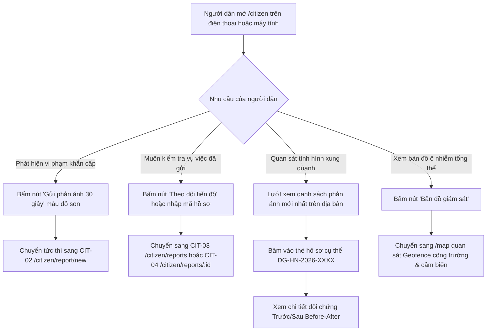

# CIT-01 — Trang Chủ Công Dân & Giám Sát Hiện Trường Cộng Đồng (Citizen Home Dashboard)

## 1. Screen Identity (Định Danh Màn Hình)
- **Mã màn hình**: `CIT-01`
- **Tên màn hình (VN)**: Trang Chủ Công Dân & Giám Sát Hiện Trường Cộng Đồng
- **Tên màn hình (EN)**: Citizen Home Dashboard & Community Monitoring Portal
- **Tuyến đường (Route)**: `/citizen`
  - Các tuyến đường chuyển hướng tương thích (Aliases & Redirects): `/citizen/dashboard`, `/citizen/nearby`, `/citizen/campaigns`
- **Đường dẫn Component**: [`app/src/apps/citizen/pages/home/CitizenHomePage.jsx`](file:///d:/07-Competitions-Hackathons/unicef-dustguard/app/src/apps/citizen/pages/home/CitizenHomePage.jsx)
- **Khung giao diện (Layout)**: [`app/src/apps/citizen/layout/CitizenLayout.jsx`](file:///d:/07-Competitions-Hackathons/unicef-dustguard/app/src/apps/citizen/layout/CitizenLayout.jsx)
  - **Desktop ($\ge 1024\text{px}$)**: Top Header cố định gồm Logo DustGuard VN, Huy hiệu vai trò "CỘNG ĐỒNG", Menu 4 mục điều hướng (Trang chủ, Gửi phản ánh, Phản ánh của tôi, Tài khoản) và thông tin phiên làm việc.
  - **Mobile ($< 640\text{px}$)**: Top Header rút gọn kèm thanh Bottom Navigation Bar cố định đáy với 4 nút chạm kích thước lớn $\ge 44\text{px}$.
- **Phân quyền người dùng (Role / RBAC)**: `public`, `citizen`, `youth` (Cho phép người dân vãng lai chưa đăng nhập truy cập tức thì, không tạo rào cản tài khoản khi cần gửi phản ánh khẩn cấp).
- **Trạng thái triển khai**: `ACTIVE` (Production Level 5 — Tích hợp Cloudflare D1 SQLite thật, Zero Mock, chuẩn Responsive đa thiết bị từ 360px đến 1920px).

---

## 2. Mục Đích & Bối Cảnh Nghiệp Vụ Thực Tế Đậm Chất Việt Nam

### 2.1. Bối cảnh thực tế tại các đô thị Việt Nam
Tại các đô thị lớn như Hà Nội, TP. Hồ Chí Minh, Đà Nẵng, Hải Phòng, Bình Dương:
- **Xe ben, xe tải chở vật liệu xây dựng cơi nới**: Chở đất cát, đá dăm, phế thải xây dựng từ các bãi tập kết vật liệu ven sông không phủ kín bạt hoặc bạt rách, làm cát đá rơi vãi mù mịt xuống lòng đường, gây nguy hiểm trực tiếp cho người đi xe máy.
- **Công trình xây dựng cao tầng & hạ tầng giao thông**: Không lắp đặt lưới chắn bụi, không có giàn phun sương dập bụi khi đào móng hoặc cắt bê tông, bụi xi măng phát tán bao trùm các khu dân cư và trường học lân cận.
- **Xe công trình không qua cầu rửa lốp**: Bùn đất bám vào bánh xe tải kéo dài hàng trăm mét ra các trục đường chính (như đường Nguyễn Xiển, Phạm Hùng, Võ Chí Công, Quốc lộ 1A, Xa lộ Hà Nội...), khi trời nắng bụi bốc lên mù mịt, khi trời mưa đường trơn trượt gây tai nạn giao thông.
- **Trạm trộn bê tông tươi & điểm tập kết phế thải**: Xả bụi bột đá, bụi xi măng vào giờ cao điểm, hoặc đốt cốp pha hỏng/vỏ bao xi măng gây khói khét nồng nặc.

### 2.2. Vai trò cốt lõi của màn hình CIT-01
1. **Điểm chạm tiếp cận nhanh nhất (Zero-Friction First Touch)**: Tải trang siêu tốc dưới $0.3\text{s}$ trên sóng di động 3G/4G chập chờn. Người dân đang đi trên đường dừng đèn đỏ có thể mở ứng dụng và kích hoạt quy trình gửi phản ánh chỉ bằng **1 chạm**.
2. **Kêu gọi hành động khẩn cấp (Hero Action)**: Đặt nút bấm `[Gửi phản ánh (30 giây)]` to rõ ở vị trí trung tâm tầm với của ngón tay cái, giúp người dân chụp ảnh hiện trường ngay trước khi xe vi phạm di chuyển khỏi vị trí.
3. **Minh bạch hóa chu trình xử lý 3 bước**: Giúp người dân hiểu rõ cơ chế vận hành của nền tảng:
   - **Bước 1 — Chụp ảnh hiện trường**: Chụp rõ vi phạm, hệ thống tự động nén $< 300\text{KB}$, băm SHA-256 bảo mật và gỡ bỏ Exif nhạy cảm.
   - **Bước 2 — Tiếp nhận & Xác minh**: Chuyển ngay đến tổ công tác thanh tra môi trường và Chỉ huy trưởng công trường phụ trách.
   - **Bước 3 — Nhận ảnh đối chứng**: Nhà thầu bắt buộc phải nộp ảnh đã quét dọn, rửa đường, phủ bạt có tọa độ đối chứng Before/After.
4. **Bảng tin phản ánh trực tiếp trên địa bàn (Live Community Feed)**: Hiển thị các phản ánh mới nhất từ cộng đồng quanh khu vực với mã tra cứu chuẩn quốc gia `DG-HN-2026-XXXX` và trạng thái cập nhật thời gian thực từ CSDL D1 SQLite.

---

## 3. Đối Tượng Người Dùng & Hành Trình Thao Tác (User Journey & Core Flow)

### 3.1. Đối tượng người dùng
- **Người tham gia giao thông**: Người đi xe máy/ô tô phát hiện xe ben rơi vãi đất cát, bụi mù mịt gây cản trở tầm nhìn và nguy cơ tai nạn.
- **Cư dân sinh sống cạnh công trường**: Người dân, tổ dân phố bức xúc vì công trình thi công không che chắn, bụi phủ kín nhà cửa, ban công.
- **Đoàn viên thanh niên & Tình nguyện viên môi trường**: Theo dõi các điểm nóng ô nhiễm trên địa bàn phường để giám sát, ghi nhận hiện trường tích lũy tín chỉ thanh niên (Youth Credits: 20 giờ = 4.0 tín chỉ).
- **Cán bộ cơ sở / Cảnh sát khu vực**: Mở nhanh xem các phản ánh mới nổi cộm trên địa bàn để kịp thời nhắc nhở nhà thầu.

### 3.2. Sơ đồ luồng trải nghiệm người dùng (Mermaid Flowchart)


### 3.3. Các bước thao tác chi tiết
1. **Truy cập trang chủ**: Người dân vào tuyến `/citizen`, hệ thống nạp dữ liệu danh sách 5 phản ánh mới nhất từ endpoint `GET /api/complaints?limit=5`.
2. **Quan sát thông điệp Hero**: Người dân thấy ngay lời nhắc nhở súc tích `Phát hiện bụi công trình? Chụp ảnh và gửi vị trí trong 30 giây để yêu cầu xử lý che chắn, phun nước.`
3. **Thực hiện hành động chính**:
   - Nếu có vi phạm trước mắt: Nhấn `[Gửi phản ánh (30 giây)]` $\rightarrow$ Mở camera chụp ảnh ngay.
   - Nếu cần kiểm tra kết quả: Nhấn `[Theo dõi tiến độ]` $\rightarrow$ Danh sách phản ánh hiển thị tiến độ thụ lý (Chờ xác minh, Đang xử lý, Đã khắc phục).

---

## 4. Bố Cục Giao Diện & Wireframe ASCII Chi Tiết (Information Hierarchy & Wireframes)

### 4.1. Phân cấp thông tin thị giác (Visual Hierarchy)
1. **Top Header**: Logo DustGuard hình lá chắn ngọc bích, Huy hiệu `[CỘNG ĐỒNG]`, Menu điều hướng và nút Trạng thái kết nối (Online / Offline).
2. **Hero Welcome Card (Khối Kêu Gọi Hành Động Khẩn Cấp)**:
   - Thẻ nền trắng ngà viền mềm với tiêu đề H1 đậm: `Phát hiện bụi công trình?`
   - Đoạn mô tả ngắn gọn, dễ hiểu, không dùng thuật ngữ kỹ thuật.
   - Cặp nút bấm hành động: Nút chính `[Gửi phản ánh (30 giây)]` (Màu đỏ son cứu hộ `#B91C1C`, chiều cao $48\text{px}$, hiệu ứng nổi bật) và Nút phụ `[Theo dõi tiến độ]` (Nền kem viền xám).
3. **Khối 3 Bước Giám Sát Minh Bạch (3-Step Community Process)**:
   - 3 Thẻ bài học quy trình trực quan:
     - `[1] Chụp ảnh hiện trường`: Chụp rõ xe tải không phủ bạt, bùn đất ra đường.
     - `[2] Tiếp nhận & Xác minh`: Chuyển trực tiếp đến tổ công tác và chỉ huy trưởng.
     - `[3] Nhận ảnh đối chứng`: Xem ảnh nhà thầu đã rửa đường, dọn bùn gửi lại.
4. **Khối Phản Ánh Mới Ghi Nhận Trên Địa Bàn (Recent Community Reports Feed)**:
   - Header khối: Tiêu đề `PHẢN ÁNH MỚI GHI NHẬN TRÊN ĐỊA BÀN` + Nút liên kết `Xem tất cả →`.
   - Danh sách thẻ hồ sơ: Mỗi thẻ gồm Mã số tra cứu (`DG-HN-2026-0842`), Badge trạng thái (Vàng `Đang xử lý`, Xanh lục `Đã khắc phục`, Xanh lam `Mới tiếp nhận`), Tiêu đề tóm tắt, Địa chỉ/Phường xã và nút điều hướng `Theo dõi →`.
5. **Mobile Bottom Navigation Bar (Dành cho điện thoại)**: 4 Tab cố định đáy: `Trang chủ`, `Gửi phản ánh` (Nút đỏ nổi bật ở giữa), `Của tôi`, `Tài khoản`.

### 4.2. Khung dây giao diện Mobile (Viewport 360px — 430px)
```text
+-------------------------------------------------------------+
| [🛡️ DustGuard VN] [CỘNG ĐỒNG]                 [🟢 Trực tuyến] |
+-------------------------------------------------------------+
|                                                             |
|  +-------------------------------------------------------+  |
|  | HERO WELCOME CARD                                     |  |
|  |                                                       |  |
|  | Phát hiện bụi công trình?                             |  |
|  | Chụp ảnh và gửi vị trí trong 30 giây để yêu cầu      |  |
|  | xử lý che chắn, phun nước dập bụi.                    |  |
|  |                                                       |  |
|  | [ 📸 GỬI PHẢN ÁNH (30 GIÂY) ]  (Cao 48px, Đỏ son)      |  |
|  |                                                       |  |
|  | [ 📋 Theo dõi tiến độ ]        (Cao 44px, Nền kem)     |  |
|  +-------------------------------------------------------+  |
|                                                             |
|  +-------------------------------------------------------+  |
|  | QUY TRÌNH 3 BƯỚC XỬ LÝ MINH BẠCH                      |  |
|  |                                                       |  |
|  | [1] 📸 Chụp ảnh hiện trường                           |  |
|  |     Chụp rõ xe tải không bạt, bùn đất ra đường...     |  |
|  |                                                       |  |
|  | [2] 🔍 Tiếp nhận & Xác minh                           |  |
|  |     Tổ công tác yêu cầu chỉ huy trưởng xử lý...       |  |
|  |                                                       |  |
|  | [3] ✅ Nhận ảnh đối chứng                             |  |
|  |     Xem ảnh nhà thầu đã rửa đường, dọn sạch...        |  |
|  +-------------------------------------------------------+  |
|                                                             |
|  +-------------------------------------------------------+  |
|  | PHẢN ÁNH MỚI TRÊN ĐỊA BÀN              [Xem tất cả →] |  |
|  |                                                       |  |
|  | +---------------------------------------------------+ |  |
|  | | DG-HN-2026-0842   [ ĐANG XỬ LÝ (Vàng) ]           | |  |
|  | | Xe tải chở cát không phủ bạt làm rơi vãi ra đường | |  |
|  | | 📍 128 Nguyễn Trãi, Phường Thanh Xuân Trung        | |  |
|  | | [ Theo dõi tiến độ → ]                            | |  |
|  | +---------------------------------------------------+ |  |
|  |                                                       |  |
|  | +---------------------------------------------------+ |  |
|  | | DG-HN-2026-0839   [ ĐÃ KHẮC PHỤC (Xanh) ]         | |  |
|  | | Công trình không phun nước khi múc đất móng       | |  |
|  | | 📍 45 Phạm Hùng, Phường Mỹ Đình 2                 | |  |
|  | | [ Xem ảnh đối chứng → ]                           | |  |
|  | +---------------------------------------------------+ |  |
|  +-------------------------------------------------------+  |
|                                                             |
+-------------------------------------------------------------+
| [🏠 Trang chủ]  [📸 Gửi phản ánh]  [📋 Của tôi]  [👤 Cá nhân]|
+-------------------------------------------------------------+
```

### 4.3. Khung dây giao diện Desktop (Viewport 1366px — 1920px)
```text
+----------------------------------------------------------------------------------------------------+
| [🛡️ DustGuard VN] [CỘNG ĐỒNG]      [Trang chủ]   [Gửi phản ánh]   [Phản ánh của tôi]   [👤 Tài khoản]|
+----------------------------------------------------------------------------------------------------+
|                                                                                                    |
|  +----------------------------------------------------------------------------------------------+  |
|  | HERO WELCOME CARD                                                                            |  |
|  | Phát hiện bụi công trình?                                                                    |  |
|  | Chụp ảnh và gửi vị trí trong 30 giây để yêu cầu xử lý che chắn, phun nước dập bụi.           |  |
|  |                                                                                              |  |
|  | [ 📸 Gửi phản ánh (30 giây) ] (Đỏ son)         [ 📋 Theo dõi tiến độ ] (Viền xám)             |  |
|  +----------------------------------------------------------------------------------------------+  |
|                                                                                                    |
|  +-----------------------------+  +-----------------------------+  +----------------------------+  |
|  | [1] 📸 Chụp ảnh hiện trường |  | [2] 🔍 Tiếp nhận & Xác minh |  | [3] ✅ Nhận ảnh đối chứng  |  |
|  | Chụp rõ vị trí phát tán bụi,|  | Tổ công tác nhận thông tin  |  | Xem hình ảnh nhà thầu đã   |  |
|  | xe tải không phủ bạt hoặc   |  | và chuyển yêu cầu xử lý đến |  | quét dọn, rửa xe, phủ bạt  |  |
|  | bùn đất rơi vãi ra lòng...  |  | chỉ huy trưởng công trình...|  | gửi lại trên hệ thống...   |  |
|  +-----------------------------+  +-----------------------------+  +----------------------------+  |
|                                                                                                    |
|  +----------------------------------------------------------------------------------------------+  |
|  | PHẢN ÁNH MỚI GHI NHẬN TRÊN ĐỊA BÀN                                            [Xem tất cả →] |  |
|  |                                                                                              |  |
|  | +------------------------------------------------------------------------------------------+ |  |
|  | | DG-HN-2026-0842   [ ĐANG XỬ LÝ ]                              Gửi lúc: Hôm nay 10:15     | |  |
|  | | Xe tải chở cát không phủ bạt làm rơi vãi đất cát kéo dài 100m                             | |  |
|  | | 📍 128 Nguyễn Trãi, Phường Thanh Xuân Trung, Quận Thanh Xuân, Hà Nội         [Theo dõi →] | |  |
|  | +------------------------------------------------------------------------------------------+ |  |
|  |                                                                                              |  |
|  | +------------------------------------------------------------------------------------------+ |  |
|  | | DG-HN-2026-0839   [ ĐÃ KHẮC PHỤC ]                            Gửi lúc: Hôm qua 16:30     | |  |
|  | | Công trình Tòa nhà hỗn hợp Sunrise không phun nước dập bụi khi xúc đất                    | |  |
|  | | 📍 45 Phạm Hùng, Phường Mỹ Đình 2, Quận Nam Từ Liêm, Hà Nội              [Xem đối chứng →]| |  |
|  | +------------------------------------------------------------------------------------------+ |  |
|  +----------------------------------------------------------------------------------------------+  |
|                                                                                                    |
+----------------------------------------------------------------------------------------------------+
```

---

## 5. Dữ Liệu & API / D1 Database Contract

### 5.1. API Endpoints
- **Lấy danh sách phản ánh mới nhất**:
  - `GET /api/complaints?limit=5` (Edge Worker Route) hoặc `/complaints?limit=5`
  - Method: `GET`
  - Headers: `Accept: application/json`
  - Query Parameters: `limit=5`, `status=ALL`, `ward=optional`

### 5.2. Chuẩn Hóa Bóc Tách Dữ Liệu (Collection Normalization Contract)
Theo nguyên tắc **API Data Contract & Collection Normalization**:
- Frontend không suy đoán hình dạng response.
- Sử dụng hàm unwrap chuẩn [`app/src/lib/api/request.js`](file:///d:/07-Competitions-Hackathons/unicef-dustguard/app/src/lib/api/request.js):
  ```javascript
  const res = await request('/complaints?limit=5');
  const items = Array.isArray(res?.data) ? res.data : (Array.isArray(res) ? res : []);
  ```
- Tuyệt đối không để xảy ra lỗi `TypeError: complaints.map is not a function`.

### 5.3. Schema Bảng CSDL D1 SQLite (`complaints` & `evidences`)
| Tên Cột | Kiểu Dữ Liệu | Ràng Buộc | Ý Nghĩa Nghiệp Vụ | Ví Dụ Dữ Liệu |
|---|---|---|---|---|
| `id` | `TEXT` | `PRIMARY KEY` | Định danh UUID của bản ghi phản ánh | `cmp_8f91a2b3c4d5` |
| `code` | `TEXT` | `NOT NULL UNIQUE` | Mã tra cứu chuẩn quốc gia theo tỉnh thành | `DG-HN-2026-0842` |
| `category` | `TEXT` | `NOT NULL` | Danh mục vi phạm (4 loại cốt lõi) | `UNCOVERED_TRANSPORT` |
| `title` / `description` | `TEXT` | `NOT NULL` | Nội dung phản ánh hiện trường | `Xe ben chở cát không phủ bạt làm rơi vãi đất cát ra đường` |
| `address` | `TEXT` | `NOT NULL` | Số nhà, tên tuyến đường xảy ra sự việc | `Số 128 Đường Nguyễn Trãi` |
| `ward` | `TEXT` | `NOT NULL` | Phường/Xã phụ trách địa bàn | `Phường Thanh Xuân Trung` |
| `district` | `TEXT` | `NULL` | Quận/Huyện/Thị xã | `Quận Thanh Xuân` |
| `province` | `TEXT` | `DEFAULT 'Hà Nội'` | Tỉnh / Thành phố trực thuộc Trung ương | `Hà Nội` |
| `status` | `TEXT` | `DEFAULT 'PENDING'` | Trạng thái thụ lý vụ việc | `PENDING`, `LINKED`, `PROCESSING`, `RESOLVED`, `REJECTED` |
| `reporter_name` | `TEXT` | `NULL` | Tên người phản ánh (hoặc 'Người dân ẩn danh') | `Nguyễn Văn A` |
| `evidence_urls` | `TEXT` | `NULL` | Mảng JSON chứa link ảnh minh chứng | `["https://r2.../ev_01.jpg"]` |
| `sha256` | `TEXT` | `NULL` | Mã băm SHA-256 đối chứng tính toàn vẹn | `e3b0c44298fc1c149afbf4...` |
| `created_at` | `DATETIME` | `DEFAULT CURRENT_TIMESTAMP` | Thời điểm công dân bấm gửi | `2026-09-02T03:15:30Z` |
| `updated_at` | `DATETIME` | `DEFAULT CURRENT_TIMESTAMP` | Thời điểm cập nhật trạng thái gần nhất | `2026-09-02T04:20:00Z` |

---

## 6. Bảng Nút Bấm & Hành Động Cốt Lõi (CTAs & Interactions)

| Tên Nút / Vùng Chạm | Vị Trí & Visual | Hành Vi Tương Tác | Phản Hồi Giao Diện | Yêu Cầu Kích Thước |
|---|---|---|---|---|
| **[📸 Gửi phản ánh (30 giây)]** | Hero Card — Nền đỏ son `#B91C1C`, chữ trắng in hoa đậm | Click / Tap | Chuyển trang tức thì sang `/citizen/report/new` | Chiều cao $\ge 48\text{px}$, Full width trên mobile |
| **[📋 Theo dõi tiến độ]** | Hero Card — Nền kem `#FAFAF9`, viền `#E7E5E4`, chữ `#1C1917` | Click / Tap | Điều hướng đến màn hình danh sách `/citizen/reports` | Chiều cao $\ge 44\text{px}$ |
| **[Xem tất cả →]** | Góc phải tiêu đề khối phản ánh mới | Click / Tap | Mở toàn bộ danh sách phản ánh `/citizen/reports` | Vùng chạm $\ge 44\text{px} \times 44\text{px}$ |
| **Thẻ phản ánh gần đây** | Thẻ card trắng viền mềm trong Feed | Click / Tap | Điều hướng trực tiếp đến màn hình chi tiết đối chứng `/citizen/reports/:id` | Card dạng block, hover viền đỏ son `#B91C1C` |
| **Tab Bottom Nav Mobile** | Thanh cố định đáy màn hình (4 Tab) | Tap ngón tay cái | Chuyển đổi tab tức thì giữa Trang chủ, Gửi phản ánh, Của tôi, Tài khoản | Chiều cao $56\text{px}$, mỗi tab $\ge 44\text{px} \times 44\text{px}$ |

---

## 7. Quy Chuẩn UI/UX, Responsive & Khả Năng Tiếp Cận (A11y)

### 7.1. Bảng màu Civic Tech độ tương phản cao (High Contrast — Zero Glassmorphism)
- **Nền trang chính**: Màu kem sáng thân thiện `#FDFBF7` (hoặc `#FAFAF9`).
- **Nền thẻ nội dung**: Trắng tinh khiết `#FFFFFF`, viền mềm `#E7E5E4`.
- **Màu chữ chính (High Contrast $\ge 7:1$)**: Đen mực sẫm `#1C1917` (tiêu đề H1/H2), Xám than `#57534E` (nội dung mô tả), Xám ấm `#78716C` (thông tin phụ, mã code).
- **Màu nhấn hành động (Emergency / Call-to-Action)**: Đỏ son cứu hộ `#B91C1C` (Hover: `#991B1B`, Active: `#7F1D1D`), nền nhấn nhạt `#FEF2F2`, viền đỏ `#FECACA`.
- **Màu trạng thái nghiệp vụ**:
  - `Mới tiếp nhận / PENDING`: Xanh lam biển (`bg-sky-50 text-sky-800 border-sky-200`).
  - `Đang xử lý / PROCESSING`: Vàng hổ phách (`bg-amber-50 text-amber-800 border-amber-200`).
  - `Đã khắc phục / RESOLVED`: Xanh ngọc lục bảo (`bg-emerald-50 text-emerald-800 border-emerald-200`).
  - `Từ chối / REJECTED`: Xám chì (`bg-stone-100 text-stone-700 border-stone-300`).
- **Tuyệt đối cấm**:
  - Hiệu ứng làm mờ nền `backdrop-blur-*` (Glassmorphism).
  - Chữ xám nhạt trên nền trắng gây khó đọc dưới ánh sáng mặt trời ngoài trời.

### 7.2. Quy tắc kích thước & Vùng chạm (Touch Targets)
- Mọi nút bấm, liên kết điều hướng và thẻ chạm đều đạt chiều cao tối thiểu $\ge 44\text{px}$ (khuyến nghị $48\text{px}$ cho nút gửi chính).
- Khoảng cách an toàn giữa các nút bấm tối thiểu $8\text{px}$ để tránh bấm nhầm khi đang đi bộ hoặc dừng xe.

### 7.3. Quy tắc hiển thị văn bản (Zero Truncate on Critical Civic Entities)
- Cấm sử dụng `truncate` hoặc `overflow-hidden` làm cụt lủn tên công trình, địa chỉ nhà dân hoặc mã số hồ sơ.
- Luôn sử dụng `min-w-0 flex-1 break-words` kết hợp xuống dòng tự nhiên để người dân và cán bộ đọc trọn vẹn thông tin hiện trường.

### 7.4. Khả năng đáp ứng đa thiết bị (Responsive Matrix)
- **Mobile (360px — 430px)**: Bố cục 1 cột dọc duy nhất, khoảng cách mép màn hình $16\text{px}$, hiển thị Bottom Navigation Bar cố định đáy, tối ưu thao tác bằng một tay ngón cái.
- **Tablet (640px — 1024px)**: Khối 3 bước dàn 3 cột, hiển thị Header thanh điều hướng trên cùng, ẩn Bottom Nav.
- **Desktop (1024px — 1920px)**: Giới hạn chiều rộng tối đa `max-w-4xl` hoặc `max-w-5xl` căn giữa màn hình, giữ thông tin tập trung, trực quan, không bị kéo dãn vô lý.

---

## 8. Bẫy Lỗi Thường Gặp & Hướng Dẫn Kiểm Thử (Edge Cases & Fast Test CLI)

### 8.1. Các tình huống biên (Edge Cases) & Cơ chế tự phục hồi
1. **Mất kết nối Internet hoặc sóng 4G chập chờn khi vừa mở trang**:
   - *Biểu hiện*: API `/complaints` không phản hồi hoặc timeout.
   - *Cơ chế phục hồi*: Bộ unwrap `request.js` tự động fallback về mảng rỗng `[]`, hiển thị thẻ `EmptyState` tiếng Việt nhẹ nhàng: *"Chưa có phản ánh mới trong khu vực. Hãy là người đầu tiên ghi nhận vi phạm để làm sạch môi trường phố phường."*, không làm trắng hoặc vỡ giao diện.
2. **Thiết bị màn hình cực nhỏ (320px - 360px)**:
   - *Biểu hiện*: Cặp nút bấm Hero bị tràn ngang hoặc đè chữ.
   - *Cơ chế phục hồi*: Thiết lập `flex-col sm:flex-row`, nút bấm tự động dãn full-width `w-full` trên mobile, đảm bảo không có thanh cuộn ngang (Zero horizontal scroll).
3. **Mã hồ sơ quá dài hoặc ký tự đặc biệt**:
   - *Biểu hiện*: Badge trạng thái đè lên mã code trên màn hình hẹp.
   - *Cơ chế phục hồi*: Bố cục Flexbox `flex-wrap items-center justify-between gap-2` giúp huy hiệu tự động xuống dòng an toàn nếu thiếu không gian.

### 8.2. Lệnh kiểm thử nhanh phân tầng (PowerShell CLI)

```powershell
# [Level 0] Kiểm tra nhanh logic màn hình công dân (< 0.5s)
node --test app/tests/citizen-full-functional.test.js

# [Level 0] Kiểm tra thiết kế chuẩn Tokens & Màu sắc High Contrast (< 0.5s)
node --test app/tests/design-system-tokens.test.js

# [Level 1] Kiểm tra kiểm toán thực tế và định tuyến công dân (< 3s)
node --test app/tests/citizen-real-world-audit.test.js

# [Level 3 Gate] Xác thực nhanh toàn hệ thống trước khi commit (< 7s)
npm --prefix app run verify:quick
```
