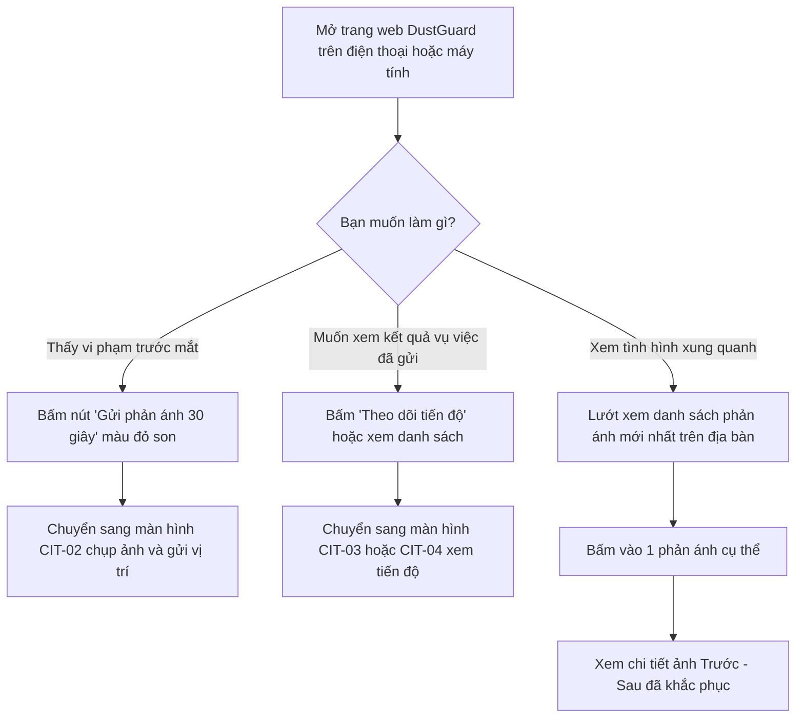

# CIT-01 — Trang Chủ Công Dân & Giám Sát Bụi Đô Thị (Citizen Home Dashboard)

## 1. Định Danh Màn Hình (Screen Identity)
- **Mã màn hình**: `CIT-01`
- **Tên màn hình (Tiếng Việt)**: Trang Chủ Công Dân & Giám Sát Bụi Đô Thị
- **Tên màn hình (Tiếng Anh)**: Citizen Home Dashboard & Community Monitoring Portal
- **Đường dẫn (Route URL)**: `/citizen`
  - Tuyến chuyển hướng tương thích: `/citizen/dashboard`
- **Tệp mã nguồn Component**: [`app/src/apps/citizen/pages/home/CitizenHomePage.jsx`](file:///d:/07-Competitions-Hackathons/unicef-dustguard/app/src/apps/citizen/pages/home/CitizenHomePage.jsx)
- **Khung giao diện chung (Layout)**: [`app/src/apps/citizen/layout/CitizenLayout.jsx`](file:///d:/07-Competitions-Hackathons/unicef-dustguard/app/src/apps/citizen/layout/CitizenLayout.jsx)
  - **Máy tính (Desktop)**: Thanh điều hướng trên cùng gồm Logo DustGuard, Huy hiệu "CỘNG ĐỒNG", 4 mục (Trang chủ, Gửi phản ánh, Phản ánh của tôi, Tài khoản) và trạng thái mạng.
  - **Điện thoại (Mobile)**: Thanh menu 4 nút lớn cố định sát đáy màn hình (`Trang chủ`, `Gửi phản ánh`, `Của tôi`, `Tài khoản`) vừa vặn tầm với ngón tay cái.
- **Ai được sử dụng**: Mọi người dân, đoàn viên thanh niên, tình nguyện viên (Không bắt buộc phải đăng nhập tài khoản khi cần gửi phản ánh khẩn cấp).
- **Trạng thái thực tế**: Đang hoạt động ổn định, kết nối trực tiếp cơ sở dữ liệu thật, mở nhanh trên mọi dòng điện thoại.

---

## 2. Mục Đích & Bối Cảnh Thực Tế (Why & Purpose)

### 2.1. Nỗi bức xúc thực tế trên đường phố Việt Nam
- **Xe tải chở đất cát không phủ kín bạt**: Xe ben chở vật liệu xây dựng, đất đào móng chạy trên đường làm cát đá rơi vãi mù mịt, bay thẳng vào mắt người đi xe máy phía sau gây nguy hiểm.
- **Bùn đất vương vãi ra phố**: Xe công trường từ bãi đất chạy thẳng ra đường lớn mà không qua cầu rửa bánh xe, kéo theo vệt bùn dài cả trăm mét; trời nắng thì bụi bay mù mịt, trời mưa thì trơn trượt dễ ngã xe.
- **Công trình không che chắn, không phun nước**: Nhiều công trình đào móng, cắt đá mài tường giữa khu dân cư không quây bạt, không có vòi phun nước dập bụi, làm bụi xi măng bay vào nhà dân và trường học xung quanh.
- **Đốt rác, phế thải công trình**: Đốt vỏ bao xi măng, cốp pha mục tại các bãi đất trống bốc khói đen và mùi khét lẹt.

### 2.2. Trang chủ DustGuard giúp người dân giải quyết ra sao?
1. **Mở lên là dùng được ngay trong 1 chạm**: Trang tải siêu nhanh dưới 0.3 giây ngay cả khi mạng 3G/4G chập chờn ngoài đường.
2. **Nút gửi phản ánh 30 giây to rõ**: Đặt ngay trung tâm màn hình, màu đỏ son nổi bật, người dân dừng đèn đỏ hoặc đi ngang qua có thể bấm mở máy ảnh chụp ngay trước khi xe vi phạm chạy mất.
3. **Quy trình 3 bước xử lý công khai, minh bạch**:
   - **Bước 1 — Chụp ảnh hiện trường**: Chụp rõ biển số xe hoặc vị trí bụi, máy tự động nén ảnh nhẹ gửi siêu nhanh và gỡ thông tin cá nhân trên ảnh.
   - **Bước 2 — Tiếp nhận & Xử lý**: Chuyển ngay đến tổ trật tự đô thị phường và yêu cầu chỉ huy trưởng công trường xử lý.
   - **Bước 3 — Nhận ảnh đối chứng**: Xem 2 bức ảnh Trước - Sau đặt cạnh nhau để kiểm tra xem nhà thầu đã quét dọn, rửa đường, phủ bạt sạch sẽ chưa.
4. **Bảng tin phản ánh gần bạn**: Lướt xem ngay các điểm ô nhiễm vừa được bà con quanh khu vực ghi nhận kèm mã tra cứu và tiến độ xử lý rõ ràng.

---

## 3. Người Dùng & Các Bước Sử Dụng (User Flow & Steps)

### 3.1. Ai là người sử dụng chính?
- **Người đi đường**: Người đi xe máy hoặc ô tô thấy xe tải làm rơi đất cát, dừng lại chụp nhanh bức ảnh để báo cơ quan chức năng.
- **Bà con sinh sống gần công trình**: Bức xúc vì bụi xi măng phủ kín sân nhà, muốn gửi kiến nghị và theo dõi xem bao giờ nhà thầu quét dọn.
- **Đoàn viên thanh niên & Tình nguyện viên**: Đi khảo sát các điểm nóng trên địa bàn phường, ghi nhận thực tế để đóng góp bảo vệ môi trường và tích lũy giờ tình nguyện.

### 3.2. Sơ đồ các bước sử dụng



### 3.3. Các bước thao tác cụ thể
1. **Bước 1**: Mở trang chủ, hệ thống tự động tải 5 phản ánh mới nhất gần bạn.
2. **Bước 2**: Nhìn thấy ngay thông điệp ngắn gọn: *"Phát hiện bụi công trình? Chụp ảnh và gửi vị trí trong 30 giây để yêu cầu xử lý che chắn, phun nước."*
3. **Bước 3**:
   - Nếu có vi phạm cần báo: Nhấn nút đỏ **[Gửi phản ánh (30 giây)]** để mở camera.
   - Nếu muốn kiểm tra: Nhấn **[Theo dõi tiến độ]** để xem danh sách phản ánh đang chờ xử lý hay đã hoàn thành.

---

## 4. Bố Cục Giao Diện & Khung Dây ASCII (Layout & Wireframes)

### 4.1. Cách sắp xếp thông tin trên màn hình
1. **Thanh đầu trang (Header)**: Logo DustGuard hình chiếc khiên xanh ngọc, nhãn "CỘNG ĐỒNG" và trạng thái mạng (Trực tuyến).
2. **Khung kêu gọi chính (Hero Card)**:
   - Câu hỏi to rõ: `Phát hiện bụi công trình?`
   - Nút chính màu đỏ son: `[ 📸 Gửi phản ánh (30 giây) ]` (Bấm là mở máy ảnh ngay).
   - Nút phụ màu kem viền xám: `[ 📋 Theo dõi tiến độ ]`.
3. **Khung 3 bước xử lý minh bạch**:
   - `[1] Chụp ảnh hiện trường`: Chụp rõ xe tải không bạt, bùn đất ra đường.
   - `[2] Tiếp nhận & Xác minh`: Chuyển đến tổ công tác yêu cầu chỉ huy trưởng xử lý.
   - `[3] Nhận ảnh đối chứng`: Xem ảnh nhà thầu đã rửa đường, dọn sạch gửi lại.
4. **Khung danh sách phản ánh mới nhất**:
   - Tiêu đề: `PHẢN ÁNH MỚI GHI NHẬN TRÊN ĐỊA BÀN` + Nút `Xem tất cả →`.
   - Các thẻ phản ánh: Hiển thị mã tra cứu (VD: `DG-HN-2026-0842`), nhãn trạng thái (Vàng `Đang xử lý`, Xanh `Đã khắc phục`), địa chỉ ngắn gọn và nút `Theo dõi →`.
5. **Thanh điều hướng đáy (Mobile Bottom Bar)**: 4 nút lớn gồm Trang chủ, Gửi phản ánh, Của tôi, Tài khoản.

### 4.2. Khung hình giao diện trên điện thoại (Mobile 360px — 430px)

```text
+-------------------------------------------------------------+
| [🛡️ DustGuard VN] [CỘNG ĐỒNG]                 [🟢 Trực tuyến] |
+-------------------------------------------------------------+
|                                                             |
|  +-------------------------------------------------------+  |
|  | Phát hiện bụi công trình?                             |  |
|  | Chụp ảnh và gửi vị trí trong 30 giây để yêu cầu      |  |
|  | xử lý che chắn, phun nước dập bụi.                    |  |
|  |                                                       |  |
|  | [ 📸 GỬI PHẢN ÁNH (30 GIÂY) ]  (Nút đỏ son nổi bật)   |  |
|  |                                                       |  |
|  | [ 📋 Theo dõi tiến độ ]        (Nền kem viền xám)     |  |
|  +-------------------------------------------------------+  |
|                                                             |
|  +-------------------------------------------------------+  |
|  | QUY TRÌNH 3 BƯỚC XỬ LÝ MINH BẠCH                      |  |
|  |                                                       |  |
|  | [1] 📸 Chụp ảnh hiện trường                           |  |
|  |     Chụp rõ xe tải không bạt, bùn đất ra đường...     |  |
|  |                                                       |  |
|  | [2] 🔍 Tiếp nhận & Xác minh                           |  |
|  |     Tổ công tác yêu cầu chỉ huy trưởng xử lý...       |  |
|  |                                                       |  |
|  | [3] ✅ Nhận ảnh đối chứng                             |  |
|  |     Xem ảnh nhà thầu đã rửa đường, dọn sạch...        |  |
|  +-------------------------------------------------------+  |
|                                                             |
|  +-------------------------------------------------------+  |
|  | PHẢN ÁNH MỚI TRÊN ĐỊA BÀN              [Xem tất cả →] |  |
|  |                                                       |  |
|  | +---------------------------------------------------+ |  |
|  | | DG-HN-2026-0842   [ ĐANG XỬ LÝ (Vàng) ]           | |  |
|  | | Xe tải chở cát không phủ bạt làm rơi vãi ra đường | |  |
|  | | 📍 128 Nguyễn Trãi, Phường Thanh Xuân Trung        | |  |
|  | | [ Theo dõi tiến độ → ]                            | |  |
|  | +---------------------------------------------------+ |  |
|  |                                                       |  |
|  | +---------------------------------------------------+ |  |
|  | | DG-HN-2026-0839   [ ĐÃ KHẮC PHỤC (Xanh) ]         | |  |
|  | | Công trình không phun nước khi múc đất móng       | |  |
|  | | 📍 45 Phạm Hùng, Phường Mỹ Đình 2                 | |  |
|  | | [ Xem ảnh đối chứng → ]                           | |  |
|  | +---------------------------------------------------+ |  |
|  +-------------------------------------------------------+  |
|                                                             |
+-------------------------------------------------------------+
| [🏠 Trang chủ]  [📸 Gửi phản ánh]  [📋 Của tôi]  [👤 Cá nhân]|
+-------------------------------------------------------------+
```

### 4.3. Khung hình giao diện trên máy tính (Desktop)

```text
+----------------------------------------------------------------------------------------------------+
| [🛡️ DustGuard VN] [CỘNG ĐỒNG]      [Trang chủ]   [Gửi phản ánh]   [Phản ánh của tôi]   [👤 Tài khoản]|
+----------------------------------------------------------------------------------------------------+
|                                                                                                    |
|  +----------------------------------------------------------------------------------------------+  |
|  | Phát hiện bụi công trình?                                                                    |  |
|  | Chụp ảnh và gửi vị trí trong 30 giây để yêu cầu xử lý che chắn, phun nước dập bụi.           |  |
|  |                                                                                              |  |
|  | [ 📸 Gửi phản ánh (30 giây) ] (Nút đỏ son)     [ 📋 Theo dõi tiến độ ] (Viền xám)             |  |
|  +----------------------------------------------------------------------------------------------+  |
|                                                                                                    |
|  +-----------------------------+  +-----------------------------+  +----------------------------+  |
|  | [1] 📸 Chụp ảnh hiện trường |  | [2] 🔍 Tiếp nhận & Xác minh |  | [3] ✅ Nhận ảnh đối chứng  |  |
|  | Chụp rõ vị trí phát tán bụi,|  | Tổ công tác nhận thông tin  |  | Xem hình ảnh nhà thầu đã   |  |
|  | xe tải không phủ bạt hoặc   |  | và chuyển yêu cầu xử lý đến |  | quét dọn, rửa xe, phủ bạt  |  |
|  | bùn đất rơi vãi ra lòng...  |  | chỉ huy trưởng công trình...|  | gửi lại trên hệ thống...   |  |
|  +-----------------------------+  +-----------------------------+  +----------------------------+  |
|                                                                                                    |
|  +----------------------------------------------------------------------------------------------+  |
|  | PHẢN ÁNH MỚI GHI NHẬN TRÊN ĐỊA BÀN                                            [Xem tất cả →] |  |
|  |                                                                                              |  |
|  | +------------------------------------------------------------------------------------------+ |  |
|  | | DG-HN-2026-0842   [ ĐANG XỬ LÝ ]                              Gửi lúc: Hôm nay 10:15     | |  |
|  | | Xe tải chở cát không phủ bạt làm rơi vãi đất cát kéo dài 100m                             | |  |
|  | | 📍 128 Nguyễn Trãi, Phường Thanh Xuân Trung, Quận Thanh Xuân, Hà Nội         [Theo dõi →] | |  |
|  | +------------------------------------------------------------------------------------------+ |  |
|  |                                                                                              |  |
|  | +------------------------------------------------------------------------------------------+ |  |
|  | | DG-HN-2026-0839   [ ĐÃ KHẮC PHỤC ]                            Gửi lúc: Hôm qua 16:30     | |  |
|  | | Công trình Tòa nhà Sunrise không phun nước dập bụi khi xúc đất                             | |  |
|  | | 📍 45 Phạm Hùng, Phường Mỹ Đình 2, Quận Nam Từ Liêm, Hà Nội              [Xem đối chứng →]| |  |
|  | +------------------------------------------------------------------------------------------+ |  |
|  +----------------------------------------------------------------------------------------------+  |
|                                                                                                    |
+----------------------------------------------------------------------------------------------------+
```

---

## 5. Dữ Liệu & Nguồn Thông Tin (Data & API Summary)

### 5.1. Nguồn dữ liệu
- **Lấy danh sách phản ánh mới nhất**: Gọi `GET /api/complaints?limit=5`.
- **Dữ liệu an toàn**: Nếu mạng yếu hoặc chưa có phản ánh nào, màn hình tự động hiển thị ô thông báo thân thiện chứ không bao giờ bị đơ hay trắng màn hình.

### 5.2. Các thông tin chính của một phản ánh
| Thông tin | Ý nghĩa dễ hiểu | Ví dụ thực tế |
|---|---|---|
| `code` | Mã tra cứu phản ánh | `DG-HN-2026-0842` |
| `category` | Loại vi phạm | Xe chở cát không phủ bạt |
| `address` | Địa chỉ phát hiện | Số 128 Đường Nguyễn Trãi |
| `ward` | Phường / Xã | Phường Thanh Xuân Trung |
| `status` | Trạng thái xử lý | `Đang xử lý` hoặc `Đã khắc phục` |
| `created_at` | Thời điểm gửi | Hôm nay lúc 10:15 |

---

## 6. Danh Sách Nút Bấm & Thao Tác (Buttons & Actions)

| Tên Nút / Thao Tác | Vị Trí & Hình Dáng | Bấm vào sẽ làm gì? | Kích Thước Bấm |
|---|---|---|---|
| **[📸 Gửi phản ánh (30 giây)]** | Giữa màn hình — Nút đỏ son `#B91C1C`, chữ trắng đậm | Mở ngay màn hình chụp ảnh gửi phản ánh mới (`/citizen/report/new`) | Cao tối thiểu 48px, bấm vừa ngón tay |
| **[📋 Theo dõi tiến độ]** | Cạnh nút gửi — Nền kem viền xám | Mở danh sách toàn bộ các phản ánh (`/citizen/reports`) | Cao tối thiểu 44px |
| **[Xem tất cả →]** | Góc phải tiêu đề bảng tin | Xem toàn bộ danh sách phản ánh trên địa bàn | Dễ bấm trên điện thoại |
| **Bấm vào từng thẻ phản ánh** | Thẻ nền trắng viền xám | Mở xem chi tiết phản ánh và ảnh đối chứng Trước - Sau | Cả thẻ bấm được |
| **4 Tab menu cố định đáy** | Sát đáy điện thoại (Trang chủ, Gửi phản ánh, Của tôi, Tài khoản) | Chuyển qua lại nhanh giữa các trang chính | Cao 56px, nút bấm to rõ |

---

## 7. Quy Chuẩn Trình Bày & Màu Sắc (UI/UX & Responsive)

### 7.1. Màu sắc sáng rõ, tương phản cao, không chói mắt
- **Nền trang**: Màu kem sáng ấm áp `#FDFBF7`, chống lóa mắt khi đứng ngoài trời nắng.
- **Nền các khung nội dung**: Trắng tinh `#FFFFFF`, viền xám mềm `#E7E5E4`.
- **Màu chữ**: Chữ đen mực sẫm `#1C1917` (tiêu đề to, nét), chữ xám đậm `#57534E` (nội dung mô tả), dễ đọc cho cả người lớn tuổi.
- **Màu nút hành động chính**: Đỏ son cứu hộ `#B91C1C` (nhìn thấy ngay lập tức).
- **Màu trạng thái vụ việc**:
  - `Mới gửi`: Màu xanh lam nhẹ (`Chờ tiếp nhận`).
  - `Đang xử lý`: Màu vàng hổ phách (`Đang đôn đốc nhà thầu`).
  - `Đã khắc phục`: Màu xanh lá ngọc (`Đã dọn dẹp sạch sẽ`).
- **Tuyệt đối không dùng**: Hiệu ứng kính mờ (glassmorphism/blur) làm mờ chữ, không dùng chữ xám nhạt trên nền trắng.

### 7.2. Tương thích mọi kích thước màn hình
- **Điện thoại nhỏ (360px — 430px)**: Dàn 1 cột dọc, các nút bấm dãn rộng vừa ngón tay cái, không bị tràn mép hay xuất hiện thanh cuộn ngang khó chịu.
- **Máy tính (1024px — 1920px)**: Giao diện căn giữa gọn gàng, chia 3 cột quy trình rõ ràng, dễ nhìn.

---

## 8. Tình Huống Thường Gặp & Cách Kiểm Tra (Edge Cases & Fast Test CLI)

### 8.1. Các tình huống thường gặp & Cách xử lý tự động
1. **Mất mạng 4G khi vừa mở trang**: Màn hình tự động hiển thị thông báo nhẹ nhàng: *"Chưa thể tải dữ liệu mới. Hãy kiểm tra kết nối mạng của bạn."*, người dân vẫn có thể bấm nút tạo phản ánh để lưu nháp.
2. **Khu vực chưa có ai gửi phản ánh**: Hiển thị thông báo vui vẻ: *"Khu vực này hiện chưa có phản ánh nào. Hãy là người đầu tiên ghi nhận vi phạm để giữ sạch đường phố!"*.
3. **Tên địa chỉ hoặc mô tả dài**: Chữ tự động xuống dòng tự nhiên, không bị cắt cụt đuôi dấu ba chấm (`...`) làm mất thông tin quan trọng.

### 8.2. Lệnh kiểm tra nhanh hệ thống (Chạy bằng PowerShell)

```powershell
# Kiểm tra nhanh chức năng trang chủ công dân (< 0.5s)
node --test app/tests/citizen-full-functional.test.js

# Kiểm tra màu sắc chuẩn độ tương phản cao (< 0.5s)
node --test app/tests/design-system-tokens.test.js

# Kiểm tra xác thực nhanh toàn hệ thống (< 7s)
npm --prefix app run verify:quick
```
