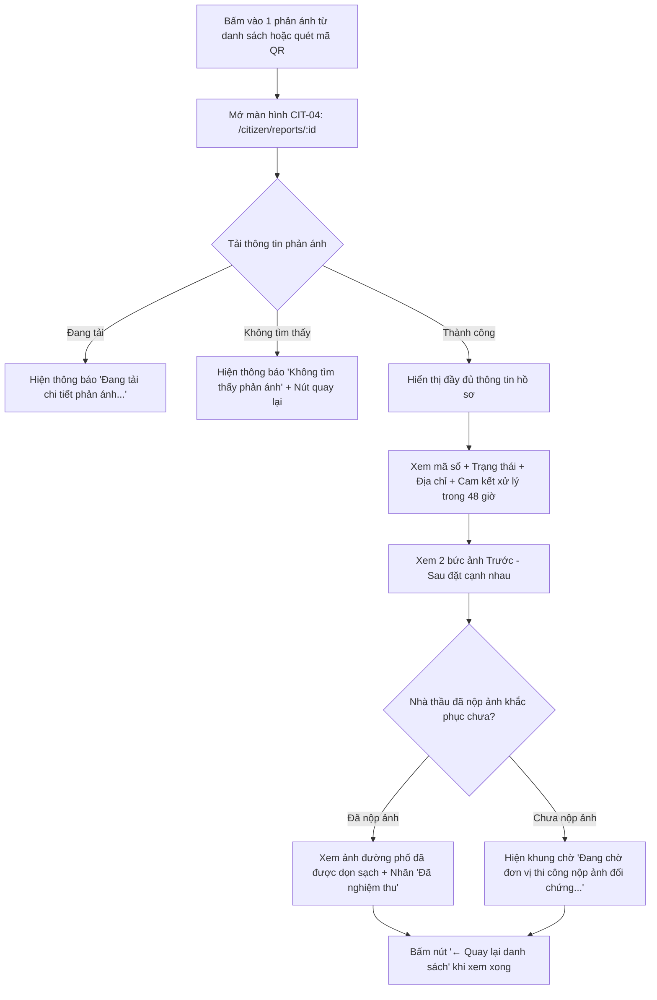

# CIT-04 — Chi Tiết Phản Ánh & Đối Chứng Ảnh Trước - Sau (Citizen Report Detail)

## 1. Định Danh Màn Hình (Screen Identity)
- **Mã màn hình**: `CIT-04`
- **Tên màn hình (Tiếng Việt)**: Chi Tiết Phản Ánh & Đối Chứng Ảnh Trước - Sau
- **Tên màn hình (Tiếng Anh)**: Citizen Report Detail & Before-After Evidence
- **Đường dẫn (Route URL)**: `/citizen/reports/:id`
  - Tuyến chuyển hướng tương thích: `/citizen/track/:id`
- **Tệp mã nguồn Component**: [`app/src/apps/citizen/pages/reports/ReportDetailPage.jsx`](file:///d:/07-Competitions-Hackathons/unicef-dustguard/app/src/apps/citizen/pages/reports/ReportDetailPage.jsx)
- **Khung giao diện chung (Layout)**: [`app/src/apps/citizen/layout/CitizenLayout.jsx`](file:///d:/07-Competitions-Hackathons/unicef-dustguard/app/src/apps/citizen/layout/CitizenLayout.jsx)
  - **Máy tính (Desktop)**: Khung nội dung `max-w-4xl` căn giữa, lưới đối chứng 2 bức ảnh Trước - Sau đặt cạnh nhau đối xứng.
  - **Điện thoại (Mobile)**: Nút "← Quay lại" gắn trên đỉnh vừa tầm tay cái, 2 khung ảnh tự động xếp dọc dễ nhìn.
- **Ai được sử dụng**: Mọi người dân, đoàn viên thanh niên, tình nguyện viên, cán bộ quản lý (Chỉ cần có mã phản ánh hoặc quét mã QR).
- **Trạng thái thực tế**: Đang hoạt động ổn định, kết nối cơ sở dữ liệu thật, hiển thị ảnh đối chứng thực địa rõ ràng.

---

## 2. Mục Đích & Bối Cảnh Thực Tế (Why & Purpose)

### 2.1. Niềm tin từ những bức ảnh thực tế
- Người dân khi gửi phản ánh rất muốn biết: **"Liệu phản ánh của mình có thực sự làm đường phố sạch hơn không?"**.
- Màn hình `CIT-04` tạo dựng niềm tin tuyệt đối bằng cách **đặt 2 bức ảnh Trước - Sau cạnh nhau**:
  - **Ảnh Trước (Lúc phát hiện)**: Ảnh do người dân chụp khi vi phạm đang diễn ra (xe chở cát làm rơi vãi, bùn đất kéo vệt, bụi mù mịt).
  - **Ảnh Sau (Sau khi xử lý)**: Ảnh do nhà thầu nộp lên để chứng minh đã quét dọn sạch sẽ, rửa sạch lòng đường hoặc phủ bạt kín xe.

### 2.2. Các điểm nổi bật của màn hình
1. **Xem 2 bức ảnh Trước - Sau đặt cạnh nhau**: Giúp người dân và tổ công tác đối chiếu trực tiếp kết quả làm sạch, không thể gian dối.
2. **Cam kết xử lý trong 48 giờ**: Ghi rõ cam kết trách nhiệm của tổ công tác phường và chỉ huy trưởng công trường phải tiếp nhận và xử lý dứt điểm trong vòng 48 giờ.
3. **Bảo đảm tính chân thực của ảnh chụp**: Toàn bộ ảnh đều có mã nhận dạng chống can thiệp photoshop, bảo đảm bằng chứng trung thực 100%.
4. **Tích lũy giờ tình nguyện cho thanh niên**: Khi phản ánh chuyển sang `Đã khắc phục`, hệ thống tự động cộng giờ tình nguyện thực tế cho tài khoản người gửi.
5. **Bảo vệ danh tính người dân**: Tên và số điện thoại người gửi được ẩn danh an toàn, tránh bị làm phiền.

---

## 3. Người Dùng & Các Bước Sử Dụng (User Flow & Steps)

### 3.1. Ai là người sử dụng chính?
- **Người dân đã gửi phản ánh**: Mở ra kiểm tra xem nhà thầu đã rửa sạch đường và quét bùn đất chưa.
- **Đoàn viên, Sinh viên tình nguyện**: Dùng ảnh đối chứng này làm minh chứng nghiệm thu thực địa để nộp xét điểm rèn luyện tại trường.
- **Cán bộ phụ trách địa bàn**: Xem nhanh 2 ảnh đối chứng để duyệt hoàn thành và đóng hồ sơ vụ việc.

### 3.2. Sơ đồ các bước sử dụng



---

## 4. Bố Cục Giao Diện & Khung Dây ASCII (Layout & Wireframes)

### 4.1. Cách sắp xếp thông tin trên màn hình
1. **Nút quay lại**: `[← Quay lại danh sách phản ánh]` to rõ ở góc trên bên trái.
2. **Khung tiêu đề hồ sơ**:
   - Mã số phản ánh (in đậm `DG-2026-F54A`) đặt cạnh Nhãn trạng thái (`Đã khắc phục` / `Đang xử lý` / `Mới gửi`).
   - Tóm tắt hiện trường vi phạm to rõ, dễ đọc.
   - Ngày giờ gửi phản ánh.
3. **Khung tóm tắt địa chỉ & Cam kết 48 giờ**:
   - Địa chỉ phát hiện: Tên số nhà, tuyến đường cụ thể.
   - Khu vực phụ trách: Phường / Xã.
   - Thời hạn cam kết xử lý: Nhãn nổi bật `Trong vòng 48 giờ`.
4. **Lưới đối chứng hình ảnh Trước & Sau**:
   - **Khung 1 — Ảnh lúc phát hiện (Trước)**: Viền đỏ nhạt, tiêu đề đỏ son, ảnh chụp hiện trường lúc vi phạm.
   - **Khung 2 — Ảnh sau khi khắc phục (Sau)**: Viền xanh lá nhạt, tiêu đề xanh đậm, ảnh chụp đường đã được quét dọn sạch sẽ (hoặc khung chờ nếu nhà thầu đang xử lý).

### 4.2. Khung hình giao diện trực quan (ASCII Wireframe)

```text
+----------------------------------------------------------------------------------------------------+
| [ ← Quay lại danh sách phản ánh ]                                                                  |
|                                                                                                    |
|  +----------------------------------------------------------------------------------------------+  |
|  | DG-2026-F54A   [ ĐÃ KHẮC PHỤC (Xanh lá) ]                        Gửi lúc: 25/07/2026         |  |
|  | Phát hiện xe tải chở đất đá rơi vãi gây ô nhiễm bụi nghiêm trọng tại ô đất E9 Phường Yên Hòa  |  |
|  |----------------------------------------------------------------------------------------------|  |
|  | +------------------------------------------------------------------------------------------+ |  |
|  | | Địa chỉ phát hiện:      Số 18 Phạm Hùng, Phường Yên Hòa, Cầu Giấy                        | |  |
|  | | Khu vực / Phường:       Phường Yên Hòa                                                   | |  |
|  | | Thời hạn cam kết xử lý: Trong vòng 48 giờ (Đôn đốc nhà thầu khắc phục)                   | |  |
|  | +------------------------------------------------------------------------------------------+ |  |
|  |                                                                                              |  |
|  | HÌNH ẢNH ĐỐI CHỨNG HIỆN TRƯỜNG (TRƯỚC & SAU KHI KHẮC PHỤC)                                  |  |
|  |                                                                                              |  |
|  | +-----------------------------------------+  +---------------------------------------------+ |  |
|  | | 1. Ảnh lúc phát hiện (Trước)            |  | 2. Ảnh sau khi khắc phục (Sau)              | |  |
|  | | [Ảnh gốc ✓]                             |  | [ Đã dọn dẹp sạch sẽ ]                      | |  |
|  | |-----------------------------------------|  |---------------------------------------------| |  |
|  | |                                         |  |                                             | |  |
|  | |   [ẢNH HIỆN TRƯỜNG BÙN ĐẤT RƠI VÃI]     |  |   [ẢNH ĐƯỜNG ĐÃ ĐƯỢC RỬA SẠCH VÀ PHỦ BẠT]   | |  |
|  | |   (Chụp lúc 08:30 sáng)                 |  |   (Nghiệm thu lúc 14:00 chiều)              | |  |
|  | |                                         |  |                                             | |  |
|  | +-----------------------------------------+  +---------------------------------------------+ |  |
|  +----------------------------------------------------------------------------------------------+  |
+----------------------------------------------------------------------------------------------------+
| [Menu đáy trên điện thoại]:        (🏠 Trang chủ)   (📋 Phản ánh [*])   (🗺️ Bản đồ)   (👤 Hồ sơ)     |
+----------------------------------------------------------------------------------------------------+
```

---

## 5. Dữ Liệu & Nguồn Thông Tin (Data & API Summary)

### 5.1. Nguồn dữ liệu
- **Lấy chi tiết phản ánh**: Gọi `GET /api/complaints/:id`.
- **Trích xuất thông minh**: Tự động nhận diện link ảnh Trước và link ảnh Sau để hiển thị đúng khung.

### 5.2. Các thông tin chính của phản ánh
| Thông tin | Ý nghĩa dễ hiểu | Ví dụ thực tế |
|---|---|---|
| `code` | Mã tra cứu phản ánh | `DG-2026-F54A` |
| `status` | Trạng thái xử lý | `Đã khắc phục` (hoặc `Đang xử lý`) |
| `address` | Địa chỉ xảy ra vi phạm | Số 18 Phạm Hùng, Phường Yên Hòa |
| `description` | Mô tả chi tiết vi phạm | Xe chở đất đá rơi vãi ra đường |
| `evidenceUrl` | Ảnh chụp lúc phát hiện (Trước) | Link ảnh hiện trường |
| `resolvedEvidenceUrl` | Ảnh đã xử lý sạch sẽ (Sau) | Link ảnh nhà thầu đã rửa đường |

---

## 6. Danh Sách Nút Bấm & Thao Tác (Buttons & Actions)

| Tên Nút / Thao Tác | Vị Trí | Bấm vào sẽ làm gì? | Kích Thước Bấm |
|---|---|---|---|
| **[← Quay lại danh sách]** | Góc trên bên trái | Quay trở lại danh sách phản ánh (`/citizen/reports`) | Cao 44px, dễ bấm |
| **Bấm vào Ảnh Trước** | Khung ảnh cột trái | Xem ảnh to rõ lúc phát hiện vi phạm | Bấm trên toàn ảnh |
| **Bấm vào Ảnh Sau** | Khung ảnh cột phải | Xem ảnh to rõ sau khi nhà thầu đã dọn dẹp | Bấm trên toàn ảnh |
| **[Quay lại danh sách]** | Màn hình khi không tìm thấy | Quay lại trang danh sách | Cao 44px, nút đỏ |

---

## 7. Quy Chuẩn Trình Bày & Màu Sắc (UI/UX & Responsive)

### 7.1. Màu sắc sáng rõ, phân biệt Trước - Sau trực quan
- **Nền trang**: Màu kem sáng nhạt `#FDFBF7`, chống lóa mắt ngoài trời.
- **Nền khung chính**: Trắng tinh `#FFFFFF`, bo góc mềm mại, viền xám nhẹ `#E7E5E4`.
- **Khung Ảnh Trước (Lúc vi phạm)**: Viền đỏ nhạt, nền tiêu đề hồng nhạt `#FEF2F2`, chữ đỏ son `#B91C1C`.
- **Khung Ảnh Sau (Đã khắc phục)**: Viền xanh lá nhạt, nền tiêu đề xanh nhạt `#ECFDF5`, chữ xanh lá đậm `#065F46`.
- **Khung cam kết 48 giờ**: Chữ màu vàng hổ phách đậm, dễ nhìn mà không gây khó chịu.
- **Không dùng kính mờ (glassmorphism)**: Ảnh và chữ luôn hiển thị rõ nét 100%.

### 7.2. Tương thích mọi màn hình
- **Điện thoại (360px — 430px)**: 2 khung ảnh Trước - Sau tự động xếp chồng theo chiều dọc để ảnh to rõ, không bị bóp méo.
- **Máy tính (640px — 1920px)**: 2 khung ảnh dàn hàng ngang 2 cột đối xứng hoàn hảo, giúp dễ dàng so sánh Trước và Sau.

---

## 8. Tình Huống Thường Gặp & Cách Kiểm Tra (Edge Cases & Fast Test CLI)

### 8.1. Các tình huống thường gặp & Cách xử lý tự động
1. **Nhà thầu chưa nộp ảnh khắc phục**: Khung ảnh Sau tự động hiển thị thông báo chờ văn minh: *"Đang chờ đơn vị thi công nộp ảnh đối chứng sau khi quét dọn / che bạt."*, không bao giờ bị lỗi hình ảnh vỡ hay icon ảnh hỏng.
2. **Mã phản ánh không đúng hoặc không tồn tại**: Màn hình hiển thị thông báo nhẹ nhàng: *"Không tìm thấy thông tin phản ánh này."* kèm nút bấm quay về danh sách.
3. **Bảo mật quyền riêng tư**: Không hiển thị số điện thoại người gửi trên trang chi tiết công khai.

### 8.2. Lệnh kiểm tra nhanh hệ thống (Chạy bằng PowerShell)

```powershell
# Kiểm tra chức năng xem chi tiết phản ánh (< 0.5s)
node --test app/tests/citizen-full-functional.test.js

# Kiểm tra xử lý đối chứng ảnh thực tế (< 0.5s)
node --test app/tests/cases-inspections-complaints-audit.test.js

# Xác thực nhanh toàn hệ thống trước khi bàn giao (< 7s)
npm --prefix app run verify:quick
```
