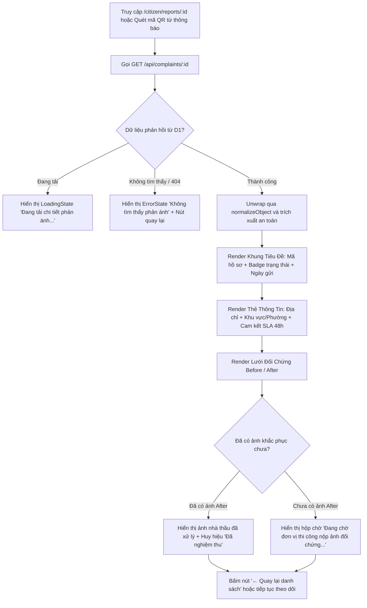

# CIT-04 — Chi Tiết Phản Ánh, Lưới Đối Chứng Trước / Sau & Cam Kết SLA (Citizen Report Detail)

## 1. Screen Identity (Định Danh Màn Hình)
- **Mã màn hình**: `CIT-04`
- **Tên màn hình (Tiếng Việt)**: Chi Tiết Phản Ánh, Lưới Đối Chứng Trước / Sau & Cam Kết SLA
- **Tên màn hình (Tiếng Anh)**: Citizen Report Detail, Before/After Evidence & SLA Commitment
- **Tuyến đường (Route URL)**: `/citizen/reports/:id`
  - *Tuyến đường tương thích & chuyển hướng*: `/citizen/track/:id`
- **Đường dẫn Component**: [`app/src/apps/citizen/pages/reports/ReportDetailPage.jsx`](file:///d:/07-Competitions-Hackathons/unicef-dustguard/app/src/apps/citizen/pages/reports/ReportDetailPage.jsx)
- **Khung giao diện (Layout)**: [`app/src/apps/citizen/layout/CitizenLayout.jsx`](file:///d:/07-Competitions-Hackathons/unicef-dustguard/app/src/apps/citizen/layout/CitizenLayout.jsx)
  - *Desktop*: Top Header cố định gồm Logo DustGuard, Huy hiệu vai trò `CỘNG ĐỒNG`, breadcrumb điều hướng và menu người dùng.
  - *Mobile (Viewport < 640px)*: Bottom Navigation Bar cố định đáy màn hình, nút "← Quay lại" gắn trên đỉnh vùng với của ngón tay cái.
- **Phân quyền người dùng (Role / RBAC)**: `citizen`, `youth`, `staff`, `public` (Bất kỳ ai sở hữu mã định danh hồ sơ hợp lệ hoặc quét từ mã QR).
- **Trạng thái triển khai**: `ACTIVE` (Production Level 5 — Kết nối CSDL D1 SQLite SSOT, giải nén dữ liệu qua `normalizeObject`, hiển thị ảnh đối chứng thực địa đa nguồn).

---

## 2. Mục Đích & Giá Trị Thực Tế

1. **Lưới đối chứng Trước / Sau (Before / After Evidence Grid) — Trọng tâm Liêm chính**:
   - Đây là vũ khí cốt lõi tạo nên niềm tin của người dân và thanh niên đối với hệ thống CivicTech.
   - Giao diện đặt song song:
     - **Cột 1 (Trước - Before)**: Ảnh hiện trường vi phạm do công dân / sinh viên ghi nhận lúc phát hiện (bùn đất kéo vệt, xe ben không trùm bạt, bụi mù mịt).
     - **Cột 2 (Sau - After)**: Ảnh nhà thầu thi công nộp minh chứng đã khắc phục (rửa sạch đường gom, căng bạt kín thùng xe, kích hoạt vòi phun sương áp lực cao).

2. **Giám sát cam kết thời hạn giải quyết trong 48 giờ (SLA 48h)**:
   - Thể hiện rõ ràng quy chuẩn trách nhiệm công vụ: Đơn vị quản lý địa bàn (UBND Phường, Tổ Trật tự Đô thị) và Chỉ huy trưởng dự án phải tiếp nhận, kiểm tra và phản hồi kết quả trong vòng 48 giờ.
   - Khối thời hạn cam kết được hiển thị nổi bật bằng tông màu hổ phách đậm để người dân dễ dàng giám sát.

3. **Bảo đảm toàn vẹn dữ liệu số (Tamper-Evident SHA-256)**:
   - Toàn bộ tệp ảnh chứng cứ được lưu trữ phân tán trên Cloudflare R2 và tính toán mã băm SHA-256 ngay từ lúc tải lên, ngăn chặn tuyệt đối tình trạng tráo đổi ảnh hoặc làm giả kết quả kiểm tra.

4. **Tích lũy quyền lợi Tín chỉ Sinh viên & Đoàn - Hội**:
   - Khi hồ sơ chuyển sang trạng thái `RESOLVED` (Đã khắc phục), hệ thống tự động ghi nhận thành tích cho tài khoản người gửi (+2.5 giờ hoạt động tình nguyện thực địa và +10 Điểm rèn luyện), phục vụ cấp Chứng chỉ điện tử tại Cổng `/youth`.

---

## 3. Đối Tượng Người Dùng & Hành Trình Thao Tác (User Journey & Core Flow)

### 3.1. Đối tượng người dùng
- **Công dân đã gửi phản ánh**: Muốn kiểm tra kết quả xử lý thực tế xem đơn vị thi công đã khắc phục triệt để chưa.
- **Đoàn viên, Sinh viên Tình nguyện (Youth Volunteers)**: Dùng màn hình này làm bằng chứng nghiệm thu thực địa để nộp hồ sơ xét Điểm rèn luyện / Tín chỉ tình nguyện tại Khoa / Trường.
- **Đơn vị Quản lý & Thanh tra Xây dựng**: Dùng giao diện đối chứng nhanh để nghiệm thu kết quả khắc phục trước khi đóng hồ sơ vụ việc.

### 3.2. Sơ đồ luồng thao tác chi tiết (Core Flow)



---

## 4. Bố Cục Giao Diện & Phân Cấp Thông Tin (Information Hierarchy & Wireframe)

### 4.1. Phân cấp thị giác theo thứ tự ưu tiên (Visual Hierarchy)
1. **Thanh điều hướng quay về (Back Action)**:
   - Nút `[← Quay lại danh sách phản ánh]` kích thước $\ge 44\text{px}$, nền xám kem `#FAFAF9`, viền `#E7E5E4`.
2. **Khối Định Danh Hồ Sơ (Case Header Block)**:
   - Mã số phản ánh (Font Monospace xám đen `DG-2026-F54A`) đặt cạnh Huy hiệu trạng thái (`StatusBadge`: Đã khắc phục / Đang xử lý / Mới gửi).
   - Tiêu đề tóm tắt hiện trường phát hiện (Font chữ đen đậm `#1C1917`, kích cỡ 20px).
   - Thời gian gửi phản ánh định dạng ngày giờ tiếng Việt (`dd/mm/yyyy`).
3. **Bảng Tóm Tắt Hiện Trường & Cam Kết SLA (Location & SLA Card)**:
   - Nền kem nhạt `#FAFAF9`, viền bo góc tròn mềm mại.
   - Dòng 1: **Địa chỉ phát hiện**: Tên số nhà, tuyến phố cụ thể.
   - Dòng 2: **Khu vực / Phường**: Đơn vị hành chính phụ trách địa bàn.
   - Dòng 3: **Thời hạn cam kết xử lý**: Nhãn nổi bật `Trong vòng 48 giờ` (Màu hổ phách đậm `text-amber-800 font-bold`).
4. **Lưới Đối Chứng Hình Ảnh Before / After (Evidence Comparison Grid)**:
   - **Khung 1 — Ảnh công dân phản ánh (Lúc phát hiện)**:
     - Header đỏ nhạt `bg-[#FEF2F2]`, viền `#FECACA`, chữ đỏ son `#B91C1C`.
     - Huy hiệu `SHA-256 ✓` chứng minh tính nguyên bản không bị can thiệp.
     - Khung ảnh tỷ lệ chuẩn $16:9$ hoặc chiều cao cố định $208\text{px}$ (`h-52`), ảnh hiển thị `object-cover`.
   - **Khung 2 — Ảnh đơn vị thi công đã khắc phục (Sau xử lý)**:
     - Header xanh ngọc nhạt `bg-[#ECFDF5]`, viền `#A7F3D0`, chữ xanh ngọc `#065F46`.
     - Huy hiệu `Đã nghiệm thu` khi đã có ảnh hoặc hộp trạng thái chờ (`Pending State`) với biểu tượng đồng hồ cát và thông báo hướng dẫn.

### 4.2. Khung dây giao diện trực quan (ASCII Wireframe)

```text
+----------------------------------------------------------------------------------------------------+
| [ ← Quay lại danh sách phản ánh ]                                                                  |
|                                                                                                    |
|  +----------------------------------------------------------------------------------------------+  |
|  | DG-2026-F54A   [ ĐÃ KHẮC PHỤC (Xanh ngọc) ]                      Gửi lúc: 25/07/2026         |  |
|  | Phát hiện xe tải chở đất đá rơi vãi gây ô nhiễm bụi nghiêm trọng tại ô đất E9 Phường Yên Hòa  |  |
|  |----------------------------------------------------------------------------------------------|  |
|  | +------------------------------------------------------------------------------------------+ |  |
|  | | Địa chỉ phát hiện:      Số 18 Phạm Hùng, Phường Yên Hòa, Cầu Giấy                        | |  |
|  | | Khu vực / Phường:       Phường Yên Hòa                                                   | |  |
|  | | Thời hạn cam kết xử lý: Trong vòng 48 giờ (SLA Tiếp nhận & Đôn đốc)                      | |  |
|  | +------------------------------------------------------------------------------------------+ |  |
|  |                                                                                              |  |
|  | HÌNH ẢNH ĐỐI CHỨNG HIỆN TRƯỜNG (TRƯỚC & SAU KHI KHẮC PHỤC)                                  |  |
|  |                                                                                              |  |
|  | +-----------------------------------------+  +---------------------------------------------+ |  |
|  | | 1. Ảnh công dân phản ánh (Lúc phát hiện) |  | 2. Ảnh đơn vị thi công đã khắc phục (Sau)   | |  |
|  | | [SHA-256 ✓]                             |  | [ Đã nghiệm thu ]                           | |  |
|  | |-----------------------------------------|  |---------------------------------------------| |  |
|  | |                                         |  |                                             | |  |
|  | |   [ẢNH HIỆN TRƯỜNG BÙN ĐẤT RƠI VÃI]     |  |   [ẢNH ĐƯỜNG ĐÃ ĐƯỢC RỬA SẠCH VÀ PHỦ BẠT]   | |  |
|  | |   (Chụp lúc 08:30 sáng)                 |  |   (Nghiệm thu lúc 14:00 chiều)              | |  |
|  | |                                         |  |                                             | |  |
|  | +-----------------------------------------+  +---------------------------------------------+ |  |
|  +----------------------------------------------------------------------------------------------+  |
+----------------------------------------------------------------------------------------------------+
| [Mobile Bottom Nav (≤ 640px)]:   (🏠 Trang chủ)   (📋 Phản ánh [*])   (🗺️ Bản đồ)   (👤 Hồ sơ)     |
+----------------------------------------------------------------------------------------------------+
```

---

## 5. Dữ Liệu & API / D1 Database Contract

### 5.1. Bảng CSDL D1 SQLite liên quan
- **Bảng `complaints`**: `id`, `code`, `site_id`, `ward`, `address`, `description`, `status`, `created_at`, `updated_at`.
- **Bảng `evidences`**: `id`, `complaint_id`, `url`, `type` (`BEFORE` / `AFTER`), `sha256`, `created_at`.
- **Bảng `remediation_tasks`**: Ghi nhận hành động khắc phục của nhà thầu (rửa đường gom, phun sương dập bụi).

### 5.2. API Contract chi tiết
- **Endpoint**: `GET /api/complaints/:id` (Hỗ trợ fallback `GET /complaints/:id`)
- **Headers**:
  ```http
  Accept: application/json
  Authorization: Bearer <session_token> (Tùy chọn)
  ```
- **Cấu trúc JSON phản hồi thành công (HTTP 200)**:
  ```json
  {
    "status": "success",
    "data": {
      "id": "cmp_88f91a2b3c4d",
      "code": "DG-2026-F54A",
      "ward": "Phường Yên Hòa",
      "address": "Số 18 Phạm Hùng, Phường Yên Hòa",
      "description": "Phát hiện xe tải chở đất đá rơi vãi gây ô nhiễm bụi nghiêm trọng tại ô đất E9",
      "status": "RESOLVED",
      "sha256": "8a9c012f45bd67e89012345678abcdef0123456789abcdef0123456789abcdef",
      "evidenceUrl": "https://images.unsplash.com/photo-1541888946425-d0fbb186a5b3",
      "resolvedEvidenceUrl": "https://images.unsplash.com/photo-1504307651254-35680f356dfd",
      "createdAt": "2026-07-25T08:30:00.000Z",
      "updatedAt": "2026-07-26T10:00:00.000Z",
      "evidences": [
        {
          "id": "evi_01",
          "type": "BEFORE",
          "url": "https://images.unsplash.com/photo-1541888946425-d0fbb186a5b3",
          "sha256": "8a9c012f45bd67e89012345678abcdef0123456789abcdef0123456789abcdef"
        },
        {
          "id": "evi_02",
          "type": "AFTER",
          "url": "https://images.unsplash.com/photo-1504307651254-35680f356dfd",
          "sha256": "9b0d123e45cf78f90123456789abcdef0123456789abcdef0123456789abcdef"
        }
      ]
    }
  }
  ```
- **Chuẩn hóa Client Layer (Object Normalization Invariant)**:
  - Bắt buộc dùng `normalizeObject(res)` từ `app/src/lib/api/request.js`.
  - Phân rã dữ liệu an toàn: `raw?.complaint || raw?.item || (raw?.id ? raw : null)`.
  - Trích xuất linh hoạt các định dạng URL ảnh: `report.evidenceUrl || report.evidence_url || report.evidences?.[0]?.url`.

---

## 6. Bảng Nút Bấm & Hành Động Cốt Lõi (CTAs & Interactions)

| Tên Nút / Thành Phần UI | Vị Trí / Bố Cục | Hành Vi Tương Tác & Phản Hồi | Quyền Hạn | Điều Hướng / Thay Đổi State |
|---|---|---|---|---|
| **[← Quay lại danh sách]** | Góc trên bên trái | Nền xám kem, viền nhẹ, hover đổi màu `#F5F5F4`, min-height $44\text{px}$ | Tất cả | Điều hướng về `/citizen/reports` |
| **Ảnh Trước (Before Photo)** | Khung ảnh cột trái | Hiển thị ảnh hiện trường lúc vi phạm, hover có trỏ chuột phóng to | Tất cả | Cho phép xem chi tiết ảnh gốc |
| **Ảnh Sau (After Photo)** | Khung ảnh cột phải | Hiển thị ảnh nhà thầu đã xử lý hoặc khung chờ đối chứng | Tất cả | Cho phép đối chiếu mức độ làm sạch |
| **Huy hiệu SHA-256** | Header ảnh Before | Nền trắng, viền đỏ, hiển thị mã băm toàn vẹn | Tất cả | Khẳng định tính pháp lý của minh chứng |
| **[Quay lại danh sách]** | Khối ErrorState | Nền đỏ son `#B91C1C`, chữ trắng, min-height $44\text{px}$ | Tất cả | Điều hướng về `/citizen/reports` khi gặp lỗi 404 |

---

## 7. Quy Chuẩn UI/UX, In Ấn & Responsive (Design System Tokens)

### 7.1. Bảng màu Civic High-Contrast
- **Nền trang**: Kem nhạt `#FDFBF7`.
- **Thẻ Card chính**: Trắng `#FFFFFF`, bo góc lớn `rounded-3xl`, viền mảnh `#E7E5E4`, đổ bóng nhẹ `shadow-xs`.
- **Khung Before (Cảnh báo ô nhiễm)**: Nền đỏ nhạt `bg-[#FEF2F2]`, viền đỏ `border-[#FECACA]`, chữ đỏ son `text-[#B91C1C]`.
- **Khung After (Kết quả khắc phục)**: Nền xanh ngọc nhạt `bg-[#ECFDF5]`, viền xanh `border-[#A7F3D0]`, chữ xanh lục đậm `text-[#065F46]`.
- **Khung cam kết SLA**: Chữ `text-amber-800`, biểu thị thời hạn 48 giờ rõ ràng, không gây áp lực quá đà.

### 7.2. Responsive SSOT
- **Mobile (360px — 430px)**:
  - Lưới đối chứng Before / After tự động xếp chồng theo chiều dọc 1 cột (`grid-cols-1`).
  - Chiều cao khung ảnh thu gọn $200\text{px}$ để người dùng không phải cuộn trang quá nhiều.
  - Các thông tin địa chỉ và mã hồ sơ tự động xuống dòng tự nhiên, không tràn ngang màn hình.
- **Tablet & Desktop (640px — 1920px)**:
  - Lưới đối chứng dàn ngang 2 cột đối xứng hoàn hảo (`sm:grid-cols-2`).
  - Chiều cao khung ảnh cố định $208\text{px}$ (`h-52`), căn giữa thẩm mỹ cao.

---

## 8. Bẫy Lỗi Thường Gặp & Hướng Dẫn Kiểm Thử (Gotchas & Verification Commands)

### 8.1. Bẫy lập trình & Quy tắc an toàn (Gotchas)

> [!IMPORTANT]
> 1. **Bẫy Null / Undefined trên ảnh khắc phục (After Evidence Fallback)**: Rất nhiều phản ánh mới gửi (`PENDING` hoặc `IN_PROGRESS`) chưa có ảnh khắc phục từ nhà thầu. Tuyệt đối không được để thẻ `` nhận `src={undefined}` gây vỡ layout trình duyệt hoặc icon ảnh lỗi (broken image). Phải render khung fallback `Waiting State` với nội dung giải thích văn minh: *"Đang chờ đơn vị thi công nộp ảnh đối chứng sau khi phun nước / che bạt."*
> 2. **Lỗi mã hóa tham số URL (URL Encoding)**: Tham số `:id` có thể chứa ký tự gạch nối hoặc mã code (`DG-2026-F54A`). Bắt buộc dùng `encodeURIComponent(id)` khi gọi API request.
> 3. **Bảo mật thông tin cá nhân (Privacy Leak)**: Ẩn số điện thoại (`reporterPhone`) và tên người phản ánh trên màn hình công khai để bảo vệ người dân.

### 8.2. Lệnh kiểm thử nhanh một dòng qua PowerShell (< 0.5s)

```powershell
node --test app/tests/citizen-full-functional.test.js app/tests/cases-inspections-complaints-audit.test.js
```

### 8.3. Tiêu chí nghiệm thu (Pass Criteria 100%)
1. **Render Đúng Dữ Liệu Thực**: Tải chính xác dữ liệu từ D1 SQLite khi truyền mã `id` hợp lệ.
2. **Hiển Thị Lưới Đối Chứng Toàn Vẹn**: Hiển thị ảnh Before và After chuẩn xác khi có dữ liệu, và fallback thân thiện khi chưa có ảnh After.
3. **Bắt Lỗi 404 Chuẩn Xác**: Hiển thị `ErrorState` đẹp mắt khi người dùng truy cập vào mã phản ánh không tồn tại trong hệ thống.
