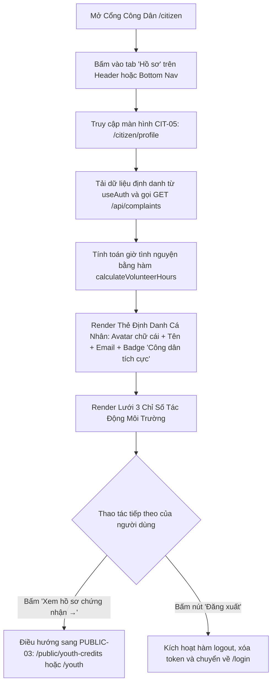

# CIT-05 — Hồ Sơ Cá Nhân & Đóng Góp Môi Trường Đoàn - Hội (Citizen Profile)

## 1. Screen Identity (Định Danh Màn Hình)
- **Mã màn hình**: `CIT-05`
- **Tên màn hình (Tiếng Việt)**: Hồ Sơ Cá Nhân & Đóng Góp Môi Trường Đoàn - Hội
- **Tên màn hình (Tiếng Anh)**: Citizen Profile, Volunteer Impact & Youth Recognition
- **Tuyến đường (Route URL)**: `/citizen/profile`
  - *Tuyến đường tương thích & chuyển hướng*: `/citizen/credits`
- **Đường dẫn Component**: [`app/src/apps/citizen/pages/profile/CitizenProfilePage.jsx`](file:///d:/07-Competitions-Hackathons/unicef-dustguard/app/src/apps/citizen/pages/profile/CitizenProfilePage.jsx)
- **Khung giao diện (Layout)**: [`app/src/apps/citizen/layout/CitizenLayout.jsx`](file:///d:/07-Competitions-Hackathons/unicef-dustguard/app/src/apps/citizen/layout/CitizenLayout.jsx)
  - *Desktop*: Top Header cố định gồm Logo DustGuard, Huy hiệu vai trò `CỘNG ĐỒNG`, Navigation Tabs và Menu Tài khoản.
  - *Mobile (Viewport < 640px)*: Bottom Navigation Bar cố định đáy màn hình với 4 nút chạm kích thước lớn $\ge 44\text{px}$ (`Trang chủ`, `Phản ánh`, `Bản đồ`, `Hồ sơ [Active]`).
- **Phân quyền người dùng (Role / RBAC)**: `citizen`, `youth`, `student`, `community` (Đoàn viên thanh niên, sinh viên đại học hoặc công dân đã đăng nhập).
- **Trạng thái triển khai**: `ACTIVE` (Production Level 5 — Tích hợp hệ thống xác thực AuthContext, tính toán giờ tình nguyện theo thời gian thực từ CSDL D1 SQLite).

---

## 2. Mục Đích & Giá Trị Thực Tế

1. **Ghi nhận & Tôn vinh cống hiến vì môi trường đô thị**:
   - Màn hình tổng kết thành quả hoạt động xã hội của công dân và sinh viên tình nguyện.
   - Thể hiện rõ 3 chỉ số tác động xã hội thực tế:
     - **Tín chỉ ngoại khóa đề xuất (Extracurricular Credits)**: Tỷ lệ quy đổi chuẩn học thuật ($20.0\text{h} = 4.0\text{ Tín chỉ}$).
     - **Số phản ánh đã được khắc phục (Resolved Cases)**: Số lượng điểm nóng ô nhiễm môi trường do cá nhân trực tiếp đóng góp giải quyết thành công.
     - **Tổng số giờ tình nguyện thực địa (Verified Volunteer Hours)**: Thời lượng khảo sát, đo đạc và tái kiểm định hiện trường được hệ thống thẩm định.

2. **Cầu nối sang Cổng Tín Chỉ & Chứng Nhận Điện Tử (`/youth`)**:
   - Cung cấp nút liên kết một chạm sang phân hệ cấp Giấy chứng nhận hoạt động môi trường chuẩn khổ A4, có chữ ký số HMAC-SHA256, dấu mộc đỏ số hóa và mã QR Vector ISO/IEC 18004 để sinh viên nộp cho Ban Chấp hành Đoàn trường / Hội Sinh viên xét Điểm rèn luyện (ĐRL).

3. **Định danh minh bạch & Quản lý phiên làm việc**:
   - Hiển thị tư cách người dùng ("Công dân tích cực" / "Tình nguyện viên Đội Sinh viên Tình nguyện"), đảm bảo độ tin cậy của các phản ánh được gửi lên hệ thống.
   - Hỗ trợ nút đăng xuất an toàn trên các thiết bị công cộng hoặc máy tính dùng chung tại trường học.

---

## 3. Đối Tượng Người Dùng & Hành Trình Thao Tác (User Journey & Core Flow)

### 3.1. Đối tượng người dùng
- **Sinh viên các trường Đại học tại Hà Nội** (ĐHQG Hà Nội, ĐH Bách Khoa, ĐH Xây dựng, ĐH Kinh tế Quốc dân, ĐH Giao thông Vận tải...): Cần xem tổng kết số giờ và tín chỉ đã tích lũy trong học kỳ để hoàn thiện hồ sơ sinh viên.
- **Đoàn viên thanh niên & Tình nguyện viên CLB Môi trường**: Theo dõi tiến độ tham gia các chiến dịch dập bụi đô thị.
- **Công dân tích cực**: Quản lý thông tin tài khoản và xem lại đóng góp cải thiện không khí khu dân cư.

### 3.2. Sơ đồ luồng thao tác cốt lõi (Core User Flow)



---

## 4. Bố Cục Giao Diện & Phân Cấp Thông Tin (Information Hierarchy & Wireframe)

### 4.1. Phân cấp thị giác theo thứ tự ưu tiên (Visual Hierarchy)
1. **Thẻ Định Danh Cá Nhân (User Identity Banner)**:
   - Avatar hình tròn lớn ($56\text{px} \times 56\text{px}$) màu xanh ngọc `#0d6f64`, in hoa chữ cái đầu tiên của Họ tên người dùng.
   - Họ và tên đầy đủ (Font chữ đen đậm `#1C1917`, kích cỡ 20px).
   - Địa chỉ Email hoặc nhãn "Chế độ công dân giám sát".
   - Huy hiệu `Công dân tích cực` (Nền xanh lục nhạt `#ECFDF5`, viền `#A7F3D0`, chữ `#065F46`).
   - Nút hành động phụ: `[Đăng xuất]` (Nền kem `#FAFAF9`, viền `#E7E5E4`, chiều cao tối thiểu $\ge 44\text{px}$).
2. **Thẻ Thống Kê Đóng Góp Môi Trường (Environmental Contribution Card)**:
   - Tiêu đề khối: `ĐÓNG GÓP BẢO VỆ MÔI TRƯỜNG` (Chữ hoa in đậm, màu xám đậm `#57534E`).
   - Nút chuyển tiếp góc phải: `Xem hồ sơ chứng nhận →` (Màu xanh ngọc `#0d6f64`, gạch chân khi hover).
   - Lưới 3 cột chỉ số đo lường (3-Column Metric Grid):
     - **Cột 1 — Tín chỉ ngoại khóa đề xuất**: Số lượng lớn (VD: `4.0`), màu đen đậm `#1C1917`, nhãn "Tín chỉ ngoại khóa đề xuất".
     - **Cột 2 — Phản ánh đã được khắc phục**: Số lượng lớn (VD: `12`), màu xanh ngọc `#0d6f64`, nhãn "Phản ánh đã được khắc phục".
     - **Cột 3 — Giờ hoạt động tình nguyện**: Số lượng lớn (VD: `20h`), màu hổ phách đậm `text-amber-700`, nhãn "Giờ hoạt động tình nguyện".

### 4.2. Khung dây giao diện trực quan (ASCII Wireframe)

```text
+----------------------------------------------------------------------------------------------------+
| [Logo DustGuard VN]  [CỘNG ĐỒNG]              Trang chủ   Phản ánh   Bản đồ   [Tài khoản (*)]      |
+----------------------------------------------------------------------------------------------------+
|                                                                                                    |
|  +----------------------------------------------------------------------------------------------+  |
|  |  +-----+  NGUYỄN VĂN AN                                                       [ Đăng xuất ]  |  |
|  |  |  N  |  nguyenvanan.hust@gmail.com                                                         |  |
|  |  +-----+  [ Công dân tích cực ]                                                              |  |
|  +----------------------------------------------------------------------------------------------+  |
|                                                                                                    |
|  +----------------------------------------------------------------------------------------------+  |
|  | ĐÓNG GÓP BẢO VỆ MÔI TRƯỜNG                                      Xem hồ sơ chứng nhận →       |  |
|  |                                                                                              |  |
|  |  +------------------------+  +------------------------+  +--------------------------------+  |  |
|  |  |          4.0           |  |           12           |  |             20.0h              |  |  |
|  |  | Tín chỉ ngoại khóa đề  |  | Phản ánh đã được khắc  |  |   Giờ hoạt động tình nguyện    |  |  |
|  |  |          xuất          |  |          phục          |  |           thực địa             |  |  |
|  |  +------------------------+  +------------------------+  +--------------------------------+  |  |
|  +----------------------------------------------------------------------------------------------+  |
|                                                                                                    |
+----------------------------------------------------------------------------------------------------+
| [Mobile Bottom Nav (≤ 640px)]:   (🏠 Trang chủ)   (📋 Phản ánh)   (🗺️ Bản đồ)   (👤 Hồ sơ [*])     |
+----------------------------------------------------------------------------------------------------+
```

---

## 5. Dữ Liệu & API / D1 Database Contract

### 5.1. Nguồn dữ liệu & CSDL D1 SQLite
- **Context Authentication (`useAuth`)**: Trích xuất `user.fullName`, `user.email`, `user.role`, `user.studentId`, `user.university`.
- **Bảng `users`**: Thông tin hồ sơ tài khoản trong CSDL D1.
- **Bảng `complaints`**: Trích xuất toàn bộ danh sách phản ánh do người dùng gửi để tính toán khối lượng công việc hoàn thành.
- **Thuật toán tính toán Tín chỉ & Giờ tình nguyện (`app/src/lib/youth-credits.js`)**:
  - Mỗi phản ánh gửi lên: Mặc định $1.5\text{h}$ cơ sở.
  - Có đính kèm ảnh hiện trường: Thưởng $+0.5\text{h}$.
  - Có liên kết tọa độ công trình chính xác: Thưởng $+0.5\text{h}$.
  - Trạng thái `RESOLVED`: Nhân hệ số $1.0$ (Đạt trọn vẹn $2.5\text{h}$).
  - Trạng thái đang xử lý (`IN_PROGRESS` / `PENDING`): Nhân hệ số $0.5$ ($1.25\text{h}$ tạm tính).
  - Tín chỉ ngoại khóa quy đổi: `extracurricularCredits = Number((verifiedHours / 5).toFixed(1))` (Chuẩn $20\text{h} = 4.0\text{ Tín chỉ}$).

### 5.2. API Contract liên quan
- **Endpoint**: `GET /api/complaints`
- **Response Format**:
  ```json
  {
    "status": "success",
    "data": {
      "items": [
        {
          "id": "cmp_01",
          "code": "DG-2026-F54A",
          "status": "RESOLVED",
          "evidences": [{ "url": "https://..." }]
        }
      ]
    }
  }
  ```

---

## 6. Bảng Nút Bấm & Hành Động Cốt Lõi (CTAs & Interactions)

| Tên Nút / Thành Phần UI | Vị Trí / Bố Cục | Hành Vi Tương Tác & Phản Hồi | Quyền Hạn | Điều Hướng / Thay Đổi State |
|---|---|---|---|---|
| **[Đăng xuất]** | Góc phải Thẻ Profile | Hover chuyển `#F5F5F4`, bấm kích hoạt hàm `logout()` | Citizen / Youth | Xóa phiên đăng nhập và chuyển hướng về `/login` |
| **[Xem hồ sơ chứng nhận →]** | Tiêu đề Khối Đóng góp | Hover đổi màu xanh đậm, gạch chân liên kết | Citizen / Youth | Điều hướng sang `/public/youth-credits` hoặc `/youth` |
| **Thẻ Chỉ Số Tín Chỉ** | Cột 1 Lưới Thống kê | Hiển thị số tín chỉ lớn, hover viền chuyển xanh nhẹ | Citizen / Youth | Nhấp xem cơ chế quy đổi tín chỉ |
| **Thẻ Chỉ Số Vụ Việc** | Cột 2 Lưới Thống kê | Hiển thị số vụ việc đã giải quyết xong | Citizen / Youth | Nhấp xem danh sách các phản ánh đã nghiệm thu |
| **Thẻ Giờ Tình Nguyện** | Cột 3 Lưới Thống kê | Hiển thị số giờ tình nguyện màu hổ phách | Citizen / Youth | Nhấp xem nhật ký giờ thực địa |

---

## 7. Quy Chuẩn UI/UX, In Ấn & Responsive (Design System Tokens)

### 7.1. Bảng màu Civic High-Contrast
- **Nền trang**: Màu kem sáng `#FDFBF7`.
- **Nền thẻ card**: Màu trắng tinh `#FFFFFF`, viền `#E7E5E4`, bo tròn `rounded-3xl`.
- **Màu đại diện Avatar**: Xanh ngọc `#0d6f64` (Teal thương hiệu), chữ trắng in hoa to rõ.
- **Màu huy hiệu tích cực**: Nền xanh ngọc nhạt `#ECFDF5`, viền `#A7F3D0`, chữ `#065F46`.
- **Màu số liệu Tín chỉ**: Đen mực `#1C1917` (kích cỡ 24px - 28px, font black).
- **Màu số liệu Vụ việc đã xử lý**: Xanh ngọc `#0d6f64`.
- **Màu số liệu Giờ hoạt động**: Vàng hổ phách `text-amber-700` (`#B45309`).
- **Tuyệt đối cấm**: Nền mờ kính thủy tinh `backdrop-blur-*` (Glassmorphism).

### 7.2. Responsive SSOT
- **Mobile Viewport (360px — 430px)**:
  - Thẻ định danh người dùng: Avatar và thông tin xếp dọc hoặc dàn ngang nhỏ gọn, nút đăng xuất bố trí hợp lý.
  - Lưới 3 chỉ số: Tự động xếp chồng thành 1 cột dọc (`grid-cols-1`) hoặc 3 thẻ ngang dễ đọc trên màn hình di động.
  - Chiều cao vùng chạm đạt chuẩn tối thiểu $\ge 44\text{px}$.
- **Desktop (1024px — 1920px)**:
  - Lưới 3 chỉ số dàn ngang 3 cột đối xứng (`sm:grid-cols-3`).
  - Độ rộng trang giới hạn `max-w-4xl` căn giữa màn hình.

---

## 8. Bẫy Lỗi Thường Gặp & Hướng Dẫn Kiểm Thử (Gotchas & Verification Commands)

### 8.1. Bẫy lập trình & Quy tắc an toàn (Gotchas)

> [!TIP]
> 1. **Khách vãng lai / Phiên chưa đăng nhập (Guest Fallback)**: Khi người dùng truy cập trang ở chế độ chưa đăng nhập, đối tượng `user` trong `useAuth()` sẽ là `null`. Component phải có fallback an toàn: `user?.fullName || 'Tài Khoản Công Dân'`, `user?.email || 'Chế độ công dân giám sát'` để tránh crash giao diện màn hình trắng.
> 2. **Lỗi chia cho 0 hoặc NaN khi tính tín chỉ**: Khi người dùng chưa có giờ tình nguyện (`verifiedHours = 0`), công thức phải trả về `0.0` thay vì `NaN` hoặc `undefined`.
> 3. **Đồng bộ dữ liệu đa thiết bị**: Khi người dùng gửi thêm phản ánh mới trên điện thoại, số liệu thống kê trong Profile phải tự động cập nhật ngay khi tải lại trang mà không bị cache cũ đè lên.

### 8.2. Lệnh kiểm thử nhanh một dòng qua PowerShell (< 0.5s)

```powershell
node --test app/tests/auth-user-management-audit.test.js app/tests/citizen-youth-ux.test.js
```

### 8.3. Tiêu chí nghiệm thu (Pass Criteria 100%)
1. **Hiển Thị Đúng Định Danh**: Hiển thị chính xác tên, email và avatar ký tự đầu từ phiên người dùng.
2. **Tính Toán Giờ & Tín Chỉ Chuẩn Xác**: Tự động tính đúng số tín chỉ đề xuất theo công thức $20\text{h} = 4.0\text{ Tín chỉ}$.
3. **Đăng Xuất An Toàn**: Bấm "Đăng xuất" xóa sạch token và điều hướng tức thì về `/login`.
4. **Không Lỗi Console / Runtime**: Hoạt động mượt mà cả khi chưa đăng nhập (chế độ Guest).
