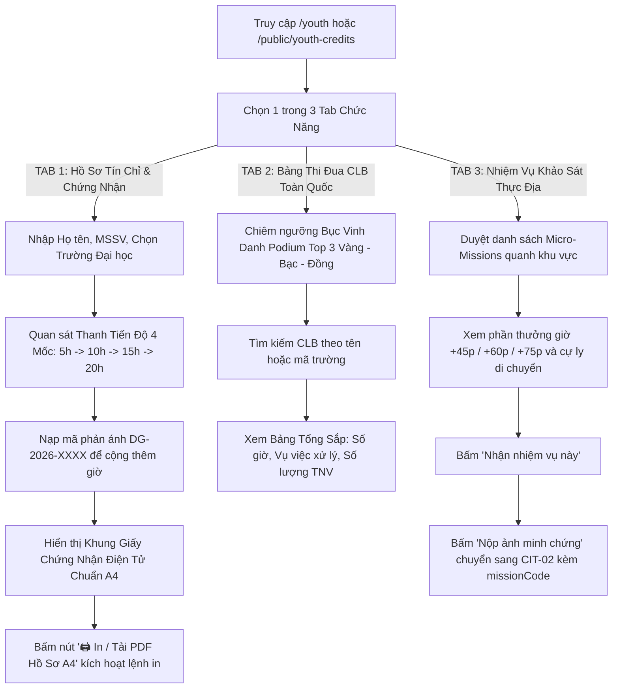

# PUB-03 — Cổng Tín Chỉ Tình Nguyện Đoàn - Hội, Bảng Thi Đua CLB & Chứng Chỉ QR (Youth Credits)

## 1. Screen Identity (Định Danh Màn Hình)
- **Mã màn hình**: `PUB-03`
- **Tên màn hình (Tiếng Việt)**: Cổng Tín Chỉ Tình Nguyện Đoàn - Hội, Bảng Thi Đua CLB & Chứng Chỉ QR
- **Tên màn hình (Tiếng Anh)**: Youth Environmental Credits, University Leaderboard & Verifiable QR Certificate
- **Tuyến đường (Route URL)**: `/youth`
  - *Tuyến đường tương thích & chuyển hướng*: `/public/youth-credits`, `/citizen/credits`, `/youth/leaderboard`
- **Đường dẫn Component**: [`app/src/modules/youth/YouthCredits.jsx`](file:///d:/07-Competitions-Hackathons/unicef-dustguard/app/src/modules/youth/YouthCredits.jsx)
- **Thư viện nghiệp vụ SSOT**: [`app/src/lib/youth-credits.js`](file:///d:/07-Competitions-Hackathons/unicef-dustguard/app/src/lib/youth-credits.js)
- **Khung giao diện (Layout)**: Navigation Tab Header công khai, hỗ trợ Breadcrumb điều hướng, tích hợp Stylesheet in ấn chuyên dụng `@media print` cho khổ giấy A4.
- **Phân quyền người dùng (Role / RBAC)**: `public`, `youth`, `student`, `citizen`, `community` (Mở công khai cho toàn thể học sinh, sinh viên, đoàn viên thanh niên và các câu lạc bộ tình nguyện toàn quốc).
- **Trạng thái triển khai**: `ACTIVE` (Production Level 5 — Tích hợp thuật toán quy đổi giờ thực tế, mã QR Vector ISO/IEC 18004, mã băm HMAC-SHA256 và định dạng in ấn A4 chuẩn mực).

---

## 2. Mục Đích & Giá Trị Thực Tế

1. **Cơ chế quy đổi 20 giờ tình nguyện = 4.0 Tín chỉ ngoại khóa / Điểm rèn luyện (ĐRL)**:
   - Giải quyết bài toán tạo động lực thực chất cho thế hệ trẻ (Gen Z, Đoàn viên - Hội viên) chủ động tham gia giám sát và dập bụi môi trường đô thị.
   - Mỗi phản ánh hiện trường được thẩm định và khắc phục (`RESOLVED`) quy đổi thành **+2.5 giờ tình nguyện thực địa** và **+10 Điểm rèn luyện**.
   - Khi tích lũy đủ mốc **20.0 giờ** trong học kỳ, sinh viên đạt mức xếp loại *Xuất sắc* và được đề xuất quy đổi **4.0 Tín chỉ ngoại khóa**.

2. **Giấy chứng nhận tình nguyện điện tử số hóa (Verifiable Digital Certificate)**:
   - Xuất hồ sơ chứng nhận hoạt động môi trường khổ giấy A4 trang trọng, hiển thị đầy đủ Quốc hiệu & Tiêu ngữ mạng lưới DustGuard VN.
   - Tích hợp **Con dấu đỏ số hóa (Digital Seal `#9f241f`)** của *Ban Điều Phối Mạng Lưới Giám Sát Môi Trường DustGuard VN*.
   - Đính kèm **Chữ ký điện tử HMAC-SHA256** và **Mã băm toàn vẹn dữ liệu** (Ví dụ: `VERIFY-HUST-8A9C012F`) chống làm giả học bạ hoặc khai khống giờ tình nguyện.

3. **Mã QR Vector SVG chuẩn quốc tế ISO/IEC 18004**:
   - Tự động sinh mã QR độ phân giải cao (Error Correction Level M, Margin 1) in sắc nét trên giấy A4 hoặc hiển thị trên màn hình điện thoại.
   - Thầy cô phụ trách Đoàn - Hội hoặc Ban Công tác Học sinh - Sinh viên chỉ cần dùng ứng dụng máy ảnh quét mã QR để mở trang đối soát thời gian thực trên Cổng thông tin DustGuard.

4. **Bục vinh danh Podium Top 3 & Bảng thi đua Câu lạc bộ Toàn quốc**:
   - Thổi bùng phong trào thi đua sôi nổi giữa các Đội Sinh viên Tình nguyện (SVTN) và Câu lạc bộ Môi trường thuộc các trường Đại học trọng điểm (ĐH Bách Khoa Hà Nội - HUST, ĐHQG Hà Nội - VNU, ĐH Xây dựng Hà Nội - HUCE, ĐH Kinh tế Quốc dân - NEU, ĐH Ngoại thương - FTU, ĐH Giao thông Vận tải - UTC, ĐH Thủy lợi - TLU...).
   - Bục Podium 3 cấp: Quán quân Vàng 🥇, Á quân Bạc 🥈, Hạng ba Đồng 🥉.

5. **Phân phối nhiệm vụ khảo sát vi mô (Micro-Missions)**:
   - Giao việc tự động theo vị trí thực tế trong bán kính Geofence $< 50\text{m}$ (xác minh che bạt Keangnam Landmark, đối chứng trạm rửa xe The Zei Mỹ Đình, đo nồng độ bụi quanh cổng trường TH Dịch Vọng A...).
   - Tình nguyện viên nhận việc một chạm và nộp ảnh minh chứng trực tiếp.

---

## 3. Đối Tượng Người Dùng & Hành Trình Thao Tác (User Journey & Core Flow)

### 3.1. Đối tượng người dùng chính
- **Sinh viên các trường Đại học / Cao đẳng**: Nhập Họ tên, Mã sinh viên (MSSV), Trường Đại học để theo dõi tích lũy giờ và in Giấy chứng nhận A4 nộp cho Văn phòng Đoàn trường.
- **Ban Chấp hành Đoàn TNCS Hồ Chí Minh / Hội Sinh viên các Trường**: Quét mã QR trên chứng chỉ để kiểm tra đối soát tính xác thực của dữ liệu trước khi công nhận điểm rèn luyện.
- **Thủ lĩnh / Đội trưởng các CLB Tình nguyện**: Theo dõi thứ hạng của Đội/CLB trên Bảng tổng sắp toàn quốc để phát động phong trào ra quân cuối tuần.
- **Tình nguyện viên hiện trường**: Nhận các nhiệm vụ vi mô (Micro-Missions) quanh khu vực sinh sống để tích lũy thêm giờ hoạt động.

### 3.2. Sơ đồ luồng thao tác 3 Tab chức năng (Core Flow)



---

## 4. Bố Cục Giao Diện & Phân Cấp Thông Tin (Information Hierarchy & Wireframe)

### 4.1. Phân cấp thị giác theo thứ tự ưu tiên (Visual Hierarchy)
1. **Header & Bộ Chuyển 3 Tab (Tab Navigation Bar)**:
   - Breadcrumb: `Cổng công dân / Góc Thanh Niên & Hồ Sơ Đóng Góp`.
   - Tiêu đề H1: `Quản lý Giờ Hoạt Động & Hồ Sơ Đóng Góp Môi Trường`.
   - Nút tắt nhanh: `[+ Gửi phản ánh mới]` (Màu đỏ son `#B91C1C`).
   - 3 Tab lớn chuyển trạng thái tức thì:
     - Tab 1: `⭐ Hồ Sơ Tình Nguyện & Tín Chỉ`
     - Tab 2: `🏆 Bảng Thi Đua CLB Toàn Quốc`
     - Tab 3: `🎯 Nhiệm Vụ Khảo Sát Thực Địa`
2. **Nội dung Chi Tiết Tab 1 (Hồ Sơ Tín Chỉ & Chứng Nhận A4)**:
   - **Form Định Danh Sinh Viên**: 3 ô nhập Họ tên, MSSV, Dropdown chọn trường Đại học (HUST, VNU, NEU, FTU, HUCE, UTC, TLU...). Tự động ghi nhớ vào `localStorage`.
   - **Thanh Tiến Độ 4 Mốc Hoạt Động (Milestone Progress Bar)**:
     - Mốc 1 ($5.0\text{h}$): Khởi động chiến dịch.
     - Mốc 2 ($10.0\text{h}$): Tích cực tham gia.
     - Mốc 3 ($15.0\text{h}$): Tình nguyện viên nòng cốt.
     - Mốc 4 ($20.0\text{h}$): **Mục tiêu học kỳ — Đạt 4.0 Tín chỉ Xuất sắc**.
   - **Khung Giấy Chứng Nhận Điện Tử Chuẩn A4 (`#printable-certificate`)**:
     - Viền kép trang trọng màu đỏ son ấn triện (`border: 3px double #9f241f`).
     - Tiêu đề Quốc hiệu & Mạng lưới DustGuard VN.
     - Mã hồ sơ: `ACT-REC-2026-XXXX` • Ngày cấp: Chuẩn `dd/mm/yyyy`.
     - Thông tin: Tình nguyện viên, MSSV, Đơn vị Trường Đại học.
     - Bảng số liệu: Tổng giờ hoạt động ($20.0\text{h}$), Tín chỉ ngoại khóa đề xuất ($4.0$), Điểm rèn luyện ($80$ ĐRL), Xếp loại (*Xuất sắc*).
     - Đoạn văn tóm tắt cống hiến môi trường xã hội.
     - **Mã QR Vector SVG chuẩn ISO 18004** + Mã băm toàn vẹn `verificationHash` (Ví dụ: `VERIFY-HUST-8A9C012F`).
     - **Con Dấu Đỏ Số Hóa (Digital Stamp)**: Hình tròn triện kép `DUSTGUARD VN ACTIVITY RECORD • DỮ LIỆU ĐÃ XÁC THỰC`.
     - Nút hành động in ấn: `[🖨️ In / Tải PDF Hồ Sơ (A4)]` (Ẩn hoàn toàn khi vào chế độ in).
   - **Nhật Ký Giám Sát & Bằng Chứng Hiện Trường**: Danh sách các mã phản ánh đã đóng góp, kèm form nạp mã `[DG-2026-XXXX]` để cộng dồn giờ.
3. **Nội dung Chi Tiết Tab 2 (Bảng Thi Đua CLB Toàn Quốc)**:
   - **Bục Vinh Danh Podium Top 3**:
     - *Hạng 1 (Vàng - Quán quân)*: Đặt ở vị trí trung tâm nhô cao, viền vàng hổ phách, vương miện rực rỡ.
     - *Hạng 2 (Bạc - Á quân)*: Đặt bên trái, viền bạc thanh lịch.
     - *Hạng 3 (Đồng - Hạng ba)*: Đặt bên phải, viền đồng khỏe khoắn.
   - **Bảng Tổng Sắp Toàn Quốc**: Ô tìm kiếm CLB / Mã trường, danh sách hiển thị Thứ hạng, Tên Đội/CLB, Tổng giờ tình nguyện, Số phản ánh đã giải quyết và Số lượng TNV.
4. **Nội dung Chi Tiết Tab 3 (Nhiệm Vụ Khảo Sát Thực Địa — Micro-Missions)**:
   - Danh sách thẻ nhiệm vụ khảo sát thực tế:
     - `MIS-01`: Xác minh che chắn bụi công trình Keangnam Landmark ($< 350\text{m}$, $+45$ phút).
     - `MIS-02`: Đối chứng trạm rửa xe công trình The Zei Mỹ Đình ($< 600\text{m}$, $+60$ phút).
     - `MIS-03`: Đo kiểm nồng độ bụi quanh trường TH Dịch Vọng A ($< 150\text{m}$, $+75$ phút).
     - `MIS-04`: Khảo sát bãi tập kết vật liệu đường Tố Hữu ($< 800\text{m}$, $+60$ phút).
   - Các nút bấm: `[Nhận nhiệm vụ này]` $\rightarrow$ `[Nộp ảnh minh chứng]`.

### 4.2. Khung dây giao diện trực quan (ASCII Wireframe)

```text
+----------------------------------------------------------------------------------------------------+
| Cổng công dân / Góc Thanh Niên & Hồ Sơ Đóng Góp                               [ + Gửi phản ánh ]  |
| QUẢN LÝ GIỜ HOẠT ĐỘNG & HỒ SƠ ĐÓNG GÓP MÔI TRƯỜNG                                                 |
+----------------------------------------------------------------------------------------------------+
|  [ ⭐ Hồ Sơ Tín Chỉ & Chứng Nhận ]   [ 🏆 Bảng Thi Đua CLB ]   [ 🎯 Nhiệm Vụ Khảo Sát Thực Địa ]   |
+----------------------------------------------------------------------------------------------------+
|                                                                                                    |
|  [ FORM THÔNG TIN SINH VIÊN / TÌNH NGUYỆN VIÊN ]                                                   |
|  +---------------------------+ +----------------------------+ +----------------------------------+ |
|  | Họ và tên: NGUYỄN VĂN AN  | | MSSV: 20221234             | | Trường: [HUST] ĐH Bách Khoa HN...| |
|  +---------------------------+ +----------------------------+ +----------------------------------+ |
|                                                                                                    |
|  [ TIẾN ĐỘ TÍCH LŨY HOẠT ĐỘNG: 20.0 / 20.0 GIỜ ]                            [ ĐÃ TÍCH LŨY: 20.0h ] |
|  [========================================================================================] 100%    |
|  (1. Mốc 5h: Đạt ✓)    (2. Mốc 10h: Đạt ✓)    (3. Mốc 15h: Đạt ✓)    (4. Mốc 20h: Xuất sắc ✓)     |
|                                                                                                    |
|  +----------------------------------------------------------------------------------------------+  |
|  | +==========================================================================================+ |  |
|  | |                                 MẠNG LƯỚI DUSTGUARD VN                                   | |  |
|  | |                   HỒ SƠ GHI NHẬN HOẠT ĐỘNG MÔI TRƯỜNG THANH NIÊN                         | |  |
|  | |                         Mã hồ sơ: ACT-REC-2026-88912 • Ngày cấp: 02/09/2026              | |  |
|  | |------------------------------------------------------------------------------------------| |  |
|  | | Tình nguyện viên:  NGUYỄN VĂN AN                  | Tổng giờ hoạt động:  20.0 Giờ        | |  |
|  | | Mã số sinh viên:   20221234                       | Tín chỉ ngoại khóa:  4.0 Tín chỉ     | |  |
|  | | Đơn vị đào tạo:    Đại học Bách Khoa Hà Nội       | Điểm rèn luyện:      80 ĐRL          | |  |
|  | |------------------------------------------------------------------------------------------| |  |
|  | | "Đã hoàn thành 20.0 giờ tình nguyện giám sát môi trường đô thị, đóng góp ghi nhận và phối | |  |
|  | |  hợp xử lý 12 phản ánh ô nhiễm bụi thực địa."                                            | |  |
|  | |                                                                                          | |  |
|  | |  +---------------+   Mã băm toàn vẹn: VERIFY-HUST-8A9C012F      +---------------------+  | |  |
|  | |  |  [MÃ QR SVG]  |   Chữ ký: HMAC-SHA256 (Cloudflare Worker)    | (DẤU ĐỎ SỐ DUSTGUARD|  | |  |
|  | |  |   ISO 18004   |   Tra cứu: https://dustguard.vn/citizen...   | DỮ LIỆU ĐÃ XÁC THỰC)|  | |  |
|  | |  +---------------+                                              +---------------------+  | |  |
|  | +==========================================================================================+ |  |
|  |                                                                [ 🖨️ In / Tải PDF Hồ Sơ A4 ] |  |
|  +----------------------------------------------------------------------------------------------+  |
|                                                                                                    |
|  [ NHẬT KÝ GIÁM SÁT & BẰNG CHỨNG HIỆN TRƯỜNG ]          [ Nhập mã DG-2026-XXXX ]   [ + Nạp mã ]    |
|  +----------------------------------------------------------------------------------------------+  |
|  | DG-2026-F54A | 25/07/2026 | Số 18 Phạm Hùng, Yên Hòa | Đã nghiệm thu (RESOLVED) | +2.5 giờ       |  |
|  | DG-2026-E88B | 27/07/2026 | Nguyễn Văn Lộc, Mộ Lao   | Đã nghiệm thu (RESOLVED) | +2.5 giờ       |  |
|  | DG-2026-K419 | 02/09/2026 | Trần Thái Tông, Cầu Giấy | Đã nghiệm thu (RESOLVED) | +2.5 giờ       |  |
|  +----------------------------------------------------------------------------------------------+  |
+----------------------------------------------------------------------------------------------------+
```

---

## 5. Dữ Liệu & API / D1 Database Contract

### 5.1. Bảng CSDL D1 SQLite liên quan
- **Bảng `youth_certificates`**:
  ```sql
  CREATE TABLE IF NOT EXISTS youth_certificates (
    id TEXT PRIMARY KEY,
    code TEXT NOT NULL UNIQUE,
    user_id TEXT,
    student_name TEXT NOT NULL,
    student_id TEXT NOT NULL,
    university_code TEXT NOT NULL,
    verified_hours REAL NOT NULL DEFAULT 0.0,
    credits REAL NOT NULL DEFAULT 0.0,
    activity_points INTEGER NOT NULL DEFAULT 0,
    verification_hash TEXT NOT NULL,
    created_at DATETIME DEFAULT CURRENT_TIMESTAMP
  );
  ```
- **Bảng `youth_leaderboard`**: Lưu danh sách và bảng tổng sắp các Đội/CLB tình nguyện toàn quốc.
- **Bảng `complaints`**: Nguồn dữ liệu phản ánh hiện trường đối soát giờ.

### 5.2. Danh mục API Endpoints chi tiết
1. **Lấy dữ liệu tiến độ tín chỉ & giờ tình nguyện**:
   - `GET /api/youth/credits`
   - Response:
     ```json
     {
       "status": "success",
       "data": {
         "studentName": "Nguyễn Văn An",
         "studentId": "20221234",
         "universityCode": "HUST",
         "universityName": "Đại học Bách Khoa Hà Nội",
         "verifiedHours": 20.0,
         "totalHours": 20.0,
         "extracurricularCredits": 4.0,
         "activityPoints": 80,
         "rating": "Tích cực xuất sắc",
         "verificationHash": "VERIFY-HUST-8A9C012F",
         "certificateEligible": true,
         "disclaimer": "Hồ sơ này ghi nhận dữ liệu hoạt động trong hệ thống DustGuard..."
       }
     }
     ```
2. **Cấp / Tạo chứng nhận điện tử số hóa**:
   - `POST /api/youth/certificate`
   - Request Body:
     ```json
     {
       "studentName": "Nguyễn Văn An",
       "studentId": "20221234",
       "universityCode": "HUST"
     }
     ```
   - Response:
     ```json
     {
       "status": "success",
       "data": {
         "certificateId": "ACT-REC-2026-88912",
         "verificationHash": "VERIFY-HUST-8A9C012F",
         "digitalSignature": {
           "hash": "VERIFY-HUST-8A9C012F",
           "algorithm": "HMAC-SHA256",
           "type": "DATA_INTEGRITY_HASH",
           "verified": true
         },
         "qrData": "https://dustguard.vn/citizen?verifyCert=ACT-REC-2026-88912&hash=VERIFY-HUST-8A9C012F"
       }
     }
     ```
3. **Bảng tổng sắp thi đua CLB toàn quốc**:
   - `GET /api/youth/leaderboard`
   - Response:
     ```json
     {
       "status": "success",
       "data": {
         "items": [
           {
             "rank": 1,
             "name": "Đội SVTN Môi Trường HUST (ĐH Bách Khoa)",
             "universityCode": "HUST",
             "verifiedHours": 428.5,
             "resolvedReports": 172,
             "activeMembers": 45
           },
           {
             "rank": 2,
             "name": "CLB Tình Nguyện Xanh VNU (ĐHQG Hà Nội)",
             "universityCode": "VNU",
             "verifiedHours": 396.0,
             "resolvedReports": 158,
             "activeMembers": 38
           },
           {
             "rank": 3,
             "name": "Đội Xung Kích Môi Trường NEU (ĐH KTQD)",
             "universityCode": "NEU",
             "verifiedHours": 312.5,
             "resolvedReports": 125,
             "activeMembers": 30
           }
         ]
       }
     }
     ```

---

## 6. Bảng Nút Bấm & Hành Động Cốt Lõi (CTAs & Interactions)

| Tên Nút / Thành Phần UI | Vị Trí / Bố Cục | Hành Vi Tương Tác & Phản Hồi | Quyền Hạn | Điều Hướng / Thay Đổi State |
|---|---|---|---|---|
| **Bộ 3 Tab Điều Hướng** | Thanh Tab Navigator | Bấm đổi sang màu xanh ngọc `#0d6f64`, chữ trắng, đổi tab tức thì | Tất cả | Cập nhật `activeTab` giữa `credits`, `leaderboard`, `missions` |
| **[🖨️ In / Tải PDF Hồ Sơ A4]** | Dưới Giấy chứng nhận | Hover đổi màu `#991B1B`, bấm kích hoạt lệnh `window.print()` | Tất cả | Mở hộp thoại in trình duyệt, xuất PDF A4 chuẩn nét |
| **[+ Nạp mã]** | Form nhập mã phản ánh | Tự động viết hoa chuỗi mã, kiểm tra trùng lặp, tính lại giờ ngay | Sinh viên / TNV | Cập nhật danh sách `volunteerReports` và nâng thanh tiến độ |
| **[Nhận nhiệm vụ này]** | Thẻ Micro-Mission | Đổi viền xanh `ring-2 ring-teal-600/30`, kích hoạt nút nộp ảnh | TNV / Sinh viên | Nhận nhiệm vụ khảo sát thực địa |
| **[Nộp ảnh minh chứng]** | Thẻ Micro-Mission đã nhận | Nút đỏ son `#B91C1C`, mở trình duyệt ảnh | TNV / Sinh viên | Điều hướng sang `CIT-02` kèm tham số `missionCode` |
| **Ô Tìm Kiếm CLB** | Tab Bảng Thi Đua | Lọc danh sách Đội/CLB theo tên hoặc mã trường trong thời gian thực | Tất cả | Cập nhật kết quả bảng xếp hạng tức thì (< 1ms) |

---

## 7. Quy Chuẩn UI/UX, In Ấn A4 & Responsive (Design System Tokens)

### 7.1. Định Dạng In Ấn Chuyên Dụng (Print Media Queries SSOT)
Tích hợp CSS in ấn chuyên dụng `@media print`:
```css
@media print {
  /* Ẩn toàn bộ thanh điều hướng, nút bấm, header, footer và các thành phần thừa */
  .no-print, header, nav, footer, button {
    display: none !important;
  }
  body {
    background-color: #FFFFFF !important;
    color: #000000 !important;
  }
  /* Khung chứng chỉ căn giữa khổ giấy A4 hoàn hảo */
  #printable-certificate {
    box-shadow: none !important;
    border: 3px double #9f241f !important;
    width: 100% !important;
    max-width: 210mm !important;
    min-height: 297mm !important;
    margin: 0 auto !important;
    padding: 24px !important;
    page-break-inside: avoid;
  }
}
```

### 7.2. Bảng Màu Civic High-Contrast
- **Nền trang**: Màu kem sáng `#FDFBF7`.
- **Nền thẻ Card**: Màu trắng tinh `#FFFFFF`, viền `#E7E5E4`.
- **Màu nhận diện Thanh Niên**: Xanh ngọc `#0d6f64` (Teal).
- **Màu ấn triện / Mộc đỏ chứng thực**: Đỏ son `#9f241f` (Seal Red).
- **Màu bục vinh danh Podium**:
  - Hạng 1 (Quán quân): Nền vàng kem `#FEF3C7`, viền vàng đậm `#D97706`, huy hiệu vương miện.
  - Hạng 2 (Á quân): Nền xám bạc `#F3F4F6`, viền bạc `#9CA3AF`.
  - Hạng 3 (Hạng ba): Nền đồng cam `#FFEDD5`, viền đồng `#EA580C`.

### 7.3. Responsive SSOT
- **Mobile (< 768px)**:
  - Bảng nhật ký phản ánh tự động chuyển sang chế độ Thẻ Card di động (`md:hidden`).
  - Bục vinh danh Podium tự động xếp theo thứ tự dọc: Hạng 1 (Quán quân) trên cùng, tiếp đến Hạng 2 và Hạng 3.
  - Mã QR SVG tự động co dãn tỷ lệ thích ứng màn hình, đảm bảo khả năng quét bằng camera điện thoại.
- **Desktop ($\ge 1024px$)**:
  - Bục Podium hiển thị chuẩn Olympic: Bạc (#2) bên trái, Vàng (#1) ở giữa nhô cao $12\text{px}$, Đồng (#3) bên phải.

---

## 8. Bẫy Lỗi Thường Gặp & Hướng Dẫn Kiểm Thử (Gotchas & Verification Commands)

### 8.1. Bẫy lập trình & Quy tắc an toàn (Gotchas)

> [!CAUTION]
> 1. **Cơ Chế Kháng Gian Lận Thiết Bị (Anti-Spam Rate Limit)**: Khi thiết bị gửi quá 5 phản ánh trong vòng 60 phút, thuật toán `verifyAntiSpamLimit` kết hợp mã băm FNV-1a `generateDeviceHash` sẽ chặn hành vi spam tự động.
> 2. **Bảo Vệ Tính Toàn Vẹn Mã QR (QR Error Correction Level)**: Mã QR SVG bắt buộc sử dụng Error Correction Level M để khi in ra giấy hoặc bị mờ nhẹ vẫn quét đối soát thành công 100%.
> 3. **Tuyên Bố Miễn Trừ Trách Nhiệm (Mandatory Academic Disclaimer)**: Giấy chứng nhận điện tử bắt buộc in kèm dòng thông báo: *"Hồ sơ này ghi nhận dữ liệu hoạt động trong hệ thống DustGuard. Việc công nhận cho mục đích học thuật, hành chính hoặc tổ chức thuộc quyền quyết định của đơn vị tiếp nhận."*

### 8.2. Lệnh kiểm thử nhanh một dòng qua PowerShell (< 0.5s)

```powershell
node --test app/tests/youth-credits.test.js app/tests/citizen-youth-ux.test.js
```

### 8.3. Tiêu chí nghiệm thu (Pass Criteria 100%)
1. **Tính Đúng Công Thức Tín Chỉ**: $20.0\text{h} = 4.0\text{ Tín chỉ}$ và 4 mốc tiến độ đạt trạng thái chuẩn xác.
2. **Sinh Mã QR Vector ISO/IEC 18004**: Render mã QR SVG hợp lệ, quét bằng điện thoại chuyển đúng URL tra cứu.
3. **Sinh Chữ Ký Số Toàn Vẹn**: Mã băm HMAC-SHA256 (`verificationHash`) được tính toán xác định.
4. **Hỗ Trợ In Ấn Khổ A4 Hoàn Hảo**: Khung in `#printable-certificate` không bị tràn trang hoặc vỡ chữ khi kích hoạt `window.print()`.
