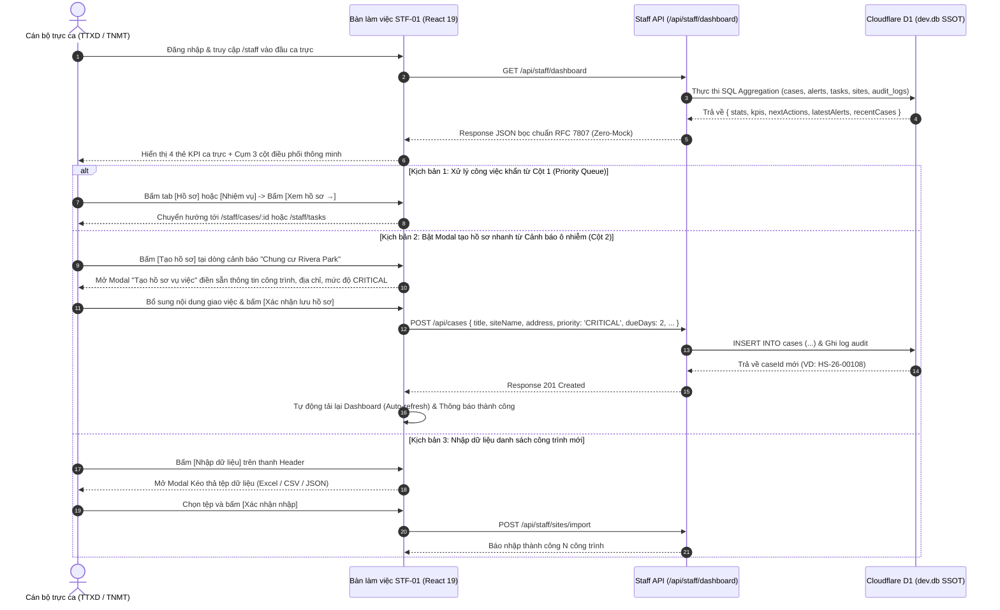

# STF-01 — Bàn Làm Việc Cán Bộ Thanh Tra & Điều Hành Ca Trực (Staff Operations Dashboard)

> **Tài liệu đặc tả màn hình chuẩn SSOT (Single Source of Truth) — DustGuard VN CivicTech Platform**  
> Trung tâm điều hành ca trực tác nghiệp hàng ngày của Cán bộ Đội Quản lý Trật tự Xây dựng & Đô thị Quận (TTXD) và Thanh tra Sở Tài nguyên & Môi trường (TN&MT): hợp nhất 4 chỉ số KPI ca trực động, cụm 3 cột điều phối thông minh (~42% Việc cần làm tiếp theo, ~30% Cảnh báo ô nhiễm mới từ trạm đo, ~28% Hồ sơ vụ việc gần đây), kết nối trực tiếp cơ sở dữ liệu Cloudflare D1 / SQLite `dev.db` chuẩn Zero-Mock.

---

## 1. Screen Identity

| Thuộc tính | Giá trị SSOT | Ghi chú kỹ thuật |
|---|---|---|
| **Mã màn hình** | `STF-01` | Mã định danh chuẩn trong hệ thống Design System & Product Spec |
| **Tên tiếng Việt** | Bàn làm việc cán bộ thanh tra & Điều hành ca trực | Nhãn hiển thị chính thức trên thanh điều hướng & tiêu đề ca trực |
| **Tên tiếng Anh** | Staff Operations & Shift Management Dashboard | Tên tiếng Anh đối ngoại, Audit Log & API Metadata |
| **Đường dẫn (Route)** | `/staff` | Canonical Route (Hỗ trợ alias redirect: `/staff/dashboard`, `/staff/operations`) |
| **Component Path** | [`app/src/apps/staff/pages/dashboard/StaffDashboardPage.jsx`](file:///d:/07-Competitions-Hackathons/unicef-dustguard/app/src/apps/staff/pages/dashboard/StaffDashboardPage.jsx) | React 19 Client Component tích hợp Tailwind CSS High-Contrast |
| **Backend Service** | [`app/server/services/staff-dashboard.service.js`](file:///d:/07-Competitions-Hackathons/unicef-dustguard/app/server/services/staff-dashboard.service.js) | Pure SQL Aggregation & Multi-table Joins trên Cloudflare D1 / SQLite |
| **API Client** | [`app/src/lib/api/staff-api.js`](file:///d:/07-Competitions-Hackathons/unicef-dustguard/app/src/lib/api/staff-api.js) | Hàm gọi chuẩn: `staffApi.getStaffDashboard()` |
| **Layout bọc** | [`app/src/apps/staff/layout/StaffLayout.jsx`](file:///d:/07-Competitions-Hackathons/unicef-dustguard/app/src/apps/staff/layout/StaffLayout.jsx) | Khung giao diện tác nghiệp Cán bộ, Sidebar 12 phân hệ nghiệp vụ |
| **Vai trò truy cập (Role)** | `staff`, `inspector`, `executive`, `admin` | Phân quyền RBAC qua `AuthContext` (Chặn `citizen`, `contractor`, `public`) |
| **Trạng thái thực thi** | **ACTIVE (Level 5 Production Coherent)** | Kết nối 100% CSDL D1 SQLite thật, cơ chế Zero-Mock, Auto-healing Schema |

---

## 2. Mục Đích & Nghiệp Vụ Thực Tế (Business Objectives & Context)

### 2.1. Bối cảnh nghiệp vụ ca trực quản lý trật tự xây dựng & môi trường đô thị
Trong công tác quản lý đô thị tại các đô thị lớn ở Việt Nam (Hà Nội, TP.HCM, Đà Nẵng...), tình trạng phát tán bụi mịn từ các đại công trường xây dựng, hoạt động đào móng ban đêm, xe chở phế thải không rửa lốp gây ô nhiễm nghiêm trọng khu dân cư xung quanh. 

Màn hình **Bàn làm việc cán bộ điều hành & tác nghiệp ca trực (STF-01)** là không gian làm việc số đầu tiên khi Cán bộ Đội QLTTXD Quận và Thanh tra Sở TN&MT đăng nhập vào hệ thống vào đầu mỗi ca trực (Ca sáng: 07:30 - 11:30, Ca chiều: 13:30 - 17:30, Ca đêm: 19:30 - 23:30). Màn hình giải quyết ngay 3 câu hỏi tác nghiệp sống còn trong 5 giây đầu tiên:
1. *Hiện tại toàn quận có bao nhiêu vụ việc khẩn cấp (`CRITICAL`), bao nhiêu điểm quan trắc vượt chuẩn QCVN 05:2023/BTNMT cần xử lý ngay?*
2. *Hàng đợi công việc ưu tiên (Priority Queue) của ca trực hôm nay gồm những hồ sơ/nhiệm vụ nào cần phân công hoặc xử lý trước khi chạm hạn SLA 48 giờ?*
3. *Hiện trạng các hồ sơ thanh tra 7 bước gần đây và diễn biến ô nhiễm trên địa bàn do cán bộ phụ trách đang ở bước nào?*

### 2.2. Đột phá nghiệp vụ & Thay thế cách làm cũ
| Khía cạnh tác nghiệp | Cách làm truyền thống (Sổ tay / Zalo / Báo cáo giấy) | DustGuard VN (STF-01 Dashboard SSOT) |
|---|---|---|
| **Tiếp nhận thông tin vi phạm** | Rời rạc qua nhiều nhóm Zalo, tin nhắn riêng, dễ trôi tin và bỏ quên sự cố khẩn. | Tự động tổng hợp thời gian thực từ cảm biến IoT và phản ánh cộng đồng vào 1 luồng duy nhất gắn với mã công trình (`siteId`). |
| **Phân loại mức độ ưu tiên** | Cảm tính theo người gọi điện hoặc báo chí đưa tin. | Tính điểm rủi ro tự động (**Dust Risk Score $0 - 100$**) dựa trên nồng độ PM2.5/PM10, độ nhạy cảm vị trí (trường học, bệnh viện) và lịch sử vi phạm. |
| **Kiểm soát thời hạn SLA** | Khó theo dõi hạn chót 48h theo quy định tiếp nhận xử lý phản ánh đô thị. | Đếm ngược SLA tự động, hiển thị phù hiệu đỏ cảnh báo hồ sơ cận hạn ($\le 12\text{h}$) hoặc quá hạn. |
| **Khởi tạo hồ sơ kiểm tra** | Soạn văn bản giấy, điền thông tin thủ công mất 30 - 60 phút. | **1-Click Tạo hồ sơ vụ việc nguyên tử**: Tự động điền thông tin công trình, vị trí, dữ liệu vi phạm, sẵn sàng phân công khảo sát hiện trường trong 3 giây. |

### 2.3. Cấu trúc 4 Thẻ KPI động & Cụm 3 cột điều phối thông minh
1. **4 Thẻ KPI động thời gian thực**:
   - `urgentCases` (Cần xử lý ngay): Tổng số hồ sơ mức độ `CRITICAL`/`URGENT` đang mở chưa được giải quyết hoặc có nguy cơ vi phạm thời hạn cam kết.
   - `newAlerts` (Cảnh báo mới): Số sự kiện nồng độ bụi vượt chuẩn QCVN 05:2023/BTNMT phát hiện tự động trong 24h qua đang chờ cán bộ xác minh.
   - `dueSoonCases` (Hồ sơ gần đến hạn): Số hồ sơ thanh tra có hạn xử lý trong vòng 3 ngày tới ($SLA \le 72\text{h}$).
   - `todayTasks` / `incompleteTodayTasks` (Nhiệm vụ hôm nay): Khối lượng nhiệm vụ khảo sát thực địa, kiểm tra biện pháp giảm bụi cần hoàn thành trong ngày.
2. **Cụm 3 cột tác nghiệp thông minh (Tỷ lệ Desktop: ~42% / ~30% / ~28%)**:
   - **Cột 1 (~42% chiều rộng — `xl:col-span-5`): Việc cần làm tiếp theo (Priority Queue)**: Hàng đợi công việc hợp nhất phân loại rõ Hồ sơ (`CASE`), Nhiệm vụ (`TASK`), Cảnh báo (`ALERT`), tích hợp 4 Tab chip lọc nhanh và nút mở trực tiếp tới nơi xử lý.
   - **Cột 2 (~30% chiều rộng — `xl:col-span-4`): Cảnh báo ô nhiễm mới nhất**: Luồng sự kiện trạm đo và tin báo vượt chuẩn, hiển thị rõ điểm số rủi ro Dust Risk, các thẻ lý do vi phạm (`Vượt ngưỡng QCVN 05:2023`, `Gần trường học`, `Thi công không bạt phủ`) và nút `[Tạo hồ sơ]` nhanh.
   - **Cột 3 (~28% chiều rộng — `xl:col-span-3`): Hồ sơ vụ việc gần đây**: Bảng theo dõi tiến độ các hồ sơ kiểm tra 7 bước State Machine DAG mới cập nhật, giúp cán bộ tiếp nối công việc liền mạch không gián đoạn.

---

## 3. Đối Tượng Người Dùng & Hành Trình Thao Tác (User Journey)

### 3.1. Đối tượng sử dụng chính
- **Cán bộ Đội Quản lý Trật tự Xây dựng & Đô thị Quận (Staff / Inspector)**: Trực ca tiếp nhận, xử lý cảnh báo, lên đường kiểm tra hiện trường, lập biên bản khảo sát 10 tiêu chuẩn che chắn bụi.
- **Tổ trưởng ca trực / Đội phó Đội QLTTXD**: Phân công nhiệm vụ cho các tổ cơ động, phê duyệt đề xuất xử phạt hoặc yêu cầu nhà thầu tạm đình chỉ thi công để khắc phục.
- **Thanh tra Sở Tài nguyên & Môi trường**: Giám sát mạng lưới quan trắc toàn thành phố, tra cứu chéo dữ liệu quan trắc và hồ sơ vi phạm phục vụ thanh tra đột xuất.

### 3.2. Sơ đồ hành trình ca trực (Shift Operations Flow)



---

## 4. Bố Cục Giao Diện & Wireframe ASCII Chi Tiết (Information Hierarchy)

### 4.1. Wireframe bố cục tổng thể chuẩn Desktop 14-Inch (1366x768 / 1440x900)

```text
+-----------------------------------------------------------------------------------------------------------------------+
| [HEADER BAR]                                                                                                          |
| Xin chào, Cán bộ Nguyễn Văn An — Đội QLTTXD Quận Thanh Xuân                [+ Tạo hồ sơ] (Đỏ son)  [Nhập dữ liệu] (Trắng) |
| Ca trực: 07:30 - 11:30 · Ngày 02/09/2026 · CSDL dev.db Cloudflare D1 SSOT                                            |
+-----------------------------------------------------------------------------------------------------------------------+
| [4 THẺ CHỈ SỐ KPI CA TRỰC ĐỘNG]                                                                                       |
| +-------------------------+ +-------------------------+ +-------------------------+ +-------------------------------+ |
| | 🔴 CẦN XỬ LÝ NGAY       | | 🟠 CẢNH BÁO MỚI         | | ⏳ HỒ SƠ GẦN ĐẾN HẠN    | | 📋 NHIỆM VỤ HÔM NAY           | |
| | {urgentCases}           | | {newAlerts}             | | {dueSoonCases}          | | {todayTasks}                  | |
| | Khẩn cấp / SLA < 12h    | | Vượt QCVN 05:2023 chờ xm| | Trong 3 ngày tới (SLA)  | | {incomplete} chưa hoàn thành  | |
| +-------------------------+ +-------------------------+ +-------------------------+ +-------------------------------+ |
+-----------------------------------------------------------------------------------------------------------------------+
| [CỤM 3 CỘT TÁC NGHIỆP THÔNG MINH] (Tỷ lệ Desktop: 5 cols ~41.6% | 4 cols ~33.3% | 3 cols ~25%)                        |
| +------------------------------------+ +----------------------------------+ +-----------------------------------------+ |
| | CỘT 1: VIỆC CẦN LÀM TIẾP (~42%)    | | CỘT 2: CẢNH BÁO MỚI NHẤT (~30%)  | | CỘT 3: HỒ SƠ GẦN ĐÂY (~28%)             | |
| | [Tất cả] [Hồ sơ] [Nhiệm vụ] [C.báo]| | Tiêu đề: Cảnh báo nồng độ bụi    | | Tiêu đề: Tiến độ hồ sơ thanh tra 7 bước | |
| | ---------------------------------- | | -------------------------------- | | --------------------------------------- | |
| | • [HỒ SƠ] (Đỏ)                     | | • Chung cư Rivera Park           | | • Tổ hợp Imperial Plaza                 | |
| |   Xử lý phát tán bụi mù tại Dự án  | |   Thanh Xuân, Hà Nội · 15p trước | |   Mã: HS-26-00101 · 10 phút trước       | |
| |   Imperial Plaza — Đào móng hở     | |   PM10: 185 µg/m³ (Vượt 150)     | |   Giai đoạn: Kiểm tra hiện trường (B4)  | |
| |   Hạn chót: 4 giờ trước (QUÁ HẠN)  | |   Tags: [VƯỢT QCVN] [GẦN TRƯỜNG] | |   Trạng thái: [ĐANG XỬ LÝ] (Teal)       | |
| |   [Xem hồ sơ →]                    | |   Điểm rủi ro: 88  [Tạo hồ sơ]   | |   [Mở hồ sơ]                            | |
| | ---------------------------------- | | -------------------------------- | | --------------------------------------- | |
| | • [NHIỆM VỤ] (Lam)                 | | • Cụm công trình Discovery Compl | | • Discovery Complex Cầu Giấy            | |
| |   Khảo sát biện pháp phun sương dập| |   Cầu Giấy, Hà Nội · 35p trước   | |   Mã: HS-26-00098 · 45 phút trước       | |
| |   bụi tại Discovery Complex        | |   PM2.5: 82 µg/m³ (Vượt 75)      | |   Giai đoạn: Chờ nhà thầu khắc phục (B3)| |
| |   Hạn: Hôm nay 16:00               | |   Tags: [VƯỢT QCVN 05:2023]      | |   Trạng thái: [CHỜ KHẮC PHỤC] (Cam)     | |
| |   [Xử lý nhiệm vụ →]               | |   Điểm rủi ro: 74  [Tạo hồ sơ]   | |   [Mở hồ sơ]                            | |
| | ---------------------------------- | | -------------------------------- | | --------------------------------------- | |
| | ➔ Xem tất cả 18 việc cần làm       | | ⓘ Quy chuẩn QCVN 05:2023/BTNMT   | | ➔ Quản lý toàn bộ 42 hồ sơ vụ việc      | |
| +------------------------------------+ +----------------------------------+ +-----------------------------------------+ |
+-----------------------------------------------------------------------------------------------------------------------+
| [MODALS / DIALOGS POPUPS KHI TƯƠNG TÁC]                                                                               |
| 1. Modal "Tạo hồ sơ vụ việc mới" (Form đầy đủ thông tin pháp lý công trình & cán bộ thụ lý)                          |
| 2. Modal "Nhập danh sách công trình" (Hỗ trợ kéo thả CSV / Excel danh mục công trình trên địa bàn)                   |
| 3. Modal "Phóng to ảnh minh chứng hiện trường vi phạm" (SafeImage chống vỡ liên kết)                                 |
+-----------------------------------------------------------------------------------------------------------------------+
```

### 4.2. Chi tiết phân cấp 3 cột tác nghiệp

#### Cột 1: Việc cần làm tiếp theo (`xl:col-span-5` ~ 41.6% chiều ngang)
- **Mục tiêu**: Đóng vai trò là Hàng đợi công việc thông minh (Smart Priority Queue), tự động gom và sắp xếp các đầu việc cần xử lý theo độ khẩn cấp và thời hạn cam kết.
- **Thanh Tab lọc nhanh**: Gồm 4 Tab chip bo góc mềm (`rounded-full`), có số đếm động: `Tất cả` (`ALL`), `Hồ sơ` (`CASE`), `Nhiệm vụ` (`TASK`), `Cảnh báo` (`ALERT`).
- **Nội dung từng thẻ việc**:
  - Huy hiệu phân loại thực thể: Badge đỏ son nền nhạt cho `[HỒ SƠ]`, badge xanh lam cho `[NHIỆM VỤ]`, badge hổ phách cho `[CẢNH BÁO]`.
  - Tiêu đề công việc: Tên hành động rõ ràng kèm tên công trình. **Nguyên tắc Zero Truncate**: Cho phép chữ tự xuống dòng (`break-words`), không cắt cụt tên công trình hay mã hiệu.
  - Thời hạn xử lý: Đổi màu chữ đỏ son đậm nếu đã quá hạn hoặc còn dưới 4 giờ.
  - Nút hành động nhanh: Nút `[Xem hồ sơ →]` hoặc `[Xử lý →]` điều hướng tức thì đến trang chi tiết.

#### Cột 2: Cảnh báo mới nhất (`xl:col-span-4` ~ 33.3% chiều ngang)
- **Mục tiêu**: Hiển thị dòng sự kiện nồng độ bụi ô nhiễm vượt ngưỡng vừa được trạm quan trắc ghi nhận hoặc công dân gửi về qua ứng dụng di động.
- **Nội dung từng thẻ cảnh báo**:
  - Tên công trình & Địa chỉ hành chính (Phường, Quận).
  - Thời gian ghi nhận tương đối tiếng Việt (`15 phút trước`, `1 giờ trước`).
  - Phù hiệu định lượng: Hiển thị chỉ số PM2.5 hoặc PM10 kèm đơn vị $\mu\text{g/m}^3$ và màu sắc tương ứng mức độ vi phạm.
  - Thẻ lý do định tính vi phạm (`reasons`): *Vượt ngưỡng QCVN 05:2023*, *Khu vực nhạy cảm gần trường học*, *Phản ánh nhiều lần trong tuần*.
  - Điểm số rủi ro **Dust Risk Score ($0 - 100$)** hiển thị số lớn in đậm kèm nút **`[Tạo hồ sơ]`** nhanh để kích hoạt quy trình thanh tra.

#### Cột 3: Hồ sơ gần đây (`xl:col-span-3` ~ 25.0% chiều ngang)
- **Mục tiêu**: Giúp cán bộ nắm bắt các hồ sơ kiểm tra đang thụ lý, tránh ngắt quãng quy trình nghiệp vụ khi đổi ca trực.
- **Nội dung từng thẻ hồ sơ**:
  - Tên công trình xây dựng (in đậm, tương phản cao).
  - Mã định danh hồ sơ nghiệp vụ chuẩn (VD: `HS-26-00101`).
  - Mốc thời gian cập nhật gần nhất và bước tác nghiệp hiện tại theo quy trình 7 bước DAG.
  - Phù hiệu trạng thái: Xanh lam (*Mới tạo*), Hổ phách (*Đang khảo sát*), Teal (*Chờ nhà thầu*), Xanh lá (*Đã nghiệm thu hoàn tất*).
  - Nút `[Mở hồ sơ]` điều hướng trực tiếp sang `/staff/cases/:id`.

---

## 5. Dữ Liệu & Hợp Đồng API / CSDL D1 (Data Contract)

### 5.1. API Endpoint chính của Bàn làm việc

```http
GET /api/staff/dashboard
Content-Type: application/json
Authorization: Bearer <token>
```

#### Hợp đồng dữ liệu JSON trả về chuẩn SSOT:
```json
{
  "status": "success",
  "data": {
    "stats": {
      "urgentCases": 3,
      "newAlerts": 5,
      "dueSoonCases": 2,
      "todayTasks": 7,
      "incompleteTodayTasks": 4
    },
    "kpis": {
      "urgentCases": 3,
      "newAlerts": 5,
      "nearDeadline": 2,
      "todayTasks": 7,
      "incompleteTodayTasks": 4
    },
    "nextActions": [
      {
        "id": "act-case-101",
        "type": "CASE",
        "typeLabel": "Hồ sơ",
        "typeColor": "red",
        "title": "Xử lý phát tán bụi mù tại Dự án Chung cư Imperial Plaza",
        "constructionName": "Chung cư Imperial Plaza",
        "siteName": "Chung cư Imperial Plaza",
        "priority": "CRITICAL",
        "status": "IN_PROGRESS",
        "deadline": "Hạn: 4 giờ trước (Quá hạn)",
        "actionLabel": "Xem hồ sơ",
        "href": "/staff/cases/case-101"
      },
      {
        "id": "act-task-204",
        "type": "TASK",
        "typeLabel": "Nhiệm vụ",
        "typeColor": "blue",
        "title": "Khảo sát thực địa hệ thống rửa lốp xe tải tại Discovery Complex",
        "constructionName": "Discovery Complex",
        "siteName": "Discovery Complex",
        "priority": "HIGH",
        "status": "PENDING",
        "deadline": "Hôm nay 16:00",
        "actionLabel": "Xử lý nhiệm vụ",
        "href": "/staff/tasks"
      }
    ],
    "latestAlerts": [
      {
        "id": "alert-801",
        "constructionName": "Tổ hợp Thương mại Rivera Park",
        "siteName": "Tổ hợp Thương mại Rivera Park",
        "location": "Vũ Trọng Phụng, Phường Thanh Xuân Trung, Quận Thanh Xuân, Hà Nội",
        "type": "Cảnh báo nồng độ bụi PM10 vượt 150 µg/m³",
        "severity": "CRITICAL",
        "riskScore": 88,
        "value": 185,
        "unit": "µg/m³",
        "time": "15 phút trước",
        "reasons": [
          { "label": "Vượt ngưỡng QCVN 05:2023", "color": "red" },
          { "label": "Gần Trường Tiểu học Phan Đình Giót", "color": "orange" }
        ],
        "href": "/staff/alerts"
      }
    ],
    "recentCases": [
      {
        "id": "case-101",
        "code": "HS-26-00101",
        "title": "Kiểm tra xử lý bụi thi công giai đoạn đào hầm móng",
        "constructionName": "Chung cư Imperial Plaza",
        "status": "Đang xử lý",
        "statusType": "teal",
        "statusColor": "teal",
        "priority": "HIGH",
        "currentStep": "Khảo sát hiện trường",
        "updatedAt": "10 phút trước",
        "href": "/staff/cases/case-101"
      }
    ]
  },
  "message": "Dữ liệu bảng điều hành tác nghiệp ca trực"
}
```

### 5.2. API Khởi tạo hồ sơ vụ việc nhanh từ Dashboard

```http
POST /api/cases
Content-Type: application/json
Authorization: Bearer <token>

{
  "title": "Xử lý cảnh báo rủi ro bụi tại Tổ hợp Thương mại Rivera Park",
  "siteName": "Tổ hợp Thương mại Rivera Park",
  "address": "Vũ Trọng Phụng, Thanh Xuân, Hà Nội",
  "priority": "CRITICAL",
  "assignedTo": "Nguyễn Văn An",
  "dueAt": "2026-09-04T12:00:00.000Z",
  "description": "Cảnh báo rủi ro bụi 88/100. Nồng độ PM10: 185 µg/m³. Vượt ngưỡng QCVN 05:2023/BTNMT."
}
```

### 5.3. Các bảng CSDL Cloudflare D1 / SQLite tham gia truy vấn (SSOT Schema)
1. **`cases`**: Lưu trữ hồ sơ thanh tra (`id`, `code`, `title`, `description`, `status`, `priority`, `severity`, `slaDeadline`, `assignedTo`, `siteId`, `createdAt`, `updatedAt`).
2. **`alerts`**: Lưu trữ sự kiện cảnh báo từ trạm đo & tin báo (`id`, `title`, `severity`, `status`, `pm25Value`, `pm10Value`, `priorityReasons`, `evidenceUrls`, `siteId`, `caseId`, `triggeredAt`).
3. **`tasks`**: Lưu danh sách nhiệm vụ tác nghiệp hiện trường (`id`, `code`, `title`, `priority`, `status`, `due_at`, `site_id`, `case_id`, `assigned_to`).
4. **`sites`**: Danh mục công trình xây dựng trên địa bàn (`id`, `name`, `address`, `ward`, `dustRiskScore`, `contractorName`, `latitude`, `longitude`).
5. **`audit_logs`**: Nhật ký kiểm toán mọi thao tác của cán bộ ca trực phục vụ thanh tra công vụ.

---

## 6. Bảng Nút Bấm & CTAs (Actions & Interactions)

| Tên nút / Hành động | Vị trí giao diện | Trạng thái & Phản hồi | Quyền hạn |
|---|---|---|:---:|
| **`[+ Tạo hồ sơ]`** | Header (Góc phải trên) | Mở Modal Tạo hồ sơ vụ việc mới. Nút màu đỏ son `#B91C1C`, chữ trắng, hover `#991B1B`. | `staff`, `admin` |
| **`[Nhập dữ liệu]`** | Header (Cạnh nút Tạo hồ sơ) | Mở Modal Kéo thả tệp CSV / Excel nhập danh mục công trình trên địa bàn. | `staff`, `admin` |
| **`[Lọc việc cần làm]`** | 4 Tab chip tại Cột 1 | Lọc tức thì danh sách trong bộ nhớ client (`ALL`, `CASE`, `TASK`, `ALERT`), đổi màu active chip. | Tất cả cán bộ |
| **`[Xem hồ sơ →]`** | Thẻ việc loại Hồ sơ (Cột 1) | Điều hướng trực tiếp sang màn hình chi tiết hồ sơ `/staff/cases/:id`. | Tất cả cán bộ |
| **`[Xử lý nhiệm vụ →]`** | Thẻ việc loại Nhiệm vụ (Cột 1) | Điều hướng trực tiếp sang màn hình quản lý nhiệm vụ `/staff/tasks`. | Tất cả cán bộ |
| **`[Tạo hồ sơ]`** (Nhanh) | Thẻ cảnh báo (Cột 2) | Mở Modal tạo hồ sơ, tự động điền sẵn tên công trình, mức độ rủi ro, thông số vi phạm. | `staff`, `admin` |
| **`[Mở hồ sơ]`** | Thẻ hồ sơ gần đây (Cột 3) | Điều hướng trực tiếp sang `/staff/cases/:id` để tiếp tục xử lý các bước tiếp theo. | Tất cả cán bộ |
| **`[Xem toàn bộ việc cần làm]`** | Chân Cột 1 | Điều hướng đến danh sách tổng hợp công việc ca trực. | Tất cả cán bộ |
| **`[Quản lý toàn bộ hồ sơ]`** | Chân Cột 3 | Điều hướng đến màn hình STF-04 (`/staff/cases`). | Tất cả cán bộ |

---

## 7. Quy Chuẩn UI/UX & Responsive 14-Inch Desktop & Mobile SSOT

### 7.1. Bảng màu Civic High-Contrast (Tuyệt đối không dùng Glassmorphism)
- **Nền trang chính**: `#FAFAF9` (Stone-50 — Màu kem sáng chuyên dụng cho Civic Tech, chống mỏi mắt khi trực ca dài).
- **Nền Card / Container**: `#FFFFFF` nguyên khối, viền `#E7E5E4` (Stone-200), bóng mờ tối giản `shadow-2xs`.
- **Màu văn bản chính**: `#1C1917` (Stone-900 — Đen mực in đậm, độ tương phản WCAG AAA $\ge 7:1$).
- **Màu cảnh báo & Nút chính**: `#B91C1C` (Red-700 — Đỏ son Seal Red truyền thống).
- **Màu trạng thái nghiệp vụ**:
  - *Khẩn cấp / Quá hạn*: Nền `#FEF2F2`, chữ `#B91C1C`, viền `#FECACA`.
  - *Cảnh báo / Gần hạn*: Nền `#FFF7ED`, chữ `#EA580C`, viền `#FED7AA`.
  - *Đang xử lý / Khảo sát*: Nền `#F0FDFA`, chữ `#0D9488`, viền `#99F6E4`.
  - *Hoàn tất / Đã nghiệm thu*: Nền `#F0FDF4`, chữ `#16A34A`, viền `#BBF7D0`.

### 7.2. Tối ưu hiển thị đa màn hình (Responsive SSOT)
- **Màn hình Laptop 14-inch (1366x768, 1440x900, 1536x864 scale 125%)**:
  - Cụm 3 cột tác nghiệp dàn trải mượt mà trên lưới 12 cột (`xl:grid-cols-12` với tỷ lệ 5 / 4 / 3).
  - Tiêu đề Header và cụm nút thao tác không bị ngắt dòng (Zero Menu Wrap), các nhãn nút dùng `whitespace-nowrap`.
  - Không xuất hiện thanh cuộn ngang toàn trang (Zero Horizontal Scroll).
- **Màn hình Tablet (768px - 1024px)**:
  - 4 Thẻ KPI ca trực tự động chuyển sang lưới 2x2.
  - Cụm 3 cột tác nghiệp chuyển thành bố cục xếp chồng dọc có khoảng cách `gap-6`.
- **Màn hình Di động (360px - 430px)**:
  - 4 Thẻ KPI xếp 1 cột dọc hoặc vuốt trượt ngang.
  - Cụm nút Header tự động giãn 100% chiều ngang (`w-full`).
  - Vùng chạm tối thiểu (Touch Targets) toàn bộ nút và thẻ $\ge 44\text{px}$.

---

## 8. Bẫy Lỗi Thường Gặp & Hướng Dẫn Kiểm Thử (QA Checklist)

### 8.1. Các bẫy lỗi tiềm ẩn & Cơ chế phòng ngừa
1. **Lỗi Null / Undefined KPI counts khi CSDL mới khởi tạo**: Khi cơ sở dữ liệu D1 chưa có dữ liệu ban đầu, các trường đếm trả về `null`.
   - *Khắc phục*: Trong `staff-dashboard.service.js` và `StaffDashboardPage.jsx`, luôn dùng toán tử Nullish Coalescing: `res.stats.urgentCases ?? 0`.
2. **Lỗi phân tích JSON trường `priorityReasons` / `evidenceUrls`**: Dữ liệu từ cảm biến gửi về có thể chứa chuỗi JSON bị lỗi cú pháp.
   - *Khắc phục*: Luôn bọc trong khối `try/catch` an toàn, fallback về mảng rỗng `[]` để giao diện không bị sập trắng trang.
3. **Lỗi lệch múi giờ đếm ngược hạn xử lý SLA**: Giờ máy chủ UTC và giờ ca trực Việt Nam (GMT+7) có thể gây tính sai thời hạn 48h.
   - *Khắc phục*: Chuẩn hóa múi giờ qua hàm `formatViTime()` hiển thị rõ số giờ còn lại hoặc số giờ đã quá hạn.
4. **Lỗi trùng lặp hồ sơ khi tạo từ Cảnh báo**: Cán bộ bấm liên tiếp vào nút `[Tạo hồ sơ]`.
   - *Khắc phục*: Vô hiệu hóa nút khi đang gửi yêu cầu (`disabled={submittingCase}`) và cơ chế kiểm tra `caseId IS NOT NULL` ở backend.

### 8.2. Bộ lệnh kiểm thử nhanh (< 0.5s)

```powershell
# 1. Kiểm thử trọn vẹn logic Dashboard Priority Queue & SSOT Contract
node --test app/tests/staff-dashboard-priority-queue-ssot.test.js

# 2. Kiểm thử truy vấn CSDL dev.db thực tế
node --test app/tests/staff-dashboard-real-devdb.test.js

# 3. Kiểm thử Design System Tokens và Responsive không vỡ layout
node --test app/tests/design-system-tokens.test.js

# 4. Kiểm tra toàn diện Level 3 Quick Gate
npm --prefix app run verify:quick
```
