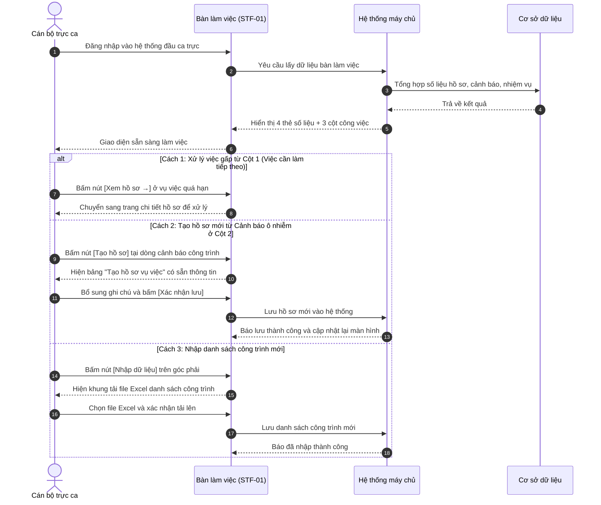

# STF-01 — Bàn Làm Việc Cán Bộ Trực Ca (Staff Operations Dashboard)

> **Tài liệu hướng dẫn & đặc tả màn hình — Hệ thống Quản trị Bụi Đô thị DustGuard VN**  
> Bàn làm việc số đầu ca trực dành cho Cán bộ Đội Quản lý Trật tự Xây dựng & Đô thị và Cán bộ Môi trường: tổng hợp nhanh 4 chỉ số công việc trong ngày, chia 3 cột việc cần xử lý gấp, xem cảnh báo khói bụi từ các trạm đo và theo dõi các hồ sơ kiểm tra đang diễn ra.

---

## 1. Thông Tin Chung Về Màn Hình

| Thuộc tính | Thông tin chi tiết | Ghi chú |
|---|---|---|
| **Mã màn hình** | `STF-01` | Mã định danh màn hình trong hệ thống |
| **Tên màn hình** | Bàn làm việc cán bộ trực ca | Tên hiển thị trên thanh menu chính |
| **Tên tiếng Anh** | Staff Operations Dashboard | Tên hiển thị giao diện tiếng Anh |
| **Đường dẫn (URL)** | `/staff` | Địa chỉ truy cập chính (hỗ trợ cả `/staff/dashboard`) |
| **File giao diện** | [`app/src/apps/staff/pages/dashboard/StaffDashboardPage.jsx`](file:///d:/07-Competitions-Hackathons/unicef-dustguard/app/src/apps/staff/pages/dashboard/StaffDashboardPage.jsx) | Mã nguồn trang giao diện React |
| **File xử lý dữ liệu** | [`app/server/services/staff-dashboard.service.js`](file:///d:/07-Competitions-Hackathons/unicef-dustguard/app/server/services/staff-dashboard.service.js) | File tổng hợp dữ liệu từ hệ thống |
| **Hàm gọi dữ liệu** | [`app/src/lib/api/staff-api.js`](file:///d:/07-Competitions-Hackathons/unicef-dustguard/app/src/lib/api/staff-api.js) | Lệnh gọi: `staffApi.getStaffDashboard()` |
| **Khung bố cục** | [`app/src/apps/staff/layout/StaffLayout.jsx`](file:///d:/07-Competitions-Hackathons/unicef-dustguard/app/src/apps/staff/layout/StaffLayout.jsx) | Khung giao diện cán bộ có thanh menu bên trái |
| **Ai được sử dụng** | Cán bộ trực ca, Thanh tra viên, Lãnh đạo đội, Quản trị viên | Người dân và nhà thầu không vào được màn hình này |

---

## 2. Mục Đích & Tình Huống Sử Dụng Thực Tế

### 2.1. Cán bộ dùng màn hình này khi nào?
Khi bắt đầu một ca trực (Ca sáng 07:30 - 11:30, Ca chiều 13:30 - 17:30, Ca đêm 19:30 - 23:30), cán bộ mở máy tính hoặc máy tính bảng lên, đăng nhập vào hệ thống và nhìn ngay vào màn hình này để trả lời 3 câu hỏi nhanh trong 5 giây đầu tiên:
1. **Hôm nay có vụ việc nào khẩn cấp cần đi kiểm tra ngay không?** (Xe chở đất làm rơi vãi, công trình đào móng bụi mù, trạm đo báo ô nhiễm đỏ).
2. **Những hồ sơ nào sắp hết hạn xử lý 48 giờ?** (Cần nhắc nhở nhà thầu hoặc phân công người xuống lập biên bản gấp).
3. **Tiến độ các hồ sơ kiểm tra tuần này đang ra sao?** (Hồ sơ nào đang chờ nhà thầu sửa chữa, hồ sơ nào đã xong chuẩn bị nghiệm thu).

### 2.2. So sánh cách làm cũ và cách làm mới trên phần mềm

| Công việc | Cách làm cũ (Sổ tay, Zalo, Giấy tờ) | Cách làm mới trên DustGuard VN |
|---|---|---|
| **Nhận tin báo vi phạm** | Tin nhắn trôi trong các nhóm Zalo, dễ bỏ sót phản ánh của người dân lúc nửa đêm. | Tự động gom toàn bộ tin báo và dữ liệu trạm đo về một danh sách duy nhất, gắn đúng tên công trình. |
| **Biết việc nào làm trước** | Làm theo cảm tính hoặc ai gọi giục thì làm trước. | Tự động chấm điểm mức độ rủi ro (0 - 100 điểm) để đưa vụ việc ô nhiễm nặng lên đầu danh sách. |
| **Theo dõi hạn 48 giờ** | Ghi sổ tay, rất dễ quên và trễ hạn theo quy chế một cửa. | Đồng hồ đếm ngược tự động, đổi màu đỏ nhắc nhở khi còn dưới 12 giờ hoặc đã quá hạn. |
| **Lập hồ sơ kiểm tra** | Đánh máy văn bản giấy mất 30 - 45 phút. | Bấm 1 nút **[Tạo hồ sơ]**, hệ thống tự điền sẵn tên công trình, địa chỉ và thông số ô nhiễm trong 3 giây. |

---

## 3. Đối Tượng Sử Dụng & Luồng Làm Việc Thực Tế

### 3.1. Ai sử dụng màn hình này?
- **Cán bộ trực ca / Thanh tra viên**: Xem danh sách việc cần làm, nhận cảnh báo ô nhiễm mới để lên đường kiểm tra hiện trường, lập biên bản.
- **Tổ trưởng ca trực / Đội phó**: Xem tổng quan khối lượng công việc toàn đội, giao việc cho từng cán bộ, duyệt đề xuất xử phạt.
- **Lãnh đạo cơ quan**: Nắm bắt nhanh tình hình môi trường toàn quận/huyện trong ngày.

### 3.2. Luồng thao tác đầu ca trực của cán bộ



---

## 4. Bố Cục Giao Diện & Khung Hình Trực Quan (Wireframe)

### 4.1. Khung hình trực quan trên màn hình máy tính

```text
+-----------------------------------------------------------------------------------------------------------------------+
| [THANH TIÊU ĐỀ ĐẦU TRANG]                                                                                             |
| Xin chào, Cán bộ Nguyễn Văn An — Đội QLTTXD & Đô thị Quận Thanh Xuân        [+ Tạo hồ sơ] (Đỏ son)  [Nhập dữ liệu] (Trắng)|
| Ca trực: 07:30 - 11:30 · Ngày 02/09/2026 · Hệ thống hoạt động bình thường                                              |
+-----------------------------------------------------------------------------------------------------------------------+
| [4 THẺ CHỈ SỐ CÔNG VIỆC TRONG NGÀY]                                                                                   |
| +-------------------------+ +-------------------------+ +-------------------------+ +-------------------------------+ |
| | 🔴 CẦN XỬ LÝ NGAY       | | 🟠 CẢNH BÁO MỚI         | | ⏳ HỒ SƠ GẦN ĐẾN HẠN    | | 📋 NHIỆM VỤ HÔM NAY           | |
| | 3 việc                  | | 5 cảnh báo              | | 2 hồ sơ                 | | 7 nhiệm vụ                    | |
| | Khẩn cấp hoặc quá hạn   | | Bụi vượt chuẩn chờ xử lý| | Hạn chót trong 3 ngày   | | 4 việc chưa hoàn thành        | |
| +-------------------------+ +-------------------------+ +-------------------------+ +-------------------------------+ |
+-----------------------------------------------------------------------------------------------------------------------+
| [CỤM 3 CỘT CÔNG VIỆC CHÍNH]                                                                                           |
| +------------------------------------+ +----------------------------------+ +-----------------------------------------+ |
| | CỘT 1: VIỆC CẦN LÀM TIẾP (~42%)    | | CỘT 2: CẢNH BÁO MỚI NHẤT (~30%)  | | CỘT 3: HỒ SƠ GẦN ĐÂY (~28%)             | |
| | [Tất cả] [Hồ sơ] [Nhiệm vụ] [C.báo]| | Nồng độ bụi vượt chuẩn mới nhận  | | Tiến độ các hồ sơ kiểm tra gần đây    | |
| | ---------------------------------- | | -------------------------------- | | --------------------------------------- | |
| | • [HỒ SƠ] (Thẻ đỏ)                 | | • Chung cư Rivera Park           | | • Tổ hợp Imperial Plaza                 | |
| |   Xử lý phát tán bụi tại Dự án     | |   Vũ Trọng Phụng · 15 phút trước | |   Mã: HS-26-00101 · 10 phút trước       | |
| |   Imperial Plaza — Đào móng hở     | |   Bụi PM10: 185 (Chuẩn: 150)     | |   Bước: Kiểm tra hiện trường            | |
| |   Hạn chót: Quá hạn 4 giờ          | |   Lý do: [Vượt chuẩn] [Gần trường| |   Trạng thái: [ĐANG XỬ LÝ] (Xanh ngọc)  | |
| |   [Xem hồ sơ →]                    | |   Điểm rủi ro: 88  [Tạo hồ sơ]   | |   [Mở hồ sơ]                            | |
| | ---------------------------------- | | -------------------------------- | | --------------------------------------- | |
| | • [NHIỆM VỤ] (Thẻ lam)             | | • Discovery Complex              | | • Discovery Complex Cầu Giấy            | |
| |   Khảo sát giàn phun sương dập     | |   Cầu Giấy · 35 phút trước       | |   Mã: HS-26-00098 · 45 phút trước       | |
| |   bụi tại Discovery Complex        | |   Bụi PM2.5: 82 (Chuẩn: 75)      | |   Bước: Chờ nhà thầu khắc phục          | |
| |   Hạn: Hôm nay 16:00               | |   Lý do: [Vượt chuẩn bụi mịn]    | |   Trạng thái: [CHỜ KHẮC PHỤC] (Cam)     | |
| |   [Xử lý nhiệm vụ →]               | |   Điểm rủi ro: 74  [Tạo hồ sơ]   | |   [Mở hồ sơ]                            | |
| | ---------------------------------- | | -------------------------------- | | --------------------------------------- | |
| | ➔ Xem tất cả 18 việc cần làm       | | ⓘ Quy chuẩn bụi QCVN 05:2023     | | ➔ Xem toàn bộ 42 hồ sơ                  | |
| +------------------------------------+ +----------------------------------+ +-----------------------------------------+ |
+-----------------------------------------------------------------------------------------------------------------------+
| [CÁC KHUNG HỘP THOẠI KHI BẤM NÚT]                                                                                     |
| 1. Khung "Tạo hồ sơ vụ việc mới" (Điền tên công trình, địa chỉ, người phụ trách, hạn xử lý).                          |
| 2. Khung "Nhập danh sách công trình" (Kéo thả file Excel danh sách các công trường trên địa bàn).                     |
| 3. Khung "Xem ảnh vi phạm" (Mở to ảnh chụp hiện trường để đối chiếu).                                                 |
+-----------------------------------------------------------------------------------------------------------------------+
```

### 4.2. Chi tiết 3 cột công việc
- **Cột 1 — Việc cần làm tiếp theo (Chiếm phần lớn không gian bên trái)**:
  - Tự động gom tất cả đầu việc gấp cần giải quyết, xếp việc quá hạn lên trên cùng.
  - Có 4 nút lọc nhanh: *Tất cả*, *Hồ sơ*, *Nhiệm vụ*, *Cảnh báo*.
  - Tên công trình luôn hiển thị đầy đủ, tự xuống dòng rõ ràng, không bị che mất chữ.
- **Cột 2 — Cảnh báo mới nhất (Cột ở giữa)**:
  - Nhận ngay các thông báo khi trạm đo ghi nhận bụi vượt mức cho phép hoặc dân gửi phản ánh.
  - Hiển thị rõ chỉ số bụi PM2.5 / PM10, địa chỉ và lý do cảnh báo (Gần trường học, công trình không che bạt).
  - Có sẵn nút **[Tạo hồ sơ]** để lập biên bản kiểm tra nhanh.
- **Cột 3 — Hồ sơ gần đây (Cột bên phải)**:
  - Giúp cán bộ nắm nhanh tiến độ các vụ việc đang thụ lý (đang khảo sát, chờ nhà thầu sửa chữa hay đã hoàn tất).

---

## 5. Dữ Liệu & Liên Kết Hệ Thống

### 5.1. Các thông tin chính hệ thống tự động tổng hợp
- **Số liệu thống kê 4 thẻ đầu trang**: Số việc khẩn cấp, số cảnh báo mới trong 24 giờ, số hồ sơ sắp đến hạn 48 giờ, số nhiệm vụ cần làm trong ngày.
- **Danh sách việc ưu tiên**: Gồm mã việc, tên công trình, loại việc (hồ sơ/nhiệm vụ), mức độ gấp và đường dẫn mở thẳng trang xử lý.
- **Danh sách cảnh báo ô nhiễm**: Tên công trình, địa chỉ, chỉ số bụi thực đo, điểm rủi ro (0-100) và các thẻ lý do vi phạm.
- **Danh sách hồ sơ gần đây**: Mã hồ sơ (VD: `HS-26-00101`), tên dự án, bước đang làm và màu sắc trạng thái.

### 5.2. Mẫu dữ liệu hệ thống trao đổi (Dạng đơn giản)
```json
{
  "stats": {
    "urgentCases": 3,
    "newAlerts": 5,
    "dueSoonCases": 2,
    "todayTasks": 7,
    "incompleteTodayTasks": 4
  },
  "nextActions": [
    {
      "id": "act-case-101",
      "type": "Hồ sơ",
      "title": "Xử lý phát tán bụi tại Dự án Chung cư Imperial Plaza",
      "siteName": "Chung cư Imperial Plaza",
      "deadline": "Quá hạn 4 giờ",
      "href": "/staff/cases/case-101"
    }
  ],
  "latestAlerts": [
    {
      "id": "alert-801",
      "siteName": "Chung cư Rivera Park",
      "location": "Vũ Trọng Phụng, Thanh Xuân, Hà Nội",
      "riskScore": 88,
      "value": 185,
      "unit": "µg/m³",
      "time": "15 phút trước"
    }
  ]
}
```

---

## 6. Bảng Nút Bấm & Thao Tác Chi Tiết

| Nút bấm / Thao tác | Vị trí | Hành động khi bấm | Ai được bấm |
|---|---|---|:---:|
| **`[+ Tạo hồ sơ]`** | Góc trên bên phải | Mở bảng tạo hồ sơ kiểm tra mới. Nút màu đỏ son nổi bật. | Cán bộ, Quản trị viên |
| **`[Nhập dữ liệu]`** | Cạnh nút Tạo hồ sơ | Mở khung kéo thả file Excel để nạp danh sách công trình vào hệ thống. | Cán bộ, Quản trị viên |
| **`[Tab lọc]`** (*Tất cả, Hồ sơ, Nhiệm vụ, Cảnh báo*) | Đầu Cột 1 | Lọc danh sách việc cần làm theo đúng loại mong muốn ngay lập tức. | Tất cả cán bộ |
| **`[Xem hồ sơ →]`** | Trên từng thẻ hồ sơ (Cột 1) | Mở thẳng trang chi tiết hồ sơ vụ việc để xem và ghi nhận kết quả. | Tất cả cán bộ |
| **`[Xử lý nhiệm vụ →]`** | Trên từng thẻ nhiệm vụ (Cột 1) | Mở trang quản lý nhiệm vụ để đánh dấu hoàn thành hoặc đổi hạn. | Tất cả cán bộ |
| **`[Tạo hồ sơ]`** (Nhanh) | Trên từng cảnh báo (Cột 2) | Mở bảng tạo hồ sơ, tự điền sẵn tên công trình và thông số bụi vi phạm. | Cán bộ, Quản trị viên |
| **`[Mở hồ sơ]`** | Trên từng hồ sơ (Cột 3) | Mở nhanh hồ sơ vụ việc để theo dõi tiếp các bước tiếp theo. | Tất cả cán bộ |
| **`[Xem toàn bộ việc cần làm]`** | Cuối Cột 1 | Mở danh sách đầy đủ tất cả công việc của ca trực. | Tất cả cán bộ |
| **`[Quản lý toàn bộ hồ sơ]`** | Cuối Cột 3 | Mở trang Danh sách hồ sơ vụ việc (`/staff/cases`). | Tất cả cán bộ |

---

## 7. Quy Chuẩn Giao Diện Sáng Màu & Dễ Nhìn

### 7.1. Màu sắc rõ ràng, không mỏi mắt khi trực ca dài
- **Màu nền trang**: Màu kem sáng nhạt dịu mắt (`#FAFAF9`), không gây lóa khi nhìn màn hình lâu.
- **Màu nền khung thẻ**: Màu trắng tinh (`#FFFFFF`), có viền xám nhạt rõ ràng, tuyệt đối không dùng hiệu ứng mờ kính nhòe chữ (No Glassmorphism).
- **Màu chữ**: Màu đen mực in đậm nét (`#1C1917`), tương phản cao giúp đọc rõ từng dòng kể cả ngoài trời nắng.
- **Màu nút bấm & Điểm nhấn**:
  - *Việc khẩn cấp / Nút chính*: Màu đỏ son truyền thống (`#B91C1C`).
  - *Cảnh báo / Sắp đến hạn*: Màu cam đất (`#EA580C`).
  - *Đang xử lý*: Màu xanh ngọc (`#0D9488`).
  - *Đã hoàn thành*: Màu xanh lá cây (`#16A34A`).

### 7.2. Hiển thị tốt trên mọi loại thiết bị
- **Trên laptop 14-inch (Màn hình phổ biến của cán bộ)**: 3 cột việc tự động chia đều cân đối, tiêu đề và nút bấm không bị rớt dòng hay tràn mép màn hình. Tên công trình dài tự xuống dòng gọn gàng, không bị cắt cụt chữ.
- **Trên máy tính bảng & điện thoại**: Các thẻ chỉ số tự thu gọn thành lưới 2x2 hoặc vuốt ngang, các nút bấm to bản dễ chạm bằng ngón tay khi đang đi ngoài hiện trường.

---

## 8. Các Tình Huống Lỗi Thường Gặp & Cách Xử Lý

### 8.1. Các lỗi thực tế hay gặp
1. **Hệ thống chưa có dữ liệu ban đầu**: Các thẻ chỉ số hiển thị số 0 rõ ràng, không bị hiện lỗi `null` hay trắng trang.
2. **Cảnh báo chứa dữ liệu hình ảnh bị lỗi**: Hệ thống tự chuyển sang hiển thị biểu tượng mặc định, không làm đơ giao diện.
3. **Hiển thị sai giờ so với ca trực**: Toàn bộ thời gian được chuẩn hóa theo giờ Việt Nam (GMT+7), đếm lùi số giờ còn lại dễ hiểu (VD: *Còn 3 giờ*, *Quá hạn 1 giờ*).
4. **Bấm nút Tạo hồ sơ nhiều lần do mạng chậm**: Nút tự động mờ đi và khóa lại trong khi đang lưu, tránh bị tạo trùng 2 hồ sơ giống nhau.

### 8.2. Lệnh kiểm tra nhanh cho kỹ thuật viên
Chạy trực tiếp trên cửa sổ PowerShell:
```powershell
# 1. Kiểm tra tính năng Bàn làm việc cán bộ
node --test app/tests/staff-dashboard-priority-queue-ssot.test.js

# 2. Kiểm tra đọc ghi dữ liệu thực tế
node --test app/tests/staff-dashboard-real-devdb.test.js

# 3. Kiểm tra giao diện và màu sắc hiển thị
node --test app/tests/design-system-tokens.test.js
```
