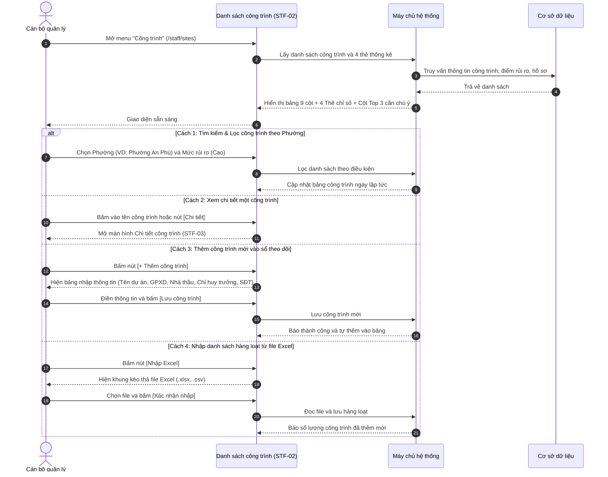

# STF-02 — Danh Sách Công Trình Trên Địa Bàn (Monitored Construction Sites)

> **Tài liệu hướng dẫn & đặc tả màn hình — Hệ thống Quản trị Bụi Đô thị DustGuard VN**  
> Sổ bộ điện tử quản lý toàn bộ các công trình xây dựng nhà ở, hạ tầng giao thông và khu đô thị trên địa bàn: theo dõi mức độ rủi ro bụi theo 4 cấp độ màu sắc, kiểm tra trạm đo bụi cổng xe ra vào, tìm kiếm nhanh theo phường và nhập xuất danh sách qua file Excel.

---

## 1. Thông Tin Chung Về Màn Hình

| Thuộc tính | Thông tin chi tiết | Ghi chú |
|---|---|---|
| **Mã màn hình** | `STF-02` | Mã định danh màn hình trong hệ thống |
| **Tên màn hình** | Danh sách công trình trên địa bàn (Sổ bộ công trình) | Tên hiển thị trên menu điều hướng |
| **Tên tiếng Anh** | Monitored Construction Sites Directory | Tên hiển thị giao diện tiếng Anh |
| **Đường dẫn (URL)** | `/staff/sites` | Địa chỉ truy cập chính |
| **File giao diện** | [`app/src/apps/staff/pages/sites/SitesListPage.jsx`](file:///d:/07-Competitions-Hackathons/unicef-dustguard/app/src/apps/staff/pages/sites/SitesListPage.jsx) | Mã nguồn trang giao diện React |
| **File xử lý dữ liệu** | [`app/server/routes/api/staff-sites.js`](file:///d:/07-Competitions-Hackathons/unicef-dustguard/app/server/routes/api/staff-sites.js) | File xử lý dữ liệu backend |
| **Khung bố cục** | [`app/src/apps/staff/layout/StaffLayout.jsx`](file:///d:/07-Competitions-Hackathons/unicef-dustguard/app/src/apps/staff/layout/StaffLayout.jsx) | Khung giao diện cán bộ |
| **Ai được sử dụng** | Cán bộ thanh tra môi trường, Đội trật tự đô thị, Lãnh đạo | Người dân chỉ xem được bản đồ công cộng |

---

## 2. Mục Đích & Tình Huống Sử Dụng Thực Tế

### 2.1. Cán bộ dùng màn hình này khi nào?
Màn hình **STF-02** là cuốn "Sổ bộ công trình điện tử" phục vụ công tác quản lý địa bàn hàng ngày của Đội Quản lý Trật tự Xây dựng & Đô thị và Phòng Tài nguyên Môi trường:
1. **Nắm rõ thông tin pháp lý của từng công trường**: Chủ đầu tư là ai, nhà thầu thi công nào, Giấy phép xây dựng số bao nhiêu, Chỉ huy trưởng tên gì kèm số điện thoại để gọi trực tiếp khi có sự cố.
2. **Đánh giá mức độ rủi ro phát tán bụi theo 4 cấp độ màu**:
   - 🔴 **Rủi ro Cao (70 - 100 điểm)**: Đang đào móng, xe chở đất không rửa bánh, nhiều người dân phản ánh $\rightarrow$ Cần lập đoàn kiểm tra đột xuất ngay.
   - 🟠 **Đang theo dõi (40 - 69 điểm)**: Có dấu hiệu bụi, giàn phun sương hoạt động chập chờn $\rightarrow$ Nhắn tin nhắc nhở nhà thầu qua Zalo/SMS.
   - 🟡 **Rủi ro Thấp (25 - 39 điểm)**: Đang hoàn thiện bên trong, mật độ xe thấp $\rightarrow$ Kiểm tra định kỳ theo tháng.
   - 🟢 **Đã ổn định (Dưới 25 điểm)**: Có trạm rửa xe tự động, bạt che kín khít, trạm đo bụi báo xanh $\rightarrow$ Duy trì theo dõi tự động.
3. **Ưu tiên xử lý đúng điểm nóng**: Bảng "Cần chú ý hôm nay" tự động đưa 3 công trình có điểm ô nhiễm cao nhất lên đầu để cán bộ kiểm tra trước.

### 2.2. So sánh cách làm cũ và cách làm mới

| Tiêu chí | Quản lý sổ sách & File Excel rời rạc | Sổ bộ công trình điện tử DustGuard VN |
|---|---|---|
| **Cập nhật danh sách** | Dữ liệu cũ, đổi nhà thầu hoặc chỉ huy trưởng không ai biết. | Cập nhật tập trung trên hệ thống, lưu rõ ngày giờ và người sửa. |
| **Theo dõi ô nhiễm** | Chờ dân làm đơn khiếu nại hoặc kiểm tra định kỳ mới phát hiện. | Kết nối trực tiếp trạm đo bụi tại cổng công trình, cảnh báo ngay khi vượt mức cho phép. |
| **Gọi điện nhắc nhở** | Mất thời gian tìm số điện thoại chỉ huy trưởng khi xe ben gây bụi ban đêm. | Hiển thị sẵn số điện thoại gọi ngay trên từng dòng công trình. |
| **Sắp xếp thứ tự kiểm tra** | Đi kiểm tra dàn trải, tốn xăng xe và không trúng điểm nóng. | Tự động xếp các công trình nguy cơ cao nhất lên đầu ca trực. |

---

## 3. Đối Tượng Sử Dụng & Luồng Làm Việc Thực Tế

### 3.1. Ai sử dụng màn hình này?
- **Cán bộ quản lý địa bàn**: Tra cứu công trình theo từng phường, kiểm tra xem công trường đã lắp trạm rửa xe chưa, mở hồ sơ xử lý vi phạm.
- **Tổ trưởng tổ kiểm tra**: Lọc danh sách các công trình rủi ro cao để lên lịch đi thực địa trong tuần.
- **Lãnh đạo UBND Phường/Quận**: Nắm tổng số công trình đang thi công trên địa bàn và tỷ lệ công trình chấp hành tốt quy chuẩn môi trường.

### 3.2. Luồng thao tác thực tế của cán bộ



---

## 4. Bố Cục Giao Diện & Khung Hình Trực Quan (Wireframe)

### 4.1. Khung hình trực quan trên màn hình máy tính

```text
+---------------------------------------------------------------------------------------------------------------+
| ĐIỀU HƯỚNG: Quản lý địa bàn / Sổ bộ công trình                                                                |
| TIÊU ĐỀ: "Công trình đang theo dõi"                                    [+ Thêm công trình]   [Nhập Excel]     |
|          Quản lý danh sách công trình, mức độ rủi ro bụi và hồ sơ kiểm tra liên quan.                         |
+---------------------------------------------------------------------------------------------------------------+
| 4 THẺ CHỈ SỐ TỔNG QUAN:                                                                                       |
| +--------------------+  +--------------------+  +--------------------+  +-----------------------------------+ |
| | 🏢 Tổng công trình |  | 🔴 Rủi ro cao      |  | 🟠 Đang theo dõi   |  | 🟢 Đã ổn định                     | |
| |        38          |  |         5          |  |        15          |  |        18                         | |
| | Toàn địa bàn quản lý| | Điểm rủi ro >= 70  |  | Điểm rủi ro 40-69  |  | Điểm rủi ro < 40                  | |
| +--------------------+  +--------------------+  +--------------------+  +-----------------------------------+ |
+---------------------------------------------------------------------------------------------------------------+
| KHU VỰC CHÍNH (Chiếm 75% Bảng danh sách + 25% Cột Cần chú ý hôm nay):                                         |
| +------------------------------------------------------------------+ +--------------------------------------+ |
| | THANH TÌM KIẾM & BỘ LỌC:                                         | | 🔔 CẦN CHÚ Ý HÔM NAY (Top 3 ưu tiên) | |
| | [🔍 Tìm tên, mã công trình...] [Phường: Tất cả ⌵]                | | ------------------------------------ | |
| | [Mức rủi ro: Tất cả ⌵] [Trạng thái: Tất cả ⌵]      [↻ Làm mới]   | | [88] Dự án ĐT743 & Thoát nước        | |
| |------------------------------------------------------------------| |      📍 Phường An Phú, Thuận An      | |
| | BẢNG SỔ BỘ CÔNG TRÌNH (9 Cột thông tin rõ nét):                  | |      Trạm đo: Cổng 1 · 2 hồ sơ vi phạm| |
| | Mã     | Công trình           | Phường   |Rủi ro|Trạm đo|HS|Phụ trách|TT| |      [Xem hồ sơ →]                   | |
| |--------+----------------------+----------+------+-------+--+---------+--| | ------------------------------------ | |
| |CT-26-01|Dự án Nút giao An Phú |P. An Phú | [88] |Trạm 1 | 2|Văn An   |HĐ| | [79] Nút giao Sóng Thần - QL1A       | |
| |        |Đường Mai Chí Thọ, Q2 |          |  Đỏ  | Đang đo|Đỏ|0987...  |  | |      📍 Phường Dĩ An                 | |
| |--------+----------------------+----------+------+-------+--+---------+--| |      Trạm 2 · 1 hồ sơ vi phạm        | |
| |CT-26-02|Grand Marina Saigon   |P.Bến Nghé| [52] |Trạm 2 | 0|Minh Đức |HĐ| | ------------------------------------ | |
| |        |Số 2 Tôn Đức Thắng, Q1|          |  Cam | Đang đo|Xm|0912...  |  | | [74] Cải tạo Quốc lộ 1K             | |
| |--------+----------------------+----------+------+-------+--+---------+--| |      📍 Phường Đông Hòa              | |
| |CT-26-03|Khu đô thị Starlake   |P.Xuân Tảo| [22] |Chưa gắn| 0|Tuấn Anh |HĐ| |      Trạm 3 · 1 hồ sơ vi phạm        | |
| |        |Khu Tây Hồ Tây        |          | Xanh |       |Xm|0933...  |  | | ------------------------------------ | |
| | ... (Hiển thị 8 công trình mỗi trang)                            | | ➔ Xem tất cả cảnh báo khẩn         | |
| |------------------------------------------------------------------| +--------------------------------------+ |
| | PHÂN TRANG: Hiển thị 1 - 8 trên 38 công trình   [Trang trước] [ 1 ] [ 2 ] [Trang sau]                       |
| +------------------------------------------------------------------+                                          |
+---------------------------------------------------------------------------------------------------------------+
| CÁC BẢNG NHẬP LIỆU:                                                                                           |
| 1. [Bảng Thêm công trình mới] (Tên dự án, GPXD, Nhà thầu, Chỉ huy trưởng, Số điện thoại, Tọa độ bản đồ).      |
| 2. [Bảng Nhập file Excel] (Kéo thả file danh sách dự án, xem trước thông tin và kiểm tra trùng lặp).           |
+---------------------------------------------------------------------------------------------------------------+
```

### 4.2. Ý nghĩa 9 cột thông tin trong bảng
1. **Mã**: Mã quản lý của công trình (VD: `CT-26-001`).
2. **Công trình**: Tên dự án in đậm rõ ràng kèm địa chỉ chi tiết. Tên dài tự xuống dòng gọn gàng, không bị che chữ.
3. **Phường**: Phường/Xã nơi công trình đang thi công.
4. **Điểm rủi ro**: Điểm số từ 0 - 100 hiển thị to rõ kèm màu sắc (Đỏ: $\ge 70$, Cam: 40-69, Xanh: $< 40$).
5. **Trạm đo**: Trạm đo bụi lắp tại cổng xe ra vào (`Trạm 1 - Đang đo` hoặc `Chưa gắn trạm`).
6. **Hồ sơ mở**: Số lượng vụ việc vi phạm đang xử lý. Nếu có hồ sơ sẽ hiện màu đỏ nổi bật.
7. **Phụ trách**: Tên cán bộ theo dõi địa bàn kèm số điện thoại liên hệ.
8. **Trạng thái**: `HOẠT ĐỘNG` (đang thi công) hoặc `TẠM DỪNG` (đang bị đình chỉ hoặc tạm dừng).
9. **Thao tác**: Nút `[Chi tiết]` để mở toàn bộ thông tin công trình và nút menu `[⋮]` để xem hồ sơ liên quan hoặc gán trạm đo.

---

## 5. Dữ Liệu & Liên Kết Hệ Thống

### 5.1. Dữ liệu chính trên màn hình
- **Thống kê 4 thẻ đầu trang**: Tổng số công trình, số công trình rủi ro cao, số công trình đang theo dõi, số công trình đã ổn định.
- **Danh sách công trình**: Mã công trình, tên dự án, địa chỉ, phường, nhà thầu, chỉ huy trưởng, số điện thoại, điểm rủi ro và số hồ sơ vi phạm.
- **Top 3 cần chú ý**: 3 công trình có điểm rủi ro cao nhất hoặc có nhiều phản ánh nhất trong ngày.

### 5.2. Mẫu dữ liệu trao đổi đơn giản
```json
{
  "totalSites": 38,
  "highRiskCount": 5,
  "monitoringCount": 15,
  "stableCount": 18,
  "items": [
    {
      "id": "site_01",
      "code": "CT-26-0001",
      "name": "Dự án Cải tạo Thoát nước & Đường ĐT743",
      "address": "Đường ĐT743, Phường An Phú, TP. Thuận An",
      "ward": "Phường An Phú",
      "dustRiskScore": 88,
      "sensorName": "Trạm 01 (Cổng xe ben)",
      "openCasesCount": 2,
      "managerName": "Nguyễn Văn An",
      "managerPhone": "0987654321",
      "status": "Hoạt động"
    }
  ]
}
```

---

## 6. Bảng Nút Bấm & Thao Tác Chi Tiết

| Nút bấm / Thao tác | Vị trí | Hành động khi bấm | Ai được bấm |
|---|---|---|:---:|
| **`[+ Thêm công trình]`** | Góc trên bên phải | Mở bảng điền thông tin để thêm một công trình mới vào sổ theo dõi. | Cán bộ, Quản trị viên |
| **`[Nhập Excel]`** | Cạnh nút Thêm công trình | Mở khung kéo thả file Excel nạp danh sách nhiều công trình cùng lúc. | Cán bộ, Quản trị viên |
| **`[Chi tiết]`** | Cột cuối mỗi dòng | Mở màn hình chi tiết công trình (`/staff/sites/:id`) để xem hồ sơ đầy đủ. | Tất cả cán bộ |
| **`[Menu ⋮]`** | Cột cuối mỗi dòng | Mở menu phụ gồm: *Xem chi tiết*, *Hồ sơ vi phạm liên quan*, *Gán trạm đo bụi*. | Tất cả cán bộ |
| **`[📁 Hồ sơ liên quan]`** | Trong menu `[⋮]` | Mở danh sách tất cả các hồ sơ vi phạm của riêng công trình này. | Tất cả cán bộ |
| **`[🔗 Gán trạm đo]`** | Trong menu `[⋮]` | Mở bảng chọn trạm cảm biến đo bụi lắp tại cổng công trình. | Cán bộ quản trị |
| **`[↻ Làm mới]`** | Cạnh các ô lọc | Xóa sạch các bộ lọc tìm kiếm và tải lại danh sách công trình ban đầu. | Tất cả cán bộ |
| **`[Xem hồ sơ →]`** | Cột Cần chú ý (Top 3) | Mở ngay hồ sơ của công trình có điểm ô nhiễm cao nhất. | Tất cả cán bộ |

---

## 7. Quy Chuẩn Giao Diện Sáng Màu & Dễ Nhìn

### 7.1. Tông màu sáng, tương phản cao, chữ đậm dễ đọc
- **Màu nền tổng thể**: Màu kem sáng nhạt (`#FAFAF9`), giúp cán bộ nhìn lâu không bị mỏi mắt.
- **Khung bảng dữ liệu**: Màu trắng nguyên khối (`#FFFFFF`), viền xám nhạt (`#E7E5E4`), tuyệt đối không dùng hiệu ứng mờ kính (No Glassmorphism).
- **Màu chữ**: Màu đen đậm rõ nét (`#1C1917`), đảm bảo đọc rõ nội dung khi mang máy tính bảng ra công trường dưới trời nắng.
- **Huy hiệu điểm rủi ro**:
  - *Mức Đỏ (Rủi ro cao)*: Nền đỏ nhạt, chữ đỏ son đậm (`#B91C1C`), viền đỏ.
  - *Mức Cam (Đang theo dõi)*: Nền cam nhạt, chữ cam đậm (`#EA580C`).
  - *Mức Xanh (Đã ổn định)*: Nền xanh nhạt, chữ xanh lá đậm (`#16A34A`).

### 7.2. Tương thích trên máy tính và điện thoại
- **Màn hình máy tính 14-inch**: Bảng 9 cột hiển thị cân đối chiếm 75% màn hình, cột Top 3 công trình ưu tiên nằm gọn gàng bên phải rộng 310px. Tên công trình dài tự xuống dòng tự nhiên, không bị cắt ngắn cụt lủn.
- **Màn hình điện thoại**: Bảng có thanh cuộn ngang mượt mà, các nút bấm có chiều cao tối thiểu 44px để dễ chạm bằng ngón tay khi đang đi kiểm tra hiện trường.

---

## 8. Các Tình Huống Lỗi Thường Gặp & Cách Xử Lý

### 8.1. Các lỗi thực tế hay gặp
1. **Lọc không ra công trình nào**: Hệ thống hiển thị biểu tượng công trình kèm thông báo rõ ràng *"Không tìm thấy công trình phù hợp"* cùng nút bấm **[Đặt lại bộ lọc]**, không để bảng bị trống trơn.
2. **Tên công trình hoặc địa chỉ quá dài**: Tự động xuống dòng gọn gàng, không bị tràn khung và không bị cắt cụt mất chữ.
3. **Thêm công trình nhưng để trống tên hoặc địa chỉ**: Hệ thống nhắc nhở bằng tiếng Việt ngay tại ô nhập liệu, không cho bấm lưu khi chưa điền đủ thông tin cơ bản.
4. **Mất mạng khi đang xem danh sách**: Hệ thống hiển thị thông báo nhắc kiểm tra kết nối mạng và có nút bấm thử lại.

### 8.2. Lệnh kiểm tra nhanh cho kỹ thuật viên
Chạy trực tiếp trên cửa sổ PowerShell:
```powershell
# 1. Kiểm tra giao diện danh sách công trình
node --test app/tests/staff-sites-mockup4-5.test.js

# 2. Kiểm tra tính năng thêm, sửa, lọc công trình
node --test app/tests/site-controller.test.js

# 3. Kiểm tra toàn diện hệ thống
npm --prefix app run verify:quick
```
