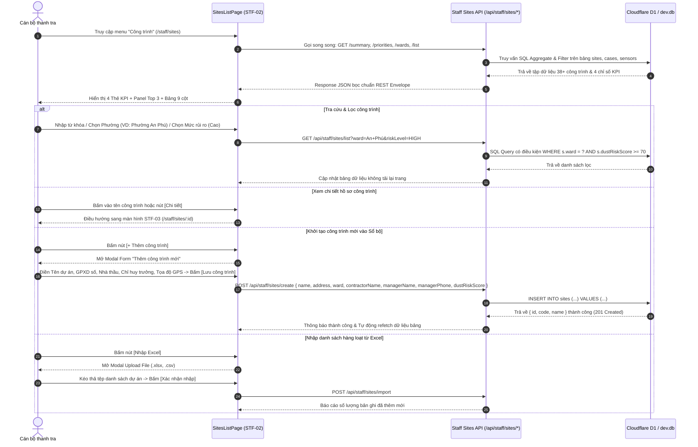

# STF-02 — Sổ Bộ Quản Lý Công Trình Xây Dựng Địa Bàn (Staff Sites List)

> **Tài liệu đặc tả màn hình chuẩn SSOT (Single Source of Truth) — DustGuard VN CivicTech Platform**  
> Màn hình quản lý danh mục 38+ đại công trình xây dựng dân dụng, công nghiệp và hạ tầng giao thông đô thị trọng điểm tại Hà Nội & TP.HCM. Tích hợp ma trận rủi ro CPS 4 cấp độ, trạm quan trắc IoT cổng xe ben, bộ lọc đa chiều và đồng bộ 100% CSDL Cloudflare D1 / SQLite `dev.db`.

---

## 1. Screen Identity (Nhận Diện Màn Hình)

| Thuộc tính | Giá trị SSOT | Ghi chú kỹ thuật |
|---|---|---|
| **Mã màn hình** | `STF-02` | Mã định danh phân hệ Quản lý Công trình trong Design System |
| **Tên tiếng Việt** | Sổ bộ quản lý công trình xây dựng địa bàn / Danh sách công trình đang theo dõi | Nhãn hiển thị chính thức trên thanh điều hướng và Breadcrumb |
| **Tên tiếng Anh** | Monitored Construction Sites & Dust Risk Directory | Tên hiển thị giao diện tiếng Anh & API Swagger |
| **Đường dẫn (Route)** | `/staff/sites` | Canonical Route (Hỗ trợ URL Query: `?search=&ward=&riskLevel=&status=&page=&limit=`) |
| **Component Path** | [`app/src/apps/staff/pages/sites/SitesListPage.jsx`](file:///d:/07-Competitions-Hackathons/unicef-dustguard/app/src/apps/staff/pages/sites/SitesListPage.jsx) | React 19 Client Component (Chế độ High-Velocity) |
| **Backend Router** | [`app/server/routes/api/staff-sites.js`](file:///d:/07-Competitions-Hackathons/unicef-dustguard/app/server/routes/api/staff-sites.js) | Express Router kết nối D1 / Better-SQLite3 |
| **Edge Router (Hono)** | [`app/server/routes/worker/sites.routes.js`](file:///d:/07-Competitions-Hackathons/unicef-dustguard/app/server/routes/worker/sites.routes.js) | Cloudflare Worker Hono API Handler |
| **Layout bọc** | [`app/src/apps/staff/layout/StaffLayout.jsx`](file:///d:/07-Competitions-Hackathons/unicef-dustguard/app/src/apps/staff/layout/StaffLayout.jsx) | Khung điều hành tác nghiệp Cán bộ thanh tra môi trường |
| **Quyền truy cập (RBAC)**| `staff`, `inspector`, `executive`, `admin`, `demo_admin` | Chặn truy cập trái phép đối với vai trò `citizen`, `volunteer`, `public` |
| **Trạng thái thực thi** | **ACTIVE (Level 5 Production Coherent)** | Kết nối 100% CSDL D1 SQLite thật, Zero-Mock |

---

## 2. Mục Đích Nghiệp Vụ & Giá Trị Thực Tế (Business Purpose & Civic Value)

### 2.1. Mục đích thiết kế
Màn hình **STF-02** là công cụ quản trị cốt lõi cho lực lượng Thanh tra Sở Xây dựng, Phòng Tài nguyên & Môi trường và Cán bộ Quản lý Trật tự Đô thị cấp Quận/Huyện. Màn hình số hóa toàn bộ "Sổ bộ công trình xây dựng" trên địa bàn, giúp cán bộ:
1. **Nắm bắt toàn diện 38+ đại công trình**: Giám sát đầy đủ thông tin định danh pháp lý (Chủ đầu tư, Tổng thầu thi công, Giấy phép xây dựng số, Chỉ huy trưởng công trường kèm SĐT liên lạc 24/7).
2. **Đánh giá rủi ro phát tán bụi theo thời gian thực (CPS Risk Matrix 4 cấp độ)**: Tự động phân loại mức độ rủi ro dựa trên tổng hợp dữ liệu trạm đo IoT cổng ra vào xe ben, mật độ phản ánh của người dân và lịch sử vi phạm.
3. **Chỉ đạo can thiệp kịp thời**: Nhận diện tức thì các "Điểm nóng rủi ro cao" ($\ge 70$ điểm) để điều động đoàn thanh tra đột xuất trước khi xảy ra sự cố ô nhiễm không khí diện rộng.

### 2.2. Ma trận rủi ro CPS 4 cấp độ (Cyber-Physical System Risk Matrix)

| Cấp độ rủi ro | Thang điểm $R$ | Màu nhận diện | Tiêu chí đánh giá thực địa | Hành động nghiệp vụ bắt buộc |
|---|:---:|:---:|---|---|
| 🔴 **Rủi ro Cao (Critical/High)** | $70 \le R \le 100$ | Đỏ son `#B91C1C` | Nồng độ bụi PM2.5/PM10 vượt QCVN 05:2023 liên tục $> 3\text{h}$; xe ben chở đất không rửa bánh; bạt che rách $> 30\%$; nằm cách trường học/bệnh viện $< 200\text{m}$. | Ban hành Quyết định thanh tra đột xuất trong 12–24h; lập biên bản xử phạt vi phạm hành chính. |
| 🟠 **Đang theo dõi (Medium)** | $40 \le R < 70$ | Cam đất `#EA580C` | Có phản ánh của cộng đồng; nồng độ bụi tiệm cận ngưỡng giới hạn; hệ thống phun sương hoạt động ngắt quãng. | Gửi thông báo đôn đốc số qua Zalo/SMS tới Chỉ huy trưởng; yêu cầu báo cáo biện pháp dập bụi trong 24h. |
| 🟡 **Rủi ro Thấp (Low)** | $25 \le R < 40$ | Vàng hổ phách `#D97706` | Công trình đang trong giai đoạn hoàn thiện nội thất; xe ra vào mật độ thấp; có cầu rửa xe hoạt động. | Kiểm tra định kỳ theo kế hoạch tháng của Đội trật tự đô thị. |
| 🟢 **Đã ổn định (Stable/Good)**| $0 \le R < 25$ | Xanh lá `#16A34A` | Có trạm quan trắc IoT chuẩn kiểm định; giàn phun sương tự động cao áp; đường gom được quét rửa thường xuyên. | Duy trì cơ chế giám sát tự động qua cảm biến; ghi nhận điểm tích lũy tuân thủ môi trường. |

### 2.3. Bảng so sánh thay thế cách làm truyền thống

| Tiêu chí | Quản lý sổ sách & Bảng tính Excel truyền thống | Sổ bộ công trình điện tử DustGuard VN (STF-02) |
|---|---|---|
| **Cập nhật danh mục** | Rời rạc, dữ liệu cũ từ 1-3 tháng trước; khó đối soát khi đổi nhà thầu. | Đồng bộ tức thì theo CSDL D1 SQLite; lưu vết lịch sử cập nhật (`updatedAt`). |
| **Giám sát ô nhiễm bụi** | Phụ thuộc vào đợt kiểm tra định kỳ hoặc khi dân gửi đơn khiếu nại. | Kết nối trực tiếp trạm đo IoT tại cổng công trình; cảnh báo tự động khi vượt QCVN. |
| **Liên lạc hiện trường** | Khó tìm số Chỉ huy trưởng khi xe ben làm rơi vãi bùn đất ban đêm. | Hiển thị số điện thoại trực ban của Chỉ huy trưởng và Đơn vị thi công trên từng dòng. |
| **Điều phối ưu tiên** | Cán bộ kiểm tra dàn trải, không có trọng tâm. | Panel "Top 3 cần chú ý" tự động đưa công trình rủi ro cao nhất lên đầu ca trực. |

---

## 3. Đối Tượng Người Dùng & Hành Trình Thao Tác (User Journey & Core Flow)

### 3.1. Đối tượng sử dụng
- **Thanh tra viên môi trường Sở Xây dựng / Phòng TN&MT**: Tra cứu danh mục công trình theo địa bàn phụ trách, đánh giá điểm rủi ro, khởi tạo hồ sơ xử lý vi phạm.
- **Đội Cảnh sát Môi trường & Quản lý Trật tự Đô thị**: Kiểm tra giấy phép xây dựng, thông tin đơn vị thi công, kiểm tra việc vận hành trạm rửa xe ben tự động.
- **Lãnh đạo UBND Phường/Quận**: Nắm bắt bức tranh tổng thể các đại công trình trên địa bàn, tỷ lệ công trình chấp hành tốt quy chuẩn môi trường.

### 3.2. Sơ đồ luồng tác nghiệp chuẩn (User Journey Sequence)



---

## 4. Bố Cục Giao Diện & Wireframe Bảng 9 Cột (Information Hierarchy & Layout)

### 4.1. Wireframe bố cục tổng thể (Desktop 14-inch $\ge 1280\text{px}$)

```text
+---------------------------------------------------------------------------------------------------------------+
| BREADCRUMB: Quản trị địa bàn / Sổ bộ công trình                                                               |
| HEADER: "Công trình đang theo dõi"                                    [+ Thêm công trình]   [Nhập Excel]      |
|         Quản lý danh sách công trình, mức độ rủi ro bụi và hồ sơ kiểm tra liên quan.                          |
+---------------------------------------------------------------------------------------------------------------+
| 4 THẺ CHỈ SỐ KPI TỔNG QUAN:                                                                                   |
| +--------------------+  +--------------------+  +--------------------+  +-----------------------------------+ |
| | 🏢 Tổng công trình |  | 🛡️ Rủi ro cao       |  | 👁️ Đang theo dõi   |  | ✅ Đã ổn định                     | |
| |        38          |  |         5          |  |        15          |  |        18                         | |
| | Dữ liệu SQLite SSOT|  | Điểm rủi ro >= 70  |  | Điểm rủi ro 40-69  |  | Điểm rủi ro < 40                  | |
| +--------------------+  +--------------------+  +--------------------+  +-----------------------------------+ |
+---------------------------------------------------------------------------------------------------------------+
| KHU VỰC CHÍNH (Bố cục 75% Bảng danh sách + 25% Panel Cần chú ý trên màn hình xl):                            |
| +------------------------------------------------------------------+ +--------------------------------------+ |
| | THANH TÌM KIẾM & BỘ LỌC ĐA CHIỀU:                                | | 🔔 CẦN CHÚ Ý HÔM NAY (Top 3 ưu tiên) | |
| | [🔍 Tìm kiếm mã, tên công trình...] [Phường: Tất cả ⌵]           | | ------------------------------------ | |
| | [Rủi ro: Tất cả ⌵] [Trạng thái: Tất cả ⌵]          [↻ Làm mới]   | | [88] Dự án ĐT743 & Thoát nước        | |
| |------------------------------------------------------------------| |      📍 Phường An Phú, Thuận An      | |
| | BẢNG SỔ BỘ CÔNG TRÌNH (9 Cột chuẩn Zero-Truncate):               | |      Trạm 01 (Cổng xe ben) · 2 HS mở | |
| | Mã     | Công trình           | Khu vực  |Rủi ro|Trạm |HS|Phụ trách|TT| |      [Xem hồ sơ →]                   | |
| |--------+----------------------+----------+------+-----+--+---------+--| | ------------------------------------ | |
| |CT-26-01|Dự án Nút giao An Phú |P. An Phú | [88] |Trạm1| 2|Văn An   |HD| | [79] Nút giao Sóng Thần - QL1A       | |
| |        |Đường Mai Chí Thọ, Q2 |          |  Đỏ  | Hoạt|Đỏ|0987...  |  | |      📍 Phường Dĩ An                 | |
| |--------+----------------------+----------+------+-----+--+---------+--| |      Trạm 02 · 1 hồ sơ mở            | |
| |CT-26-02|Grand Marina Saigon   |P. BếnNghé| [52] |Trạm2| 0|Minh Đức |HD| | ------------------------------------ | |
| |        |Số 2 Tôn Đức Thắng, Q1|          |  Cam | Hoạt|Xm|0912...  |  | | [74] Cải tạo Quốc lộ 1K             | |
| |--------+----------------------+----------+------+-----+--+---------+--| |      📍 Phường Đông Hòa              | |
| |CT-26-03|Khu đô thị Starlake   |P. XuânTảo| [22] |Trạm3| 0|Tuấn PA  |HD| |      Trạm 03 · 1 hồ sơ mở            | |
| |        |Khu Tây Hồ Tây, Bắc TL|          | Xanh | Hoạt|Xm|0933...  |  | | ------------------------------------ | |
| | ... (8 công trình / trang)                                       | | ➔ Xem tất cả cảnh báo khẩn         | |
| |------------------------------------------------------------------| +--------------------------------------+ |
| | PHÂN TRANG: Hiển thị 1 - 8 trên 38 | Trang [ 1 ] / 5   [Trước] [Sau]                                        | |
| +------------------------------------------------------------------+                                          |
+---------------------------------------------------------------------------------------------------------------+
| MODALS NGHIỆP VỤ:                                                                                             |
| 1. [Modal Thêm công trình mới] (Tên, GPXD, Chủ đầu tư, Tổng thầu, Chỉ huy trưởng, SĐT, Tọa độ GPS, Điểm $R$)  |
| 2. [Modal Nhập Excel/CSV] (Kéo thả file, Xem trước dữ liệu, Kiểm tra trùng lặp mã CT)                         |
+---------------------------------------------------------------------------------------------------------------+
```

### 4.2. Bảng đặc tả 9 cột dữ liệu chuẩn Zero-Truncate (Table Specification)

| STT | Tên cột | Ý nghĩa nghiệp vụ | Kiểu dữ liệu & Hiển thị | Quy tắc hiển thị & Tránh che khuất chữ |
|:---:|---|---|---|---|
| **1** | **Mã** | Mã định danh quản lý thống nhất | Text Monospace (`CT-26-001`) | `font-mono text-[11px] font-bold text-[#57534E] whitespace-nowrap`. |
| **2** | **Công trình** | Tên đầy đủ của dự án & Địa chỉ thi công | 2 Dòng: Dòng 1 Tên dự án (Đậm), Dòng 2 Địa chỉ cụ thể | **Tuyệt đối không dùng `truncate`**. Sử dụng `break-words`, `min-w-0`, hover chuyển màu đỏ son `#B91C1C` mở chi tiết. |
| **3** | **Khu vực** | Phường/Xã và Quận/Huyện quản lý | Text nhãn rõ ràng | `text-xs font-semibold text-[#57534E] whitespace-nowrap`. |
| **4** | **Điểm rủi ro** | Điểm số rủi ro phát tán bụi $R \in [0, 100]$ | Huy hiệu số to bản bo góc kèm màu nền 4 cấp độ | 🔴 Đỏ ($\ge 70$), 🟠 Cam ($40-69$), 🟢 Xanh ($< 40$). Có viền màu tương ứng. |
| **5** | **Trạm đo** | Trạm cảm biến IoT lắp tại cổng ra vào xe ben | Huy hiệu xám kèm chấm tín hiệu LED | Chấm xanh lá `#16A34A` nhấp nháy (Online) + Tên trạm (`Trạm 01`). Nếu chưa có hiển thị `Chưa gắn trạm`. |
| **6** | **Hồ sơ mở** | Số lượng vụ việc vi phạm đang thụ lý | Badge số đếm nổi bật | Nếu $> 0$: Nền đỏ nhạt `#FEF2F2`, chữ đỏ `#B91C1C` in đậm. Nếu $= 0$: Nền xám `#F5F5F4` chữ `#78716C`. |
| **7** | **Phụ trách** | Cán bộ thanh tra địa bàn / Chỉ huy trưởng | Text họ tên cán bộ thụ lý | `text-xs font-semibold text-[#44403C] whitespace-nowrap`. |
| **8** | **Trạng thái** | Tình trạng thi công thực tế | Badge trạng thái chuẩn chữ hoa | `HOẠT ĐỘNG` (Nền xanh nhạt, chữ xanh lá) hoặc `TẠM DỪNG` (Nền cam nhạt, chữ cam đậm). |
| **9** | **Thao tác** | Nút bấm mở hồ sơ và Menu mở rộng | Nút `[Chi tiết]` + Menu `[⋮]` | Nút `[Chi tiết]` dẫn trực tiếp `/staff/sites/:id`. Menu dropdown chứa: *Xem chi tiết*, *Hồ sơ liên quan*, *Gán trạm đo*. |

---

## 5. Dữ Liệu & Hợp Đồng API / CSDL D1 SQLite (Data Contract & SSOT)

### 5.1. Danh sách REST Endpoints Backend

```http
### 1. Lấy 4 chỉ số KPI tổng quan
GET /api/staff/sites/summary
Authorization: Bearer <staff_jwt_token>

### Response 200 OK
{
  "success": true,
  "data": {
    "totalSites": 38,
    "highRiskCount": 5,
    "monitoringCount": 15,
    "stableCount": 18,
    "timestamp": "2026-09-02T12:00:00.000Z"
  },
  "message": "Thống kê công trình"
}
```

```http
### 2. Lấy Top 3 công trình ưu tiên (Panel Cần chú ý)
GET /api/staff/sites/priorities
Authorization: Bearer <staff_jwt_token>

### Response 200 OK
{
  "success": true,
  "data": {
    "items": [
      {
        "id": "site-vd4-01",
        "code": "CT-26-0001",
        "name": "Dự án Cải tạo Thoát nước & Đường ĐT743",
        "address": "Đường ĐT743, Phường An Phú, TP. Thuận An",
        "ward": "Phường An Phú",
        "dustRiskScore": 88,
        "openCasesCount": 2,
        "sensorName": "Trạm 01 (Cổng xe ben)"
      },
      {
        "id": "site-vd4-02",
        "code": "CT-26-0002",
        "name": "Nút giao thông Sóng Thần - Quốc lộ 1A",
        "address": "Phường Dĩ An, TP. Dĩ An",
        "ward": "Phường Dĩ An",
        "dustRiskScore": 79,
        "openCasesCount": 1,
        "sensorName": "Trạm 02"
      }
    ]
  },
  "message": "Top công trình cần ưu tiên theo dõi"
}
```

```http
### 3. Lấy danh sách công trình có phân trang và bộ lọc đa chiều
GET /api/staff/sites/list?search=An+Phú&ward=ALL&riskLevel=HIGH&status=ACTIVE&page=1&limit=8
Authorization: Bearer <staff_jwt_token>

### Response 200 OK
{
  "success": true,
  "data": {
    "items": [
      {
        "id": "site_7f8a9b",
        "code": "CT-26-0042",
        "name": "Dự án Tổ hợp Căn hộ & Thương mại The Matrix One",
        "address": "Đường Lê Quang Đạo, Phường Mễ Trì, Quận Nam Từ Liêm, Hà Nội",
        "ward": "Phường Mễ Trì",
        "dustRiskScore": 85,
        "sensorName": "Trạm Cổng 1",
        "openCasesCount": 2,
        "managerName": "Nguyễn Văn An",
        "status": "Hoạt động",
        "riskColor": "red"
      }
    ],
    "pagination": {
      "page": 1,
      "limit": 8,
      "total": 38,
      "totalPages": 5
    }
  },
  "message": "Danh sách công trình"
}
```

```http
### 4. Thêm công trình mới vào Sổ bộ CSDL D1
POST /api/staff/sites/create
Content-Type: application/json
Authorization: Bearer <staff_jwt_token>

{
  "name": "Dự án Khu phức hợp Grand Marina Saigon",
  "address": "Số 2 Tôn Đức Thắng, Phường Bến Nghé, Quận 1, TP.HCM",
  "ward": "Phường Bến Nghé",
  "contractorName": "Công ty Cổ phần Xây dựng Coteccons",
  "managerName": "Trần Minh Đức",
  "managerPhone": "0912345678",
  "managerEmail": "duc.tm@dustguard.vn",
  "dustRiskScore": 65,
  "coordinates": "10.781234,106.705678"
}

### Response 201 Created
{
  "success": true,
  "data": {
    "id": "site_9c8b7a6d",
    "code": "CT-26-1049",
    "name": "Dự án Khu phức hợp Grand Marina Saigon"
  },
  "message": "Thêm công trình mới thành công"
}
```

### 5.2. Cấu trúc bảng CSDL D1 SQLite liên quan (`sites`)

```sql
-- Schema bảng sites chuẩn SSOT trong Cloudflare D1 / dev.db
CREATE TABLE IF NOT EXISTS sites (
  id TEXT PRIMARY KEY,                       -- UUID hoặc mã định danh (VD: site_vd4-01)
  code TEXT UNIQUE NOT NULL,                 -- Mã quản lý công trình (VD: CT-26-0001)
  name TEXT NOT NULL,                        -- Tên dự án / Công trình
  address TEXT NOT NULL,                     -- Địa chỉ chi tiết công trường
  ward TEXT NOT NULL,                        -- Phường / Xã quản lý
  province TEXT DEFAULT 'Hà Nội',            -- Tỉnh / Thành phố
  coordinates TEXT,                          -- Tọa độ GPS WGS84: "vĩ độ,kinh độ"
  dustRiskScore INTEGER DEFAULT 50,          -- Điểm rủi ro CPS (0 - 100)
  riskLevel TEXT DEFAULT 'MEDIUM',           -- Phân loại: CRITICAL | HIGH | MEDIUM | LOW | STABLE
  status TEXT DEFAULT 'ACTIVE',              -- Trạng thái: ACTIVE | PAUSED | COMPLETED
  contractorName TEXT,                       -- Tên Tổng thầu thi công
  managerName TEXT,                          -- Họ tên Cán bộ thanh tra phụ trách
  managerPhone TEXT,                         -- Số điện thoại liên hệ
  managerEmail TEXT,                         -- Email cán bộ / nhà thầu
  permitNumber TEXT,                         -- Giấy phép xây dựng số
  createdAt TEXT NOT NULL,                   -- ISO 8601 Timestamp
  updatedAt TEXT NOT NULL,                   -- ISO 8601 Timestamp
  deletedAt TEXT                             -- Soft delete timestamp
);

-- Chỉ mục tối ưu hóa tốc độ tìm kiếm và lọc
CREATE INDEX IF NOT EXISTS idx_sites_ward ON sites(ward);
CREATE INDEX IF NOT EXISTS idx_sites_risk_score ON sites(dustRiskScore DESC);
CREATE INDEX IF NOT EXISTS idx_sites_status ON sites(status);
```

---

## 6. Bảng Nút Bấm & Thao Tác Cốt Lõi (Key CTAs & Interactions)

| Nhãn nút bấm | Vị trí giao diện | Hành vi nghiệp vụ khi kích hoạt | Điều kiện hiển thị |
|---|---|---|---|
| **`[+ Thêm công trình]`** | Header góc trên bên phải | Mở Modal nhập liệu tạo mới công trình; tự động sinh mã `CT-26-XXXX` và gán trạng thái `ACTIVE`. | Role `staff`, `admin` |
| **`[Nhập Excel]`** | Header góc trên bên phải | Mở Modal kéo thả tệp bảng tính danh sách dự án; đối soát mã công trình trước khi ghi vào D1. | Role `staff`, `admin` |
| **`[Chi tiết]`** | Cột Thao tác (Từng dòng trong bảng) | Chuyển hướng tức thì sang màn hình Hồ sơ chi tiết `/staff/sites/:id`. | Luôn hiển thị |
| **`[Menu ⋮]`** | Cột Thao tác (Từng dòng trong bảng) | Mở menu xổ xuống gồm 3 tùy chọn: *Xem chi tiết*, *Hồ sơ liên quan*, *Gán trạm đo*. | Luôn hiển thị |
| **`[📁 Hồ sơ liên quan]`** | Trong Menu Dropdown `[⋮]` | Điều hướng sang `/staff/cases?siteId={id}` lọc toàn bộ hồ sơ vi phạm của công trình. | Luôn hiển thị |
| **`[🔗 Gán trạm đo]`** | Trong Menu Dropdown `[⋮]` | Mở hộp thoại liên kết nhanh mã trạm cảm biến IoT tại cổng công trình. | Role `staff` |
| **`[↻ Làm mới]`** | Thanh công cụ bộ lọc | Reset toàn bộ từ khóa tìm kiếm, đưa các dropdown Phường, Rủi ro, Trạng thái về `ALL`, tải lại trang 1. | Luôn hiển thị |
| **`[Xem hồ sơ →]`** | Panel Cần chú ý (Top 3) | Mở trực tiếp hồ sơ chi tiết của công trình có điểm rủi ro cao nhất. | Khi có dữ liệu Top 3 |
| **`[Đặt lại bộ lọc]`** | Khối Empty State (Khi bảng rỗng) | Kích hoạt hàm `handleResetFilters()` để khôi phục danh sách đầy đủ. | Khi không có kết quả |

---

## 7. Quy Chuẩn UI/UX & Tương Thích Responsive (UI/UX Standards)

### 7.1. Chuẩn hiển thị Responsive Đa Màn Hình

| Viewport | Kích thước màn hình | Cơ chế hiển thị giao diện |
|---|---|---|
| **Desktop Lớn / Màn hình 14-inch** | $\ge 1280\text{px}$ (`xl`) | Bố cục song song 2 khối: **75% chiều rộng** cho Bảng danh sách 9 cột và **cột 310px cố định** (`xl:w-[310px] xl:shrink-0`) cho Panel "Top 3 cần chú ý". |
| **Laptop / Desktop Vừa** | $1024\text{px} - 1279\text{px}$ (`lg`) | Panel "Top 3 cần chú ý" tự động chuyển xuống dưới Bảng danh sách để ưu tiên không gian hiển thị cho 9 cột. |
| **Tablet** | $768\text{px} - 1023\text{px}$ (`md`) | 4 Thẻ KPI hiển thị dạng lưới 2x2; Bảng danh sách cho phép cuộn ngang an toàn trong khung bo tròn. |
| **Mobile** | $360\text{px} - 767\text{px}$ (`sm`) | Header xếp chồng dọc; các nút hành động dàn đều 100% width; bảng cuộn ngang mượt mà kèm thanh cuộn mềm. |

### 7.2. Nguyên tắc Không Glassmorphism & Tương phản cao Civic Tech
- **Màu nền chủ đạo**: `#FAFAF9` (Kem ấm sáng dịu), thẻ nội dung `#FFFFFF` viền xám mờ `#E7E5E4`.
- **Màu văn bản SSOT**: Tiêu đề `#1C1917` (Đen mực tương phản cao), phụ đề `#78716C` (Xám tro), nhãn bảng `#57534E` (Xám đậm).
- **Màu sắc phân cấp nghiệp vụ**:
  - Đỏ son cảnh báo: `#B91C1C` / Nền `#FEF2F2` / Viền `#FEE2E2`.
  - Cam theo dõi: `#EA580C` / Nền `#FFF7ED` / Viền `#FFEDD5`.
  - Xanh lá an toàn: `#16A34A` / Nền `#F0FDF4` / Viền `#DCFCE7`.
  - Xanh dương liên kết: `#1D4ED8` / Nền `#EFF6FF` / Viền `#DBEAFE`.
- **Chiều cao vùng bấm tối thiểu (Touch Targets)**: Tất cả nút bấm, dropdown và ô nhập liệu đều có `min-height >= 38px` đến `44px`, bo góc `rounded-xl`, chống bấm trượt trên thiết bị cảm ứng hiện trường.

---

## 8. Bẫy Lỗi Thường Gặp & Hướng Dẫn Kiểm Thử (Troubleshooting & Testing)

### 8.1. Bẫy lỗi thường gặp & Giải pháp phòng ngừa (Pitfalls & Prevention)

| Mã bẫy lỗi | Tình huống phát sinh lỗi | Hậu quả | Giải pháp xử lý triệt để |
|---|---|---|---|
| **BUG-STF02-01** | API `/staff/sites/list` trả về `pagination.total` bằng null hoặc không xác định. | Trang hiển thị `NaN` tổng số trang hoặc phân trang bị treo. | Sử dụng toán tử null-coalescing an toàn: `setTotalSitesCount(res.data.pagination?.total ?? res.data.items.length);`. |
| **BUG-STF02-02** | Tên công trình hoặc địa chỉ quá dài (VD: Dự án tuyến đường liên tỉnh $> 150$ ký tự). | Gây vỡ bố cục ngang nếu dùng flex cố định, hoặc che mất tên nếu dùng `truncate`. | Áp dụng quy tắc **Zero Truncate**: Sử dụng `break-words` kết hợp `min-w-0` để văn bản tự xuống dòng tự nhiên. |
| **BUG-STF02-03** | Bộ lọc Phường hoặc Rủi ro không trả về kết quả nào (`items: []`). | Bảng hiển thị khoảng trắng trống trải, người dùng tưởng bị lỗi mạng. | Bắt buộc render component `EmptyState` chuyên dụng có icon công trình, thông điệp rõ ràng và nút bấm `[Đặt lại bộ lọc]`. |
| **BUG-STF02-04** | Người dùng bấm nút Thêm công trình nhưng để trống Tên dự án hoặc Địa chỉ. | Backend SQLite báo lỗi `NOT NULL constraint failed`. | Frontend validate chặn sớm: kiểm tra `!newSite.name || !newSite.address` và hiển thị alert hướng dẫn trước khi gọi API. |

### 8.2. Lệnh kiểm thử tự động một dòng (PowerShell Direct Execution)

```powershell
# 1. Chạy bài kiểm thử giao diện và cấu trúc Mockup 4 (Sites List)
node --test app/tests/staff-sites-mockup4-5.test.js

# 2. Chạy kiểm tra API router quản lý công trình và phân quyền RBAC
node --test app/tests/site-controller.test.js

# 3. Chạy toàn bộ Gate kiểm thử nhanh (< 7s) trước khi bàn giao
npm --prefix app run verify:quick
```
