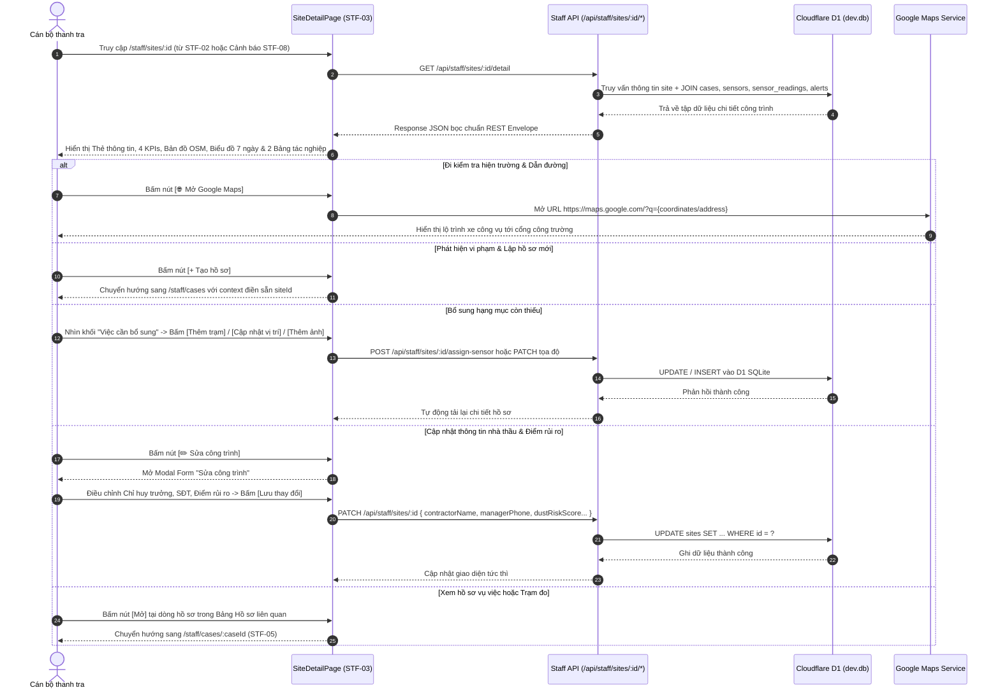

# STF-03 — Hồ Sơ Chi Tiết Công Trình & Quan Trắc Thực Địa (Site Detail)

> **Tài liệu đặc tả màn hình chuẩn SSOT (Single Source of Truth) — DustGuard VN CivicTech Platform**  
> Màn hình quản lý hồ sơ số chuyên sâu của từng điểm thi công xây dựng, hạ tầng giao thông trọng điểm tại Hà Nội & TP.HCM. Tích hợp dữ liệu quan trắc trạm đo IoT cổng xe ben theo QCVN 05:2023, phân tích xu hướng rủi ro 7 ngày, bản đồ OpenStreetMap WGS84 dẫn đường Google Maps, bảng hồ sơ vi phạm 7 bước DAG và đồng bộ 100% CSDL Cloudflare D1 / SQLite `dev.db`.

---

## 1. Screen Identity (Nhận Diện Màn Hình)

| Thuộc tính | Giá trị SSOT | Ghi chú kỹ thuật |
|---|---|---|
| **Mã màn hình** | `STF-03` | Mã định danh phân hệ Chi tiết Công trình trong Design System |
| **Tên tiếng Việt** | Chi tiết công trình & Hồ sơ quan trắc thực địa | Nhãn hiển thị chính thức trên thanh tiêu đề và Breadcrumb |
| **Tên tiếng Anh** | Construction Site Dossier & Real-Time Environmental Telemetry | Tên hiển thị giao diện tiếng Anh & API Swagger |
| **Đường dẫn (Route)** | `/staff/sites/:id` | Canonical Route (Hỗ trợ alias: `/staff/sites/:id/detail`) |
| **Component Path** | [`app/src/apps/staff/pages/sites/SiteDetailPage.jsx`](file:///d:/07-Competitions-Hackathons/unicef-dustguard/app/src/apps/staff/pages/sites/SiteDetailPage.jsx) | React 19 Client Component (Chế độ High-Velocity) |
| **Backend Router** | [`app/server/routes/api/staff-sites.js`](file:///d:/07-Competitions-Hackathons/unicef-dustguard/app/server/routes/api/staff-sites.js) | Express Router (`GET /:id/detail`, `PATCH /:id`, `DELETE /:id`) |
| **Edge Router (Hono)** | [`app/server/routes/worker/sites.routes.js`](file:///d:/07-Competitions-Hackathons/unicef-dustguard/app/server/routes/worker/sites.routes.js) | Cloudflare Worker Hono API Handler |
| **Layout bọc** | [`app/src/apps/staff/layout/StaffLayout.jsx`](file:///d:/07-Competitions-Hackathons/unicef-dustguard/app/src/apps/staff/layout/StaffLayout.jsx) | Khung điều hành tác nghiệp Cán bộ thanh tra môi trường |
| **Quyền truy cập (RBAC)**| `staff`, `inspector`, `executive`, `admin`, `demo_admin` | Chặn truy cập trái phép đối với vai trò `citizen`, `volunteer`, `public` |
| **Trạng thái thực thi** | **ACTIVE (Level 5 Production Coherent)** | Đồng bộ 100% dữ liệu thực từ CSDL D1 SQLite SSOT |

---

## 2. Mục Đích Nghiệp Vụ & Giá Trị Thực Tế (Business Purpose & Civic Value)

### 2.1. Mục đích thiết kế
Màn hình **STF-03** đóng vai trò là "Hồ sơ số hiện trường" (Digital Site Dossier) của một công trình xây dựng cụ thể. Khi phát hiện dấu hiệu ô nhiễm hoặc trước khi đoàn thanh tra lên đường kiểm tra đột xuất, màn hình cung cấp toàn bộ thông tin chỉ huy trong 30 giây:
1. **Thông tin pháp lý & Liên lạc khẩn cấp**: Nắm rõ Tên chủ đầu tư, Tổng thầu thi công, Giấy phép xây dựng số, và số điện thoại gọi trực tiếp cho Chỉ huy trưởng công trường.
2. **Dữ liệu quan trắc trạm đo IoT tại cổng xe ben**: Giám sát nồng độ bụi thực tế PM2.5 / PM10 tức thời, đối chiếu ngưỡng quy chuẩn môi trường **QCVN 05:2023/BTNMT** (Giới hạn 24h: PM2.5 $\le 50\,\mu\text{g/m}^3$, PM10 $\le 100\,\mu\text{g/m}^3$).
3. **Phân tích diễn biến rủi ro 7 ngày (CPS Risk Trend)**: Theo dõi biểu đồ cột biến động điểm số rủi ro $R \in [0, 100]$ để xác định giai đoạn thi công phát tán bụi đỉnh điểm (đào đất móng, vận chuyển bùn thải, đổ bê tông).
4. **Tự động rà soát lỗ hổng hồ sơ (Missing Items Checklist)**: Phát hiện ngay công trình chưa lắp trạm đo bụi, chưa cập nhật tọa độ GPS hoặc thiếu ảnh hiện trường để cán bộ yêu cầu bổ sung.
5. **Điều phối xử lý vi phạm 7 bước DAG**: Cho phép lập ngay hồ sơ vi phạm mới gắn với mã công trình (`siteId`), hoặc mở các hồ sơ đang xử lý để nghiệm thu việc khắc phục che chắn.
6. **Dẫn đường thanh tra tức thời (Navigation)**: Tích hợp bản đồ OpenStreetMap WGS84 và nút mở ứng dụng Google Maps vệ tinh dẫn đường xe công vụ đến đúng cổng công trường.

### 2.2. Ma trận rủi ro CPS 4 cấp độ áp dụng cho Công trình

```text
+-------------------------------------------------------------------------------------------------------+
| MA TRẬN RỦI RO CPS 4 CẤP ĐỘ — QUY CHUẨN ĐÁNH GIÁ ĐIỂM SỐ TẠI CÔNG TRÌNH                                |
+-------------------------------------------------------------------------------------------------------+
| 🔴 RỦI RO CAO (Điểm >= 70)       | Nồng độ PM2.5 > 50 µg/m³ liên tục; xe ben không rửa bánh khi ra     |
| [Báo động Đỏ - Thanh tra ngay]   | cổng; bạt che chắn rách; có > 1 hồ sơ vi phạm đang mở.              |
|----------------------------------+---------------------------------------------------------------------|
| 🟠 ĐANG THEO DÕI (Điểm 40 - 69)  | Có dấu hiệu phát tán bụi cục bộ; hệ thống phun sương hoạt động cầm  |
| [Báo động Cam - Đôn đốc khắc phục| chừng; có phản ánh của người dân trong bán kính 500m.                |
|----------------------------------+---------------------------------------------------------------------|
| 🟡 RỦI RO THẤP (Điểm 25 - 39)    | Công trình hoàn thiện bên trong; xe ra vào mật độ thấp; che chắn    |
| [Báo động Vàng - Giám sát định kỳ| đạt yêu cầu; không có phản ánh vi phạm trong 14 ngày.               |
|----------------------------------+---------------------------------------------------------------------|
| 🟢 ĐÃ ỔN ĐỊNH (Điểm < 25)        | Có trạm IoT hoạt động 24/7; nồng độ PM2.5 < 25 µg/m³; hệ thống rửa  |
| [Báo động Xanh - Đạt chuẩn Xanh] | xe tự động áp lực cao; đường gom xung quanh sạch sẽ.                |
+-------------------------------------------------------------------------------------------------------+
```

---

## 3. Đối Tượng Người Dùng & Hành Trình Thao Tác (User Journey & Core Flow)

### 3.1. Đối tượng sử dụng
- **Trưởng đoàn thanh tra / Thanh tra viên hiện trường**: Kiểm tra hồ sơ trước khi xuất phát, mở Google Maps dẫn đường, lập hồ sơ vi phạm khi phát hiện vi phạm thực tế.
- **Cán bộ giám sát quan trắc môi trường**: Theo dõi chuỗi số liệu đo bụi từ trạm IoT cổng công trình, xuất file dữ liệu đối soát vi phạm.
- **Lãnh đạo cơ quan quản lý**: Duyệt thông tin cập nhật công trình, theo dõi tiến độ khắc phục của các nhà thầu trên địa bàn.

### 3.2. Sơ đồ luồng tác nghiệp chi tiết (User Journey Sequence)



---

## 4. Bố Cục Giao Diện & Wireframe 12 Cột (Information Hierarchy & Layout)

### 4.1. Sơ đồ cấu trúc Wireframe tổng thể (Desktop 14-inch $\ge 1280\text{px}$)

```text
+---------------------------------------------------------------------------------------------------------------+
| BREADCRUMB: Công trình / Chi tiết công trình                                                                  |
| HEADER: "Chi tiết công trình"                       [+ Tạo hồ sơ]   [✏️ Sửa công trình]   [🌐 Mở Google Maps] |
|         Xem vị trí, chỉ số gần đây và hồ sơ liên quan.                                                        |
+---------------------------------------------------------------------------------------------------------------+
| THẺ THÔNG TIN CÔNG TRÌNH CHÍNH (Main Info Dossier Card):                                                      |
| +-----------------------------------------------------------------------------------------------------------+ |
| | [🏢] Tên dự án: DỰ ÁN CẢI TẠO THOÁT NƯỚC & ĐƯỜNG ĐT743                       Mức rủi ro: [ RỦI RO CAO ] (Đỏ)|
| |      Địa chỉ: Đường ĐT743, Phường An Phú, TP. Thuận An, Bình Dương          Cập nhật: 14:30 02/09/2026    |
| |      Đơn vị thi công: Công ty CP Xây dựng Hạ tầng Đô thị UDIC               GPXD số: 142/GPXD-SXD         |
| |      Chỉ huy trưởng: Kỹ sư Nguyễn Văn An  ·  📞 0987.654.321 (Trực 24/7)    Trạm IoT: Trạm 01 (Cổng xe ben)|
| +-----------------------------------------------------------------------------------------------------------+ |
+---------------------------------------------------------------------------------------------------------------+
| 4 THẺ CHỈ SỐ KPI TÁC NGHIỆP:                                                                                  |
| +--------------------+  +--------------------+  +--------------------+  +-----------------------------------+ |
| | 🛡️ Điểm rủi ro     |  | 🔔 Cảnh báo mở      |  | 📁 Hồ sơ mở        |  | 📡 Trạm đo IoT                    | |
| |    78 / 100        |  |         5          |  |         2          |  |         1                         | |
| | ↑ 8 điểm / 7 ngày  |  | ↑ 5 cảnh báo mới   |  | Trong 30 ngày qua  |  | Đang hoạt động 24/7 (Online)      | |
| +--------------------+  +--------------------+  +--------------------+  +-----------------------------------+ |
+---------------------------------------------------------------------------------------------------------------+
| KHU VỰC GIỮA (Middle Grid - 12 Cột):                                                                          |
| +-----------------------------+ +----------------------------------+ +--------------------------------------+ |
| | VỊ TRÍ CÔNG TRÌNH (4 cols)  | | XU HƯỚNG ĐIỂM RỦI RO (5 cols)     | | ❓ VIỆC CẦN BỔ SUNG (3 cols)         | |
| | [ Bản đồ OSM nhúng WGS84 ]  | | Thang điểm 7 ngày qua: [7 ngày ⌵]| | ------------------------------------ | |
| | 📍 Ghim: 10.9805, 106.7123  | |  82   79   85   80   78   75   78| | • Chưa có trạm đo bụi   [Thêm trạm]  | |
| |                             | |  ██   ██   ██   ██   ██   ██   ██| | • Cập nhật tọa độ GPS   [Cập nhật]   | |
| | [📍 Dự án ĐT743, An Phú]    | | 26/08 27/08 28/08 29/08 30/08 31/08 01/09| • Bổ sung ảnh thực địa  [Thêm ảnh]   | |
| |                             | | (Đỏ: Bụi vượt ngưỡng QCVN 05)    | | ➔ Xem tất cả việc cần bổ sung        | |
| +-----------------------------+ +----------------------------------+ +--------------------------------------+ |
+---------------------------------------------------------------------------------------------------------------+
| KHU VỰC DƯỚI (Bottom Grid - 12 Cột):                                                                          |
| +---------------------------------------------------+ +-----------------------------------------------------+ |
| | 📁 HỒ SƠ LIÊN QUAN (7 cols) [Tất cả | Mở | Đã đóng]| | 📈 LỊCH SỬ ĐO GẦN ĐÂY (5 cols)   [📥 Xuất dữ liệu] | |
| |---------------------------------------------------| |-----------------------------------------------------| |
| | Mã HS    | Loại hồ sơ | Tiêu đề         | TT  |Mở | | Thời gian| Trạm đo | Thông số   | Giá trị  | Thao tác | |
| |----------+------------+-----------------+-----+---| |----------+---------+------------+----------+----------| |
| | HS-26-12 | Khảo sát   | Bụi mù cổng số 1| Mở  |[M]| | 14:15:00 | Trạm 01 | PM2.5/PM10 | 68 / 112 |  [Xem]   | |
| | HS-26-08 | Kiểm tra   | Bạt che rách    | Đóng|[M]| | 14:00:00 | Trạm 01 | PM2.5/PM10 | 72 / 120 |  [Xem]   | |
| | HS-26-02 | Nhắc nhở   | Xe không rửa b..| Đóng|[M]| | 13:45:00 | Trạm 01 | PM2.5/PM10 | 54 / 98  |  [Xem]   | |
| +---------------------------------------------------+ +-----------------------------------------------------+ |
+---------------------------------------------------------------------------------------------------------------+
| MODAL SỬA CÔNG TRÌNH (Popup khi bấm [✏️ Sửa công trình]):                                                     |
| [ Form cập nhật Tên, GPXD, Địa chỉ, Nhà thầu, Chỉ huy trưởng, SĐT, Tọa độ GPS, Điểm rủi ro -> [Lưu thay đổi] ]|
+---------------------------------------------------------------------------------------------------------------+
```

### 4.2. Bảng đặc tả các phân vùng giao diện (Layout Components Specification)

| Phân vùng | Tên hiển thị | Ý nghĩa nghiệp vụ | Thành phần UI chi tiết |
|---|---|---|---|
| **Header** | Action Bar | Điều hướng & 3 Nút hành động chính | Breadcrumb dẫn link `/staff/sites`, Nút `[+ Tạo hồ sơ]`, `[✏️ Sửa công trình]`, `[🌐 Mở Google Maps]`. |
| **Main Dossier Card** | Thông tin công trình | Bảng thông tin pháp lý đầy đủ | Tên dự án in đậm cỡ lớn, Địa chỉ có icon ghim đỏ, Tên nhà thầu, Giấy phép xây dựng số, Chỉ huy trưởng kèm icon điện thoại 📞 gọi ngay, Huy hiệu mức rủi ro hiện tại và thời gian cập nhật. |
| **Top 4 KPIs** | 4 Thẻ chỉ số tác nghiệp | Đánh giá nhanh tình trạng an toàn | 1. Điểm rủi ro ($/100$ kèm biến động $\uparrow 8$ điểm).<br>2. Cảnh báo mở (Số sự kiện vượt ngưỡng).<br>3. Hồ sơ mở (Số vụ việc chưa giải quyết).<br>4. Trạm đo IoT (Số trạm đang phát tín hiệu). |
| **Middle Left** | Vị trí công trình (4 cols) | Giám sát không gian địa lý | Bản đồ nhúng OpenStreetMap tự động tính toán Bounding Box WGS84 $\pm 0.02^\circ$ độ kinh/vĩ; hiển thị ghim đỏ tại tâm công trình. |
| **Middle Center** | Xu hướng điểm rủi ro (5 cols)| Phân tích chuỗi thời gian 7 ngày | Biểu đồ cột CSS tương tác hiển thị điểm rủi ro từng ngày, cột đỏ son `#B91C1C` nổi bật; dropdown chọn xem 7 ngày hoặc 30 ngày. |
| **Middle Right** | Việc cần bổ sung (3 cols) | Checklist thiếu sót hồ sơ | Danh sách các hạng mục thiếu sót (Chưa gắn trạm đo, Chưa có tọa độ GPS, Chưa có ảnh hiện trường) kèm nút bấm CTA con (`[Thêm trạm]`, `[Cập nhật vị trí]`, `[Thêm ảnh]`). |
| **Bottom Left** | Hồ sơ liên quan (7 cols) | Quản lý vụ việc 7 bước DAG | Bảng danh sách hồ sơ kèm 3 Tab lọc `ALL` / `OPEN` / `CLOSED`. Cột Tiêu đề hiển thị theo chuẩn **Zero Truncate** `break-words`. Nút `[Mở]` chuyển sang `/staff/cases/:id`. |
| **Bottom Right** | Lịch sử đo gần đây (5 cols) | Nhật ký nồng độ bụi thực tế | Bảng dữ liệu trạm IoT đo PM2.5/PM10 (đơn vị $\mu\text{g/m}^3$), định dạng font Monospace; nút bấm `[📥 Xuất dữ liệu]` ra file CSV. |

---

## 5. Dữ Liệu & Hợp Đồng API / CSDL D1 SQLite (Data Contract & SSOT)

### 5.1. Danh sách REST Endpoints Backend

```http
### 1. Lấy toàn bộ hồ sơ chi tiết công trình
GET /api/staff/sites/site-vd4-01/detail
Authorization: Bearer <staff_jwt_token>

### Response 200 OK
{
  "success": true,
  "data": {
    "id": "site-vd4-01",
    "code": "CT-26-0001",
    "name": "Dự án Cải tạo Thoát nước & Đường ĐT743",
    "address": "Đường ĐT743, Phường An Phú, TP. Thuận An, Bình Dương",
    "ward": "Phường An Phú",
    "province": "Bình Dương",
    "coordinates": "10.980512,106.712345",
    "contractorName": "Công ty CP Xây dựng Hạ tầng Đô thị UDIC",
    "managerName": "Nguyễn Văn An",
    "managerPhone": "0987654321",
    "managerEmail": "an.nv@dustguard.vn",
    "dustRiskScore": 78,
    "riskLevel": "Rủi ro cao",
    "status": "ACTIVE",
    "updatedAt": "14:30:00 02/09/2026",
    "kpis": {
      "dustRiskScore": 78,
      "openAlertsCount": 5,
      "openCasesCount": 2,
      "activeSensorsCount": 1
    },
    "missingItems": [
      { "id": 1, "title": "Chưa có trạm đo bụi cổng số 2", "action": "Thêm trạm", "type": "sensor" },
      { "id": 2, "title": "Chưa có ảnh minh chứng nghiệm thu", "action": "Thêm ảnh", "type": "photo" }
    ],
    "riskTrend7Days": [
      { "date": "26/08", "score": 82 },
      { "date": "27/08", "score": 79 },
      { "date": "28/08", "score": 85 },
      { "date": "29/08", "score": 80 },
      { "date": "30/08", "score": 78 },
      { "date": "31/08", "score": 75 },
      { "date": "01/09", "score": 78 }
    ],
    "relatedCases": [
      {
        "id": "case-01",
        "code": "HS-26-0012",
        "type": "Khảo sát hiện trường",
        "title": "Bụi phát tán mù mịt tại cổng phụ ra vào xe ben",
        "status": "Mở",
        "updatedAt": "02/09/2026"
      },
      {
        "id": "case-02",
        "code": "HS-26-0008",
        "type": "Kiểm tra định kỳ",
        "title": "Bạt che chắn rách đoạn tiếp giáp khu dân cư",
        "status": "Đã đóng",
        "updatedAt": "28/08/2026"
      }
    ],
    "recentReadings": [
      {
        "time": "02/09/2026 14:15:00",
        "sensorName": "Trạm 01 (Cổng xe ben)",
        "metric": "PM2.5 / PM10",
        "value": "68 / 112",
        "unit": "µg/m³"
      },
      {
        "time": "02/09/2026 14:00:00",
        "sensorName": "Trạm 01 (Cổng xe ben)",
        "metric": "PM2.5 / PM10",
        "value": "72 / 120",
        "unit": "µg/m³"
      }
    ]
  },
  "message": "Chi tiết công trình"
}
```

```http
### 2. Cập nhật thông tin công trình vào CSDL D1
PATCH /api/staff/sites/site-vd4-01
Content-Type: application/json
Authorization: Bearer <staff_jwt_token>

{
  "name": "Dự án Cải tạo Thoát nước & Đường ĐT743 (Mở rộng)",
  "contractorName": "Liên danh Tổng thầu UDIC - CIENCO4",
  "managerName": "Nguyễn Văn An",
  "managerPhone": "0987654321",
  "dustRiskScore": 65,
  "coordinates": "10.980512,106.712345"
}

### Response 200 OK
{
  "success": true,
  "data": { "id": "site-vd4-01" },
  "message": "Cập nhật công trình thành công"
}
```

```http
### 3. Gán trạm đo cảm biến IoT cho công trình
POST /api/staff/sites/site-vd4-01/assign-sensor
Content-Type: application/json
Authorization: Bearer <staff_jwt_token>

{
  "sensorName": "Trạm 02 (Cổng phía Nam)"
}

### Response 200 OK
{
  "success": true,
  "message": "Gán trạm quan trắc thành công"
}
```

```http
### 4. Xóa mềm công trình khỏi Sổ bộ (Soft Delete)
DELETE /api/staff/sites/site-vd4-01
Authorization: Bearer <staff_jwt_token>

### Response 200 OK
{
  "success": true,
  "message": "Đã xóa công trình"
}
```

---

## 6. Bảng Nút Bấm & Thao Tác Cốt Lõi (Key CTAs & Interactions)

| Nhãn nút bấm | Vị trí giao diện | Hành vi nghiệp vụ khi kích hoạt | Điều kiện hiển thị |
|---|---|---|---|
| **`[+ Tạo hồ sơ]`** | Header góc trên bên phải | Chuyển hướng sang `/staff/cases` với context điền sẵn `siteId` và tên công trình để lập biên bản kiểm tra. | Role `staff`, `admin` |
| **`[✏️ Sửa công trình]`** | Header góc trên bên phải | Mở Modal cập nhật thông số pháp lý, nhà thầu, chỉ huy trưởng, tọa độ GPS và điểm rủi ro vào CSDL D1. | Role `staff`, `admin` |
| **`[🌐 Mở Google Maps]`** | Header góc trên bên phải | Mở tab trình duyệt mới dẫn đường vệ tinh qua URL `https://maps.google.com/?q={coordinates/address}`. | Luôn hiển thị |
| **`[Thêm trạm]`** | Khối Việc cần bổ sung | Mở hộp thoại gán nhanh trạm cảm biến IoT mới tại cổng công trường. | Khi công trình thiếu trạm đo |
| **`[Cập nhật vị trí]`** | Khối Việc cần bổ sung | Mở modal cập nhật tọa độ WGS84 chính xác của cổng ra vào xe ben. | Khi thiếu tọa độ GPS |
| **`[Thêm ảnh]`** | Khối Việc cần bổ sung | Mở hộp thoại tải lên hình ảnh minh chứng hiện trạng công trình vào Cloudflare R2. | Khi chưa có ảnh minh chứng |
| **`[Mở]`** | Bảng Hồ sơ liên quan | Chuyển hướng trực tiếp tới màn hình chi tiết vụ việc `/staff/cases/:id` (STF-05). | Từng dòng hồ sơ |
| **`[Tab Tất cả | Mở | Đã đóng]`**| Header Bảng Hồ sơ liên quan | Lọc danh sách hồ sơ vi phạm theo trạng thái tác nghiệp 7 bước. | Luôn hiển thị |
| **`[📥 Xuất dữ liệu]`** | Header Bảng Lịch sử đo | Xuất chuỗi dữ liệu nồng độ bụi PM2.5/PM10 ra file Excel/CSV phục vụ công tác thanh tra. | Luôn hiển thị |

---

## 7. Quy Chuẩn UI/UX & Tương Thích Responsive (UI/UX Standards)

### 7.1. Chuẩn hiển thị Responsive Đa Màn Hình (14-inch Desktop & Mobile)

| Viewport | Kích thước màn hình | Cơ chế co giãn giao diện |
|---|---|---|
| **Desktop Lớn / Màn hình 14-inch** | $\ge 1024\text{px}$ (`lg` - `xl`) | **Khu vực giữa (Middle Grid)**: Chia 3 cột chuẩn `4 : 5 : 3` (Bản đồ OSM 4 cột, Biểu đồ 7 ngày 5 cột, Việc cần bổ sung 3 cột).<br>**Khu vực dưới (Bottom Grid)**: Chia 2 bảng chuẩn `7 : 5` (Hồ sơ liên quan 7 cột, Lịch sử đo 5 cột). |
| **Tablet / Màn hình nhỏ** | $768\text{px} - 1023\text{px}$ (`md`) | 4 Thẻ KPI hiển thị lưới 2x2. Khu vực giữa và dưới tự động gộp thành các khối xếp chồng dọc `col-span-12`. |
| **Mobile** | $360\text{px} - 767\text{px}$ (`sm`) | Header xếp chồng dọc; các nút bấm dàn 100% width; bản đồ và bảng dữ liệu tự động co giãn với thanh cuộn mềm mượt mà. |

### 7.2. Nguyên tắc Không Glassmorphism & Tương phản cao Civic Tech
- **Màu nền tổng thể**: `#FAFAF9` (Sáng ấm dịu mắt), các thẻ nội dung màu trắng tinh `#FFFFFF` viền `#E7E5E4`.
- **Màu chữ tương phản cao**: Tiêu đề chính `#1C1917` (Đen tuyền), văn bản phụ `#57534E` và `#78716C`.
- **Màu nhận diện nghiệp vụ**:
  - Đỏ son rủi ro cao: `#B91C1C` / Nền `#FEF2F2` / Viền `#FEE2E2`.
  - Cam đất đang theo dõi: `#EA580C` / Nền `#FFF7ED` / Viền `#FFEDD5`.
  - Xanh lá đã ổn định: `#16A34A` / Nền `#F0FDF4` / Viền `#DCFCE7`.
- **Quy tắc Zero Truncate trên thực thể quan trọng**: Tiêu đề dự án và tên hồ sơ vi phạm luôn sử dụng `break-words` kết hợp `min-w-0`, không cắt chữ cụt bằng `truncate`.
- **An toàn bản đồ nhúng (OSM Bounding Box)**: Tự động trích xuất tọa độ `lat, lng` từ CSDL và tính khung nhìn bao quanh $\pm 0.02^\circ$; nếu thiếu tọa độ tự động fallback về trung tâm an toàn (`21.028511, 105.804817`).

---

## 8. Bẫy Lỗi Thường Gặp & Hướng Dẫn Kiểm Thử (Troubleshooting & Testing)

### 8.1. Bẫy lỗi thường gặp & Giải pháp phòng ngừa (Pitfalls & Prevention)

| Mã bẫy lỗi | Tình huống phát sinh lỗi | Hậu quả | Giải pháp xử lý triệt để |
|---|---|---|---|
| **BUG-STF03-01** | Công trình mới tạo chưa có tọa độ GPS (`site.coordinates = null`). | Bản đồ OpenStreetMap bị lỗi render hoặc crash trang trắng. | Xử lý hàm bóc tách tọa độ tự động gán fallback mặc định: `lat = 21.028511, lng = 105.804817`. |
| **BUG-STF03-02** | Công trình chưa có hồ sơ vi phạm hoặc chưa có bản ghi đo bụi nào (`recentReadings = []`). | Hàm `.map()` gây lỗi `TypeError: Cannot read properties of undefined`. | Bọc mảng dữ liệu với fallback an toàn: `(site.recentReadings || []).map(...)` và `(site.relatedCases || []).map(...)`. |
| **BUG-STF03-03** | Điểm số rủi ro bị undefined trong cấu trúc KPI lồng nhau. | Hiển thị `undefined/100` trên thẻ KPI đầu trang. | Dùng toán tử null-coalescing đa tầng: `site.kpis?.dustRiskScore ?? site.dustRiskScore ?? 0`. |
| **BUG-STF03-04** | Người dùng cập nhật thông tin nhưng để trống Tên công trình trong Modal Sửa. | Backend SQLite trả về mã lỗi 400 Bad Request. | Frontend chặn trước khi gửi request: `if (!editFormData.name.trim() || !editFormData.address.trim()) alert(...)`. |

### 8.2. Lệnh kiểm thử tự động một dòng (PowerShell Direct Execution)

```powershell
# 1. Chạy bài kiểm thử giao diện và cấu trúc Mockup 5 (Site Detail)
node --test app/tests/staff-sites-mockup4-5.test.js

# 2. Chạy kiểm tra API router chi tiết công trình và cập nhật PATCH/DELETE
node --test app/tests/site-controller.test.js

# 3. Chạy toàn bộ Gate kiểm thử nhanh (< 7s) trước khi bàn giao
npm --prefix app run verify:quick
```
