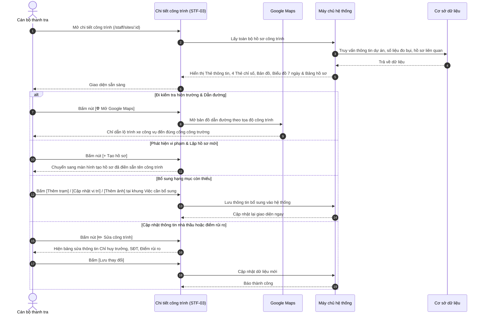

# STF-03 — Chi Tiết Công Trình & Hồ Sơ Kiểm Tra (Site Detail Dossier)

> **Tài liệu hướng dẫn & đặc tả màn hình — Hệ thống Quản trị Bụi Đô thị DustGuard VN**  
> Hồ sơ số của từng công trình xây dựng cụ thể: nắm bắt nhanh thông tin pháp lý và số điện thoại chỉ huy trưởng, theo dõi chỉ số bụi thực tế từ trạm đo cổng xe ra vào, xem biểu đồ xu hướng rủi ro 7 ngày, mở bản đồ Google Maps dẫn đường đến tận cổng công trường, kiểm tra các việc còn thiếu và lịch sử các vụ việc vi phạm.

---

## 1. Thông Tin Chung Về Màn Hình

| Thuộc tính | Thông tin chi tiết | Ghi chú |
|---|---|---|
| **Mã màn hình** | `STF-03` | Mã định danh màn hình trong hệ thống |
| **Tên màn hình** | Chi tiết công trình & Hồ sơ kiểm tra | Tên hiển thị trên thanh tiêu đề |
| **Tên tiếng Anh** | Construction Site Dossier & Detail | Tên hiển thị giao diện tiếng Anh |
| **Đường dẫn (URL)** | `/staff/sites/:id` | Đường dẫn theo mã công trình (VD: `/staff/sites/site-01`) |
| **File giao diện** | [`app/src/apps/staff/pages/sites/SiteDetailPage.jsx`](file:///d:/07-Competitions-Hackathons/unicef-dustguard/app/src/apps/staff/pages/sites/SiteDetailPage.jsx) | Mã nguồn trang giao diện React |
| **File xử lý dữ liệu** | [`app/server/routes/api/staff-sites.js`](file:///d:/07-Competitions-Hackathons/unicef-dustguard/app/server/routes/api/staff-sites.js) | File xử lý dữ liệu backend |
| **Khung bố cục** | [`app/src/apps/staff/layout/StaffLayout.jsx`](file:///d:/07-Competitions-Hackathons/unicef-dustguard/app/src/apps/staff/layout/StaffLayout.jsx) | Khung giao diện cán bộ |
| **Ai được sử dụng** | Cán bộ thanh tra môi trường, Đội trật tự đô thị, Lãnh đạo | Người dân không xem được thông tin nội bộ |

---

## 2. Mục Đích & Tình Huống Sử Dụng Thực Tế

### 2.1. Cán bộ dùng màn hình này khi nào?
Màn hình **STF-03** đóng vai trò là "Hồ sơ số toàn diện" của một công trình xây dựng. Trước khi đoàn kiểm tra xuất phát hoặc khi phát hiện công trình có dấu hiệu gây bụi, cán bộ mở màn hình này để nắm bắt nhanh các thông tin cốt lõi trong 30 giây:
1. **Thông tin pháp lý & Liên hệ ngay**: Biết rõ Chủ đầu tư, Tổng thầu thi công, Giấy phép xây dựng số mấy, Chỉ huy trưởng tên gì kèm nút bấm gọi điện trực tiếp 📞 để yêu cầu tưới nước dập bụi ngay.
2. **Số liệu đo bụi thực tế từ cổng công trường**: Xem nồng độ bụi PM2.5 và PM10 tức thời, đối chiếu với Quy chuẩn bụi môi trường **QCVN 05:2023/BTNMT** để biết bụi có đang vượt mức cho phép hay không.
3. **Biểu đồ rủi ro 7 ngày qua**: Xem mức độ ô nhiễm biến động thế nào trong tuần (tăng cao vào những ngày đào đất hay đổ bê tông).
4. **Nhắc nhở những việc còn thiếu**: Nhìn thấy ngay công trình nào chưa gắn trạm đo bụi, chưa cập nhật tọa độ GPS hoặc thiếu ảnh hiện trường để cán bộ yêu cầu bổ sung.
5. **Dẫn đường xe công vụ**: Bấm 1 nút **[Mở Google Maps]** để mở ứng dụng bản đồ dẫn đường chính xác tới cổng công trình.
6. **Lịch sử các lần kiểm tra**: Xem lại các biên bản và hồ sơ vi phạm trước đây của công trình này để kiểm tra xem nhà thầu đã khắc phục triệt để chưa.

### 2.2. Bảng 4 cấp độ đánh giá ô nhiễm tại công trình

| Mức đánh giá | Điểm rủi ro | Màu sắc | Hiện trạng thực tế tại công trình | Biện pháp xử lý của cán bộ |
|---|:---:|:---:|---|---|
| 🔴 **Rủi ro Cao** | $70 - 100$ | Đỏ son | Bụi vượt chuẩn liên tục; xe chở đất không rửa lốp; bạt che rách nhiều; có hồ sơ vi phạm đang mở. | Lập đoàn kiểm tra đột xuất ngay trong ngày; lập biên bản xử phạt hành chính. |
| 🟠 **Đang theo dõi** | $40 - 69$ | Cam đất | Có dấu hiệu phát tán bụi; hệ thống phun sương hoạt động chập chờn; dân có phản ánh. | Nhắn tin nhắc nhở Chỉ huy trưởng qua Zalo/SMS; yêu cầu tưới nước dập bụi trong 24h. |
| 🟡 **Rủi ro Thấp** | $25 - 39$ | Vàng | Đang hoàn thiện bên trong; xe ra vào ít; che chắn đạt yêu cầu. | Kiểm tra định kỳ theo kế hoạch tháng. |
| 🟢 **Đã ổn định** | $0 - 24$ | Xanh lá | Có trạm đo bụi hoạt động tốt; giàn rửa xe tự động sạch sẽ; đường xung quanh không bị vương vãi bùn đất. | Tiếp tục theo dõi tự động qua trạm đo; biểu dương công trình xanh. |

---

## 3. Đối Tượng Sử Dụng & Luồng Làm Việc Thực Tế

### 3.1. Ai sử dụng màn hình này?
- **Cán bộ thanh tra hiện trường**: Tra cứu thông tin công trình trước khi lên đường, mở Google Maps dẫn đường, bấm tạo hồ sơ vi phạm khi phát hiện sai phạm thực tế.
- **Cán bộ giám sát môi trường**: Theo dõi số liệu đo bụi hàng ngày, xuất file Excel kết quả đo để làm bằng chứng xử lý.
- **Lãnh đạo đơn vị**: Xem lại toàn bộ quá trình chấp hành và lịch sử khắc phục của từng nhà thầu.

### 3.2. Luồng thao tác thực tế khi kiểm tra công trình



---

## 4. Bố Cục Giao Diện & Khung Hình Trực Quan (Wireframe)

### 4.1. Khung hình trực quan trên màn hình máy tính

```text
+---------------------------------------------------------------------------------------------------------------+
| ĐIỀU HƯỚNG: Công trình / Chi tiết công trình                                                                  |
| TIÊU ĐỀ: "Chi tiết công trình"                      [+ Tạo hồ sơ]   [✏️ Sửa công trình]   [🌐 Mở Google Maps] |
|          Xem vị trí, chỉ số đo bụi gần đây và các hồ sơ kiểm tra liên quan.                                   |
+---------------------------------------------------------------------------------------------------------------+
| THẺ THÔNG TIN CHÍNH CỦA CÔNG TRÌNH:                                                                           |
| +-----------------------------------------------------------------------------------------------------------+ |
| | [🏢] Tên dự án: DỰ ÁN CẢI TẠO THOÁT NƯỚC & ĐƯỜNG ĐT743                       Mức rủi ro: [ RỦI RO CAO ] (Đỏ)|
| |      Địa chỉ: Đường ĐT743, Phường An Phú, TP. Thuận An                       Cập nhật: 14:30 02/09/2026    |
| |      Đơn vị thi công: Công ty CP Xây dựng Hạ tầng Đô thị UDIC               GPXD số: 142/GPXD-SXD         |
| |      Chỉ huy trưởng: Kỹ sư Nguyễn Văn An  ·  📞 0987.654.321 (Gọi trực tiếp) Trạm đo: Trạm 01 (Cổng xe ben)|
| +-----------------------------------------------------------------------------------------------------------+ |
+---------------------------------------------------------------------------------------------------------------+
| 4 THẺ CHỈ SỐ HOẠT ĐỘNG:                                                                                       |
| +--------------------+  +--------------------+  +--------------------+  +-----------------------------------+ |
| | 🛡️ Điểm rủi ro     |  | 🔔 Cảnh báo mở      |  | 📁 Hồ sơ vi phạm   |  | 📡 Trạm đo bụi                    | |
| |    78 / 100        |  |         5          |  |         2          |  |         1                         | |
| | Tăng 8 điểm tuần qua| | 5 cảnh báo mới     |  | Đang xử lý         |  | Đang đo liên tục 24/7             | |
| +--------------------+  +--------------------+  +--------------------+  +-----------------------------------+ |
+---------------------------------------------------------------------------------------------------------------+
| KHU VỰC GIỮA (3 Khối thông tin song song):                                                                    |
| +-----------------------------+ +----------------------------------+ +--------------------------------------+ |
| | VỊ TRÍ CÔNG TRÌNH (Bản đồ)  | | XU HƯỚNG RỦI RO 7 NGÀY QUA       | | ❓ VIỆC CẦN BỔ SUNG (Checklist)      | |
| | [ Bản đồ thu nhỏ ]          | | Mức độ ô nhiễm theo ngày:        | | ------------------------------------ | |
| | 📍 Ghim: Đường ĐT743, An Phú| |  82   79   85   80   78   75   78| | • Chưa có trạm đo cổng 2 [Thêm trạm] | |
| |                             | |  ██   ██   ██   ██   ██   ██   ██| | • Cập nhật tọa độ GPS   [Cập nhật]   | |
| |                             | | T2   T3   T4   T5   T6   T7   CN | • Bổ sung ảnh hiện trường [Thêm ảnh]  | |
| |                             | | (Màu đỏ: Ngày có bụi vượt chuẩn) | | ➔ Xem toàn bộ danh sách thiếu        | |
| +-----------------------------+ +----------------------------------+ +--------------------------------------+ |
+---------------------------------------------------------------------------------------------------------------+
| KHU VỰC DƯỚI (2 Bảng dữ liệu chi tiết):                                                                       |
| +---------------------------------------------------+ +-----------------------------------------------------+ |
| | 📁 HỒ SƠ VI PHẠM LIÊN QUAN   [Tất cả | Mở | Đã đóng]| | 📈 SỐ LIỆU ĐO BỤI GẦN ĐÂY         [📥 Xuất dữ liệu] | |
| |---------------------------------------------------| |-----------------------------------------------------| |
| | Mã HS    | Loại hồ sơ | Tiêu đề         |Trạng thái| | Thời gian| Trạm đo | Chỉ số bụi   | Giá trị  | Thao tác | |
| |----------+------------+-----------------+----------| |----------+---------+--------------+----------+----------| |
| | HS-26-12 | Khảo sát   | Bụi mù cổng số 1| Đang mở  | | 14:15:00 | Trạm 01 | PM2.5 / PM10 | 68 / 112 |  [Xem]   | |
| | HS-26-08 | Kiểm tra   | Bạt che rách    | Đã đóng  | | 14:00:00 | Trạm 01 | PM2.5 / PM10 | 72 / 120 |  [Xem]   | |
| | HS-26-02 | Nhắc nhở   | Xe không rửa lốp| Đã đóng  | | 13:45:00 | Trạm 01 | PM2.5 / PM10 | 54 / 98  |  [Xem]   | |
| +---------------------------------------------------+ +-----------------------------------------------------+ |
+---------------------------------------------------------------------------------------------------------------+
| KHUNG SỬA THÔNG TIN (Hiện khi bấm [✏️ Sửa công trình]):                                                        |
| [ Cập nhật Tên dự án, GPXD, Địa chỉ, Nhà thầu, Chỉ huy trưởng, Số điện thoại, Tọa độ GPS -> [Lưu thay đổi] ]   |
+---------------------------------------------------------------------------------------------------------------+
```

### 4.2. Chi tiết các khu vực hiển thị
1. **Thanh điều hướng & Nút bấm trên cùng**: Có đường dẫn quay lại danh sách công trình, nút `[+ Tạo hồ sơ]`, nút `[✏️ Sửa công trình]` và nút `[🌐 Mở Google Maps]`.
2. **Thẻ thông tin chính**: Thể hiện đầy đủ tên công trình (in đậm cỡ lớn), địa chỉ, nhà thầu thi công, số GPXD, tên và số điện thoại gọi ngay cho chỉ huy trưởng, mức độ rủi ro hiện tại.
3. **4 Thẻ chỉ số**: Điểm rủi ro (/100), số cảnh báo mở, số hồ sơ vi phạm đang xử lý, số trạm đo bụi đang hoạt động.
4. **Khu vực giữa**:
   - *Vị trí công trình*: Bản đồ thu nhỏ có ghim đỏ tại đúng vị trí công trường.
   - *Xu hướng 7 ngày*: Biểu đồ cột thể hiện mức độ ô nhiễm từng ngày trong tuần.
   - *Việc cần bổ sung*: Danh sách các giấy tờ hoặc hạng mục còn thiếu kèm nút làm ngay.
5. **Khu vực dưới**:
   - *Bảng hồ sơ vi phạm*: Danh sách các lần kiểm tra trước đây, có các tab lọc *Tất cả*, *Đang mở*, *Đã đóng*.
   - *Bảng số liệu đo bụi*: Danh sách các lần đo nồng độ bụi PM2.5 / PM10 gần nhất, kèm nút **[📥 Xuất dữ liệu]** ra file Excel.

---

## 5. Dữ Liệu & Liên Kết Hệ Thống

### 5.1. Dữ liệu chính của công trình
- **Thông tin pháp lý**: Mã công trình, tên dự án, địa chỉ, nhà thầu, số giấy phép xây dựng, chỉ huy trưởng, số điện thoại, tọa độ bản đồ.
- **Số liệu đo đạc**: Nồng độ bụi PM2.5 / PM10 tức thời, tên trạm đo, thời gian đo gần nhất.
- **Lịch sử hồ sơ**: Danh sách các vụ việc kiểm tra và xử lý vi phạm liên quan đến công trình này.

### 5.2. Mẫu dữ liệu trao đổi đơn giản
```json
{
  "id": "site_01",
  "code": "CT-26-0001",
  "name": "Dự án Cải tạo Thoát nước & Đường ĐT743",
  "address": "Đường ĐT743, Phường An Phú, TP. Thuận An",
  "contractorName": "Công ty CP Xây dựng Hạ tầng Đô thị UDIC",
  "managerName": "Nguyễn Văn An",
  "managerPhone": "0987654321",
  "dustRiskScore": 78,
  "riskLevel": "Rủi ro cao",
  "kpis": {
    "dustRiskScore": 78,
    "openAlertsCount": 5,
    "openCasesCount": 2,
    "activeSensorsCount": 1
  },
  "missingItems": [
    { "id": 1, "title": "Chưa có trạm đo bụi cổng số 2", "action": "Thêm trạm" },
    { "id": 2, "title": "Chưa có ảnh chụp nghiệm thu dập bụi", "action": "Thêm ảnh" }
  ]
}
```

---

## 6. Bảng Nút Bấm & Thao Tác Chi Tiết

| Nút bấm / Thao tác | Vị trí | Hành động khi bấm | Ai được bấm |
|---|---|---|:---:|
| **`[+ Tạo hồ sơ]`** | Góc trên bên phải | Mở bảng lập hồ sơ kiểm tra mới, tự điền sẵn tên công trình này. | Cán bộ, Quản trị viên |
| **`[✏️ Sửa công trình]`** | Góc trên bên phải | Mở bảng cập nhật lại thông tin nhà thầu, chỉ huy trưởng, số điện thoại, điểm rủi ro. | Cán bộ, Quản trị viên |
| **`[🌐 Mở Google Maps]`** | Góc trên bên phải | Mở ứng dụng Google Maps chỉ đường xe công vụ đến đúng cổng công trường. | Tất cả cán bộ |
| **`[Thêm trạm]`** | Khung Việc cần bổ sung | Mở bảng gán thêm một trạm cảm biến đo bụi mới cho công trình. | Cán bộ quản lý |
| **`[Cập nhật vị trí]`** | Khung Việc cần bổ sung | Mở bản đồ để chọn lại vị trí cổng công trình chính xác hơn. | Cán bộ quản lý |
| **`[Thêm ảnh]`** | Khung Việc cần bổ sung | Mở khung chọn ảnh chụp thực tế tại công trường để tải lên. | Cán bộ thanh tra |
| **`[Xem hồ sơ]`** | Bảng Hồ sơ liên quan | Mở trang chi tiết hồ sơ vụ việc (`/staff/cases/:id`) để xem biên bản. | Tất cả cán bộ |
| **`[📥 Xuất dữ liệu]`** | Bảng Số liệu đo bụi | Tải file Excel danh sách các chỉ số đo bụi về máy tính. | Tất cả cán bộ |

---

## 7. Quy Chuẩn Giao Diện Sáng Màu & Dễ Nhìn

### 7.1. Tông màu sáng, tương phản cao, dễ nhìn ngoài thực địa
- **Nền trang**: Màu kem sáng nhạt (`#FAFAF9`), nhìn lâu không chói mắt.
- **Thẻ nội dung**: Nền trắng tinh (`#FFFFFF`), có đường viền xám mềm mại (`#E7E5E4`), tuyệt đối không dùng hiệu ứng mờ kính (No Glassmorphism).
- **Màu chữ**: Màu đen đậm in sắc nét (`#1C1917`), đảm bảo đọc tốt khi cán bộ dùng máy tính bảng ngoài trời nắng.
- **Bản đồ thu nhỏ**: Tự động lấy tâm theo vị trí công trình; nếu chưa có tọa độ sẽ hiện bản đồ mặc định khu vực trung tâm, không làm trắng trang.
- **Tên công trình**: Tự động xuống dòng tự nhiên, không bao giờ bị che khuất chữ.

### 7.2. Tương thích trên máy tính và điện thoại
- **Trên máy tính 14-inch**: Bố cục chia 3 khối ở giữa (Bản đồ, Biểu đồ 7 ngày, Việc cần bổ sung) và 2 bảng dữ liệu lớn ở dưới, hiển thị vừa vặn không bị tràn ngang.
- **Trên điện thoại**: Các khối tự xếp chồng dọc, số điện thoại chỉ huy trưởng có thể bấm để gọi trực tiếp ngay từ điện thoại.

---

## 8. Các Tình Huống Lỗi Thường Gặp & Cách Xử Lý

### 8.1. Các lỗi thực tế hay gặp
1. **Công trình chưa có tọa độ GPS**: Bản đồ tự động gán vị trí trung tâm quận/huyện và hiện khung nhắc nhở cán bộ cập nhật vị trí.
2. **Chưa có số liệu đo bụi nào**: Bảng hiển thị thông báo thân thiện *"Chưa có dữ liệu đo bụi từ trạm"*, không gây đơ trang.
3. **Sửa công trình nhưng để trống tên**: Hệ thống hiển thị thông báo nhắc nhở bằng tiếng Việt rõ ràng, không cho lưu thông tin rỗng.
4. **Mất mạng khi đang tải ảnh**: Hệ thống hiện nút bấm **[Thử lại]** để cán bộ gửi lại ảnh mà không phải chọn lại từ đầu.

### 8.2. Lệnh kiểm tra nhanh cho kỹ thuật viên
Chạy trực tiếp trên cửa sổ PowerShell:
```powershell
# 1. Kiểm tra giao diện chi tiết công trình
node --test app/tests/staff-sites-mockup4-5.test.js

# 2. Kiểm tra các chức năng xem và sửa thông tin công trình
node --test app/tests/site-controller.test.js

# 3. Kiểm tra toàn diện hệ thống
npm --prefix app run verify:quick
```
