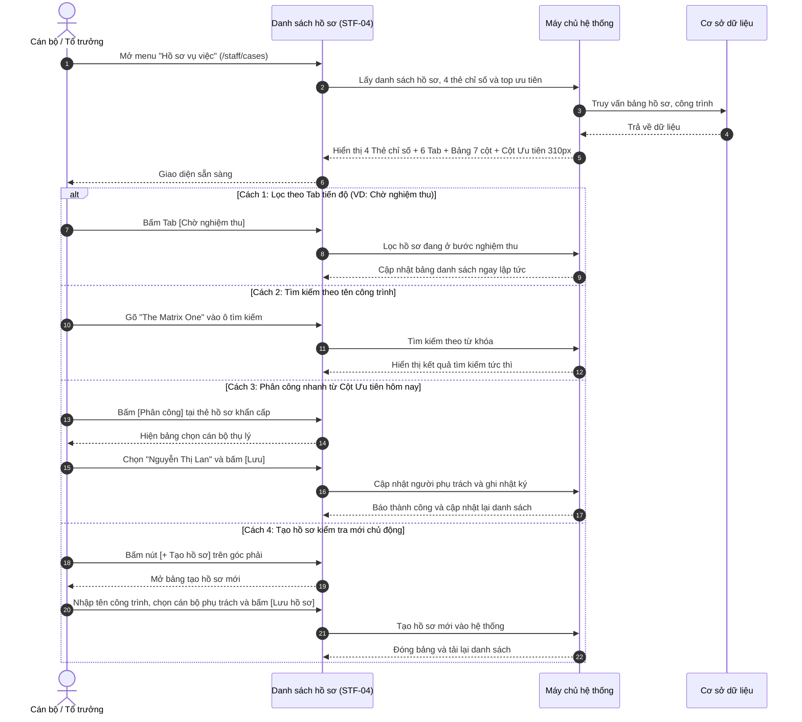

# STF-04 — Danh Sách Hồ Sơ Vụ Việc Xử Lý Vi Phạm (Cases Management List)

> **Tài liệu hướng dẫn & đặc tả màn hình — Hệ thống Quản trị Bụi Đô thị DustGuard VN**  
> Trung tâm điều hành và theo dõi toàn bộ các hồ sơ vi phạm phát tán bụi xây dựng trên địa bàn: kiểm soát quy trình xử lý 7 bước rõ ràng từ tiếp nhận đến nghiệm thu, đồng hồ đếm ngược hạn xử lý 48 giờ theo quy chế một cửa, lọc nhanh qua 6 tab tiến độ và cột việc ưu tiên khẩn cấp trong ngày.

---

## 1. Thông Tin Chung Về Màn Hình

| Thuộc tính | Thông tin chi tiết | Ghi chú |
|---|---|---|
| **Mã màn hình** | `STF-04` | Mã định danh màn hình trong hệ thống |
| **Tên màn hình** | Danh sách hồ sơ vụ việc xử lý vi phạm | Tên hiển thị trên menu điều hướng |
| **Tên tiếng Anh** | Cases Management & Pipeline List | Tên hiển thị giao diện tiếng Anh |
| **Đường dẫn (URL)** | `/staff/cases` | Địa chỉ truy cập chính |
| **File giao diện** | [`app/src/apps/staff/pages/cases/CasesListPage.jsx`](file:///d:/07-Competitions-Hackathons/unicef-dustguard/app/src/apps/staff/pages/cases/CasesListPage.jsx) | Mã nguồn trang giao diện React |
| **File xử lý dữ liệu** | [`app/server/routes/api/staff-cases.js`](file:///d:/07-Competitions-Hackathons/unicef-dustguard/app/server/routes/api/staff-cases.js) | File xử lý dữ liệu backend |
| **Quy định quy trình** | [`app/server/domain/cases/case.rules.js`](file:///d:/07-Competitions-Hackathons/unicef-dustguard/app/server/domain/cases/case.rules.js) | Quy định 7 bước xử lý hồ sơ |
| **Khung bố cục** | [`app/src/apps/staff/layout/StaffLayout.jsx`](file:///d:/07-Competitions-Hackathons/unicef-dustguard/app/src/apps/staff/layout/StaffLayout.jsx) | Khung giao diện cán bộ |
| **Ai được sử dụng** | Cán bộ thanh tra, Tổ trưởng ca trực, Lãnh đạo | Người dân và nhà thầu không truy cập được |

---

## 2. Mục Đích & Tình Huống Sử Dụng Thực Tế

### 2.1. Cán bộ dùng màn hình này khi nào?
Trong công tác quản lý trật tự đô thị và môi trường, việc xử lý vi phạm phát tán bụi thường gặp khó khăn vì hồ sơ giấy tờ phân tán, dễ trôi việc và khó nhớ hạn xử lý 48 giờ theo quy định. Màn hình **STF-04** giúp cán bộ:
1. **Theo dõi quy trình xử lý 7 bước rõ ràng, minh bạch**:
   $$\text{1. Tiếp nhận} \longrightarrow \text{2. Xác minh} \longrightarrow \text{3. Thông báo} \longrightarrow \text{4. Khảo sát} \longrightarrow \text{5. Đề xuất} \longrightarrow \text{6. Thẩm định} \longrightarrow \text{7. Hoàn tất}$$
   Mọi hồ sơ đều được theo dõi chặt chẽ từng bước, không bị bỏ sót khâu nào.
2. **Kiểm soát hạn xử lý 48 giờ**: Đồng hồ đếm ngược tự động tính toán thời hạn, đổi màu đỏ nhắc nhở khi còn dưới 12 giờ hoặc đã quá hạn để cán bộ xử lý kịp thời.
3. **Phân loại nhanh qua 6 Tab tiến độ**:
   - *Tất cả*: Toàn bộ hồ sơ đang có trong hệ thống.
   - *Mới tiếp nhận*: Hồ sơ mới tạo từ phản ánh của dân hoặc trạm đo bụi báo về.
   - *Đang làm*: Đang phân công cán bộ đi kiểm tra hoặc lập biên bản.
   - *Chờ nhà thầu*: Đã gửi thông báo, đang đợi nhà thầu khắc phục dập bụi.
   - *Chờ nghiệm thu*: Nhà thầu đã báo sửa xong, chờ cán bộ kiểm tra lại.
   - *Đã đóng*: Hồ sơ đã xử lý xong và lưu trữ.
4. **Cột "Ưu tiên hôm nay" (Nằm bên phải rộng 310px)**: Tự động đưa lên đầu 3 hồ sơ khẩn cấp nhất (ô nhiễm nặng nhất hoặc sắp hết hạn 48h) để phân công người xử lý ngay.

### 2.2. So sánh cách làm cũ và cách làm mới

| Tiêu chí | Làm theo sổ tay, giấy tờ & Zalo | Làm trên màn hình STF-04 DustGuard VN |
|---|---|---|
| **Theo dõi hạn 48 giờ** | Ghi sổ tay, rất dễ quên khi có nhiều hồ sơ cùng lúc. | Đồng hồ đếm lùi tự động, hiện huy hiệu đỏ cảnh báo khi sắp hết hạn. |
| **Xem trạng thái hồ sơ** | Phải hỏi từng cán bộ xem vụ việc đã xử lý đến đâu. | Bấm chuyển các Tab là thấy ngay hồ sơ nào đang ở bước nào. |
| **Giao việc cho cán bộ** | Gọi điện thoại hoặc nhắn tin riêng lẻ, khó kiểm tra trách nhiệm. | Bấm nút **[Phân công]**, chọn tên cán bộ là xong, hệ thống lưu vết rõ ràng. |
| **Chọn việc làm trước** | Làm theo cảm tính hoặc ưu tiên nơi nào phản ánh gay gắt. | Tự động chấm điểm rủi ro và xếp các vụ việc khẩn cấp lên đầu. |

---

## 3. Đối Tượng Sử Dụng & Luồng Làm Việc Thực Tế

### 3.1. Ai sử dụng màn hình này?
- **Cán bộ thanh tra viên**: Xem các hồ sơ mình được phân công phụ trách, mở hồ sơ để xem nội dung phản ánh và chuẩn bị đi kiểm tra công trình.
- **Tổ trưởng ca trực / Đội phó**: Nắm bắt toàn bộ hồ sơ của đội, phát hiện các hồ sơ sắp trễ hạn để đôn đốc, tạo hồ sơ mới và giao việc cho cán bộ.
- **Lãnh đạo cơ quan**: Kiểm tra tỷ lệ xử lý hồ sơ đúng hạn, theo dõi các vụ việc ô nhiễm nặng.

### 3.2. Luồng thao tác điều phối hồ sơ



---

## 4. Bố Cục Giao Diện & Khung Hình Trực Quan (Wireframe)

### 4.1. Khung hình trực quan trên màn hình máy tính

```text
+---------------------------------------------------------------------------------------------------------+
| TIÊU ĐỀ: Hồ sơ đang xử lý                                    [+ Tạo hồ sơ] (Đỏ son)   [Xuất danh sách]  |
|          Theo dõi tiến độ, người phụ trách và bước xử lý của từng hồ sơ vi phạm.                         |
+---------------------------------------------------------------------------------------------------------+
| 4 THẺ CHỈ SỐ HOẠT ĐỘNG:                                                                                 |
| +--------------------+ +--------------------+ +--------------------+ +--------------------------------+ |
| | 📁 Hồ sơ đang mở   | | ⏰ Gần đến hạn 48h | | 🔍 Chờ đi khảo sát | | ✅ Chờ nghiệm thu              | |
| |        38          | |        11          | |         9          | |         7                    | |
| | Tăng 6 so với hôm qua| Tăng 3 so với hôm qua| Trong 3 ngày tới   | | Nhà thầu đã báo sửa xong     | |
| +--------------------+ +--------------------+ +--------------------+ +--------------------------------+ |
+---------------------------------------------------------------------------------------------------------+
| DẢI 6 NÚT CHUYỂN TAB TIẾN ĐỘ:                                                                           |
| [Tất cả (38)]  [Mới (8)]  [Đang làm (18)]  [Chờ nhà thầu (6)]  [Chờ nghiệm thu (7)]  [Đã đóng (42)]     |
+------------------------------------------------------------------------------------+--------------------+
| BẢNG DANH SÁCH HỒ SƠ CHÍNH (~75% Chiều ngang)                                      | CỘT PHỤ (25% ~310px|
| +--------------------------------------------------------------------------------+ | ⭐ ƯU TIÊN HÔM NAY |
| | [🔍 Tìm kiếm hồ sơ...] [Bước hiện tại: Tất cả ▼] [Phụ trách: Tất cả ▼] [⚙️ Lọc] | | Cần xử lý trước hạn|
| +--------------------------------------------------------------------------------+ | ------------------ |
| | CÁC CỘT DỮ LIỆU:                                                               | | 🔴 QUÁ HẠN         |
| | Mã HS     | Công trình       | Bước hiện tại   | Phụ trách | Hạn xử lý| TT    | Mã: HS-26-0042     |
| | ----------+------------------+-----------------+-----------+----------+-------| The Matrix One     |
| | HS-26-0042| The Matrix One   | Kiểm tra hiện   | (NL) Lan  | 02/09 14h| ĐỎ    | 🕒 Quá hạn 2 giờ   |
| |           | Lê Quang Đạo     | trường          |           | (Quá hạn)|       | [ Mở ] [Phân công] |
| | HS-26-0039| Keangnam Phase 2 | Chờ nhà thầu    | (LM) Minh | 03/09 18h| CAM   | ------------------ |
| |           | Phạm Hùng        | khắc phục       |           | (Gần hạn)|       | 🟠 GẦN ĐẾN HẠN     |
| | HS-26-0035| Goldmark City    | Chờ nghiệm thu  | (TA) Tuấn | 05/09 09h| XANH  | Mã: HS-26-0039     |
| |           | Hồ Tùng Mậu      | hiện trường     |           | (Đang làm| DƯƠNG | Cầu vượt Mai Dịch  |
| | HS-26-0028| Vinhomes Smart C.| Đã hoàn tất     | (HN) Nam  | 28/08 17h| XANH  | [ Mở ] [Phân công] |
| |           | Tây Mỗ           | đóng hồ sơ      |           | (Đã xong)| LÁ    | ------------------ |
| +--------------------------------------------------------------------------------+ | ➔ Xem tất cả ưu tiên|
| | Phân trang: Hiển thị 1 đến 7 trong tổng số 38 hồ sơ     [Trước] [ 1 ] [ 2 ] [Sau]| +--------------------+
+------------------------------------------------------------------------------------+--------------------+
| KHUNG TẠO HỒ SƠ KIỂM TRA MỚI (Hiện khi bấm [+ Tạo hồ sơ]):                                              |
| • Tên công trình / Vụ việc *: [Nhập tên công trình hoặc vị trí phát sinh bụi...]                        |
| • Cán bộ phụ trách: [Chọn cán bộ: Nguyễn Thị Lan / Lê Văn Minh / Phạm Tuấn Anh]                         |
| • Nút bấm: [ Hủy ]  [ Lưu hồ sơ ] (Đỏ son)                                                              |
+---------------------------------------------------------------------------------------------------------+
```

### 4.2. Chi tiết các thành phần trên giao diện
1. **Thanh tiêu đề**: Có tên trang "Hồ sơ đang xử lý", nút `[+ Tạo hồ sơ]` màu đỏ son và nút `[Xuất danh sách]` ra file báo cáo.
2. **4 Thẻ chỉ số**: Hồ sơ đang mở (38), Gần đến hạn 48h (11), Chờ đi khảo sát (9), Chờ nghiệm thu (7).
3. **Dải 6 Tab tiến độ**: Thiết kế dạng nút tròn mềm mại, có số lượng hồ sơ thực tế đi kèm.
4. **Bảng danh sách hồ sơ (75% bên trái)**:
   - *Ô tìm kiếm*: Tìm nhanh theo mã hồ sơ, tên công trình hoặc địa chỉ.
   - *Cột Mã*: Font chữ rõ ràng (VD: `HS-26-0042`).
   - *Cột Công trình*: Tên công trình in đậm, tự động xuống dòng, không bị che mất chữ.
   - *Cột Bước hiện tại*: Huy hiệu màu nổi bật ghi rõ công việc đang làm (Kiểm tra hiện trường, Chờ nghiệm thu...).
   - *Cột Phụ trách*: Tên cán bộ đang thụ lý hồ sơ.
   - *Cột Hạn xử lý*: Ngày giờ cụ thể, tự đổi màu đỏ nếu quá hạn.
   - *Cột Thao tác*: Nút `[Mở]` để xem chi tiết và nút `[Sửa]`.
5. **Cột Ưu tiên hôm nay (25% bên phải, rộng 310px)**: Hiển thị 3 hồ sơ khẩn cấp nhất kèm nút **[Mở]** và **[Phân công]** nhanh.

---

## 5. Dữ Liệu & Liên Kết Hệ Thống

### 5.1. Dữ liệu chính trên màn hình
- **Số liệu 4 thẻ đầu trang & số đếm từng Tab**: Tự động tính toán theo danh sách hồ sơ trong hệ thống.
- **Danh sách hồ sơ chi tiết**: Mã hồ sơ, tên vụ việc, tên công trình, địa chỉ, bước hiện tại, cán bộ phụ trách, hạn xử lý và trạng thái màu sắc.
- **Danh sách hồ sơ ưu tiên**: 3 hồ sơ có điểm rủi ro cao nhất hoặc cận hạn xử lý 48 giờ nhất.

### 5.2. Mẫu dữ liệu trao đổi đơn giản
```json
{
  "openCases": 38,
  "nearDeadlineCount": 11,
  "pendingInspectionCount": 9,
  "pendingVerificationCount": 7,
  "items": [
    {
      "id": "case-01",
      "code": "HS-26-0042",
      "title": "Xử lý phát tán bụi tại Dự án The Matrix One",
      "siteName": "Dự án The Matrix One",
      "address": "Số 1 Lê Quang Đạo, Nam Từ Liêm, Hà Nội",
      "currentStep": "Kiểm tra hiện trường",
      "assigneeName": "Nguyễn Thị Lan",
      "deadline": "02/09/2026 14:00",
      "status": "Quá hạn",
      "statusColor": "red"
    }
  ]
}
```

---

## 6. Bảng Nút Bấm & Thao Tác Chi Tiết

| Nút bấm / Thao tác | Vị trí | Hành động khi bấm | Ai được bấm |
|---|---|---|:---:|
| **`[+ Tạo hồ sơ]`** | Góc trên bên phải | Mở bảng tạo hồ sơ kiểm tra mới, nhập tên công trình và chọn người phụ trách. | Cán bộ, Quản trị viên |
| **`[Xuất danh sách]`** | Cạnh nút Tạo hồ sơ | Tải về file danh sách các hồ sơ phục vụ cuộc họp giao ban. | Tất cả cán bộ |
| **`[6 Tab tiến độ]`** | Dải nút dưới thẻ KPI | Lọc danh sách hồ sơ theo từng bước nghiệp vụ (*Tất cả, Mới, Đang làm, Chờ nhà thầu, Chờ nghiệm thu, Đã đóng*). | Tất cả cán bộ |
| **`[Ô tìm kiếm]`** | Đầu bảng danh sách | Gõ tên công trình hoặc mã hồ sơ để tìm kiếm kết quả ngay. | Tất cả cán bộ |
| **`[Mở]`** | Cột cuối mỗi dòng | Mở màn hình chi tiết hồ sơ (`/staff/cases/:id`) để xử lý tiếp. | Tất cả cán bộ |
| **`[Sửa]`** | Cột cuối mỗi dòng | Mở bảng sửa thông tin vụ việc hoặc đổi người phụ trách. | Cán bộ thụ lý, Quản trị viên |
| **`[Phân công nhanh]`** | Thẻ hồ sơ ở Cột Ưu tiên | Mở nhanh bảng chọn cán bộ thụ lý hồ sơ khẩn cấp. | Tổ trưởng, Quản trị viên |

---

## 7. Quy Chuẩn Giao Diện Sáng Màu & Dễ Nhìn

### 7.1. Tông màu sáng, tương phản cao, rõ ràng
- **Nền trang**: Màu kem sáng nhạt (`#FDFBF7`), không gây lóa mắt.
- **Nền bảng & thẻ**: Màu trắng nguyên khối (`#FFFFFF`), có viền xám mềm mại (`#E7E5E4`), tuyệt đối không dùng hiệu ứng mờ kính (No Glassmorphism).
- **Màu chữ**: Màu đen mực đậm (`#1C1917`), độ tương phản cao, chữ to rõ dễ đọc.
- **Màu sắc trạng thái**:
  - *Quá hạn / Khẩn cấp*: Màu đỏ son (`#B91C1C`).
  - *Gần đến hạn*: Màu cam đất (`#EA580C`).
  - *Đang xử lý*: Màu xanh dương (`#2563EB`).
  - *Đã hoàn thành*: Màu xanh lá cây (`#16A34A`).
- **Tên công trình**: Tự động xuống dòng tự nhiên, không bao giờ bị cắt ngắn bằng dấu ba chấm (`...`).

### 7.2. Tương thích trên máy tính và điện thoại
- **Trên máy tính 14-inch**: Bố cục 2 cột cân đối: 75% Bảng danh sách bên trái + 25% (310px) Cột ưu tiên bên phải.
- **Trên điện thoại**: Dải 6 Tab hỗ trợ vuốt trượt ngang êm ái, bảng danh sách có thanh cuộn ngang an toàn, các nút bấm to dễ chạm bằng ngón tay.

---

## 8. Các Tình Huống Lỗi Thường Gặp & Cách Xử Lý

### 8.1. Các lỗi thực tế hay gặp
1. **Lọc không có hồ sơ nào**: Hệ thống hiển thị thông báo rõ ràng *"Không tìm thấy hồ sơ phù hợp trong hệ thống"*, không để bảng bị trắng trơn.
2. **Tên công trình rất dài**: Tự động xuống 2-3 dòng vừa vặn, không làm lệch các cột khác.
3. **Tạo hồ sơ nhưng quên nhập tên công trình**: Hệ thống nhắc nhở bằng tiếng Việt ngay tại ô nhập liệu và chưa cho bấm lưu.
4. **Mất kết nối mạng**: Hệ thống hiển thị thông báo nhắc kiểm tra đường truyền và có nút bấm tải lại.

### 8.2. Lệnh kiểm tra nhanh cho kỹ thuật viên
Chạy trực tiếp trên cửa sổ PowerShell:
```powershell
# 1. Kiểm tra tính năng danh sách hồ sơ
node --test app/tests/staff-cases-mockup6-7.test.js

# 2. Kiểm tra quy trình xử lý hồ sơ 7 bước
node --test app/tests/case-enforcement-dag-7steps.test.js

# 3. Kiểm tra toàn diện hệ thống
npm --prefix app run verify:quick
```
