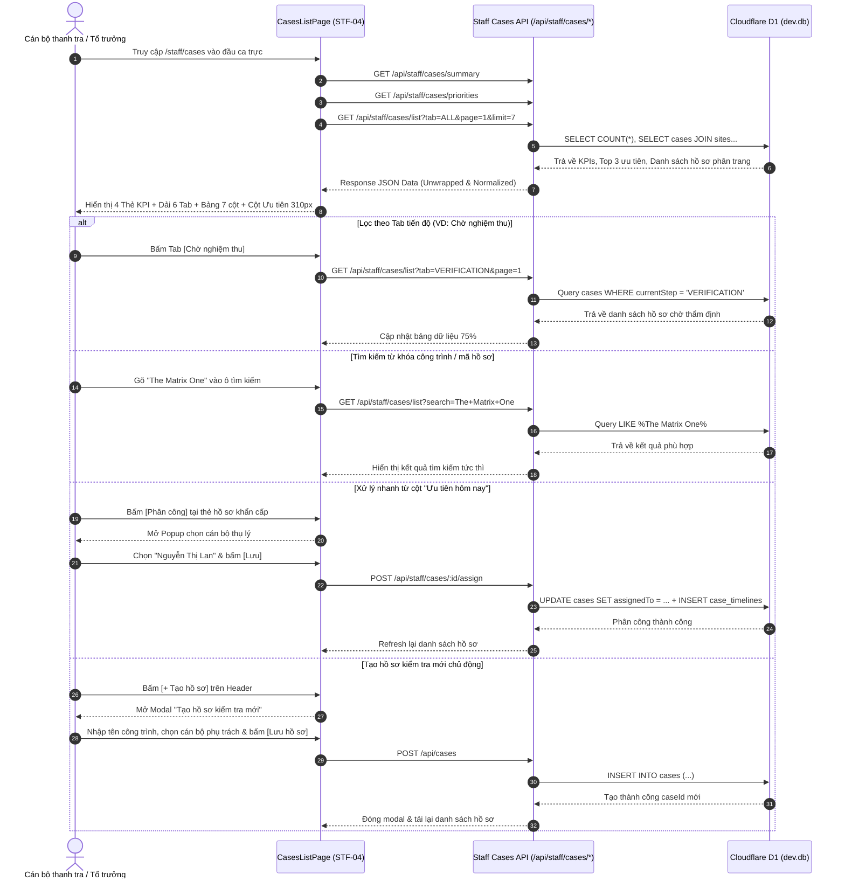

# STF-04 — Danh Sách Hồ Sơ Vụ Việc Xử Lý Vi Phạm (Cases Management List)

> **Tài liệu đặc tả màn hình chuẩn SSOT (Single Source of Truth) — DustGuard VN CivicTech Platform**  
> Trung tâm điều hành và theo dõi toàn bộ hồ sơ vi phạm phát tán bụi xây dựng trên toàn địa bàn quản lý theo chu trình State Machine DAG 7 bước chuẩn hành chính Việt Nam, đếm ngược hạn định SLA 48 giờ, hợp nhất CSDL Cloudflare D1 / SQLite `dev.db`.

---

## 1. Screen Identity

| Thuộc tính | Giá trị SSOT | Ghi chú kỹ thuật |
|---|---|---|
| **Mã màn hình** | `STF-04` | Định danh phân hệ Quản lý Hồ sơ Vụ việc |
| **Tên tiếng Việt** | Danh Sách Hồ Sơ Vụ Việc Xử Lý Vi Phạm Môi Trường | Tên hiển thị chính thức trên hệ thống tác nghiệp |
| **Tên tiếng Anh** | Cases Management & Enforcement Pipeline List | Tên chuẩn hóa đối ngoại & API |
| **Đường dẫn (Route)** | `/staff/cases` | Canonical Route (Redirects: `/staff/cases/list`, `/staff/pipeline`) |
| **Component Path** | [`app/src/apps/staff/pages/cases/CasesListPage.jsx`](file:///d:/07-Competitions-Hackathons/unicef-dustguard/app/src/apps/staff/pages/cases/CasesListPage.jsx) | React 19 Client Component (Mockup 6 Layout) |
| **Backend API Route** | [`app/server/routes/api/staff-cases.js`](file:///d:/07-Competitions-Hackathons/unicef-dustguard/app/server/routes/api/staff-cases.js) | REST Endpoints kết nối trực tiếp SQLite / D1 |
| **Domain State Machine** | [`app/server/domain/cases/case.rules.js`](file:///d:/07-Competitions-Hackathons/unicef-dustguard/app/server/domain/cases/case.rules.js) | 7-Step DAG State Machine & RBAC Guards |
| **Layout bọc** | [`app/src/apps/staff/layout/StaffLayout.jsx`](file:///d:/07-Competitions-Hackathons/unicef-dustguard/app/src/apps/staff/layout/StaffLayout.jsx) | Khung điều hành Cán bộ thanh tra, Sidebar 12 phân hệ |
| **Vai trò truy cập (Role)** | `staff`, `inspector`, `executive`, `admin`, `demo_admin` | Chặn quyền `citizen`, `contractor`, `public` |
| **Trạng thái thực thi** | **ACTIVE (Level 5 Production Coherent)** | Kết nối 100% CSDL D1 SQLite thật, Zero-Mock |

---

## 2. Mục Đích & Giá Trị Thực Tế

### 2.1. Giải quyết bài toán nghiệp vụ hành chính môi trường
Trong công tác quản lý trật tự xây dựng và bảo vệ môi trường đô thị tại Việt Nam, việc xử lý vi phạm phát tán bụi thường gặp các rào cản lớn: hồ sơ giấy tờ phân tán, thông tin phản ánh từ người dân bị chậm trễ, khó kiểm soát thời hạn tiếp nhận và xử lý (SLA), việc phân công cán bộ và theo dõi hiện trường thiếu tính liên tục.

Màn hình **STF-04 (Cases Management List)** đóng vai trò là bảng điều phối số tập trung giải quyết triệt để các vấn đề trên:
1. **Thực thi Chu trình 7 bước DAG chuẩn hóa hành chính**:
   $$\text{1. Tiếp nhận} \longrightarrow \text{2. Xác minh} \longrightarrow \text{3. Thông báo} \longrightarrow \text{4. Khảo sát} \longrightarrow \text{5. Đề xuất} \longrightarrow \text{6. Thẩm định} \longrightarrow \text{7. Hoàn tất}$$
   Mọi hồ sơ đều được quản lý theo luồng trạng thái chặt chẽ, chống nhảy cóc quy trình và chống bỏ sót khâu nghiệp vụ.
2. **Kiểm soát nghiêm ngặt thời hạn SLA 48 giờ**:
   Hệ thống tự động kích hoạt đồng hồ đếm ngược SLA ngay khi hồ sơ được tạo (`createdAt`), đổi màu cảnh báo trực quan khi thời gian xử lý còn dưới 12 giờ hoặc đã quá hạn, bảo đảm đúng quy định tiếp nhận giải quyết phản ánh công dân theo quy chế một cửa.
3. **Phân loại tác nghiệp linh hoạt qua 6 Tab tiến độ**:
   Cho phép cán bộ thanh tra lọc ngay hồ sơ theo các chặng nghiệp vụ trọng tâm: *Tất cả*, *Mới tiếp nhận*, *Đang làm*, *Chờ nhà thầu khắc phục*, *Chờ nghiệm thu hiện trường*, và *Đã đóng lưu trữ*.
4. **Bảng "Ưu tiên hôm nay" (Priority Panel 310px)**:
   Tự động tính toán và đưa lên đầu ca trực 3 hồ sơ có điểm rủi ro môi trường cao nhất ($R \in [0, 100]$) hoặc cận hạn SLA nhất để cán bộ ra quyết định phân công hoặc đi hiện trường ngay lập tức.

### 2.2. So sánh thực tế: Cách làm truyền thống vs DustGuard VN

| Tiêu chí so sánh | Quy trình truyền thống (Giấy / Excel / Zalo) | DustGuard VN (Màn hình STF-04) |
|---|---|---|
| **Theo dõi hạn định SLA** | Phụ thuộc sổ tay ghi chép, dễ trôi việc khi khối lượng hồ sơ lớn | Đồng hồ đếm ngược SLA 48h tự động, badge đỏ cảnh báo trực quan |
| **Phân loại trạng thái** | Ghi chú văn bản tự do, khó lọc và thống kê tổng thể | 6 Tab nghiệp vụ đồng bộ trực tiếp với CSDL D1 SQLite |
| **Phân công cán bộ** | Gọi điện, nhắn tin rời rạc, khó truy cứu trách nhiệm | Phân công 1-chạm, tự động sinh bản ghi audit timeline minh bạch |
| **Thứ tự ưu tiên xử lý** | Cảm tính, ưu tiên theo người gọi hoặc nơi phản ánh gắt gao | Thuật toán xếp hạng đa tiêu chí (Điểm rủi ro bụi $R$, đối tượng nhạy cảm tiếp giáp, hạn SLA) |
| **Tính liên thông dữ liệu** | Hồ sơ phản ánh tách rời biên bản kiểm tra và ảnh hiện trường | Liên kết 1-1 giữa Phản ánh $\rightarrow$ Công trình $\rightarrow$ Biên bản QCVN $\rightarrow$ Kho ảnh SHA-256 |

---

## 3. Đối Tượng Người Dùng & Hành Trình Thao Tác (User Journey)

### 3.1. Đối tượng sử dụng chính
- **Cán bộ thanh tra môi trường (Staff / Inspector)**: Theo dõi danh sách hồ sơ được phân công, tra cứu nhanh tình trạng công trình trước khi xuống hiện trường, mở hồ sơ để cập nhật biên bản khảo sát 10 tiêu chuẩn.
- **Tổ trưởng ca trực / Cán bộ điều phối**: Nắm bắt khối lượng công việc toàn đơn vị, phát hiện các hồ sơ sắp quá hạn SLA, tạo hồ sơ thanh tra mới và phân công cán bộ thụ lý.
- **Lãnh đạo cơ quan / Ban chỉ đạo (Executive / Admin)**: Giám sát tỷ lệ xử lý hồ sơ đúng hạn, kiểm tra các vụ việc có điểm rủi ro cao ở khu vực đông dân cư hoặc gần trường học.

### 3.2. Sơ đồ luồng tác nghiệp chuẩn (Core Flow Diagram)



### 3.3. Các kịch bản tác nghiệp thực tế tại cơ quan quản lý
- **Kịch bản 1 — Đầu ca trực (Triage & Điều phối công việc)**: Cán bộ trực mở màn hình STF-04 $\rightarrow$ nhìn 4 thẻ KPI để nắm tổng số vụ việc mở (38) và số vụ việc gần đến hạn SLA (11) $\rightarrow$ bấm Tab `Mới` $\rightarrow$ chọn hồ sơ mới phát sinh từ cảnh báo trạm đo bụi PM10 $\rightarrow$ bấm [Phân công] để giao cho thanh tra viên địa bàn.
- **Kịch bản 2 — Chuẩn bị đi kiểm tra hiện trường**: Cán bộ chuẩn bị rời trụ sở mở Tab `Chờ khảo sát` $\rightarrow$ tìm kiếm tên tuyến đường $\rightarrow$ bấm [Mở] để tải trước nội dung phản ánh và checklist 10 tiêu chuẩn QCVN 18/QĐ 48 trước khi tới công trường.
- **Kịch bản 3 — Thẩm định kết quả khắc phục**: Cán bộ lọc Tab `Chờ nghiệm thu` $\rightarrow$ kiểm tra các vụ việc nhà thầu đã gửi ảnh Before/After $\rightarrow$ bấm [Mở] để đối chiếu mã băm SHA-256 và bán kính Geofence $\le 50\text{m}$.

---

## 4. Bố Cục Giao Diện & Phân Cấp Thông Tin (Information Hierarchy)

### 4.1. Wireframe bố cục tổng thể (Tỷ lệ Desktop: 75% Bảng chính | 25% Cột phụ 310px)

```text
+---------------------------------------------------------------------------------------------------------+
| [Header] Hồ sơ đang xử lý                                    [+ Tạo hồ sơ] (Đỏ)   [Xuất danh sách]      |
|          Theo dõi tiến độ, phụ trách và bước xử lý của từng hồ sơ.                                      |
+---------------------------------------------------------------------------------------------------------+
| [4 KPI CARDS]                                                                                           |
| +--------------------+ +--------------------+ +--------------------+ +--------------------------------+ |
| | [📁] Hồ sơ mở      | | [⏰] Gần đến hạn   | | [🔍] Chờ khảo sát  | | [✓] Chờ nghiệm thu             | |
| | {openCases} (38)   | | {nearDeadline} (11)| | {pendingInsp} (9)  | | {pendingVerif} (7)             | |
| | ↑ 6 so với hôm qua | | ↑ 3 so với hôm qua | | Trong 3 ngày tới   | | Trong 7 ngày tới               | |
| +--------------------+ +--------------------+ +--------------------+ +--------------------------------+ |
+---------------------------------------------------------------------------------------------------------+
| [6 TAB FILTER BAR] (Pill Buttons bo tròn)                                                               |
| [Tất cả (38)]  [Mới (8)]  [Đang làm (18)]  [Chờ nhà thầu (6)]  [Chờ nghiệm thu (7)]  [Đã đóng (42)]     |
+------------------------------------------------------------------------------------+--------------------+
| KHUNG CHÍNH: BẢNG DANH SÁCH HỒ SƠ (~75% Chiều ngang)                               | CỘT PHỤ (25% ~310px|
| +--------------------------------------------------------------------------------+ | ⭐ ƯU TIÊN HÔM NAY |
| | [🔍 Tìm kiếm hồ sơ...] [Bước hiện tại: Tất cả ▼] [Phụ trách: Tất cả ▼] [⚙️ Lọc] | | Cần xử lý trước hạn|
| +--------------------------------------------------------------------------------+ | ------------------ |
| | CỘT DỮ LIỆU:                                                                   | | [QUÁ HẠN]          |
| | Mã HS     | Công trình       | Bước hiện tại   | Phụ trách | Hạn SLA  | TT   | Thao tác | HS-26-0042         |
| | ----------+------------------+-----------------+-----------+----------+------+----------| The Matrix One     |
| | HS-26-0042| The Matrix One   | [Kiểm tra HT]   | (NL) Lan  | 02/09 14h| ĐỎ   | [Mở][Sửa]| 🕒 02/09/2026 14:00|
| |           | Lê Quang Đạo...  |                 |           | (Quá hạn)|      |          | [ Mở ] [Phân công] |
| | HS-26-0039| Keangnam Phase 2 | [Chờ nhà thầu]  | (LM) Minh | 03/09 18h| CAM  | [Mở][Sửa]| ------------------ |
| |           | Phạm Hùng, Cầu G.|                 |           | (Gần hạn)|      |          | [GẦN ĐẾN HẠN]      |
| | HS-26-0035| Goldmark City    | [Chờ nghiệm thu]| (TA) Tuấn | 05/09 09h| XANH | [Mở][Sửa]| HS-26-0039         |
| |           | Hồ Tùng Mậu...   |                 |           | (Đang làm|      |          | Cầu vượt Mai Dịch  |
| | HS-26-0028| Vinhomes Smart C.| [Đã hoàn tất]   | (HN) Nam  | 28/08 17h| LÁ   | [Mở][Sửa]| [ Mở ] [Phân công] |
| +--------------------------------------------------------------------------------+ | ------------------ |
| | Phân trang: Hiển thị 1 đến 7 trong tổng số 38 hồ sơ     [<] [1] [2] [3] ... [6] [>]| ➔ Xem tất cả ưu tiên|
| +--------------------------------------------------------------------------------+ +--------------------+
+---------------------------------------------------------------------------------------------------------+
| [MODAL TẠO HỒ SƠ KIỂM TRA MỚI] (Kích hoạt khi bấm [+ Tạo hồ sơ])                                        |
| • Tiêu đề: Tạo hồ sơ kiểm tra mới                                                                       |
| • Tên công trình / Vụ việc *: [Nhập tên công trình hoặc khu vực vi phạm...]                             |
| • Cán bộ phụ trách: [Dropdown chọn: Nguyễn Thị Lan / Lê Văn Minh / Phạm Tuấn Anh]                       |
| • Nút bấm: [ Hủy ]  [ Lưu hồ sơ ] (Đỏ son #B91C1C)                                                      |
+---------------------------------------------------------------------------------------------------------+
```

### 4.2. Chi tiết phân cấp các thành phần giao diện

#### Phân khu 1: Header tác nghiệp (Header & Top Action Bar)
- **Tiêu đề trang**: `Hồ sơ đang xử lý` (Font Black `#1C1917`, cỡ chữ 24px, khoảng cách âm tracking-tight).
- **Dòng mô tả nghiệp vụ**: `Theo dõi tiến độ, phụ trách và bước xử lý của từng hồ sơ.` (Font Medium `#78716C`, 14px).
- **Cụm 2 nút bấm thao tác nhanh**:
  - `[+ Tạo hồ sơ]`: Nút chính màu đỏ son `#B91C1C`, chữ trắng, bo góc `rounded-xl`, chiều cao chuẩn $\ge 38\text{px}$, touch target an toàn $\ge 44\text{px}$, mở modal tạo vụ việc mới.
  - `[Xuất danh sách]`: Nút phụ nền trắng, viền `#E7E5E4`, chữ `#1C1917`, icon tải xuống SVG, hỗ trợ xuất báo cáo danh sách vụ việc.

#### Phân khu 2: Dải 4 Thẻ chỉ số vận hành (Top 4 Metric KPI Cards)
1. **Thẻ 1 — Hồ sơ mở (`openCases`)**:
   - Icon: Thư mục xanh dương `#2563EB` nền `#EFF6FF`.
   - Tiêu đề: `Hồ sơ mở` — Giá trị số: `38` (Font Black 24px).
   - Nhãn so sánh: `↑ 6 so với hôm qua` (Màu đỏ son `#B91C1C`).
2. **Thẻ 2 — Gần đến hạn (`nearDeadlineCount`)**:
   - Icon: Đồng hồ cam `#EA580C` nền `#FFF7ED`.
   - Tiêu đề: `Gần đến hạn` — Giá trị số: `11` (Hồ sơ còn $\le 12\text{h}$ trước khi chạm trần SLA 48h).
   - Nhãn so sánh: `↑ 3 so với hôm qua` (Màu đỏ son `#B91C1C`).
3. **Thẻ 3 — Chờ khảo sát (`pendingInspectionCount`)**:
   - Icon: Kính lúp tím `#9333EA` nền `#FAF5FF`.
   - Tiêu đề: `Chờ khảo sát` — Giá trị số: `9` (Hồ sơ đang ở bước kiểm tra thực địa).
   - Nhãn thời gian: `Trong 3 ngày tới` (Màu ghi `#78716C`).
4. **Thẻ 4 — Chờ nghiệm thu (`pendingVerificationCount`)**:
   - Icon: Tích tròn xanh lá `#16A34A` nền `#F0FDF4`.
   - Tiêu đề: `Chờ nghiệm thu` — Giá trị số: `7` (Nhà thầu đã nộp ảnh Before/After, chờ cán bộ xác minh).
   - Nhãn thời gian: `Trong 7 ngày tới` (Màu xanh lá `#16A34A`).

#### Phân khu 3: Dải nút chuyển 6 Tab nghiệp vụ (Pipeline Filter Tabs)
Thiết kế dạng pill buttons bo tròn (`rounded-full`), tự động cuộn ngang mượt mà trên mobile:
- `Tất cả` (`ALL`): Toàn bộ hồ sơ đang hoạt động trong CSDL D1.
- `Mới` (`NEW`): Hồ sơ mới tạo từ phản ánh cộng đồng hoặc cảnh báo vượt QCVN (`status IN ('OPEN', 'NEW')`).
- `Đang làm` (`IN_PROGRESS`): Hồ sơ đang trong quá trình khảo sát, lập biên bản hoặc đề xuất xử phạt.
- `Chờ nhà thầu` (`CONTRACTOR`): Hồ sơ đã ban hành yêu cầu khắc phục, chờ nhà thầu thực hiện.
- `Chờ nghiệm thu` (`VERIFICATION`): Nhà thầu đã nộp ảnh Before/After, chờ thẩm định thực địa.
- `Đã đóng` (`CLOSED`): Hồ sơ đã hoàn tất nghiệm thu và lưu trữ kiểm toán.
*Mỗi Tab đều có badge đếm số lượng thực tế lấy trực tiếp từ CSDL D1.*

#### Phân khu 4: Bảng danh sách hồ sơ trung tâm (Main Table — 75% Chiều ngang)
- **Thanh công cụ lọc**:
  - Ô tìm kiếm text (`input`) có icon kính lúp: Tìm kiếm theo mã hồ sơ, tên công trình, địa chỉ.
  - Dropdown `Bước hiện tại`: Tất cả, Kiểm tra hiện trường, Chờ nhà thầu khắc phục, Khảo sát bổ sung, Chờ nghiệm thu.
  - Dropdown `Phụ trách`: Tất cả, Nguyễn Thị Lan, Lê Văn Minh, Phạm Tuấn Anh.
  - Nút `⚙️ Bộ lọc`: Mở các tiêu chí lọc nâng cao.
- **Cấu trúc 7 Cột dữ liệu chuẩn**:
  1. **Mã hồ sơ**: Font Monospace `text-[11px]`, màu `#78716C` (VD: `HS-26-0042`).
  2. **Công trình**: Tên công trình in đậm `#1C1917`, **Zero-Truncate** (tự động xuống dòng `break-words`), hover đổi màu `#B91C1C`, click chuyển nhanh sang trang chi tiết, dòng phụ hiển thị địa chỉ rút gọn.
  3. **Bước hiện tại**: Badge tím pastel viền `#E0E7FF` nền `#EEF2FF` text `#4338CA` in đậm (VD: `Kiểm tra hiện trường`, `Chờ nghiệm thu`).
  4. **Phụ trách**: Avatar tròn chữ cái đầu cán bộ (`assigneeInitials`) + Tên đầy đủ cán bộ thụ lý.
  5. **Hạn xử lý**: Font Monospace, hiển thị ngày giờ cụ thể. Tự động đổi màu đỏ `#B91C1C` nếu trạng thái là *Quá hạn* hoặc *Gần đến hạn*.
  6. **Trạng thái**: Badge màu phân biệt: Đỏ (`Quá hạn`), Cam (`Gần đến hạn`), Xanh dương (`Đang làm`), Xanh lá (`Đã đóng`).
  7. **Thao tác**: Nhóm nút tác nghiệp nhanh gồm `[Mở]`, `[Sửa]`, `[…]`.
- **Thanh phân trang (Pagination Footer)**:
  - Hiển thị dòng chú thích: `Hiển thị 1 đến {count} trong tổng số {total} hồ sơ`.
  - Bộ nút chuyển trang: `[<]`, `[1]`, `[2]`, `[3]`, `[...]`, `[6]`, `[>]`.

#### Phân khu 5: Khối "Ưu tiên hôm nay" (Priority Panel — 25% Chiều ngang, Cố định 310px)
- Tiêu đề có icon ngôi sao đỏ: `⭐ Ưu tiên hôm nay` kèm nhãn phụ `Cần xử lý trước hạn`.
- Danh sách 3 card hồ sơ khẩn cấp nhất:
  - Badge trạng thái đỏ `QUÁ HẠN` hoặc cam `GẦN ĐẾN HẠN`.
  - Mã hồ sơ in đậm to rõ (VD: `HS-26-0042`).
  - Tên công trình và mốc thời gian hạn chót `🕒 02/09/2026 14:00`.
  - 2 Nút tác nghiệp nhanh: `[Mở]` (chuyển sang trang chi tiết) và `[Phân công]` (mở popup gán cán bộ trực).
- Link chân thẻ: `➔ Xem tất cả hồ sơ ưu tiên`.

---

## 5. Dữ Liệu & Hợp Đồng API / CSDL D1 (Data Contract)

### 5.1. Các API Endpoints Backend phục vụ màn hình
Tất cả các API tuân thủ chuẩn RESTful, dữ liệu phản hồi bọc qua helper `successResponse(res, data, message)`:

| Phương thức | Endpoint URI | Mục đích nghiệp vụ | Tham số truy vấn / Body |
|---|---|---|---|
| `GET` | `/api/staff/cases/summary` | Lấy 4 chỉ số KPI và số lượng hồ sơ từng Tab | Không có |
| `GET` | `/api/staff/cases/priorities` | Lấy top 3 hồ sơ rủi ro / cận hạn SLA cho cột phụ 310px | Không có |
| `GET` | `/api/staff/cases/list` | Lấy danh sách hồ sơ có phân trang và bộ lọc | `tab`, `search`, `step`, `assignee`, `page`, `limit` |
| `POST` | `/api/cases` | Tạo mới hồ sơ vụ việc trong CSDL D1 | `{ siteId, title, description, assignedTo, priority }` |
| `POST` | `/api/staff/cases/:id/assign` | Gán cán bộ thụ lý hồ sơ nhanh từ cột ưu tiên | `{ assignedTo, actorName }` |

### 5.2. Cấu trúc Response Contract mẫu chuẩn SSOT

#### Contract 1: `GET /api/staff/cases/summary`
```json
{
  "success": true,
  "data": {
    "openCases": 38,
    "nearDeadlineCount": 11,
    "pendingInspectionCount": 9,
    "pendingVerificationCount": 7,
    "countsByTab": {
      "all": 38,
      "new": 8,
      "inProgress": 18,
      "contractor": 6,
      "verification": 7,
      "closed": 42
    }
  },
  "message": "Thống kê hồ sơ"
}
```

#### Contract 2: `GET /api/staff/cases/priorities`
```json
{
  "success": true,
  "data": {
    "items": [
      {
        "id": "case-01",
        "code": "HS-26-0042",
        "siteName": "Dự án The Matrix One",
        "address": "Số 1 Lê Quang Đạo, Nam Từ Liêm, Hà Nội",
        "deadline": "02/09/2026 14:00",
        "status": "Quá hạn"
      },
      {
        "id": "case-02",
        "code": "HS-26-0039",
        "siteName": "Dự án Cầu vượt Mai Dịch",
        "address": "Ngã tư Mai Dịch, Cầu Giấy, Hà Nội",
        "deadline": "02/09/2026 18:30",
        "status": "Gần đến hạn"
      }
    ]
  },
  "message": "Hồ sơ ưu tiên hôm nay"
}
```

#### Contract 3: `GET /api/staff/cases/list?tab=ALL&page=1&limit=7`
```json
{
  "success": true,
  "data": {
    "items": [
      {
        "id": "case-01",
        "code": "HS-26-0042",
        "title": "Xử lý vi phạm bụi tại Dự án The Matrix One",
        "siteName": "Dự án Tổ hợp Thương mại & Nhà ở The Matrix One",
        "address": "Số 1 Lê Quang Đạo, Phường Mễ Trì, Quận Nam Từ Liêm, Hà Nội",
        "currentStep": "Kiểm tra hiện trường",
        "assigneeName": "Nguyễn Thị Lan",
        "assigneeInitials": "NL",
        "deadline": "02/09/2026 14:00",
        "status": "Quá hạn",
        "statusColor": "red"
      }
    ],
    "pagination": {
      "page": 1,
      "limit": 7,
      "total": 38,
      "totalPages": 6
    }
  },
  "message": "Danh sách hồ sơ"
}
```

### 5.3. Bảng CSDL D1 / SQLite liên quan
- **`cases`**: Bảng chính lưu trữ hồ sơ (`id`, `code`, `title`, `status`, `currentStep`, `siteId`, `assignedTo`, `priority`, `deadline`, `slaDeadline`, `createdAt`, `updatedAt`, `closedAt`, `deletedAt`).
  - *Composite Index*: `CREATE INDEX idx_cases_status_step ON cases(status, currentStep, deletedAt);`
- **`sites`**: Bảng công trình xây dựng (`id`, `name`, `address`, `dustRiskScore`, `contractorName`, `latitude`, `longitude`).
- **`case_timelines`**: Bảng nhật ký tác nghiệp (`id`, `caseId`, `step`, `title`, `description`, `actorName`, `createdAt`).
- **`users`**: Danh mục cán bộ thanh tra (`id`, `fullName`, `role`, `email`, `department`).

---

## 6. Bảng Nút Bấm CTAs & Tương Tác Cốt Lõi (Actions Matrix)

| Nút bấm / Tương tác | Vị trí giao diện | Quyền hạn RBAC | Kết quả nghiệp vụ & State Update |
|---|---|---|---|
| **`[+ Tạo hồ sơ]`** | Header chính | `staff`, `inspector`, `admin` | Mở Modal tạo hồ sơ kiểm tra mới, nhập tên vụ việc và chọn cán bộ thụ lý |
| **`[Xuất danh sách]`** | Header chính | Tất cả cán bộ | Xuất tệp báo cáo danh sách hồ sơ phục vụ giao ban |
| **`[Chọn Tab tiến độ]`** | Dải 6 Tab | Tất cả cán bộ | Cập nhật `activeTab`, reset `currentPage = 1`, fetch lại danh sách hồ sơ từ D1 |
| **`[Ô tìm kiếm text]`** | Toolbar bảng chính | Tất cả cán bộ | Lọc theo thời gian thực theo mã hồ sơ, tên công trình, địa chỉ |
| **`[Dropdown Bước]`** | Toolbar bảng chính | Tất cả cán bộ | Gửi query param `step` lên backend để lọc chính xác giai đoạn 7 bước |
| **`[Dropdown Phụ trách]`** | Toolbar bảng chính | Tất cả cán bộ | Gửi query param `assignee` để lọc theo cán bộ thanh tra cụ thể |
| **`[Click Tên công trình]` / `[Mở]`** | Cột Công trình / Thao tác | Tất cả cán bộ | Điều hướng trực tiếp sang màn hình chi tiết `/staff/cases/:id` |
| **`[Sửa]`** | Cột Thao tác | `staff`, `admin` | Chuyển sang trang chi tiết ở chế độ chỉnh sửa thông tin vụ việc |
| **`[Phân công nhanh]`** | Thẻ Ưu tiên hôm nay | `staff`, `admin` | Mở popup gán cán bộ trực ca, cập nhật `assignedTo` và ghi audit timeline |
| **`[Nút chuyển trang]`** | Phân trang chân bảng | Tất cả cán bộ | Thay đổi `currentPage` và tải trang dữ liệu kế tiếp |

---

## 7. Quy Chuẩn UI/UX & Responsive

### 7.1. Nguyên tắc thiết kế Civic High-Contrast
- **Bảng màu giao diện chuẩn tiếp cận (High-Contrast Civic Tech)**:
  - Nền trang: `#FDFBF7` (Kem nhạt Civic) / Nền bảng và thẻ: `#FFFFFF`.
  - Chữ chính: `#1C1917` (Đen mực Ink, tương phản sắc nét đạt chuẩn WCAG AAA).
  - Điểm nhấn cảnh báo & CTA chính: `#B91C1C` (Đỏ son Seal Red).
  - Điểm nhấn nghiệm thu thành công: `#16A34A` (Xanh lá Forest Green).
  - Trạng thái đang thụ lý: `#2563EB` (Xanh dương Cobalt).
- **Tuyệt đối cấm Glassmorphism**: Không dùng `backdrop-blur-*`, không dùng nền trong suốt gây mờ chữ hoặc khó đọc trên thiết bị ngoài trời khi cán bộ tác nghiệp dưới nắng.
- **Quy tắc Zero-Truncate**: Tên công trình (`siteName`) và địa chỉ vi phạm bắt buộc hiển thị rõ ràng, cho phép tự động xuống dòng `break-words`, tuyệt đối cấm dùng `truncate` làm mất thông tin pháp lý của dự án.
- **Kích thước vùng chạm (Touch Targets)**: Tất cả các nút bấm, tab filters, dropdowns đều có chiều cao $\ge 44\text{px}$ hoặc min-height $38\text{px}$ với padding an toàn cho thao tác cảm ứng trên máy tính bảng hoặc găng tay bảo hộ.

### 7.2. Khả năng tương thích Responsive đa màn hình
- **Desktop 14-inch (1366x768, 1440x900, 1536x864, 1920x1080)**:
  - Bố cục 2 cột hoàn hảo: 75% Bảng danh sách hồ sơ bên trái + 25% (310px) Khối ưu tiên hôm nay bên phải.
  - Header và dải 4 thẻ KPI dàn trải 4 cột đều đặn, không bị co giật hay tràn lề.
- **Tablet & Mobile (360px - 768px)**:
  - Dải 4 thẻ KPI tự động chuyển sang lưới 2x2 gọn gàng.
  - Dải 6 Tab chuyển sang chế độ cuộn ngang mượt mà (`overflow-x-auto scrollbar-none`).
  - Bảng danh sách kích hoạt thanh cuộn ngang an toàn (`overflow-x-auto`), giữ nguyên trật tự các cột dữ liệu.
  - Khối "Ưu tiên hôm nay" tự động xếp xuống dưới bảng danh sách để nhường toàn bộ chiều ngang cho bảng tra cứu chính.

---

## 8. Bẫy Lỗi Thường Gặp & Hướng Dẫn Kiểm Thử (QA Checklist)

### 8.1. Các bẫy lỗi cần phòng ngừa (Trap Prevention)
1. **Lỗi nuốt lỗi API / Sai cấu trúc Data Contract**: Tuyệt đối không giả định response là mảng thô. Luôn unwrap và gán giá trị mặc định an toàn: `res?.data?.items || []` và `res?.data?.pagination?.total ?? 0`.
2. **Lỗi phân quyền truy cập (RBAC Leak)**: Người dùng vai trò `citizen`, `contractor` hoặc `public` khi truy cập URL `/staff/cases` phải bị chặn và chuyển hướng về trang phù hợp hoặc trả lỗi HTTP 403 Forbidden.
3. **Lỗi cắt cụt tên công trình dài do CSS**: Cấm class `truncate` trên thẻ chứa `c.siteName`. Phải dùng `font-bold text-[#1C1917] leading-snug break-words`.
4. **Lỗi lệch múi giờ hiển thị SLA**: Luôn format thời gian theo chuẩn Việt Nam `new Date(deadline).toLocaleString('vi-VN')` để tránh lệch ca trực giữa múi giờ máy khách và máy chủ.
5. **Lỗi treo giao diện khi D1 chưa có bản ghi (Empty State)**: Khi bảng trống, hiển thị dòng thông báo thân thiện: *"Không tìm thấy hồ sơ nào trong CSDL SQLite"* thay vì để bảng trắng trơn hoặc crash component.

### 8.2. Lệnh CLI kiểm thử nhanh (< 0.5s)
Chạy trực tiếp trên PowerShell:
```powershell
# 1. Kiểm tra Unit & Mockup Contract của danh sách hồ sơ Staff
node --test app/tests/staff-cases-mockup6-7.test.js

# 2. Kiểm tra State Machine DAG 7 bước và phân quyền
node --test app/tests/case-enforcement-dag-7steps.test.js

# 3. Kiểm tra toàn diện Design System và UI Tokens
node --test app/tests/design-system-tokens.test.js

# 4. Chạy Quick Gate trước khi bàn giao
npm --prefix app run verify:quick
```

### 8.3. Checklist nghiệm thu màn hình (Acceptance Criteria)
- [x] Hiển thị đầy đủ 4 thẻ KPI số liệu thực tế từ D1 (`openCases`, `nearDeadlineCount`, `pendingInspectionCount`, `pendingVerificationCount`).
- [x] Lọc mượt mà qua 6 Tab tiến độ mà không bị giật layout hay reload toàn trang.
- [x] Ô tìm kiếm text search phản hồi chính xác mã hồ sơ và địa bàn.
- [x] Tên công trình không bị cắt cụt (Zero-Truncate), tự động xuống dòng đẹp mắt.
- [x] Nút `[Mở]` điều hướng chính xác tới `/staff/cases/:id`.
- [x] Cột "Ưu tiên hôm nay" hiển thị đúng top 3 vụ việc khẩn cấp nhất kèm đồng hồ SLA.
- [x] Modal tạo hồ sơ hoạt động chuẩn xác, lưu bản ghi hợp lệ vào bảng `cases` trong D1 SQLite.
