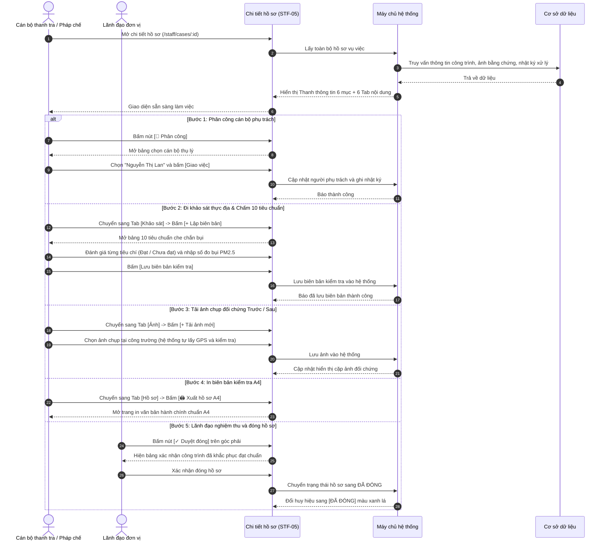

# STF-05 — Chi Tiết Hồ Sơ Vụ Việc & Không Gian Xử Lý 7 Bước (Case Workspace)

> **Tài liệu hướng dẫn & đặc tả màn hình — Hệ thống Quản trị Bụi Đô thị DustGuard VN**  
> Không gian làm việc số trung tâm của Cán bộ thanh tra môi trường: quản lý toàn bộ quá trình xử lý hồ sơ qua 7 bước chuẩn hành chính, điền bảng 10 tiêu chuẩn kiểm tra bụi công trường, kiểm tra đối chứng cặp ảnh Trước / Sau chụp tại chỗ trong bán kính 50m có mã kiểm tra chống sửa đổi, và in biên bản kiểm tra A4 chuẩn mẫu văn bản hành chính nhà nước.

---

## 1. Thông Tin Chung Về Màn Hình

| Thuộc tính | Thông tin chi tiết | Ghi chú |
|---|---|---|
| **Mã màn hình** | `STF-05` | Mã định danh màn hình trong hệ thống |
| **Tên màn hình** | Chi tiết hồ sơ vụ việc & Không gian xử lý 7 bước | Tên hiển thị trên thanh tiêu đề |
| **Tên tiếng Anh** | Case Workspace & Enforcement Detail | Tên hiển thị giao diện tiếng Anh |
| **Đường dẫn (URL)** | `/staff/cases/:id` | Địa chỉ theo mã hồ sơ (VD: `/staff/cases/case-01`, `/staff/cases/HS-26-0042`) |
| **File giao diện** | [`app/src/apps/staff/pages/cases/CaseDetailPage.jsx`](file:///d:/07-Competitions-Hackathons/unicef-dustguard/app/src/apps/staff/pages/cases/CaseDetailPage.jsx) | Mã nguồn trang giao diện React |
| **File xử lý dữ liệu** | [`app/server/routes/api/staff-cases.js`](file:///d:/07-Competitions-Hackathons/unicef-dustguard/app/server/routes/api/staff-cases.js) | File xử lý dữ liệu backend |
| **Quy định quy trình** | [`app/server/domain/cases/case.rules.js`](file:///d:/07-Competitions-Hackathons/unicef-dustguard/app/server/domain/cases/case.rules.js) | Quy chuẩn 7 bước và kiểm tra giấy tờ |
| **Khung bố cục** | [`app/src/apps/staff/layout/StaffLayout.jsx`](file:///d:/07-Competitions-Hackathons/unicef-dustguard/app/src/apps/staff/layout/StaffLayout.jsx) | Khung giao diện cán bộ |
| **Ai được sử dụng** | Cán bộ thanh tra, Cán bộ pháp chế, Lãnh đạo | Nhà thầu xem qua trang làm việc riêng |

---

## 2. Mục Đích & Tình Huống Sử Dụng Thực Tế

### 2.1. Cán bộ dùng màn hình này khi nào?
Công tác xử lý vi phạm môi trường tại các công trường xây dựng đòi hỏi quy trình pháp lý chặt chẽ, chứng cứ rõ ràng và biên bản chuẩn mực. Màn hình **STF-05** là không gian làm việc số giúp cán bộ thực hiện trọn vẹn 5 công việc cốt lõi:
1. **Thực hiện quy trình xử lý hồ sơ 7 bước rõ ràng**:
   $$\text{1. Tiếp nhận} \longrightarrow \text{2. Xác minh} \longrightarrow \text{3. Thông báo} \longrightarrow \text{4. Khảo sát} \longrightarrow \text{5. Đề xuất} \longrightarrow \text{6. Thẩm định} \longrightarrow \text{7. Hoàn tất}$$
   - *Bước 1 — Tiếp nhận*: Nhận tin báo từ người dân hoặc trạm đo bụi vượt mức cho phép.
   - *Bước 2 — Xác minh & Phân công*: Kiểm tra thông tin giấy phép công trình và giao cho cán bộ trực tiếp thụ lý.
   - *Bước 3 — Thông báo nhà thầu*: Gửi thông báo yêu cầu kiểm tra hoặc nhắc nhở đến Chỉ huy trưởng.
   - *Bước 4 — Khảo sát & Lập biên bản*: Cán bộ đến công trường, chấm điểm 10 tiêu chuẩn che chắn bụi và đo nồng độ bụi thực tế.
   - *Bước 5 — Đề xuất xử phạt*: Tính toán mức phạt vi phạm hành chính và yêu cầu nhà thầu sửa chữa trong 48 giờ.
   - *Bước 6 — Thẩm định kết quả khắc phục*: Kiểm tra đối chứng ảnh Trước và Sau xem nhà thầu đã sửa thật chưa.
   - *Bước 7 — Hoàn tất đóng hồ sơ*: Lãnh đạo ký duyệt, nghiệm thu đạt chuẩn và lưu trữ hồ sơ.

2. **Bảng 10 tiêu chuẩn kiểm tra bụi công trường chuẩn hóa**:
   - *1. Lưới bao che bụi*: Che kín mặt ngoài công trình, không để rách quá 10%.
   - *2. Phun sương dập bụi / Xe tưới nước*: Bật giàn phun liên tục khi thi công, tưới đường 2-4 lần/ngày.
   - *3. Phủ bạt bãi vật liệu cát đá*: Che kín 100% các bãi đất cát khi chưa xúc.
   - *4. Cầu rửa lốp xe / Trạm rửa xe*: Lắp tại tất cả các cổng xuất nhập vật liệu, có hố lắng bùn.
   - *5. Không làm rơi vãi đất cát ra đường*: Xe tải phủ bạt kín khít, rửa sạch bánh trước khi ra phố.
   - *6. Dập bụi khi phá dỡ bê tông*: Có vòi phun nước trực tiếp vào mũi búa đập.
   - *7. Tuân thủ giờ thi công*: Không gây ồn ào và bụi mù trong khung giờ 22h00 - 06h00.
   - *8. Đóng kín cổng công trình*: Cổng tôn kín, đóng ngay sau khi xe ra vào.
   - *9. Ống xả phế thải tầng cao*: Dùng máng hoặc ống kín, cấm ném xà bần từ trên cao.
   - *10. Biển báo thông tin & Đường dây nóng*: Treo biển ghi rõ số tiếp nhận phản ánh môi trường.

3. **Đối chứng ảnh Trước / Sau tại chỗ trong bán kính 50m**:
   - Mọi ảnh vi phạm (Trước) và ảnh sửa chữa (Sau) đều được gắn tọa độ GPS tại công trường và mã kiểm tra chống sửa đổi.
   - Hệ thống tự kiểm tra ảnh khắc phục phải chụp đúng tại công trường (trong bán kính 50m), tránh trường hợp nhà thầu lấy ảnh ở nơi khác gửi báo cáo giả.

4. **In biên bản kiểm tra A4 theo mẫu chuẩn nhà nước (Nghị định 30/2020/NĐ-CP)**:
   - Bấm 1 nút **[🖨️ Xuất hồ sơ A4]** để in ngay biên bản kiểm tra và dự thảo quyết định xử phạt với đầy đủ quốc hiệu, tiêu ngữ và căn lề chuẩn văn bản hành chính.

5. **Nguyên tắc "Trợ lý AI hỗ trợ, Cán bộ quyết định"**:
   - AI tự động so sánh ảnh Trước / Sau và gợi ý khung tiền phạt tham khảo, nhưng **Cán bộ thanh tra và Lãnh đạo là người duy nhất ký duyệt và chịu trách nhiệm pháp lý**.

---

## 3. Đối Tượng Sử Dụng & Luồng Làm Việc Thực Tế

### 3.1. Ai sử dụng màn hình này?
- **Cán bộ thanh tra hiện trường**: Mở màn hình trên máy tính bảng ngoài công trường $\rightarrow$ chấm 10 tiêu chuẩn che chắn bụi $\rightarrow$ chụp ảnh vi phạm $\rightarrow$ yêu cầu nhà thầu ký biên bản.
- **Cán bộ pháp chế**: Kiểm tra bằng chứng, đối chiếu khung tiền phạt vi phạm hành chính, soạn dự thảo quyết định trình Lãnh đạo.
- **Lãnh đạo đơn vị**: Xem đối chứng ảnh Trước / Sau, ký phê duyệt và bấm nút **[✓ Duyệt đóng]** hồ sơ.

### 3.2. Luồng thao tác xử lý một hồ sơ vi phạm



---

## 4. Bố Cục Giao Diện & Khung Hình Trực Quan (Wireframe)

### 4.1. Khung hình trực quan trên màn hình máy tính

```text
+---------------------------------------------------------------------------------------------------------+
| ĐIỀU HƯỚNG: Trang chính / Hồ sơ / HS-26-0042                                                            |
| TIÊU ĐỀ: Hồ sơ vụ việc                                                                                  |
|          Theo dõi thông tin, hình ảnh bằng chứng, biên bản khảo sát và kết quả khắc phục.                |
|          [👤 Phân công]   [📄 Xuất PDF]   [📷 Thêm ảnh >]   [✓ Duyệt đóng] (Xanh lá)                    |
+---------------------------------------------------------------------------------------------------------+
| THANH THÔNG TIN CỐT LÕI (6 Mục tóm tắt nhanh):                                                          |
| +--------------+ +--------------+ +--------------+ +--------------+ +--------------+ +----------------+ |
| | Mã hồ sơ     | | Trạng thái   | | Mức ưu tiên  | | Hạn xử lý    | | Phụ trách    | | Việc cần làm   | |
| | HS-26-0042   | | [ĐANG XỬ LÝ] | | Mức Cao (75) | | 📅 04/09/2026| | (NL) Lan NT  | | Đi kiểm tra lại| |
| | Vụ việc mở   | | Màu cam/xanh | | Bụi vượt chuẩn| Hạn 48 giờ    | | Thanh tra Q. | | Xem chi tiết ➔ | |
| +--------------+ +--------------+ +--------------+ +--------------+ +--------------+ +----------------+ |
+---------------------------------------------------------------------------------------------------------+
| DẢI 6 TAB TÁC NGHIỆP:                                                                                   |
| [Thông tin]  [Ảnh (4)]  [Nhật ký (7)]  [Khảo sát]  [Khắc phục]  [Hồ sơ A4] │ ✨ AI gợi ý, Cán bộ quyết định|
+---------------------------------------------------------------------------------------------------------+
| NỘI DUNG THEO TAB ĐANG CHỌN:                                                                            |
|                                                                                                         |
| === NẾU CHỌN TAB 1: THÔNG TIN (TỔNG QUAN) ===                                                           |
| +--------------------------+ +--------------------------+ +-------------------------------------------+ |
| | 1. THÔNG TIN CHUNG       | | 2. GIẤY TỜ CẦN BỔ SUNG   | | 3. NHẬT KÝ TÓM TẮT                        | |
| | • Công trình: Matrix One | | • [📄] Biên bản làm việc | | • 02/09 08:30 [Hệ thống] Tiếp nhận hồ sơ  | |
| | • Địa chỉ: Lê Quang Đạo  | | • [📷] Ảnh sau khắc phục | | • 02/09 09:15 [Tổ trưởng] Giao việc cán bộ| |
| | • Loại vi phạm: Bụi đất  | | • [📊] Phiếu đo nồng độ  | | • 02/09 14:00 [Thanh tra] Đến kiểm tra    | |
| | • Mô tả: Xe chở đất bụi..| |                          | |                                           | |
| +--------------------------+ +--------------------------+ +-------------------------------------------+ |
| +------------------------------------------------------+ +--------------------------------------------+ |
| | 4. VIỆC CẦN LÀM TRONG ĐOÀN               [+ Thêm việc]| | 5. ẢNH HIỆN TRƯỜNG (TRƯỚC / SAU)   [Xem hết ➔]| |
| | ---------------------------------------------------- | | 🔴 TRƯỚC (2 ảnh)       🟢 SAU (2 ảnh)      | |
| | Việc cần làm             | Hạn chót   | Trạng thái   | | +--------+ +--------+  +--------+ +--------+ | |
| | • Kiểm tra máng rửa xe   | 03/09/2026 | [Đang làm]   | | | Ảnh T1 | | Ảnh T2 |  | Ảnh S1 | | Ảnh S2 | | |
| | • Yêu cầu phủ bạt cát    | 04/09/2026 | [Chưa làm]   | | +--------+ +--------+  +--------+ +--------+ | |
| +------------------------------------------------------+ +--------------------------------------------+ |
|                                                                                                         |
| === NẾU CHỌN TAB 2: ẢNH BẰNG CHỨNG (TRƯỚC / SAU) ===                                                    |
| Tiêu đề: Bằng chứng hiện trường • Chụp tại chỗ trong bán kính 50m • Có mã kiểm tra chống sửa đổi        |
| 🔴 ẢNH TRƯỚC KHẮC PHỤC (2 ảnh vi phạm)         🟢 ẢNH SAU KHẮC PHỤC (2 ảnh đã sửa chữa)                 |
| +---------------------+ +---------------------+ +---------------------+ +---------------------+        |
| | [Ảnh vi phạm 1]     | | [Ảnh vi phạm 2]     | | [Ảnh khắc phục 1]   | | [Ảnh khắc phục 2]   |        |
| | Xe ben không rửa lốp| | Bãi cát không che   | | Đã lắp cầu rửa xe   | | Đã phủ bạt kín 100% |        |
| | Vị trí: Cổng số 1   | | Vị trí: Góc phía Tây| | Vị trí: Cổng số 1   | | Vị trí: Góc phía Tây|        |
| +---------------------+ +---------------------+ +---------------------+ +---------------------+        |
|                                                                                                         |
| === NẾU CHỌN TAB 4: BIÊN BẢN KHẢO SÁT 10 TIÊU CHUẨN ===                                                 |
| Tiêu đề: Biên bản khảo sát thực địa • 10 Tiêu chuẩn kiểm tra bụi          [+ Lập biên bản mới]          |
| +-----------------------------------------------+ +---------------------------------------------------+ |
| | 1. Lưới bao che công trình                    | | 2. Cầu rửa lốp xe ra vào                          | |
| | Hiện trạng: Lưới rách 30% mặt tiền tiếp giáp. | | Hiện trạng: Chưa bố trí trạm rửa xe áp lực cao.   | |
| | Đánh giá: [CHƯA ĐẠT] (Đỏ)                     | | Đánh giá: [CHƯA ĐẠT] (Đỏ)                         | |
| +-----------------------------------------------+ +---------------------------------------------------+ |
| | 3. Phun sương dập bụi                         | | 4. Phủ bạt bãi vật liệu cát đá                    | |
| | Hiện trạng: Phun ngắt quãng giờ cao điểm.     | | Hiện trạng: Bãi cát đã phủ bạt 80% diện tích.     | |
| | Đánh giá: [CẦN CẢI THIỆN] (Cam)               | | Đánh giá: [ĐẠT CHUẨN] (Xanh lá)                   | |
| +-----------------------------------------------+ +---------------------------------------------------+ |
|                                                                                                         |
| === NẾU CHỌN TAB 6: HỒ SƠ PHÁP LÝ & QUYẾT ĐỊNH XỬ PHẠT (IN A4) ===                                      |
| Tiêu đề: Dự thảo quyết định xử phạt vi phạm hành chính                    [🖨️ Xuất hồ sơ A4]           |
| Căn cứ: Nghị định số 45/2022/NĐ-CP về xử phạt vi phạm hành chính trong lĩnh vực bảo vệ môi trường.        |
| Mức phạt đề xuất: 25.000.000 VNĐ • Biện pháp khắc phục: Yêu cầu che chắn và dập bụi trong 48 giờ.       |
+---------------------------------------------------------------------------------------------------------+
| KHUNG PHÂN CÔNG CÁN BỘ (Hiện khi bấm [👤 Phân công]):                                                   |
| • Chọn cán bộ thụ lý: [Nguyễn Thị Lan / Lê Văn Minh / Phạm Tuấn Anh]                                    |
| • Nút bấm: [ Hủy ]  [ Giao việc ngay ] (Đỏ son)                                                         |
+---------------------------------------------------------------------------------------------------------+
```

### 4.2. Chi tiết 6 Tab làm việc
1. **Tab 1 — Thông tin tổng quan**: Thấy ngay toàn bộ tóm tắt vụ việc, danh sách giấy tờ còn thiếu, lịch sử các bước và các việc cần làm.
2. **Tab 2 — Ảnh bằng chứng**: Xem rõ ràng 2 cột ảnh đối chứng Trước và Sau, kiểm tra ảnh chụp tại chỗ trong bán kính 50m.
3. **Tab 3 — Nhật ký xử lý 7 bước**: Xem toàn bộ lịch sử từng bước ai làm, vào giờ nào và nội dung xử lý là gì.
4. **Tab 4 — Biên bản khảo sát 10 tiêu chuẩn**: Điền và xem kết quả chấm điểm 10 tiêu chuẩn che chắn bụi công trường kèm số đo bụi thực tế.
5. **Tab 5 — Kế hoạch khắc phục của nhà thầu**: Theo dõi tiến độ nhà thầu lắp đặt trạm rửa xe, giàn phun sương theo cam kết.
6. **Tab 6 — Hồ sơ pháp lý & In A4**: Soạn thảo và in ấn biên bản kiểm tra, quyết định xử phạt theo mẫu chuẩn nhà nước.

---

## 5. Dữ Liệu & Liên Kết Hệ Thống

### 5.1. Dữ liệu chính trong hồ sơ vụ việc
- **Thông tin chung**: Mã hồ sơ, tên vụ việc, tên công trình, địa chỉ, loại vi phạm, người phụ trách, hạn xử lý 48 giờ.
- **Biên bản kiểm tra**: Kết quả đánh giá 10 tiêu chuẩn, số đo nồng độ bụi PM2.5 / PM10, chữ ký xác nhận của chỉ huy trưởng.
- **Kho ảnh chứng cứ**: Các ảnh chụp vi phạm lúc ban đầu và ảnh chụp nghiệm thu sau khi nhà thầu đã sửa chữa.
- **Nhật ký các bước**: Từng mốc thời gian chuyển bước từ lúc tiếp nhận đến khi hoàn tất.

### 5.2. Mẫu dữ liệu trao đổi đơn giản
```json
{
  "id": "case-01",
  "code": "HS-26-0042",
  "title": "Xử lý vi phạm bụi tại Dự án The Matrix One",
  "status": "Đang xử lý",
  "priority": "Cao",
  "deadline": "04/09/2026",
  "assigneeName": "Nguyễn Thị Lan",
  "siteName": "Dự án The Matrix One",
  "address": "Số 1 Lê Quang Đạo, Phường Mễ Trì, Quận Nam Từ Liêm, Hà Nội",
  "checklist": [
    { "id": 1, "title": "Lưới bao che bụi", "status": "FAIL", "note": "Rách 30%" },
    { "id": 2, "title": "Cầu rửa xe ra vào", "status": "FAIL", "note": "Chưa lắp đặt" },
    { "id": 4, "title": "Phủ bạt bãi cát đá", "status": "PASS", "note": "Đã phủ bạt kín" }
  ],
  "photos": {
    "before": ["url_anh_vi_pham_1.jpg"],
    "after": ["url_anh_khac_phuc_1.jpg"]
  }
}
```

---

## 6. Bảng Nút Bấm & Thao Tác Chi Tiết

| Nút bấm / Thao tác | Vị trí | Hành động khi bấm | Ai được bấm |
|---|---|---|:---:|
| **`[👤 Phân công]`** | Đầu trang | Mở bảng chọn cán bộ thụ lý hồ sơ. | Tổ trưởng, Quản trị viên |
| **`[📄 Xuất PDF]`** | Đầu trang | Xuất nhanh toàn bộ hồ sơ ra file PDF để gửi báo cáo. | Tất cả cán bộ |
| **`[📷 Thêm ảnh >]`** | Đầu trang | Mở nhanh sang Tab Ảnh để tải ảnh hiện trường lên. | Cán bộ thanh tra |
| **`[✓ Duyệt đóng]`** | Đầu trang (Góc phải) | Nghiệm thu công trình đạt chuẩn và hoàn tất đóng hồ sơ. | Thanh tra viên, Lãnh đạo |
| **`[6 Tab tác nghiệp]`** | Dải nút giữa trang | Chuyển đổi qua lại giữa các mục (*Thông tin, Ảnh, Nhật ký, Khảo sát, Khắc phục, Hồ sơ A4*). | Tất cả cán bộ |
| **`[+ Thêm việc]`** | Tab Thông tin | Thêm nhiệm vụ kiểm tra mới cho thành viên trong đoàn. | Cán bộ thanh tra |
| **`[+ Tải ảnh mới]`** | Tab Ảnh | Chọn và tải ảnh chụp thực tế tại công trường lên hệ thống. | Cán bộ thanh tra |
| **`[+ Lập biên bản]`** | Tab Khảo sát | Mở bảng điền 10 tiêu chuẩn che chắn bụi và nhập số đo nồng độ bụi. | Cán bộ thanh tra |
| **`[🖨️ Xuất hồ sơ A4]`** | Tab Hồ sơ A4 | Mở bản in biên bản kiểm tra và quyết định xử phạt chuẩn thể thức nhà nước. | Tất cả cán bộ |

---

## 7. Quy Chuẩn Giao Diện Sáng Màu & Dễ Nhìn

### 7.1. Tông màu sáng, tương phản cao, dễ đọc ngoài trời
- **Nền trang**: Màu kem sáng nhạt (`#FDFBF7`), dịu mắt khi làm việc lâu.
- **Thẻ nội dung**: Màu trắng tinh (`#FFFFFF`), viền xám mềm mại (`#E7E5E4`), tuyệt đối không dùng hiệu ứng mờ kính (No Glassmorphism).
- **Màu chữ**: Màu đen mực in đậm nét (`#1C1917`), đảm bảo cán bộ đọc rõ khi dùng máy tính bảng ngoài công trường.
- **Ảnh hiện trường**: Hiển thị qua khung an toàn, có ảnh dự phòng khi mất mạng, không bao giờ bị vỡ giao diện.
- **Nút bấm & Ô tích chọn**: Kích thước to bản (tối thiểu 44px), dễ dàng bấm bằng ngón tay kể cả khi đang đeo găng tay bảo hộ.

### 7.2. Tương thích trên máy tính và điện thoại
- **Trên máy tính 14-inch**: Thanh thông tin 6 mục trải đều, Tab Thông tin chia 3 cột phía trên và 2 cột phía dưới cân đối, Tab Ảnh hiển thị 2 cột đối chứng Trước / Sau to rõ.
- **Trên điện thoại**: Dải 6 Tab cho phép vuốt ngang mượt mà, các bảng kiểm tra tự cuộn ngang an toàn.

---

## 8. Các Tình Huống Lỗi Thường Gặp & Cách Xử Lý

### 8.1. Các lỗi thực tế hay gặp
1. **Chưa có biên bản kiểm tra mà đã bấm đề xuất xử phạt**: Hệ thống nhắc nhở cán bộ điền biên bản khảo sát 10 tiêu chuẩn trước khi lập quyết định xử phạt.
2. **Ảnh chụp ở quá xa công trường (> 50m)**: Hệ thống cảnh báo ảnh nằm ngoài phạm vi công trường và nhắc cán bộ kiểm tra lại vị trí chụp.
3. **Hồ sơ đã đóng nhưng có người muốn sửa**: Chỉ tài khoản quản trị viên mới được phép mở lại hồ sơ đã đóng và phải ghi rõ lý do.
4. **Mất mạng khi đang điền biên bản**: Dữ liệu tạm được lưu trên máy để không bị mất thông tin cán bộ vừa chấm điểm.

### 8.2. Lệnh kiểm tra nhanh cho kỹ thuật viên
Chạy trực tiếp trên cửa sổ PowerShell:
```powershell
# 1. Kiểm tra quy trình 7 bước của hồ sơ
node --test app/tests/case-enforcement-dag-7steps.test.js

# 2. Kiểm tra giao diện chi tiết hồ sơ
node --test app/tests/staff-cases-mockup6-7.test.js

# 3. Kiểm tra toàn diện hệ thống
npm --prefix app run verify:quick
```
