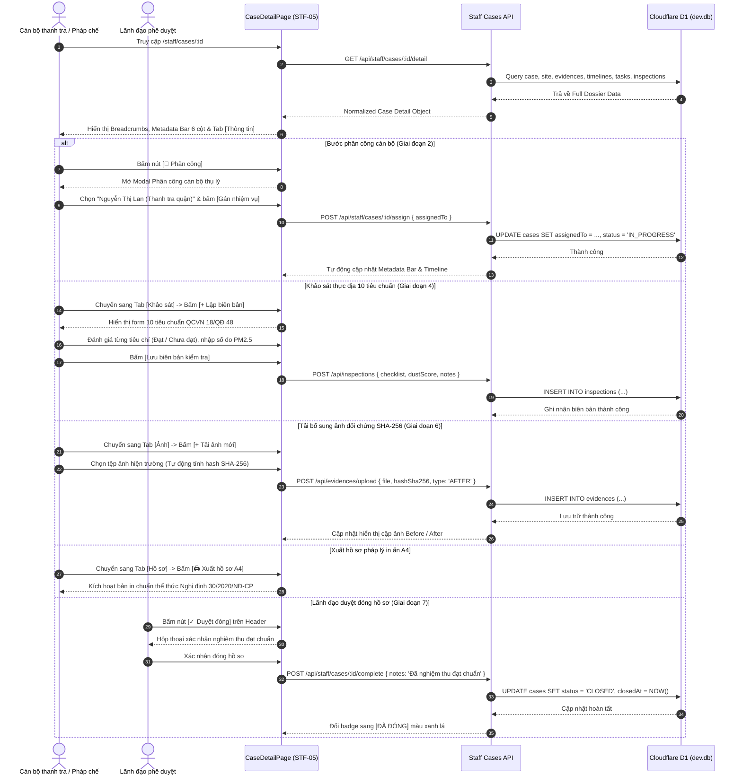

# STF-05 — Chi Tiết Hồ Sơ Vụ Việc & Không Gian Tác Nghiệp 7 Bước (Case Workspace)

> **Tài liệu đặc tả màn hình chuẩn SSOT (Single Source of Truth) — DustGuard VN CivicTech Platform**  
> Không gian làm việc số (Case Workspace) trung tâm của Cán bộ thanh tra môi trường và Pháp chế: quản lý toàn diện hồ sơ vi phạm theo chu trình State Machine DAG 7 bước chuẩn hành chính Việt Nam, đánh giá checklist 10 tiêu chuẩn QCVN 18:2021/BXD & QĐ 48/2024/QĐ-UBND, kiểm soát đối chứng ảnh Before/After trong bán kính Geofence $\le 50\text{m}$ có mã băm SHA-256, và xuất bản dự thảo quyết định xử phạt chuẩn A4 theo Nghị định 30/2020/NĐ-CP & Nghị định 45/2022/NĐ-CP.

---

## 1. Screen Identity

| Thuộc tính | Giá trị SSOT | Ghi chú kỹ thuật |
|---|---|---|
| **Mã màn hình** | `STF-05` | Định danh phân hệ Chi tiết Hồ sơ Vụ việc |
| **Tên tiếng Việt** | Chi Tiết Hồ Sơ Vụ Việc & Không Gian Tác Nghiệp 7 Bước | Tên hiển thị chính thức trên hệ thống tác nghiệp |
| **Tên tiếng Anh** | Case Workspace & 7-Step Enforcement DAG Detail | Tên chuẩn hóa đối ngoại & API |
| **Đường dẫn (Route)** | `/staff/cases/:id` | Dynamic Route (VD: `/staff/cases/case-01`, `/staff/cases/HS-26-0042`) |
| **Component Path** | [`app/src/apps/staff/pages/cases/CaseDetailPage.jsx`](file:///d:/07-Competitions-Hackathons/unicef-dustguard/app/src/apps/staff/pages/cases/CaseDetailPage.jsx) | React 19 Client Component (Mockup 7 Workspace) |
| **Backend API Route** | [`app/server/routes/api/staff-cases.js`](file:///d:/07-Competitions-Hackathons/unicef-dustguard/app/server/routes/api/staff-cases.js) | REST Endpoints kết nối trực tiếp SQLite / D1 |
| **Domain State Machine** | [`app/server/domain/cases/case.rules.js`](file:///d:/07-Competitions-Hackathons/unicef-dustguard/app/server/domain/cases/case.rules.js) | 7-Step DAG Enforcement & Document Validators |
| **Layout bọc** | [`app/src/apps/staff/layout/StaffLayout.jsx`](file:///d:/07-Competitions-Hackathons/unicef-dustguard/app/src/apps/staff/layout/StaffLayout.jsx) | Khung điều hành Cán bộ thanh tra, Sidebar 12 phân hệ |
| **Vai trò truy cập (Role)** | `staff`, `inspector`, `executive`, `admin`, `demo_admin` | Chặn quyền `citizen`, `volunteer`, `public`; `contractor` xem qua workspace riêng |
| **Trạng thái thực thi** | **ACTIVE (Level 5 Production Coherent)** | Kết nối 100% CSDL D1 SQLite thật, Zero-Mock |

---

## 2. Mục Đích & Giá Trị Thực Tế

### 2.1. Giải quyết bài toán nghiệp vụ thanh tra & xử lý vi phạm
Công tác xử lý vi phạm trật tự môi trường xây dựng đô thị tại Việt Nam đòi hỏi tính chặt chẽ về quy trình pháp lý, tính xác thực của chứng cứ hiện trường và tính minh bạch trong các bước ra quyết định. Trước đây, quy trình xử lý thường bị kéo dài do thiếu công cụ giám sát tiến độ theo thời gian thực, chứng cứ hình ảnh dễ bị sai lệch hoặc giả mạo, biên bản kiểm tra viết tay khó tổng hợp và dự thảo quyết định xử phạt tốn nhiều thời gian đối chiếu quy chuẩn.

Màn hình **STF-05 (Case Workspace)** giải quyết toàn diện các thách thức này thông qua 5 trụ cột nghiệp vụ:

1. **Chu trình State Machine DAG 7 bước chuẩn hành chính Việt Nam**:
   Thiết lập luồng xử lý tuần tự không thể bị nhảy cóc (Illegal Jump Prevention):
   $$\text{Tiếp nhận (1)} \xrightarrow{} \text{Xác minh (2)} \xrightarrow{} \text{Thông báo (3)} \xrightarrow{} \text{Khảo sát (4)} \xrightarrow{} \text{Đề xuất (5)} \xrightarrow{} \text{Thẩm định (6)} \xrightarrow{} \text{Hoàn tất (7)}$$
   - **Bước 1 — Tiếp nhận phản ánh (`SCREENING`)**: Thu nạp tín hiệu từ cộng đồng hoặc cảnh báo vượt ngưỡng từ trạm quan trắc IoT vi khí hậu.
   - **Bước 2 — Phân công xác minh (`PREPARING`)**: Kiểm tra hồ sơ pháp lý công trình, dữ liệu giấy phép và gán cán bộ thanh tra thụ lý ca trực.
   - **Bước 3 — Thông báo nhà thầu (`DECISION_ISSUED`)**: Ban hành giấy mời làm việc hoặc thông báo kiểm tra đột xuất gửi chỉ huy trưởng công trường.
   - **Bước 4 — Lập biên bản kiểm tra 10 tiêu chuẩn (`ON_SITE`)**: Khảo sát thực địa, điền checklist 10 tiêu chí theo QCVN 18:2021/BXD & QĐ 48/2024/QĐ-UBND, đo nồng độ bụi thực tế.
   - **Bước 5 — Đề xuất biện pháp & xử phạt (`REPORTING`)**: Lập biên bản vi phạm hành chính (VPHC), tính toán khung tiền phạt theo Nghị định 45/2022/NĐ-CP và yêu cầu biện pháp khắc phục.
   - **Bước 6 — Tái kiểm nghiệm thu Before/After (`APPRAISING`)**: Thẩm định hồ sơ khắc phục của nhà thầu, kiểm tra đối chứng cặp ảnh Before/After trong bán kính Geofence $\le 50\text{m}$.
   - **Bước 7 — Hoàn tất đóng hồ sơ (`COMPLETED`)**: Lãnh đạo cơ quan ký số quyết định, hoàn tất đóng hồ sơ và niêm phong số lưu trữ kiểm toán.

2. **Checklist 10 tiêu chuẩn kiểm tra hiện trường chuẩn hóa**:
   Chuẩn hóa việc kiểm tra thực địa bằng bảng 10 tiêu chí có căn cứ pháp lý và trọng số rõ ràng:
   - *1. Lưới bao che bụi*: QCVN 18:2021/BXD §5.2.1 (Trọng số 3) — Che kín toàn bộ mặt tiếp giáp đường/khu dân cư, tỷ lệ rách $< 10\%$.
   - *2. Phun sương dập bụi / Xe tưới nước*: QĐ 48/2024/QĐ-UBND Hà Nội §4.2 (Trọng số 3) — Phun sương liên tục giờ thi công, tưới nước mặt đường 2–4 lần/ngày.
   - *3. Che phủ bãi tập kết vật liệu rời*: QCVN 18:2021/BXD §5.3 (Trọng số 2) — Phủ bạt kín 100% bãi cát, đá, đất đào khi chưa bốc xúc.
   - *4. Cầu rửa lốp xe / Trạm rửa xe áp lực*: QĐ 48/2024/QĐ-UBND Hà Nội §4.5 (Trọng số 3) — Bố trí tại tất cả các cổng xuất nhập vật liệu, có hố lắng bùn.
   - *5. Chống tràn rơi vãi vật liệu ra đường*: NĐ 45/2022/NĐ-CP Điều 20 (Trọng số 3) — Bạt che thùng xe tải kín khít, không chở quá tải, rửa sạch lốp trước khi ra phố.
   - *6. Kiểm soát bụi trong công tác phá dỡ*: QCVN 18:2021/BXD §5.4 (Trọng số 3) — Vòi phun nước dập bụi trực tiếp tại mũi đập búa thủy lực.
   - *7. Tuân thủ khung giờ thi công*: QĐ 02/2023/QĐ-UBND Hà Nội §3 (Trọng số 2) — Không thi công gây bụi và tiếng ồn lớn trong khung giờ 22h00 – 06h00.
   - *8. Cổng công trình đóng kín trong giờ thi công*: QĐ 48/2024/QĐ-UBND Hà Nội §4.3 (Trọng số 2) — Cổng tôn kín, đóng ngay sau khi xe ra vào.
   - *9. Lưới bảo vệ và gom phế thải tầng cao*: QCVN 18:2021/BXD §5.2.3 (Trọng số 2) — Dùng ống trượt rác kín, cấm thả xà bần tự do từ trên cao.
   - *10. Bảng thông tin công trình & giám sát*: NĐ 06/2021/NĐ-CP Điều 8 (Trọng số 1) — Biển hiệu dự án ghi rõ đường dây nóng tiếp nhận phản ánh ô nhiễm (1022 / DustGuard QR).

3. **Kho bằng chứng số SHA-256 & Giám sát Geofence $\le 50\text{m}$**:
   - Mọi ảnh vi phạm (Before) và ảnh khắc phục (After) đều được gắn tọa độ GPS thực địa và tính mã băm SHA-256 (64 ký tự hex) ngay trên thiết bị qua Web Crypto API trước khi lưu vào Cloudflare R2 / D1.
   - Thuật toán Haversine tự động kiểm tra vị trí ảnh khắc phục phải nằm trong bán kính Geofence $\le 50\text{m}$ so với tâm công trình, loại trừ 100% nguy cơ gian lận bằng ảnh chụp từ nơi khác.

4. **In ấn hồ sơ A4 chuẩn thể thức văn bản hành chính (NĐ 30/2020/NĐ-CP)**:
   - Xuất bản ngay biên bản kiểm tra hiện trường và dự thảo quyết định xử phạt vi phạm hành chính chuẩn phông Times New Roman/Sans, định dạng quốc hiệu tiêu ngữ, số hiệu văn bản, căn lề A4 in ấn sắc nét chỉ với 1-click `[🖨️ Xuất hồ sơ A4]`.

5. **Nguyên tắc "AI is Assistant, Not Judge"**:
   - Trợ lý AI tự động so sánh đặc trưng ảnh Before/After, gợi ý điều khoản pháp lý và tính điểm rủi ro, nhưng **Cán bộ thanh tra và Lãnh đạo cơ quan là người duy nhất ký duyệt và chịu trách nhiệm pháp lý**.

---

## 3. Đối Tượng Người Dùng & Hành Trình Thao Tác (User Journey)

### 3.1. Đối tượng sử dụng chính
- **Cán bộ thanh tra hiện trường (Inspector)**: Mở hồ sơ trên tablet tại công trình $\rightarrow$ kiểm tra 10 tiêu chuẩn QCVN $\rightarrow$ chụp ảnh vi phạm tải lên $\rightarrow$ yêu cầu nhà thầu ký biên bản làm việc và hẹn thời hạn khắc phục SLA 48h.
- **Cán bộ pháp chế / Thẩm định (Staff / Legal)**: Soát xét chứng cứ, đối chiếu khung tiền phạt vi phạm hành chính theo Nghị định 45/2022/NĐ-CP, soạn thảo dự thảo quyết định trình Lãnh đạo.
- **Lãnh đạo cơ quan (Executive / Admin)**: Thẩm tra kết quả khắc phục qua cặp ảnh Before/After Geofence $\le 50\text{m}$, ký số phê duyệt và bấm `[✓ Duyệt đóng]` hồ sơ.

### 3.2. Sơ đồ luồng tác nghiệp chi tiết (Step-by-Step Flow)



---

## 4. Bố Cục Giao Diện & Phân Cấp Thông Tin (Information Hierarchy)

### 4.1. Wireframe bố cục tổng thể

```text
+---------------------------------------------------------------------------------------------------------+
| [Breadcrumb] Trang chính / Hồ sơ / HS-26-0042                                                           |
| [Header] Hồ sơ vụ việc                                                                                  |
|          Theo dõi thông tin, bằng chứng, khảo sát và khắc phục.                                         |
|          [👤 Phân công]   [📄 Xuất PDF]   [📷 Thêm ảnh >]   [✓ Duyệt đóng] (Xanh lá #16A34A)             |
+---------------------------------------------------------------------------------------------------------+
| [METADATA BAR] (Lưới 6 Cột Thông Tin Cốt Lõi)                                                           |
| +--------------+ +--------------+ +--------------+ +--------------+ +--------------+ +----------------+ |
| | Mã hồ sơ     | | Trạng thái   | | Mức ưu tiên  | | Hạn xử lý    | | Phụ trách    | | Việc cần làm tiếp| |
| | HS-26-0042   | | [ĐANG XỬ LÝ] | | Cao (75/100) | | 📅 04/09/2026| | (NL) Lan NT  | | Kiểm tra hiện...| |
| | CSDL D1 SSOT | | (Cam/Xanh)   | | Rủi ro bụi   | | SLA Quy định | | Thanh tra Q. | | Xem chi tiết ➔ | |
| +--------------+ +--------------+ +--------------+ +--------------+ +--------------+ +----------------+ |
+---------------------------------------------------------------------------------------------------------+
| [6 TABS NAVIGATION + AI BADGE]                                                                          |
| [Thông tin]  [Ảnh (4)]  [Theo dõi (7)]  [Khảo sát]  [Khắc phục]  [Hồ sơ] │ ✨ AI đối chiếu, Cán bộ duyệt|
+---------------------------------------------------------------------------------------------------------+
| [NỘI DUNG CHI TIẾT THEO TAB ĐANG CHỌN]                                                                  |
|                                                                                                         |
| === NẾU CHỌN TAB 1: THÔNG TIN (INFO) ===                                                                |
| +--------------------------+ +--------------------------+ +-------------------------------------------+ |
| | 1. THÔNG TIN CHUNG       | | 2. BẰNG CHỨNG CẦN BỔ SUNG| | 3. LỊCH SỬ THEO DÕI (Mini Timeline)       | |
| | • Công trình: Matrix One | | • [📄] Biên bản làm việc | | • 02/09 08:30 [Hệ thống] Tiếp nhận hồ sơ  | |
| | • Địa chỉ: Lê Quang Đạo  | | • [📷] Ảnh sau khắc phục | | • 02/09 09:15 [Tổ trưởng] Phân công cán bộ| |
| | • Loại vi phạm: QCVN 05  | | • [📊] Phiếu đo bụi PM10 | | • 02/09 14:00 [Thanh tra] Khảo sát thực địa| |
| | • Mô tả: Bụi phát tán... | |                          | |                                           | |
| +--------------------------+ +--------------------------+ +-------------------------------------------+ |
| +------------------------------------------------------+ +--------------------------------------------+ |
| | 4. DANH SÁCH VIỆC CẦN LÀM (TODO TASKS)  [+ Thêm việc] | | 5. ẢNH HIỆN TRẠNG (TRƯỚC / SAU)   [Xem hết ➔]| |
| | ---------------------------------------------------- | | 🔴 TRƯỚC (2 ảnh)       🟢 SAU (2 ảnh)      | |
| | Việc cần làm             | Hạn chót   | Trạng thái   | | +--------+ +--------+  +--------+ +--------+ | |
| | • Kiểm tra cầu rửa xe    | 03/09/2026 | [Đang làm]   | | | Ảnh T1 | | Ảnh T2 |  | Ảnh S1 | | Ảnh S2 | | |
| | • Yêu cầu bạt che vật... | 04/09/2026 | [Chưa làm]   | | +--------+ +--------+  +--------+ +--------+ | |
| +------------------------------------------------------+ +--------------------------------------------+ |
|                                                                                                         |
| === NẾU CHỌN TAB 2: ẢNH BẰNG CHỨNG (PHOTOS) ===                                                         |
| Header: Bằng chứng hiện trường (Before / After) • Mã SHA-256 Web Crypto • GPS Geofence <= 50m           |
| 🔴 ẢNH TRƯỚC KHẮC PHỤC (2 ảnh)                🟢 ẢNH SAU KHẮC PHỤC (2 ảnh)                             |
| +---------------------+ +---------------------+ +---------------------+ +---------------------+        |
| | [Ảnh vi phạm 1]     | | [Ảnh vi phạm 2]     | | [Ảnh khắc phục 1]   | | [Ảnh khắc phục 2]   |        |
| | Hash: 9f241f...     | | Hash: a83b12...     | | Hash: 0d6f64...     | | Hash: 4e91ac...     |        |
| | GPS: 21.012, 105.78 | | GPS: 21.012, 105.78 | | GPS: 21.012, 105.78 | | GPS: 21.012, 105.78 |        |
| +---------------------+ +---------------------+ +---------------------+ +---------------------+        |
|                                                                                                         |
| === NẾU CHỌN TAB 4: BIÊN BẢN KHẢO SÁT 10 TIÊU CHUẨN (SURVEY) ===                                        |
| Header: Biên bản khảo sát thực địa • 10 Tiêu chí QCVN 18/QĐ 48           [+ Lập biên bản mới]            |
| +-----------------------------------------------+ +---------------------------------------------------+ |
| | 1. Che chắn công trình (QCVN 18:2021)         | | 2. Trạm rửa xe ra vào (QĐ 48/2024/QĐ-UBND)        | |
| | Hiện trạng: Lưới rách 30% mặt tiền tiếp giáp. | | Hiện trạng: Chưa bố trí cầu rửa xe áp lực cao.    | |
| | Đánh giá: [CHƯA ĐẠT] (Đỏ)                     | | Đánh giá: [CHƯA ĐẠT] (Đỏ)                         | |
| +-----------------------------------------------+ +---------------------------------------------------+ |
| | 3. Phun sương dập bụi (QĐ 48/2024/QĐ-UBND)    | | 4. Che phủ bãi vật liệu (QCVN 18:2021 §5.3)       | |
| | Hiện trạng: Phun ngắt quãng giờ cao điểm.     | | Hiện trạng: Bãi cát đã phủ bạt 80% diện tích.     | |
| | Đánh giá: [CẦN CẢI THIỆN] (Cam)               | | Đánh giá: [ĐẠT] (Xanh lá)                         | |
| +-----------------------------------------------+ +---------------------------------------------------+ |
|                                                                                                         |
| === NẾU CHỌN TAB 6: HỒ SƠ PHÁP LÝ & QUYẾT ĐỊNH XỬ PHẠT (DOSSIER) ===                                    |
| Header: Dự thảo quyết định xử phạt (Nghị định 45/2022/NĐ-CP)             [🖨️ Xuất hồ sơ A4]           |
| Căn cứ: Điểm b Khoản 2 Điều 15 Nghị định số 45/2022/NĐ-CP ngày 07/07/2022 của Chính phủ.                |
| Mức phạt đề xuất: 25.000.000 VNĐ • Biện pháp: Buộc khắc phục ngay trong 48 giờ.                         |
+---------------------------------------------------------------------------------------------------------+
| [MODAL PHÂN CÔNG CÁN BỘ] (Kích hoạt khi bấm [👤 Phân công])                                             |
| • Cán bộ thụ lý: [Dropdown: Nguyễn Thị Lan / Lê Văn Minh / Phạm Tuấn Anh]                               |
| • Nút bấm: [ Hủy ]  [ Gán nhiệm vụ ] (Đỏ son #B91C1C)                                                   |
+---------------------------------------------------------------------------------------------------------+
```

### 4.2. Chi tiết phân cấp 6 Tabs nghiệp vụ

#### Tab 1: Thông tin tổng quan (`INFO`)
- **Khối 1: Thông tin chung**: Hiển thị tên công trình, địa chỉ chi tiết, loại vi phạm (theo quy chuẩn QCVN 05:2023), nguồn phát sinh bụi chính và mô tả tóm tắt diễn biến.
- **Khối 2: Bằng chứng cần bổ sung**: Danh sách các tài liệu còn thiếu để hoàn thiện hồ sơ kèm icon phân loại và nút hành động nhanh (VD: `Biên bản làm việc` $\rightarrow$ Bổ sung; `Ảnh sau khắc phục` $\rightarrow$ Chụp ảnh; `Phiếu đo bụi` $\rightarrow$ Đo đạc).
- **Khối 3: Lịch sử theo dõi (Mini Timeline)**: Dòng thời gian thu gọn ghi nhận các mốc sự kiện quan trọng có chấm tròn đỏ son `#B91C1C`, thời gian thực và tên người thực hiện.
- **Khối 4: Danh sách việc cần làm (Todo Tasks)**: Bảng phân công nhiệm vụ cụ thể cho từng thành viên đoàn kiểm tra, có cột hạn hoàn thành và badge trạng thái (`Đang làm`, `Đã xong`), kèm nút `[+ Thêm việc]`.
- **Khối 5: Ảnh hiện trạng Trước / Sau rút gọn**: Hiển thị 2 ảnh Trước và 2 ảnh Sau qua component `SafeImage`, có nút `[Xem tất cả ➔]` để chuyển ngay sang Tab Ảnh.

#### Tab 2: Ảnh bằng chứng hiện trường (`PHOTOS`)
- Bố cục 2 cột so sánh trực quan đối chứng Trước — Sau:
  - **Cột 1 — 🔴 Ảnh trước khắc phục**: Toàn bộ ảnh ghi nhận lúc phát hiện vi phạm từ cộng đồng hoặc cán bộ tuần tra.
  - **Cột 2 — 🟢 Ảnh sau khắc phục**: Ảnh do nhà thầu hoặc cán bộ chụp sau khi triển khai biện pháp giảm thiểu bụi.
- Mỗi ảnh hiển thị:
  - Xem ảnh qua `SafeImage` bo góc `rounded-xl`, chống lỗi tải ảnh.
  - Nhãn số hiệu bằng chứng (VD: *Bằng chứng #1*, *Nghiệm thu #1*).
  - Mã băm SHA-256 (64 ký tự hex) bảo đảm không bị chỉnh sửa giả mạo.
  - Tọa độ GPS gắn kèm và kiểm tra tự động nằm trong bán kính Geofence $\le 50\text{m}$.
- Nút `[+ Tải ảnh mới]`: Hỗ trợ cán bộ tải thêm ảnh hiện trường trực tiếp từ tablet/điện thoại.

#### Tab 3: Quy trình theo dõi 7 bước (`TIMELINE`)
- Trực quan hóa toàn bộ chu trình State Machine DAG 7 bước trên đường kẻ dọc màu đỏ son `#B91C1C`:
  - Từng sự kiện hiển thị tên bước nghiệp vụ (`Tiếp nhận`, `Xác minh`, `Khảo sát`, `Đề xuất`...), người thao tác (`actor`), thời gian chuẩn tiếng Việt (`DD/MM/YYYY HH:mm:ss`) và mô tả chi tiết nội dung xử lý.

#### Tab 4: Biên bản khảo sát 10 tiêu chuẩn (`SURVEY`)
- Hiển thị danh sách đánh giá 10 tiêu chuẩn kỹ thuật môi trường theo QCVN 18:2021/BXD và QĐ 48/2024/QĐ-UBND Hà Nội:
  - Tên tiêu chí & căn cứ điều khoản quy chuẩn.
  - Tình trạng ghi nhận thực tế ngoài công trường.
  - Badge đánh giá trực quan: Xanh lá `Đạt`, Đỏ `Chưa đạt`, Cam `Cần cải thiện`.
- Nút `[+ Lập biên bản]`: Mở form khảo sát hiện trường để cán bộ cập nhật số liệu kiểm tra và kết quả đo nồng độ bụi thực tế (PM2.5, PM10).

#### Tab 5: Kế hoạch khắc phục của nhà thầu (`REMEDIATION`)
- Theo dõi các biện pháp khắc phục do đơn vị thi công cam kết:
  - Tên biện pháp kỹ thuật (VD: *Lắp đặt cầu rửa xe tự động*, *Thay mới lưới bao che*).
  - Trạng thái thi công: `Đã hoàn thành`, `Đang triển khai`.
  - Mô tả giải pháp và tiến độ cam kết theo thời hạn SLA 48 giờ.

#### Tab 6: Hồ sơ pháp lý & Quyết định xử lý (`DOSSIER`)
- Dự thảo quyết định xử phạt vi phạm hành chính căn cứ theo Nghị định 45/2022/NĐ-CP (Điều 15 & Điều 20).
- Hiển thị mức tiền phạt đề xuất (VD: `25.000.000 VNĐ`) và biện pháp khắc phục hậu quả bắt buộc.
- Nút `[🖨️ Xuất hồ sơ A4]`: Kích hoạt chức năng in ấn chuẩn thể thức văn bản hành chính theo Nghị định 30/2020/NĐ-CP.

---

## 5. Dữ Liệu & Hợp Đồng API / CSDL D1 (Data Contract)

### 5.1. Các API Endpoints Backend phục vụ màn hình

| Phương thức | Endpoint URI | Mục đích nghiệp vụ | Tham số / Body |
|---|---|---|---|
| `GET` | `/api/staff/cases/:id/detail` | Lấy chi tiết hồ sơ, công trình, ảnh evidences, tasks, timelines | `id` (Param) |
| `POST` | `/api/staff/cases/:id/assign` | Gán cán bộ thanh tra thụ lý hồ sơ | `{ assignedTo, actorName }` |
| `POST` | `/api/staff/cases/:id/complete` | Nghiệm thu và duyệt đóng hồ sơ (`COMPLETED`) | `{ notes, actorName }` |
| `POST` | `/api/cases/:id/transition` | Chuyển bước trong quy trình 7 bước DAG | `{ nextStatus, reason, context }` |
| `POST` | `/api/inspections` | Lưu kết quả khảo sát 10 tiêu chuẩn QCVN | `{ siteId, caseId, checklist, notes }` |

### 5.2. Cấu trúc Response Contract mẫu (`GET /api/staff/cases/:id/detail`)

```json
{
  "success": true,
  "data": {
    "id": "case-01",
    "code": "HS-26-0042",
    "title": "Xử lý phản ánh bụi tại Dự án The Matrix One",
    "status": "Đang xử lý",
    "priority": "Cao",
    "dustRiskScore": 75,
    "deadline": "04/09/2026",
    "assigneeName": "Nguyễn Thị Lan (Thanh tra quận)",
    "assigneeInitials": "NL",
    "nextAction": "Kiểm tra hiện trường & đối chứng kết quả khắc phục",
    "siteName": "Dự án Tổ hợp Thương mại & Nhà ở The Matrix One",
    "address": "Số 1 Lê Quang Đạo, Phường Mễ Trì, Quận Nam Từ Liêm, Hà Nội",
    "violationType": "Phát tán bụi vượt quy chuẩn QCVN 05:2023",
    "emissionSource": "Hoạt động thi công, vận chuyển đất cát",
    "description": "Ghi nhận bụi vượt ngưỡng từ công trình thi công, gây ảnh hưởng khu vực xung quanh.",
    "missingEvidences": [
      { "id": 1, "title": "Biên bản làm việc hiện trường", "type": "document", "action": "Bổ sung" },
      { "id": 2, "title": "Ảnh chụp sau khi khắc phục", "type": "photo", "action": "Chụp ảnh" },
      { "id": 3, "title": "Phiếu kiểm tra nồng độ bụi", "type": "sensor", "action": "Đo đạc" }
    ],
    "timeline": [
      {
        "id": "evt-01",
        "step": "SCREENING",
        "title": "Tiếp nhận hồ sơ",
        "desc": "Hồ sơ được tạo và lưu vào CSDL D1.",
        "actor": "Hệ thống",
        "time": "02/09/2026 08:30:00"
      },
      {
        "id": "evt-02",
        "step": "ASSIGNED",
        "title": "Phân công cán bộ",
        "desc": "Phân công cho cán bộ Nguyễn Thị Lan",
        "actor": "Tổ trưởng",
        "time": "02/09/2026 09:15:00"
      }
    ],
    "todoTasks": [
      {
        "id": "task-01",
        "title": "Kiểm tra thực tế hệ thống cầu rửa xe tại cổng số 2",
        "deadline": "03/09/2026",
        "status": "Đang làm"
      }
    ],
    "evidencePhotos": {
      "before": [
        "https://images.unsplash.com/photo-1541888946425-d0fbb180c5f5?w=400"
      ],
      "after": [
        "https://images.unsplash.com/photo-1590381105924-c72589b9ef3f?w=400"
      ]
    }
  },
  "message": "Chi tiết hồ sơ vụ việc"
}
```

### 5.3. Bảng CSDL D1 / SQLite liên quan
- **`cases`**: Bảng gốc lưu thông tin vụ việc (`id`, `code`, `title`, `status`, `currentStep`, `slaDeadline`, `assignedTo`, `priority`, `closedAt`, `deletedAt`).
- **`sites`**: Bảng công trình vi phạm (`id`, `name`, `address`, `dustRiskScore`, `latitude`, `longitude`, `contractorName`).
- **`evidences`**: Kho lưu trữ ảnh minh chứng Before/After (`id`, `caseId`, `fileUrl`, `photoType`, `hashSha256`, `latitude`, `longitude`, `isApproved`, `createdAt`).
- **`case_timelines`**: Nhật ký chuyển bước kiểm toán (`id`, `caseId`, `step`, `title`, `description`, `actorName`, `createdAt`).
- **`tasks`**: Danh sách việc cần làm (`id`, `caseId`, `title`, `status`, `due_at`, `priority`).
- **`inspections`**: Biên bản kiểm tra 10 tiêu chuẩn QCVN (`id`, `caseId`, `siteId`, `checklistJson`, `dustScore`, `inspectorName`, `createdAt`).

---

## 6. Bảng Nút Bấm CTAs & Tương Tác Cốt Lõi (Actions Matrix)

| Nút bấm / Tương tác | Vị trí giao diện | Quyền hạn RBAC | Kết quả nghiệp vụ & State Update |
|---|---|---|---|
| **`[👤 Phân công]`** | Top Header | Cán bộ quản lý / Admin | Mở modal gán cán bộ phụ trách, cập nhật `assignedTo`, đổi trạng thái sang `IN_PROGRESS` và ghi audit log |
| **`[📄 Xuất PDF]`** | Top Header | Tất cả cán bộ | Mở lệnh in ấn trình duyệt xuất toàn bộ hồ sơ vụ việc ra PDF |
| **`[📷 Thêm ảnh >]`** | Top Header | Cán bộ thanh tra | Chuyển ngay sang Tab `[Ảnh]` và mở hộp thoại tải ảnh hiện trường |
| **`[✓ Duyệt đóng]`** | Top Header | Thanh tra / Lãnh đạo | Nghiệm thu hiện trường đạt chuẩn, cập nhật trạng thái `COMPLETED` và lưu thời điểm `closedAt` |
| **`[Chuyển Tab]`** | Thanh 6 Tabs | Tất cả cán bộ | Chuyển đổi qua lại giữa 6 Tab (`INFO`, `PHOTOS`, `TIMELINE`, `SURVEY`, `REMEDIATION`, `DOSSIER`) |
| **`[+ Thêm việc]`** | Tab Thông tin | Cán bộ thanh tra | Chuyển hướng tới giao diện quản lý nhiệm vụ `/staff/tasks` |
| **`[+ Tải ảnh mới]`** | Tab Ảnh | Cán bộ thanh tra | Tải bổ sung ảnh chụp thực địa, tự động tính mã băm SHA-256 và lưu vào R2/D1 |
| **`[+ Lập biên bản]`** | Tab Khảo sát | Cán bộ thanh tra | Mở form điền 10 tiêu chuẩn QCVN 18/QĐ 48 và ghi nhận số đo bụi PM2.5/PM10 |
| **`[🖨️ Xuất hồ sơ A4]`** | Tab Hồ sơ | Tất cả cán bộ | Mở bản in văn bản hành chính chuẩn thể thức Nghị định 30/2020/NĐ-CP |

---

## 7. Quy Chuẩn UI/UX & Responsive

### 7.1. Nguyên tắc thiết kế Civic High-Contrast
- **Bảng màu giao diện chuẩn tiếp cận (High-Contrast Civic Tech)**:
  - Nền trang: `#FDFBF7` (Kem nhạt Civic) / Nền thẻ và khung nội dung: `#FFFFFF`.
  - Chữ chính: `#1C1917` (Đen mực Ink, tương phản sắc nét đạt chuẩn WCAG AAA).
  - Điểm nhấn cảnh báo & CTA chính: `#B91C1C` (Đỏ son Seal Red).
  - Điểm nhấn nghiệm thu thành công: `#16A34A` (Xanh lá Forest Green).
  - Điểm nhấn huy hiệu AI hỗ trợ: `#7C3AED` (Tím Lavender nhẹ nhàng, phân định rõ AI chỉ đóng vai trò trợ lý).
- **Tuyệt đối cấm Glassmorphism**: Không dùng `backdrop-blur-*`, không dùng nền bán trong suốt gây chói mắt ngoài trời nắng khi cán bộ sử dụng máy tính bảng ngoài hiện trường công trình.
- **Component `SafeImage` an toàn**: Tất cả ảnh hiện trường Before/After bắt buộc hiển thị qua component `SafeImage` có cơ chế ảnh dự phòng an toàn (fallback), chống gãy vỡ layout khi đường truyền 3G/4G yếu hoặc link ảnh bị lỗi.
- **Kích thước vùng chạm (Touch Targets)**: Tất cả nút bấm, tabs điều hướng, checkbox trên bảng khảo sát đều có chiều cao $\ge 44\text{px}$ hoặc padding an toàn phục vụ thao tác găng tay bảo hộ.

### 7.2. Khả năng tương thích Responsive đa màn hình
- **Desktop 14-inch (1366x768, 1440x900, 1536x864, 1920x1080)**:
  - Metadata Bar dàn đều 6 cột trực quan, sắc nét.
  - Tab Thông tin bố trí lưới 3 cột phía trên (Thông tin chung, Bằng chứng thiếu, Lịch sử tóm tắt) và hàng dưới chia 2 cột cân đối (Danh sách việc cần làm + Ảnh hiện trạng).
  - Tab Ảnh hiển thị song song 2 cột đối chứng Trước / Sau kích thước lớn.
- **Tablet & Mobile (360px - 768px)**:
  - Metadata Bar tự động chuyển đổi thành lưới 2 cột hoặc 3 cột gọn gàng.
  - Dải 6 Tabs hỗ trợ cuộn ngang mượt mà (`overflow-x-auto scrollbar-none`).
  - Bảng Todo Tasks và Bảng khảo sát 10 tiêu chuẩn kích hoạt thanh cuộn ngang an toàn (`overflow-x-auto`).
  - Header thu gọn nhóm 4 nút tác nghiệp thành dải linh hoạt, không bị vỡ chữ hay tràn lề màn hình.

---

## 8. Bẫy Lỗi Thường Gặp & Hướng Dẫn Kiểm Thử (QA Checklist)

### 8.1. Các bẫy lỗi cần phòng ngừa (Trap Prevention)
1. **Bẫy nhảy cóc trạng thái DAG (Illegal Jump)**:
   - *Nguy cơ*: Người dùng hoặc script cố tình gọi API chuyển trạng thái từ `SCREENING` thẳng sang `ON_SITE` hoặc `REPORTING`.
   - *Biện pháp chặn*: State Machine kiểm tra ma trận `VALID_CASE_TRANSITIONS` và ném lỗi `Invalid status transition` nếu vi phạm.
2. **Bẫy thiếu biên bản khảo sát (`ON_SITE` $\rightarrow$ `REPORTING`)**:
   - *Nguy cơ*: Chuyển sang bước Báo cáo / Đề xuất xử phạt khi chưa có biên bản khảo sát hiện trường hoặc ảnh vi phạm thực địa.
   - *Biện pháp chặn*: Hàm `validateStepRequirements` bắt buộc kiểm tra `hasInspectionReport: true` hoặc mảng `evidences.length > 0`.
3. **Bẫy gian lận ảnh nghiệm thu ngoài bán kính Geofence**:
   - *Nguy cơ*: Nhà thầu nộp ảnh khắc phục chụp ở vị trí cách công trường $> 50\text{m}$.
   - *Biện pháp chặn*: Hệ thống tự động tính khoảng cách Haversine giữa tọa độ GPS của ảnh và tâm công trình, từ chối nghiệm thu nếu khoảng cách $> 50\text{m}$.
4. **Bẫy mở lại hồ sơ đã đóng (`COMPLETED Anti-Tampering`)**:
   - *Nguy cơ*: Cán bộ tự ý sửa đổi hoặc mở lại hồ sơ đã hoàn tất đóng lưu trữ.
   - *Biện pháp chặn*: Chỉ tài khoản vai trò `admin` kèm lý do giải trình bắt buộc (`reason`) mới được phép mở lại hồ sơ đã `COMPLETED`.
5. **Bẫy phân quyền vai trò (Role Permission Guard)**:
   - Người dùng vai trò `contractor`, `citizen` hoặc `public` tuyệt đối không được phép gọi API chuyển trạng thái vụ việc `/api/cases/:id/transition` (Trả về lỗi HTTP 403 Forbidden).

### 8.2. Lệnh CLI kiểm thử nhanh (< 0.5s)
Chạy trực tiếp trên PowerShell:
```powershell
# 1. Kiểm tra State Machine DAG 7 bước và chống nhảy cóc
node --test app/tests/case-enforcement-dag-7steps.test.js

# 2. Kiểm tra giao diện chi tiết hồ sơ Mockup 7 & API Contract
node --test app/tests/staff-cases-mockup6-7.test.js

# 3. Kiểm tra toàn diện Design System và UI Tokens
node --test app/tests/design-system-tokens.test.js

# 4. Chạy Quick Gate trước khi bàn giao
npm --prefix app run verify:quick
```

### 8.3. Checklist nghiệm thu màn hình (Acceptance Criteria)
- [x] Hiển thị chính xác Breadcrumbs và Metadata Bar 6 cột thông tin từ D1 SQLite.
- [x] 6 Tabs chuyển đổi nội dung mượt mà, tức thì, không giật lag.
- [x] Kho ảnh Before / After đối chứng hiển thị an toàn qua `SafeImage`, có mã băm SHA-256 và kiểm tra Geofence $\le 50\text{m}$.
- [x] Dòng thời gian tác nghiệp 7 bước (Timeline) hiển thị chuẩn thời gian Việt Nam `vi-VN`.
- [x] Checklist 10 tiêu chuẩn QCVN 18:2021/BXD & QĐ 48/2024/QĐ-UBND hiển thị đầy đủ trọng số và căn cứ pháp lý.
- [x] Nút `[🖨️ Xuất hồ sơ A4]` / `[📄 Xuất PDF]` kích hoạt bản in chuẩn thể thức văn bản hành chính Nghị định 30/2020/NĐ-CP.
- [x] Modal phân công cán bộ hoạt động chuẩn xác, ghi log audit trail vào bảng `case_timelines`.
- [x] Nút `[✓ Duyệt đóng]` cập nhật trạng thái `COMPLETED` thành công.
