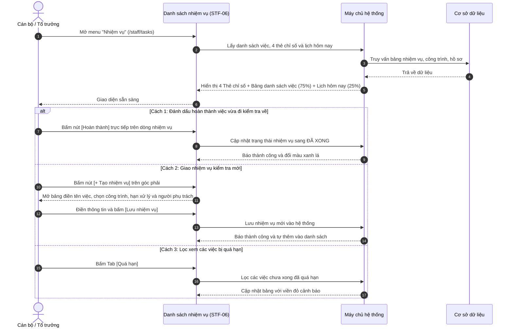

# STF-06 — Quản Lý Nhiệm Vụ Ca Trực & Khảo Sát Hiện Trường (Staff Tasks List)

> **Tài liệu hướng dẫn & đặc tả màn hình — Hệ thống Quản trị Bụi Đô thị DustGuard VN**  
> Bảng điều phối và theo dõi lịch công tác hiện trường hàng ngày của Cán bộ thanh tra xây dựng, môi trường và Đội Thanh niên tình nguyện: phân loại 4 công việc thực địa, chia 2 cột danh sách việc và lịch trình công tác theo giờ, nút bấm 1 chạm để đánh dấu hoàn thành hoặc xin đổi hạn.

---

## 1. Thông Tin Chung Về Màn Hình

| Thuộc tính | Thông tin chi tiết | Ghi chú |
|---|---|---|
| **Mã màn hình** | `STF-06` | Mã định danh màn hình trong hệ thống |
| **Tên màn hình** | Quản lý nhiệm vụ ca trực & Khảo sát hiện trường | Tên hiển thị trên menu điều hướng |
| **Tên tiếng Anh** | Staff Tasks List & Field Inspections | Tên hiển thị giao diện tiếng Anh |
| **Đường dẫn (URL)** | `/staff/tasks` | Địa chỉ truy cập chính |
| **File giao diện** | [`app/src/apps/staff/pages/tasks/TasksListPage.jsx`](file:///d:/07-Competitions-Hackathons/unicef-dustguard/app/src/apps/staff/pages/tasks/TasksListPage.jsx) | Mã nguồn trang giao diện React |
| **File xử lý dữ liệu** | [`app/server/routes/api/staff-tasks.js`](file:///d:/07-Competitions-Hackathons/unicef-dustguard/app/server/routes/api/staff-tasks.js) | File xử lý dữ liệu backend |
| **Khung bố cục** | [`app/src/apps/staff/layout/StaffLayout.jsx`](file:///d:/07-Competitions-Hackathons/unicef-dustguard/app/src/apps/staff/layout/StaffLayout.jsx) | Khung giao diện cán bộ |
| **Ai được sử dụng** | Cán bộ thanh tra, Giám sát viên địa bàn, Đội trưởng cơ động | Người dân không xem được danh sách nội bộ |

---

## 2. Mục Đích & Tình Huống Sử Dụng Thực Tế

### 2.1. Cán bộ dùng màn hình này khi nào?
Màn hình **STF-06** là "Bảng phân công tác chiến hiện trường" cho cán bộ thanh tra môi trường đô thị và lực lượng xung kích (Đoàn Thanh niên, CLB Môi trường, Tình nguyện viên). Màn hình giúp trả lời 4 câu hỏi thực tế:
1. **Ca trực hôm nay tổ công tác phải đi kiểm tra những công trình nào, vào lúc mấy giờ?**
2. **Nhiệm vụ nào đã quá hạn cần ưu tiên đến lập biên bản xử phạt ngay?**
3. **Công trình nào cần quay lại kiểm tra sau 24 giờ để xem nhà thầu đã phủ bạt và bật máy phun sương chưa?**
4. **Hồ sơ nào còn thiếu ảnh chụp xe tải làm rơi vãi đất cát cần chụp bổ sung ngay?**

### 2.2. So sánh cách làm cũ và cách làm mới

| Tiêu chí | Làm theo sổ tay cá nhân & Nhóm Zalo | Làm trên màn hình STF-06 DustGuard VN |
|---|---|---|
| **Phân công việc** | Nhắn tin Zalo dễ trôi tin, không rõ ai nhận việc nào. | Từng nhiệm vụ gắn rõ tên cán bộ, tên công trình và hạn hoàn thành. |
| **Sắp xếp lộ trình đi** | Đi kiểm tra vòng vèo, trùng tuyến đường giữa các tổ. | Cột Lịch trình xếp sẵn các khung giờ từ sáng đến chiều để đi lại thuận tiện nhất. |
| **Theo dõi việc quá hạn** | Khó nhớ việc nào trễ hạn để đôn đốc. | Tự động đổi màu đỏ cảnh báo các việc quá hạn cần xử lý gấp. |
| **Báo cáo hoàn thành** | Phải gọi điện hoặc nhắn tin báo lại cho tổ trưởng. | Bấm 1 nút **[Hoàn thành]** trên điện thoại là hệ thống tự cập nhật xong việc. |

### 2.3. Bốn loại nhiệm vụ thực địa phổ biến
1. **Khảo sát hiện trường lần đầu**: Kiểm tra bạt che, máng rửa lốp xe tải, tường rào tôn quanh công trường.
2. **Tái kiểm tra sau 24 giờ / 48 giờ**: Đến kiểm tra lại xem nhà thầu đã sửa chữa các lỗi ghi trong biên bản chưa.
3. **Chụp bổ sung ảnh vi phạm**: Chụp cận cảnh biển số xe tải làm rơi vãi bùn đất ra đường để lưu vào hồ sơ xử phạt.
4. **Đo nồng độ bụi tại công trường**: Cầm máy đo nồng độ bụi PM2.5 / PM10 vào giờ xe ben ra vào nhiều (08:00 - 11:00 hoặc 14:00 - 17:00).

---

## 3. Đối Tượng Sử Dụng & Luồng Làm Việc Thực Tế

### 3.1. Ai sử dụng màn hình này?
- **Cán bộ thanh tra viên**: Xem danh sách các việc được giao trong ngày, bấm hoàn thành nhiệm vụ sau khi đi thực địa về.
- **Tổ trưởng ca trực**: Tạo việc mới, phân công cho cán bộ hoặc nhóm tình nguyện viên, theo dõi tiến độ cả đội.
- **Tình nguyện viên / Đoàn thanh niên**: Nhận việc hỗ trợ chụp ảnh che chắn hoặc hỗ trợ cầm máy đo bụi tại hiện trường.

### 3.2. Luồng thao tác thực tế trong ca trực



---

## 4. Bố Cục Giao Diện & Khung Hình Trực Quan (Wireframe)

### 4.1. Khung hình trực quan trên màn hình máy tính

```text
+--------------------------------------------------------------------------------------------------------------------+
| TIÊU ĐỀ: Nhiệm vụ được giao                                                        [+ Tạo nhiệm vụ] (Đỏ)   [📅 Lịch] |
|          Quản lý việc cần làm, thời hạn khảo sát hiện trường và các hồ sơ xử lý ô nhiễm bụi.                       |
+--------------------------------------------------------------------------------------------------------------------+
| 4 THẺ CHỈ SỐ CÔNG VIỆC:                                                                                            |
| +---------------------+  +---------------------+  +---------------------+  +---------------------+                 |
| | 📄 Việc hôm nay     |  | ⏰ Gần đến hạn      |  | ⚠️ Quá hạn          |  | ✅ Đã hoàn thành    |                 |
| |        12           |  |        18           |  |         7           |  |        36           |                 |
| | Cần làm trong ngày  |  | Trong 3 ngày tới    |  | Cần xử lý gấp (48h) |  | Hoàn thành tốt     |                 |
| +---------------------+  +---------------------+  +---------------------+  +---------------------+                 |
+--------------------------------------------------------------------------------------------------------------------+
| 5 NÚT CHUYỂN TAB LỌC:                                                                                              |
| [ Tất cả (73) ]  [ Hôm nay (12) ]  [ Gần đến hạn (18) ]  [ Quá hạn (7 - Thẻ đỏ) ]  [ Đã xong (36) ]                 |
+--------------------------------------------------------------------+-----------------------------------------------+
| BẢNG DANH SÁCH NHIỆM VỤ THỰC ĐỊA (~75% Chiều rộng bên trái)        | 📅 LỊCH CÔNG TÁC HÔM NAY (25% ~310px)         |
| +----------------------------------------------------------------+ | --------------------------------------------- |
| | NHIỆM VỤ               | HỒ SƠ | CÔNG TRÌNH      | HẠN   | PHỤ | | 🔵 08:30 Khảo sát hiện trường vi phạm         |
| |------------------------+-------+-----------------+-------+-----| |    Khu đô thị Starlake Tây Hồ Tây           |
| | • Khảo sát bạt che bụi | 📁 2HS| Dự án Starlake  | 14:00 | Ng. | |    Phụ trách: Cán bộ Nguyễn Minh An          |
| |   Kiểm tra bãi tập kết |       | Q. Tây Hồ       |Hôm nay| An  | |                                             |
| |   [Mở hồ sơ] [Sửa] [Đổi hạn] [Hoàn thành] (Nút xanh lá)        | | 🔵 10:15 Tái kiểm tra sau 24h dập bụi       |
| |------------------------+-------+-----------------+-------+-----| |    Dự án Vinhomes Smart City S4             |
| | • Tái kiểm sau 24h     | 📁 1HS| VH Smart City   | 16:30 | Trần| |    Phụ trách: Đội TNV Xung kích 01           |
| |   Nghiệm thu phun sương|       | Q. Nam Từ Liêm  |Hôm nay| Lan | |                                             |
| |   [Mở hồ sơ] [Sửa] [Đổi hạn] [Hoàn thành]                      | | 🔵 14:00 Chụp bổ sung ảnh xe ben rơi đất    |
| |------------------------+-------+-----------------+-------+-----| |    Tuyến Vành Đai 4 (Đoạn qua Hoài Đức)     |
| | • Đo nồng độ bụi PM10  | 📁 1HS| Tuyến Vành đai 4| 11:00 | Lê  | |    Phụ trách: Cán bộ Lê Hùng                |
| |   Đo giờ xe ra vào     |       | H. Hoài Đức     |Quá hạn| Hùng| |                                             |
| |   [Mở hồ sơ] [Sửa] [Đổi hạn] [Hoàn thành]                      | | 🔵 16:00 Đo nồng độ bụi theo quy chuẩn      |
| |------------------------+-------+-----------------+-------+-----| |    Chung cư Imperial Plaza Giải Phóng       |
| | • Bổ sung ảnh vi phạm  | 📁 3HS| Imperial Plaza  | 17:30 | Đoàn| |    Phụ trách: Đoàn Thanh niên Phường        |
| +----------------------------------------------------------------+ | --------------------------------------------- |
| | Hiển thị 1 - 10 trong 73 nhiệm vụ            [Trang trước] [ 1 ] [ 2 ] [Trang sau]                               |
| +------------------------------------------------------------------------------------------------------------------+
| KHUNG TẠO NHIỆM VỤ MỚI (Hiện khi bấm [+ Tạo nhiệm vụ]):                                                            |
| • Tên việc: [Nhập tên công việc cần làm...]                                                                        |
| • Chọn công trình: [Dự án Starlake / Discovery Complex / Rivera Park]                                              |
| • Người phụ trách: [Nguyễn Minh An / Trần Thị Lan / Đội TNV 01]   • Hạn xong: [17:00 03/09/2026]                    |
| • Nút bấm: [ Hủy ]  [ Lưu nhiệm vụ ] (Đỏ son)                                                                      |
+--------------------------------------------------------------------------------------------------------------------+
```

### 4.2. Chi tiết các thành phần trên giao diện
1. **Thanh tiêu đề**: Có tên trang "Nhiệm vụ được giao", nút `[+ Tạo nhiệm vụ]` màu đỏ son và nút `[📅 Lịch]`.
2. **4 Thẻ chỉ số**: Việc hôm nay (12), Gần đến hạn (18), Quá hạn cần làm gấp (7), Đã hoàn thành (36).
3. **Dải 5 Tab lọc**: Lọc nhanh theo tình trạng công việc (*Tất cả, Hôm nay, Gần đến hạn, Quá hạn, Đã xong*).
4. **Bảng danh sách nhiệm vụ (75% bên trái)**:
   - *Cột Nhiệm vụ*: Tên việc in đậm, mô tả phụ rõ ràng, chữ tự xuống dòng không bị cắt cụt.
   - *Cột Hồ sơ*: Thẻ `📁 {số lượng} HS` bấm vào mở thẳng hồ sơ liên quan.
   - *Cột Công trình*: Tên dự án và quận/huyện.
   - *Cột Hạn xử lý*: Giờ hoặc ngày tháng, tự đổi màu đỏ nếu quá hạn.
   - *Cột Thao tác*: Nhóm nút bấm 1 chạm gồm `[Mở hồ sơ]`, `[Sửa]`, `[Đổi hạn]`, `[Hoàn thành]`.
5. **Cột Lịch công tác hôm nay (25% bên phải, rộng 310px)**: Xếp các đầu việc theo mốc giờ từ sáng đến chiều (`08:30`, `10:15`, `14:00`, `16:00`...), giúp cán bộ đi kiểm tra theo tuyến đường hợp lý nhất.

---

## 5. Dữ Liệu & Liên Kết Hệ Thống

### 5.1. Dữ liệu chính trên màn hình
- **Số liệu 4 thẻ đầu trang**: Việc cần làm hôm nay, việc sắp đến hạn trong 3 ngày, việc quá hạn, việc đã hoàn thành.
- **Danh sách nhiệm vụ**: Mã việc, tên việc, mô tả, tên công trình, hạn hoàn thành, cán bộ phụ trách, số hồ sơ gắn kèm.
- **Lịch trình theo giờ**: Danh sách các việc trong ngày xếp theo thứ tự thời gian.

### 5.2. Mẫu dữ liệu trao đổi đơn giản
```json
{
  "todayCount": 12,
  "nearDeadlineCount": 18,
  "overdueCount": 7,
  "doneCount": 36,
  "items": [
    {
      "id": "task-01",
      "title": "Khảo sát bạt che bụi công trình",
      "subtitle": "Kiểm tra bạt che bãi cát và máng rửa xe ben",
      "casesCount": 2,
      "siteName": "Dự án Khu đô thị Starlake Tây Hồ Tây",
      "deadline": "14:00 02/09/2026",
      "assigneeName": "Nguyễn Minh An",
      "status": "Hôm nay",
      "statusColor": "blue"
    }
  ],
  "schedule": [
    {
      "time": "08:30",
      "title": "Khảo sát bạt che bụi công trình",
      "site": "Dự án Khu đô thị Starlake",
      "assignee": "Nguyễn Minh An"
    }
  ]
}
```

---

## 6. Bảng Nút Bấm & Thao Tác Chi Tiết

| Nút bấm / Thao tác | Vị trí | Hành động khi bấm | Ai được bấm |
|---|---|---|:---:|
| **`[+ Tạo nhiệm vụ]`** | Góc trên bên phải | Mở bảng tạo nhiệm vụ kiểm tra mới và giao cho cán bộ. | Tổ trưởng, Quản trị viên |
| **`[📅 Lịch]`** | Cạnh nút Tạo nhiệm vụ | Mở bảng xem toàn bộ lịch công tác tuần. | Tất cả cán bộ |
| **`[5 Tab lọc]`** | Dải nút dưới thẻ KPI | Lọc danh sách việc theo tình trạng (*Tất cả, Hôm nay, Gần đến hạn, Quá hạn, Đã xong*). | Tất cả cán bộ |
| **`[Hoàn thành]`** | Trên từng dòng việc | Đánh dấu việc đã làm xong, đổi sang màu xanh lá cây ngay lập tức. | Cán bộ phụ trách |
| **`[Mở hồ sơ]`** | Trên từng dòng việc | Mở thẳng hồ sơ vụ việc liên quan (`/staff/cases/:id`). | Tất cả cán bộ |
| **`[Đổi hạn]`** | Trên từng dòng việc | Mở bảng gia hạn thêm thời gian hoàn thành (kèm lý do công vụ). | Cán bộ phụ trách |
| **`[Sửa]`** | Trên từng dòng việc | Mở bảng sửa nội dung công việc hoặc chuyển người phụ trách. | Tổ trưởng, Quản trị viên |

---

## 7. Quy Chuẩn Giao Diện Sáng Màu & Dễ Nhìn

### 7.1. Tông màu sáng, chữ đậm, dễ nhìn ngoài đường
- **Nền trang**: Màu kem sáng nhạt (`#FAFAF9`), không gây mỏi mắt.
- **Nền bảng & khung lịch**: Màu trắng tinh (`#FFFFFF`), viền xám nhẹ (`#E7E5E4`), tuyệt đối không dùng hiệu ứng mờ kính (No Glassmorphism).
- **Màu chữ**: Màu đen mực in đậm nét (`#1C1917`), đảm bảo đọc tốt dưới ánh sáng ngoài trời.
- **Màu sắc trạng thái**:
  - *Việc hôm nay*: Nền xanh dương nhạt, chữ xanh dương (`#2563EB`).
  - *Quá hạn*: Nền đỏ nhạt, chữ đỏ son đậm (`#B91C1C`).
  - *Đã hoàn thành*: Nền xanh lá nhạt, chữ xanh lá (`#16A34A`).
- **Nút bấm**: Chiều cao tối thiểu 44px, dễ dàng bấm bằng 1 tay khi cán bộ đang đứng ngoài công trường.

### 7.2. Tương thích trên máy tính và điện thoại
- **Trên máy tính 14-inch**: Bố cục 2 cột song song hoàn hảo: Bảng danh sách chiếm 75%, Cột lịch hôm nay nằm gọn bên phải rộng 310px.
- **Trên điện thoại**: Cột lịch tự xếp xuống dưới, bảng nhiệm vụ chuyển thành các thẻ danh thiếp riêng biệt có nút **[Hoàn thành]** to bản, dễ bấm.

---

## 8. Các Tình Huống Lỗi Thường Gặp & Cách Xử Lý

### 8.1. Các lỗi thực tế hay gặp
1. **Nhiệm vụ chưa gắn với hồ sơ nào**: Hệ thống hiển thị nhãn mặc định, không làm lỗi giao diện.
2. **Lệch giờ do máy tính chỉnh sai**: Toàn bộ thời gian được chuẩn hóa theo giờ Việt Nam (GMT+7) và hiển thị số giờ đếm lùi rõ ràng.
3. **Bấm Hoàn thành nhưng mạng bị chập chờn**: Hệ thống tự lưu lại trạng thái và gửi lại khi có mạng, có thông báo rõ ràng cho cán bộ.
4. **Tên công việc dài**: Tự động xuống dòng gọn gàng, không che khuất các nút bấm thao tác.

### 8.2. Lệnh kiểm tra nhanh cho kỹ thuật viên
Chạy trực tiếp trên cửa sổ PowerShell:
```powershell
# 1. Kiểm tra tính năng phân hệ nhiệm vụ
node --test app/tests/field-operations-inspection-qa.test.js

# 2. Kiểm tra phân quyền cán bộ
node --test app/tests/admin-executive-rbac-penetration.test.js

# 3. Kiểm tra toàn diện hệ thống
npm --prefix app run verify:quick
```
