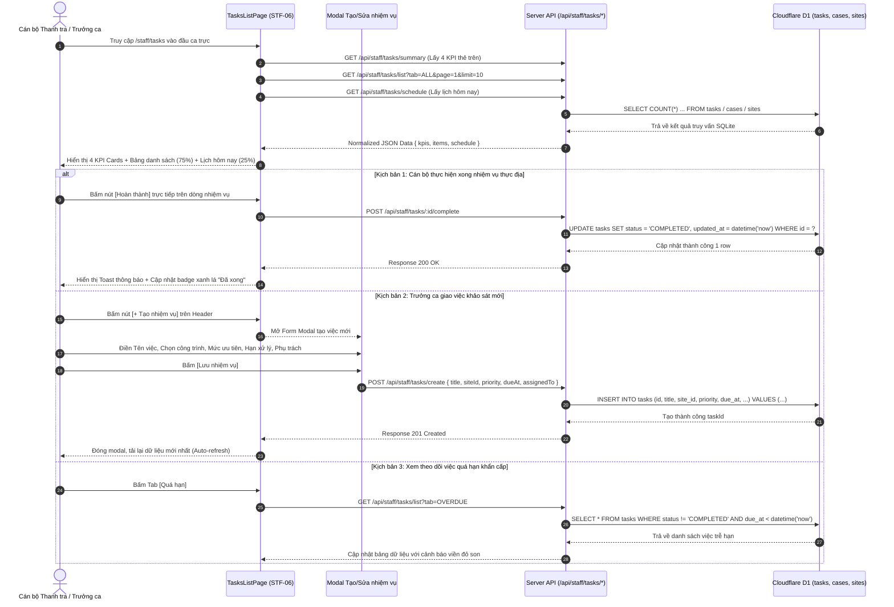

# STF-06 — Quản Lý Nhiệm Vụ Ca Trực & Khảo Sát Hiện Trường (Staff Tasks List & Field Inspections)

> **Tài liệu đặc tả màn hình chuẩn SSOT (Single Source of Truth) — DustGuard VN CivicTech Platform**  
> Trung tâm điều phối và theo dõi lịch công tác hiện trường hàng ngày của cán bộ thanh tra xây dựng/môi trường và đội hình thanh niên tình nguyện: phân luồng 4 loại nhiệm vụ thực địa (khảo sát ban đầu, tái kiểm sau 24h, bổ sung ảnh thiếu, đo nồng độ bụi QCVN 05:2023), phân cấp Split Layout ~75% danh sách / ~25% lịch trình theo giờ, kết nối trực tiếp cơ sở dữ liệu Cloudflare D1 / SQLite `dev.db`.

---

## 1. Screen Identity

| Thuộc tính | Giá trị SSOT | Ghi chú kỹ thuật |
|---|---|---|
| **Mã màn hình** | `STF-06` | Mã định danh chuẩn trong Design System |
| **Tên tiếng Việt** | Quản lý nhiệm vụ ca trực & Khảo sát hiện trường | Nhãn hiển thị chính thức trên hệ thống |
| **Tên tiếng Anh** | Staff Tasks List & Field Inspections | Tên tiếng Anh đối ngoại & API Contract |
| **Đường dẫn (Route)** | `/staff/tasks` | Canonical Route (Hỗ trợ deep-link `/staff/tasks/:id`) |
| **Component Path** | [`app/src/apps/staff/pages/tasks/TasksListPage.jsx`](file:///d:/07-Competitions-Hackathons/unicef-dustguard/app/src/apps/staff/pages/tasks/TasksListPage.jsx) | React 19 Client Component |
| **Backend Service / Route** | [`app/server/routes/api/staff-tasks.js`](file:///d:/07-Competitions-Hackathons/unicef-dustguard/app/server/routes/api/staff-tasks.js) | Express / Worker Hono API Controller |
| **API Client** | [`app/src/lib/api/request.js`](file:///d:/07-Competitions-Hackathons/unicef-dustguard/app/src/lib/api/request.js) | Các hàm gọi API phân hệ Tasks |
| **Layout bọc** | [`app/src/apps/staff/layout/StaffLayout.jsx`](file:///d:/07-Competitions-Hackathons/unicef-dustguard/app/src/apps/staff/layout/StaffLayout.jsx) | Sidebar 8 mục nghiệp vụ điều hành Staff |
| **Vai trò truy cập (Role)** | `staff` (Cán bộ Thanh tra Môi trường, Giám sát viên địa bàn, Đội trưởng cơ động) | RBAC xác thực qua `useAuth()` |
| **Trạng thái thực thi** | **ACTIVE (Level 5 Production Coherent)** | Kết nối 100% CSDL D1 thật, Zero-Mock |

---

## 2. Mục Đích & Giá Trị Thực Tế

### 2.1. Mục đích thiết kế
Màn hình **STF-06** là "Bảng phân công tác chiến hiện trường" cho cán bộ thanh tra môi trường đô thị cấp Quận/Huyện/Phường và lực lượng xung kích (Đoàn Thanh niên, CLB Môi trường ĐH Xây dựng, Tình nguyện viên cộng đồng). Màn hình giải quyết 4 câu hỏi thực tế sống còn:
1. *Ca trực hôm nay tôi và tổ công tác phải đi những công trình nào, vào khung giờ nào để bắt quả tang hành vi thi công gây bụi?*
2. *Nhiệm vụ nào đã quá hạn $SLA > 48\text{h}$ cần ưu tiên đến lập biên bản xử phạt ngay trước khi nhà thầu tẩu tán vi phạm?*
3. *Công trình nào cần tái kiểm tra sau 24h để nghiệm thu việc phủ bạt và bật hệ thống phun sương dập bụi?*
4. *Nhiệm vụ nào còn thiếu ảnh minh chứng hiện trường cần bổ sung gấp trước khi hoàn thiện hồ sơ chuyển UBND Quận ra quyết định xử phạt?*

### 2.2. Giá trị thực tế & Thay thế cách làm cũ (Civic Value)
- **Thay thế sổ tay ghi chép và nhóm chat Zalo rời rạc**: Trước đây, phân công kiểm tra hiện trường thường nhắn qua Zalo hoặc ghi vào sổ tay cá nhân dẫn đến tình trạng "quên lịch", "trùng tuyến đường" hoặc "không rõ ai chịu trách nhiệm khi quá hạn". STF-06 số hóa 100% nhiệm vụ thành các bản ghi gắn mã định danh công trình (`siteId`), mã hồ sơ (`caseId`) và cán bộ/nhóm phụ trách cụ thể (`assigned_profile_id`).
- **Phân định rõ 4 loại nhiệm vụ thực địa đặc thù tại Việt Nam**:
  1. `INITIAL_INSPECTION` (Khảo sát hiện trường vi phạm lần đầu): Kiểm tra bạt che, máng rửa lốp xe tải ben, tường rào tôn $\ge 2.5\text{m}$.
  2. `RE_INSPECTION_24H` (Tái kiểm sau 24h / 48h): Đối soát xem nhà thầu đã khắc phục triệt để các tồn tại ghi trong biên bản chưa.
  3. `ADD_EVIDENCE_PHOTO` (Bổ sung ảnh minh chứng thiếu): Chụp bổ sung góc chụp cận cảnh xe tải làm rơi vãi đất cát ra lòng đường phục vụ lưu hồ sơ xử phạt.
  4. `QCVN_PM_MEASUREMENT` (Đo nồng độ bụi định kỳ QCVN 05:2023): Tiến hành đo nồng độ bụi PM10, PM2.5 tại ranh giới công trường vào giờ cao điểm vận chuyển đất đá (08:00 - 11:00 hoặc 14:00 - 17:00).
- **Phân bổ giao diện Split Layout thông minh**:
  - Cột trái (~75%): Bảng danh sách nhiệm vụ toàn diện có phân trang, bộ lọc tab 5 trạng thái (`Tất cả`, `Hôm nay`, `Gần đến hạn`, `Quá hạn`, `Đã xong`) và các nút thao tác 1 chạm (`[Hoàn thành]`, `[Đổi hạn]`, `[Mở hồ sơ]`).
  - Cột phải (Cố định 310px - 320px): Khối **Lịch công tác hôm nay (Today Schedule Panel)** xếp theo trục thời gian từ sáng đến chiều, giúp cán bộ tối ưu hóa lộ trình di chuyển giữa các công trình trên địa bàn phường/quận.

---

## 3. Đối Tượng Người Dùng & Hành Trình Thao Tác (User Journey)

### 3.1. Đối tượng sử dụng
- **Cán bộ thanh tra xây dựng / Môi trường cấp Quận/Phường**: Trực tiếp đến hiện trường kiểm tra, lập biên bản, kiểm soát hạn chót SLA 48h và đánh dấu hoàn thành nhiệm vụ.
- **Tổ trưởng tổ thanh tra / Trưởng ca điều hành**: Khởi tạo nhiệm vụ mới, phân công cho cán bộ địa bàn hoặc nhóm tình nguyện viên, theo dõi tiến độ tổng thể ca trực.
- **Nhóm Thanh niên tình nguyện viên / Cộng tác viên hiện trường**: Tiếp nhận nhiệm vụ hỗ trợ chụp ảnh bổ sung hiện trạng bạt che hoặc hỗ trợ đo kiểm thiết bị cảm biến cầm tay.

### 3.2. Sơ đồ hành trình tác nghiệp (Sequence Diagram & Core Flow)



---

## 4. Bố Cục Giao Diện & Phân Cấp Thông Tin (Information Hierarchy)

### 4.1. Khung dây giao diện tổng thể (ASCII Wireframe)

```text
+--------------------------------------------------------------------------------------------------------------------+
| [Staff Layout Header] Trang chính / Nhiệm vụ                                       (🔔 8) [Cán bộ: Nguyễn Minh An] |
+--------------------------------------------------------------------------------------------------------------------+
|                                                                                                                    |
|  Nhiệm vụ được giao                                                        [+ Tạo nhiệm vụ] (Đỏ)   [📅 Xem lịch]   |
|  Quản lý việc cần làm, thời hạn khảo sát hiện trường và hồ sơ xử lý ô nhiễm bụi.                                  |
|                                                                                                                    |
|  +---------------------+  +---------------------+  +---------------------+  +---------------------+                |
|  | 📄 Việc hôm nay     |  | ⏰ Gần đến hạn      |  | ⚠️ Quá hạn          |  | ✅ Đã xong          |                |
|  |   12                |  |   18                |  |   7                 |  |   36                |                |
|  | Cần xử lý trong ngày|  | Trong 3 ngày tới    |  | Cần xử lý gấp ($SLA)|  | Hoàn thành tốt ca   |                |
|  +---------------------+  +---------------------+  +---------------------+  +---------------------+                |
|                                                                                                                    |
|  [ (Tất cả: 73) ] [ Hôm nay: 12 ] [ Gần đến hạn: 18 ] [ Quá hạn: 7 (Đỏ) ] [ Đã xong: 36 ]                          |
|                                                                                                                    |
|  +-----------------------------------------------------------------+ +------------------------------------------+  |
|  | BẢNG DANH SÁCH NHIỆM VỤ THỰC ĐỊA (~75% Chiều rộng Desktop)      | | 📅 LỊCH CÔNG TÁC HÔM NAY (310px Cố định) |  |
|  +-----------------------------------------------------------------+ +------------------------------------------+  |
|  | NHIỆM VỤ               | HỒ SƠ | CÔNG TRÌNH      | HẠN   | PHỤ TRÁCH| | 🔵 08:30 Khảo sát hiện trường vi phạm  |  |
|  |------------------------+-------+-----------------+-------+----------| |    Khu đô thị Starlake Tây Hồ Tây    |  |
|  | • Khảo sát bạt che bụi | 📁 2HS| Dự án Starlake  | 14:00 | Ng.M.An  | |    Phụ trách: Cán bộ Nguyễn Minh An   |  |
|  |   Kiểm tra bãi tập kết |       | Q. Tây Hồ       | Hôm nay          | |                                          |
|  |   [Mở hồ sơ] [Sửa] [Đổi hạn] [Hoàn thành] (Xanh lá)                 | | 🔵 10:15 Tái kiểm sau 24h dập bụi      |  |
|  |------------------------+-------+-----------------+-------+----------| |    Dự án Vinhomes Smart City S4      |  |
|  | • Tái kiểm sau 24h     | 📁 1HS| VH Smart City   | 16:30 | Trần Lan | |    Phụ trách: Đội TNV Xung kích 01    |  |
|  |   Nghiệm thu phun sương|       | Q. Nam Từ Liêm  | Hôm nay          | |                                          |
|  |   [Mở hồ sơ] [Sửa] [Đổi hạn] [Hoàn thành]                           | | 🔵 14:00 Bổ sung ảnh chụp xe ben rơi đất|  |
|  |------------------------+-------+-----------------+-------+----------| |    Tuyến Vành Đai 4 (Đoạn qua Hoài Đức)|  |
|  | • Đo nồng độ PM10      | 📁 1HS| Tuyến Vành đai 4| 11:00 | Lê Hùng  | |    Phụ trách: Cán bộ Lê Hùng         |  |
|  |   Đo QCVN 05:2023      |       | H. Hoài Đức     | Quá hạn          | |                                          |
|  |   [Mở hồ sơ] [Sửa] [Đổi hạn] [Hoàn thành]                           | | 🔵 16:00 Đo kiểm nồng độ bụi QCVN 05   |  |
|  |------------------------+-------+-----------------+-------+----------| |    Chung cư Imperial Plaza Giải Phóng|  |
|  | • Bổ sung ảnh minh chứng| 📁 3HS| Imperial Plaza  | 17:30 | Đoàn TN  | |    Phụ trách: Đoàn TN Phường Giáp Bát |  |
|  +-----------------------------------------------------------------+ +------------------------------------------+  |
|  | Hiển thị 1 - 10 trong 73 nhiệm vụ                 [< Trước] [1] [2] [3]... [Sau >]                              |
|  +----------------------------------------------------------------------------------------------------------------+
```

### 4.2. Chi tiết phân cấp thông tin giao diện
1. **Thanh Header & Nút hành động đầu trang**:
   - Tiêu đề cấp 1: "Nhiệm vụ được giao" (Font Black `#1C1917`, $24\text{px}$).
   - Mô tả ngắn gọn: "Quản lý việc cần làm, thời hạn khảo sát hiện trường và hồ sơ xử lý ô nhiễm bụi."
   - Nút `[+ Tạo nhiệm vụ]` (Nền đỏ son `#B91C1C`, chữ trắng đậm, chiều cao tối thiểu $38\text{px} - 44\text{px}$).
   - Nút `[📅 Xem lịch]` (Nền trắng, viền `#E7E5E4`, icon lịch).
2. **Hàng 4 Thẻ KPI Thời Gian Thực (Top Metric Cards)**:
   - **Việc hôm nay** (`todayCount`): Nền `#EFF6FF`, icon xanh dương `#2563EB`, nhãn "Cần xử lý trong ngày".
   - **Gần đến hạn** (`nearDeadlineCount`): Nền `#FFF7ED`, icon cam `#EA580C`, nhãn "Trong 3 ngày tới".
   - **Quá hạn** (`overdueCount`): Nền `#FEF2F2`, icon đỏ son `#B91C1C`, nhãn "Cần xử lý gấp ($SLA > 48\text{h}$)".
   - **Đã xong** (`doneCount`): Nền `#F0FDF4`, icon xanh lục `#16A34A`, nhãn "Hoàn thành tốt".
3. **Thanh Tab Lọc Trạng Thái (Filter Tabs Bar)**:
   - 5 Tab lựa chọn: `[Tất cả]`, `[Hôm nay]`, `[Gần đến hạn]`, `[Quá hạn]`, `[Đã xong]`.
   - Tab được chọn có nền `#1C1917` (đen mực) hoặc viền đỏ đậm, tab không chọn có nền trắng viền xám mềm `#E7E5E4`.
4. **Bảng Danh Sách Nhiệm Vụ (Left Main Table ~75%)**:
   - **Cột 1: Nhiệm vụ**: Tên nhiệm vụ in đậm to bản + Mô tả phụ ngắn gọn (Áp dụng **Zero Truncate**, tự động xuống dòng).
   - **Cột 2: Hồ sơ liên kết**: Phù hiệu `📁 {casesCount} HS` kèm link điều hướng sang chi tiết hồ sơ `/staff/cases/:id`.
   - **Cột 3: Công trình & Địa bàn**: Tên công trình kèm Quận/Huyện.
   - **Cột 4: Hạn xử lý**: Mốc giờ hoặc ngày tháng (Màu đỏ nếu quá hạn, màu xanh dương nếu trong ngày, màu xám nếu đã xong).
   - **Cột 5: Phụ trách**: Tên cán bộ thanh tra hoặc tổ tình nguyện viên.
   - **Cột 6: Trạng thái & Thao tác nhanh**: Badge trạng thái (`Hôm nay`, `Quá hạn`, `Đã xong`) + Nhóm nút bấm `[Mở]`, `[Sửa]`, `[Đổi hạn]`, `[Hoàn thành]`.
5. **Cột Lịch Trình Ca Trực Hôm Nay (Right Schedule Panel 310px)**:
   - Liệt kê tối đa 6 mốc công tác trong ngày xếp theo giờ tăng dần (`08:30`, `10:15`, `14:00`, `16:00`...).
   - Mỗi mốc có chấm tròn thời gian, tiêu đề công việc, tên công trình và cán bộ/nhóm TNV phụ trách.

---

## 5. Dữ Liệu & Hợp Đồng API / CSDL D1 (Data Contract)

### 5.1. Các Endpoints API Phân Hệ Nhiệm Vụ

#### A. Lấy thống kê 4 thẻ KPI đầu trang
```http
GET /api/staff/tasks/summary
Authorization: Bearer <staff_jwt_token>
```
**Response JSON SSOT**:
```json
{
  "success": true,
  "data": {
    "todayCount": 12,
    "nearDeadlineCount": 18,
    "overdueCount": 7,
    "doneCount": 36
  },
  "message": "Thống kê nhiệm vụ"
}
```

#### B. Lấy danh sách nhiệm vụ có lọc & phân trang
```http
GET /api/staff/tasks/list?tab=ALL&page=1&limit=10&search=
Authorization: Bearer <staff_jwt_token>
```
**Response JSON SSOT**:
```json
{
  "success": true,
  "data": {
    "items": [
      {
        "id": "tsk_01jk98a1",
        "title": "Khảo sát bạt che bụi công trình",
        "subtitle": "Kiểm tra bạt che chắn bãi vật liệu cát đá và máng rửa xe ben",
        "casesCount": 2,
        "siteName": "Dự án Khu đô thị Starlake Tây Hồ Tây",
        "deadline": "14:00 02/09/2026",
        "assigneeName": "Nguyễn Minh An (Thanh tra viên)",
        "status": "Hôm nay",
        "statusColor": "blue"
      },
      {
        "id": "tsk_01jk98b2",
        "title": "Tái kiểm sau 24h dập bụi phun sương",
        "subtitle": "Nghiệm thu việc lắp đặt giàn phun sương dập bụi tại cổng số 2",
        "casesCount": 1,
        "siteName": "Dự án Chung cư Rivera Park",
        "deadline": "09:30 01/09/2026",
        "assigneeName": "Trần Thị Lan (Tổ TNV ĐH Xây dựng)",
        "status": "Quá hạn",
        "statusColor": "red"
      }
    ],
    "pagination": {
      "page": 1,
      "limit": 10,
      "total": 73,
      "totalPages": 8
    }
  },
  "message": "Danh sách nhiệm vụ"
}
```

#### C. Lấy lịch trình công tác hôm nay
```http
GET /api/staff/tasks/schedule
Authorization: Bearer <staff_jwt_token>
```
**Response JSON SSOT**:
```json
{
  "success": true,
  "data": {
    "items": [
      {
        "id": "tsk_01jk98a1",
        "time": "08:30",
        "title": "Khảo sát bạt che bụi công trình",
        "site": "Dự án Khu đô thị Starlake Tây Hồ Tây",
        "assignee": "Nguyễn Minh An"
      },
      {
        "id": "tsk_01jk98c3",
        "time": "10:15",
        "title": "Tái kiểm sau 24h dập bụi",
        "site": "Vinhomes Smart City S4",
        "assignee": "Đội TNV Xung kích 01"
      }
    ]
  },
  "message": "Lịch trình hôm nay"
}
```

#### D. Tạo mới nhiệm vụ thực địa
```http
POST /api/staff/tasks/create
Content-Type: application/json
Authorization: Bearer <staff_jwt_token>

{
  "title": "Bổ sung ảnh chụp xe ben làm rơi vãi đất cát",
  "description": "Chụp 3 góc cận cảnh biển số xe tải và vệt bùn đất dài 50m trên đường gom",
  "siteId": "site_hn_0428",
  "priority": "HIGH",
  "dueAt": "2026-09-03T17:00:00.000Z",
  "assignedTo": "Nguyễn Minh An"
}
```

#### E. Đánh dấu hoàn thành nhiệm vụ
```http
POST /api/staff/tasks/:id/complete
Authorization: Bearer <staff_jwt_token>
```

### 5.2. Các bảng D1 SQLite tham gia truy vấn (SSOT Schema)

```sql
-- 1. Bảng lưu trữ nhiệm vụ công tác thực địa (tasks)
CREATE TABLE IF NOT EXISTS tasks (
  id TEXT PRIMARY KEY,
  code TEXT UNIQUE,
  title TEXT NOT NULL,
  description TEXT,
  site_id TEXT REFERENCES sites(id),
  case_id TEXT REFERENCES cases(id),
  priority TEXT DEFAULT 'NORMAL' CHECK (priority IN ('LOW', 'NORMAL', 'HIGH', 'CRITICAL')),
  status TEXT DEFAULT 'IN_PROGRESS' CHECK (status IN ('PENDING', 'IN_PROGRESS', 'COMPLETED', 'CANCELLED')),
  due_at DATETIME NOT NULL,
  assigned_profile_id TEXT,
  created_by TEXT,
  created_at DATETIME DEFAULT CURRENT_TIMESTAMP,
  updated_at DATETIME DEFAULT CURRENT_TIMESTAMP,
  deleted_at DATETIME
);

-- Chỉ mục tối ưu hóa tốc độ truy vấn ca trực (< 0.05s)
CREATE INDEX IF NOT EXISTS idx_tasks_due_status ON tasks(status, due_at) WHERE deleted_at IS NULL;
CREATE INDEX IF NOT EXISTS idx_tasks_site_id ON tasks(site_id) WHERE deleted_at IS NULL;
CREATE INDEX IF NOT EXISTS idx_tasks_case_id ON tasks(case_id) WHERE deleted_at IS NULL;
```

---

## 6. Hành Động Cốt Lõi (CTAs & Interactions)

| Hành động (CTA) | Vị trí kích hoạt | Màu sắc & Định dạng | Hành vi & Phản hồi hệ thống | Phân quyền (RBAC) |
|---|---|---|---|:---:|
| **`[+ Tạo nhiệm vụ]`** | Góc phải Header trang | Nền đỏ son `#B91C1C`, chữ trắng đậm, `min-h-[38px]` | Mở Modal Form "Tạo nhiệm vụ công tác mới" với các trường nhập liệu chuẩn. | `staff`, `admin` |
| **`[📅 Xem lịch]`** | Cạnh nút tạo nhiệm vụ | Nền trắng viền `#E7E5E4`, chữ đen đậm | Mở modal hiển thị toàn bộ lịch trình công tác tuần dạng Calendar Grid. | `staff`, `admin` |
| **`[Tab Lọc]`** | 5 Tab trên đầu bảng | Nền đen/trắng, viền sắc nét | Chuyển đổi bộ lọc dữ liệu (`ALL`, `TODAY`, `NEAR`, `OVERDUE`, `DONE`) và reset về trang 1. | `staff`, `admin` |
| **`[Hoàn thành]`** | Tại từng dòng nhiệm vụ | Nền xanh lục `#F0FDF4`, chữ xanh lá đậm `#16A34A` | Gửi `POST /api/staff/tasks/:id/complete`, cập nhật status sang `COMPLETED`, hiển thị Toast xanh lá. | `staff` |
| **`[Mở hồ sơ]`** | Tại từng dòng nhiệm vụ | Nền xám nhạt `#F5F5F4`, chữ đen `#1C1917` | Điều hướng deep-link sang màn hình chi tiết hồ sơ liên kết `/staff/cases/:caseId`. | `staff` |
| **`[Đổi hạn]`** | Tại từng dòng nhiệm vụ | Nền cam nhạt `#FFF7ED`, chữ cam `#EA580C` | Mở hộp thoại nhanh cho phép gia hạn thời gian hoàn thành (kèm lý do gia hạn công vụ). | `staff` |
| **`[Phân trang]`** | Cuối bảng danh sách | Nút chuyển trang `[< Trước]`, `[1]`, `[2]`, `[Sau >]` | Tải trang dữ liệu kế tiếp qua API query `page=N`. | `staff` |

---

## 7. Quy Chuẩn UI/UX & Responsive (Design System Tokens)

### 7.1. Bảng màu Civic Tech High-Contrast (Không Glassmorphism)
- **Nền trang chính**: `#FAFAF9` (Stone-50 — Màu kem sáng văn phòng hành chính).
- **Nền Card / Bảng dữ liệu**: `#FFFFFF` nguyên khối, viền `#E7E5E4` (Stone-200), bóng đổ nhẹ `shadow-2xs`.
- **Màu văn bản chính**: `#1C1917` (Stone-900 — Đen mực in đậm nét, độ tương phản $\ge 7:1$).
- **Màu thương hiệu & Khẩn cấp**: `#B91C1C` (Red-700 — Đỏ son Civic Tech, tuyệt đối không dùng màu neon).
- **Màu trạng thái nhiệm vụ**:
  - *Việc hôm nay / Đang làm*: Nền `#EFF6FF`, chữ `#2563EB`, viền `#BFDBFE`.
  - *Gần đến hạn*: Nền `#FFF7ED`, chữ `#EA580C`, viền `#FED7AA`.
  - *Quá hạn*: Nền `#FEF2F2`, chữ `#B91C1C`, viền `#FECACA`.
  - *Đã hoàn thành*: Nền `#F0FDF4`, chữ `#16A34A`, viền `#BBF7D0`.

### 7.2. Chuẩn hiển thị Responsive Đa Màn Hình
- **Laptop 14-inch (1366x768, 1440x900, 1536x864 scale 125%)**:
  - Bố cục Split Layout 2 cột song song hoàn hảo: Bảng danh sách chiếm $\approx 75\%$, Cột lịch hôm nay cố định $310\text{px}$.
  - Thanh tiêu đề và cụm nút Header dùng `whitespace-nowrap`, không ngắt dòng (Zero Menu Wrap).
  - Tên nhiệm vụ và công trình tự động xuống dòng linh hoạt (`break-words`), không che khuất chữ (**Zero Truncate**).
- **Tablet (768px - 1024px)**:
  - 4 Thẻ KPI xếp thành lưới 2x2.
  - Cột Lịch trình hôm nay chuyển xuống xếp dưới Bảng danh sách nhiệm vụ.
- **Mobile (360px - 430px)**:
  - 4 Thẻ KPI xếp 1 cột dọc (hoặc cuộn ngang dạng carousel mượt).
  - Bảng nhiệm vụ chuyển đổi thành các Card dạng danh thiếp độc lập với nút `[Hoàn thành]` full-width lớn $\ge 44\text{px}$ để cán bộ bấm thuận tiện bằng 1 tay khi đứng ngoài công trường.

---

## 8. Bẫy Lỗi Thường Gặp & Hướng Dẫn Kiểm Thử (Verification)

### 8.1. Các bẫy lỗi tiềm ẩn & Cơ chế phòng ngừa
1. **Lỗi Nullish khi đếm số vụ việc liên kết (`casesCount`)**: Khi nhiệm vụ mới tạo chưa gắn với vụ việc nào trong bảng `cases`, truy vấn SQL có thể trả về `null`.
   - *Khắc phục*: Sử dụng `COALESCE(casesCount, 0)` trong SQL và toán tử `t.casesCount ?? 0` trên React.
2. **Lỗi lệch múi giờ hạn chót (UTC vs GMT+7)**: Cán bộ nhập hạn 17:00 giờ Việt Nam nhưng lưu vào SQLite thành 10:00 UTC dẫn đến bị tính quá hạn sớm 7 tiếng.
   - *Khắc phục*: Sử dụng chuẩn ISO-8601 rõ ràng, convert sang múi giờ địa phương bằng `Intl.DateTimeFormat('vi-VN', { timeZone: 'Asia/Ho_Chi_Minh' })`.
3. **Lỗi mất đồng bộ giữa bảng danh sách và lịch trình**: Khi bấm `[Hoàn thành]` ở bảng chính, khối Lịch hôm nay bên phải không tự cập nhật.
   - *Khắc phục*: Tự động kích hoạt lại hàm `fetchSchedule()` và `fetchSummary()` sau khi `POST complete` thành công.

### 8.2. Bộ lệnh kiểm thử nhanh PowerShell CLI (< 0.5s)

```powershell
# 1. Kiểm thử phân hệ Tasks API & D1 SQLite Contract
node --test app/tests/field-operations-inspection-qa.test.js

# 2. Kiểm thử xác thực quyền hạn RBAC của cán bộ
node --test app/tests/admin-executive-rbac-penetration.test.js

# 3. Kiểm thử Design System Tokens & Responsive không tràn màn hình
node --test app/tests/design-system-tokens.test.js
```
