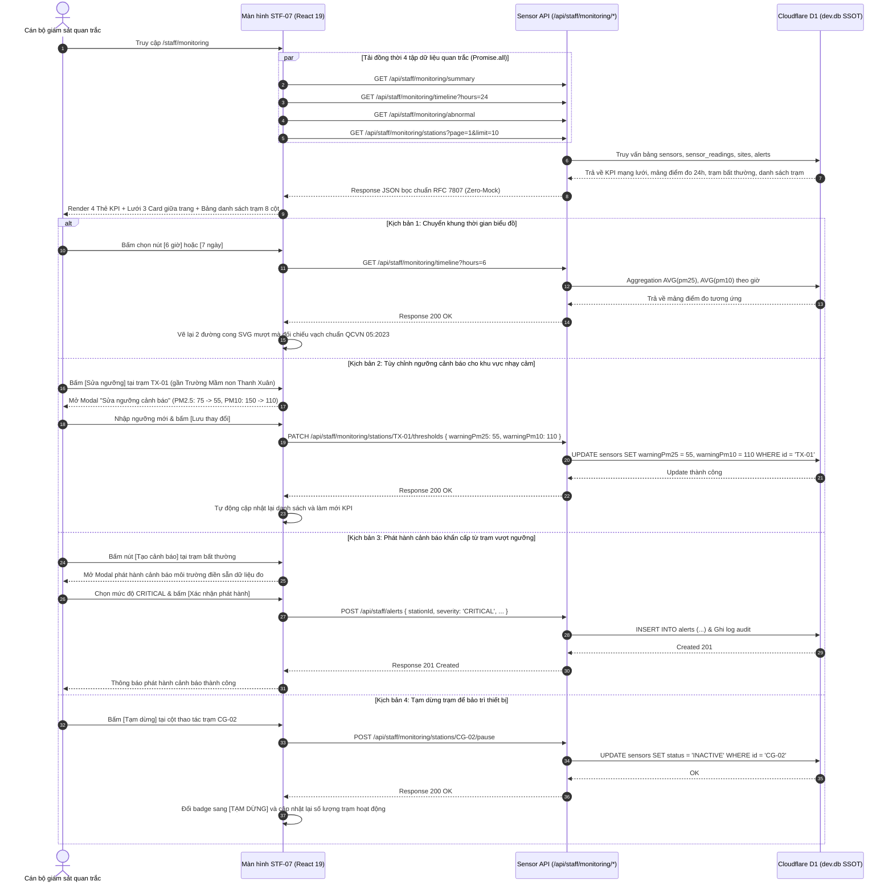

# STF-07 — Ma Trận Giám Sát & Quan Trắc Bụi Công Trình (Real-Time IoT Dust Monitoring Center)

> **Tài liệu đặc tả màn hình chuẩn SSOT (Single Source of Truth) — DustGuard VN CivicTech Platform**  
> Trung tâm theo dõi mạng lưới cảm biến đo bụi PM2.5 / PM10 thời gian thực: phân tích chuỗi thời gian 24 giờ đối chiếu quy chuẩn môi trường QCVN 05:2023/BTNMT, nhúng bản đồ GIS không gian đô thị, định vị trạm bất thường và quản trị vận hành trạm đo trên CSDL Cloudflare D1 / SQLite `dev.db` theo nguyên tắc Zero-Mock.

---

## 1. Screen Identity

| Thuộc tính | Giá trị SSOT | Ghi chú kỹ thuật |
|---|---|---|
| **Mã màn hình** | `STF-07` | Mã định danh chuẩn trong hệ thống Design System & Product Spec |
| **Tên tiếng Việt** | Quan trắc bụi công trình / Ma trận giám sát cảm biến IoT | Nhãn hiển thị chính thức trên Sidebar & thanh tiêu đề |
| **Tên tiếng Anh** | Real-Time IoT Dust Monitoring Center | Tên tiếng Anh đối ngoại, Telemetry Stream & API Metadata |
| **Đường dẫn (Route)** | `/staff/monitoring` | Canonical Route trên phân hệ Cán bộ Thanh tra |
| **Component Path** | [`app/src/apps/staff/pages/monitoring/StaffMonitoringPage.jsx`](file:///d:/07-Competitions-Hackathons/unicef-dustguard/app/src/apps/staff/pages/monitoring/StaffMonitoringPage.jsx) | React 19 Client Component tích hợp biểu đồ SVG động & GIS Adapter |
| **Backend Route** | [`app/server/routes/api/sensors.js`](file:///d:/07-Competitions-Hackathons/unicef-dustguard/app/server/routes/api/sensors.js) | Express & Worker SQLite Engine phục vụ REST Endpoints quan trắc |
| **Layout bọc** | [`app/src/apps/staff/layout/StaffLayout.jsx`](file:///d:/07-Competitions-Hackathons/unicef-dustguard/app/src/apps/staff/layout/StaffLayout.jsx) | Khung giao diện tác nghiệp Cán bộ, Sidebar 12 phân hệ nghiệp vụ |
| **Vai trò truy cập (Role)** | `staff`, `inspector`, `executive`, `admin` | Phân quyền RBAC qua `AuthContext` (Chặn `citizen`, `contractor`, `public`) |
| **Trạng thái thực thi** | **ACTIVE (Level 5 Production Coherent)** | Kết nối 100% CSDL D1 SQLite thật, cơ chế Zero-Mock, Auto-healing Schema |

---

## 2. Mục Đích & Nghiệp Vụ Thực Tế (Business Objectives & Context)

### 2.1. Bối cảnh quan trắc bụi tại các công trường xây dựng đô thị Việt Nam
Tại các đô thị lớn như Hà Nội (Quận Thanh Xuân, Cầu Giấy, Nam Từ Liêm, Hoàng Mai, Bắc Từ Liêm, Hai Bà Trưng...), việc thi công đồng loạt các dự án cao tầng, đường sắt đô thị, hạ tầng giao thông ngầm làm phát tán lượng bụi mịn cực lớn ra môi trường không khí. 

Màn hình **Quan trắc bụi công trình (STF-07)** được thiết kế để cung cấp bức tranh dữ liệu môi trường định lượng liên tục 24/7 từ toàn bộ mạng lưới cảm biến đo bụi tĩnh (lắp tại cổng ra vào công trường, trạm rửa xe tải) và cảm biến di động (gắn trên xe tuần tra hoặc điểm nút giao thông huyết mạch). Màn hình tập trung giải quyết 3 bài toán nghiệp vụ trọng tâm:
1. **Phát hiện sớm nguy cơ phát tán bụi vượt chuẩn QCVN 05:2023/BTNMT**:
   - Ngưỡng PM2.5 trung bình 24 giờ: Cảnh báo nhẹ khi $> 50\,\mu\text{g/m}^3$, Cảnh báo khẩn cấp khi $> 75\,\mu\text{g/m}^3$ (vượt giới hạn tối đa cho phép).
   - Ngưỡng PM10 trung bình 24 giờ: Cảnh báo nhẹ khi $> 100\,\mu\text{g/m}^3$, Cảnh báo khẩn cấp khi $> 150\,\mu\text{g/m}^3$.
2. **Đối chiếu chuỗi thời gian thực nghiệm (Time-series Analysis)**: Phân tích biểu đồ diễn biến nồng độ bụi trong 6 giờ, 24 giờ hoặc 7 ngày qua để nhận diện quy luật thi công vi phạm (VD: Công trường thường lén đào đất, vận chuyển phế thải ban đêm từ 22:00 đến 04:00 sáng mà không tưới nước dập bụi).
3. **Quản trị vận hành mạng lưới & Tùy biến ngưỡng theo khu vực nhạy cảm**: Cho phép cán bộ điều chỉnh giảm ngưỡng kích hoạt cảnh báo đối với các công trình nằm sát trường mầm non, trường tiểu học, bệnh viện, viện dưỡng lão; tạm dừng nhận dữ liệu khi bảo trì cảm biến và xuất báo cáo CSV phục vụ hồ sơ pháp lý xử phạt.

### 2.2. Nguyên tắc Civic Tech: "IoT is Optional — Support, Not Judge"
- **Hỗ trợ định lượng, không thay thế quyền quyết định của con người**: Số liệu từ cảm biến IoT đóng vai trò là "chỉ dấu cảnh báo sớm" giúp Đội QLTTXD và Thanh tra TN&MT lên kế hoạch kiểm tra đột xuất đúng thời điểm vi phạm diễn ra. Hệ thống không tự động ban hành quyết định xử phạt vi phạm hành chính nếu chưa có biên bản khảo sát hiện trường và mẫu đo kiểm định của cơ quan chức năng.
- **Tính toàn vẹn & Chống làm giả số liệu**: Bản ghi đo đạc `sensor_readings` được lưu vết liên tục vào CSDL D1 SQLite kèm dấu thời gian thực và mã định danh phần cứng chống giả mạo.

---

## 3. Đối Tượng Người Dùng & Hành Trình Thao Tác (User Journey)

### 3.1. Đối tượng sử dụng chính
- **Cán bộ quản lý mạng lưới trạm quan trắc**: Theo dõi tình trạng kết nối thiết bị (`ACTIVE` / `INACTIVE` / `ALERT`), cấu hình ngưỡng kích hoạt cảnh báo, xử lý các trạm bị mất tín hiệu hoặc báo lỗi phần cứng (`FAULTY`).
- **Cán bộ thanh tra môi trường trực ca**: Đối chiếu số liệu quan trắc lịch sử khi thụ lý hồ sơ kiểm tra công trình, bấm nút phát hành cảnh báo môi trường khẩn cấp cho tổ công tác cơ động.
- **Lãnh đạo Đội QLTTXD & Sở TN&MT**: Xem bản đồ GIS phân bố các điểm nóng ô nhiễm bụi theo quận huyện để điều phối lực lượng thanh tra liên ngành.

### 3.2. Sơ đồ luồng tác nghiệp giám sát (Monitoring Operations Flow)



---

## 4. Bố Cục Giao Diện & Wireframe ASCII Chi Tiết (Information Hierarchy)

### 4.1. Wireframe bố cục tổng thể chuẩn Desktop 14-Inch (1366x768 / 1440x900)

```text
+-----------------------------------------------------------------------------------------------------------------------+
| [HEADER BAR]                                                                                                          |
| Quan trắc bụi công trình                                            [+ Tạo cảnh báo] (Đỏ) [+ Thêm trạm] [Xuất CSV] (Tr)|
| Theo dõi mạng lưới trạm đo, chỉ số bụi PM2.5/PM10 hiện tại và phát hiện điểm bất thường vượt chuẩn QCVN 05:2023/BTNMT |
+-----------------------------------------------------------------------------------------------------------------------+
| [4 THẺ KPI CHỈ SỐ MẠNG LƯỚI CẢM BIẾN]                                                                                 |
| +-------------------------+ +-------------------------+ +-------------------------+ +-------------------------------+ |
| | 📡 TRẠM HOẠT ĐỘNG       | | 🟢 BÌNH THƯỜNG          | | 🟠 CẦN THEO DÕI         | | 🔴 ĐANG CẢNH BÁO              | |
| | {active} / {total}      | | {normalCount}           | | {warningCount}          | | {alertCount}                  | |
| | Trực tuyến ({activePct}%)| | {normalPct}% tổng trạm | | {warningPct}% tổng trạm| | {alertPct}% vượt QCVN 05:2023  | |
| +-------------------------+ +-------------------------+ +-------------------------+ +-------------------------------+ |
+-----------------------------------------------------------------------------------------------------------------------+
| [LƯỚI 3 CARD TRỰC QUAN GIỮA TRANG] (Lưới 12 cột: 5 cols ~41.6% | 3 cols ~25% | 4 cols ~33.3%)                         |
| +------------------------------------+ +----------------------------------+ +-----------------------------------------+ |
| | CARD 1: DIỄN BIẾN CHỈ SỐ 24H (5 cols| | CARD 2: KHU VỰC QUAN TRẮC (3 cols| | CARD 3: TRẠM ĐO BẤT THƯỜNG (4 cols)    | |
| | Chú giải: — PM2.5 (Đỏ) — PM10 (Cam)| | Bản đồ GIS OpenStreetMap nhúng   | | Danh sách các trạm vượt ngưỡng chuẩn  | |
| | ---------------------------------- | | Phủ các điểm nút theo quận:      | | --------------------------------------- | |
| | [SVG Curve Chart: 2 Đường mượt mà] | | • Cầu Giấy (4 trạm: 1 Cảnh báo)  | | • Trạm TX-01 — Imperial Plaza           | |
| | - - Đường đứt đỏ: QCVN PM10 = 150  | | • Thanh Xuân (3 trạm: 2 Cảnh báo)| |   Khu vực: Thanh Xuân Trung, Q.Thanh X  | |
| | - - Đường đứt cam: QCVN PM2.5 = 75 | | • Nam Từ Liêm (5 trạm: Bình th.) | |   PM2.5: 85 µg/m³ · PM10: 185 µg/m³     | |
| |                                    | | Chú giải: ● Xanh  ● Cam  ● Đỏ    | |   [Mở]   [Sửa ngưỡng]  [+ Cảnh báo]     | |
| | ---------------------------------- | | -------------------------------- | | • Trạm CG-04 — Dự án Discovery Complex  | |
| | [6 giờ]   [24 giờ]   [7 ngày]      | | [Xem bản đồ GIS chi tiết ↗]      | |   PM2.5: 78 µg/m³ · PM10: 160 µg/m³     | |
| | (Tự động cập nhật mỗi 60 giây)     | | (Tọa độ WGS84 chuẩn thực địa)    | | ➔ Xem toàn bộ 5 trạm bất thường       | |
| +------------------------------------+ +----------------------------------+ +-----------------------------------------+ |
+-----------------------------------------------------------------------------------------------------------------------+
| [BẢNG DỮ LIỆU CHÍNH: DANH SÁCH TRẠM QUAN TRẮC] (Chiếm 100% chiều rộng)                                                |
| Bộ lọc: [🔍 Tìm kiếm mã trạm, công trình, địa chỉ...] [Quận: Tất cả ▼] [Trạng thái: Tất cả ▼] [⟳ Làm mới]            |
| +-------------------------------------------------------------------------------------------------------------------+ |
| | Mã trạm | Công trình xây dựng     | Khu vực/Quận | PM2.5 (µg/m³) | PM10 (µg/m³)| Trạng thái   | Cập nhật | Thao tác   | |
| |---------|-------------------------|--------------|---------------|-------------|--------------|----------|------------| |
| | TX-01   | Chung cư Imperial Plaza | Thanh Xuân   |    85 (Đỏ)    |   185 (Đỏ)  | [🔴 CẢNH BÁO]| 10:30    | [Mở] [Sửa] | |
| |         | 360 Giải Phóng, TX, HN  |              | Vượt 75       | Vượt 150    |              |          | [Tạm dừng] | |
| | CG-02   | Tòa Discovery Complex   | Cầu Giấy     |    42 (Xanh)  |    88 (Xanh)| [🟢 B.THƯỜNG]| 10:28    | [Mở] [Sửa] | |
| |         | 302 Cầu Giấy, CG, HN    |              | An toàn       | An toàn     |              |          | [Tạm dừng] | |
| | NTL-05  | The Matrix One Mễ Trì   | Nam Từ Liêm  |    62 (Cam)   |   125 (Cam) | [🟠 THEO DÕI]| 10:25    | [Mở] [Sửa] | |
| |         | Lê Quang Đạo, NTL, HN   |              | Tiệm cận      | Tiệm cận    |              |          | [Tạm dừng] | |
| +-------------------------------------------------------------------------------------------------------------------+ |
| Phân trang: Hiển thị 1-10 trong tổng số {total} trạm quan trắc                 [< Trang trước] [1] [2] [3] [Trang sau >] |
| ⓘ Dữ liệu cảm biến hỗ trợ phát hiện sớm nguy cơ, không tự kết luận vi phạm hành chính nếu chưa có mẫu đo kiểm định.   |
+-----------------------------------------------------------------------------------------------------------------------+
| [MODALS / DIALOGS POPUPS KHI TƯƠNG TÁC]                                                                               |
| 1. Modal "Sửa ngưỡng cảnh báo trạm" (Cho phép hạ ngưỡng riêng đối với khu vực nhạy cảm gần trường học/bệnh viện)      |
| 2. Modal "Đăng ký trạm quan trắc mới" (Mã trạm, tên công trình, tọa độ WGS84, thiết bị đo đạt chuẩn)                |
| 3. Modal "Phát hành cảnh báo môi trường khẩn cấp" (Tạo sự kiện cảnh báo lưu vào CSDL D1 phục vụ mở hồ sơ kiểm tra)   |
+-----------------------------------------------------------------------------------------------------------------------+
```

### 4.2. Chi tiết các khối phân cấp thông tin

#### 1. Khối 4 Thẻ KPI Mạng Lưới Cảm Biến
- **Trạm hoạt động**: Tỷ lệ trạm trực tuyến gửi tín hiệu đều đặn trên tổng số trạm (`activeStations / totalStations`), hiển thị phần trăm trực tuyến.
- **Bình thường (`NORMAL`)**: Số lượng trạm có nồng độ bụi nằm trong giới hạn an toàn ($PM2.5 \le 50\,\mu\text{g/m}^3$ và $PM10 \le 100\,\mu\text{g/m}^3$).
- **Cần theo dõi (`WARNING`)**: Số lượng trạm có nồng độ bụi tiệm cận ngưỡng quy chuẩn ($50 < PM2.5 \le 75$ hoặc $100 < PM10 \le 150$).
- **Đang cảnh báo (`ALERT`)**: Số lượng trạm có nồng độ bụi vượt ngưỡng nghiêm trọng quy định tại QCVN 05:2023/BTNMT ($PM2.5 > 75\,\mu\text{g/m}^3$ hoặc $PM10 > 150\,\mu\text{g/m}^3$).

#### 2. Khối 3 Card Trực Quan Giữa Trang (Middle Grid — Lưới 12 Cột)
- **Card 1 — Diễn biến chỉ số 24h (`xl:col-span-5` ~ 41.6%)**:
  - Biểu đồ SVG đường cong mượt mà thể hiện đồng thời 2 dải nồng độ: PM2.5 (đỏ son `#B91C1C`) và PM10 (cam cháy `#EA580C`).
  - Đường đứt nét đối chiếu chuẩn môi trường Việt Nam: Vạch đỏ $PM10 = 150\,\mu\text{g/m}^3$ và vạch cam $PM2.5 = 75\,\mu\text{g/m}^3$.
  - 3 Nút chuyển đổi nhanh chu kỳ xem dữ liệu: `6 giờ`, `24 giờ`, `7 ngày`.
- **Card 2 — Khu vực quan trắc GIS (`xl:col-span-3` ~ 25.0%)**:
  - Bản đồ GIS nhúng OpenStreetMap định vị các quận nội thành Hà Nội.
  - Phủ các điểm nút trạng thái (Pins) theo màu sắc: Xanh (Bình thường), Cam (Cần theo dõi), Đỏ (Cảnh báo vượt chuẩn).
  - Nút liên kết `[Xem bản đồ GIS chi tiết ↗]` dẫn tới màn hình bản đồ toàn cảnh `/staff/sites`.
- **Card 3 — Trạm đo bất thường (`xl:col-span-4` ~ 33.3%)**:
  - Danh sách rút gọn các trạm đo đang có chỉ số vượt ngưỡng cảnh báo, sắp xếp theo thứ tự nồng độ bụi giảm dần.
  - Mỗi dòng hiển thị mã trạm, tên công trình, nồng độ PM2.5/PM10 hiện tại và cụm nút thao tác nhanh `[Mở]`, `[Sửa ngưỡng]`, `[+ Cảnh báo]`.

#### 3. Khối Bảng Dữ Liệu Trạm Toàn Diện (Bottom Main Table — 8 Cột Chuẩn)
- **Cấu trúc 8 cột chuẩn hóa**:
  1. *Mã trạm*: Mã định danh thiết bị (VD: `TX-01`, `CG-02`), font Monospace đậm.
  2. *Công trình xây dựng*: Tên dự án (**Zero Truncate**, cho phép xuống dòng `break-words`) kèm địa chỉ chi tiết.
  3. *Khu vực / Quận*: Tên quận huyện hành chính (Thanh Xuân, Cầu Giấy, Nam Từ Liêm...).
  4. *PM2.5 ($\mu\text{g/m}^3$)*: Giá trị đo tức thời, đổi màu đỏ ($>75$), cam ($>50$), xanh ($\le 50$).
  5. *PM10 ($\mu\text{g/m}^3$)*: Giá trị đo tức thời, đổi màu đỏ ($>150$), cam ($>100$), xanh ($\le 100$).
  6. *Trạng thái*: Phù hiệu trạng thái vận hành `CẢNH BÁO` (Đỏ), `THEO DÕI` (Cam), `BÌNH THƯỜNG` (Xanh lá), `TẠM DỪNG` (Xám).
  7. *Cập nhật gần nhất*: Giờ phút ghi nhận gần nhất (`10:30`, `10:28`).
  8. *Thao tác*: Nhóm nút chức năng `[Mở]`, `[Sửa]`, `[Tạo cảnh báo]`, `[Tạm dừng / Kích hoạt]`.

---

## 5. Dữ Liệu & Hợp Đồng API / CSDL D1 (Data Contract)

### 5.1. Danh sách các API Endpoints phục vụ Quan trắc

| Phương thức | Endpoint URI | Mục đích nghiệp vụ |
|---|---|---|
| `GET` | `/api/staff/monitoring/summary` | Lấy 4 chỉ số KPI tổng quan mạng lưới trạm cảm biến |
| `GET` | `/api/staff/monitoring/timeline?hours={6\|24\|168}` | Lấy chuỗi điểm đo trung bình theo giờ phục vụ vẽ biểu đồ SVG |
| `GET` | `/api/staff/monitoring/abnormal` | Lấy danh sách các trạm đo có nồng độ bụi vượt chuẩn QCVN 05:2023 |
| `GET` | `/api/staff/monitoring/stations?search=&district=&status=&page=&limit=` | Lấy danh sách trạm quan trắc có tìm kiếm, lọc theo quận, trạng thái và phân trang |
| `POST` | `/api/staff/monitoring/stations` | Đăng ký thêm mới một trạm quan trắc vào CSDL D1 |
| `PATCH` | `/api/staff/monitoring/stations/:id/thresholds` | Tùy chỉnh ngưỡng kích hoạt cảnh báo PM2.5/PM10 riêng cho từng trạm |
| `POST` | `/api/staff/monitoring/stations/:id/pause` | Tạm dừng tiếp nhận dữ liệu đo để bảo dưỡng hoặc di dời cảm biến |
| `POST` | `/api/staff/monitoring/stations/:id/resume` | Kích hoạt lại trạm quan trắc sau khi bảo trì hoàn tất |
| `POST` | `/api/staff/alerts` | Phát hành sự kiện cảnh báo môi trường khẩn cấp từ số liệu trạm đo |
| `GET` | `/api/staff/monitoring/export.csv` | Xuất toàn bộ dữ liệu quan trắc ra file CSV phục vụ hồ sơ thanh tra |

### 5.2. Cấu trúc Response Contract mẫu (JSON chuẩn RFC 7807)

#### Contract 1: `GET /api/staff/monitoring/summary`
```json
{
  "status": "success",
  "data": {
    "totalStations": 20,
    "activeStations": 18,
    "inactiveStations": 2,
    "normalCount": 13,
    "warningCount": 4,
    "alertCount": 3,
    "timestamp": "2026-09-02T05:30:00.000Z"
  },
  "message": "Thống kê tổng quan trạm quan trắc"
}
```

#### Contract 2: `GET /api/staff/monitoring/timeline?hours=24`
```json
{
  "status": "success",
  "data": {
    "hours": 24,
    "points": [
      { "time": "12:00", "pm25": 42.0, "pm10": 88.0 },
      { "time": "15:00", "pm25": 78.5, "pm10": 165.0 },
      { "time": "18:00", "pm25": 85.0, "pm10": 178.0 },
      { "time": "21:00", "pm25": 55.2, "pm10": 110.5 },
      { "time": "00:00", "pm25": 38.0, "pm10": 72.0 },
      { "time": "03:00", "pm25": 32.0, "pm10": 58.0 },
      { "time": "06:00", "pm25": 64.0, "pm10": 135.0 },
      { "time": "09:00", "pm25": 96.0, "pm10": 215.0 },
      { "time": "12:00", "pm25": 52.0, "pm10": 105.0 }
    ]
  },
  "message": "Chuỗi dữ liệu quan trắc thời gian"
}
```

#### Contract 3: `GET /api/staff/monitoring/stations?page=1&limit=10`
```json
{
  "status": "success",
  "data": {
    "items": [
      {
        "id": "sensor-tx-01",
        "code": "TX-01",
        "name": "Trạm quan trắc cổng chính Imperial Plaza",
        "siteId": "site-101",
        "siteName": "Chung cư Imperial Plaza",
        "location": "360 Giải Phóng, Phường Phương Liệt, Quận Thanh Xuân, Hà Nội",
        "district": "Thanh Xuân",
        "pm25": 85.0,
        "pm10": 185.0,
        "status": "ALERT",
        "statusLabel": "Cảnh báo",
        "statusColor": "red",
        "warningPm25": 75,
        "warningPm10": 150,
        "lastPing": "10:30",
        "lastPingAt": "2026-09-02T03:30:00.000Z"
      }
    ],
    "pagination": {
      "page": 1,
      "limit": 10,
      "total": 20,
      "totalPages": 2
    }
  },
  "message": "Danh sách trạm quan trắc"
}
```

### 5.3. Các bảng CSDL Cloudflare D1 / SQLite liên quan
1. **`sensors`**: Lưu thông tin trạm cảm biến (`id`, `code`, `name`, `type`, `siteId`, `status`, `warningPm25`, `warningPm10`, `latitude`, `longitude`, `lastSeenAt`, `createdAt`).
2. **`sensor_readings`**: Lưu dữ liệu đo đạc chuỗi thời gian (`id`, `sensorId`, `pm25`, `pm10`, `temperature`, `humidity`, `timestamp`).
3. **`sites`**: Thông tin công trình xây dựng gắn với trạm đo (`id`, `name`, `address`, `ward`, `district`, `dustRiskScore`).
4. **`alerts`**: Bảng ghi nhận các sự kiện cảnh báo vượt ngưỡng kích hoạt từ trạm đo.

---

## 6. Bảng Nút Bấm & CTAs (Actions & Interactions)

| Tên nút / Hành động | Vị trí giao diện | Trạng thái & Phản hồi hệ thống | Quyền hạn |
|---|---|---|:---:|
| **`[+ Tạo cảnh báo]`** | Header (Góc phải trên) / Từng dòng trạm | Mở Modal phát hành cảnh báo môi trường khẩn cấp, ghi vào bảng `alerts` để mở hồ sơ kiểm tra. | `staff`, `admin` |
| **`[+ Thêm trạm]`** | Header (Cạnh nút Tạo cảnh báo) | Mở Modal đăng ký trạm quan trắc mới (Mã hiệu, tên công trình, quận, tọa độ GPS). | `staff`, `admin` |
| **`[Xuất CSV]`** | Header | Tải file `quan-trac-bui-dustguard.csv` chứa toàn bộ bản ghi cảm biến về máy tính cán bộ. | Tất cả cán bộ |
| **`[Sửa ngưỡng]`** | Danh sách trạm bất thường / Bảng chính | Mở Modal điều chỉnh giá trị kích hoạt cảnh báo PM2.5 (mặc định 75) và PM10 (mặc định 150). | `staff`, `admin` |
| **`[Tạm dừng / Kích hoạt]`** | Cột thao tác bảng chính | Chuyển đổi trạng thái vận hành giữa `ACTIVE` và `INACTIVE` khi cần bảo trì thiết bị. | `staff`, `admin` |
| **`[6 giờ] [24 giờ] [7 ngày]`** | Chân Card 1 (Biểu đồ) | Chuyển đổi chu kỳ xem biểu đồ, gửi query param `hours` và vẽ lại đường cong SVG mượt mà. | Tất cả cán bộ |
| **`[⟳ Làm mới]`** | Thanh công cụ bảng chính | Tải lại ngay lập tức dữ liệu mới nhất từ CSDL D1 SQLite. | Tất cả cán bộ |
| **`[Xem bản đồ GIS chi tiết ↗]`** | Chân Card 2 (GIS) | Điều hướng sang màn hình bản đồ GIS toàn cảnh `/staff/sites`. | Tất cả cán bộ |

---

## 7. Quy Chuẩn UI/UX & Responsive 14-Inch Desktop & Mobile SSOT

### 7.1. Bảng màu Civic High-Contrast & Biểu đồ chuẩn thị giác
- **Đường biểu đồ PM2.5**: Màu đỏ son `#B91C1C` (Stroke width 2.5px, điểm nút có viền trắng tương phản cao WCAG AAA).
- **Đường biểu đồ PM10**: Màu cam cháy `#EA580C` (Stroke width 2.5px).
- **Đường giới hạn chuẩn QCVN 05:2023/BTNMT**: Nét đứt màu đỏ nhạt `#FECACA` (PM10 = 150) và nét đứt màu cam nhạt `#FED7AA` (PM2.5 = 75).
- **Phù hiệu trạng thái trạm**:
  - `CẢNH BÁO` (`ALERT`): Nền `#FEF2F2`, chữ `#B91C1C`, viền `#FECACA`.
  - `THEO DÕI` (`WARNING`): Nền `#FFF7ED`, chữ `#EA580C`, viền `#FED7AA`.
  - `BÌNH THƯỜNG` (`NORMAL`): Nền `#F0FDF4`, chữ `#16A34A`, viền `#BBF7D0`.
  - `TẠM DỪNG` (`INACTIVE`): Nền `#F5F5F4`, chữ `#78716C`, viền `#E7E5E4`.

### 7.2. Tối ưu hiển thị đa màn hình (Responsive SSOT)
- **Màn hình Laptop 14-inch (1366x768, 1440x900, 1536x864 scale 125%)**:
  - Lưới 3 Card trực quan giữa trang dàn hàng ngang hoàn hảo theo tỷ lệ 5 / 3 / 4 (`xl:grid-cols-12`).
  - Biểu đồ SVG tự động co giãn (`viewBox="0 0 400 130"` và `preserveAspectRatio="none"`).
  - Bảng danh sách trạm trang bị vùng cuộn ngang an toàn (`overflow-x-auto`), đảm bảo các cột dữ liệu không bị chồng lấn hay vỡ giao diện.
- **Màn hình Tablet & Mobile (360px - 768px)**:
  - 4 Thẻ KPI chuyển sang lưới 2x2 hoặc vuốt ngang.
  - 3 Card trực quan tự động xếp chồng thành 3 khối dọc.
  - Vùng chạm tối thiểu (Touch Targets) trên các nút và liên kết $\ge 44\text{px}$.

---

## 8. Bẫy Lỗi Thường Gặp & Hướng Dẫn Kiểm Thử (QA Checklist)

### 8.1. Các bẫy lỗi tiềm ẩn & Cơ chế phòng ngừa
1. **Lỗi trạm tạm dừng (INACTIVE) bị tính nhầm vào cảnh báo**: Trạm đang bảo trì có thể gửi số liệu đo rác hoặc null.
   - *Khắc phục*: Backend lọc rõ ràng điều kiện `WHERE status = 'ACTIVE'` khi tổng hợp số liệu cảnh báo và KPI mạng lưới.
2. **Lỗi thiếu điểm đo trên biểu đồ chuỗi thời gian**: Khi trạm mới lắp đặt chưa tích lũy đủ 24 giờ dữ liệu.
   - *Khắc phục*: Frontend vẽ đường nối an toàn với điều kiện kiểm tra `timelinePoints.length > 1`, fallback về mốc giờ chuẩn không để SVG bị lỗi `NaN`.
3. **Lỗi kẹt trang khi tìm kiếm**: Người dùng nhập từ khóa tìm kiếm khi đang đứng ở trang 3 khiến bảng hiển thị rỗng.
   - *Khắc phục*: Khi thay đổi từ khóa ô tìm kiếm (`searchQuery`) hoặc bộ lọc khu vực/trạng thái, luôn tự động reset `currentPage` về `1`.
4. **Lỗi Zero Truncate trên tên công trình dài**: Tên công trình dài bị che khuất bằng dấu ba chấm `...`.
   - *Khắc phục*: Luôn sử dụng lớp `break-words` và `leading-snug`, hiển thị đầy đủ tên công trình phục vụ tính pháp lý của biên bản.

### 8.2. Bộ lệnh kiểm thử nhanh (< 0.5s)

```powershell
# 1. Kiểm thử trọn vẹn Vertical Slice API & CSDL D1 cho màn hình Quan trắc IoT
node --test app/tests/staff-monitoring-d1-api.test.js

# 2. Kiểm thử biểu đồ Timeline và dữ liệu Sensor
node --test app/tests/staff-monitoring-and-alerts.test.js

# 3. Kiểm thử Design System Tokens và Responsive không vỡ layout
node --test app/tests/design-system-tokens.test.js

# 4. Kiểm tra toàn diện Level 3 Quick Gate
npm --prefix app run verify:quick
```
