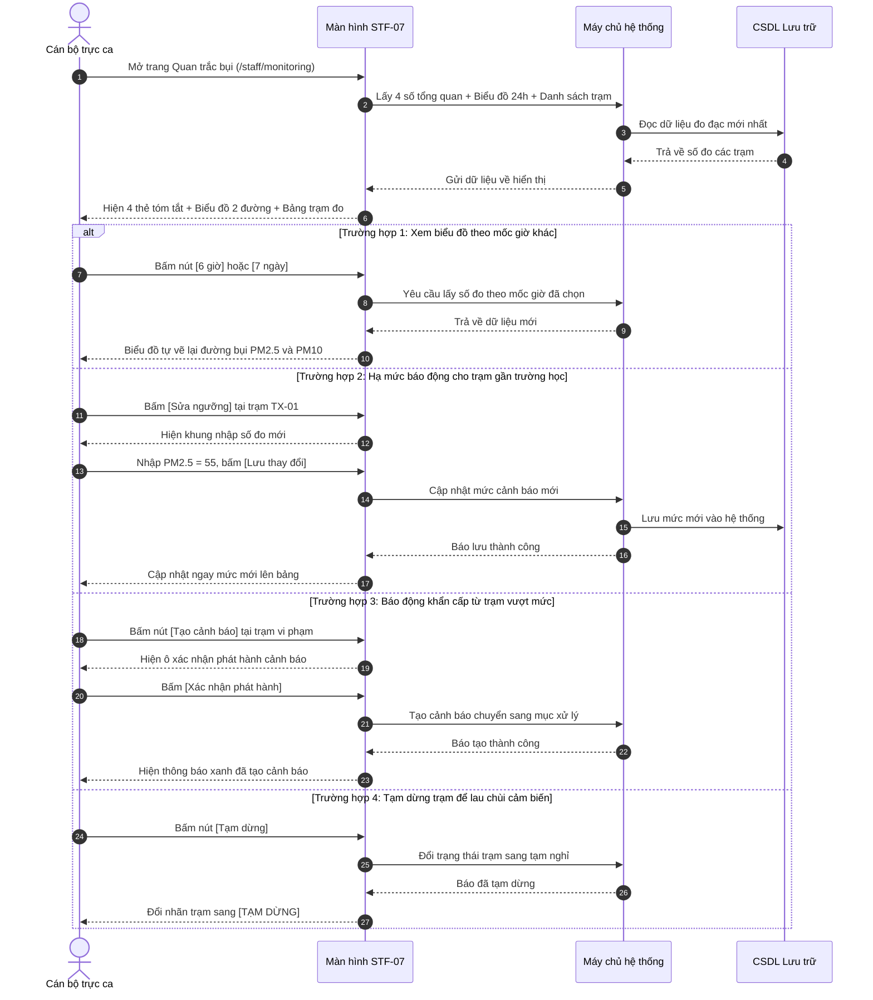

# STF-07 — Theo Dõi Số Đo Bụi Từ Cảm Biến 24/7 (Quan Trắc Bụi Công Trình)

> **Tài liệu hướng dẫn & đặc tả màn hình — Hệ thống DustGuard VN**  
> Màn hình giúp cán bộ theo dõi số liệu đo bụi (PM2.5 và PM10) gửi về liên tục từ các trạm cảm biến lắp tại công trường xây dựng, phát hiện ngay các điểm vượt mức cho phép, xem biểu đồ diễn biến bụi trong ngày và điều chỉnh mức cảnh báo cho các khu vực nhạy cảm như gần trường học, bệnh viện.

---

## 1. Thông Tin Màn Hình (Screen Identity)

| Mục | Nội dung | Giải thích dễ hiểu |
|---|---|---|
| **Mã màn hình** | `STF-07` | Mã viết tắt để tra cứu nhanh trong tài liệu |
| **Tên tiếng Việt** | **Theo dõi số đo bụi từ cảm biến 24/7** (Quan trắc bụi công trình) | Tên gọi hiển thị trên thanh menu bên trái |
| **Tên tiếng Anh** | Real-Time Dust Monitoring | Tên dùng khi kết nối kỹ thuật |
| **Đường dẫn (URL)** | `/staff/monitoring` | Địa chỉ trang web trên trình duyệt |
| **File giao diện** | [`app/src/apps/staff/pages/monitoring/StaffMonitoringPage.jsx`](file:///d:/07-Competitions-Hackathons/unicef-dustguard/app/src/apps/staff/pages/monitoring/StaffMonitoringPage.jsx) | File mã nguồn hiển thị giao diện |
| **File xử lý dữ liệu** | [`app/server/routes/api/sensors.js`](file:///d:/07-Competitions-Hackathons/unicef-dustguard/app/server/routes/api/sensors.js) | File máy chủ cung cấp số liệu cảm biến |
| **Ai được dùng?** | Cán bộ thanh tra, người trực ca, lãnh đạo phụ trách | Người dân và nhà thầu không vào được trang này |
| **Tình trạng kết nối** | **Đang hoạt động tốt** | Lấy dữ liệu thật từ hệ thống lưu trữ |

---

## 2. Mục Đích & Nghiệp Vụ Thực Tế

### 2.1. Cán bộ dùng màn hình này để làm gì?
Khi các công trình đào đất, phá dỡ, xe tải ra vào chở phế thải, bụi mịn PM2.5 và PM10 sẽ bay ra khu dân cư xung quanh. Màn hình này giúp cán bộ trực ca:
1. **Biết ngay trạm nào đang có bụi vượt chuẩn**:
   - Bụi mịn PM2.5 vượt $75\,\mu\text{g/m}^3$ (Mức báo động đỏ theo Quy chuẩn Quốc gia QCVN 05:2023).
   - Bụi tổng PM10 vượt $150\,\mu\text{g/m}^3$ (Mức báo động đỏ).
2. **Xem biểu đồ bụi lên xuống theo từng giờ**: Nhận diện quy luật vi phạm (ví dụ: công trường lén đào đất, chở phế thải vào ban đêm từ 22h đến 4h sáng mà không tưới nước dập bụi).
3. **Hạ mức báo động cho nơi nhạy cảm**: Đối với công trình nằm sát trường mầm non, trường học, bệnh viện, cán bộ có thể chủ động hạ mức cảnh báo (ví dụ PM2.5 chỉ cần trên $55\,\mu\text{g/m}^3$ là đã báo động để nhắc nhở kịp thời).
4. **Tạm dừng trạm đo khi cần bảo trì**: Khi thiết bị bám bụi bẩn cần vệ sinh, cán bộ bấm nút tạm dừng để không báo động nhầm.

### 2.2. Nguyên tắc làm việc thực tế
- **Cảm biến là mắt thần hỗ trợ, con người ra quyết định**: Số liệu từ cảm biến giúp cán bộ biết trước điểm nóng để đến kiểm tra đột xuất đúng lúc. Hệ thống không tự ý phạt tiền nếu cán bộ chưa đến tận nơi lập biên bản kiểm tra thực tế.
- **Dữ liệu thật, không số liệu ảo**: Mọi số đo được ghi nhận theo đúng giờ phút thực tế kèm mã định danh của máy đo.

---

## 3. Đối Tượng Người Dùng & Các Bước Thực Hiện

### 3.1. Ai sử dụng màn hình này?
- **Cán bộ trực ca thanh tra môi trường**: Theo dõi màn hình máy tính trong ca trực, phát hiện trạm đỏ để báo cho tổ kiểm tra đi thực địa.
- **Tổ trưởng / Đội phó**: Kiểm tra danh sách các trạm đo có nồng độ bụi cao nhất trong ngày để lên lịch tuần tra.
- **Cán bộ quản lý thiết bị**: Theo dõi tình trạng máy đo đang hoạt động hay mất sóng để bảo dưỡng.

### 3.2. Sơ đồ các bước xử lý hàng ngày



---

## 4. Bố Cục Giao Diện & Hình Minh Họa Dễ Hiểu (Wireframe)

### 4.1. Khung nhìn tổng thể trên màn hình máy tính (14 inch trở lên)

```text
+-----------------------------------------------------------------------------------------------------------------------+
| [THANH TIÊU ĐỀ TRÊN CÙNG]                                                                                            |
| Quan trắc bụi công trình                                            [+ Tạo cảnh báo] (Đỏ) [+ Thêm trạm] [Xuất CSV] (Tr)|
| Theo dõi số đo bụi từ cảm biến 24/7, phát hiện nhanh các điểm ô nhiễm vượt mức cho phép.                              |
+-----------------------------------------------------------------------------------------------------------------------+
| [4 THẺ TÓM TẮT TÌNH HÌNH MẠNG LƯỚI TRẠM ĐO]                                                                           |
| +-------------------------+ +-------------------------+ +-------------------------+ +-------------------------------+ |
| | 📡 TRẠM ĐANG HOẠT ĐỘNG  | | 🟢 MỨC BÌNH THƯỜNG      | | 🟠 CẦN THEO DÕI         | | 🔴 ĐANG BÁO ĐỘNG BỤI CAO      | |
| | 18 / 20 trạm            | | 13 trạm                 | | 4 trạm                  | | 3 trạm                        | |
| | 90% trạm đang gửi số đo | | Không khí an toàn       | | Sắp chạm mức báo động   | | Bụi vượt chuẩn môi trường     | |
| +-------------------------+ +-------------------------+ +-------------------------+ +-------------------------------+ |
|                                                                                                                       |
| [3 KHỐI THÔNG TIN CHÍNH Ở GIỮA TRANG]                                                                                 |
| +------------------------------------+ +----------------------------------+ +-----------------------------------------+ |
| | KHỐI 1: BIỂU ĐỒ BỤI 24H (Biểu đồ)  | | KHỐI 2: BẢN ĐỒ VỊ TRÍ TRẠM ĐO    | | KHỐI 3: DANH SÁCH TRẠM VƯỢT MỨC CHO PHÉP| |
| | Chú giải: — PM2.5 (Đỏ) — PM10 (Cam)| | Bản đồ thu nhỏ các quận:         | | Các trạm đang có bụi cao cần xử lý:   | |
| | ---------------------------------- | | • Cầu Giấy (4 trạm - 1 báo động) | | --------------------------------------- | |
| | [Đường cong thể hiện số đo bụi]    | | • Thanh Xuân (3 trạm - 2 báo động| | • Trạm TX-01 — Chung cư Imperial Plaza  | |
| | - - Vạch đỏ chuẩn PM10 = 150       | | • Nam Từ Liêm (5 trạm - An toàn) | |   Địa chỉ: 360 Giải Phóng, Thanh Xuân   | |
| | - - Vạch cam chuẩn PM2.5 = 75      | | Chú giải màu: ● Xanh  ● Cam  ● Đỏ| |   Bụi PM2.5: 85 · PM10: 185 (Vượt chuẩn)| |
| | ---------------------------------- | | -------------------------------- | |   [Xem]   [Sửa ngưỡng]  [+ Cảnh báo]    | |
| | [6 giờ]   [24 giờ]   [7 ngày]      | | [Mở bản đồ lớn ↗]                | | • Trạm CG-04 — Tòa Discovery Complex    | |
| | (Tự động tải số đo mới mỗi phút)   | |                                  | |   Bụi PM2.5: 78 · PM10: 160             | |
| +------------------------------------+ +----------------------------------+ +-----------------------------------------+ |
|                                                                                                                       |
| [BẢNG TOÀN BỘ CÁC TRẠM CẢM BIẾN]                                                                                      |
| Ô tìm: [🔍 Nhập tên công trình, mã trạm, địa chỉ...]   [Quận: Tất cả ▼]  [Trạng thái: Tất cả ▼]   [⟳ Làm mới số liệu]  |
| +-------------------------------------------------------------------------------------------------------------------+ |
| | Mã trạm | Công trình xây dựng     | Quận huyện   | Bụi PM2.5     | Bụi PM10    | Tình trạng   | Cập nhật | Thao tác   | |
| |---------|-------------------------|--------------|---------------|-------------|--------------|----------|------------| |
| | TX-01   | Chung cư Imperial Plaza | Thanh Xuân   |   85 (Đỏ)     |   185 (Đỏ)  | [🔴 BÁO ĐỘNG]| 10:30    | [Xem] [Sửa]| |
| |         | 360 Giải Phóng, TX, HN  |              | Vượt mức 75   | Vượt mức 150|              |          | [Tạm dừng] | |
| | CG-02   | Tòa Discovery Complex   | Cầu Giấy     |   42 (Xanh)   |    88 (Xanh)| [🟢 AN TOÀN] | 10:28    | [Xem] [Sửa]| |
| |         | 302 Cầu Giấy, CG, HN    |              | An toàn       | An toàn     |              |          | [Tạm dừng] | |
| | NTL-05  | The Matrix One Mễ Trì   | Nam Từ Liêm  |   62 (Cam)    |   125 (Cam) | [🟠 THEO DÕI]| 10:25    | [Xem] [Sửa]| |
| |         | Lê Quang Đạo, NTL, HN   |              | Sắp chạm chuẩn| Sắp chạm    |              |          | [Tạm dừng] | |
| +-------------------------------------------------------------------------------------------------------------------+ |
| Xem từ 1 đến 10 trong tổng số 20 trạm đo                         [< Trang trước] [1] [2] [Trang sau >]                |
| ⓘ Số đo cảm biến giúp phát hiện sớm để đi kiểm tra, không tự ý phạt nếu chưa lập biên bản thực địa.                   |
+-----------------------------------------------------------------------------------------------------------------------+
```

### 4.2. Giải thích chi tiết các khu vực
1. **4 Thẻ tóm tắt trên cùng**:
   - **Trạm đang hoạt động**: Cho biết có bao nhiêu trạm đang gửi dữ liệu về máy chủ (ví dụ 18/20 trạm).
   - **Mức bình thường**: Số trạm có không khí sạch, bụi nằm trong ngưỡng an toàn.
   - **Cần theo dõi**: Số trạm có lượng bụi bắt đầu tăng cao, tiệm cận mức cho phép.
   - **Đang báo động bụi cao**: Số trạm có chỉ số bụi vượt chuẩn quốc gia, cần cử người đi kiểm tra ngay.
2. **3 Khối ở giữa trang**:
   - **Khối 1 — Biểu đồ bụi 24h**: Thể hiện đường đo bụi PM2.5 (màu đỏ) và PM10 (màu cam) theo thời gian. Có vạch đứt nét chỉ mức tối đa cho phép để dễ so sánh.
   - **Khối 2 — Bản đồ vị trí trạm**: Bản đồ thu nhỏ chấm các điểm xanh/cam/đỏ theo quận. Bấm vào nút mở bản đồ lớn để xem chi tiết từng ngõ ngách.
   - **Khối 3 — Danh sách trạm vượt mức**: Gom nhanh những trạm đang báo động đỏ để cán bộ bấm nút tạo cảnh báo xử lý ngay.
3. **Bảng toàn bộ các trạm cảm biến phía dưới**:
   - Tên công trình luôn hiển thị đầy đủ, không bị cắt cụt chữ.
   - Các cột số đo bụi PM2.5 và PM10 tự đổi màu: đỏ khi vượt chuẩn, cam khi sắp chạm ngưỡng, xanh khi an toàn.

---

## 5. Dữ Liệu & Liên Kết Hệ Thống

### 5.1. Các đường liên kết dữ liệu phục vụ màn hình

| Lệnh | Đường dẫn hệ thống | Mục đích sử dụng |
|---|---|---|
| `GET` | `/api/staff/monitoring/summary` | Lấy 4 số đếm tóm tắt ở đầu trang |
| `GET` | `/api/staff/monitoring/timeline` | Lấy số đo theo giờ để vẽ biểu đồ đường |
| `GET` | `/api/staff/monitoring/abnormal` | Lấy danh sách các trạm đang báo động bụi cao |
| `GET` | `/api/staff/monitoring/stations` | Lấy danh sách toàn bộ trạm đo có phân trang và tìm kiếm |
| `POST` | `/api/staff/monitoring/stations` | Đăng ký thêm trạm cảm biến mới vào hệ thống |
| `PATCH` | `/api/staff/monitoring/stations/:id/thresholds` | Đổi mức báo động cho trạm gần trường học/bệnh viện |
| `POST` | `/api/staff/monitoring/stations/:id/pause` | Tạm dừng trạm để lau chùi, sửa chữa cảm biến |
| `POST` | `/api/staff/monitoring/stations/:id/resume` | Bật lại trạm đo sau khi bảo dưỡng xong |
| `POST` | `/api/staff/alerts` | Tạo sự kiện cảnh báo để mở hồ sơ kiểm tra |
| `GET` | `/api/staff/monitoring/export.csv` | Tải toàn bộ số đo về máy tính dưới dạng file Excel/CSV |

### 5.2. Các bảng lưu trữ trong hệ thống
1. **`sensors`**: Lưu danh sách máy đo (Mã trạm, tên công trình, vị trí, mức báo động cài đặt, trạng thái bật/tắt).
2. **`sensor_readings`**: Lưu từng lần máy đo gửi số liệu về (Mã trạm, số đo PM2.5, số đo PM10, nhiệt độ, độ ẩm, giờ đo).
3. **`sites`**: Lưu thông tin công trình xây dựng gắn với máy đo.
4. **`alerts`**: Lưu các sự kiện cảnh báo bụi vượt mức cho phép.

---

## 6. Danh Sách Nút Bấm & Thao Tác Thường Dùng

| Nút bấm / Thao tác | Vị trí trên màn hình | Hành vi khi bấm | Ai được bấm? |
|---|---|---|:---:|
| **`[+ Tạo cảnh báo]`** | Góc trên bên phải / Trên từng dòng trạm | Mở khung tạo cảnh báo ô nhiễm để chuyển sang tổ kiểm tra xử lý. | Cán bộ trực |
| **`[+ Thêm trạm]`** | Cạnh nút Tạo cảnh báo | Mở khung nhập thông tin để thêm máy đo mới vào hệ thống. | Cán bộ quản lý |
| **`[Xuất CSV]`** | Góc trên bên phải | Tải file Excel chứa danh sách số đo về máy tính để làm báo cáo. | Mọi cán bộ |
| **`[Sửa ngưỡng]`** | Cột thao tác / Thẻ trạm vi phạm | Mở khung chỉnh mức báo động (ví dụ hạ từ 75 xuống 55 cho trạm gần trường học). | Cán bộ quản lý |
| **`[Tạm dừng / Bật lại]`** | Cột thao tác trên từng dòng | Tạm dừng nhận số đo khi máy đang bảo dưỡng, hoặc bật lại sau khi xong. | Cán bộ quản lý |
| **`[6 giờ] [24 giờ] [7 ngày]`** | Dưới biểu đồ | Chuyển mốc thời gian hiển thị trên biểu đồ đường. | Mọi cán bộ |
| **`[⟳ Làm mới số liệu]`** | Trên thanh tìm kiếm | Tải lại ngay các số đo mới nhất từ cảm biến gửi về. | Mọi cán bộ |
| **`[Mở bản đồ lớn ↗]`** | Dưới khối bản đồ nhỏ | Chuyển sang xem bản đồ toàn cảnh vị trí các công trình. | Mọi cán bộ |

---

## 7. Quy Chuẩn Trình Bày & Trải Nghiệm Người Dùng (UI/UX)

### 7.1. Màu sắc rõ ràng, dễ nhìn (Không làm mờ kính)
- **Nền trang**: Màu kem sáng `#FAFAF9`, êm dịu cho mắt khi cán bộ trực ca nhìn màn hình lâu.
- **Đường đo bụi PM2.5**: Màu đỏ son đậm nét, có chấm tròn rõ ràng tại từng mốc giờ.
- **Đường đo bụi PM10**: Màu cam đậm nét.
- **Vạch chuẩn cho phép**: Đường nét đứt màu nhạt để cán bộ nhìn là biết ngay điểm nào đang nhô cao vượt vạch.
- **Màu sắc trạng thái**:
  - *Báo động đỏ*: Nền đỏ nhạt, chữ đỏ đậm.
  - *Cần theo dõi*: Nền cam nhạt, chữ cam đậm.
  - *An toàn*: Nền xanh lá nhạt, chữ xanh lá đậm.
  - *Tạm dừng*: Nền xám nhạt, chữ xám.

### 7.2. Tương thích trên máy tính xách tay và điện thoại
- **Máy tính xách tay (14 inch - 1366x768 / 1440x900)**:
  - 3 Khối giữa trang tự động chia tỷ lệ cân đối theo chiều ngang.
  - Các nút bấm xếp gọn gàng, không bị rớt dòng chữ.
  - Bảng danh sách có thanh cuộn ngang mượt mà khi màn hình hẹp, không làm xô lệch trang.
- **Điện thoại di động (Màn hình nhỏ)**:
  - 4 Thẻ tóm tắt xếp thành 2 hàng hoặc vuốt ngang.
  - 3 Khối thông tin tự động xếp dọc từ trên xuống dưới.
  - Nút bấm to rõ, ngón tay chạm vào dễ dàng (chiều cao tối thiểu 44px).

---

## 8. Những Lỗi Cần Tránh & Cách Kiểm Tra Nhanh

### 8.1. Những bẫy lỗi cần lưu ý
1. **Trạm đang tắt mà vẫn báo động**: Trạm đang tháo ra bảo dưỡng có thể gửi dữ liệu rỗng.
   - *Cách tránh*: Hệ thống chỉ tính cảnh báo đối với các trạm đang ở trạng thái BẬT HOẠT ĐỘNG.
2. **Biểu đồ bị đứt đoạn do trạm mới lắp**: Trạm mới bật chưa đủ 24 giờ đo.
   - *Cách tránh*: Biểu đồ tự nối nét an toàn theo các mốc giờ đã có, không làm lỗi giao diện.
3. **Mất kết quả khi tìm kiếm**: Đang đứng ở trang 3 mà nhập tìm kiếm khiến bảng bị trắng trơn.
   - *Cách tránh*: Khi gõ tìm kiếm hoặc đổi quận, hệ thống tự đưa về trang 1.
4. **Cắt cụt tên công trình**: Tên công trình dài bị che bằng dấu ba chấm.
   - *Cách tránh*: Cho phép tên công trình tự xuống dòng để cán bộ đọc trọn vẹn tên dự án.

### 8.2. Lệnh kiểm tra nhanh trên máy tính

```powershell
# 1. Kiểm tra kết nối dữ liệu trạm quan trắc
node --test app/tests/staff-monitoring-d1-api.test.js

# 2. Kiểm tra biểu đồ số đo theo giờ và cảnh báo
node --test app/tests/staff-monitoring-and-alerts.test.js

# 3. Kiểm tra giao diện và màu sắc hiển thị
node --test app/tests/design-system-tokens.test.js

# 4. Kiểm tra toàn bộ chức năng nhanh
npm --prefix app run verify:quick
```
