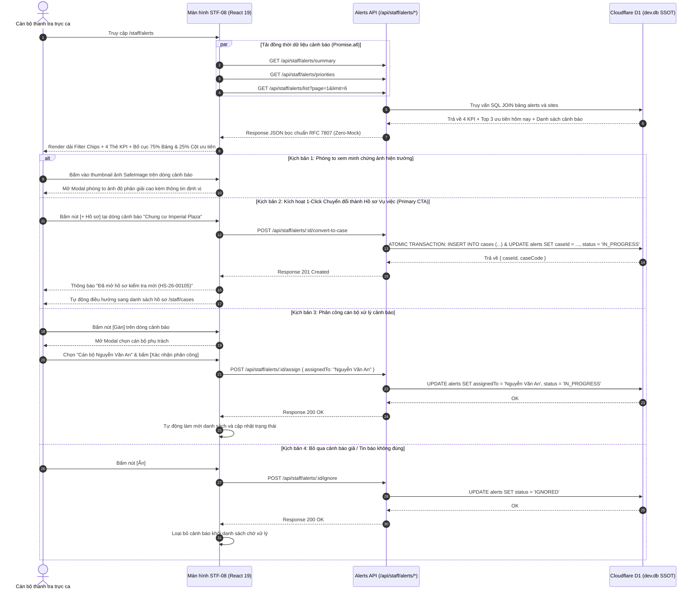

# STF-08 — Trung Tâm Tiếp Nhận & Xử Lý Cảnh Báo Ô Nhiễm (Staff Alerts Operations Center)

> **Tài liệu đặc tả màn hình chuẩn SSOT (Single Source of Truth) — DustGuard VN CivicTech Platform**  
> Trung tâm tiếp nhận và phản ứng nhanh các sự cố ô nhiễm bụi khẩn cấp: tích hợp cơ chế tạo hồ sơ thanh tra 1-Click (Atomic Transaction chống trùng lặp), bố cục tỷ lệ vàng 75% Bảng danh sách + 25% Cột ưu tiên xử lý khẩn cấp hôm nay (310px), đối chứng minh chứng ảnh hiện trường `SafeImage` và đồng bộ CSDL Cloudflare D1 / SQLite `dev.db` theo nguyên tắc Zero-Mock.

---

## 1. Screen Identity

| Thuộc tính | Giá trị SSOT | Ghi chú kỹ thuật |
|---|---|---|
| **Mã màn hình** | `STF-08` | Mã định danh chuẩn trong hệ thống Design System & Product Spec |
| **Tên tiếng Việt** | Trung tâm xử lý cảnh báo / Cảnh báo ô nhiễm mới | Nhãn hiển thị chính thức trên Sidebar & thanh tiêu đề ca trực |
| **Tên tiếng Anh** | Environmental Alerts & Incident Operations Center | Tên tiếng Anh đối ngoại, Audit Log & API Metadata |
| **Đường dẫn (Route)** | `/staff/alerts` | Canonical Route trên phân hệ Cán bộ Thanh tra |
| **Component Path** | [`app/src/apps/staff/pages/alerts/StaffAlertsPage.jsx`](file:///d:/07-Competitions-Hackathons/unicef-dustguard/app/src/apps/staff/pages/alerts/StaffAlertsPage.jsx) | React 19 Client Component tích hợp cơ chế SafeImage & Atomic Action |
| **Backend Route** | [`app/server/routes/api/staff-alerts.js`](file:///d:/07-Competitions-Hackathons/unicef-dustguard/app/server/routes/api/staff-alerts.js) | Express / Worker SQLite Routes thực thi giao dịch nguyên tử D1 |
| **Layout bọc** | [`app/src/apps/staff/layout/StaffLayout.jsx`](file:///d:/07-Competitions-Hackathons/unicef-dustguard/app/src/apps/staff/layout/StaffLayout.jsx) | Khung giao diện tác nghiệp Cán bộ, Sidebar 12 phân hệ nghiệp vụ |
| **Vai trò truy cập (Role)** | `staff`, `inspector`, `executive`, `admin` | Phân quyền RBAC qua `AuthContext` (Chặn `citizen`, `contractor`, `public`) |
| **Trạng thái thực thi** | **ACTIVE (Level 5 Production Coherent)** | Kết nối 100% CSDL D1 SQLite thật, cơ chế Zero-Mock, Auto-healing Schema |

---

## 2. Mục Đích & Nghiệp Vụ Thực Tế (Business Objectives & Context)

### 2.1. Bối cảnh tiếp nhận & xử lý phản ứng nhanh sự cố môi trường đô thị
Trong ca trực của Cán bộ Đội Quản lý Trật tự Xây dựng & Đô thị Quận (TTXD) và Thanh tra Sở Tài nguyên & Môi trường (TN&MT), việc tiếp nhận và xử lý kịp thời các vụ việc phát tán bụi mù mịt từ các công trường xây dựng, xe chở bùn đất làm rơi vãi trên đường phố là nhiệm vụ trọng yếu nhằm bảo vệ sức khỏe cộng đồng dân cư xung quanh.

Màn hình **Trung tâm xử lý cảnh báo (STF-08)** là "chốt chặn phản ứng nhanh" tiếp nhận thông tin sự cố đa nguồn theo thời gian thực. Màn hình tập trung giải quyết 3 bài toán nghiệp vụ sống còn:
1. **Tiếp nhận & Hợp nhất sự kiện ô nhiễm đa nguồn**:
   - Tự động tiếp nhận các đợt phát tán bụi vượt ngưỡng quy chuẩn môi trường QCVN 05:2023/BTNMT ($PM10 > 150\,\mu\text{g/m}^3$ hoặc $PM2.5 > 75\,\mu\text{g/m}^3$) gửi về từ mạng lưới trạm cảm biến IoT.
   - Tiếp nhận tin báo kèm ảnh chụp hiện trường có tọa độ GPS gửi về từ ứng dụng cộng đồng của Nhân dân và các Đội Thanh niên Tình nguyện.
2. **Đánh giá mức độ rủi ro & Lý do ưu tiên**: Tự động chấm điểm **Dust Risk Score ($0 - 100$)** kết hợp các nhãn định tính (*Vượt ngưỡng QCVN 05:2023*, *Gần trường học/bệnh viện*, *Thi công không che chắn ban đêm*, *Đã phản ánh nhiều lần trong tuần*) để phân loại cấp độ: `CRITICAL` (Gấp - Đỏ son), `HIGH` (Cao - Cam), `MEDIUM` (Trung bình - Vàng).
3. **Cơ chế 1-Click Chuyển đổi thành Hồ sơ Vụ việc (1-Click Convert to Case)**: Cho phép cán bộ ca trực kích hoạt một cú nhấp chuột để chuyển đổi cảnh báo thành một Hồ sơ thanh tra chính thức (`cases`) với mã định danh chuẩn (VD: `HS-26-00105`), gắn hạn chót SLA 48 giờ và phân công tổ công tác xuống hiện trường kiểm tra.

### 2.2. Đột phá nghiệp vụ: Giao dịch nguyên tử & Chống trùng lặp (Anti-Duplicate Guard)
- **Loại bỏ độ trễ thủ tục giấy tờ**: Trước đây, từ khi tiếp nhận tin báo ô nhiễm đến khi lập phiếu kiểm tra và giao việc mất từ 2 đến 4 giờ. Với STF-08, giao dịch nguyên tử SQLite/D1 tạo hồ sơ và gắn mã vụ việc chỉ diễn ra trong chưa đầy **3 giây**.
- **Chống bỏ lọt & Chống tạo trùng hồ sơ**: Hệ thống tự động khóa cảnh báo đã mở hồ sơ (`caseId IS NOT NULL`), ngăn chặn triệt để tình trạng hai cán bộ trực cùng bấm tạo trùng hai hồ sơ cho một sự kiện vi phạm.

---

## 3. Đối Tượng Người Dùng & Hành Trình Thao Tác (User Journey)

### 3.1. Đối tượng sử dụng chính
- **Cán bộ thanh tra trực ca**: Tiếp nhận cảnh báo mới, xem bằng chứng ảnh hiện trường, phân loại mức độ rủi ro và bấm 1-Click mở hồ sơ kiểm tra.
- **Tổ trưởng ca trực / Đội phó Đội QLTTXD**: Phân công cán bộ thụ lý (`assignedTo`), theo dõi tiến độ xử lý và phê duyệt bỏ qua các cảnh báo giả mạo hoặc thông tin không chính xác.
- **Lãnh đạo cơ quan**: Giám sát tỷ lệ cảnh báo đã mở hồ sơ xử lý, kiểm tra thời gian phản ứng trung bình của lực lượng trực ca.

### 3.2. Sơ đồ hành trình ca trực tiếp nhận cảnh báo (Alerts Operations Flow)



---

## 4. Bố Cục Giao Diện & Wireframe ASCII Chi Tiết (Information Hierarchy)

### 4.1. Wireframe bố cục tổng thể chuẩn Desktop 14-Inch (1366x768 / 1440x900)

```text
+-----------------------------------------------------------------------------------------------------------------------+
| [HEADER BAR]                                                                                                          |
| Cảnh báo ô nhiễm mới                                                         [+ Tạo hồ sơ] (Đỏ son)  [Gán xử lý] (Tr) |
| Tiếp nhận cảnh báo nồng độ bụi vượt chuẩn QCVN 05:2023 và phản ánh khẩn cấp từ cộng đồng dân cư trên địa bàn.        |
+-----------------------------------------------------------------------------------------------------------------------+
| [DẢI FILTER CHIPS LỌC NHANH TRẠNG THÁI]                                                                               |
| [Tất cả: 14]   [🔴 Gấp: 4]   [🟠 Cao: 6]   [🟡 Trung bình: 4]   [👁️ Đang xử lý: 3]                                    |
+-----------------------------------------------------------------------------------------------------------------------+
| [4 THẺ KPI CHỈ SỐ CA TRỰC]                                                                                            |
| +-------------------------+ +-------------------------+ +-------------------------+ +-------------------------------+ |
| | 🔔 CẢNH BÁO MỚI         | | 🔴 MỨC ĐỘ GẤP (CRITICAL)| | ⏳ CHƯA MỞ HỒ SƠ        | | 🟢 ĐÃ XỬ LÝ (RESOLVED)        | |
| | {totalAlerts}           | | {criticalCount}         | | {unopenedCaseCount}     | | {resolvedCount}               | |
| | ↑ 5 sự kiện so với hôm qua| | Vượt chuẩn QCVN 05:2023 | | Cần chuyển đổi thụ lý   | | Đã khắc phục / Hoàn tất       | |
| +-------------------------+ +-------------------------+ +-------------------------+ +-------------------------------+ |
+-----------------------------------------------------------------------------------------------------------------------+
| [BỐ CỤC TỶ LỆ VÀNG 75% BẢNG DANH SÁCH + 25% CỘT ƯU TIÊN XỬ LÝ KHẨN CẤP HÔM NAY (310px)]                                |
| +------------------------------------------------------------+ +------------------------------------------------------+ |
| | BẢNG DANH SÁCH CẢNH BÁO CHÍNH (~75% Chiều ngang)           | | CỘT ƯU TIÊN XỬ LÝ HÔM NAY (Cố định 310px)           | |
| | [🔍 Tìm kiếm công trình, địa chỉ...]                       | | Header: 🔴 ƯU TIÊN HÔM NAY                  [Top 3]  | |
| | +--------------------------------------------------------+ | | -------------------------------------------------- | |
| | | Thời gian | Công trình & Vị trí  | Rủi ro | Mức độ | MC  | | | [1] Chung cư Imperial Plaza                       | |
| | |-----------|----------------------|--------|--------|-----| | |     360 Giải Phóng, Q.Thanh Xuân, Hà Nội           | |
| | | 08:32     | Chung cư Imperial Pl.| DR: 85 | [GẤP]  | [🖼]| | |     [SafeImage 40x40] PM10: 185 µg/m³ · DR: 85     | |
| | | 15p trước | 360 Giải Phóng, TX   | (Đỏ)   | (Đỏ)   | +2  | | |     Tags: [VƯỢT QCVN 05:2023] [GẦN TRƯỜNG HỌC]     | |
| | |           | Tags: [VƯỢT QCVN]    |        |        |     | | |     [Xem chi tiết]          [+ Tạo hồ sơ] (Đỏ son) | |
| | |           | Thao tác: [+ Hồ sơ] (Đỏ)  [Gán]  [Ẩn]        | | | -------------------------------------------------- | |
| | |-----------|----------------------|--------|--------|-----| | | [2] Cụm công trình Discovery Complex               | |
| | | 08:15     | Discovery Complex    | DR: 65 | [CAO]  | [🖼]| | |     302 Cầu Giấy, Q.Cầu Giấy, Hà Nội               | |
| | | 35p trước | 302 Cầu Giấy, HN     | (Cam)  | (Cam)  | +1  | | |     [SafeImage 40x40] PM2.5: 82 µg/m³ · DR: 65     | |
| | |           | Tags: [KHÔNG BẠT PHỦ]|        |        |     | | |     [Xem chi tiết]          [+ Tạo hồ sơ] (Đỏ son) | |
| | |           | Thao tác: [+ Hồ sơ] (Đỏ)  [Gán]  [Ẩn]        | | | -------------------------------------------------- | |
| | +--------------------------------------------------------+ | | [3] The Matrix One Mễ Trì...                         | |
| | Phân trang: Hiển thị 1-6 trong {total} cảnh báo            | | -------------------------------------------------- | |
| | [< Trang trước]  [1]  [2]  [Trang sau >]                   | | ➔ Xem tất cả danh sách ưu tiên ca trực               | |
| +------------------------------------------------------------+ +------------------------------------------------------+ |
+-----------------------------------------------------------------------------------------------------------------------+
| [MODALS / DIALOGS POPUPS KHI TƯƠNG TÁC]                                                                               |
| 1. Modal "Phóng to ảnh minh chứng hiện trường vi phạm" (Hỗ trợ trình chiếu nhiều ảnh độ phân giải cao)               |
| 2. Modal "Phân công cán bộ thanh tra xử lý" (Chọn cán bộ trực ca, giao hạn chót thực địa)                           |
+-----------------------------------------------------------------------------------------------------------------------+
```

### 4.2. Chi tiết phân cấp 2 vùng tác nghiệp

#### 1. Bảng Danh Sách Cảnh Báo Chính (`flex-1 min-w-0` ~ 75% Chiều ngang)
- **7 Cột nghiệp vụ chuẩn hóa**:
  1. *Thời gian*: Giờ ghi nhận thực tế (`08:32`) kèm thời gian tương đối (`15 phút trước`).
  2. *Công trình & Vị trí*: Tên công trình (**Zero Truncate**, tự xuống dòng `break-words`), địa chỉ hành chính chi tiết và dải thẻ lý do vi phạm viền đỏ nhạt.
  3. *Chỉ số rủi ro (Dust Risk Score)*: Điểm số $0 - 100$ hiển thị to đậm, đổi màu đỏ ($>70$), cam ($>50$), vàng ($\le 50$).
  4. *Mức độ khẩn cấp*: Phù hiệu chữ hoa `GẤP` (Đỏ son `#B91C1C`), `CAO` (Cam `#EA580C`), `T.BÌNH` (Vàng `#D97706`).
  5. *Minh chứng hiện trường*: Thumbnail ảnh chụp `SafeImage` kích thước $28\text{px} \times 28\text{px}$ có bo góc, kèm huy hiệu đếm số ảnh phụ (`+2`, `+1`) khi người dân gửi nhiều ảnh bằng chứng. Bấm vào mở modal phóng to.
  6. *Cán bộ thụ lý*: Hiển thị tên cán bộ đã được gán hoặc nhãn *Chưa phân công* (màu xám).
  7. *Thao tác*: Bộ 3 nút tác nghiệp tiện dụng:
     - `[+ Hồ sơ]`: Nút màu đỏ son nổi bật, kích hoạt chuyển đổi 1-Click sang vụ việc chính thức.
     - `[Gán]`: Nút viền xám mở popup phân công cán bộ.
     - `[Ẩn]`: Nút chữ xám chuyển trạng thái cảnh báo sang `IGNORED` nếu là tin báo giả.

#### 2. Cột Ưu Tiên Xử Lý Khẩn Cấp Hôm Nay (`w-full xl:w-[310px] shrink-0` ~ 25% Chiều ngang)
- Cố định độ rộng 310px trên màn hình Desktop lớn, đảm bảo cán bộ luôn nhìn thấy Top 3 sự kiện nóng nhất mà không bị che khuất khi cuộn bảng.
- Hiển thị Top 3 cảnh báo có điểm Dust Risk cao nhất đang ở trạng thái `PENDING`.
- Mỗi thẻ gồm: Số thứ tự huy hiệu đỏ son (`[1]`, `[2]`, `[3]`), tên công trình, địa chỉ, ảnh thumbnail $40\text{px} \times 40\text{px}$, thông số nồng độ bụi đo được, thẻ vi phạm và 2 nút hành động nhanh: `[Xem chi tiết]` và `[+ Tạo hồ sơ]`.

---

## 5. Dữ Liệu & Hợp Đồng API / CSDL D1 (Data Contract)

### 5.1. Danh sách các API Endpoints phục vụ Xử lý Cảnh báo

```http
# 1. Thống kê 4 chỉ số KPI ca trực
GET /api/staff/alerts/summary
Content-Type: application/json
Authorization: Bearer <token>

# 2. Lấy Top 3 cảnh báo ưu tiên khẩn cấp cho cột phụ
GET /api/staff/alerts/priorities
Content-Type: application/json
Authorization: Bearer <token>

# 3. Lấy danh sách cảnh báo có lọc trạng thái, tìm kiếm và phân trang
GET /api/staff/alerts/list?filter={ALL|CRITICAL|HIGH|MEDIUM|VIEWED}&search={keyword}&page={page}&limit=6
Content-Type: application/json
Authorization: Bearer <token>

# 4. Kích hoạt 1-Click chuyển đổi cảnh báo thành hồ sơ thanh tra (Atomic Transaction)
POST /api/staff/alerts/:id/convert-to-case
Content-Type: application/json
Authorization: Bearer <token>

# 5. Phân công cán bộ thanh tra xử lý cảnh báo
POST /api/staff/alerts/:id/assign
Content-Type: application/json
Authorization: Bearer <token>

{
  "assignedTo": "Nguyễn Văn An"
}

# 6. Bỏ qua cảnh báo không đúng sự thật
POST /api/staff/alerts/:id/ignore
Content-Type: application/json
Authorization: Bearer <token>
```

### 5.2. Logic Giao dịch Nguyên tử (Atomic SQLite/D1 Transaction)

```sql
-- Giao dịch chuyển đổi Cảnh báo thành Hồ sơ kiểm tra (Anti-Duplicate & Atomic SSOT)
BEGIN TRANSACTION;

-- Bước 1: Chèn hồ sơ mới vào bảng cases kèm thời hạn SLA 48 giờ
INSERT INTO cases (
  id,
  code,
  title,
  description,
  status,
  sourceType,
  sourceId,
  siteId,
  priority,
  slaDeadline,
  createdAt,
  updatedAt
) VALUES (
  'case-' || strftime('%s', 'now') || '000',
  'HS-26-' || substr('00000' || abs(random() % 100000), -5),
  'Xử lý cảnh báo vượt ngưỡng bụi tại ' || (SELECT name FROM sites WHERE id = 'site-101'),
  'Tự động khởi tạo từ cảnh báo alert-801. Nồng độ PM10: 185 µg/m³ vượt quy chuẩn QCVN 05:2023/BTNMT.',
  'IN_PROGRESS',
  'ALERT',
  'alert-801',
  'site-101',
  'CRITICAL',
  datetime('now', '+48 hours'),
  datetime('now'),
  datetime('now')
);

-- Bước 2: Cập nhật trạng thái và liên kết mã hồ sơ trong bảng alerts (Khóa chống tạo trùng)
UPDATE alerts 
SET status = 'IN_PROGRESS', 
    caseId = (SELECT id FROM cases WHERE sourceId = 'alert-801' ORDER BY createdAt DESC LIMIT 1),
    updatedAt = datetime('now') 
WHERE id = 'alert-801' AND caseId IS NULL;

-- Bước 3: Ghi nhật ký kiểm toán hành vi cán bộ trực ca
INSERT INTO audit_logs (id, action, entityType, entityId, actorId, details, createdAt)
VALUES (
  'audit-' || strftime('%s', 'now'),
  'CONVERT_ALERT_TO_CASE',
  'cases',
  'alert-801',
  'user-staff-01',
  'Cán bộ đã chuyển đổi cảnh báo alert-801 thành hồ sơ thanh tra',
  datetime('now')
);

COMMIT;
```

### 5.3. Cấu trúc JSON Response Contract mẫu

#### Contract: `GET /api/staff/alerts/list?filter=ALL&page=1&limit=6`
```json
{
  "status": "success",
  "data": {
    "items": [
      {
        "id": "alert-801",
        "siteId": "site-101",
        "sensorId": "sensor-tx-01",
        "siteName": "Chung cư Imperial Plaza",
        "address": "360 Giải Phóng, Phường Phương Liệt, Quận Thanh Xuân, Hà Nội",
        "district": "Thanh Xuân",
        "title": "Cảnh báo nồng độ bụi PM10 vượt 150 µg/m³",
        "pm10": 185.0,
        "pm25": 85.0,
        "severity": "CRITICAL",
        "status": "PENDING",
        "dustRiskScore": 85,
        "priorityReasons": [
          { "label": "Vượt ngưỡng QCVN 05:2023", "color": "red" },
          { "label": "Gần Trường Tiểu học Phan Đình Giót", "color": "orange" }
        ],
        "evidenceUrls": [
          "/images/evidence/imperial-dust-01.jpg",
          "/images/evidence/imperial-dust-02.jpg"
        ],
        "assignedTo": null,
        "caseId": null,
        "triggeredAt": "2026-09-02T01:32:00.000Z",
        "timeFormatted": "08:32 (15 phút trước)"
      }
    ],
    "pagination": {
      "page": 1,
      "limit": 6,
      "total": 14,
      "totalPages": 3
    }
  },
  "message": "Danh sách cảnh báo ô nhiễm"
}
```

---

## 6. Bảng Nút Bấm & CTAs (Actions & Interactions)

| Tên nút / Hành động | Vị trí giao diện | Trạng thái & Phản hồi hệ thống | Quyền hạn |
|---|---|---|:---:|
| **`[+ Hồ sơ]`** (Primary CTA) | Từng dòng bảng / Thẻ ưu tiên | Kích hoạt `convert-to-case` 1-Click qua Atomic Transaction, tạo ngay Case trong D1 và chuyển sang `/staff/cases`. | `staff`, `admin` |
| **`[Gán]`** | Từng dòng bảng / Header | Mở modal phân công cán bộ thanh tra trực tiếp phụ trách xử lý vụ việc. | `staff`, `admin` |
| **`[Ẩn]`** | Từng dòng bảng | Gửi yêu cầu `ignore` để chuyển trạng thái cảnh báo sang `IGNORED` (bỏ qua tin giả). | `staff`, `admin` |
| **Bấm Thumbnail ảnh** | Cột Minh chứng / Thẻ ưu tiên | Mở modal phóng to ảnh bằng chứng hiện trường độ phân giải cao (`SafeImage`). | Tất cả cán bộ |
| **Dải Filter Chips** | Thanh chip trên đỉnh trang | Lọc tức thì danh sách theo `ALL`, `CRITICAL`, `HIGH`, `MEDIUM`, `VIEWED`, cập nhật số đếm badge. | Tất cả cán bộ |
| **`[Xem chi tiết]`** | Thẻ ưu tiên hôm nay (Cột 25%) | Mở modal xem thông tin chi tiết cảnh báo và lịch sử đo đạc. | Tất cả cán bộ |
| **`[Trang trước] / [Trang sau]`** | Chân bảng phân trang | Chuyển trang dữ liệu và tự động cuộn nhẹ lên đầu bảng. | Tất cả cán bộ |

---

## 7. Quy Chuẩn UI/UX & Responsive 14-Inch Desktop & Mobile SSOT

### 7.1. Bảng màu Civic High-Contrast & An toàn hiển thị ảnh
- **Nền trang chính**: `#FAFAF9` (Stone-50 — Màu kem sáng Civic Tech).
- **Khung cảnh báo khẩn cấp (`CRITICAL`)**: Nền `#FEF2F2`, chữ `#B91C1C`, viền `#FECACA`.
- **Thẻ cảnh báo cao (`HIGH`)**: Nền `#FFF7ED`, chữ `#EA580C`, viền `#FED7AA`.
- **Huy hiệu điểm rủi ro (`Dust Risk`)**: Số lớn font Black, màu đỏ son khi $>70$, màu cam khi $>50$.
- **Ảnh minh chứng bằng chứng (`SafeImage`)**: Sử dụng component bao bọc chống lỗi link vỡ, khung chứa cố định tỷ lệ $1:1$ chống giật layout (Cumulative Layout Shift - CLS = 0.000).

### 7.2. Tối ưu hiển thị đa màn hình (Responsive SSOT)
- **Màn hình Laptop 14-inch (1366x768, 1440x900, 1536x864 scale 125%)**:
  - Bố cục dàn ngang tỷ lệ vàng: Bảng chính co giãn linh hoạt (`flex-1 min-w-0`), Khối ưu tiên giữ nguyên 310px (`w-[310px] shrink-0`).
  - Toàn bộ nút thao tác thu gọn nhãn ngắn gọn (`+ Hồ sơ`, `Gán`, `Ẩn`) với `whitespace-nowrap`, không bị tràn dòng.
- **Màn hình Tablet & Mobile (360px - 768px)**:
  - Bố cục tự động chuyển từ hàng ngang sang xếp chồng dọc (Khối ưu tiên hôm nay chuyển xuống dưới bảng).
  - Thanh Filter Chips hỗ trợ vuốt ngang mượt mà (`overflow-x-auto scrollbar-none`).
  - Vùng chạm tối thiểu (Touch Targets) toàn bộ nút $\ge 44\text{px}$.

---

## 8. Bẫy Lỗi Thường Gặp & Hướng Dẫn Kiểm Thử (QA Checklist)

### 8.1. Các bẫy lỗi tiềm ẩn & Cơ chế phòng ngừa
1. **Lỗi Race Condition khi cán bộ bấm nhanh nút `[+ Hồ sơ]` nhiều lần**:
   - *Khắc phục*: Nút bấm có trạng thái `disabled={actionLoading}` và Backend kiểm tra `WHERE id = ? AND caseId IS NULL`, trả về mã lỗi HTTP 409 Conflict nếu đã được mở.
2. **Lỗi ảnh bằng chứng bị hỏng hoặc link nội bộ không truy cập được**:
   - *Khắc phục*: Component `SafeImage` tự động chuyển đổi sang ảnh placeholder chuẩn Civic kèm icon minh chứng an toàn khi URL bị lỗi 404.
3. **Lỗi tràn bảng khi tên công trình quá dài**:
   - *Khắc phục*: Sử dụng lớp `break-words` cho tên công trình (**Zero Truncate**) và `line-clamp-1` cho địa chỉ phụ.
4. **Lỗi lệch múi giờ tính hạn SLA 48 giờ**:
   - *Khắc phục*: Luôn sử dụng hàm `datetime('now', '+48 hours')` của SQLite đồng bộ với đồng hồ máy chủ.

### 8.2. Bộ lệnh kiểm thử nhanh (< 0.5s)

```powershell
# 1. Kiểm thử Vertical Slice API cho Cảnh báo & Giao dịch mở hồ sơ nguyên tử
node --test app/tests/staff-alerts-d1-api.test.js

# 2. Kiểm thử Responsive, SafeImage và Anti-Duplicate Guard
node --test app/tests/staff-alerts-responsive-safe-image.test.js

# 3. Kiểm thử Design System Tokens và Responsive không vỡ layout
node --test app/tests/design-system-tokens.test.js

# 4. Kiểm tra toàn diện Level 3 Quick Gate
npm --prefix app run verify:quick
```
