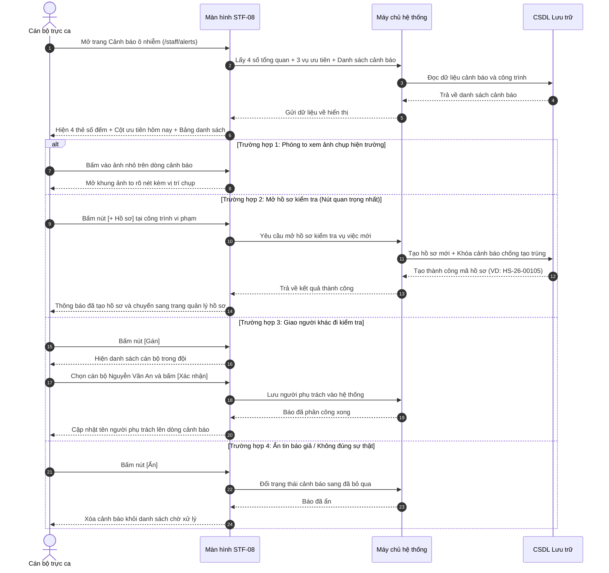

# STF-08 — Tiếp Nhận & Xử Lý Cảnh Báo Ô Nhiễm Bụi (Trung Tâm Cảnh Báo Ca Trực)

> **Tài liệu hướng dẫn & đặc tả màn hình — Hệ thống DustGuard VN**  
> Màn hình tiếp nhận các đợt bụi vượt mức cho phép từ cảm biến và tin báo từ người dân. Cán bộ chỉ cần 1 cú nhấp chuột là mở ngay hồ sơ kiểm tra vụ việc, phân công người đi hiện trường hoặc bỏ qua tin báo giả, với danh sách ưu tiên các điểm nóng cần xử lý gấp trong ngày.

---

## 1. Thông Tin Màn Hình (Screen Identity)

| Mục | Nội dung | Giải thích dễ hiểu |
|---|---|---|
| **Mã màn hình** | `STF-08` | Mã viết tắt để tra cứu nhanh trong tài liệu |
| **Tên tiếng Việt** | **Tiếp nhận & xử lý cảnh báo ô nhiễm bụi** | Tên gọi hiển thị trên thanh menu bên trái |
| **Tên tiếng Anh** | Staff Alerts Operations Center | Tên dùng khi kết nối kỹ thuật |
| **Đường dẫn (URL)** | `/staff/alerts` | Địa chỉ trang web trên trình duyệt |
| **File giao diện** | [`app/src/apps/staff/pages/alerts/StaffAlertsPage.jsx`](file:///d:/07-Competitions-Hackathons/unicef-dustguard/app/src/apps/staff/pages/alerts/StaffAlertsPage.jsx) | File mã nguồn hiển thị giao diện |
| **File xử lý dữ liệu** | [`app/server/routes/api/staff-alerts.js`](file:///d:/07-Competitions-Hackathons/unicef-dustguard/app/server/routes/api/staff-alerts.js) | File máy chủ tiếp nhận và xử lý cảnh báo |
| **Ai được dùng?** | Cán bộ thanh tra, người trực ca, lãnh đạo phụ trách | Người dân và nhà thầu không vào được trang này |
| **Tình trạng kết nối** | **Đang hoạt động tốt** | Lấy dữ liệu thật từ hệ thống lưu trữ |

---

## 2. Mục Đích & Nghiệp Vụ Thực Tế

### 2.1. Cán bộ dùng màn hình này để làm gì?
Trong ca trực, khi có công trường gây bụi mù mịt hoặc xe chở đất cát làm rơi vãi trên đường, màn hình này giúp cán bộ:
1. **Gom toàn bộ cảnh báo về một mối**:
   - Cảnh báo tự động từ máy đo bụi khi nồng độ PM10 vượt $150\,\mu\text{g/m}^3$ hoặc PM2.5 vượt $75\,\mu\text{g/m}^3$.
   - Tin báo kèm ảnh chụp hiện trường từ người dân và đội thanh niên tình nguyện gửi về.
2. **Biết ngay vụ nào cần làm trước**: Hệ thống tự động xếp loại mức độ:
   - 🔴 **Gấp (Màu đỏ)**: Bụi vượt chuẩn rất cao, gần trường học/bệnh viện hoặc bị phản ánh nhiều lần.
   - 🟠 **Cao (Màu cam)**: Bụi vượt mức cho phép, thi công không che bạt kín.
   - 🟡 **Trung bình (Màu vàng)**: Bụi cục bộ, xe ra vào chưa rửa lốp sạch.
3. **Mở hồ sơ kiểm tra chỉ với 1 cú nhấp (1-Click Tạo hồ sơ)**: Cán bộ bấm nút `[+ Hồ sơ]`, hệ thống tự động lập hồ sơ vụ việc, gán thời hạn kiểm tra trong 48 giờ mà không phải gõ lại thông tin từ đầu.
4. **Chống tạo trùng hồ sơ**: Khi một cán bộ đã bấm tạo hồ sơ, nút bấm sẽ tự khóa lại để người khác không tạo trùng thêm một hồ sơ thứ hai cho cùng một sự việc.

### 2.2. Giá trị thực tế thay thế cách làm cũ
- **Trước đây**: Nhận tin báo qua Zalo rời rạc, ghi chép sổ tay, dễ bị trôi tin hoặc hai người cùng đi làm một việc gây lãng phí công sức.
- **Bây giờ**: Toàn bộ cảnh báo hiện rõ ràng, bấm nút là tạo ngay hồ sơ trong 3 giây, có ảnh hiện trường và địa chỉ chính xác để tổ kiểm tra lên đường ngay.

---

## 3. Đối Tượng Người Dùng & Các Bước Thực Hiện

### 3.1. Ai sử dụng màn hình này?
- **Cán bộ trực ca thanh tra**: Xem ảnh bằng chứng, bấm nút mở hồ sơ kiểm tra hoặc chuyển người khác xử lý.
- **Tổ trưởng ca trực**: Phân công cán bộ phụ trách từng vụ việc, duyệt bỏ qua các tin báo không đúng sự thật.
- **Lãnh đạo đơn vị**: Theo dõi xem trong ngày có bao nhiêu cảnh báo đã được tiếp nhận và xử lý xong.

### 3.2. Sơ đồ các bước xử lý hàng ngày



---

## 4. Bố Cục Giao Diện & Hình Minh Họa Dễ Hiểu (Wireframe)

### 4.1. Khung nhìn tổng thể trên màn hình máy tính (14 inch trở lên)

```text
+-----------------------------------------------------------------------------------------------------------------------+
| [THANH TIÊU ĐỀ TRÊN CÙNG]                                                                                            |
| Cảnh báo ô nhiễm mới                                                         [+ Tạo hồ sơ] (Đỏ son)  [Gán xử lý] (Tr) |
| Tiếp nhận các đợt bụi vượt mức cho phép và tin báo khẩn cấp từ người dân trên địa bàn.                                |
+-----------------------------------------------------------------------------------------------------------------------+
| [DẢI NÚT LỌC NHANH TRẠNG THÁI]                                                                                        |
| [Tất cả: 14]   [🔴 Gấp: 4]   [🟠 Cao: 6]   [🟡 Trung bình: 4]   [👁️ Đang xử lý: 3]                                    |
+-----------------------------------------------------------------------------------------------------------------------+
| [4 THẺ TÓM TẮT SỐ LIỆU CA TRỰC]                                                                                       |
| +-------------------------+ +-------------------------+ +-------------------------+ +-------------------------------+ |
| | 🔔 CẢNH BÁO MỚI         | | 🔴 MỨC ĐỘ GẤP (ĐỎ)      | | ⏳ CHƯA MỞ HỒ SƠ        | | 🟢 ĐÃ XỬ LÝ XONG              | |
| | 14 sự kiện              | | 4 vụ việc               | | 7 cảnh báo              | | 7 cảnh báo                    | |
| | Tăng 5 vụ so với hôm qua| | Vượt chuẩn bụi rất cao  | | Cần bấm tạo hồ sơ ngay  | | Đã khắc phục / Đóng hồ sơ     | |
| +-------------------------+ +-------------------------+ +-------------------------+ +-------------------------------+ |
|                                                                                                                       |
| [BỐ CỤC 2 PHẦN: BẢNG DANH SÁCH (75%) + CỘT ƯU TIÊN HÔM NAY (25%)]                                                     |
| +------------------------------------------------------------+ +------------------------------------------------------+ |
| | BẢNG DANH SÁCH CẢNH BÁO CHỜ XỬ LÝ (~75% bề ngang)          | | CỘT 3 VIỆC ƯU TIÊN HÔM NAY (Cố định góc phải)       | |
| | Ô tìm: [🔍 Nhập tên công trình, địa chỉ vi phạm...]        | | Tiêu đề: 🔴 ĐIỂM NÓNG CẦN LÀM TRƯỚC         [Top 3]  | |
| | +--------------------------------------------------------+ | | -------------------------------------------------- | |
| | | Giờ báo   | Công trình & Vị trí  | Điểm rủi ro | Mức độ | MC  | | | [1] Chung cư Imperial Plaza                       | |
| | |-----------|----------------------|-------------|--------|-----| | |     Địa chỉ: 360 Giải Phóng, Thanh Xuân, Hà Nội    | |
| | | 08:32     | Chung cư Imperial Pl.|   85 (Đỏ)   | [GẤP]  | [🖼]| | |     [Ảnh hiện trường] Bụi PM10: 185 · Rủi ro: 85  | |
| | | 15p trước | 360 Giải Phóng, TX   |             | (Đỏ)   | +2  | | |     Lý do: [VƯỢT CHUẨN BỤI] [GẦN TRƯỜNG HỌC]      | |
| | |           | Gần Trường Mầm non   |             |        |     | | |     [Xem chi tiết]          [+ Tạo hồ sơ] (Đỏ son) | |
| | |           | Nút: [+ Hồ sơ] (Đỏ)  [Gán]  [Ẩn]           | | | -------------------------------------------------- | |
| | |-----------|----------------------|-------------|--------|-----| | | [2] Dự án Discovery Complex                        | |
| | | 08:15     | Discovery Complex    |   65 (Cam)  | [CAO]  | [🖼]| | |     Địa chỉ: 302 Cầu Giấy, Cầu Giấy, Hà Nội        | |
| | | 35p trước | 302 Cầu Giấy, HN     |             | (Cam)  | +1  | | |     [Ảnh hiện trường] Bụi PM2.5: 82 · Rủi ro: 65  | |
| | |           | Không phủ bạt bãi cát|             |        |     | | |     Lý do: [KHÔNG BẠT PHỦ] [ĐÀO ĐẤT BAN ĐÊM]      | |
| | |           | Nút: [+ Hồ sơ] (Đỏ)  [Gán]  [Ẩn]           | | |     [Xem chi tiết]          [+ Tạo hồ sơ] (Đỏ son) | |
| | +--------------------------------------------------------+ | | -------------------------------------------------- | |
| | Xem từ 1 đến 6 trong tổng số 14 cảnh báo                   | | [3] The Matrix One Mễ Trì...                         | |
| | [< Trang trước]  [1]  [2]  [Trang sau >]                   | | ➔ Xem toàn bộ danh sách ưu tiên ca trực               | |
| +------------------------------------------------------------+ +------------------------------------------------------+ |
+-----------------------------------------------------------------------------------------------------------------------+
```

### 4.2. Giải thích chi tiết 2 khu vực làm việc
1. **Bảng danh sách bên trái (Chiếm phần lớn màn hình)**:
   - **Giờ báo**: Thể hiện giờ thực tế (`08:32`) kèm thời gian cách đây bao lâu (`15 phút trước`).
   - **Công trình & Vị trí**: Tên dự án viết rõ ràng, không bị cắt chữ, kèm địa chỉ và lý do vi phạm.
   - **Điểm rủi ro**: Chấm điểm từ $0$ đến $100$, điểm càng cao thì màu càng đỏ.
   - **Mức độ**: Gấp (Đỏ), Cao (Cam), Trung bình (Vàng).
   - **Ảnh minh chứng (MC)**: Ảnh thu nhỏ $28\text{px} \times 28\text{px}$, bấm vào là phóng to toàn màn hình.
   - **3 Nút thao tác nhanh**:
     * `[+ Hồ sơ]`: Nút màu đỏ nổi bật nhất, bấm một cái là mở ngay hồ sơ thanh tra.
     * `[Gán]`: Giao việc cho cán bộ khác trong đội.
     * `[Ẩn]`: Bỏ qua nếu là tin báo giả hoặc chụp nhầm.
2. **Cột 3 việc ưu tiên hôm nay (Góc phải màn hình)**:
   - Cố định ở bên phải để cán bộ luôn nhìn thấy 3 vụ việc nghiêm trọng nhất dù có cuộn bảng danh sách.
   - Có sẵn nút `[+ Tạo hồ sơ]` màu đỏ để xử lý ngay lập tức mà không phải tìm kiếm.

---

## 5. Dữ Liệu & Liên Kết Hệ Thống

### 5.1. Các đường liên kết dữ liệu phục vụ màn hình

| Lệnh | Đường dẫn hệ thống | Mục đích sử dụng |
|---|---|---|
| `GET` | `/api/staff/alerts/summary` | Lấy 4 số đếm tóm tắt ở đầu ca trực |
| `GET` | `/api/staff/alerts/priorities` | Lấy 3 vụ việc ưu tiên cao nhất cho cột bên phải |
| `GET` | `/api/staff/alerts/list` | Lấy danh sách toàn bộ cảnh báo có lọc và phân trang |
| `POST` | `/api/staff/alerts/:id/convert-to-case` | Mở hồ sơ kiểm tra 1-Click từ cảnh báo |
| `POST` | `/api/staff/alerts/:id/assign` | Giao việc cho cán bộ phụ trách |
| `POST` | `/api/staff/alerts/:id/ignore` | Bỏ qua tin báo không đúng sự thật |

### 5.2. Cách lưu trữ an toàn chống tạo trùng hồ sơ
Khi cán bộ bấm nút `[+ Hồ sơ]`:
1. Hệ thống tự động tạo một dòng mới trong bảng `cases` với mã hồ sơ (ví dụ: `HS-26-00105`) và hạn xử lý 48 giờ.
2. Hệ thống cập nhật ngay trạng thái cảnh báo sang `Đang xử lý` và lưu mã hồ sơ tương ứng.
3. Nếu có người khác bấm cùng lúc, hệ thống sẽ báo cảnh báo này đã được mở hồ sơ, không tạo thêm bản ghi trùng lặp.
4. Ghi lại nhật ký: Cán bộ nào đã bấm mở hồ sơ vào lúc mấy giờ.

---

## 6. Danh Sách Nút Bấm & Thao Tác Thường Dùng

| Nút bấm / Thao tác | Vị trí trên màn hình | Hành vi khi bấm | Ai được bấm? |
|---|---|---|:---:|
| **`[+ Hồ sơ]`** (Nút chính) | Từng dòng bảng / Thẻ ưu tiên | Mở ngay hồ sơ kiểm tra mới và chuyển sang trang chi tiết vụ việc. | Cán bộ trực |
| **`[Gán]`** | Từng dòng bảng | Mở bảng chọn cán bộ trong đội để giao nhiệm vụ đi thực địa. | Cán bộ trực, Tổ trưởng |
| **`[Ẩn]`** | Từng dòng bảng | Ẩn cảnh báo và đánh dấu là tin báo không chính xác. | Cán bộ trực, Tổ trưởng |
| **Bấm vào ảnh nhỏ** | Cột ảnh minh chứng | Mở khung xem ảnh to rõ nét, có thể chuyển qua lại giữa các ảnh. | Mọi cán bộ |
| **Dải nút lọc trạng thái** | Trên đầu trang | Lọc nhanh các vụ Gấp, Cao, Trung bình hoặc Đang xử lý. | Mọi cán bộ |
| **`[Xem chi tiết]`** | Thẻ ưu tiên góc phải | Xem đầy đủ thông số bụi đo được và lịch sử phản ánh của công trình. | Mọi cán bộ |
| **`[Trang trước] / [Trang sau]`** | Chân bảng danh sách | Chuyển trang danh sách cảnh báo. | Mọi cán bộ |

---

## 7. Quy Chuẩn Trình Bày & Trải Nghiệm Người Dùng (UI/UX)

### 7.1. Màu sắc rõ ràng, dễ nhìn (Không làm mờ kính)
- **Nền trang**: Màu kem sáng `#FAFAF9`, chữ đen đậm `#1C1917` sắc nét, dễ đọc trong mọi điều kiện ánh sáng.
- **Màu nút chính `+ Hồ sơ`**: Màu đỏ son `#B91C1C` nổi bật, giúp cán bộ nhìn thấy ngay điểm cần bấm.
- **Khung ảnh minh chứng**: Ảnh luôn có kích thước chuẩn vuông, không bị méo hình hoặc giật khung hình khi tải mạng chậm.
- **Màu sắc mức độ rủi ro**:
  - *Mức độ Gấp*: Nền đỏ nhạt, viền đỏ, chữ đỏ đậm.
  - *Mức độ Cao*: Nền cam nhạt, viền cam, chữ cam đậm.
  - *Mức độ Trung bình*: Nền vàng nhạt, viền vàng, chữ vàng đậm.

### 7.2. Tương thích trên máy tính xách tay và điện thoại
- **Máy tính xách tay (14 inch - 1366x768 / 1440x900)**:
  - Bảng danh sách chiếm $75\%$ và Cột ưu tiên cố định $25\%$ bề ngang, nhìn trọn vẹn không cần cuộn ngang.
  - Chữ trên các nút bấm ngắn gọn (`+ Hồ sơ`, `Gán`, `Ẩn`), không bị rớt dòng.
- **Điện thoại di động (Màn hình nhỏ)**:
  - Cột ưu tiên tự động chuyển xuống phía dưới bảng danh sách.
  - Dải nút lọc có thể vuốt ngang bằng ngón tay nhẹ nhàng.
  - Chiều cao các nút bấm đạt chuẩn tối thiểu 44px để chạm chính xác.

---

## 8. Những Lỗi Cần Tránh & Cách Kiểm Tra Nhanh

### 8.1. Những bẫy lỗi cần lưu ý
1. **Bấm đúp tạo trùng 2 hồ sơ**: Cán bộ bấm nhanh nút tạo hồ sơ 2 lần liên tiếp.
   - *Cách tránh*: Khi bấm nút, hệ thống lập tức khóa nút lại (hiển thị trạng thái đang tạo...) và kiểm tra ở máy chủ để không tạo trùng.
2. **Ảnh bằng chứng bị lỗi không hiện**: Link ảnh bị hỏng hoặc mạng chập chờn.
   - *Cách tránh*: Khung ảnh tự động hiện biểu tượng máy ảnh an toàn, không làm vỡ giao diện.
3. **Tên công trình quá dài làm xô lệch bảng**: Tên dự án dài 3-4 dòng.
   - *Cách tránh*: Cho phép tên công trình tự xuống dòng vừa vặn trong ô, không tràn sang cột khác.
4. **Lệch giờ tính hạn 48 giờ**: Máy tính cá nhân để sai giờ gây tính sai thời hạn.
   - *Cách tránh*: Thời hạn 48 giờ luôn được tính theo đồng hồ chuẩn của máy chủ hệ thống.

### 8.2. Lệnh kiểm tra nhanh trên máy tính

```powershell
# 1. Kiểm tra chức năng nhận cảnh báo và tạo hồ sơ 1-Click
node --test app/tests/staff-alerts-d1-api.test.js

# 2. Kiểm tra hiển thị ảnh hiện trường và chống tạo trùng hồ sơ
node --test app/tests/staff-alerts-responsive-safe-image.test.js

# 3. Kiểm tra giao diện và màu sắc hiển thị
node --test app/tests/design-system-tokens.test.js

# 4. Kiểm tra toàn bộ chức năng nhanh
npm --prefix app run verify:quick
```
