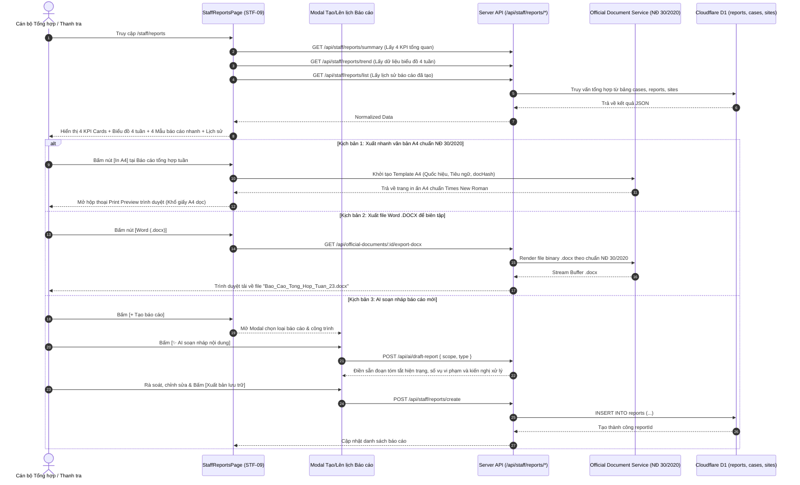

# STF-09 — Trung Tâm Báo Cáo, Thống Kê & Xuất Bản Nghị Định 30/2020 (Staff Reports & Administrative Publishing)

> **Tài liệu đặc tả màn hình chuẩn SSOT (Single Source of Truth) — DustGuard VN CivicTech Platform**  
> Trung tâm phân tích số liệu, tổng hợp xu hướng ô nhiễm bụi công trình 4 tuần và xuất bản văn bản điều hành hành chính chuẩn **Nghị định 30/2020/NĐ-CP** (Quốc hiệu, Tiêu ngữ, Số ký hiệu, Mẫu tờ trình UBND Quận, xuất file Word `.DOCX` / In ấn `PDF A4` với mã băm toàn vẹn `docHash`), tích hợp trợ lý AI soạn nháp và cấu hình tự động gửi email 08:00 sáng Thứ Hai hàng tuần.

---

## 1. Screen Identity

| Thuộc tính | Giá trị SSOT | Ghi chú kỹ thuật |
|---|---|---|
| **Mã màn hình** | `STF-09` | Mã định danh chuẩn trong Design System |
| **Tên tiếng Việt** | Báo cáo, thống kê & Xuất bản điều hành | Nhãn hiển thị chính thức trên hệ thống |
| **Tên tiếng Anh** | Staff Reports & Administrative Publishing | Tên tiếng Anh đối ngoại & API Contract |
| **Đường dẫn (Route)** | `/staff/reports` | Canonical Route (Redirects tự động từ `/executive/reports`) |
| **Component Path** | [`app/src/apps/staff/pages/reports/StaffReportsPage.jsx`](file:///d:/07-Competitions-Hackathons/unicef-dustguard/app/src/apps/staff/pages/reports/StaffReportsPage.jsx) | React 19 Client Component |
| **Backend Service / Route** | [`app/server/routes/api/staff-reports.js`](file:///d:/07-Competitions-Hackathons/unicef-dustguard/app/server/routes/api/staff-reports.js) | Express / Worker Hono API Controller |
| **Văn bản Engine (NĐ 30/2020)** | [`app/server/services/official-document.service.js`](file:///d:/07-Competitions-Hackathons/unicef-dustguard/app/server/services/official-document.service.js) | Docx / PDF / AST Parser Engine |
| **Layout bọc** | [`app/src/apps/staff/layout/StaffLayout.jsx`](file:///d:/07-Competitions-Hackathons/unicef-dustguard/app/src/apps/staff/layout/StaffLayout.jsx) | Sidebar 8 mục nghiệp vụ điều hành Staff |
| **Vai trò truy cập (Role)** | `staff`, `executive`, `admin` | Cán bộ Thanh tra, Trưởng phòng TN&MT, Lãnh đạo UBND |
| **Trạng thái thực thi** | **ACTIVE (Level 5 Production Coherent)** | Kết nối 100% CSDL D1 thật, Zero-Mock |

---

## 2. Mục Đích & Giá Trị Thực Tế

### 2.1. Mục đích thiết kế
Màn hình **STF-09** là "Phòng tổng hợp tham mưu số" phục vụ cán bộ thanh tra môi trường và lãnh đạo cơ quan quản lý đô thị. Màn hình giúp giải quyết 4 yêu cầu nghiệp vụ cấp thiết:
1. *Cung cấp bức tranh toàn cảnh 4 tuần về công tác kiểm soát ô nhiễm bụi*: So sánh khối lượng hồ sơ phát sinh mới, số vụ việc đã hoàn tất và số vụ việc quá hạn $SLA > 48\text{h}$.
2. *Xuất bản văn bản hành chính chuẩn Nghị định 30/2020/NĐ-CP*: Tự động điền đầy đủ Quốc hiệu, Tiêu ngữ, Tên cơ quan ban hành, Số ký hiệu văn bản, Căn cứ pháp lý (Luật BVMT 72/2020/QH14, Nghị định 16/2022/NĐ-CP, QCVN 05:2023/BTNM), tạo file `.DOCX` biên tập được hoặc in trực tiếp ra khổ `A4` kèm mã băm an toàn `docHash`.
3. *Hỗ trợ AI soạn nháp tờ trình & báo cáo*: Trợ lý AI tự động tổng hợp số liệu, phát hiện công trình tái phạm nhiều lần và soạn sẵn dự thảo báo cáo để cán bộ rà soát trước khi ký duyệt (`✨ AI soạn nháp, bạn duyệt trước`).
4. *Tự động hóa báo cáo giao ban đầu tuần*: Lên lịch tự động kết xuất dữ liệu và gửi email báo cáo tổng hợp vào đúng 08:00 sáng Thứ Hai đến hộp thư Ban Giám đốc và Lãnh đạo UBND Quận.

### 2.2. Giá trị thực tế & Thay thế cách làm cũ (Civic Value)
- **Thay thế 4 - 6 giờ tổng hợp Excel thủ công mỗi cuối tuần**: Cán bộ không còn phải copy-paste số liệu từ nhiều sổ tay hay bảng tính rời rạc. Toàn bộ chỉ số $KPI$, tỷ lệ giải quyết đúng hạn ($89\%$) và danh sách vi phạm được tính toán tự động bằng SQL Aggregation từ Cloudflare D1 trong $< 0.05\text{s}$.
- **Chuẩn hóa thể thức văn bản hành chính Việt Nam (NĐ 30/2020/NĐ-CP)**:
  - Bố cục 2 cột đầu trang: Cột trái (Cơ quan chủ quản & Cơ quan ban hành, Số ký hiệu `.../BC-TTXD`), Cột phải (Quốc hiệu in hoa đứng đậm, Tiêu ngữ in thường đứng, Địa danh và ngày tháng năm in nghiêng).
  - Phông chữ tiêu chuẩn hành chính: *Times New Roman*, cỡ chữ $13\text{pt} - 14\text{pt}$, lề trang A4 chuẩn (Trên $20\text{mm}$, Dưới $20\text{mm}$, Trái $30\text{mm}$, Phải $15\text{mm}$).
  - **Nguyên tắc an toàn pháp lý**: Hệ thống **tuyệt đối không render con dấu mộc đỏ ảo**, bảo đảm văn bản in ra được ký tươi và đóng dấu mộc thực tế bởi người có thẩm quyền.
- **Tính toàn vẹn & Chống làm giả số liệu (Tamper-Evident `docHash`)**: Mỗi báo cáo và biên bản xuất ra đều được tạo mã băm SHA-256 in ở góc dưới chân trang, cho phép thanh tra đối soát lại bản gốc trong CSDL bất cứ lúc nào.

---

## 3. Đối Tượng Người Dùng & Hành Trình Thao Tác (User Journey)

### 3.1. Đối tượng sử dụng
- **Cán bộ tổng hợp / Thanh tra viên môi trường**: Lập báo cáo chuyên đề tuần/tháng, xuất biên bản xử lý vi phạm, trình dự thảo lên Lãnh đạo.
- **Lãnh đạo Đội Thanh tra / Trưởng Phòng TN&MT**: Xem xét biểu đồ xu hướng 4 tuần, phê duyệt dự thảo báo cáo do AI soạn nháp, ký phát hành văn bản.
- **Lãnh đạo UBND Quận / Sở TN&MT**: Nhận báo cáo định kỳ sáng Thứ Hai để chỉ đạo điều hành trên toàn địa bàn.

### 3.2. Sơ đồ hành trình tác nghiệp (Sequence Diagram & Core Flow)



---

## 4. Bố Cục Giao Diện & Phân Cấp Thông Tin (Information Hierarchy)

### 4.1. Khung dây giao diện tổng thể (ASCII Wireframe)

```text
+--------------------------------------------------------------------------------------------------------------------+
| [Staff Layout Header] Trang chính / Báo cáo                                        (🔔 8) [Cán bộ: Nguyễn Minh An] |
+--------------------------------------------------------------------------------------------------------------------+
|                                                                                                                    |
|  Báo cáo và chia sẻ                        [✨ AI soạn nháp, bạn duyệt trước]  [+ Tạo báo cáo] (Đỏ) [📅 Lên lịch]  |
|  Tạo, xuất bản và chia sẻ kết quả theo dõi ô nhiễm bụi định kỳ chuẩn Nghị định 30/2020/NĐ-CP.                      |
|                                                                                                                    |
|  +---------------------+  +---------------------+  +---------------------+  +---------------------+                |
|  | 📁 Hồ sơ tuần này   |  | ✅ Đã hoàn tất      |  | ⚠️ Quá hạn          |  | 🎯 Tỷ lệ đúng hạn   |                |
|  |   128               |  |   96                |  |   12                |  |   89%               |                |
|  | ↑ 18 so với tuần tr |  | ↑ 14 so với tuần tr |  | ↑ 3 (Cảnh báo đỏ)   |  | ↑ 6% so với tuần tr |                |
|  +---------------------+  +---------------------+  +---------------------+  +---------------------+                |
|                                                                                                                    |
|  +--------------------------------------------------+ +---------------------------------------------------------+  |
|  | KẾT QUẢ 4 TUẦN GẦN ĐÂY (~58% Chiều rộng)         | | 📋 BÁO CÁO NHANH CHUẨN NĐ 30/2020 (~42% Chiều rộng)      |  |
|  +--------------------------------------------------+ +---------------------------------------------------------+  |
|  | Biểu đồ cột so sánh: [■ Tạo mới] [■ Xong] [■ Quá]| | 1. Báo cáo tổng hợp tuần                                 |  |
|  |                                                  | |    Tổng hợp chỉ số, vụ việc và công trình vi phạm.       |  |
|  |  140 |        ■                                  | |    [PDF A4]  [Word .docx]  [Excel CSV]  [Lên lịch]        |  |
|  |  100 |   ■    ■ ■                                | | ----------------------------------------------------- |  |
|  |   60 |   ■ ■  ■ ■   ■ ■                          | | 2. Báo cáo các vụ việc quá hạn (Trễ SLA > 48h)         |  |
|  |   20 |   ■ ■  ■ ■ ■ ■ ■                          | |    Danh sách công trình chây ì chưa khắc phục bạt che. |  |
|  |    0 +---------------------------                | |    [PDF A4]  [Word .docx]  [Excel CSV]                     |  |
|  |       Tuần 20  Tuần 21  Tuần 22  Tuần 23         | | ----------------------------------------------------- |  |
|  |                                                  | | 3. Báo cáo chuyên đề theo công trình xây dựng          |  |
|  | ⚙️ Tự động gửi email: [BẬT/TẮT Toggle]           | |    Lịch sử quan trắc PM10/PM2.5 và ảnh Before/After.   |  |
|  |    Gửi lúc 08:00 sáng Thứ Hai hàng tuần          | |    [PDF A4]  [Word .docx]  [Excel CSV]                     |  |
|  |    Người nhận: ban.giamdoc@moitruong.gov.vn      | | 4. Báo cáo phân tích theo địa bàn / Phường             |  |
|  +--------------------------------------------------+ +---------------------------------------------------------+  |
|                                                                                                                    |
|  +----------------------------------------------------------------------------------------------------------------+
|  | DANH SÁCH BÁO CÁO ĐÃ XUẤT BẢN                                                                                  |
|  +----------------------------------------------------------------------------------------------------------------+
|  | TÊN BÁO CÁO                 | PHẠM VI ÁP DỤNG       | NGÀY TẠO   | NGƯỜI TẠO         | THAO TÁC XUẤT           |
|  |-----------------------------+-----------------------+------------+-------------------+-------------------------|
|  | Báo cáo tổng hợp Tuần 23    | Toàn địa bàn Quận     | 02/09/2026 | Hệ thống tự động  | [Xuất CSV]  [In A4 NĐ30]|
|  | Báo cáo vi phạm Starlake    | Dự án KĐT Starlake    | 01/09/2026 | Nguyễn Minh An    | [Xuất CSV]  [In A4 NĐ30]|
|  | Báo cáo chuyên đề Tháng 8   | 14 Phường thuộc Quận  | 31/08/2026 | Đội Thanh tra MT  | [Xuất CSV]  [In A4 NĐ30]|
|  +----------------------------------------------------------------------------------------------------------------+
```

### 4.2. Khung mẫu văn bản in ấn A4 chuẩn Nghị định 30/2020/NĐ-CP (Print Layout)

```text
+--------------------------------------------------------------------------------------------------------------------+
|  ỦY BAN NHÂN DÂN QUẬN THANH XUÂN                      CỘNG HÒA XÃ HỘI CHỦ NGHĨA VIỆT NAM                           |
|  ĐỘI THANH TRA XÂY DỰNG & ĐÔ THỊ                             Độc lập - Tự do - Hạnh phúc                           |
|  Số: 23/BC-TTXD                                      --------------------------------------                        |
|                                                      Thanh Xuân, ngày 02 tháng 09 năm 2026                         |
|                                                                                                                    |
|                                             BÁO CÁO TỔNG HỢP                                                       |
|              Tình hình kiểm soát bụi phát tán và xử lý vi phạm tại các công trình xây dựng                         |
|                                            (Tuần 23 / Năm 2026)                                                    |
|                                                                                                                    |
|  Kính gửi: Ủy ban nhân dân Quận Thanh Xuân.                                                                        |
|                                                                                                                    |
|  I. KẾT QUẢ KIỂM SOÁT VÀ XỬ LÝ HỒ SƠ                                                                              |
|  - Tổng số hồ sơ phát sinh trong tuần: 128 hồ sơ (tăng 18 hồ sơ so với tuần trước).                               |
|  - Số hồ sơ đã xử lý hoàn tất: 96 hồ sơ (đạt tỷ lệ đúng hạn 89%).                                                 |
|  - Số hồ sơ quá hạn chưa khắc phục: 12 hồ sơ (đang đôn đốc kiểm tra thực địa).                                    |
|                                                                                                                    |
|  II. DANH SÁCH CÁC CÔNG TRÌNH VI PHẠM ĐIỂN HÌNH                                                                    |
|  +-----+-----------------------------------+--------------------+------------------------+----------------------+  |
|  | STT | Tên công trình xây dựng           | Địa điểm           | Hành vi vi phạm        | Biện pháp xử lý      |  |
|  +-----+-----------------------------------+--------------------+------------------------+----------------------+  |
|  | 01  | Khu phức hợp Starlake Tây Hồ Tây  | Phường Xuân La     | Không phủ bạt bãi cát  | Lập biên bản VPHC    |  |
|  | 02  | Tổ hợp Thương mại Rivera Park     | Phường Vũ Trọng Phụng | Bụi PM10 vượt 185 µg/m³| Tạm đình chỉ 24h     |  |
|  +-----+-----------------------------------+--------------------+------------------------+----------------------+  |
|                                                                                                                    |
|  III. KIẾN NGHỊ VÀ ĐỀ XUẤT                                                                                         |
|  Đề nghị UBND Quận chỉ đạo các phường tăng cường kiểm tra đột xuất vào khung giờ 20h00 - 23h00.                    |
|                                                                                                                    |
|  Nơi nhận:                                                      ĐỘI TRƯỞNG THANH TRA XÂY DỰNG                      |
|  - UBND Quận (để b/c);                                           (Ký, ghi rõ họ tên và đóng dấu thực tế)            |
|  - Phòng TN&MT Quận;                                                                                               |
|  - Lưu: VT, TTXD.                                               Nguyễn Văn Hùng                                    |
|                                                                                                                    |
|  [Mã băm an toàn docHash: 8f9b2c3d4e5f6a7b8c9d0e1f2a3b4c5d6e7f8a9b — Hệ thống DustGuard VN]                       |
+--------------------------------------------------------------------------------------------------------------------+
```

---

## 5. Dữ Liệu & Hợp Đồng API / CSDL D1 (Data Contract)

### 5.1. Các Endpoints API Phân Hệ Báo Cáo

#### A. Lấy thống kê 4 thẻ KPI tổng quan
```http
GET /api/staff/reports/summary
Authorization: Bearer <staff_jwt_token>
```
**Response JSON SSOT**:
```json
{
  "success": true,
  "data": {
    "weeklyCases": 128,
    "completedCases": 96,
    "overdueCases": 12,
    "onTimeRate": 89
  },
  "message": "Thống kê báo cáo"
}
```

#### B. Lấy dữ liệu biểu đồ xu hướng 4 tuần
```http
GET /api/staff/reports/trend
Authorization: Bearer <staff_jwt_token>
```
**Response JSON SSOT**:
```json
{
  "success": true,
  "data": {
    "weeklyData": [
      { "week": "Tuần 20", "created": 90, "completed": 72, "overdue": 8 },
      { "week": "Tuần 21", "created": 105, "completed": 81, "overdue": 9 },
      { "week": "Tuần 22", "created": 118, "completed": 88, "overdue": 11 },
      { "week": "Tuần 23", "created": 128, "completed": 96, "overdue": 12 }
    ]
  },
  "message": "Xu hướng báo cáo 4 tuần"
}
```

#### C. Lấy danh sách lịch sử báo cáo đã tạo
```http
GET /api/staff/reports/list
Authorization: Bearer <staff_jwt_token>
```
**Response JSON SSOT**:
```json
{
  "success": true,
  "data": {
    "items": [
      {
        "id": "rep_01jk99a1",
        "name": "Báo cáo tổng hợp tình hình ô nhiễm bụi Tuần 23",
        "scope": "Toàn địa bàn Quận Thanh Xuân",
        "createdAt": "02/09/2026",
        "createdBy": "Hệ thống tự động",
        "status": "ready"
      },
      {
        "id": "rep_01jk99b2",
        "name": "Tờ trình xử phạt vi phạm thi công Dự án Starlake",
        "scope": "Khu đô thị Starlake",
        "createdAt": "01/09/2026",
        "createdBy": "Nguyễn Minh An (Thanh tra viên)",
        "status": "ready"
      }
    ]
  },
  "message": "Danh sách báo cáo"
}
```

#### D. Tạo mới báo cáo lưu trữ trong CSDL D1
```http
POST /api/staff/reports/create
Content-Type: application/json
Authorization: Bearer <staff_jwt_token>

{
  "name": "Báo cáo chuyên đề kiểm tra bụi Vành Đai 4 - Tháng 8",
  "reportType": "CONSTRUCTION_SITE",
  "projectId": "site_hn_0428",
  "dateFrom": "2026-08-01",
  "dateTo": "2026-08-31",
  "createdBy": "Nguyễn Minh An"
}
```

#### E. Xuất dữ liệu bảng thô định dạng CSV
```http
GET /api/staff/reports/:id/export-csv
```
*Trả về luồng file text/csv UTF-8 kèm ký tự BOM `\uFEFF` để hiển thị tiếng Việt hoàn hảo trên Microsoft Excel.*

### 5.2. Các bảng D1 SQLite tham gia truy vấn (SSOT Schema)

```sql
-- 1. Bảng lưu trữ báo cáo xuất bản (reports)
CREATE TABLE IF NOT EXISTS reports (
  id TEXT PRIMARY KEY,
  name TEXT NOT NULL,
  report_type TEXT NOT NULL DEFAULT 'GENERAL',
  project_id TEXT REFERENCES sites(id),
  date_from DATE,
  date_to DATE,
  status TEXT DEFAULT 'ready',
  doc_hash TEXT,
  file_url TEXT,
  created_by TEXT,
  created_at DATETIME DEFAULT CURRENT_TIMESTAMP,
  updated_at DATETIME DEFAULT CURRENT_TIMESTAMP
);

-- 2. Bảng cấu hình lịch gửi email tự động (report_schedules)
CREATE TABLE IF NOT EXISTS report_schedules (
  id TEXT PRIMARY KEY,
  report_type TEXT NOT NULL DEFAULT 'WEEKLY',
  recipient_emails TEXT NOT NULL,
  frequency TEXT DEFAULT 'weekly',
  day_of_week INTEGER DEFAULT 1, -- 1 = Thứ Hai
  send_hour INTEGER DEFAULT 8,   -- 8h sáng
  enabled INTEGER DEFAULT 1,
  created_at DATETIME DEFAULT CURRENT_TIMESTAMP,
  updated_at DATETIME DEFAULT CURRENT_TIMESTAMP
);

CREATE INDEX IF NOT EXISTS idx_reports_created_at ON reports(created_at DESC);
CREATE INDEX IF NOT EXISTS idx_reports_project_id ON reports(project_id);
```

---

## 6. Hành Động Cốt Lõi (CTAs & Interactions)

| Hành động (CTA) | Vị trí kích hoạt | Màu sắc & Định dạng | Hành vi & Phản hồi hệ thống | Phân quyền (RBAC) |
|---|---|---|---|:---:|
| **`[+ Tạo báo cáo]`** | Góc phải Header trang | Nền đỏ son `#B91C1C`, chữ trắng đậm, `min-h-[38px]` | Mở Modal Tạo báo cáo tùy biến (Chọn phạm vi, thời gian, loại báo cáo và kích hoạt AI soạn nháp). | `staff`, `admin` |
| **`[📅 Lên lịch gửi]`** | Cạnh nút tạo báo cáo | Nền trắng viền `#E7E5E4`, chữ đen đậm | Mở modal cấu hình danh sách email nhận báo cáo tự động lúc 08:00 sáng Thứ Hai. | `staff`, `admin` |
| **`[✨ AI soạn nháp]`** | Huy hiệu tím trên Header / Modal | Nền `#F5F3FF`, chữ tím violet `#7C3AED` | Tự động phân tích điểm nóng dữ liệu và sinh nội dung trích yếu, tóm tắt hiện trạng. | `staff`, `admin` |
| **`[PDF A4]`** | Khối 4 mẫu báo cáo nhanh | Nền đỏ nhạt `#FEF2F2`, chữ đỏ son `#B91C1C` | Mở trực tiếp chế độ in ấn A4 chuẩn Nghị định 30/2020/NĐ-CP (có mã băm `docHash`). | `staff`, `admin` |
| **`[Word .docx]`** | Khối 4 mẫu báo cáo nhanh | Nền xanh dương `#EFF6FF`, chữ xanh `#2563EB` | Tải xuống file `.docx` định dạng Times New Roman 13pt để chỉnh sửa trên Word. | `staff`, `admin` |
| **`[Excel CSV]`** | Khối 4 mẫu / Bảng lịch sử | Nền xanh lá `#F0FDF4`, chữ xanh `#16A34A` | Tải file `.csv` có UTF-8 BOM chuẩn để phân tích số liệu trên Excel/Google Sheets. | `staff`, `admin` |
| **`[In A4 NĐ30]`** | Tại từng dòng lịch sử báo cáo | Nền xám nhạt `#F5F5F4`, viền đen | Render trang in A4 chuẩn thể thức hành chính cho bản ghi báo cáo đã chọn. | `staff`, `admin` |
| **`[Bật/Tắt Lịch Gửi]`** | Khung cấu hình tự động | Nút Toggle Switch xanh lá/xám | Cập nhật trường `enabled` trong bảng `report_schedules` của D1 SQLite. | `staff`, `admin` |

---

## 7. Quy Chuẩn UI/UX & Responsive (Design System Tokens)

### 7.1. Bảng màu Civic Tech High-Contrast (Không Glassmorphism)
- **Nền trang chính**: `#FAFAF9` (Stone-50 — Màu kem sáng văn phòng chuẩn mực).
- **Nền Khối Card / Biểu đồ**: `#FFFFFF` nguyên khối, viền `#E7E5E4` (Stone-200), bóng đổ nhẹ `shadow-2xs`.
- **Màu văn bản chính**: `#1C1917` (Stone-900 — Đen mực in sắc nét, độ tương phản $\ge 7:1$).
- **Màu biểu đồ 3 cột**:
  - *Hồ sơ tạo mới*: Xanh dương `#2563EB`.
  - *Hồ sơ đã xong*: Xanh lục `#16A34A`.
  - *Hồ sơ quá hạn*: Đỏ son `#B91C1C`.
- **Màu Huy hiệu AI Assistant**: Nền `#F5F3FF`, viền `#DDD6FE`, chữ `#7C3AED` (Tím violet nhẹ nhàng, không gây chói).

### 7.2. Chuẩn hiển thị Responsive Đa Màn Hình
- **Laptop 14-inch (1366x768, 1440x900, 1536x864 scale 125%)**:
  - Bố cục 2 khối ngang cân đối: Biểu đồ 4 tuần chiếm $58\%$, 4 Thẻ mẫu báo cáo nhanh chiếm $42\%$ trên lưới `grid-cols-12`.
  - Header và các nút xuất bản không bị ngắt dòng (`whitespace-nowrap`), không xuất hiện thanh cuộn ngang trang.
- **Tablet (768px - 1024px)**:
  - 4 Thẻ KPI xếp thành lưới 2x2.
  - Biểu đồ 4 tuần và 4 Mẫu báo cáo nhanh chuyển sang bố cục xếp chồng dọc (1 cột).
- **Mobile (360px - 430px)**:
  - 4 Thẻ KPI xếp 1 cột dọc hoặc cuộn ngang.
  - Các nút tải `[PDF]`, `[Word]`, `[CSV]` dàn đều $100\%$ chiều rộng để thao tác chạm $\ge 44\text{px}$ nhanh chóng.
- **Chế độ In Ấn A4 (`@media print`)**:
  - Tự động ẩn Sidebar điều hành, ẩn Header hệ thống và các nút bấm.
  - Căn lề chuẩn: Trên $20\text{mm}$, Dưới $20\text{mm}$, Trái $30\text{mm}$, Phải $15\text{mm}$.
  - Phông chữ bắt buộc *Times New Roman*, màu mực in đen `#000000` thuần túy.

---

## 8. Bẫy Lỗi Thường Gặp & Hướng Dẫn Kiểm Thử (Verification)

### 8.1. Các bẫy lỗi tiềm ẩn & Cơ chế phòng ngừa
1. **Lỗi lỗi phông chữ tiếng Việt trên Microsoft Excel khi mở file CSV**: Excel trên Windows thường mặc định mở file CSV bằng bảng mã Windows-1252 gây lỗi font tiếng Việt.
   - *Khắc phục*: Endpoint `/api/staff/reports/:id/export-csv` bắt buộc ghi thêm ký tự **UTF-8 Byte Order Mark (BOM: `\uFEFF`)** vào đầu luồng dữ liệu trước khi gửi response.
2. **Lỗi render con dấu mộc đỏ đồ họa ảo**: Một số hệ thống phần mềm vẽ dấu mộc đỏ giả mạo gây rủi ro pháp lý theo quy định quản lý con dấu của Bộ Công an.
   - *Khắc phục*: Tuân thủ nguyên tắc SSOT trong `official-document.service.js` — chỉ để trống khung ký tên kèm ghi chú in ấn, việc đóng dấu mộc thực hiện trực tiếp trên bản in giấy.
3. **Lỗi sai lệch số liệu biểu đồ khi chuyển tuần**: Vào ngày đầu tháng hoặc đầu năm, số tuần có thể bị nhảy lệch.
   - *Khắc phục*: Tính toán chuỗi 4 tuần qua hàm chuẩn hóa `getISOWeek()` và truy vấn `GROUP BY strftime('%Y-%W', createdAt)`.

### 8.2. Bộ lệnh kiểm thử nhanh PowerShell CLI (< 0.5s)

```powershell
# 1. Kiểm thử định dạng văn bản hành chính NĐ 30/2020 & Docx Parser
node --test app/tests/administrative-document-studio.test.js

# 2. Kiểm thử tính toàn vẹn báo cáo & Export CSV/PDF
node --test app/tests/docx-legal-exporter.test.js

# 3. Kiểm thử phân hệ Reports API từ D1 SQLite
node --test app/tests/executive-dashboard.test.js
```
