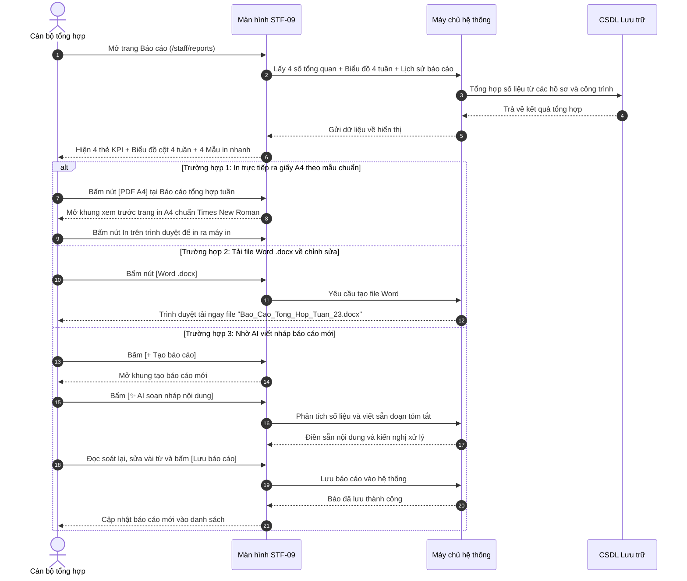

# STF-09 — Tổng Hợp Báo Cáo & In Văn Bản Hành Chính (Xuất Báo Cáo Chuẩn Mẫu Nhà Nước)

> **Tài liệu hướng dẫn & đặc tả màn hình — Hệ thống DustGuard VN**  
> Màn hình giúp cán bộ xem biểu đồ tổng kết tình hình kiểm soát bụi 4 tuần gần nhất, xuất báo cáo in ra giấy A4 hoặc tải file Word `.docx` chuẩn theo thể thức văn bản hành chính nhà nước (Nghị định 30/2020/NĐ-CP), sử dụng AI viết sẵn bản nháp và tự động gửi email báo cáo giao ban vào 8h00 sáng Thứ Hai hàng tuần.

---

## 1. Thông Tin Màn Hình (Screen Identity)

| Mục | Nội dung | Giải thích dễ hiểu |
|---|---|---|
| **Mã màn hình** | `STF-09` | Mã viết tắt để tra cứu nhanh trong tài liệu |
| **Tên tiếng Việt** | **Tổng hợp báo cáo & in văn bản hành chính** | Tên gọi hiển thị trên thanh menu bên trái |
| **Tên tiếng Anh** | Staff Reports & Administrative Publishing | Tên dùng khi kết nối kỹ thuật |
| **Đường dẫn (URL)** | `/staff/reports` | Địa chỉ trang web trên trình duyệt |
| **File giao diện** | [`app/src/apps/staff/pages/reports/StaffReportsPage.jsx`](file:///d:/07-Competitions-Hackathons/unicef-dustguard/app/src/apps/staff/pages/reports/StaffReportsPage.jsx) | File mã nguồn hiển thị giao diện |
| **File tạo văn bản** | [`app/server/routes/api/staff-reports.js`](file:///d:/07-Competitions-Hackathons/unicef-dustguard/app/server/routes/api/staff-reports.js) | File máy chủ tổng hợp số liệu và xuất file Word/A4 |
| **Ai được dùng?** | Cán bộ thanh tra, người tổng hợp, lãnh đạo đơn vị | Người dân và nhà thầu không vào được trang này |
| **Tình trạng kết nối** | **Đang hoạt động tốt** | Lấy dữ liệu thật từ hệ thống lưu trữ |

---

## 2. Mục Đích & Nghiệp Vụ Thực Tế

### 2.1. Cán bộ dùng màn hình này để làm gì?
Thay vì phải ngồi cộng sổ, làm bảng tính Excel thủ công mất hàng giờ mỗi cuối tuần, màn hình này giúp cán bộ:
1. **Nắm trọn bức tranh 4 tuần chỉ trong 5 giây**:
   - Biết tuần này có bao nhiêu vụ việc mới phát sinh, bao nhiêu vụ đã xử lý xong và bao nhiêu vụ bị quá hạn 48 giờ.
   - Tỷ lệ xử lý đúng hạn đạt bao nhiêu phần trăm (ví dụ: $89\%$).
2. **Xuất báo cáo in giấy A4 chuẩn thể thức văn bản nhà nước (Nghị định 30/2020/NĐ-CP)**:
   - Tự động điền đầy đủ Quốc hiệu, Tiêu ngữ, Tên cơ quan ban hành, Số ký hiệu văn bản, Căn cứ pháp lý theo Luật Bảo vệ môi trường.
   - In trực tiếp ra giấy A4 với phông chữ chuẩn *Times New Roman*, căn lề chuẩn chỉ để trình Lãnh đạo ký tươi và đóng dấu mộc thực tế.
   - Tải file Word `.docx` về máy tính nếu muốn chỉnh sửa thêm câu chữ.
3. **AI viết nháp báo cáo giúp cán bộ (`✨ AI soạn nháp, bạn duyệt trước`)**:
   - Trợ lý AI tự động gom số liệu các công trình vi phạm nhiều lần, viết sẵn đoạn mở đầu, nội dung và kiến nghị xử lý để cán bộ rà soát trước khi ký.
4. **Tự động gửi email báo cáo giao ban đầu tuần**:
   - Cài đặt hệ thống tự động tổng hợp và gửi email báo cáo vào đúng 08:00 sáng Thứ Hai đến hộp thư của Ban Giám đốc và Lãnh đạo Quận.

### 2.2. Giá trị thực tế thay thế cách làm cũ
- **Tiết kiệm 4 - 6 giờ làm báo cáo mỗi tuần**: Không còn phải copy-paste số liệu từ nhiều nguồn. Toàn bộ số liệu được máy tính tự động tổng hợp từ dữ liệu thực tế.
- **Tuyệt đối không dùng con dấu mộc đỏ ảo trên máy tính**: Văn bản in ra để trống phần chữ ký và đóng dấu thực tế bằng con dấu của cơ quan, đảm bảo đúng quy định pháp luật.
- **Có mã an toàn chống sửa số liệu ở chân trang**: Mỗi báo cáo in ra đều có một đoạn mã kiểm tra ở chân trang, giúp đối chiếu lại dữ liệu gốc trong hệ thống bất cứ lúc nào.

---

## 3. Đối Tượng Người Dùng & Các Bước Thực Hiện

### 3.1. Ai sử dụng màn hình này?
- **Cán bộ tổng hợp / Thanh tra viên**: Tạo báo cáo tuần/tháng, in biên bản kiểm tra, tải file Word gửi lãnh đạo duyệt.
- **Tổ trưởng / Trưởng phòng**: Xem biểu đồ xu hướng 4 tuần, duyệt dự thảo báo cáo do AI soạn nháp.
- **Lãnh đạo cơ quan**: Nhận email báo cáo tự động sáng Thứ Hai để chỉ đạo công việc.

### 3.2. Sơ đồ các bước xử lý hàng ngày



---

## 4. Bố Cục Giao Diện & Hình Minh Họa Dễ Hiểu (Wireframe)

### 4.1. Khung nhìn tổng thể trên màn hình máy tính (14 inch trở lên)

```text
+--------------------------------------------------------------------------------------------------------------------+
| [THANH TIÊU ĐỀ TRÊN CÙNG]                                                          (🔔 8) [Cán bộ: Nguyễn Minh An] |
| Báo cáo và chia sẻ                        [✨ AI soạn nháp, bạn duyệt trước]  [+ Tạo báo cáo] (Đỏ) [📅 Lên lịch]  |
| Tạo, xuất bản và chia sẻ kết quả theo dõi ô nhiễm bụi định kỳ chuẩn mẫu quy định nhà nước.                         |
+--------------------------------------------------------------------------------------------------------------------+
| [4 THẺ TÓM TẮT SỐ LIỆU TUẦN NÀY]                                                                                   |
| +---------------------+  +---------------------+  +---------------------+  +---------------------+                 |
| | 📁 HỒ SƠ PHÁT SINH  |  | ✅ ĐÃ XỬ LÝ XONG    |  | ⚠️ BỊ QUÁ HẠN 48H   |  | 🎯 TỶ LỆ ĐÚNG HẠN   |                 |
| | 128 hồ sơ           |  | 96 hồ sơ            |  | 12 hồ sơ            |  | 89%                 |                 |
| | ↑ Tăng 18 hồ sơ     |  | ↑ Xong nhiều hơn 14 |  | Cần đôn đốc xử lý   |  | Tăng 6% so tuần tr  |                 |
| +---------------------+  +---------------------+  +---------------------+  +---------------------+                 |
|                                                                                                                    |
| [2 KHỐI LÀM VIỆC CHÍNH Ở GIỮA TRANG]                                                                               |
| +--------------------------------------------------+ +---------------------------------------------------------+   |
| | KHỐI 1: KẾT QUẢ 4 TUẦN GẦN ĐÂY (~58% Bề ngang)   | | KHỐI 2: 4 MẪU BÁO CÁO IN NHANH (~42% Bề ngang)          |   |
| +--------------------------------------------------+ +---------------------------------------------------------+   |
| | Biểu đồ cột: [■ Tạo mới] [■ Đã xong] [■ Quá hạn] | | 1. Báo cáo tổng hợp tuần                                 |   |
| |                                                  | |    Tổng hợp số đo bụi, các vụ vi phạm trong tuần.        |   |
| |  140 |        ■                                  | |    [PDF A4]  [Word .docx]  [Excel CSV]  [Lên lịch]        |   |
| |  100 |   ■    ■ ■                                | | ----------------------------------------------------- |   |
| |   60 |   ■ ■  ■ ■   ■ ■                          | | 2. Báo cáo các công trình vi phạm quá hạn              |   |
| |   20 |   ■ ■  ■ ■ ■ ■ ■                          | |    Danh sách công trình chây ì chưa che chắn bạt.     |   |
| |    0 +---------------------------                | |    [PDF A4]  [Word .docx]  [Excel CSV]                     |   |
| |       Tuần 20  Tuần 21  Tuần 22  Tuần 23         | | ----------------------------------------------------- |   |
| |                                                  | | 3. Báo cáo chuyên đề riêng từng công trình             |   |
| | ⚙️ Tự động gửi email: [BẬT / TẮT]                | |    Lịch sử đo bụi và ảnh trước/sau khi khắc phục.      |   |
| |    Gửi lúc 08:00 sáng Thứ Hai hàng tuần          | |    [PDF A4]  [Word .docx]  [Excel CSV]                     |   |
| |    Người nhận: ban.giamdoc@moitruong.gov.vn      | | 4. Báo cáo phân tích theo phường / địa bàn             |   |
| +--------------------------------------------------+ +---------------------------------------------------------+   |
|                                                                                                                    |
| [BẢNG DANH SÁCH BÁO CÁO ĐÃ TẠO]                                                                                    |
| +----------------------------------------------------------------------------------------------------------------+ |
| | TÊN BÁO CÁO                 | PHẠM VI ÁP DỤNG       | NGÀY TẠO   | NGƯỜI TẠO         | THAO TÁC XUẤT           | |
| |-----------------------------+-----------------------+------------+-------------------+-------------------------| |
| | Báo cáo tổng hợp Tuần 23    | Toàn địa bàn Quận     | 02/09/2026 | Hệ thống tự động  | [Xuất CSV]  [In A4 NĐ30]| |
| | Báo cáo vi phạm Starlake    | Dự án KĐT Starlake    | 01/09/2026 | Nguyễn Minh An    | [Xuất CSV]  [In A4 NĐ30]| |
| | Báo cáo chuyên đề Tháng 8   | 14 Phường thuộc Quận  | 31/08/2026 | Đội Thanh tra MT  | [Xuất CSV]  [In A4 NĐ30]| |
| +----------------------------------------------------------------------------------------------------------------+ |
+--------------------------------------------------------------------------------------------------------------------+
```

### 4.2. Mẫu văn bản in ấn A4 chuẩn quy định nhà nước (Khi bấm In A4)

```text
+--------------------------------------------------------------------------------------------------------------------+
|  ỦY BAN NHÂN DÂN QUẬN THANH XUÂN                      CỘNG HÒA XÃ HỘI CHỦ NGHĨA VIỆT NAM                           |
|  ĐỘI THANH TRA XÂY DỰNG & ĐÔ THỊ                             Độc lập - Tự do - Hạnh phúc                           |
|  Số: 23/BC-TTXD                                      --------------------------------------                        |
|                                                      Thanh Xuân, ngày 02 tháng 09 năm 2026                         |
|                                                                                                                    |
|                                             BÁO CÁO TỔNG HỢP                                                       |
|              Tình hình kiểm soát bụi phát tán và xử lý vi phạm tại các công trình xây dựng                         |
|                                            (Tuần 23 / Năm 2026)                                                    |
|                                                                                                                    |
|  Kính gửi: Ủy ban nhân dân Quận Thanh Xuân.                                                                        |
|                                                                                                                    |
|  I. KẾT QUẢ KIỂM SOÁT VÀ XỬ LÝ HỒ SƠ                                                                              |
|  - Tổng số hồ sơ phát sinh trong tuần: 128 hồ sơ (tăng 18 hồ sơ so với tuần trước).                               |
|  - Số hồ sơ đã xử lý hoàn tất: 96 hồ sơ (đạt tỷ lệ đúng hạn 89%).                                                 |
|  - Số hồ sơ quá hạn chưa khắc phục: 12 hồ sơ (đang đôn đốc kiểm tra thực địa).                                    |
|                                                                                                                    |
|  II. DANH SÁCH CÁC CÔNG TRÌNH VI PHẠM ĐIỂN HÌNH                                                                    |
|  +-----+-----------------------------------+--------------------+------------------------+----------------------+  |
|  | STT | Tên công trình xây dựng           | Địa điểm           | Hành vi vi phạm        | Biện pháp xử lý      |  |
|  +-----+-----------------------------------+--------------------+------------------------+----------------------+  |
|  | 01  | Khu phức hợp Starlake Tây Hồ Tây  | Phường Xuân La     | Không phủ bạt bãi cát  | Lập biên bản VPHC    |  |
|  | 02  | Tổ hợp Thương mại Rivera Park     | Phường Vũ Trọng Phụng | Bụi PM10 vượt 185 µg/m³| Tạm đình chỉ 24h     |  |
|  +-----+-----------------------------------+--------------------+------------------------+----------------------+  |
|                                                                                                                    |
|  III. KIẾN NGHỊ VÀ ĐỀ XUẤT                                                                                         |
|  Đề nghị UBND Quận chỉ đạo các phường tăng cường kiểm tra đột xuất vào khung giờ 20h00 - 23h00.                    |
|                                                                                                                    |
|  Nơi nhận:                                                      ĐỘI TRƯỞNG THANH TRA XÂY DỰNG                      |
|  - UBND Quận (để b/c);                                           (Ký, ghi rõ họ tên và đóng dấu thực tế)            |
|  - Phòng TN&MT Quận;                                                                                               |
|  - Lưu: VT, TTXD.                                               Nguyễn Văn Hùng                                    |
|                                                                                                                    |
|  [Mã an toàn tra cứu: 8f9b2c3d4e5f6a7b8c9d0e1f2a3b4c5d6e7f8a9b — Hệ thống DustGuard VN]                             |
+--------------------------------------------------------------------------------------------------------------------+
```

---

## 5. Dữ Liệu & Liên Kết Hệ Thống

### 5.1. Các đường liên kết dữ liệu phục vụ màn hình

| Lệnh | Đường dẫn hệ thống | Mục đích sử dụng |
|---|---|---|
| `GET` | `/api/staff/reports/summary` | Lấy 4 số đếm tóm tắt ở đầu trang |
| `GET` | `/api/staff/reports/trend` | Lấy số liệu biểu đồ cột 4 tuần |
| `GET` | `/api/staff/reports/list` | Lấy danh sách các báo cáo đã xuất bản |
| `POST` | `/api/staff/reports/create` | Tạo và lưu báo cáo mới vào hệ thống |
| `GET` | `/api/official-documents/:id/export-docx` | Xuất và tải file Word `.docx` về máy tính |
| `GET` | `/api/staff/reports/:id/export-csv` | Xuất dữ liệu bảng thô ra file Excel `.csv` |
| `POST` | `/api/ai/draft-report` | Nhờ trợ lý AI soạn nháp nội dung báo cáo |

### 5.2. Các bảng lưu trữ trong hệ thống
1. **`reports`**: Lưu danh sách các báo cáo đã tạo (Tên báo cáo, loại báo cáo, ngày tạo, người tạo, mã tra cứu).
2. **`report_schedules`**: Lưu cài đặt gửi email tự động (Danh sách email người nhận, ngày gửi, giờ gửi, trạng thái bật/tắt).
3. **`cases` & `sites`**: Dữ liệu gốc các vụ việc và công trình dùng để máy tính tự động tổng hợp số liệu.

---

## 6. Danh Sách Nút Bấm & Thao Tác Thường Dùng

| Nút bấm / Thao tác | Vị trí trên màn hình | Hành vi khi bấm | Ai được bấm? |
|---|---|---|:---:|
| **`[+ Tạo báo cáo]`** (Đỏ) | Góc trên bên phải | Mở khung tạo báo cáo tùy chọn theo ngày, phường hoặc công trình. | Cán bộ, Tổ trưởng |
| **`[📅 Lên lịch]`** | Cạnh nút Tạo báo cáo | Mở khung cài đặt danh sách email nhận báo cáo tự động sáng Thứ Hai. | Cán bộ, Lãnh đạo |
| **`[✨ AI soạn nháp]`** | Nút tím trên đầu / trong khung tạo | Tự động phân tích dữ liệu và viết sẵn đoạn văn tóm tắt. | Mọi cán bộ |
| **`[PDF A4]`** | Khung 4 mẫu báo cáo nhanh | Mở ngay trang in A4 chuẩn mẫu nhà nước để in ra giấy. | Mọi cán bộ |
| **`[Word .docx]`** | Khung 4 mẫu báo cáo nhanh | Tải file Word chuẩn phông Times New Roman về máy để sửa. | Mọi cán bộ |
| **`[Excel CSV]`** | Khung 4 mẫu / Bảng danh sách | Tải file Excel có hỗ trợ tiếng Việt đầy đủ để phân tích số liệu. | Mọi cán bộ |
| **`[Bật / Tắt Lịch gửi]`** | Dưới biểu đồ 4 tuần | Bật hoặc tắt chức năng tự động gửi email báo cáo đầu tuần. | Cán bộ quản trị |

---

## 7. Quy Chuẩn Trình Bày & Trải Nghiệm Người Dùng (UI/UX)

### 7.1. Màu sắc rõ ràng, dễ nhìn (Không làm mờ kính)
- **Nền trang**: Màu kem sáng `#FAFAF9`, sạch sẽ, trang nhã chuẩn phong cách văn phòng công vụ.
- **Màu các cột biểu đồ**:
  - *Hồ sơ mới*: Màu xanh dương `#2563EB`.
  - *Đã xử lý xong*: Màu xanh lá `#16A34A`.
  - *Bị quá hạn*: Màu đỏ son `#B91C1C`.
- **Huy hiệu AI Assistant**: Nền tím nhạt `#F5F3FF`, chữ tím `#7C3AED` nhã nhặn, không chói mắt.
- **Trang in A4**: Nền giấy trắng thuần túy, chữ đen mực in `#000000`, phông chữ *Times New Roman* sắc nét.

### 7.2. Tương thích trên máy tính xách tay và khi in ấn
- **Máy tính xách tay (14 inch - 1366x768 / 1440x900)**:
  - Biểu đồ 4 tuần chiếm $58\%$ và Khung 4 mẫu in chiếm $42\%$ bề ngang cân đối.
  - Các nút bấm xếp thẳng hàng, không bị tràn ra ngoài màn hình.
- **Khi bấm In ra giấy A4 (`In ấn`)**:
  - Hệ thống tự động ẩn toàn bộ thanh menu bên trái, ẩn thanh tiêu đề web và các nút bấm.
  - Chỉ giữ lại đúng trang văn bản chuẩn lề: Trên $20\text{mm}$, Dưới $20\text{mm}$, Trái $30\text{mm}$, Phải $15\text{mm}$.

---

## 8. Những Lỗi Cần Tránh & Cách Kiểm Tra Nhanh

### 8.1. Những bẫy lỗi cần lưu ý
1. **Mở file Excel bị lỗi chữ tiếng Việt**: Mở file CSV trên Windows hay bị lỗi phông chữ tiếng Việt.
   - *Cách tránh*: Hệ thống luôn gắn mã chuẩn tiếng Việt (UTF-8 BOM) vào file để mở trên Excel hiển thị chữ có dấu hoàn hảo.
2. **Vẽ con dấu mộc đỏ ảo trên máy tính**: Phần mềm tự ý vẽ hình dấu mộc đỏ giả mạo là vi phạm quy định quản lý con dấu.
   - *Cách tránh*: Để trống khung ký tên để lãnh đạo ký tươi và đóng dấu mộc thật sau khi in ra giấy.
3. **Tính sai số tuần khi chuyển năm**: Ngày đầu năm hoặc đầu tháng có thể bị nhảy lệch tuần.
   - *Cách tránh*: Sử dụng cách tính tuần chuẩn ISO theo lịch Việt Nam.

### 8.2. Lệnh kiểm tra nhanh trên máy tính

```powershell
# 1. Kiểm tra mẫu văn bản hành chính và tạo file Word
node --test app/tests/administrative-document-studio.test.js

# 2. Kiểm tra xuất file Word và PDF A4
node --test app/tests/docx-legal-exporter.test.js

# 3. Kiểm tra số liệu tổng hợp báo cáo từ hệ thống
node --test app/tests/executive-dashboard.test.js

# 4. Kiểm tra toàn bộ chức năng nhanh
npm --prefix app run verify:quick
```
